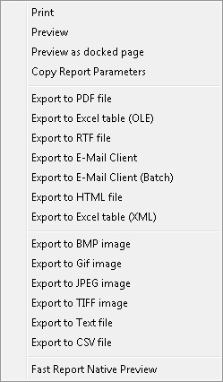

## Introduction

After clicking "Apply" on any report grid output, you'll find a small arrow on the Preview Button located on the right side. Clicking this arrow reveals a dropdown menu with various export and preview functions, as shown below:

Below are the details of each function (listed from top to bottom):

| Name | Properties |
|------|-------------|
| Print | Direct Print the report to printer. |
| Preview | Preview the report on screen. |
| Preview as docked page | Preview the report on screen as a docked page instead of a new window (Default). |
| Export to PDF file | Export the report to Portable Document Format (PDF). |
| Export to Excel table (OLE) | Export the report to Excel Object Linking and Embedding (OLE) (xls) format. |
| Export to RTF file | Export the report to Rich Text Format (RTF). |
| Export to E-Mail Client | E-mail the report as an attachment using the default Windows E-Mail client (e.g., Microsoft Outlook, Outlook Express, Mozilla Thunderbird, or Windows Live Mail). |
| Export to E-Mail Client (Batch) | E-mail the report as an attachment using the default Windows E-Mail client (e.g., Microsoft Outlook, Outlook Express, Mozilla Thunderbird, or Windows Live Mail) to all e-mails set in Maintenance. *(Additional Module)* |
| Export to HTML file | Export the report to Hypertext Markup Language (HTML) format. |
| Export to Excel table (XML) | Export the report to Excel in Extensible Markup Language (XML) format. |
| Export to BMP image | Export the report to Bitmap (BMP) image. |
| Export to GIF image | Export the report to Graphics Interchange Format (GIF) image. |
| Export to JPEG image | Export the report to Joint Photographic Experts Group (JPEG) image. |
| Export to TIFF image | Export the report to Tagged Image File Format (TIFF) image. |
| Export to Text file | Export the report to text (TXT) file format. |
| Export to CSV file | Export the report to Comma-Separated Values (CSV) file format. |
| Fast Report Native Preview | Use Fast Report Preview Mode to view the report. |
