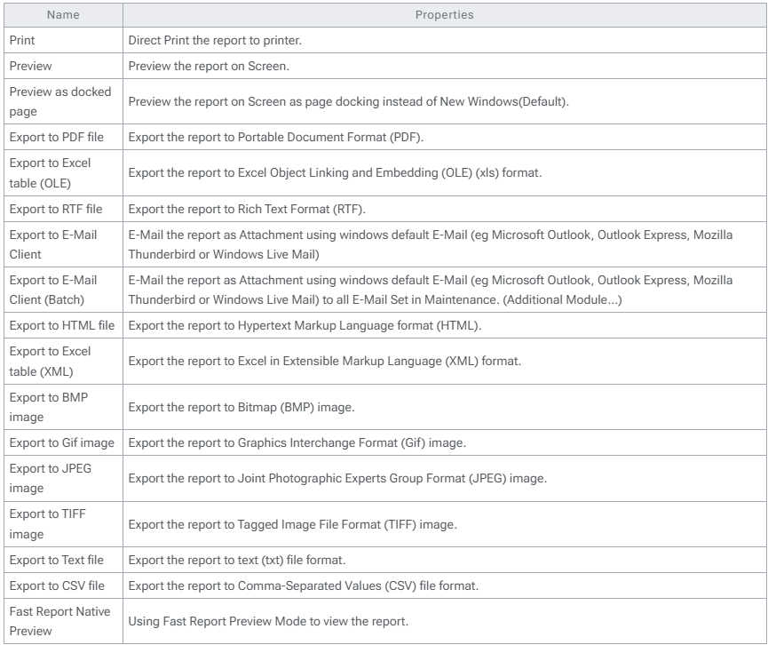

## Introduction

On each report grid output (after click apply) there is small arrow on the Preview Button on the right which can see a list of some function as shown below.

Below is the detail of each function (From Top)

