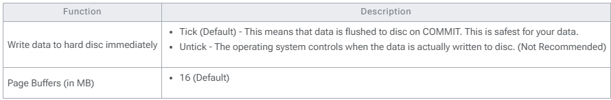

## Introduction

By default firebird not fully utilies the RAM. Using this new function user can self allocate size of RAM to be use for each Database.

1. Pros
    1. Fully use the available RAM in server
    2. Increase the database performance
2. Cons
    1. Will slow down the Server Performance if not careful
    2. Not support for Standalone
3. Requirement
    1. Firebird Server
    2. Minimum 16 GB RAM
    3. A reliable Uninterrupted Power Supply or UPS (ie. backup power battery).
4. **Steps**
    1.  Click 3 dot button in the Login Screen
    2. **Right Click** the **Database** you wanted to set.
    3. Select **Properties**
    4. Enter **ADMIN** Password
    5. Enter the Size you wanted or Click Use recommended page buffers setting (Default is 300 MB)
    6. Click OK

:::info
    Things to take note when you have untick - Write data to hard disc immediately:
    1. Server PC must protected by a reliable UPS (ie. backup power battery).
    2. Make sure the server properly shutdown.
    3. Operating System must at least minimum is Win7, Windows Server 2012 and above.
:::

