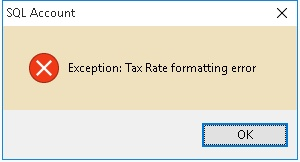
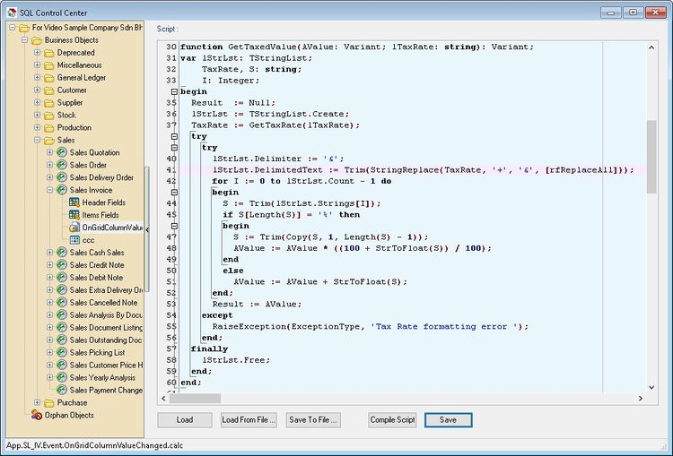

## Introduction

This issue occurs if you have a script that reads the **TaxRate** from Maintain Tax in either:

- the **OnGridColumnValueChange** script, or
- the **OnBeforeSave** script

The error is caused by changes in SQL Accounting's coding structure that affect how tax rates are provided to user-defined scripts.

## Problem

You will see the error shown below when selecting an item code or changing a value in your UDF that triggers the function.



## Solution

The following example shows the error occurring in **Sales Invoice**.

1. Click **Tools | DIY | SQL Control Center...**
2. In the left panel, locate **Sales Invoice > OnGridColumnValueChange** and/or **OnBeforeSave**.

    

3. Find the function definition similar to:

   **function GetTaxedValue(AValue: Variant; lTaxRate: string): Variant;**
4. Replace the existing function with the updated version below.

Use this version for the **OnGridColumnValueChange** script:

```pascal
function GetTaxedValue(AValue: Variant; lTaxRate: string): Variant;
var lStrLst: TStringList;
    TaxRate, S: string;
    I: Integer;
begin
  Result  := Null;
  lStrLst := TStringList.Create;
  TaxRate := DataSet.FindField('TaxRate').AsString;
  try
    try
      lStrLst.Delimiter := '&'; 
      S := Trim(StringReplace(TaxRate, '+', '&', [rfReplaceAll]));
      lStrLst.DelimitedText := Trim(StringReplace(s, 'E', '', [rfReplaceAll])); 
      for I := 0 to lStrLst.Count - 1 do
      begin
        S := Trim(lStrLst.Strings[I]);
        if S[Length(S)] = '%' then
        begin
          S := Trim(Copy(S, 1, Length(S) - 1));
          AValue := AValue * ((100 + StrToFloat(S)) / 100);
        end
        else
          AValue := AValue + StrToFloat(S);
      end;
      Result := AValue;
    except
      RaiseException(ExceptionType, 'Tax Rate formatting error ');
    end;
  finally
    lStrLst.Free;
  end;
end;
```

Use this version for the **OnBeforeSave** script:

```pascal
function GetTaxedValue(AValue: Variant; lTaxRate: string): Variant;
var lStrLst: TStringList;
    TaxRate, S: string;
    I: Integer;
begin
  Result  := Null;
  lStrLst := TStringList.Create;
  TaxRate := D.DataSet.FindField('TaxRate').AsString;
  try
    try
      lStrLst.Delimiter := '&'; 
      S := Trim(StringReplace(TaxRate, '+', '&', [rfReplaceAll]));
      lStrLst.DelimitedText := Trim(StringReplace(s, 'E', '', [rfReplaceAll])); 
      for I := 0 to lStrLst.Count - 1 do
      begin
        S := Trim(lStrLst.Strings[I]);
        if S[Length(S)] = '%' then
        begin
          S := Trim(Copy(S, 1, Length(S) - 1));
          AValue := AValue * ((100 + StrToFloat(S)) / 100);
        end
        else
          AValue := AValue + StrToFloat(S);
      end;
      Result := AValue;
    except
      RaiseException(ExceptionType, 'Tax Rate formatting error ');
    end;
  finally
    lStrLst.Free;
  end;
end;
```
