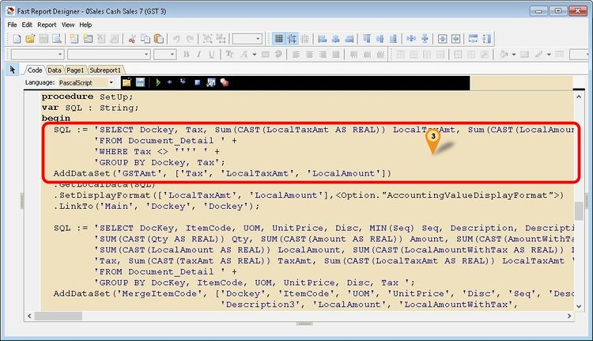

## Introduction

This issue occurs when a report contains a script that retrieves the **TaxRate** from Maintain Tax.

The error is caused by changes in SQL Accounting's coding structure that affect how tax rates are provided to reports.

## Problem

You will see the following error when previewing the report:


## Solution

1. Click the **Code** tab.
2. Scroll down and locate `procedure SetUp;`.
3. Replace the existing code with the following:

    

    ```pascal
    SQL := 'SELECT Dockey, Tax, TaxRate, Sum(CAST(LocalTaxAmt AS REAL)) LocalTaxAmt, Sum(CAST(LocalAmount AS REAL)) LocalAmount '+
           'FROM Document_Detail ' +
           'WHERE Tax <> '''' ' +
           'GROUP BY Dockey, Tax, TaxRate';
    AddDataSet('GSTAmt', ['Tax', 'TaxRate', 'LocalTaxAmt', 'LocalAmount'])
    ```

4. Click the **Subreport1** tab.

    

5. Double-click the Tax Rate memo.
6. Replace its expression with the following:

    

    ```pascal
    [IIF(Trim(<GSTAmt."TaxRate">)='',<GSTAmt."Tax">,<GSTAmt."Tax"> +' @ ' + <GSTAmt."TaxRate">)]
    ```

7. Click **OK**.
8. Save the report.
