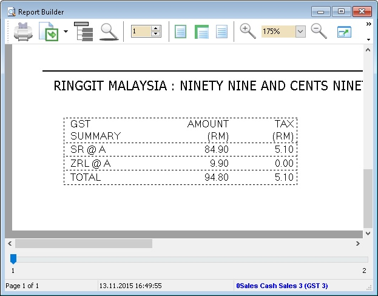
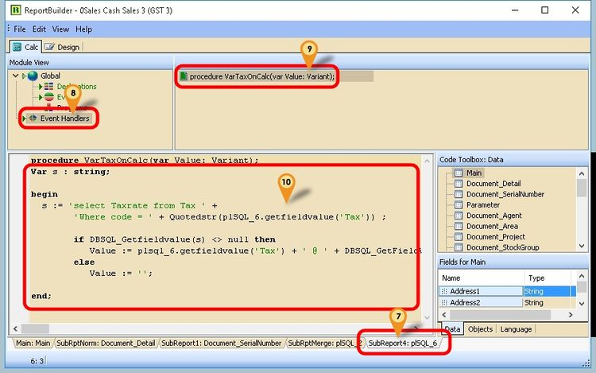

## Introduction

This happen if you had write script to get the **TaxRate** from Maintain Tax in the report.

This due to changing SQLAccounting Coding Structure to cater future Changes in Tax Rate.

## Problem

You will get below error when you preview the report.



## Solution

1. Click **Calc** Tab
2. Click **View | Module**
3. Click **Event**
4. Click **OnCreate**
5. Scroll down & look for **SQL_6**
6. Replace this script with below script

    

    ```pascal
    SQL_6 := 'SELECT DocKey,  Tax, TaxRate, Sum(LocalAmount) LocalAmount, Sum(Qty) Qty, '+ 
                'Sum(LocalTaxAmt) localTaxAmt, Description '+ 
          'FROM Document_Detail ' +
          'Where Tax <> ''''' +
          'GROUP BY Dockey, Tax, TaxRate';
    ```

7. Click on **Subreport4:plSQL_6** tab
8. Click on **Event Handlers**
9. Click on **procedure VarTaxOnCalc(var Value:Variant);**
10. Replace this script with below script

    

    ```pascal
    procedure VarTaxOnCalc(var Value:Variant);
    Var s : string;
    begin
      if Trim(plsql_6.getfieldvalue('TaxRate')) <> '' then
        Value := plsql_6.getfieldvalue('Tax') + ' @ ' + plsql_6.getfieldvalue('TaxRate') else
        Value := plsql_6.getfieldvalue('Tax');
    end;
    ```

11. **Save** the report.
