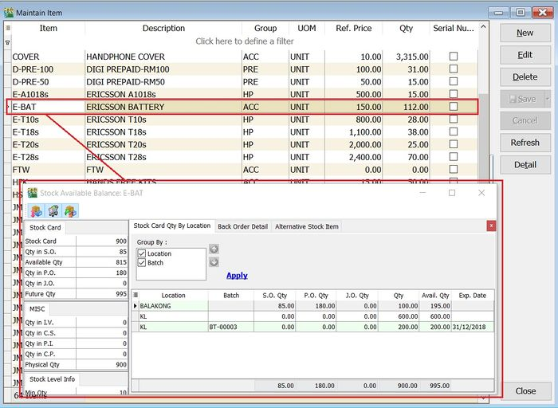

## Tabbed Docking

Similar to Internet Explorer or Google Chrome, the application supports a tabbed layout so you can view windows as tabs instead of separate windows.

## Application Theme

The Application Theme allows users to change the application's skin/layout to their preference. Enabling themes may consume more system resources.

## Show Chart

**View > Show Chart**:

This function displays sales and purchase price history data in chart form.

1. Open Sales or Purchase Price History via **Sales > Print Sales Price History** or **Purchase > Print Purchase Price History**.

2. Highlight the data in the grids.

    

3. Click on **View > Show Chart**.

4. A dialog prompts three chart types (Bar Chart, Line Chart, Pie Chart). See the screenshot below.

    

Data transform into the chart depends on the data highlighted in the Sales/Purchase Price History grid.

## Sales Price History (Shift+Ctrl+S)

**View > Sales Price History...**:

This function provides a quick check of an item's sales price history while creating sales, purchase, or stock documents.

Shorcut key: **Shift + Ctrl + S**

1. As long as you have highlighted the item code (e.g., in Maintain Stock Item or while creating sales/purchase documents).

2. Press **Shift + Ctrl + S** to open the Sales Price History for the item.

    

3. Insert a Company Name column to compare the sales price history by company.

    

4. Set the latest number of records to be displayed for each sales document type (QT, SO, DO, IV, CS, CN, DN).

    

5. Click on Sales to exclude the sales document types.

    

Sales Price History is always enabled to quickly view the price history for customers.

## Purchase Price History (Shift+Ctrl+P)

**View > Purchase Price History...**

This function provides a quick check of an item's purchase price history while creating sales, purchase, or stock documents.

Shorcut key: **Shift + Ctrl + P**

1. As long as you have highlighted the item code (e.g., in Maintain Stock Item or while creating sales/purchase documents).

2. Press **Shift + Ctrl + P** to open the Purchase Price History for the item.

    

3. Insert a Company Name column to compare purchase price history by company.

    

4. Set the latest number of records to be display for each purchase document types (PQ, PO, GR, PI, CP, SC, SD).

    

5. Click on Purchase to exclude the purchase document types.

    

Purchase Price History is always enabled to quickly view price history for suppliers.

## Available Stock Balance (Ctrl+F11)

**View > Available Stock Balance...**

This function provides a quick check of stock status while creating sales, purchase, or stock documents.

Shorcut key: **Ctrl+F11**

1. As long as you have highlighted the item code (e.g., in Maintain Stock Item or while creating sales/purchase documents).

2. Press **Ctrl+F11** - Available Stock Balance....

    

### Stock Card Qty By Location

1. The Stock Card Qty By Location tab shows the stock status summarized by location and batch.

2. See the screenshot below.

    

    | Column Name | Explanation |
    | --- | --- |
    | Location | Stock qty balances group by location. |
    | Batch | Stock qty balances group by batch. |
    | S.O.Qty | Outstanding SO Qty (Back Order). |
    | P.O.Qty | Outstanding PO Qty (Back Order). |
    | J.O.Qty | Outstanding JO Qty (Job Order Outstanding). |
    | Qty | On hand Qty. |
    | Avail.Qty | Future Qty. |
    | Exp.Date | Batch expiry date. |

### Back Order Detail

1. To check the S.O.Qty, P.O.Qty and J.O.Qty in detail.
2. Click on Back Order Detail tab. See the screenshot below.

    

### Alternative Stock Item

1. Click on the Alternative Stock Item tab to check the alternative item code.
2. See the screenshot below.

    

Available Stock Balance is always enabled to quickly view stock status.

## Price Tag (Ctrl+T)

**View > Price Tag...**:

This function quickly displays the price tag settings for an item.

Shorcut key: **Ctrl + T**

1. As long you are highlight the item code, eg. at Maintain Stock Item or during the sales/purchase documents creation.
2. Press Ctrl + T to check the Price Tag... for the item.

    

Price Tag is always enabled to quickly view price tag information for the item.

## Stock Item Picture

**View > Stock Item Picture**:

This function displays the picture of the selected stock item.

1. As long you are highlight the item code, eg. at Maintain Stock Item or during the sales/purchase documents creation.
2. Click on View | Stock Item Picture.

    

Stock Item Picture always turns-on to quickly view the picture of the stock item.

## Stock Item Search (F9)

**View > Stock Item Search**:

This function is to quickly search for the items by entering a keyword. It is easy to apply the item found into the sales/purchase/stock documents.

Shorcut key: **F9**

1. Enter a keyword to search for items.

    

2. You can highlight multiple items.

    

3. Drag and drop the highlighted items into the invoice detail grid.

    

4. The items will be inserted into the invoice detail grid. See the screenshot below.

    

Item Search is always enabled to help find items when creating documents.

## Advance Search (Ctrl+F)

**Edit > Find**:

This function finds records by selected field(s) and parameters.

Shorcut key: **Ctrl + F**

| Field Name | Properties |
| --- | --- |
| Display Fields | Fields to be displayed on the result screen. |
| Tick Button | Select all. |
| Cross Button | Unselect all. |
| Plus Button | Add Condition |
| Minus Button | Remove Selected Condition |
| Match any of the following | Is OR condition. Find ANY Match Value on the Selected Condition. |
| Match all of the following | Is an AND condition. Find ALL Match Value on the Selected Condition. |
| Fields | Available Field(s) can Search for. |
| Operator | Type of Search. |
| Check Box | Selected Conditions which need to run/execute. |
| Value 1 | Parameter 1 or What to Value to Find. |
| Value 2 | Parameter 2 or What to Value to find and only Available for Operators between and not between. |
| Search | Apply or Search the Value. |
| Clear | To Clear All Conditions(Default Action) or All Value. |
| Case Sensitive | Tick if you want to find the value is Case Sensitive. |
