## GST Setup and Information

## GST Count Down Timer

This is a countdown timer for the submission of the GST Return. It is generally displayed 7 days before the GST Return due date.

**Example GST Count Down Timer:**

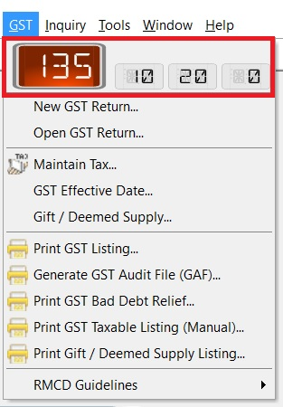

### Formula

Visible := (Return Due - Today Date - 1) < 7

### Example

Frequently : Monthly

Next Submission : Nov 2016

Count Down begin shown : 24 Dec 2016

Today date : 27 Dec 2016

Count Down Shown : 3 Days+++

## GST Return

To process and close the GST Returns period. You can generate the GST-03 and GAF.

### New GST Return

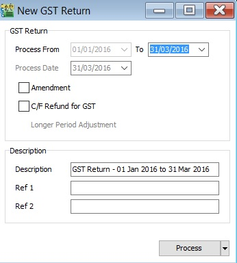

| **Field Name**                 | **Field Type** | **Explanation**                                                                 |
|--------------------------------|----------------|---------------------------------------------------------------------------------|
| Process From to                | Date           | GST Taxable Period, e.g., either monthly or quarterly.                          |
| Process Date                   | Date           | Date to process the GST Return.                                                 |
| Amendment                      | Boolean        | Ticked. In GST-03, the "Amendment" checkbox will be marked X.                   |
| C/F Refund for GST             | Boolean        | Ticked. In GST-03, Item 9 "Do you choose to carry forward refund for GST?" will be marked X in Yes checkbox. |
| Longer Period Adjustment (LPA) | Boolean        | Auto ticked according to the first tax year adjustment.                         |
| Description                    | String         | GST Return - Process From Date to Date (by default).                            |
| Ref 1                          | String         | Key-in any reference no.                                                        |
| Ref 2                          | String         | Key-in any reference no.                                                        |

### Draft GST Return

You can draft the GST-03 before the final GST-03 submission by processing it as a draft.

1. Click the dropdown arrow nect to the Process button (Y).
2. Refer to the screenshot below.

   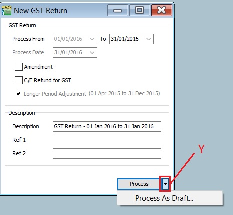

3. DRAFT Status showed for the GST Returns period.

   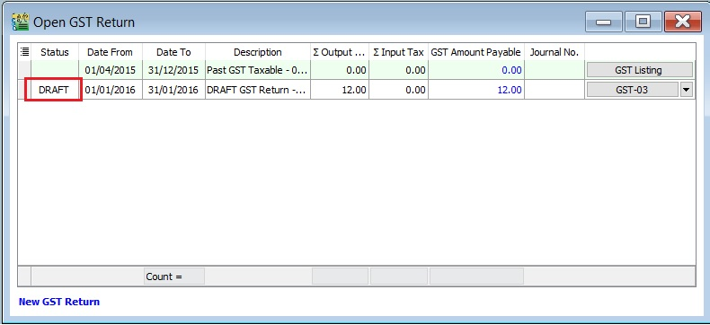

:::note

You can still amend documents while the GST return is in **DRAFT** status. Multiple drafts can be created before FINAL process the GST Returns for the period.

:::

### Final GST Return

1. Click the Process button.
2. Refer to the screenshot below.

   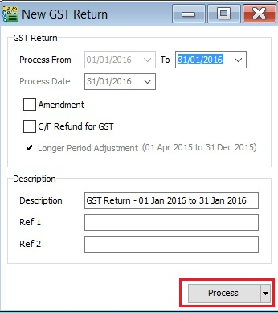

3. The finalized GST Return will no longer display "DRAFT" in the status column.

   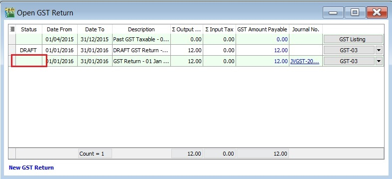

:::note

You cannot amend the documents anymore where the FINAL GST return has generated.

:::

### Extra

#### AR & AP Bad Debt Relief

1. Bad Debt Relief screen will appear (see the screenshot below) if the system detects outstanding Tax Invoices that have expired for 6 months.
2. Sales documents from the company without GST No. will be un-ticked. You can tick the documents if you believe the company is GST-Registered.

   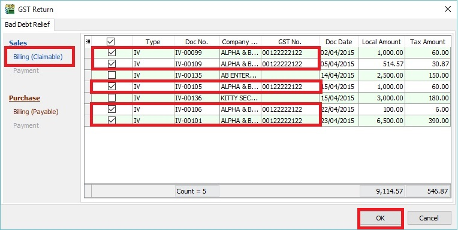

   :::note Tips:

   

   To avoid to tick the documents manually for GST Registered company, please go to update the GST no at Maintain Customer.

   :::

3. Press OK if a "confirm" message is prompted (see the screenshot below), This indicates that some companies do not have a GST No.
4. If you confirmed that the company is Non-GST Registered, press YES to proceed.
5. Otherwise, press NO and update the GST No. in Maintain Customer to confirm the company is GST-registered before processing the GST Return.

   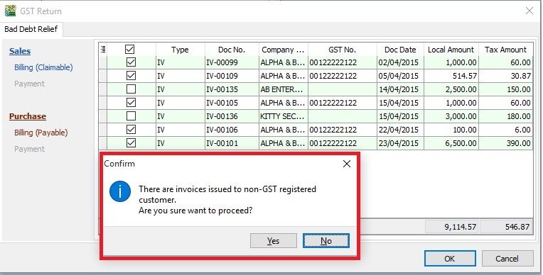

#### Capital Goods Acquired

1. If you receive a prompt for **GST Return - Capital Goods Acquired**, it indicates that there are credit adjustment transactions for Fixed Asset Account. See below screenshot.

   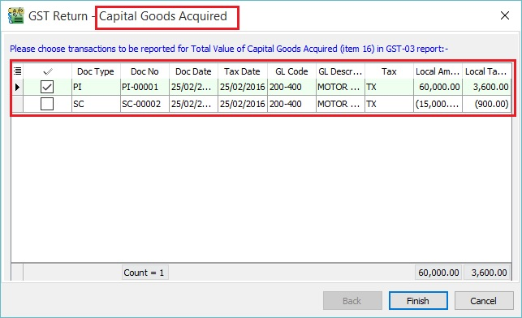

2. Select the transactions line to include the credit adjustment (eg. Rm15,000.00). Otherwise, the system will capture the value of Rm60,000.00 in GST-03 item 16. See the screenshot below.

   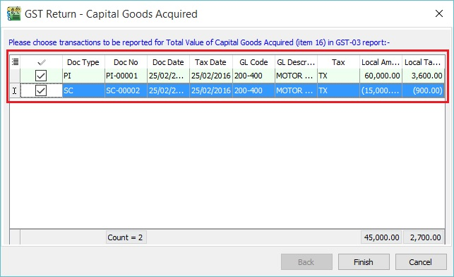

3. It will capture the net capital goods acquired value in GST-03 item 16.

   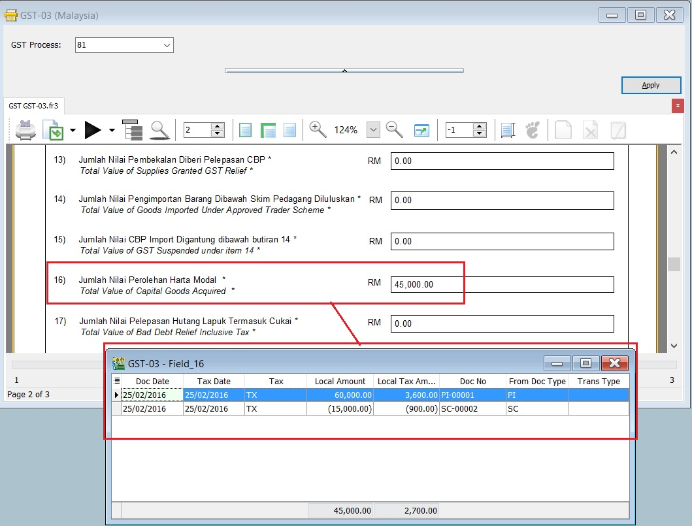

## Open GST Return

1. See the screenshot below:

   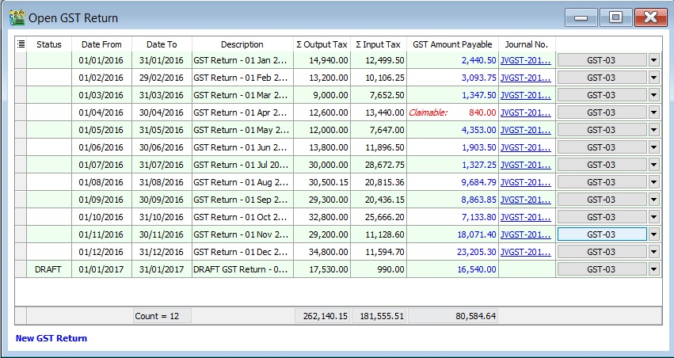

2. You can insert more available fields.

   

   | **Field Name**                        | **Field Type** | **Explanation**                                                                 |
   |---------------------------------------|----------------|---------------------------------------------------------------------------------|
   | Status                                | String         | To show the GST Return status, i.e., DRAFT, DE-REGISTER.                        |
   | Process Date                          | Date           | To show process date.                                                           |
   | Date From                             | Date           | To show date from.                                                              |
   | Date To                               | Date           | To show date to.                                                                |
   | Description                           | String         | To show the description entered.                                                |
   | Ref 1                                 | String         | To show the ref 1 entered.                                                      |
   | Ref 2                                 | String         | To show the ref 2 entered.                                                      |
   | User                                  | String         | To display the User process the GST Return.                                     |
   | Closed                                | Boolean        | Always ticked to close.                                                         |
   | LPA for Partial Exemption             | Boolean        | Longer period adjustment (LPA) for partial exemption (Mixed Supplies).          |
   | De-register                           | Boolean        | Ticked if the taxable period has de-register date.                              |
   | Amendment                             | Boolean        | To show the GST Return has ticked this option.                                  |
   |                                       |                | Refer to :[GST GUIDE ON AMENDMENT RETURN (GST-03)](https://sites.google.com/site/sqlestream/sql-financial-accounting/9-good-and-service-tax-gst---malaysia/9-22-gst-03-item-detail) |
   | C/F Refund for GST                    | Boolean        | To show the GST Return has ticked this option.                                  |
   | Process Net Realized Exchange Gain/Loss | Boolean      | No longer use because system auto handles this option.                          |
   | Tax Year                              | Boolean        | Tax Year point.                                                                 |
   | De Minimis Rule                       | Boolean        | - Ticked = Pass                                                                 |
   |                                       |                | - Un-ticked = Not Pass                                                           |
   | Residual Input Tax Recovery Rate (%)  | Float          | To display the IRR %.                                                           |
   | LPA Date From                         | Date           | LPA date from.                                                                  |
   | LPA Date To                           | Float          | LPA date to.                                                                    |
   | ∑ Output Tax                          | Float          | To show the total output tax value.                                             |
   | ∑ Input Tax                           | Float          | To show the total input tax value.                                              |
   | GST Amount Payable                    | Float          | Net GST Payable or Claimable.                                                   |
   | Journal No.                           | String         | Auto post the JVGST-XXXXX to reconcile the GST Payable and GST Claimable accounts. |
   |                                       | Button         | Options button: GST-03, Print GST Listing, Generate GST Audit File (GAF).       |

   :::note Tips:

   You can click New GST Return in Open GST Return screen. See below the screenshot.

   

   :::

## Maintain Tax

- This to Maintain all the available tax given by Government or user can self add or modified

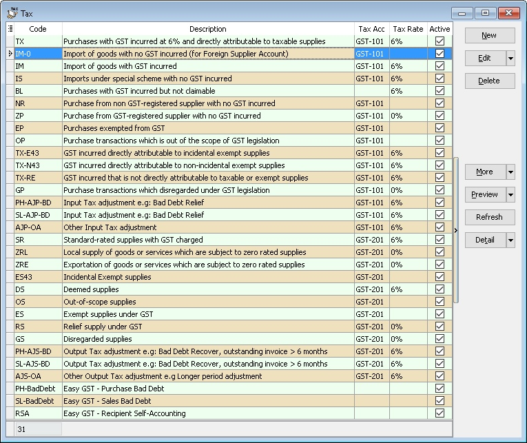

### Create New Tax

- Screenshot below is the Maintain Tax entry form.

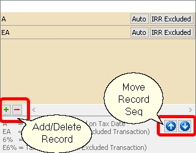

| **Field Name**  | **Explanation & Properties**                                                                 |
|------------------|-----------------------------------------------------------------------------------------------|
| Code             | Enter the tax code to be shown in report.                                                     |
| Active           | - Checked: Active & able to select from the Tax List in data entry.                           |
|                  | - UnChecked: InActive & unable to select from the Tax List in data entry.                     |
| Description      | Enter the tax description.                                                                    |
| Tax Type         | Select the Tax Type for the Tax Code to be created.                                           |
| Tax Rate         | User can self-determine the rate or set Auto:  |
|                  | - **A**: Auto Tax Rate. System will auto change to new rate if there is update in GST Rate (must update SQL Accounting).  |
|                  | - **E**: Excluded from IRR calculation (useful for OS Tax Code & Mixed Supplies Industry).  |
|                  | - **EA**: Combination of A & E.  |
|                  | - **6%**: User-defined fixed rate (e.g., 6%).  |
|                  | - **E6%**: Fixed rate excluded from IRR calculation.  |
|                  | Default 1st row is the Default selection in data entry.                                       |
| Tax Account      | Select an appropriate GL Account from Maintain Account.                                       |
| Tax Inclusive    | - Checked: Default is Tax Inclusive.  |
|                  | - UnChecked: Default is Tax Exclusive.                                                        |

### Use of Tax

- You can set the tax as default at the following
        1. GL | Maintain Account...
        2. Customer | Maintain Customer... | Tax
        3. Supplier | Maintain Supplier... | Tax
        4. Stock | Maintain Stock Item... | Output Tax/Input Tax
        5. Tools | Options | Customer | Default Output Tax
        6. Tools | Options | Supplier | Default Input Tax
- Therefore, item inserted will be automatically calculate the tax amount based on the subtotal. See below screenshot.

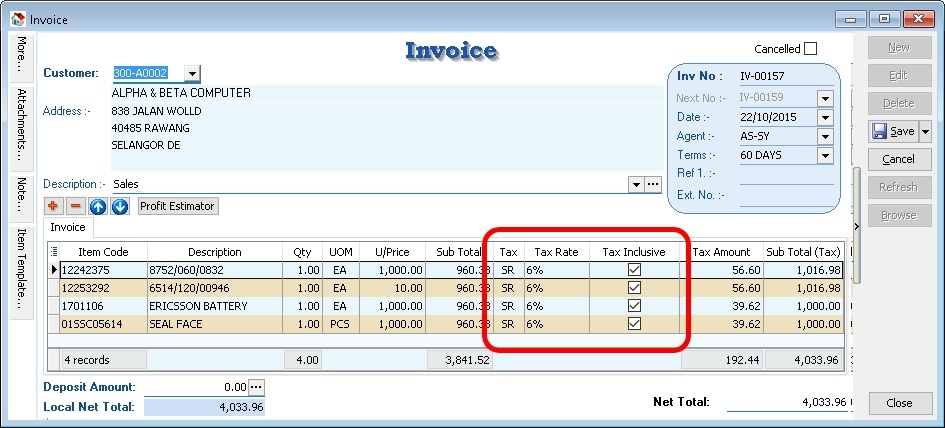

### Default System Tax Seq

Default System Tax Seq are as follow

***For Sales & Purchase***

1) Maintain Customer/Supplier
2) Maintain Item Code
3) Tools | Options | Customer/Supplier => For Version 836.761 & below
4) Maintain Tax with IsDefault is Tick => For Version 837.762 & above

***For AR & AP***

1) Maintain Customer/Supplier
2) Maintain Account
3) Tools | Options | Customer/Supplier => For Version 836.761 & below
4) Maintain Tax with IsDefault is Tick => For Version 837.762 & above

***For GL***

1) Maintain Account

## GST Effective Date

Enable to set the GST start date (register) and end date (de-register).

1. Below the screenshot is the Start GST wizard, you are required to set the GST Effective Date.

   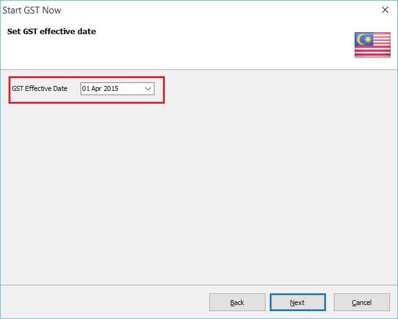

2. You can check the GST Effective Date under the menu GST | GST Effective Date...

   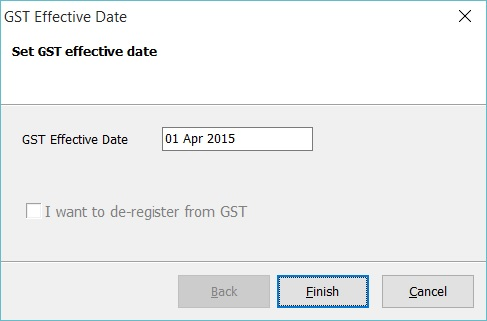

   | Field Name                   | Field Type | Explanation                           |
   |-------------------------------|------------|---------------------------------------|
   | GST Effective Date            | Date       | GST start date.                       |
   | I want to de-register from GST | Boolean    | To set de-register date from GST.     |

### How to set De-register

1. At the GST effective date screen, tick on I want to de-register from GST.

   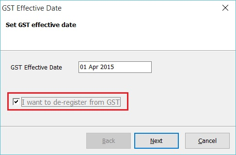

2. Next', type-in the de-register date. Let's assume ABC Sdn Bhd ceased to be a registered person on 15 May 2016.

   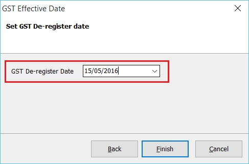

3. Click Finish to confirm the de-register date.
4. GST De-register Date : 15 May 2016 will displayed below the GST effective date. See the screenshot below.

   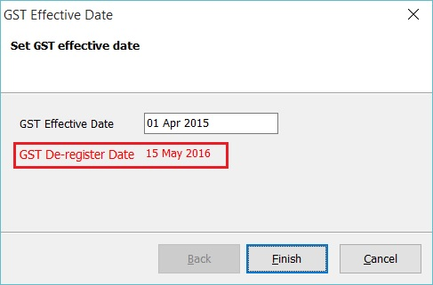

5. Click **Finish** to exit.

:::note Tips:

You can found the De-Register markings in the GST Returns. See the screenshot below.

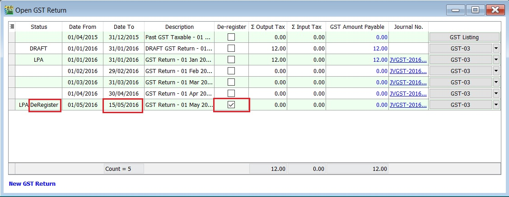

:::

### How to cancel De-Register Date?

1. At the GST effective date screen, click on the **De-Register Date**.

   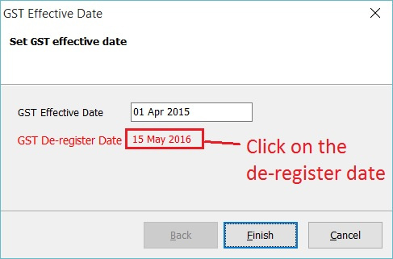

2. Leave the De-Register date **blank** or become **d/M/yyyy**. See the screenshot below.

   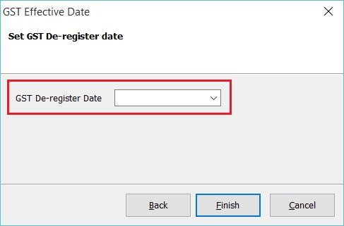
   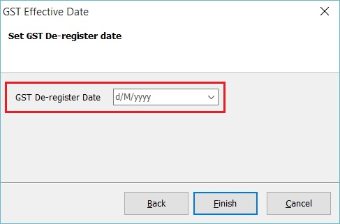

3. Click **Finish** to confirm remove the de-register date.

## Gift / Deemed Supply

This guide will teach you to enter the gift and deemed supply in SQL Financial Accounting.

### Gift

#### Gift Rules

Goods worth not more than RM500 given FREE to the same person in the same year. **The word ‘year’ in paragraph 5(2) (a) of the First Schedule of GSTA 2014 refers to ‘tax year ‘(financial year)**.

- not a supply
- not subject to GST
- input tax is claimable

> **What it means year as Tax Year (Financial Year)?**
> For example....
GST Effective Date: 01 Apr 2015
Financial Start Period: 01 July 2014
>
>
> First tax year will be: 01 Apr 2015 - 30 Jun 2016 (15 months) - Gift rule Rm500 per person per tax year
> Second tax year will be: 01 Jul 2016 - 30 Jun 2017 (12 months) - Gift rule Rm500 per person per tax year

**Example 1:**
Company XY Sdn Bhd purchased 15 hampers worth RM200/hamper to be given to each of his employees.

- every employee will get one hamper FOC.
- no need to account for output tax.
- input tax on 15 hampers = RM180.00 (6% x RM3,000.00) is claimable.

**Example 2:**
Company CX Sdn Bhd has purchased a watch worth RM400.00 and gave it to one of the director’s son.

- The gift is not subject to GST because its value is less than RM500.00 (gift rule).
- input tax incurred on the purchase is claimable.

**Example 3:**
A Company purchased a laptop worth RM1,500.00 and gave the laptop to a director’s son as a gift.

- GST on the laptop must be accounted for by the company as output tax.
- the value of the goods is more than RM500.00.

**Example 4:**
A company purchased a laptop worth RM1,500.00 three years ago. Currently the company has given the laptop to one of his business partners. For the purpose of accounting GST, the company has to use open market value of the goods now where the value of the goods is RM450.00, i.e. the value of the goods has depreciated.

- no need to account for output tax on the gift
- the value of the goods is less than RM500.00. (Gift rule applicable)

**Example 5:**
Company C rewarded RM5,000.00 to his best employee of the year.

- not subject to GST
- money is neither goods nor services

#### Gift Document Entry

1. Click on New.
2. Select Type : Gift.

   

   :::note Note:

   You will see this note "Entitle Yearly Exempt RM500.00" at the bottom.

   :::

3. For Gift, you must select Code : Customer Code.
4. Select Item Code: Item Code.
5. Select a preferred Expenses GL Account. User has to create a GL Account in Maintain Account.

   For example,

   | Item Code | Description | Qty  | UOM  | U/Cost | Sub Total | Tax | Tax Rate | Tax Amount | SubTotal (Tax) | Expenses GL Account            |
   |-----------|-------------|------|------|--------|-----------|-----|----------|------------|----------------|--------------------------------|
   | ANT       | ANTENA      | 1.00 | UNIT | 350.00 | 350.00    | DS  | 6%       | 0.00       | 350.00         | 999-999 GST Gift/Deemed Supply |

   

6. **Yearly Amount** will immediately updated together with the current Gift document amount.

   > **Yearly Amount** = Cumulative gift amount in the same year + current gift document amount

7. Below screenshot is the 2nd gift document created for same company/person in the same year. **The word ‘year’ in paragraph 5(2) (a) of the First Schedule of GSTA 2014 refers to ‘tax year ‘(financial year)**.

   

8. System will auto calculate tax amount once exceed RM500.00

   | Gift Date  | Gift   | Cost   | Tax Amount | Calculation    |
   |------------|--------|--------|------------|----------------|
   | 05/01/2016 | ANTENA | 200.00 | 0.00       |                |
   | 17/02/2016 | ANTENA | 350.00 | 33.00      | RM550 × 6%     |

   :::note Note:

   The calculation of the gift is based on the Total value of the gift once exceed RM500.

   :::

9. Click on Tax Estimator. You can see the GST Amount to be process to the gift.

   

#### Process GST Return

During process of GST-03 Return, if the system detects there are deemed supplies (DS) under gift, it will add this GST Tax under DS as output Tax.

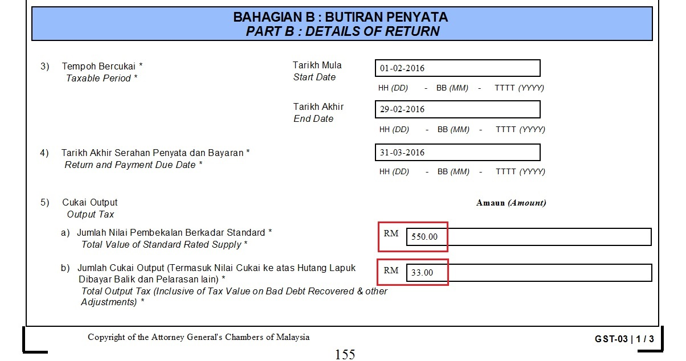

### Deemed Supply

1. Click on **New**.
2. Select **Type** : Deemed Supply.

   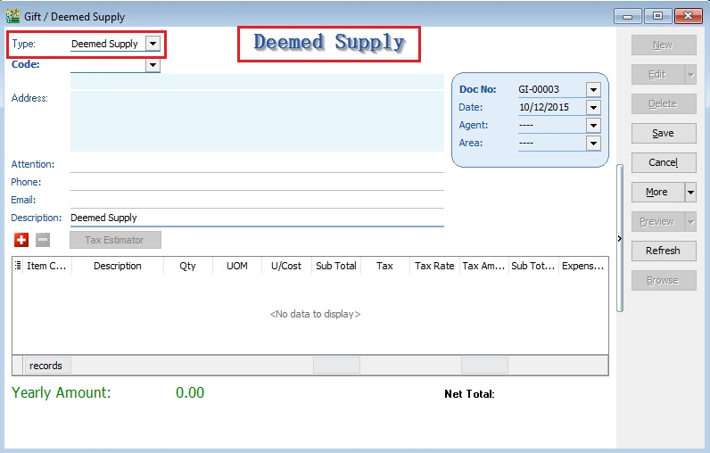

3. For Deemed Supply, you can leave the **Code** `<<EMPTY>>`
4. Select **Item Code**: Item Code.
5. Select a preferred **Expenses GL Account**. User has to create a GL Account in Maintain Account.

   For example,

   | Item Code | Description | Qty  | UOM  | U/Cost | Sub Total | Tax | Tax Rate | Tax Amount | SubTotal (Tax) | Expenses GL Account            |
   |-----------|-------------|------|------|--------|-----------|-----|----------|------------|----------------|--------------------------------|
   | ANT       | ANTENA      | 1.00 | UNIT | 350.00 | 350.00    | DS  | 6%       | 21.00      | 371.00         | 999-999 GST Gift/Deemed Supply |

6. System will calculate tax amount instantly when you save the Deemed Supply, ie. Taxable Amount x 6%.
7. **Yearly Amount** always shown 0.00, because it is Deemed Supply.

## Print GST Listing

To generate a summary and details of the GST transactions after process the GST Returns. It is easy to cross check against with GST-03.

### GST Listing

#### GST Listing - Parameter

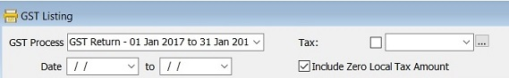

| Parameter                    | Type    | Explanation                                        |
|------------------------------|---------|----------------------------------------------------|
| GST Process                  | Lookup  | To select the GST Process period.                  |
| Date                         | Date    | To range the date to retrieve the data after apply it. |
| Tax                          | Lookup  | To select the tax code.                            |
| Include Zero Local Tax Amount | Boolean | To show the zero local tax amount.                 |

#### GST Listing - Summary

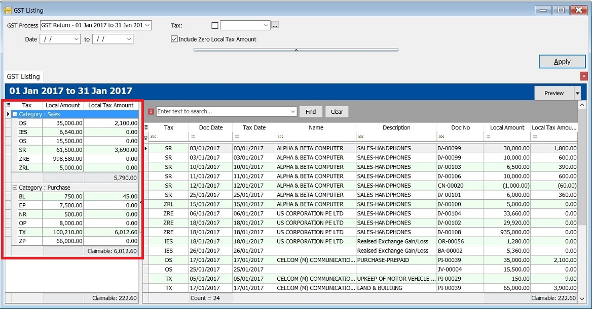

1. **Double click** on the tax code (eg. SR) in the Summary.
2. It will auto filter the GST transactions by tax code (SR) in the Details.

   

3. **Deselect** the tax code (SR), click on the X button. See the screenshot below.

   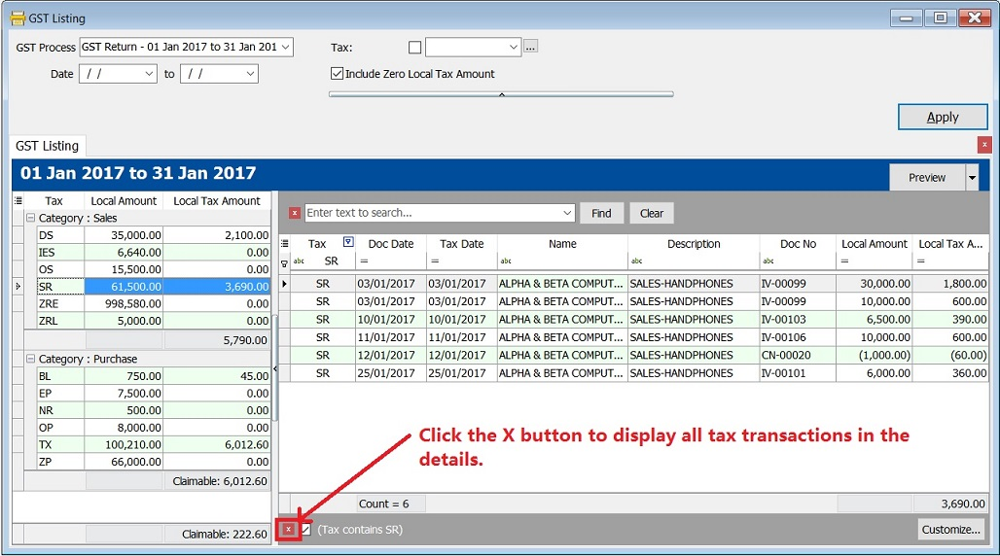

#### GST Listing - Detail

   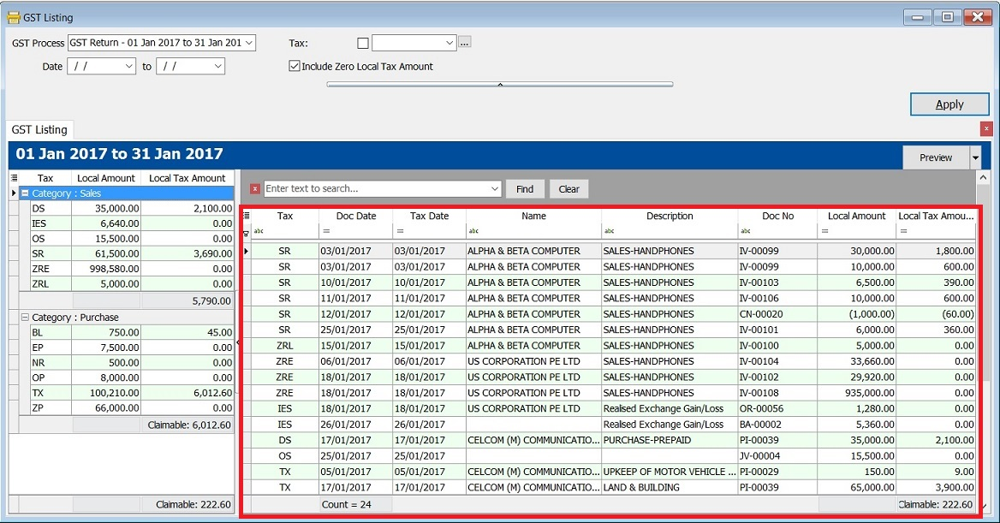

1. **Find Panel** is very useful to search in any columns by the keywords entered by you.

   

2. It helps to search the transactions contain the keywords, eg. **"UPKEEP"**, **"TX"** or **"ZP"**. You just need to enter the keywords directly with a space in between each keywords. See the screenshot below.

   

### Find Panel Helper

1. With this function, you can easily narrow down the search to identify the errors before the GST Returns submission.
2. Let say I wish to find the word **UPKEEP**.
3. Type the **UPKEEP** in the find panel.

   

4. If you want to **exclude** the **BL** tax code, then you have to enter as **UPKEEP -BL** in the find panel.

   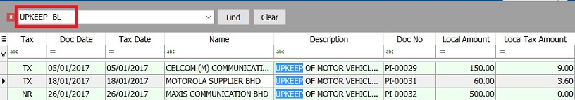

**Explanation of Extended Search Syntax :**

| Example Search Syntax | Filter Operator | Explanation                                                                 |
|-----------------------|-----------------|-----------------------------------------------------------------------------|
| apple pineapple mango | OR              | Any transaction lines containing apple, pineapple, OR mango will be searched. |
| apple +pineapple      | AND             | Transaction lines with a combination of apple AND pineapple will be searched. |
| apple -mango          | EXCLUDE         | Transaction lines with the word apple but EXCLUDE mango. Result: apple and pineapple will be searched. |
| "pineapple apple"     | EXACT WORD      | Search for the exact words "pineapple apple".                               |

:::note NOTE:

Spacing is very important to make your search more accurate.

:::

### Reports

1. Click on **Preview**.
2. Select a report to preview or print or export.

   

   | No. | Report Name                                                                 | Purpose                                                                                   |
   |-----|------------------------------------------------------------------------------|-------------------------------------------------------------------------------------------|
   | 01  | GST Detail 1                                                                 | To show the document description in GST Listing.                                          |
   | 02  | GST Detail 2                                                                 | To show the document item details description in GST Listing.                             |
   | 03  | GST Detail 3 - GST F5-(SG)                                                   | For Singapore GST, to show the GST-03 details in GST Listing.                             |
   | 04  | GST Detail 3 - GST-03                                                        | For Malaysia GST, to show the GST-03 details in GST Listing.                              |
   | 05  | GST Detail 4 - Mixed Supplies                                                | Applicable to Mixed Supplies. To show the calculations for DmR and Longer Period Adjustment. |
   | 06  | GST Lampiran 2                                                               | GST detail listing for standard rated. It is upon request by RMCD.                        |
   | 07  | GST Lampiran 2-with ZR                                                       | Another GST detail listing for the standard rated and zero rated separately.              |
   | 08  | GST Lampiran 4 - Ringkasan Maklumat Permohanan Tuntutan Pelepasan Hutang Lapuk | Lampiran 4 as requested by Kastam Officer.                                                |
   | 09  | GST Listing - Yearly GST Analysis                                            | To analyze the yearly tax amount and taxable amount.                                      |
   | 10  | GST Summary Sheet - MY                                                       | GST Summary Sheet format.                                                                 |
   | 11  | GST-Lampiran B-0 PT GST Bil 2B (ATS) (IS)                                    | A special GST detail listing for Approved Trader Scheme (Refer to GST-03 item 14 & 15).   |
   | 12  | GST-Penyata Eksport (ZRE)                                                    | A special GST detail listing for Zero Rated Export supply (Refer to GST-03 item 11).      |
   | 13  | GST-Penyata Pembekalan Dikecualikan (ES & IES)                               | A special GST detail listing for Exempted Supplies (Refer to GST-03 item 12).             |
   | 14  | GST-Penyata Pembekalan Tempatan Berkadar Sifar (ZRL)                         | A special GST detail listing for Zero Rated Local supply (Refer to GST-03 item 10).       |

   :::note NOTE:

   From Doc Types in GST Listing Detail are consists of:

   1. _A = Un-claimable Non-Incidental Exempt Supplies (TX-N43)
   2. _B = Un-claimable TX-RE
   3. _C = Annual Adjustment Non-Incidental Exempt Supplies (TX-N43)
   4. _D = Annual Adjustment TX-RE
   5. _X = Realized Gain Loss

   :::

### Pivot Table

1. Right click on any of the grid columns.
2. From the menu, select **Pivot Table**.

   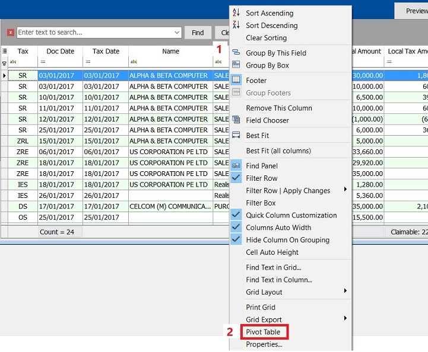

3. At Pivot Table, there are 3 sections as below:
   
   a. **Data Fields** – Data field will auto inserted when you launch the pivot table.

   b. **Row Fields** – To structure the grouping for Rows.

   c. **Column Fields** – To structure the grouping for Columns.

   

4. Use the grid columns to structure the pivot format. See the screenshot below.

   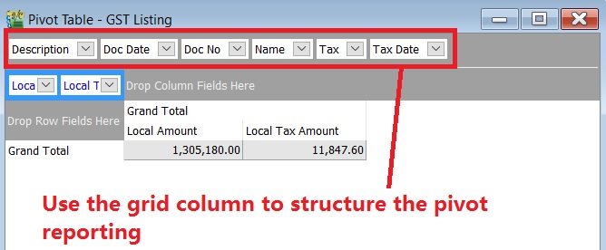

5. Drag the grid column into Row fields or Column fields.

   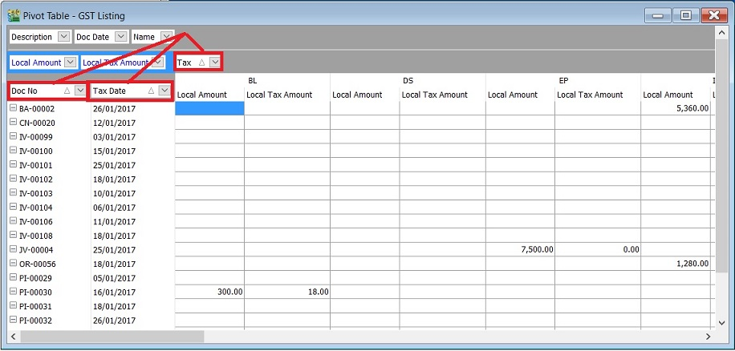

:::note Hint 1:

1. Right click on the **Row Field**
2. Select **Expand All**.
 

:::

:::note Hint 2:

1. Right click on the grey area.
2. A small menu pop out.

   1. **Show Field List** - Not really use to it.
   2. **Show Pre-filter Dialog** - Insert filter conditions.
   3. **Print Grid** - To print the grid.
   4. **Grid Export** - To export the grid data into EXCEL, TEXT, HTML and XML.

:::

## Print GST - 03

To generate the GST-03 data for submission via TAP.

### GST - 03

#### GST-03-Parameter

| Parameter   | Type   | Explanation                         |
|-------------|--------|-------------------------------------|
| GST Process | Lookup | To select the GST Process Period.   |

See example of the **GST Process Lookup** screenshot below.

#### GST-03 Form

1. After select the GST Process parameter, click on APPLY.
2. See the below screenshot.

   

#### GST-03 TAP Upload File

1. At the GST-03 on the screen, click on the **PLAY** button.
2. Click on **GST03_TAP**. See the below screenshot.

   

3. Select the destination directory to save the TAP-Upload text file, eg. GST Tap Return for Oct 2015 the filename: **GSTTapReturn-201510**.
4. Click on **SAVE**.
5. See the below screenshot.

   

6. Prompt the below message. Press OK to proceed to upload the file via TAP website.

   

### GST - 03 Item Details

Original source from RMCD website:
[GST-03 Guidelines from RMCD website](https://mydlv.customs.gov.my/www/admin/files/JKDM/resources/assets/pdf/Panduan_Mengisi_Borang%20GST-03.pdf)

#### PART A : DETAILS OF REGISTERED PERSON

| Item No. | Description        | Guidelines                                   |
|----------|--------------------|----------------------------------------------|
| 01       | GST No.*           | GST No from File → Company Profile...        |
| 02       | Name of Business*  | Company Name from File → Company Profile...  |

#### PART B : DETAILS OF RETURN

| Item No. | Description                                                                 | Guidelines                                                                 |
|----------|-----------------------------------------------------------------------------|----------------------------------------------------------------------------|
| 03       | Taxable Period*                                                             | GST Returns – Process date range.                                          |
| 04       | Return and Payment Due Date*                                                | Follow the RMCD due date.                                                  |
| 05a      | Output Tax – Total Value of Standard Rated Supply*                          | **SR + DS** (Taxable Amount)                                                   |
| 05b      | Output Tax – Total Output Tax (Inclusive of Tax Value on Bad Debt Recovered & other Adjustments)* | **SR + DS + AJS** (Tax Amount)                                                 |
| 06a      | Input Tax – Total Value of Standard Rate and Flat Rate Acquisitions*        | **TX + IM + TX-E43 + TX-RE**                                                   |
| 06b      | Input Tax – Total Input Tax (Inclusive of Tax Value on Bad Debt Relief & other Adjustments)* | **TX + IM + TX-E43 + TX-RE + AJP** (Tax Amount)                                |
| 07       | GST Amount Payable (Item 5b – Item 6b)*                                     | Output Tax Value > Input Tax Value                                         |
| 08       | GST Amount Claimable (Item 6b – Item 5b)*                                   | Input Tax Value > Output Tax Value                                         |
| 09       | Do you choose to carry forward refund for GST?                              | Mark **X** on YES if you have ticked C/F Refund for GST.                   |

#### PART C : ADDITIONAL INFORMATION

| Item No. | Description                                                   | Guidelines                                                                                     |
|----------|---------------------------------------------------------------|------------------------------------------------------------------------------------------------|
| 10       | Total Value of Local Zero-Rated Supplies*                     | **ZRL + NTX** (Taxable Amount)                                                                     |
| 11       | Total Value of Export Supplies*                               | **ZRE + ZDA** (Taxable Amount)                                                                     |
| 12       | Total Value of Exempt Supplies*                               | **IES + ES** (Taxable Amount)                                                                      |
|          |                                                               | Note: Net Loss in Forex (IES) = 0.00                                                           |
| 13       | Total Value of Supplies Granted GST Relief*                   | **RS** (Taxable Amount)                                                                            |
| 14       | Total Value of Goods Imported Under Approved Trader Scheme*   | **IS** (value excluding tax)                                                                       |
| 15       | Total Value of GST Suspended under item 14*                   | **IS x 6%** (value of tax)                                                                         |
| 16       | Total Value of Capital Goods Acquired*                        | **TX + TX-CG + IM** (value excluding tax)                                                          |
|          |                                                               | Note: Regardless of purchase asset value. Purchase doc/Cash Book PV/ JV using "Fixed Asset" GL Account (exclude Block Tax). |
| 17       | Total Value of Bad Debt Relief Inclusive Tax*                 | **AJP** (value including tax) – Only Debtor (106 x AJP Input Tax / 6)                              |
| 18       | Total Value of Bad Debt Recovered Inclusive Tax*              | **AJS** (value including tax) – Only Debtor (106 x AJS Input Tax / 6)                              |
| 19       | Breakdown Value of Output Tax in accordance with the Major Industries Code | Picks from GL Accounts that need MSIC Code: Sales Account, Cash Sales Account, Return Inwards, etc. |
|          |                                                               | MSIC Code is a 5-digit code representing your business nature.                                 |
|          |                                                               | Used in Form GST-03 (Item 19).                                                                 |
|          |                                                               | The total GST amount of the respective MSIC Codes will be shown.                               |
|          |                                                               | **Others** will be filled automatically if exceeding 5 MSIC codes.                                 |
|          |                                                               | Refer to list of [MSIC 2008](https://phl.hasil.gov.my/pdf/pdfam/NewBusinessCodes_MSIC2008_2.pdf).                                                                    |

#### PART D : DECLARATION

| Item No. | Description           | Guidelines                                              |
|----------|-----------------------|---------------------------------------------------------|
| 20       | Name of Authorized Person* | **User name** from **Tools -> Maintain User...**                 |
| 21       | Identity Card No.*    | **IC** (New) from **Tools -> Maintain User... (Misc tab)**      |
| 22       | Passport No.*         | **Passport** from **Tools -> Maintain User... (Misc tab)**      |
| 23       | Nationality*          | **Nationality** from **Tools -> Maintain User... (Misc tab)**   |
| 24       | Date                  | Process Date                                            |
| 25       | Signature             | Sign on GST-03 print copy.                              |

:::note Note:

Column with (*) is a mandatory field.

:::

## Generate GST Audit File (GAF)

To generate the GST Audit File (GAF) upon RMCD request.
Source from: [RMCD - GAF Guilde](https://mysst.customs.gov.my/assets/document/Specific%20Guides/Guide%20Customs%20Ruling%2002DIS2019_v4.pdf)

### GST Audit File (GAF)

GST Audit File (GAF) has break into 3 parts:

1. General Ledger
2. Sales
3. Purchase

### How to Export the GAF File

1. Select the date range.

   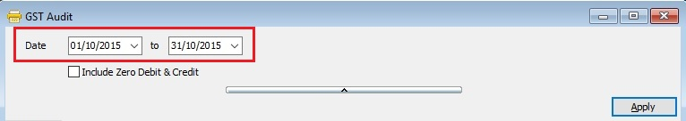

2. Click on **APPLY**.

   

3. Click on **Save As Text**.

   

4. Select the destination directory to save the GAF file. See the below screenshot.

   

5. File generated successfully. Press OK to exit the below message.

   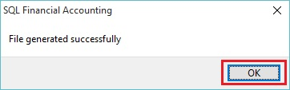

## Print GST Bad Debt Relief

A taxable person may claim bad debt relief subject to the requirements and conditions set forth under sec.58 of the GSTA 2014 and the person has not received any payment or part of the payment in respect of the taxable supply from the debtor after the sixth month from the date of supply.

The bad debt relief may be claimed if - (amended on 28 Oct 2015 from DG Decision)
(a) requirements under s.58 GSTA and Part X of GST Regulations 2014 are fulfilled; and
(b) the supply is made by a GST registered person to another GST registered person

The bad debt relief shall be claimed immediately in the taxable period after the expiry of the sixth month from the date of supply. If the bad debt relief is not claimed by the supplier in the immediate taxable period immediately after the expiry of the sixth month, then the taxable person has to notify the Director General (DG) within 30 days after the expiry of the sixth month on his intention to claim at a later date.

A GST registered person who has made the input tax claim but fails to pay his supplier within six months from the date of supply shall account for output tax immediately after the expiry of the sixth month (s.38(9) GSTA).

The word ‘month’ in sec.58 refers to calendar month or complete month –
Example: Invoice issued at 15 th January 2017. For monthly taxable period, the sixth month expires at the end of June and the bad debt relief shall be claimed in July taxable period.

See below the overview of GST Bad Debt Relief system flow:

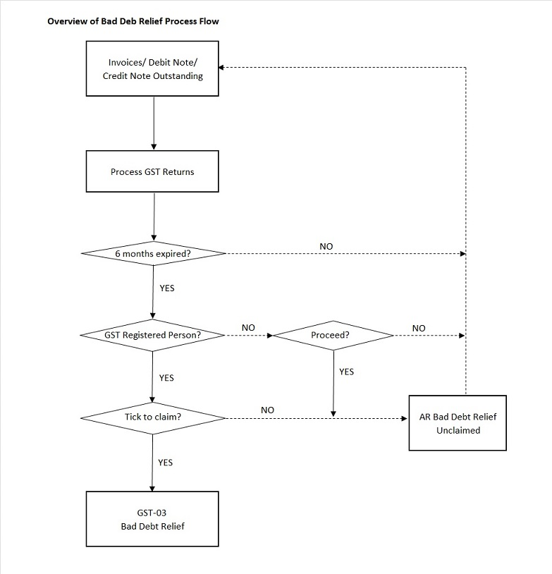

### Check List Related to Bad Debt Relief

#### Maintain Tax (Bad Debt Relief)

Below tax code will be AUTO used for Bad Debt Relief matter when process GST Return:

| Tax Code   | Description                                                           | Tax Acc Entry                                                                 | Explanation                            |
|------------|-----------------------------------------------------------------------|-------------------------------------------------------------------------------|----------------------------------------|
| SL-AJP-BD  | Input Tax adjustment e.g: Bad Debt Relief                             | DR GST-Claimable                                                              | For customer bad debt relief claim     |
|            |                                                                       | CR GST-Sales Deferred Tax                                                     |                                        |
| SL-AJS-BD  | Output Tax adjustment e.g: Bad Debt Recover, outstanding invoice > 6 months | DR Sales Deferred Tax                                                          | For customer bad debt relief recovered |
|            |                                                                       | CR GST-Payable                                                                |                                        |
| PH-AJP-BD  | Input Tax adjustment e.g: Bad Debt Relief                             | DR GST-Claimable                                                              | For supplier bad debt relief recovered |
|            |                                                                       | CR GST-Purchase Deferred Tax                                                  |                                        |
| PH-AJS-BD  | Output Tax adjustment e.g: Bad Debt Recover, outstanding invoice > 6 months | DR GST-Purchase Deferred Tax                                                   | For supplier bad debt relief payable   |
|            |                                                                       | CR GST-Payable                                                                |                                        |

#### Maintain Customer

1. There is one condition to determine the bad debt relief can be claimed if -

    1. **requirements under s.58 GSTA and Part X of GST Regulations 2014 are fulfilled**; and
    2. **the supply is made by a GST registered person to another GST registered person**

2. Therefore, you need to update the GST No for your customer who is GST registered person. See the screenshot below.
3. Under the Tax tab in Maintain Customer,

   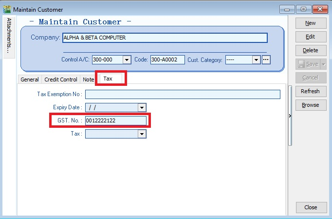

### Process GST Returns

1. Process GST Return. For example, process from 01/10/2015 to 31/10/2015.
2. Bad Debt Relief screen will be prompted (see the screenshot below) if the system found there are outstanding Tax Invoices has expired at 6 months.
3. Sales documents from the company has empty GST No will be un-ticked. You can tick the documents if you think this company is a GST Registered person.

   

   :::note TIPS:

   

   To avoid to tick the documents manually for GST Registered company, please go to update the GST no at Maintain Customer.

   :::

4. Press OK if get a "confirm" message prompted (see the screenshot below), it means there are some company do not have GST No.
5. If you have confirmed that the company is Non-GST Registered person then you can press YES to proceed.
6. Otherwise press NO, you have to update the GST No at Maintain Customer to confirm the company is a GST Registered person before process the GST Return.

   

### GST Listing (Bad Debt Relief)

Category Others will appeared in GST Listing if there is found bad debt relief (eg. AJS-BD, AJP-BD):

| Category | Description                                                             | Local Amount | Local Tax Amount |
|----------|-------------------------------------------------------------------------|--------------|------------------|
| AJS-BD   | Output Tax adjustment e.g: Bad Debt Recover, outstanding invoice > 6 months | 17,000.00    | 1,020.00         |
| AJP-BD   | Input Tax adjustment e.g: Bad Debt Relief                               | 9,114.57     | 546.87           |

### GST - 03 (Bad Debt Relief)

1. At GST Return screen, you can direct preview the GST-03 by click on the GST-03 button (see the screenshot below).

   

2. GST-03 result from the above sample data:

   | GST-03 # | Description                                                            | Amount   |
   |----------|------------------------------------------------------------------------|----------|
   | 5a       | Total Value of Standard Rated Supply                                   | 0.00     |
   | 5b       | Total Output Tax (Inclusive of Tax Value on Bad Debt Recovered & other Adjustments) | 1,020.00 |
   | 6a       | Total Value of Standard Rate and Flat Rate Acquisitions                | 0.00     |
   | 6b       | Total Input Tax (Inclusive of Tax Value on Bad Debt Relief & other Adjustments)     | 546.87   |
   | 17       | Total Value of Bad Debt Relief Inclusive Tax                           | 9,661.44 |
   | 18       | Total Value of Bad Debt Relief Recovered Inclusive Tax                 | 0.00     |

### Print GST Bad Debt Relief Report

1. This report is to help you to analyze the GST Bad Debt Relief happenings on each invoices.

   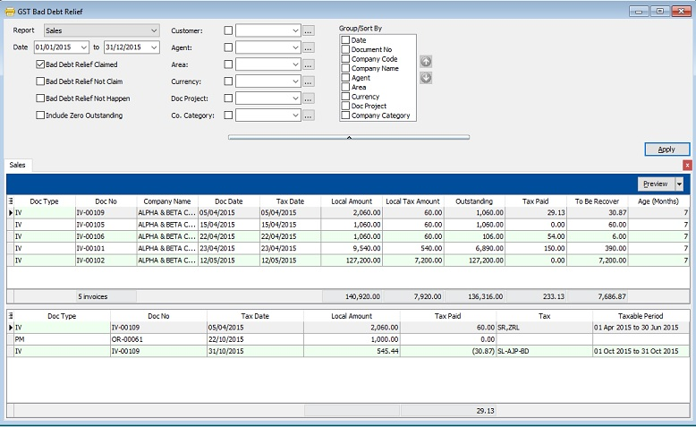

2. Let's say the IV-00109 has the following details:-

   | Seq | Description                 | Amount   | Tax | Tax Amount | Amount with Tax |
   |-----|-----------------------------|----------|-----|------------|-----------------|
   | 1   | Sales of coconut can drinks | 1,000.00 | SR  | 60.00      | 1,060.00        |
   | 2   | Sales of coconut            | 1,000.00 | ZRL | 0.00       | 1,000.00        |

3. From the below report, it tells you that the bad debt relief claimed and to be recover at **Rm30.87** for IV-00109. You can found at the detail that the bad debt relief claimed at **Taxable Period 01 Oct 2015 to 31 Oct 2015**.

   

4. After the IV-00109 has been full settlement in month Nov 2015, you will found the full tax paid **Rm60.00** and to be recover will be shown as 0. You can found at the detail that the bad debt relief recovered at **Taxable Period 01 Nov 2015 to 30 Nov 2015**.

   

5. There are some option can choose to apply the GST Bad Debt Relief for further checking:

   #### Sales

   | Checkbox                   | Explanation                                                                 |
   |-----------------------------|-----------------------------------------------------------------------------|
   | Bad Debt Relief Claimed     | GST bad debt relief that you HAVE TICKED to claim on outstanding invoices when process your GST returns. |
   | Bad Debt Relief Not Claim   | GST bad debt relief that you DO NOT TICKED to claim on outstanding invoices when process your GST returns. |
   | Bad Debt Relief Not Happen  | Outstanding invoices the GST Amount not expired at 6 months GST bad debt relief. |
   | Include Zero Outstanding    | To include the outstanding invoices are zero.                              |

   #### Purchase

   | Checkbox                  | Explanation                                                                 |
   |----------------------------|-----------------------------------------------------------------------------|
   | Bad Debt Relief Paid       | GST bad debt relief have paid on the outstanding supplier invoices when process your GST returns. |
   | Bad Debt Relief Not Pay    | GST bad debt relief not pay yet on the outstanding supplier invoices. It could be due to late receive the supplier invoice. |
   | Bad Debt Relief Not Happen | Outstanding invoices the GST Amount not expired at 6 months GST bad debt relief. |
   | Include Zero Outstanding   | To include the outstanding invoices are zero.                              |

6. Click Preview button. You can found the following report list.

   | #  | Report Name                                | Usage                                                                 |
   |----|--------------------------------------------|----------------------------------------------------------------------|
   | 1  | GST Bad Debt Relief - Sales                | GST Bad Debt Relief Listing with detail based on the checkbox ticked. |
   | 2  | GST-BM Bad Debt Relief-Unclaimed Letter 1  | Bahasa Malaysia bad debt relief unclaimed letter format 1 to Director General |
   | 3  | GST-BM Bad Debt Relief-Unclaimed Letter 2  | Bahasa Malaysia bad debt relief unclaimed letter format 2 to Director General |
   | 4  | GST-EN Bad Debt Relief-Unclaimed Letter 1  | English version bad debt relief unclaimed letter format 1 to Director General |
   | 5  | GST-EN Bad Debt Relief-Unclaimed Letter 2  | English version bad debt relief unclaimed letter format 2 to Director General |

   :::note TIPS 1 : To print the **bad debt relief unclaimed letter**.

   1. Select the **Date Parameter** as **the GST effective date onwards**.
   2. Tick both **Bad Debt Relief Not Claim** and **Bad Debt Relief Not Happen** to apply follow by preview.

      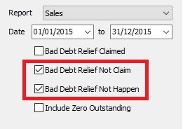

   3. This letter applicable to customer has maintained **GST No** in Maintain Customer only.

   :::

## Migration System Features-How to handle the GST Past Documents Opening Balance for Customer and Supplier

How to handle the GST Past Documents Opening Balance for Customer and Supplier?

This guide will teach you the way to handle the past outstanding documents for Customer and Supplier from previous accounting system. We are ensure that the data migration part go smooth with GST matters happened in previous system likes bad debt relief and non-refundable deposit.

**Overview of the GST Past Documents for Customer and Supplier:**
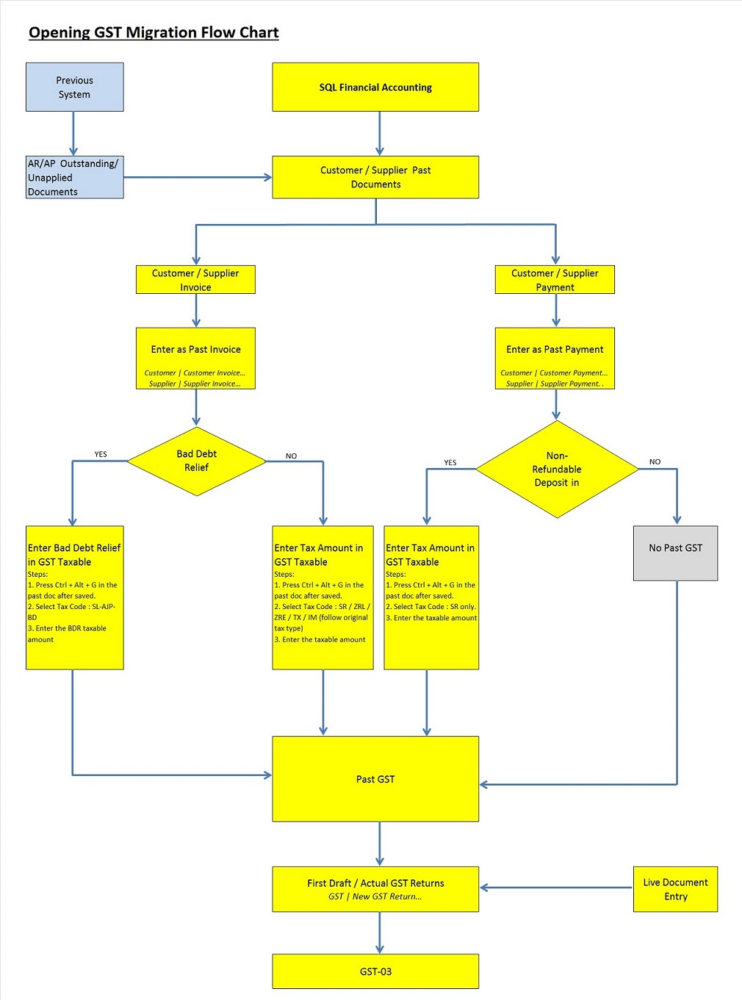

### How to enter GST Past Documents

#### Financial Start Period and System Conversion Date

1. Let's say the company GST reporting period is **Monthly**. Under the Tools | Options... set the following:-
   **Financial Start Period** : 01 Jan 2016
   **System Conversion Date** : 01 Feb 2016 (Cut-off Date for Opening Entry)

   :::note NOTE:

   It is not recommended to set the System Conversion Date fall within the quarterly GST reporting period.
   Let's say the company GST reporting period is Quarterly.

                         GST effective date : 01 April 2015

   You should set the System Conversion Date: 01 April 2016 or next quarter start date (ie. 01 July 2016).
   :::

2. See below screenshot:

   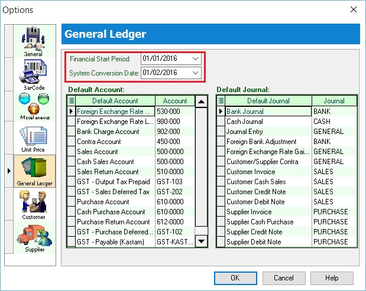

#### GST Effective Date (Bad Debt Relief)

1. Let's assume the company is GST registered at 01 April 2015.
2. See below screenshot:

   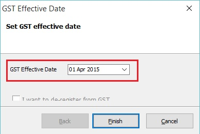

   :::note Important:

   It is very important to set the GST Effective Date where the GST commerce date started.
   Bad debt relief will based on the GST Effective date.

   For example,  **GST effective date set on 1 April 2015** and **system conversion date is 1 Jan 2016**.
   Pass document dated in 15 July 2015 **(it is after the GST effective date)**.
   Therefore, the Bad Debt Relief will be process in GST Returns-Jan 2016 automatically.

   :::

#### Enter the Past Documents (AR & AP)

1. Create new customer/supplier invoice.
2. Enter the **Invoice No**.
3. Enter the **Original Invoice Date**. Date before the system conversion date, the document will converted to "Past Invoice" automatically.
4. Enter the **Outstanding Invoice Balance** into Total.
5. Save it.
6. See screenshots below.

   **Screenshot 1: Past Invoice:**

   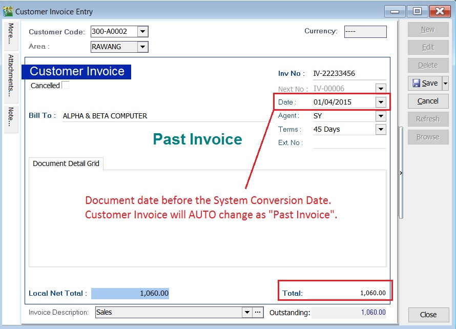

   **Screenshot 2: Past Payment:**

   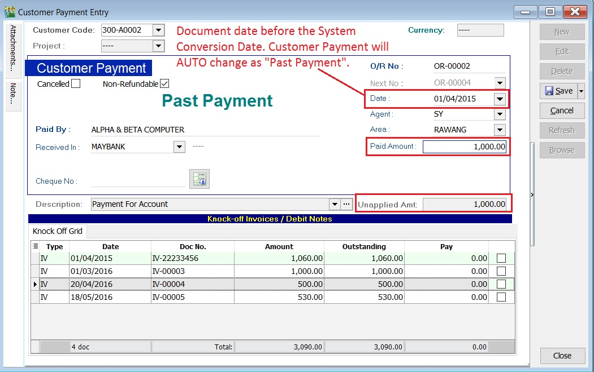

7. Take note to the below table.

   | Action                                            | Where to Enter?                                                                 |
   |---------------------------------------------------|---------------------------------------------------------------------------------|
   | To enter the Customer Past Tax Invoice            | a. Go to Customer / Customer Invoice...                                         |
   |                                                   | b. Refer the above step 1.                                                      |
   | To enter the Supplier Past Tax Invoice            | a. Go to Supplier / Supplier Invoice...                                         |
   |                                                   | b. Refer the above step 1.                                                      |
   | To enter the Customer Past Non-Refundable Deposit (for SR, ZRL, ZRE) | a. Customer / Customer Payment...                 |
   |                                                   | b. Refer the above step 1.                                                      |
   |                                                   | c. Tick the Non-Refundable checkbox (for SR only).                              |
   |                                                   | d. Un-tick the Non-Refundable checkbox (for ZRL & ZRE).                          |

#### Enter the GST Taxable for Past Documents (AR & AP)

1. Open the past tax invoice document.
2. **Press CTRL + ALT + G**.... You able to assign the tax code (SR / ZRL / ZRE / TX / IM...etc), the taxable amount (eg. Rm 1,000.00) and the tax amount (eg. Rm 60.00) for past document.

   :::note Note:

   Document must be saved before **press CTRL + ALT + G**.

   :::

3. Save it.
4. See screenshot below.

   **Screenshot 3: GST Taxable:**

   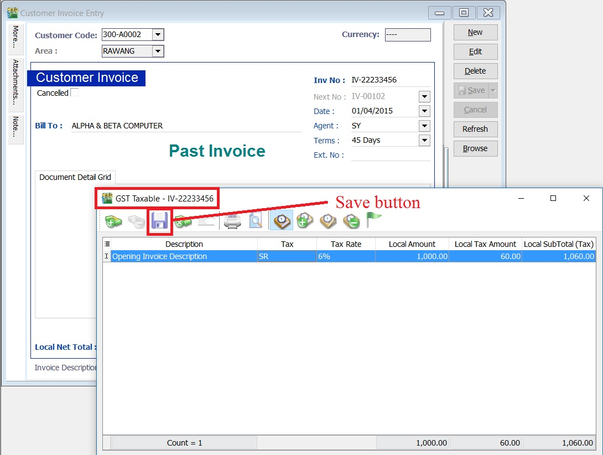

5. Take note to the below table.

   | Action                                             | Where to Enter?                                                                 |
   |----------------------------------------------------|---------------------------------------------------------------------------------|
   | To enter GST Taxable for the Customer Past Tax Invoice | a. Go to Customer / Customer Invoice...                                         |
   |                                                    | b. Refer the above step 1.                                                      |
   |                                                    | c. Tax code commonly apply to this matter is SR / ZRL / ZRE / SL_AJP-BD (for bad debt relief claimed as input tax in old system). |
   | To enter GST Taxable for the Supplier Past Tax Invoice | a. Go to Supplier / Supplier Invoice...                                         |
   |                                                    | b. Refer the above step 1.                                                      |
   |                                                    | c. Tax code commonly apply to this matter is TX / IM / PH_AJS-BD (for bad debt relief paid as output tax in old system). |
   | To enter GST Taxable for the Customer Past Non-Refundable Deposit | a. Go to Customer / Customer Payment...                                         |
   |                                                    | b. Refer the above step 1.                                                      |
   |                                                    | c. Tax code commonly apply to this matter is SR.                                |

#### Past Documents GST Taxable Listing

1. Select the date range to apply.

   > *date from* (GST effective date) and *date to* (before the system conversion date).

2. See screenshot below.

   Screenshot 4: GST Taxable Listing:

   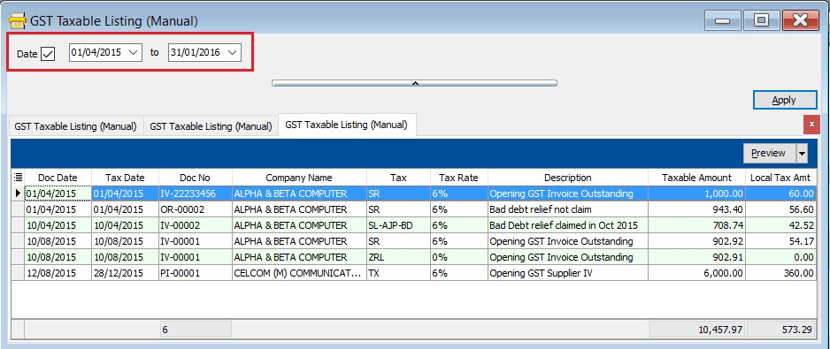

### GST Returns

1. Select the date range. See screenshot below.

   1. Monthly (eg. 01/02/2016 - 29/02/2016)
      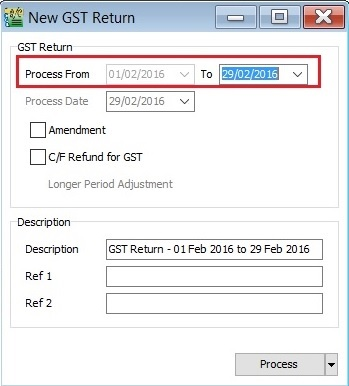

   2. Quarterly (eg. 01/02/2016 - 30/04/2016)
      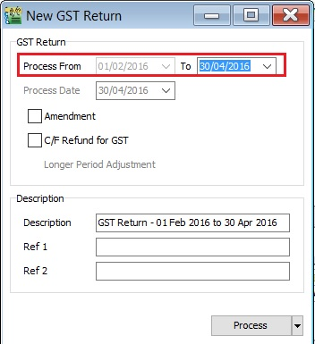

2. Click to **Process**.

3. **Past GST transactions** will generated automatically after click **Process**. See below screenshot.

   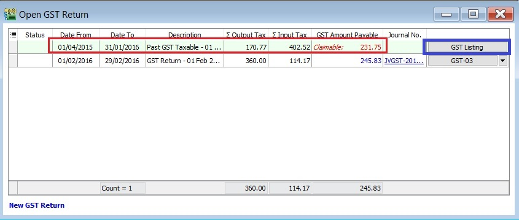

   :::note Tips:

   To check the past GST listing, click on **GST Listing** button.

   :::

4. Current GST Returns will be processed at the same times. See below screenshot.

   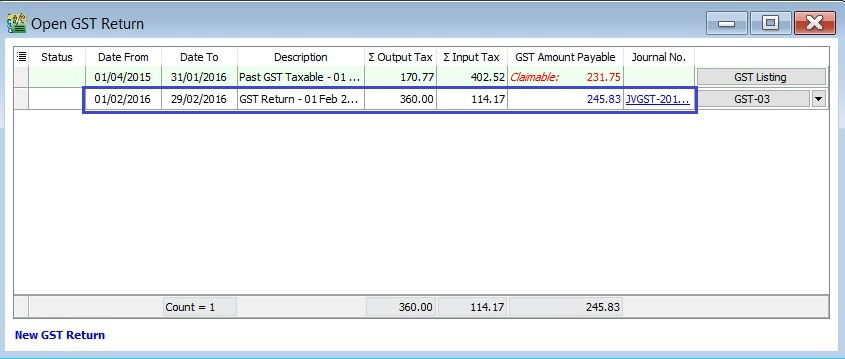

### Special Cases

#### Case 1: Claim bad debt relief based on the outstanding in SQL Accounting

1. Old System
    1. invoice
       Invoice No: **IV-00001**
       Invoice Date: **10 Aug 2015**
       Invoice Doc Amount: **2,060.00**
       Invoice Details:

       | Tax  | Local Amount | Local Tax Amount | SubTotal |
       |------|--------------|------------------|----------|
       | SR   | 1,000.00     | 60.00            | 1,060.00 |
       | ZRL  | 1,000.00     | 0.00             | 1,000.00 |
       | **Total** |              |                  | 2,060.00 |

    2. Payment
        OR Date: **20 Aug 2015**
        Knock-Off Amount: **200.00**

    3. Invoice Outstanding: **1,860.00**

2. SQL Account
   1. Past Invoice:
       Past Invoice No: **IV-00001**
       Past Invoice Date: **10 Aug 2015**
       Past Invoice Total: **1,860.00**

      :::note NOTE:

      User should key-in the total outstanding in the Past Invoice, eg. 2,060.00 - 200.00 = **1,860.00**.

      :::

      See example of **past invoice** in below screenshot.

      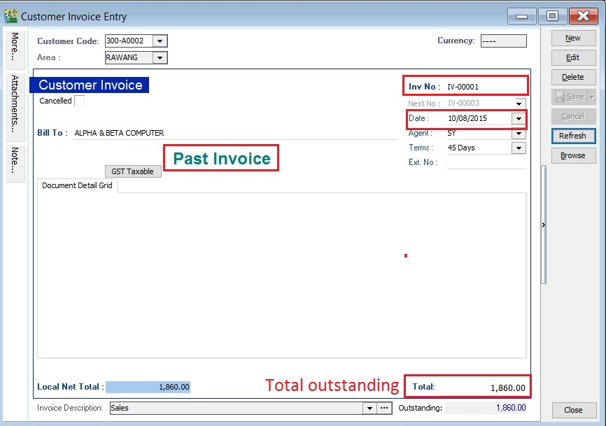

   2. Past GST Taxable Detail:

      | Tax | Taxable Amount | Local Tax Amount | SubTotal |
      |-----|----------------|------------------|----------|
      | SR  | 902.92         | 54.17            | 957.09   |

      OR

      | Tax              | Taxable Amount | Local Tax Amount | SubTotal |
      |------------------|----------------|------------------|----------|
      | SR               | 902.92         | 54.17            | 957.09   |
      | ZRL              | 902.91         | 0.00             | 902.91   |
      |  |    |               **Total Outstanding**   |   **1,860.00**        |

      See example of **past GST taxable** in below screenshot.

      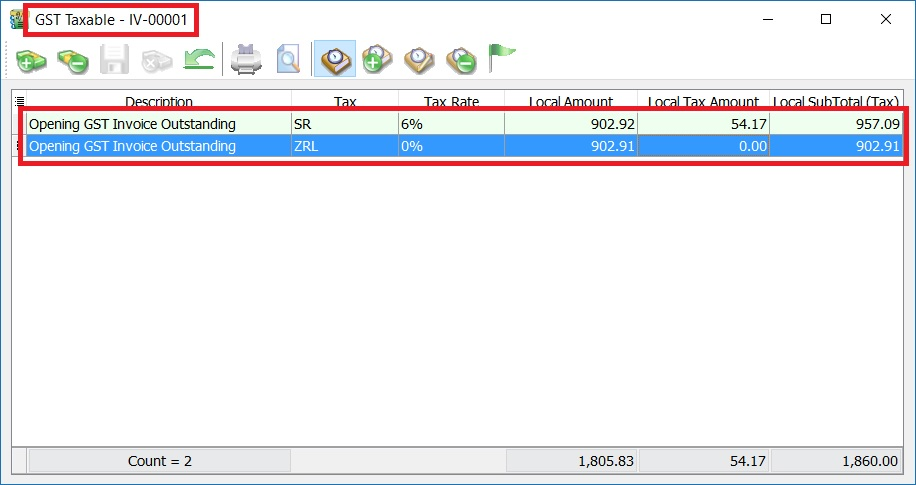

#### Case 2: Bad debt relief claimed and partial recover in Old System; partial or fully recover in SQL Account

1. Old System
    1. Invoice:

       Invoice No: **IV-00002**
       Invoice Date: **10 April 2015**
       Invoice Doc Amount: **2,060.00**
       Invoice Details:

       | Tax   | Local Amount | Local Tax Amount | SubTotal |
       |-------|--------------|------------------|----------|
       | SR    | 1,000.00     | 60.00            | 1,060.00 |
       | ZRL   | 1,000.00     | 0.00             | 1,000.00 |
       |                  |          |**Total** | **2,060.00** |

    2. Payment #1:

       OR Date: **20 April 2015**
       Knock-Off Amount: **200.00**
       Bad Debt Relief detail from outstanding invoice:

       | Tax    | Local Amount | Local Tax Amount |
       |--------|--------------|------------------|
       | AJP-BD | 902.92       | 54.17            |

    3. Payment #2:

       OR Date: **01 Nov 2015**
       Knock-Off Amount: **400.00**
       Bad Debt Recover details:

       | Tax    | Local Amount | Local Tax Amount |
       |--------|--------------|------------------|
       | AJS-BD | 194.18       | 11.65            |

    4. Invoice Outstanding: 1,460.00

2. SQL Account
    1. Past Invoice:

        Past Invoice No: **IV-00002**
        Past Invoice Date: **10 April 2015**
        Past Invoice Total: **1,460.00**

       :::note Note:

       User should key-in the total outstanding in the Past Invoice, eg. 2,060.00 - 200.00 - 400.00= **1,460.00.**

       :::

       See example of **past invoice** in below screenshot.

       

    2. Past GST Taxable Detail:

       | Tax       | Taxable Amount | Local Tax Amount | SubTotal |
       |-----------|----------------|------------------|----------|
       | SL-AJP-BD | 708.74         | 42.52            | 751.26   |

      :::note NOTE:

      User no need to key-in the payment #1 and payment #2 in SQL Account.
      Outstanding Taxable amount = 902.92 (Payment #1) - 194.18 (Payment #2) = **708.74**
      Bad debt relief not recover = 54.17 (Payment #1) - 11.65 (Payment #2) = **42.52**
      **Any current payment knock-off to the above invoice will automatically treat as bad debt recover in next taxable period**.

      :::

      See example of **past GST taxable** in below screenshot.

      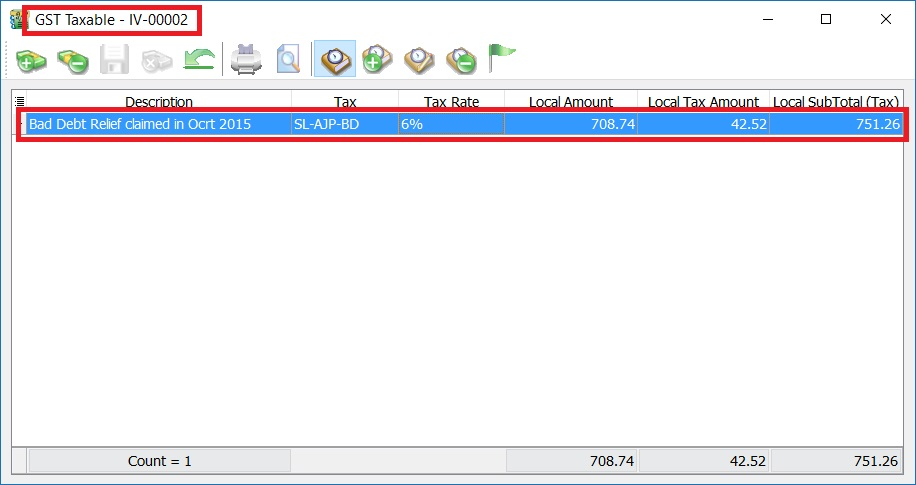

## GST - Payment to RMCD

1. Net GST Payable is the total GST amount to be paid to RMCD.
2. Net GST Claimable is the total GST amount to be claimed or refund from RMCD.

### Payment to RMCD

1. Click on the **New** followed by selecting **Payment Voucher**.
2. Enter the **ROYAL MALAYSIA CUSTOMS DIRAJA' into** Pay To field.
3. At the detail, select GL Code: **GST-KASTAM**.
4. Enter the description to describe the GST Payable for the period, eg. **GST Payable - Jan 2016**.
5. Based on the GST Returns, enter the GST amount payable **(Rm836.04)** into the **Amount** column.

   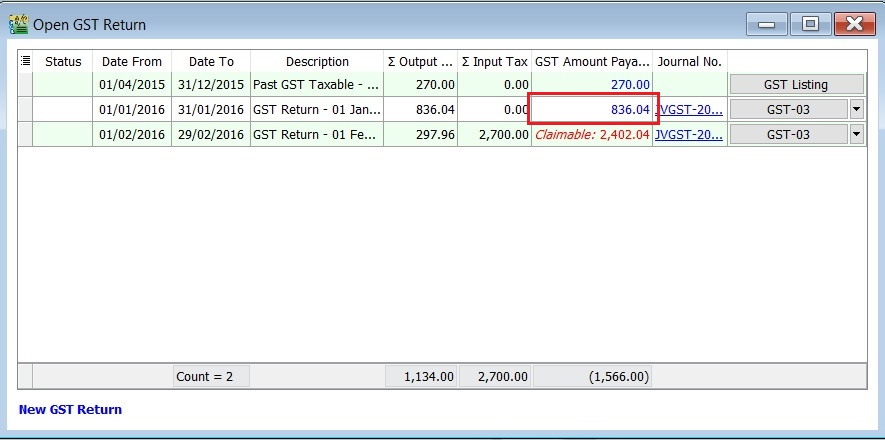

6. Save it. See the screenshot below.

   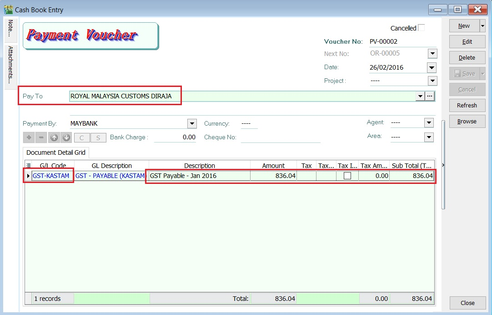

### Refund From RMCD

1. Click on the **New** follow by select **Official Receipt**.
2. Enter the **ROYAL MALAYSIA CUSTOMS DIRAJA' into** Received From field.
3. At the detail, select GL Code: **GST-KASTAM**.
4. Enter the description to describe the GST Claimable for the period, eg. **GST Claimable - Feb 2016**.
5. Based on the GST Returns, enter the GST amount claimable **(Rm2,402.04)** into the **Amount** column.

   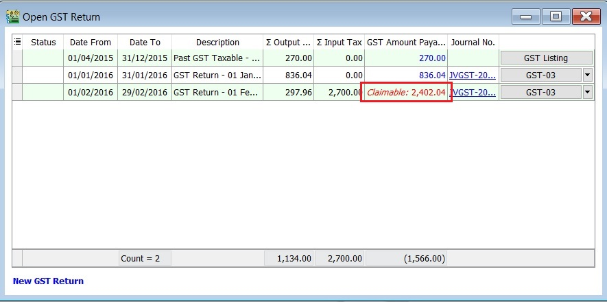

6. Save it. See the screenshot below.

   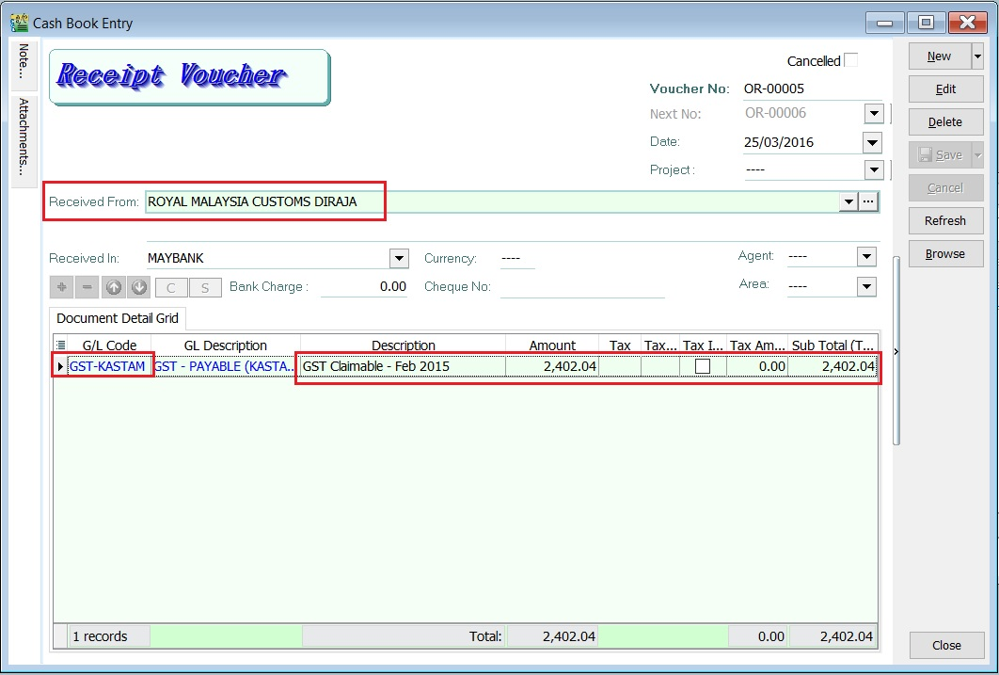

### GST - Kastam Account Inquiry

1. Select the date range.
2. Select the GL Account code : **GST-KASTAM**.
3. Click **Apply**.
4. RMCD outstanding transactions will be display as below.

   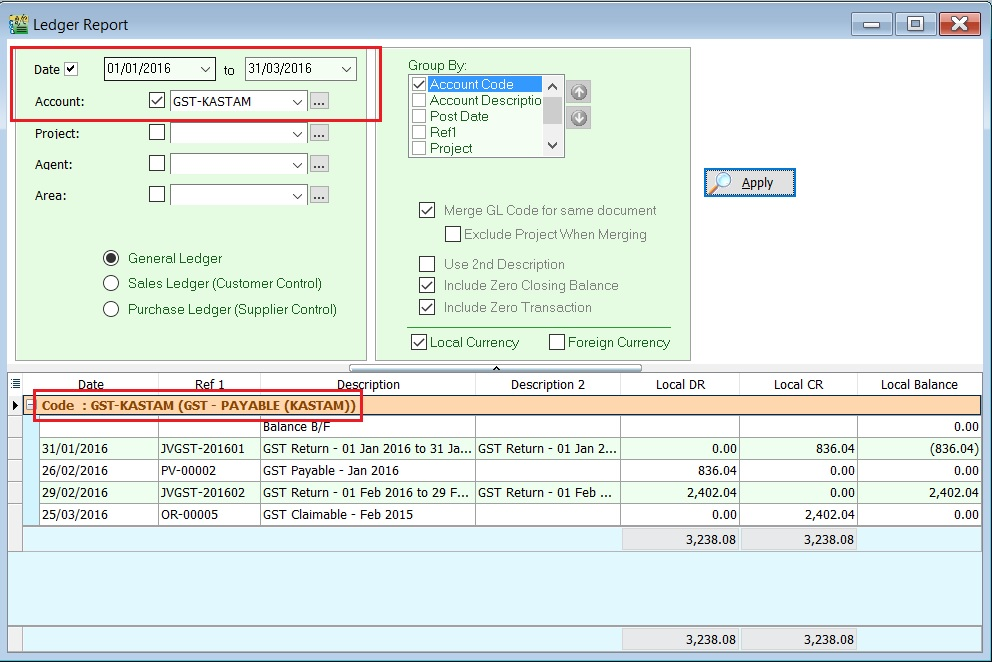

## GST - GST-03 Amendment

For those company who might asked and self report to RMCD for the GST-03 amendment. It could be because of applying wrong tax code or others reasons.
Therefore, this guide will explain the features to perform amendment on the particular GST-03 and re-submit via TAP website.

### Notification On GST 03 Return Amendment

In accordance with **Regulation 69 of the GST Regulation 2014**, with **effect from 23 August 2016**, rules on return amendments are follows:

  1. There is **no limit** on return amendments until due date of submission of return.
  2. Amendment are allowed once within 30 days **(for monthly taxable period)** or 90 days **(for quarterly taxable period)** after last day of submission of return. Subsequent amendment are subject to approval by GST Officer.
  3. Amendment after the period stated in PARA 2 above are subject to approval by GST Officer.
  4. Amendment can be made through TAP but are subject to approval by GST Officer.
  5. Return amendments which are not approved by GST Officer is considered invalid and previous return made before the amendment will be accepted.

### GST - 03 Amendment

1. Highlight and right click on the GST-03 that you are required to resubmit as **amendment**.

   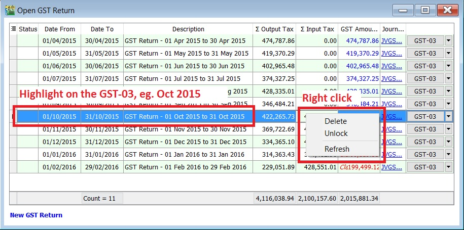

2. Select **Unlock**.

   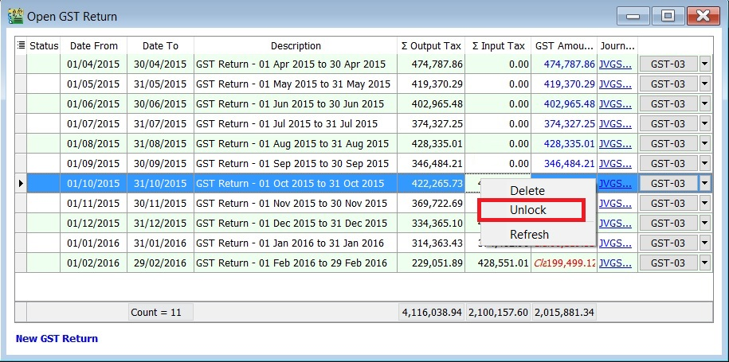

3. Click on **No** to unlock this GST Return.

   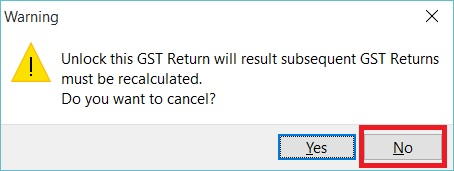

   :::note Important:

   Read the message before take further actions.

   :::

4. Enter the ADMIN password.

   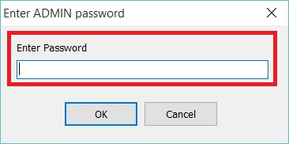

   :::note NOTE:

   ADMIN password only

   :::

5. Status will added **Unlock** icon. It means users are allow to amend the documents for the month unlock, eg. the documents are able to amend in Oct 2015 only.

   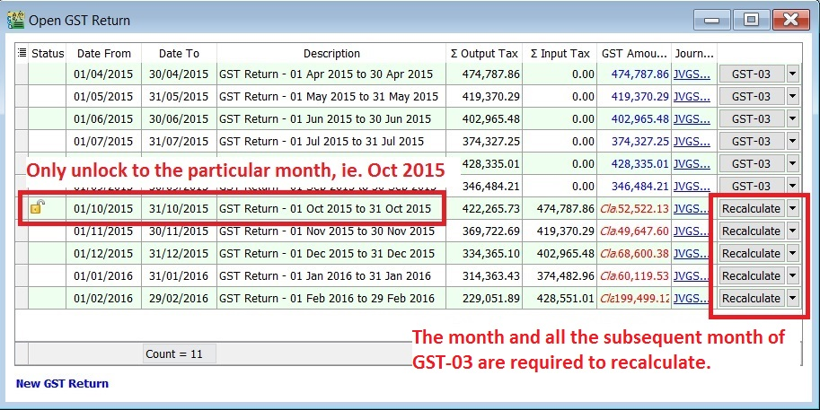

   :::note NOTE:

   1. The month and all the subsequent month of GST-03 will converted to "Recalculate" action. It is depends on the amendment which might trigger the bad debt relief result changed.
   2. All the subsequent month of GST-03 are not allow to amend the documents (eg. invoice, credit note, supplied invoice, etc), unless you have **Unlock** it.

   :::

6. For example, to correct the tax code from ZRL to SR for the invoice amount Rm2,500.00.

   1. Edit the invoice (eg. IV-00014 and date: 02 Oct 2015)

      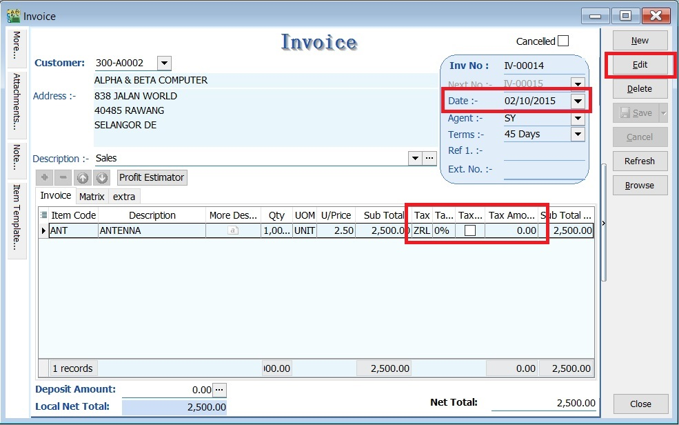

      ::: NOTE:

      **Unlock** GST-03 is allow you to edit the documents only.

      :::

   2. Change the tax code from **ZRL** to **SR**.
   3. It will will resulting the **output tax increased by Rm150.00** (Rm2,500.00 X 6%).

      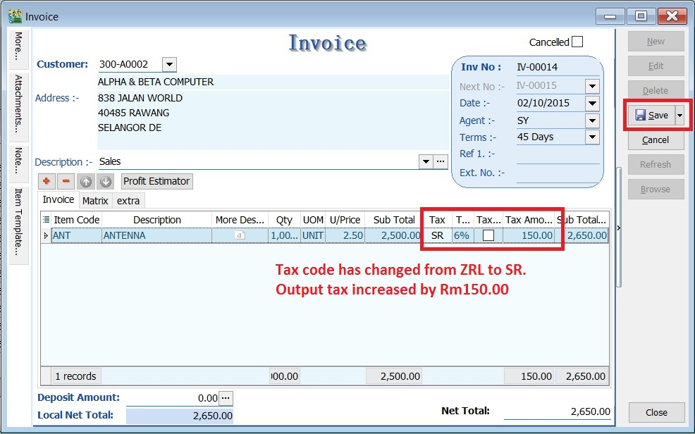

7. Run **Recalculate** for the GST-03 (eg. Oct 2015)
8. System will prompt **Recalculate successfully**.

   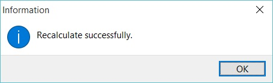

9. Press ok to proceed and a draft copy of GST-03 for Oct 2015 will create automatically. A previous GST-03 before perform any amendment to the taxable period will converted as **DRAFT** status.

   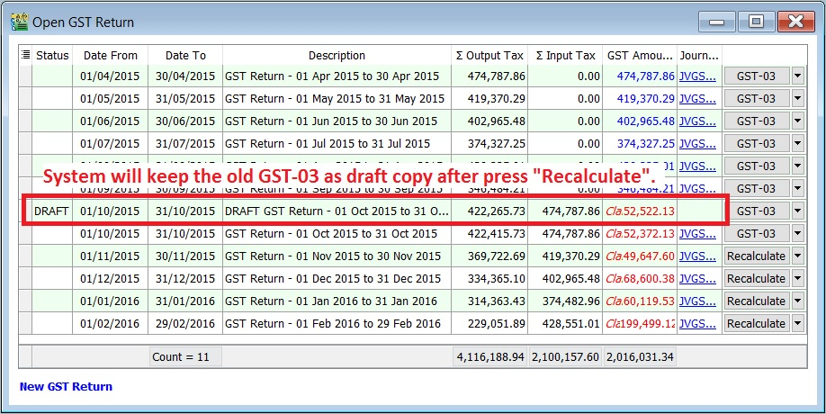

10. You can see the comparison in between **the draft (from Recalculate)** and **the Final GST-03** for the amendment taxable period.

   

   | Status                | Taxable Period     | Total Output Tax | Total Input Tax |
   |------------------------|--------------------|------------------|-----------------|
   |                   | 01 Oct - 31 Oct 2015 | 422,415.73       | 474,787.86      |
   | Draft                  | 01 Oct - 31 Oct 2015 | 422,265.73       | 474,787.86      |
   |   |  Increase/Decrease (-)                  | 150.00            | 0.00            |

### How to know the GST - 03 has performed amendment

1. You can find a **cross marked (X)** on the amendment column in the GST-03. See the screenshot below.

   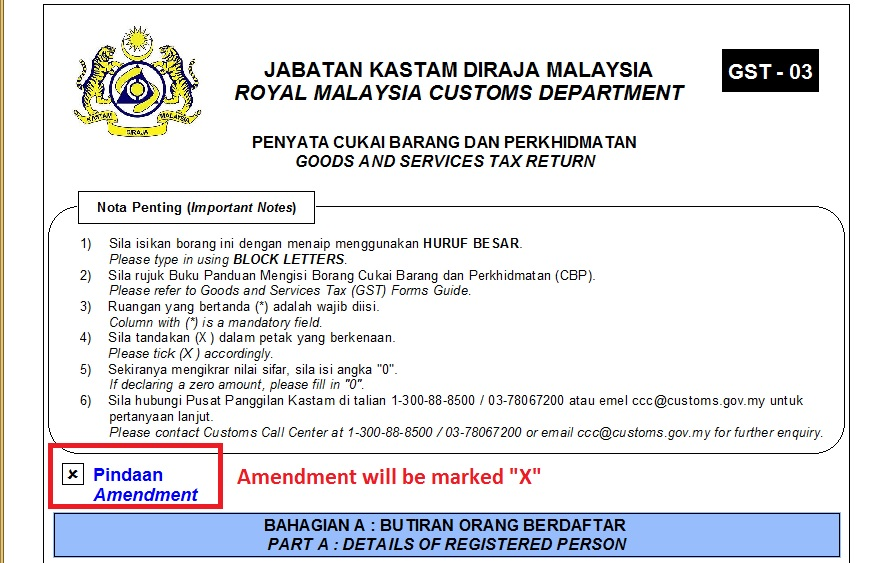

2. At the GST Returns, insert a grid column **Amendment**. Usually, you will found **the ticked on the amendment column** for both DRAFT and final GST-03.

   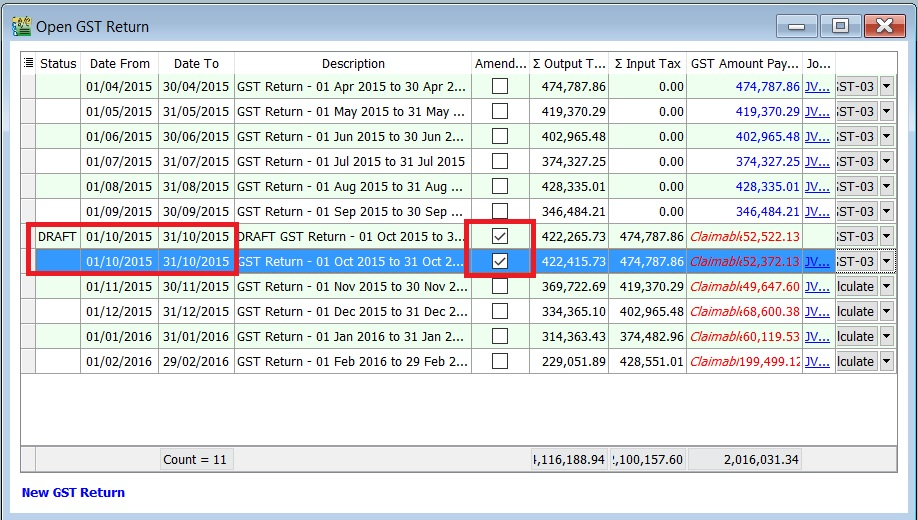

### How to unlock the subsequent GST - 03 for amendment

1. Highlight on the subsequent GST-03, eg. for subsequent taxable period is 01 Nov - 30 Nov 2015.
2. Right and **unlock** it.

   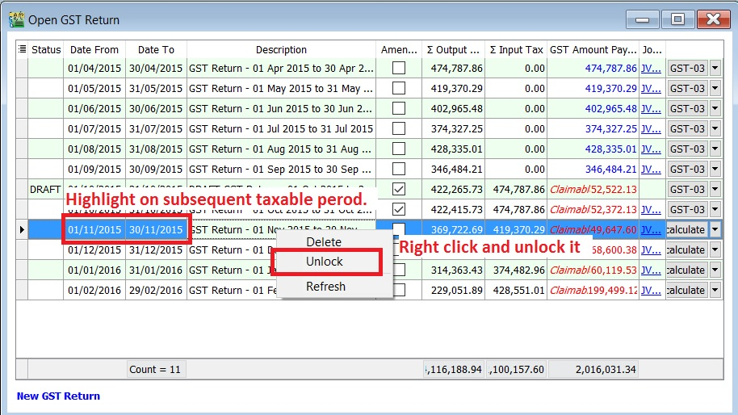

## How to Avoid Costly GST Errors

This guide will help you to easily identify the common GST errors in GST Returns. To minimize GST amendment and incorrect GST Returns to RMCD.
You may wish to take note the follow errors commonly made by businesses:

1. Standard Rated Supply (5a) and Output Tax (5b)
2. Standard Rate and Flat Rate Acquisitions (6a), and Input Tax (6b)
3. Local Zero-Rated Supplies
4. Export Supplies
5. Exempt Supplies
6. Supplies Granted GST Relief
7. Goods Imported Under Approved Trader Scheme and GST Suspended
8. Capital Goods Acquired
9. Bad Debt Relief
10. Bad Debt Recovered
11. Output tax value breakdown into Major Industries Code (MSIC Code)
12. Other important info required in GAF
13. GL Ledger vs GST-03
14. Foreign currency exchange rate

### Standard Rate Supply (5a) and Output Tax (5b)

**Mapping of GST Tax Code:**

| GST-03 | Description                                                              | Tax Code   |
|--------|--------------------------------------------------------------------------|------------|
| 5a     | Total Value of Standard Rated Supply                                     | **SR, DS**     |
| 5b     | Total Output Tax (Inclusive of Tax Value on Bad Debt Recovered & others adjustments) | **SR, DS, AJS** |

1. Sale or disposal of business assets
2. Goods given free as gift.
3. Inter-company transactions
4. Margin Scheme

### Standard Rate and Flat Rate Acquisitions (6a), and Input Tax (6b)

**Mapping of GST Tax Code:**

| GST-03 | Description                                                             | Tax Code                                                                                     |
|--------|-------------------------------------------------------------------------|----------------------------------------------------------------------------------------------|
| 6a     | Standard Rate and Flat Rate Acquisitions                                | **TX, TX-CG, TX-ES** (DMR is fulfilled only), **TX-IES** (Total/Full amount), **TX-RE, IM**              |
| 6b     | Total Input Tax (Inclusive of Tax Value on Bad Debt Relief & other Adjustments) | **TX, TX-CG, TX-ES** (DMR is fulfilled only), **TX-IES** (GST Claimable only based on IRR), **TX-RE, IM, AJP** |

Not all input tax claims are allowable. You can claim input tax on your purchases only if the below conditions are fulfilled.

1. Tax invoice / Simplified Tax Invoice / Custom K1 / Custom K9
   1. The buyer can use **simplified tax invoice** if the **total amount GST payable is RM30 or less**.
   2. if the **total amount of GST payable is more than RM30**, the buyer must request for a **tax invoice** with the name and address of the buyer.
   3. Tax invoice issued by approved person for Flat Rate Scheme.
   4. **K1** form for imported goods
   5. **K1** and **K9** for goods removed from bonded warehouse

2. Supplies made outside Malaysia which would be taxable supplies if **made in Malaysia**.
3. To be eligible for input tax claim relating to goods that are exported, a registered person (exporter) must ensure that:-
   1. prescribed customs form for export (K2 / K8) must have an endorsement on Remarks column in **Sistem Maklumat Kastam (SMK)** – “A claim for input tax under the GST Act 2014 will be made”; and
   2. Customs Official Receipt.

4. **Disregarded supplies** (supplies within group, supplies made in warehouse, supplies between venture operator and venturers and supplies between toll manufacturer and overseas principal).
5. Directly attributable to taxable supplies (ie. standard rated supplies and zero rated supplies).
6. Must not be disallowed expenses (or known as **Blocked Input Tax**).
   1. Passenger motor cars (**not more than 9 passengers** including driver and unladen weight does not exceed 3,000 kg) including hiring of car
   2. Repair and maintenance for motor cars
   3. Family benefits
   4. Club subscription fee
   5. Medical and personal accident insurance
   6. Medical expenses
   7. Entertainment expenses for potential customer or others than employees.

7. Must be taxable purchases (ie. purchases made from GST registered suppliers)

### Local Zero - Rated Supplies

**Mapping of GST Tax Code:**

| GST-03 | Description                         | Tax Code   |
|--------|-------------------------------------|------------|
| 10     | Total Value of Local Zero-Rated Supplies | **ZRL, ZDA** |

This refer to the following types according to **GST (Zero Rate Supplies) Order 2014**:-

1. Local supply of goods and services (**ZRL**):

   1. Zero-rated supply of goods of any of the descriptions as in Appendix (Zero-rated Supply) Order 2014 based on tariff code in such as milled-rice, fresh fruit, and live animals (cattle, buffalo, goat, sheep and swine),
   2. Medicaments and medical gases in the National Essential Medicines List issued by the Ministry of Health and approved by the Minister and put up in measured doses or in forms of packaging for retail sale,
   3. The supply of treated water by a person who is licensed under the Water Services Industry Act 2006 [Act 655] to domestic consumers irrespective of minimum or non-usage,
   4. The supply of raw materials and components made to a person who belongs in a country other than Malaysia for the treatment and processing of goods by any taxable person under the Approved Toll Manufacturer Scheme, and etc.

2. Supply of goods from Malaysia to Designated Area, ie. Pulau Langkawi, Labuan, & Pulau Tioman (**ZDA**)

### Export Supplies

**Mapping of GST Tax Code:**

| GST-03 | Description                  | Tax Code |
|--------|------------------------------|----------|
| 11     | Total Value of Export Supplies | **ZRE**      |

This refer to the Supply of goods or services **from Malaysia to Oversea** according to **GST (Zero Rate Supplies) Order 2014**.

1. Movement of goods is supported with **Customs K2** form which must stated the following:-
  a. Supplier's name and address as the consignor.
  b. Recipient's name and address in overseas recipient as the consignee.
  c. Supply of services must attached with supporting documents such as invoice for an international services. Examples includes sales of air-tickets and international freight charges.

**How to check the transactions correctly entered?**

At the invoice entry, please ensure the following screenshot and steps are followed/entered correctly:-

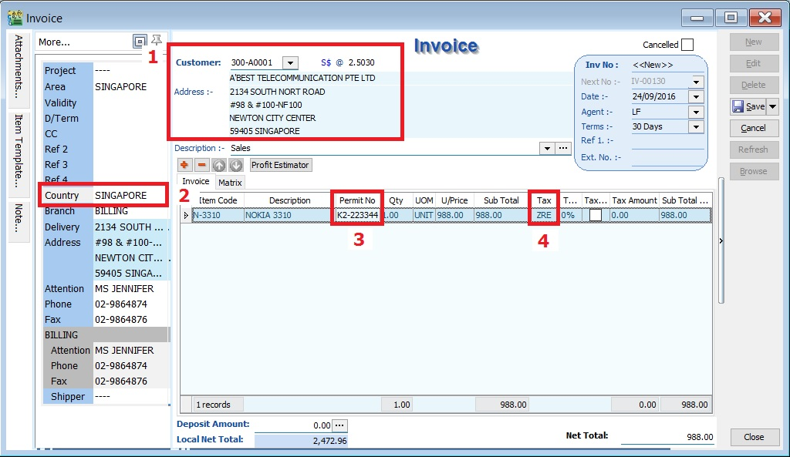

1. **Customer name** and **address** must be a **foreigner company**.
2. **Country** to define the destination of goods deliver.
3. **Permit No** to record the **Custom K2** no for supporting document reference.
4. Tax code must be **ZRE**.

### Exempted Supplies

**Mapping of GST Tax Code:**

| GST-03 | Description                 | Tax Code  |
|--------|-----------------------------|-----------|
| 12     | Total Value of Exempt Supplies | **ES, IES** |

This refer to the following types according to **GST (Exempt Supplies) Order 2014:-**

1. **Services (ES):-**
   1. Private education
   2. Private health services
   3. Childcare services
   4. Domestic transportation of passengers for mass Public Transports (eg. by rail, ship, boat, ferry, express bus, stage bus, school bus, feeder bus, workers bus and taxi)
   5. Toll highway

2. **Financial Services (IES):-**
   1. Interest income from deposits placed with a financial institution in Malaysia
   2. Interest received from loans provided to employees (factoring receivables)
   3. [Realized foreign exchange gains](../../usage/gst-and-sst/gst#gst-03-item-12-es--ies--how-to-compare-the-total-value-of-exempt-supplies-between-gst-03-and-ledger)

3. **Goods (ES):-**
   1. Residential properties
   2. Land for agricultural use
   3. Land for general user (ie. burial ground, playground or religious building)

#### How to check the transactions correctly entered?

***A. GST Listing***

1. After GST Return processed, go to **Print GST Listing....**

   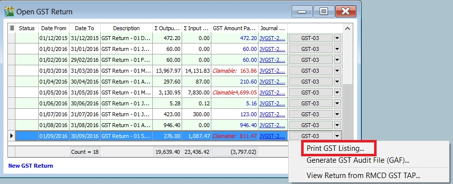

2. Preview and select the report name **GST Detail 2**.
3. To ensure the **document detail descriptions** are clearly stated and map to the correct tax code.

   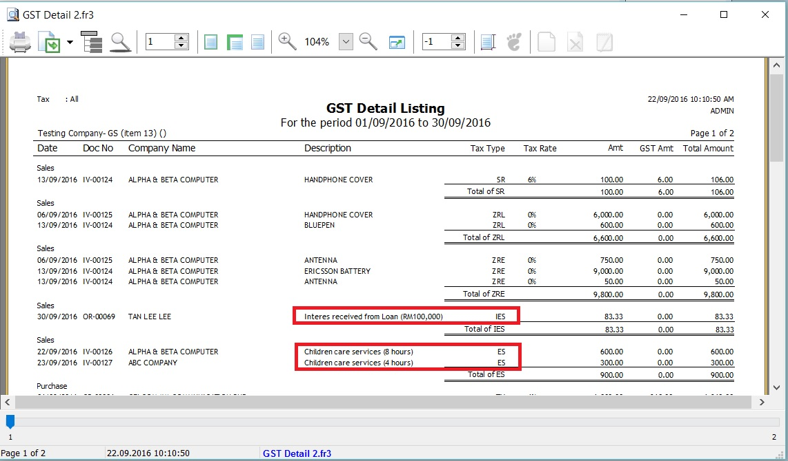

***B. GST-03***

1. To quick do amendment before submit the GST-03 to RMCD. [Click this link](../../usage/gst-and-sst/gst#gst---gst-03-amendment) to learn more about the **GST amendment**.
2. Double click on the item 12 in GST-03.

   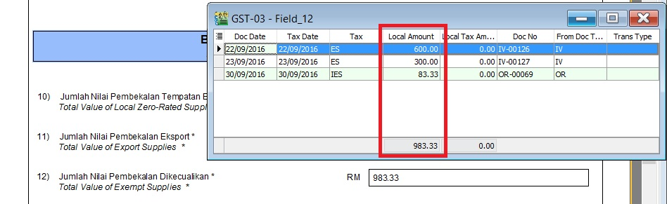

3. Drill down the documents to open and correct it accordingly.
4. Lastly, you have to **Recalculate** the amended GST Return.

### Supplies Grant GST Relief

**Mapping of GST Tax Code:**

| GST-03 | Description                              | Tax Code |
|--------|------------------------------------------|----------|
| 13     | Total Value of Supplies Granted GST Relief | **RS**       |

### Goods Imported Under Approved Trader Scheme and GST Suspended

**Mapping of GST Tax Code:**

| GST-03 | Description                                             | Tax Code     |
|--------|---------------------------------------------------------|--------------|
| 14     | Total Value of Goods Imported Under Approved Trader Scheme | **IS**           |
| 15     | Total Value of GST Suspended under item 14             | **IS** x Tax Rate |

### Capital Goods Acquired (Avoid Costly GST Error)

**Mapping of GST Tax Code:**

| GST-03 | Description                        | Tax Code                                           |
|--------|------------------------------------|--------------------------------------------------|
| 16     | Total Value of Capital Goods Acquired | **TX-CG, TX, IM** (Transaction GL Account related to **Fixed Asset**) |

### Bad Debt Relief

**Mapping of GST Tax Code:**

| GST-03 | Description                                | Tax Code      |
|--------|--------------------------------------------|---------------|
| 17     | Total Value of Bad Debt Relief Inclusive Tax | **AJP (AR only)** |

### Bad Debt Recovered

**Mapping of GST Tax Code:**

| GST-03 | Description                                 | Tax Code      |
|--------|---------------------------------------------|---------------|
| 18     | Total Value of Bad Debt Recovered Inclusive Tax | **AJS (AR only)** |

### Output tax value breakdown into Major Industries Code (MSIC Code)

1. This part usually require you to breakdown the total output tax reported in 5b according to your **main business**.
2. You have to map to [MSIC code](https://sites.google.com/site/sqlestream/sql-financial-accounting/9-good-and-service-tax-gst---malaysia/9-23-major-industries-code-msic).

**Where to set the MSIC Code?**

1. Select and edit your main business supplies GL Account, eg. my main business is selling hand-phones.
2. Select an appropriate **Industries Code**.
3. You can change the search pattern to **-A-**. See screenshot below. So you can type-in the keywords, eg. Phone.

   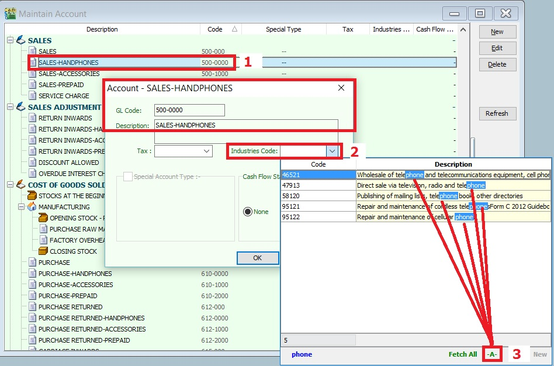

### Other important info required in GAF

The GST Audit file is a way for taxpayers to submit information relevant to auditors in response to an audit request on information for auditing purposes. The information provided includes company identifications, names, supply & purchases, and general ledger transactions. There is also a footer record to ensure file integrity.

Record types are:-

| Record Type | Description | Where it update??? |
|-------------|-------------|-------------------|
| C           | Company     | Company Profile   |
| P           | Purchase    | Supplier Invoice (PI), Supplier Debit Note (SD), Supplier Credit Note (SC), Cash Book (PV), and Journal (JE) |
| S           | Supply      | Customer Invoice (IV), Customer Debit Note (DN), Customer Credit Note (CN), Cash Book (OR), Gift/Deemed Supply (GI), and Journal (JE) |
| L           | Ledger      | From the GL Ledger reports |
| F           | Footer      | GAF file integrity check |

### GL Ledger VS GST - 03

1. **GST-Ledger-Vs-GST-03** is a very useful report to identify the unrealized human errors immediately. Possible errors may be due to documents had selected:-

   1. Wrong tax code or category
   2. Wrong account code
   3. Use Tax Date which is different from Document Date
   4. 5 Cents rounding had selected Tax Code.

2. It comprises of 2 reports:-

   | Report Name              | GL Acc                  | Explanation                                                             |
   |--------------------------|------------------------|-------------------------------------------------------------------------|
   | 1. GST-Ledger-Vs-GST-03_5b | GST-201 (GST - Payable) | To reconcile the GST Payable account between the GL Ledger and GST-03 |
   | 2. GST-Ledger-Vs-GST-03_6b | GST-101 (GST - Claimable) | To reconcile the GST Claimable account between the GL Ledger and GST-03 |

3. For example,

   Supplier invoice date (15 Sept 2016) received in Oct 2016 and GST-03 Sept 2016 has submitted. Input tax will be claim in Oct 2016 by set the tax date (31 Oct 2016). In GL Ledger, the input tax will be posted in Sept 2016. However, this input tax will be appear in GT-03 Oct 2016.
   With this **GST-Ledger-Vs-GST-03** report, you can very easy identify out the reasons. See the screenshot below.

      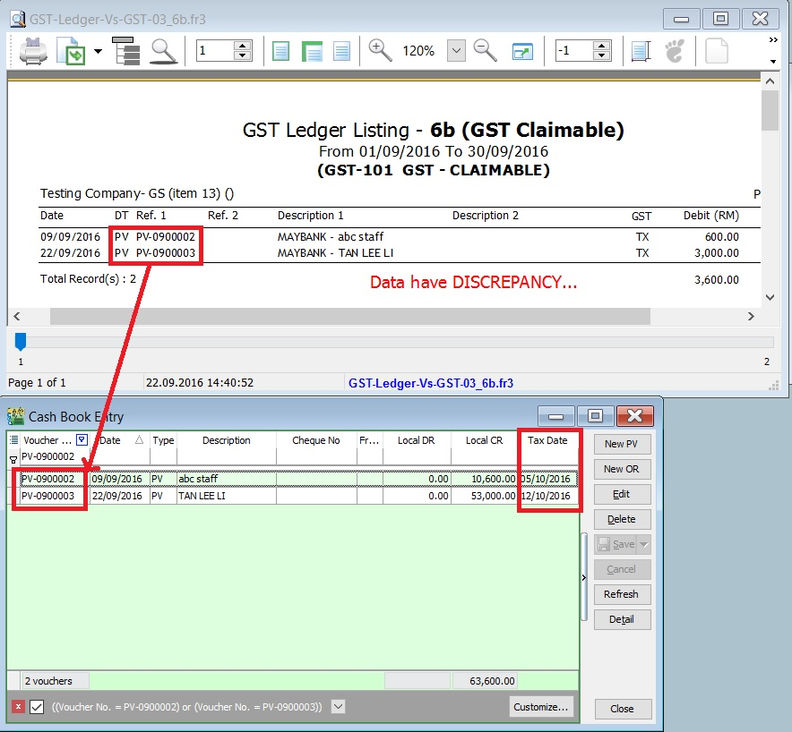

### Foreign Currency Exchange Rate

1. Always update the currency exchange rate at Tools | [Maintain Currency](../../usage/tools/guide#maintain-currency).
2. Critical cost on output tax if bill in foreign currency to local customer:

| Currency | Status     | Exchange Rate | Amount   | Local Amount | Output Tax |
|----------|-----------|---------------|---------|--------------|------------|
| USD      | Outdated  | 3.8000        | 1,000.00 | 3,800.00     | 228.00     |
| USD      | Actual    | 4.3000        | 1,000.00 | 4,300.00     | 258.00     |
|  |           |               |         |    **Under declared**          | -30.00     |

## Adjustment to negative value in GST-03

1. Negative value in 5a5b and 6a6b.
2. TAP system not accept negative value.

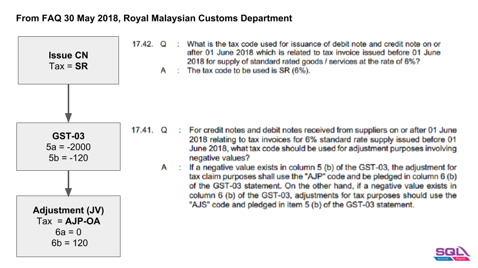

### Negative in 5a5b

1. **Output Tax (Negative)**

   | GST-03 | Value  |
   |--------|--------|
   | 5a     | -2,000 |
   | 5b     | -120   |

2. **Journal Adjustment:**

   | GL Code  | Tax    | Tax Rate | Local DR | Local CR | Local DR(Tax) | Local CR(Tax) | GST-03       |
   |----------|--------|----------|----------|----------|---------------|---------------|--------------|
   | GST-103  | **AJP-OA** | 6%       | 2,000    |          | 2,120         |               | **6a = 0, 6b = 120** |
   | GST-103  | **SR**     | 6%       |          | 2,000    |               | 2,120         | **5a = 0, 5b = 0**   |

   

### Negative in 6a6b

1. **Input Tax (Negative)**

   | Items | Value  |
   |-------|--------|
   | 6a    | -1,000 |
   | 6b    | -60    |

2. **Journal Adjustment:**

   | GL Code  | Tax    | Tax Rate | Local DR | Local CR | Local DR(Tax) | Local CR(Tax) | GST-03       |
   |----------|--------|----------|----------|----------|---------------|---------------|--------------|
   | GST-103  | **TX**     | **6%**       | 1,000    |          | 1,060         |               | **6a = 0, 6b = 0** |
   | GST-103  | **AJS-OA** | **6%**       |          | 1,000    |               | 1,060         | **5a = 0, 5b = 60** |

## GST-Submission of Final GST Return

Pursuant to Section 6, **Goods and Service Tax (Repeal) Act 2018**, all GST Registrants are required to submit the GST-03 Return on the final taxable period **(ie. 31 Aug 2018)** and make full payment for the amount of tax payable in connection with the supply **for the last taxable period within 120 days (29 December 2018)** from 01 Sept 2018.

- Any input tax claimable from the purchase/supplier invoice received after 1 Sept 2018. It can be claim and must submit into the **Final GST Returns (31 Aug 2018)**.
- Input tax claim will be subjected to verification and audit.
- Refund will be made within 6 years.

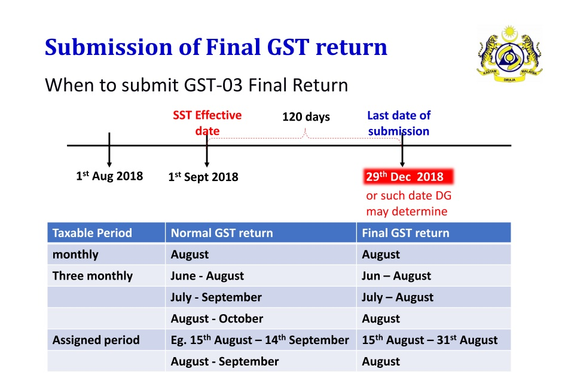

### How to enter the input tax 6% claimable from Purchase / Supplier invoice after 1st September 2018

For example, on **13 SEPT 2018**, my company has received a supplier tax invoice dated **07 MAY 2018** and amount inclusive GST is **RM10,600**.

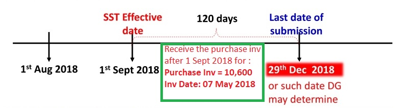

#### Enter at Purchase Invoice

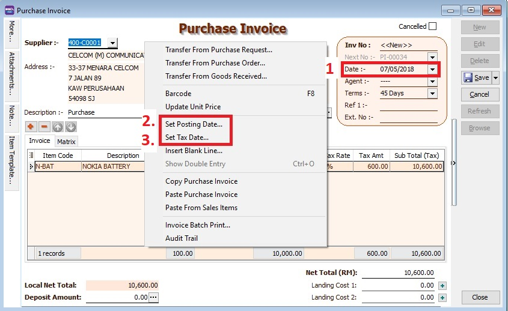

1. Set **Date**.... to record the original invoice date (eg. **07 MAY 2018**).
2. Set **Posting Date**... to post this transaction into GL reporting as at **13 SEP 2018**.

   :::note Note:

   To enable to set Posting Date, the **Double Document Module** is required.

   :::

3. Set **Tax Date**...to declare this GST input tax into **Final GST Returns (31 AUG 2018)**.

   

#### Enter at Supplier Invoice

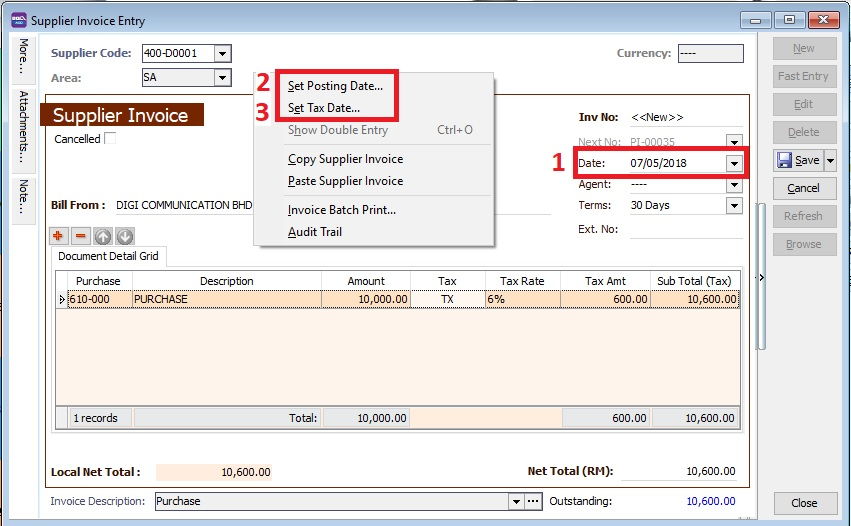

1. Set **Date**.... to record the original invoice date (eg. **07 MAY 2018**).
2. Set **Posting Date**... to post this transaction into GL reporting as **13 SEP 2018**.

   :::note Note:

   To enable to set Posting Date, the **Double Document Module** is required.

   :::

3. Set **Tax Date**...to declare this GST input tax into **Final GST Returns (31 AUG 2018)**.

   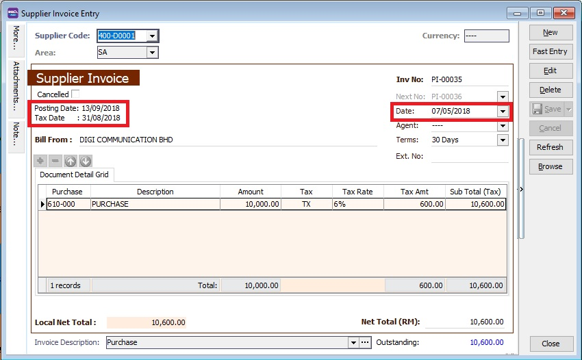

#### Enter at Cash Book (PV)

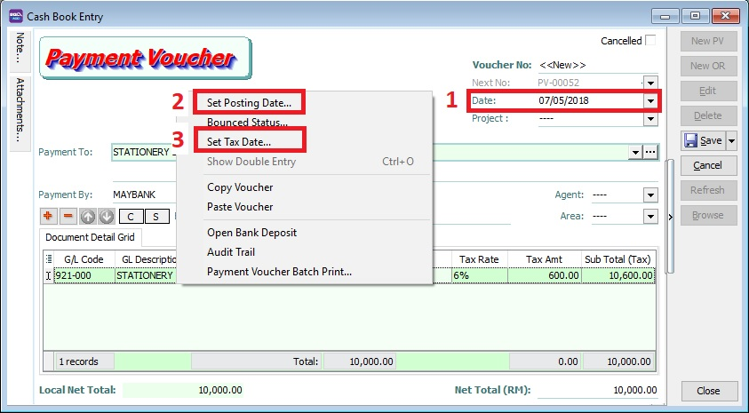

1. Set **Date**.... to record the original invoice date (eg. **07 MAY 2018**).
2. Set **Posting Date**... to post this transaction into GL reporting as at **13 SEP 2018**.
3. Set **Tax Date**...to declare this GST input tax into **Final GST Returns (31 AUG 2018)**.

   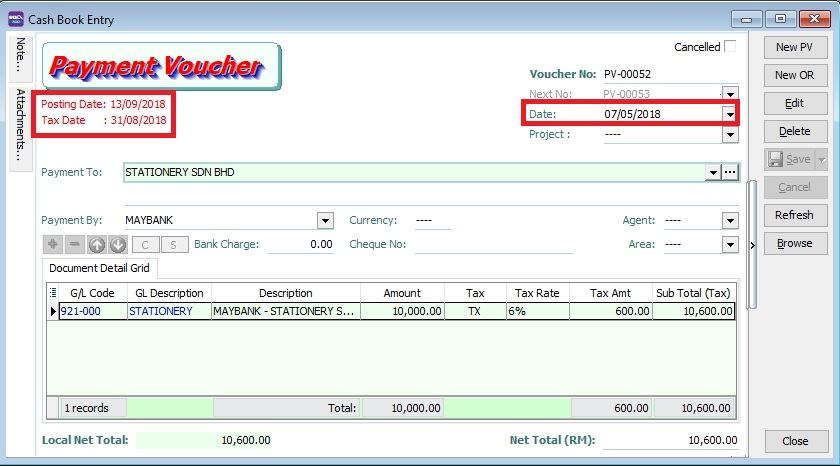

### Final GST Returns

Process GST Returns up to **31 AUG 2018**.

| Items | Value   |
|-------|---------|
| 6a    | 10,000  |
| 6b    | 600     |

   :::note NOTE:

   1. Final GST Returns until **31 AUG 2018**.
   2. Last date of submission for the **Final GST Returns is 29 DEC 2018**

   :::

## Transitional (from GST to SST)

### Bad Debt Relief / Recovered

1. GST registered person is eligible to claim the bad debt relief even if it spans on or after 1 September 2018.
2. Bad Debt Relief is allowed to be claimed within 120 days from the SST effective date (eg. 1 September 2018).
3. Bad Debt Recovery made on or after 1 September 2018 must to be paid as output tax to RMCD within 120 days from the SST effective date by amending the Final GST Return.

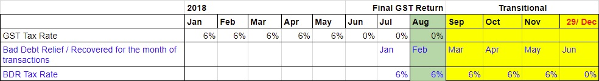

#### Final GST Return Processor

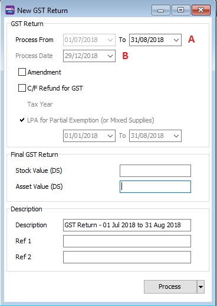

1. System will AUTO define the last taxable period **(A)**, eg...

   | Process From | Process To |
   |--------------|------------|
   | 01/07/2018   | 31/08/2018 |

2. Set the Process Date **(B)** as the date submit the Final GST return before 29 December 2018 (within 120 days from the SST effective date).

   1. For example,

      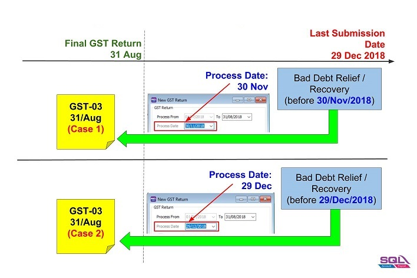

   2. Double entry for **Cases 1**.

      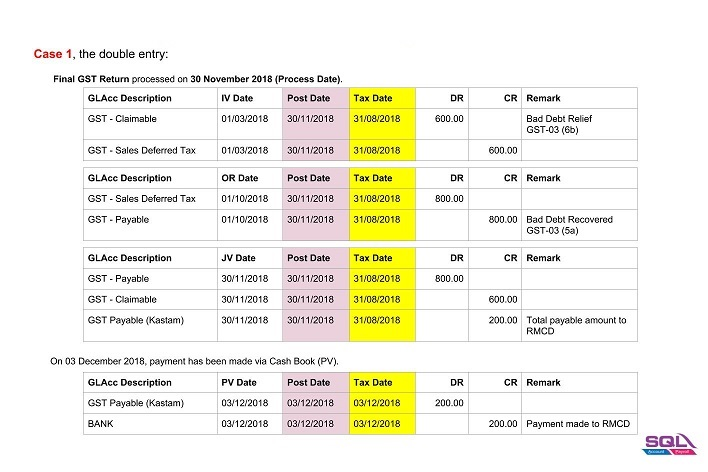

   3. Double entry for **Cases 2**.

      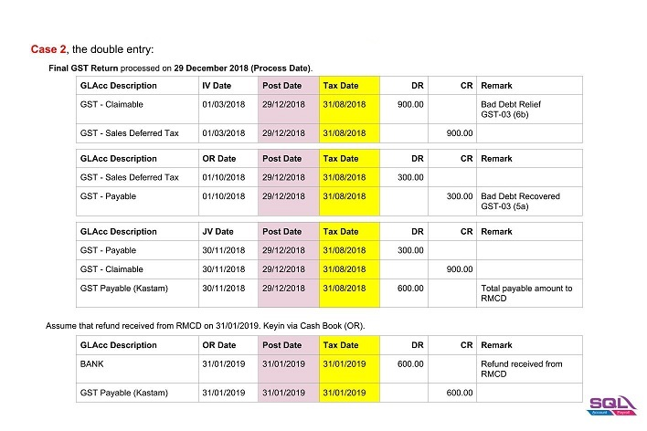

## GST Sales/Purchase Deferred Tax Journal Adjustment

1. Double entry adjustment for the balance of GST Sales / Purchase Deferred Tax (Bad Debt Relief) AFTER 29 December 2018.
2. Add the adjustment amount into Final GST Return (amendment).

   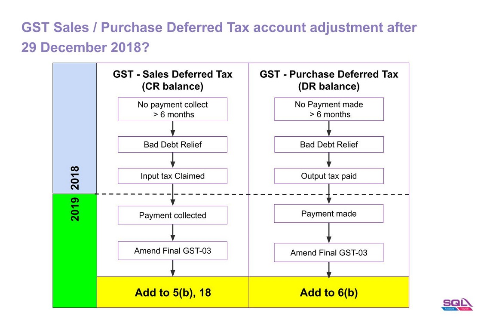

### How to check the Sales / Purchase Bad Debt Recovered Amount after Final GST Returns

1. Select a date **AFTER** the Final GST Return Date, eg. 28/02/2019.

   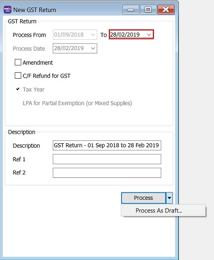

2. Choose **Process As Draft**.

   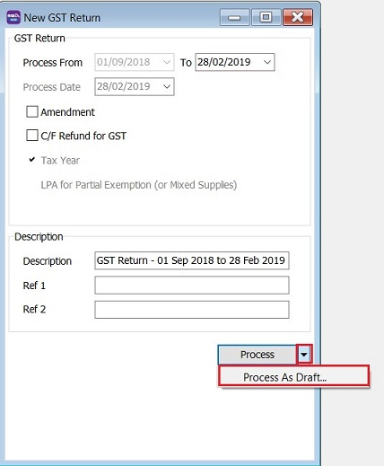

3. Click on **GST Return Draft** and **print GST Listing**.
4. Filter the **Tax Date** (ie. greater than or equal to 30 December 2018).

   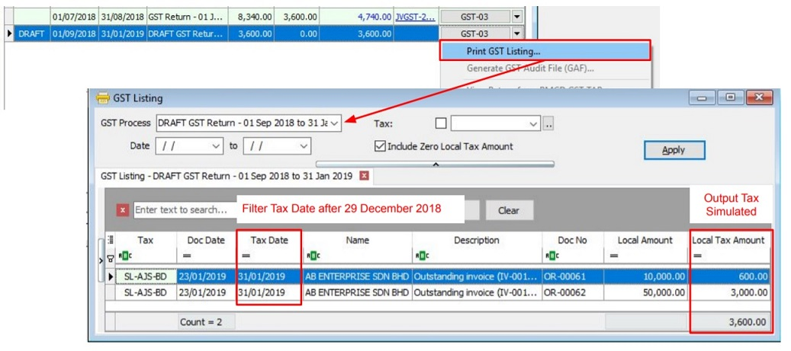

   > **SL-AJS-BD** : Sales Bad Debt Recovered (Output Tax).
   > **PH-AJP-BD** : Purchase Bad Debt Recovered (Input Tax).

### Adjustment for GST Sales Deferred Tax (SL-AJS-BD)

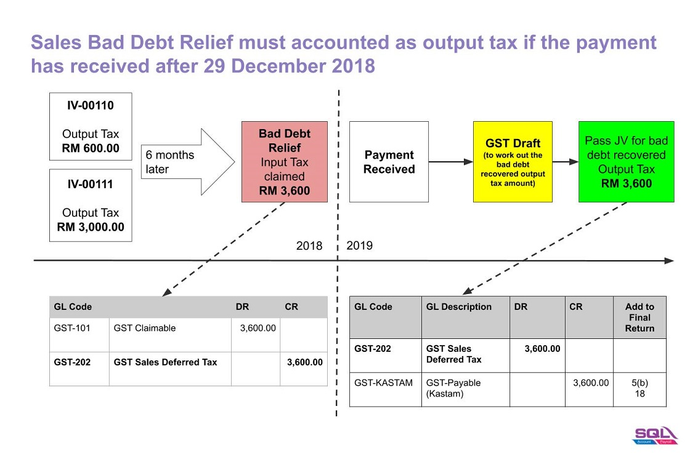

1. Based on the **GST Listing (Draft)**, post the GST Bad Debt Recovered double entry using **Journal Entry**.

   | GL Code    | GL Description            | Local DR | Local CR | Add to Final GST-03 |
   |------------|---------------------------|----------|----------|----------------------|
   | GST-202    | GST - Sales Deferred Tax  | 3,600    |          |                      |
   | GST-KASTAM | GST - Payable (KASTAM)    |          | 3,600    | 5(b), 18             |

2. Amend the Final GST Return (Aug 2018) at TAP.
3. Add the amount into
    a. 5(b)
    b. 18

### Adjustment for GST Purchase Deferred Tax (PH-AJP-BD)

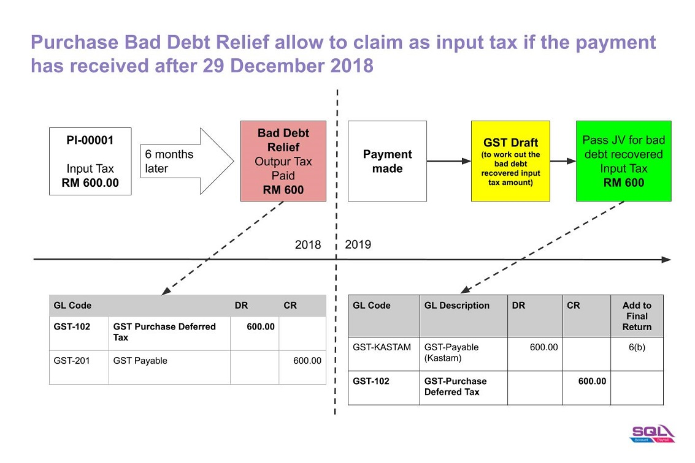

1. Based on the **GST Listing (Draft)**, post the GST Bad Debt Recovered double entry using **Journal Entry**.

   | GL Code     | GL Description              | Local DR | Local CR | Add to Final GST-03 |
   |-------------|-----------------------------|----------|----------|----------------------|
   | GST-KASTAM  | GST - Payable (KASTAM)      | 600      |          | 6(b)                |
   | GST-102     | GST - Purchase Deferred Tax |          | 600      |                      |

2. Amend the Final GST Return (Aug 2018) at TAP.
3. Add the amount into
    a. 6(b)

### Payment to RMCD (Tax Journal Adjustment)

Made payment to RMCD, use **Cash Book Entry (PV)**.

| GL Code    | GL Description                        | Local DR | Local CR |
|------------|---------------------------------------|----------|----------|
| GST-KASTAM | GST - Payable (KASTAM) - Net Balance | 3,000    |          |
| BANK       | Bank Name                             |          | 3,000    |

## GST Special Treatment

## GST Margin Scheme

How To Start the New Margin Scheme with Special Database?

GST is normally due on the full value of goods sold. The margin scheme allows a GST Margin Scheme registered person (GST MS registered person) who meets all the conditions to calculate and charge GST on the margin i.e. the difference between the price at which the goods were obtained and the selling price. If no margin is made (because the purchase price exceeds the selling price) then no GST is charged and payable.

For the purpose of GST, margin under this scheme means the difference between selling price and purchase price. If there is any value being added to the eligible goods such as cost for repairing, this cost is part of the margin other than profit. In other words, the value added must be included in the selling price and not the purchase price.

Therefore, we have designed a database structure specially for business which has margin scheme involvement.

### Modules Require

1. SQL Accounting Basic (GST compliance)
2. DIY field
3. DIY script
4. Project (use to record Car Plate number)

See below the overview of Margin Scheme process flow:

### Setup Margin Scheme Database

Last Customization Update : **13 Sep 2016**

1. Get the NEW database structure for Margin Scheme (in backup format) from this link [NEW COMPANY (For Margin Scheme)](http://www.sql.com.my/document/NEW%20COMPANY%20(For%20Margin%20Scheme)%20-%20%5bGST-MS.09.11.2016%5d%20-%202016-11-10%20-%20sqlacc.zip)
2. Restore this backup.
3. Enter the user ID and password with “ADMIN” to login.

#### History New/Updates/Changes

***Last Customization Update : 27 Nov 2015***

- Move Cars Information to Maintain Project
- Auto Capture Initial Cost on Select Project

***Last Customization Update : 20 Feb 2016***

- Empty item code (eg. repairs) will not update the Project - Purchase Details.
- Run the **SQL Accounting Diagnosis - DB Patch** and apply the patch files can be download from [Patch-Margin Scheme-20160220.zip](http://www.sql.com.my/downloadfile/Fairy/Patch-MarginScheme-20160220.zip)

    1. Select the database file (eg.ACC-XXXXX.FDB).
    2. Drag the patch filename **Patch-MarginScheme1**.
    3. Click **Execute**.
    4. Repeat step 2 - 3 and apply with another patch filename **Patch-MarginScheme-02-20160220**.

***Last Customization Update : 08 Mar 2016***

- Tax amount not equal to zero. Will prompt message "Cost will be tax excluded for GST Margin purpose" after save the purchase invoice.
- Run the **SQL Accounting Diagnosis - DB Patch** and apply the patch files can be download from [Patch-MarginScheme-20160308.zip](http://www.sql.com.my/document/Patch-MarginScheme-20160308.zip)

    1. Select the database file (eg.ACC-XXXXX.FDB).
    2. Unzip the patch file downloaded.
    3. Drag the patch filename **DELETE_PHPI_OnAfterSave_08.03.2016**.
    4. Click **Execute**.
    5. Repeat step 2 - 4 and apply with another patch filename **UPDATE_PHPI_OnAfterSave_08.03.2016**.

***Last Customization Update : 08 Aug 2016***

- To remove the compulsory action to select project code other than **Default Project (----)**.
- Run the **SQL Accounting Diagnosis - DB Patch** and apply the patch files can be download from [This Link here](http://www.sql.com.my/document/Patch-MarginScheme-20160808.zip)

    1. Select the database file (eg.ACC-XXXXX.FDB).
    2. Unzip the patch file downloaded.
    3. Drag the patch filename **DELETE_SLIV_OnBeforerSave_2016.08.08**.
    4. Click **Execute**.

***Last Customization Update : 13 Sep 2016***

- Margin Scheme options added in Maintain Project. It is allowed to determine the car sold using GST margin scheme or GST standard calculation.
- Run the **SQL Accounting Diagnosis - DB Patch** and apply the patch files can be download from [This Link here](http://www.sql.com.my/document/Patch-MarginScheme-20160913.zip)

    1. Select the database file (eg.ACC-XXXXX.FDB).
    2. Unzip the patch file downloaded.
    3. Drag the patch filename **DELETE_SLIV_OnGridColValChg_2016.09.13**.
    4. Click **Execute**.
    5. Repeat step 2 - 4 and apply with another patch filename **INSERT_SLIV_OnGridColValChg_2016.09.13**.

- Add new field name **MS** in Maintain Project.

   1. Go to Tools | DIY | SQL Control Center...
   2. Browse to Business Objects | Miscellaneous | **Project** | Project Fields

      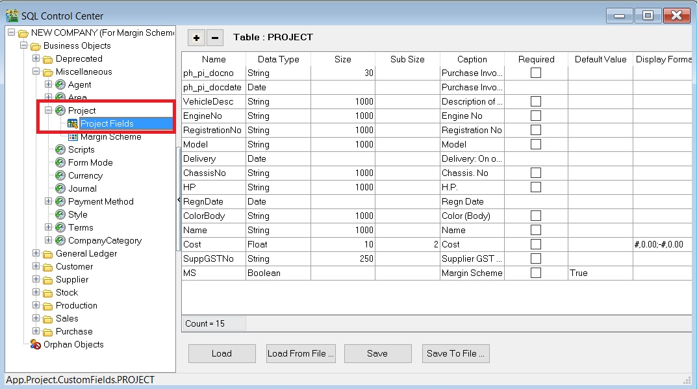

   3. Add new field name **MS** and the Data Type, Size, Sub Size, Caption, etc must follow the screenshot below. Click to Save button.

      

   4. Next, click on the existing **Margin Scheme** form. See the screenshot below.

      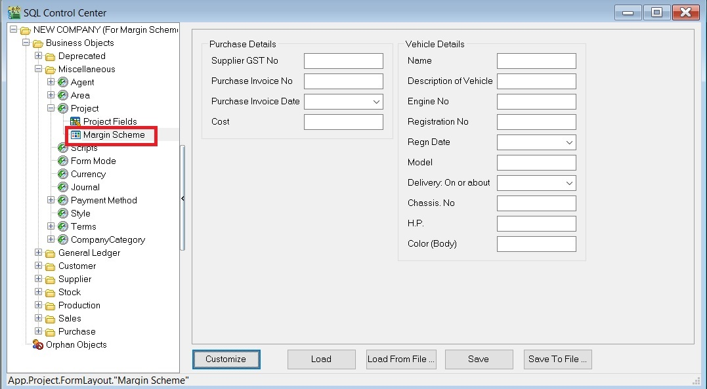

   5. Click on **Customize** button.

      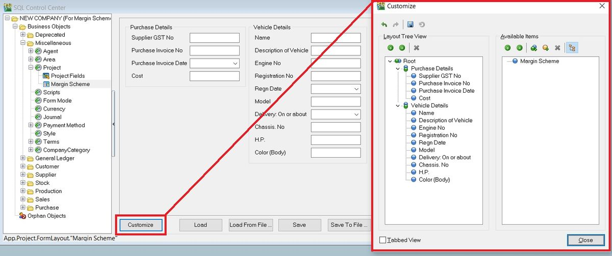

   6. Drag the **Margin Scheme** from Available Item list and drop under Purchase Details. See screenshot below.

      

   7. Lastly, click to Save button.

      

:::note NOTE:

Patch files are applicable to old margin scheme database.

:::

***Last Customization Update : 09 Nov 2016***

- Added **Stock Book Number** into Maintain Project. It will auto update project **Stock Book Number** key-in at purchase invoice **Ext. No**.
- **Fixed the bug update project from Purchase Invoice on the First line only**.
- Run the **SQL Accounting Diagnosis - DB Patch** and apply the patch files can be download from [This Link Here](http://www.sql.com.my/document/Patch-MarginScheme-20161109.zip)

    1. Select the database file (eg.ACC-XXXXX.FDB).
    2. Unzip the patch file downloaded.
    3. Drag the patch filename **DELETE_PHPI_OnAfterSave_2016.11.09**.
    4. Click **Execute**.
    5. Repeat step 2 - 4 and apply with another patch filename **INSERT_PHPI_OnAfterSave_2016.11.09**.

- Add new field name **StkBookNo** in Maintain Project.

     1. Go to Tools | DIY | SQL Control Center...
     2. Browse to Business Objects | Miscellaneous | **Project** | Project Fields

        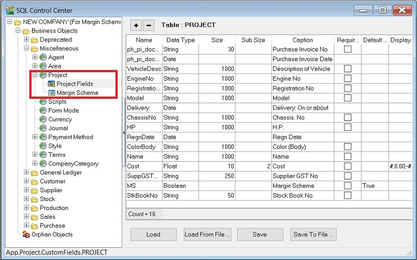

     3. Add new field name **StkBookNo** and the Data Type, Size, Sub Size, Caption, etc **must follow the screenshot below**. Click to Save button.

        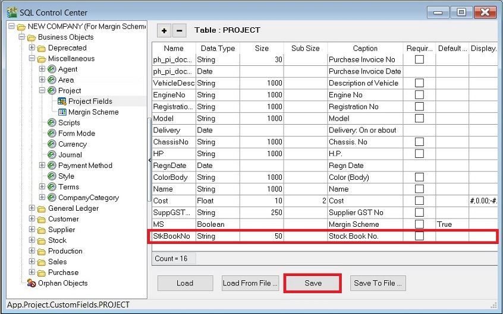

     4. Next, click on the existing **Margin Scheme** form. See the screenshot below.

        

     5. Click on **Customize** button.

        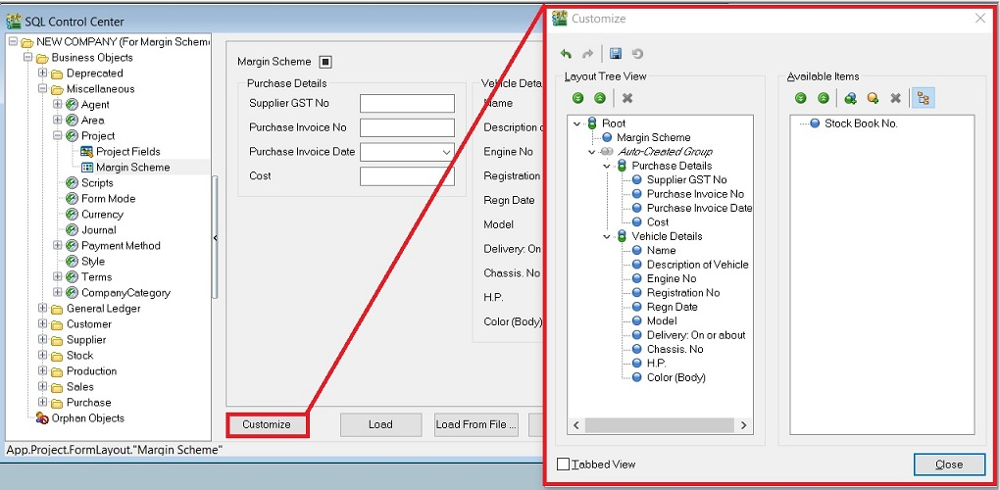

     6. Drag the **Stock Book No** from Available Item list and drop under Purchase Details. See screenshot below.

        

     7. Lastly, click to Save button.

        

:::note NOTE:
Patch files are applicable to old margin scheme database.
:::

### Setup Master Data (SMD)

#### Maintain Customer (SMD)

1. Create new buyer name (eg. company name or person name).
2. Click on Tax tab to input the GST No (if applicable).

   

3. Click on extra tab. You can enter the road tax, inspection and insurance reminder date for reference.

   

#### Maintain Supplier (SMD)

1. Create new seller name (eg. company name or person name).
2. Click on Tax tab to input the GST No (if applicable).

   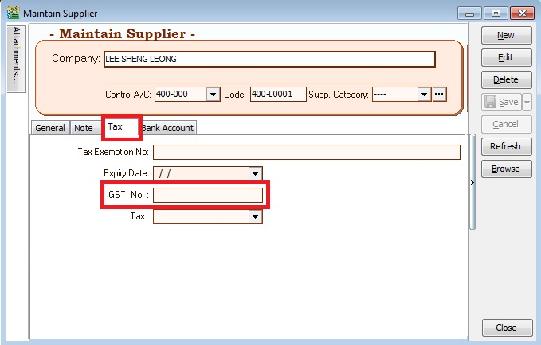

#### Maintain Stock Item (SMD)

1. Create the car model at Maintain Stock Item. For example, TOYOTA VIOS 1.5G(AT)
2. Click on Vehicle tab to define this item is a "Vehicle".

   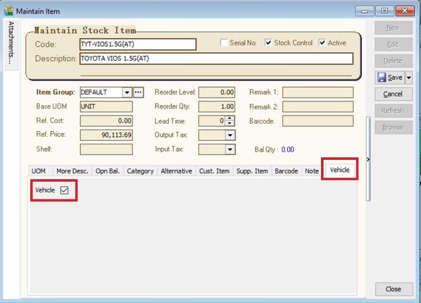

#### Maintain Project (SMD)

1. Create the second car plate number in Maintain Project.
2. Update the Vehicle detail.

   

3. Tick on **Margin Scheme** if it is a second hand car plate number.

   

4. Leave BLANK to Purchase Invoice Date, Purchase Invoice No and Cost. It will auto update when you are select the project code and save at the Purchase Invoice.

   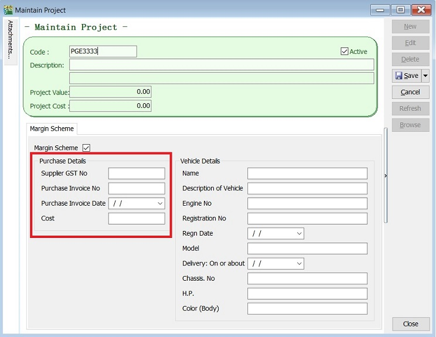

### Record Purchase of Second Hand Car Value

1. Enter the purchase value of second car at Purchase Invoice. (eg. RM30,000 )
2. You must select the correct car plate number from Project. (eg. PGE3333, AAA9999)
3. Supplier GST No, Purchase invoice number, date and cost will be updated automatically after you have save the purchase invoice.

   | Project: Purchase Detail | Update from                   |
   |--------------------------|--------------------------------|
   | Supplier GST No          | Maintain Supplier (GST No)     |
   | Purchase Invoice No      | Purchase Invoice (Doc No)      |
   | Purchase Invoice Date    | Purchase Invoice (Doc Date)    |
   | Cost                     | Purchase Invoice (Unit Price)  |
   | Stock Book No.           | Purchase Invoice (Ext No)      |

   

:::note NOTE :

1. This information is required to show in Lampiran 07 -Monthly Report for Relief for Secondhand Goods or Margin Scheme (MS).

2. Auto update to project purchase detail (Purchase No, Purchase Date and Cost) if tax amount is zero.

:::

### Record Sale of Second Hand Car Value

#### Margin Scheme Input

1. Enter the sale value of second car at Invoice. (eg.RM90,113.69)
2. You must select the correct car plate number from Project.(eg.PGE3333)
3. Initial Purchase Cost will auto upadate after select the project (car plate number).
4. Tax amount will be calculated based on Margin Scheme method.(See screenshot below)

   1. Sellng Price = 90,113.69
   2. Purchase Cost = 30,000.00
   3. Margin = 90,113.69 – 30,000.00 = 60,113.69
   4. Tax amount = 60,113.69 x 6/106 = 3,402.66

   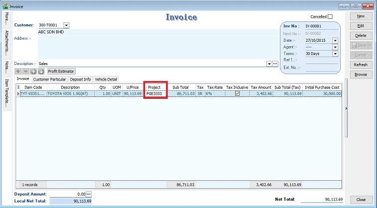

5. Invoice no, invoice date, selling price, margin, and margin tax amount will be shown in Lampiran 07 -Monthly Report for Relief for Secondhand Goods or Margin Scheme (MS)

#### Other Information

1. Customer Particular tab.

   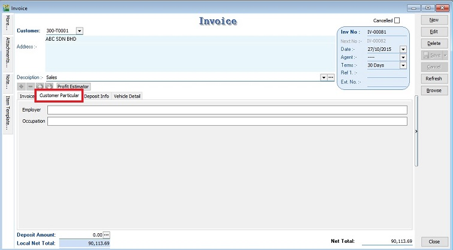

2. Deposit Info (For record purpose, no posting to account).

   

3. Vehichle Detail (Auto retrieve from Vehicle Detail in Maintain Project).

   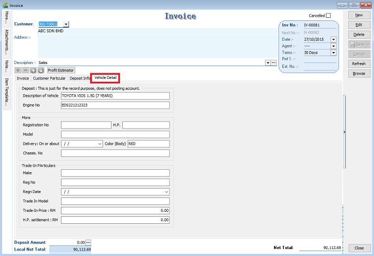

### Print for Lampiran 07 (Lampiran B0-Penyata-Pemantauan-SM-Syarikat)

1. Select document to “Invoice Listing” and click APPLY.

   

2. Click on preview or print. Select the report name “Lampiran B0-Penyata-Pemantauan-SM-Syarikat”.

   

## GST Treatment: Import Goods (IM)

IM - "Import of goods with GST incurred". It means there is an input tax claimable. Tax rate is 6%.

Purchase of goods from oversea supplier, the supplier invoice received will not incurred GST. However, the GST will be taken place when the goods are discharged out from the port to forwarder warehouse or direct to the buyer. Custom will incurred the GST on the total value stated in K1 form.

### GST Importation of Goods (IM)

#### Tax Code for Importion of Goods

You can found the following tax code available in SQL Financial Accounting.

| **Tax Code** | **Description**                                                   | **Tax Rate %** |
|--------------|-------------------------------------------------------------------|----------------|
| IM-0         | Import of goods with no GST incurred (for Foreign Supplier Account) | 0%             |
| IM           | Import of goods with GST incurred                                 | 6%             |

#### Oversea Supplier Invoice

1. Create the oversea supplier invoice at Purchase Invoice.
2. Select the tax code “IM-0”. Tax amount = 0.00

   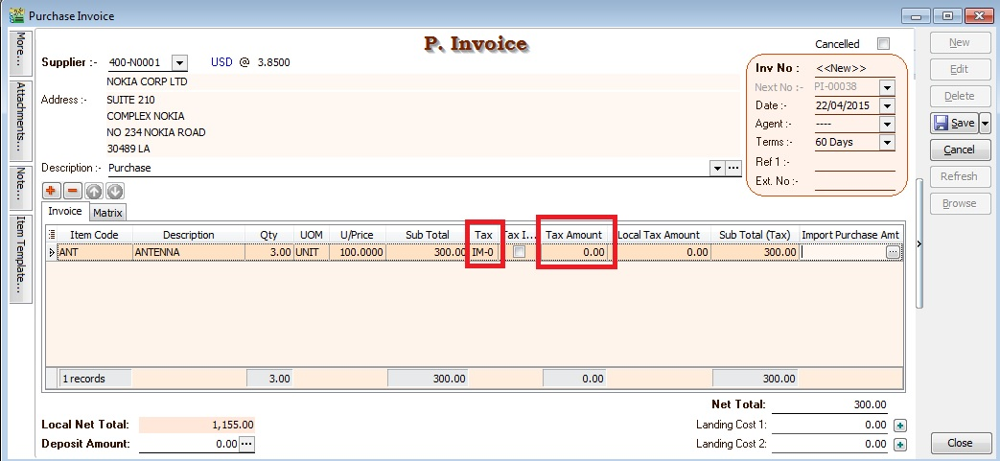

### Received Forwarder Notification from K1 /Invoice

Let's say in the K1 form details:-

| Description              | Amount (MYR) | Calculation                  |
|--------------------------|--------------|------------------------------|
| Goods Value (A)          | 1,155.00     | USD300 × 3.8500              |
| Custom Duty (B) (5%)     | 57.75        | RM1,155 × 5%                 |
| Total Taxable Amount (C) | 1,212.75     | A + B                        |
| **GST - IM**             | **72.77**    | **C × 6% = RM1,212.75 × 6%** |

Usually, the forwarder will invoice to the principal company for the following details:-

| Description                        | Net (MYR) | GST   | Gross (MYR) |
|------------------------------------|-----------|-------|-------------|
| Est. Duties (Import &/ Excise Duty)| 57.75     |       |             |
| Est. GST Import (RM1,212.75 × 6%)  | 72.77     |       |             |
| **Est Duties + GST Import**        | **130.25**|       | **130.52**  |
| Duty Processing Fee                | 100.00    | 6.00  | 106.00      |
| **Total Payable**                  |           |       | **236.52**  |

:::note NOTE :

GST Import can be calculated in different way. It might based on total weight (ie. weight x container) or total meter square (ie,meter square x container).
For example,
GST Import = 30,000m2 x 10 containers x 6% = RM18,000.00

:::

### Forwarder Invoice Entry (Purchase Invoice)

1. Select the forwarder supplier code in Purchase Invoice.
2. Insert the following fields:-

    - **Tax Amount**
    - **Local Tax Amount**
    - **Import Purchase Amt (GST Import input)**
    - Import Curr.Code (for display only)
    - Import Curr Rate (for display only)

   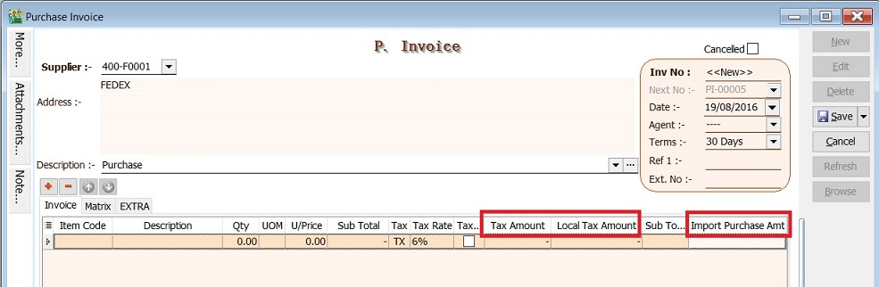

3. Click on the side button in the Import Purchase Amt column. See screenshot below.

   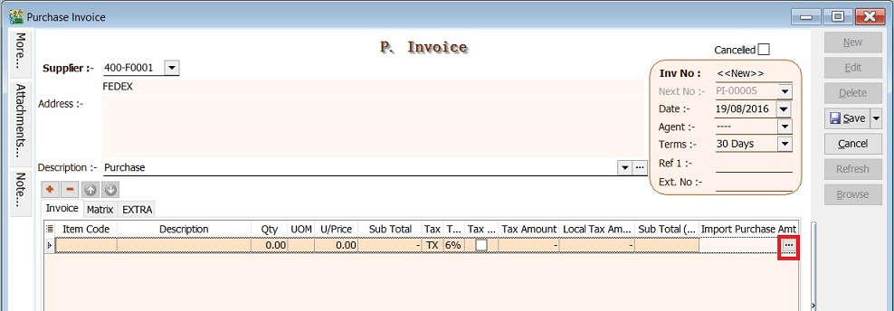

4. You have to input the info according to 2.3. Received Forwarder Notification from K1 /Invoice example.

   | Field Name         | Input Value | Explanation                         |
   |--------------------|-------------|-------------------------------------|
   | Currency Code      | USD         | Currency of the goods purchased     |
   | Currency Rate      | 3.85        | Follow K1 exchange rate             |
   | Purchase Amount    | 300.00      | Goods foreign value as stated in K1 |
   | Custom Local Amount| 1,212.50    | Follow K1 total taxable amount      |
   |                    |             | = Purchase Amount + Custom Duty + Excise Duty (if any) |
   | Tax                | IM 6%       | Import GST at 6%                    |
   | Tax Amount         | 72.77       | = 1,212.75 × 6%                     |
   | Permit No          | K1-3232323  | Key-in the K1 number                |

   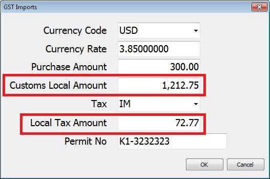

5. After press OK to exit the GST Import screen, the purchase invoice item description will be updated as “Purchase Value USD 300.00@3.8500 = RM 1,155.00, Permit No: K1-32323232” from the GST Import entered.

6. Below is the sample of Forwarder invoice entry.

    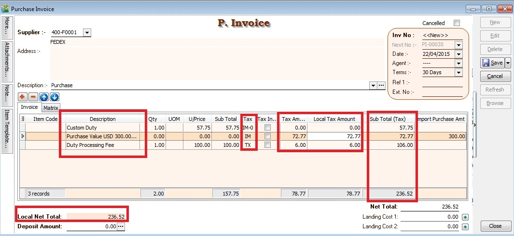

In summary:

| Line # | Description                       | Sub Total | Tax  | Tax Amount | Sub Total (Tax) |
|--------|-----------------------------------|-----------|------|------------|-----------------|
| 1      | Est. Duties (Import &/ Excise Duty)| 57.75     | IM-0 | 0.00       | 57.75           |
| 2      | Est. GST Import (RM1,212.75 × 6%) | 0.00      | IM   | 72.77      | 72.77           |
| 3      | Duty Processing Fee               | 100.00    | TX   | 6.00       | 106.00          |
|        | **Total Payable**                 |           |      |            | **236.52**      |

### Other Supporting Documents Related to Import

All imported goods, both dutiable or not, must be declared in the prescribed forms and be submitted to the customs station at the place of import. The prescribed forms are the following:

1. Customs Form no. 1 (**K1**): Declaration of goods imported
    - Import for dutiable and non-dutiable goods.
2. Customs Form no. 2 (**K2**): Declaration of goods to be exported
    - Export for dutiable and non-dutiable goods.
3. Customs Form no. 3 (**K3**): Application/ Permit to transport goods within the Federation/Malaysia
    - Import & Export of dutiable and non-dutiable goods within Malysia
4. Customs Form no. 8 (**K8**): Application/ Permit to tranship/remove goods
    - Declaration of duty not paid goods
        **a.** By rail - Pasir Gudang declared K8 to rail the containers from Pasir Gudang to Port Klang without paying the duty. Port Klang declared K1 to clear the containers by paying duty. (Dutiable cargo)
        **b.** Transhipment - From one port tranship from another port. K8 can move container from westport to northport and vice versa without paying duty.

5. Customs Form no. 9 (K9): Requisition/ Permit to remove dutiable goods from customs control
    - Clear dutiable cargo slowly out from bonded warehouse. K8 declares for the container truck into bonded warehouse and K9 clears the cargo partial by partial out from the warehouse probably due to high duty charges.

Supporting documents for the declaration forms are as follows:

1. Delivery order
2. Packing list
3. Original invoice
4. Bill of lading
5. Certificate of origin
6. Import licenses which may be required by a proper officer of customs

## GST Treatment: ATS

**Approved Trader Scheme (ATS)** is a special schemes are introduced to relieve GST payment on importation of goods.

Section 71 under ATS,

1. ATS participants are allowed to suspend GST on the importation of goods.
2. Goods imported is used in the course or furtherance of business.
3. The amount of GST suspended needs to be declared in the GST return (for the taxable period to which the suspension relates).

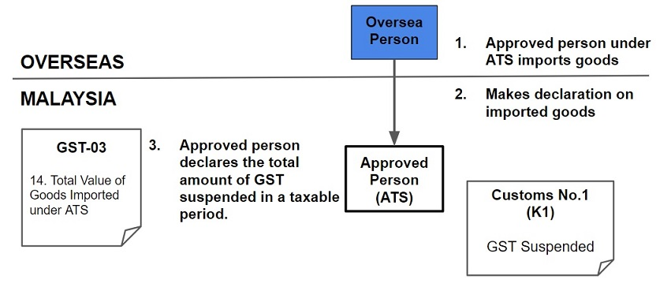

Persons eligible for ATS

1. Companies located within Free Industries Zone (FIZ)
2. Licensed Manufacturing Warehouse (LMW)
3. International Procurement Centre (IPC)
4. Regional Distribution Centre (RDC)
5. Toll manufacturers under ATMS
6. Jewellery manufacturers under AJS
7. Companies with turnover above RM25 million and at least 80% of their supplies made are zero-rated; or
8. Any other person approved by the Minister.

### ATS

#### Tax Code for ATS

| Tax Code | Description                                                                                                                                                                                                                                                     | Tax Rate % |
|----------|-----------------------------------------------------------------------------------------------------------------------------------------------------------------------------------------------------------------------------------------------------------------|------------|
| IS       | Imports under special scheme with no GST incurred. This refers to goods imported under the Approved Trader Scheme (ATS) and Approved Toll Manufacturer Scheme (ATMS), where GST is suspended when the trader imports the non-dutiable goods into Malaysia. These two schemes are designed to ease the cash flow of ATS and ATMS traders, who have significant imports. | 0%         |

#### Purchase Invoice For ATS

1. Create the oversea supplier invoice at Purchase Invoice.
2. You are required to key-in the Import Declaration No. (eg. K1 or K9) into Permit No column. This import declaration no will be appear in GAF file.
3. Select the tax code = IS. Tax amount = 0.00
4. Taxable Amount (local value) should entered as:

   > **GST Value** = Customs Value (CIF) + any customs duty paid + any excise duty paid

   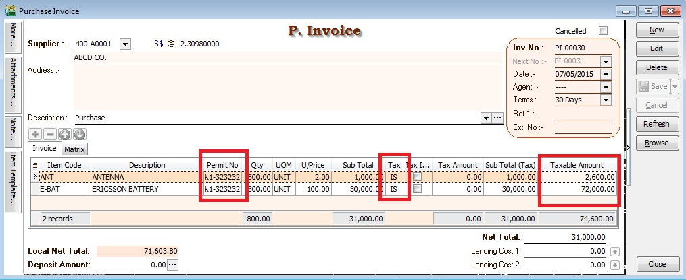

#### GST Return Process

1. Process the month GST Return.
2. GST03 item no 14 will be fill-up with the Taxable Amount from the purchase invoice item with tax code “IS”.
3. GST03 Item no 15 = Taxable Amount (local value) x 6%
4. For example, below screenshot:-

   > **GST03 Item no 15** = 74,600.00 x 6% = 4,476.00

   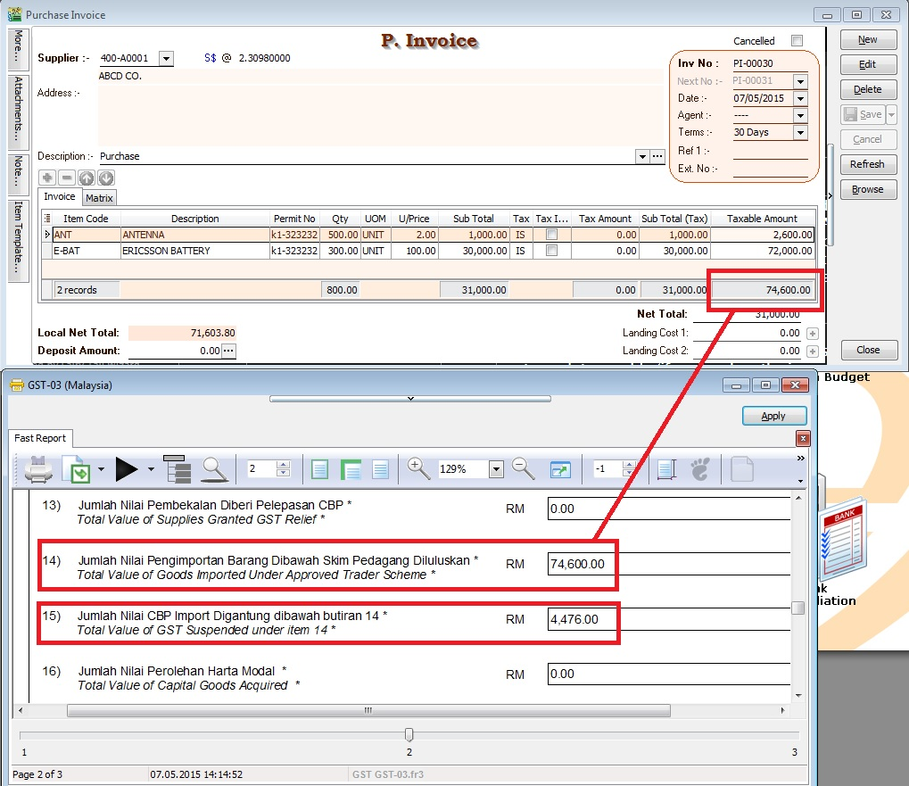

## GST Treatment: Non-Refundable Deposit

How to enter the non-refundable deposit accounted to **Standard Rated** (SR) and **Zero Rated**(ZRL & ZRE) to reflect in GST-03 submission?

This guide will help you out. All non-refundable deposit amount are inclusive tax.

| Type of supplies      | Tax Rate | GST-03                                                                 |
|------------------------|----------|------------------------------------------------------------------------|
| Standard Rated (SR)    | 6%       | 1. Total Value of Standard Rated Supply (5a)                           |
|                        |          | 2. Total Output Tax (5b)                                               |
| Zero Rated (ZRL & ZRE) | 0%       | 1. Total Value of Local Zero Rated Supplies                            |
|                        |          | 2. Total Value of Export Supplies                                      |

### Customer Payment

#### Non-Refundable (SR)

1. Create **New Customer Payment**.
2. Enter the **Paid Amount**, eg. Rm10,000.00
3. **Tick Non-Refundable** for **GST not equal to 0%**.
4. See the screenshot below.

   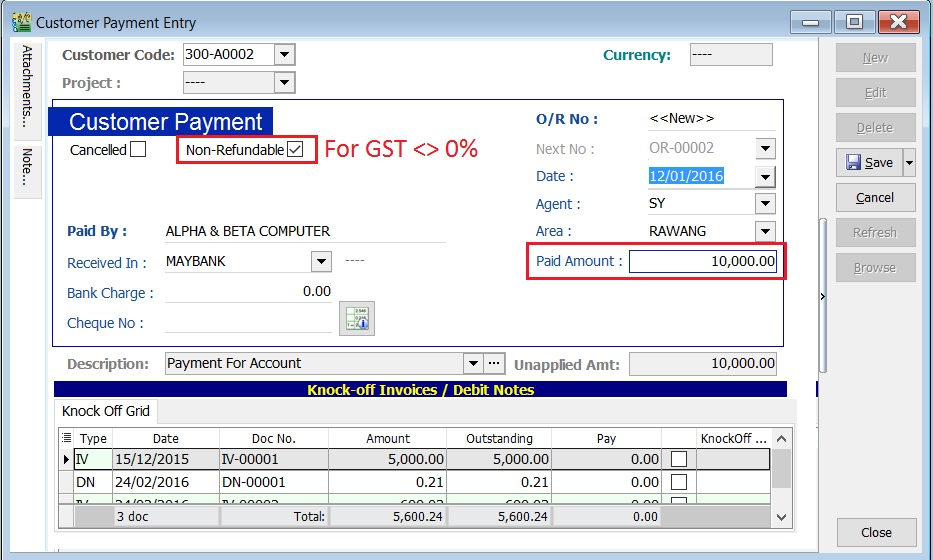

5. Process GST Returns (GST | New GST Returns...).
6. Print the GST-03.

   **GST-03 results:-**

   | GST-03 Item | Description                                                                    | Local Amount |
   |-------------|--------------------------------------------------------------------------------|--------------|
   | 5a          | Total Value of Standard Rated Supply                                           | **9,433.96**     |
   | 5b          | Total Output Tax (Inclusive of Tax Value on Bad Debt Recovered & other Adjustments) | **566.04**       |

7. See the GST-03 screenshot below.

   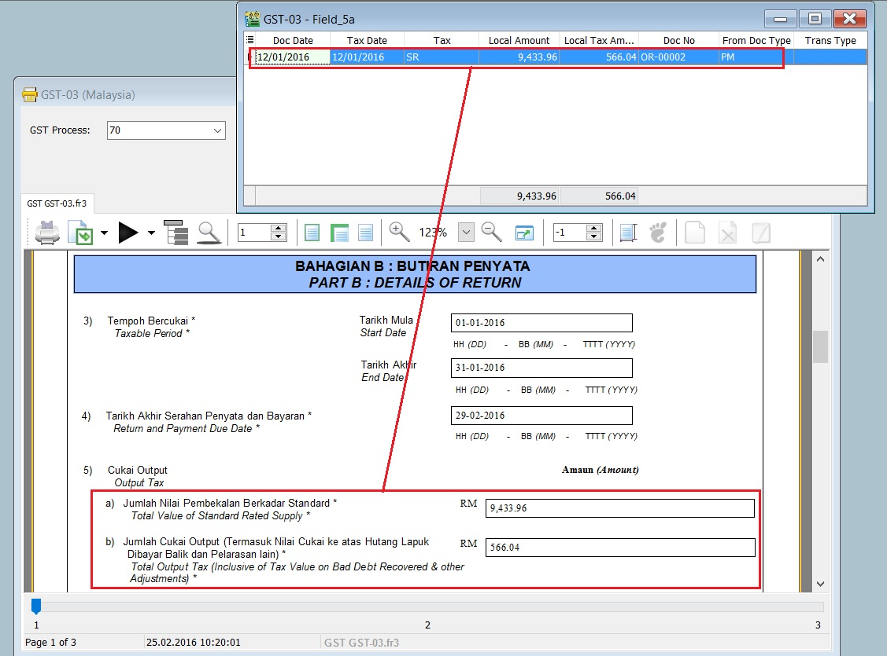

#### Non-Refundable (ZR)

1. Create **New Customer Payment**.
2. Enter the **Paid Amount**, eg. Rm25,000.00 (USD6,000.00)
3. Ensure the **Non-Refundable checkbox** is **Untick** for **GST equal to 0%**, eg. ZRL and ZRE.
4. Press **CTRL + ALT + G**.
5. Enter the tax transactions. See the **GST Taxable** detail in the screenshot below.

   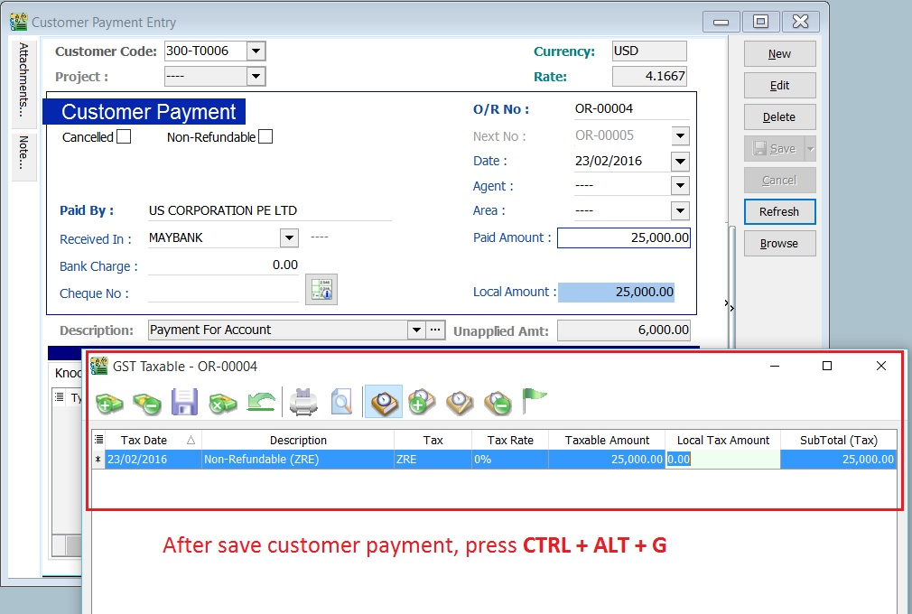

6. Process GST Returns (GST | New GST Returns...).
7. Print the GST-03.

   **GST-03 results:-**

   | GST-03 Item | Description                       | Local Amount |
   |-------------|-----------------------------------|--------------|
   | 11          | Total Value of Export Supplies (ZRE) | 25,000.00    |

8. See the GST-03 screenshot below.

   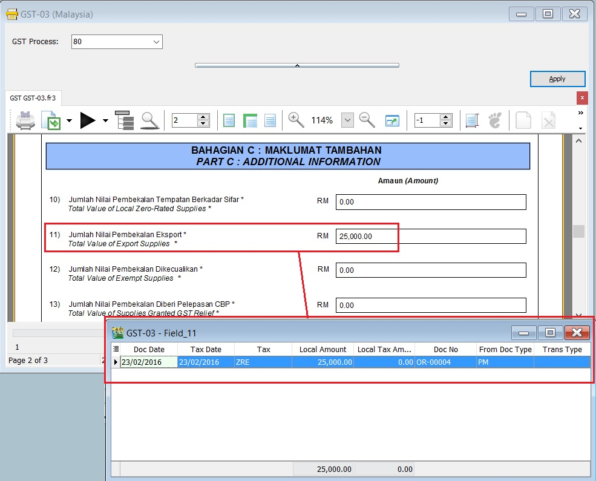

## GST Treatment: How to report GST-03 item 16 Capital Goods Acquired for Purchase of machinery from Oversea

### Case 1 : Purchase of Machinery (Fixed Asset) From Overseas

Let's say the oversea supplier has sent the bill amount USD15,000 (USD15,000 x 4.2 = Rm63,000 will recorded in the Account Book).
Understand that Custom will use GST valuation to compute the GST amt and stated in K1 form. Assume that GST Valuation after custom duty = Rm75,000 and GST amt Rm75,000 x 6% = Rm4,500.

**Question:**
Which amount should I reported in GST-03 item 16 Capital Goods Acquired? Rm63,000 or Rm75,000?

**Answer from RMCD:**
GST-03 item 16 Capital Goods Acquired = Rm75,000.

### How to handle this in SQL Accounting?

1. Oversea supplier bill enter at purchase/supplier invoice as usual.

   | Account          | Local DR  | Local CR  |
   |------------------|-----------|-----------|
   | Machinery        | 63,000.00 |           |
   | Oversea supplier |           | 63,000.00 |

2. When it comes to the forwarder bill after declaring the import goods, you must follow our GST Import Goods guideline. Refer to this link [1](../../usage/gst-and-sst/gst#gst-treatment-import-goods-im).

3. You just have to select Fixed Asset Account at the item line updated from the GST Imports screen. (**Don't worry, Rm75,000 fixed asset will not post into your account book**). See the screenshot attached.

   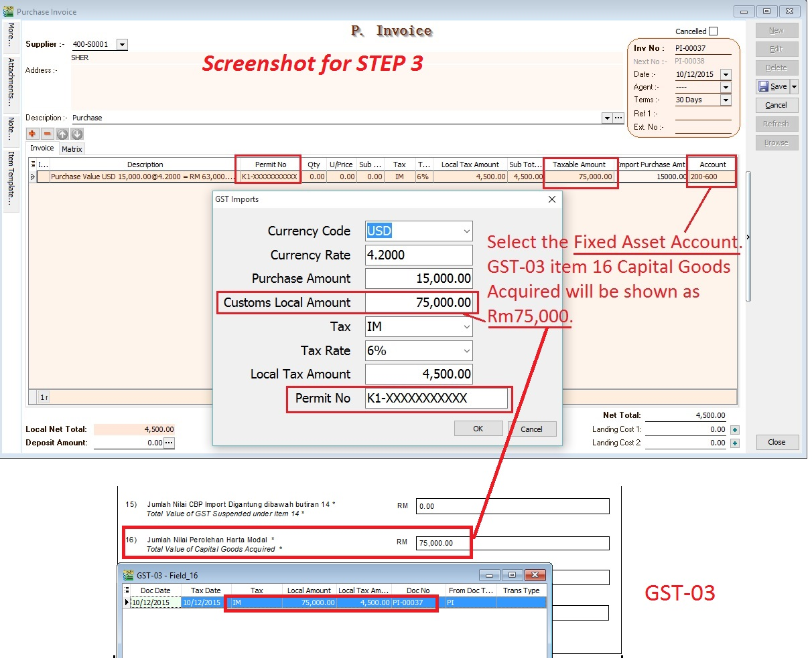

   :::note NOTE:

   For GST-03 purpose, this is to report into item 16 Capital Goods Acquired for the import of machinery value as stated in the K1 form. Your account book still recorded as Rm63,000 in step 1.

   :::

## GST Treatment: Free Industrial Zone(FIZ) and Licensed Manufacturing Warehouse(LMW)

This guide will teach you the way to key-in the data entry related to GST treatment on FIZ and LMW.
Under GST system, a person operating in a FIZ or having LMW status is treated as any person carrying out a business in Malaysia where normal rules of GST apply. This means that acquisition of goods locally or imported by the person operating in a FIZ or having LMW status is subject to GST. However, the person operating in a FIZ or having LMW status is eligible to apply for Approved Trader Scheme (ATS) to allow the Director General to suspend the payment of GST on imported goods at the time of importation. For further details, please refer to the guide on Approved Trader Scheme (ATS) and [SQL Accounting on ATS](http://www.sql.com.my/document/sqlacc_docs/PDF/GST36-Input_Entry_for_ATS.pdf)

Subject to GST:

1. Based on **transaction value**. GST = transaction value x (SR or ZR) %:

    1. FIZ Local sell to FIZ Local → SR
    2. FIZ local sell to LMW Local → SR
    3. FIZ/LMW Local sell to Oversea → ZR

2. Based on **the value of imported goods**. GST = (Custom Value + Import Duty) x SR %:

    1. FIZ/LMW local sell to non-FIZ/LMW → SR

   For example (**FIZ/LMW local sell to non-FIZ/LMW**),

   | Item | Item Description | Qty     | Unit Price (RM) | Value (RM) | Import Duty (RM) |
   |------|------------------|---------|-----------------|------------|------------------|
   | 1    | Shirts           | 300 pcs | 25.00           | 7,500.00   | **1,500.00**         |
   | 2    | Paints           | 100 pcs | 30.00           | 3,000.00   | **600.00**           |
   |      |                  |         |    **Total**    | 10,500.00  | **2,100.00**         |

   ***Assuming 20% import duty (RM10,500 x 20% = 2,100.00)***

   GST on value + Import Duty are subject to GST (SR) = (10,500.00 + 2,100.00) x 6% = **756.00**

   Therefore, the Tax Invoice will be presented as per below:

   | Item | Item Description | Qty     | Unit Price (RM) | Value (RM) |
   |------|------------------|---------|-----------------|------------|
   | 1    | Shirt            | 300 pcs | 25.00           | 7,500.00   |
   | 2    | Paints           | 100 pcs | 30.00           | 3,000.00   |
   |      | GST (SR-6%)  |         |                 | 756.00     |
   |      | Total Amount Payable | |                 | 11,256.00  |

### How to enter the Tax Invoice if there is a FIZ/LMW transactions to another party?

According to the example mentioned in above.

1. Insert and select the stock items sold with empty tax code. Because the stock items are under FIZ/LMW control.

   | Item Code | Description | Qty     | Unit Price | Subtotal | Tax Code | Tax Amount | SubTotal (Tax) |
   |-----------|-------------|---------|------------|----------|----------|------------|----------------|
   | SHIRT     | SHIRTS      | 300 pcs | 25.00      | 7,500.00 |   BLANK  | 0.00       | 7,500.00       |
   | PAINTS    | PAINTS      | 100 pcs | 30.00      | 3,000.00 |   BLANK  | 0.00       | 3,000.00       |

2. Inser new row and enter the GST on total supply value (Rm7500 + Rm3000 = Rm10,500) direct into Taxable Amount column (C1)

   | Description              | Taxable Amount | Tax Code | Tax Amount | SubTotal(Tax) |
   |---------------------------|----------------|----------|------------|---------------|
   | GST on value Rm10,500.00 | 10,500.00      | SR       | 630.00     | 630.00        |

   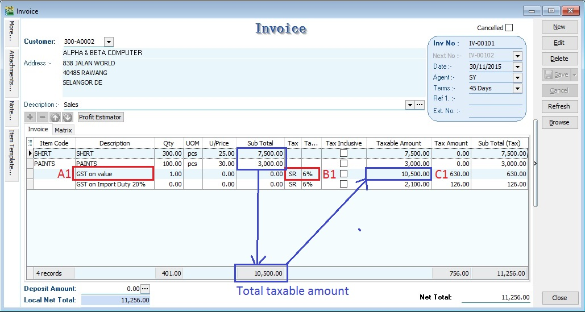

   :::note NOTE :

   A1 : Key-in "GST on value" into description.

   B1 : Must select tax code.

   C1 : Key-in the Total Supply Value into Taxable Amount.

   :::

3. Insert new row and enter the GST on total Import Duty (Rm1,500 + Rm600.00 = Rm2,100) direct into Taxable Amount column (C2)

   | Description              | Taxable Amount | Tax Code | Tax Amount | SubTotal(Tax) |
   |---------------------------|----------------|----------|------------|---------------|
   | GST on Import Duty 20%   | 2,100.00       | SR       | 126.00     | 126.00        |

   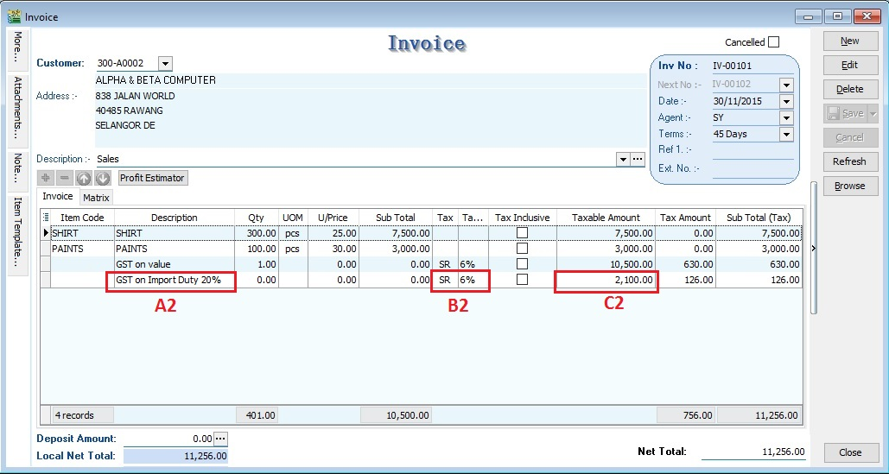

   :::note NOTE :

   A2 : Key-in "GST on Import Duty" into description.

   B2 : Must select tax code.

   C2 : Key-in the Total Import Duty value into Taxable Amount.

   :::

### GST Return (FIZ and LMW)

1. Process GST Return for the month
2. Click on print GST-03

   

:::note RESULTS :

5a Total value of supplies = 12,600.00

5b total output tax = 756.00
:::

## GST Treatment: Construction Business

This guide will teach you the way to enter the tax invoice to the Developer from Main Contractor.
Time to account for GST is at the either of the following:-

   1. when payment is received;
   2. when tax invoice is issued;
   3. if no tax invoice has been issued within 21 days after the certificate of work done is issued.

We have to look into and show the following items in order to calculate the GST amount in the Tax Invoice:

   1. Certified value - Progress claim value certified by Architect.
   2. Retention Amount - the amount of progress payment which is not paid until the conditions specified in the contract for the payment of such amounts have been met or until defects have been rectified.
   3. Progress payment

For example, the Progress Payment:-

| 1st interim certificate        | Amount (RM) | Calculation              |
|--------------------------------|-------------|--------------------------|
| Value of material and works (A1) | 30,000.00  |                          |
| Less: Retention Sum (B1)       | (1,500.00)  | RM30,000 × 5%            |
| **Amount Paid (excl GST)**     | **28,500.00**   | A1 - B1                  |
| **GST Amount**                 | **1,710.00**    | RM28,500 × 6% (SR)       |

| 2nd interim certificate         | Amount (RM) | Calculation             |
|---------------------------------|-------------|-------------------------|
| Value of material and works (A2) | 90,000.00  |                         |
| Less: Retention Sum (B2)        | (4,500.00)  | RM90,000 × 5%           |
| Less: 1st Interim Certificate (C2) | (28,500.00) |                         |
| **Amount Paid (excl GST)**          | **57,000.00**  | A2 - B2 - C2            |
| **GST Amount**                      | **3,420.00**   | RM57,000 × 6% (SR)      |

| 3rd interim certificate          | Amount (RM) | Calculation             |
|----------------------------------|-------------|-------------------------|
| Value of material and works (A3) | 150,000.00 |                         |
| Less: Retention Sum (B3)         | (7,500.00) | RM150,000 × 5%          |
| Less: 1st Interim Certificate (C3) | (28,500.00) |                         |
| Less: 2nd Interim Certificate (D3) | (57,000.00) |                         |
| **Amount Paid (excl GST)**           | **57,000.00**  | A3 - B3 - C3 - D3       |
| **GST Amount**                       | **3,420.00**   | RM57,000 × 6% (SR)      |

| 4th Interim Certificate             | Amount (RM) | Calculation                  |
|-------------------------------------|-------------|------------------------------|
| Value of material and works (A4)    | 300,000.00  |                              |
| Less: Retention Sum (B4)            | (15,000.00) | RM300,000 × 5%               |
| Less: 1st Interim Certificate (C4)  | (28,500.00) |                              |
| Less: 2nd Interim Certificate (D4)  | (57,000.00) |                              |
| Less: 3rd Interim Certificate (E4)  | (57,000.00) |                              |
| **Amount Paid (excl. GST)**         | **142,500.00** | A4 – B4 – C4 – D4 – E4     |
| **GST Amount (6%)**                 | **8,550.00**  | RM142,500 × 6% (SR)         |

Lastly, the **sum of retention** will be invoiced after the full inspection of work done.

| Retention Sum                  | Amount (RM) | Calculation         |
|--------------------------------|-------------|---------------------|
| 1st Interim Certificate (R1)   | 1,500.00    |                     |
| 2nd Interim Certificate (R2)   | 3,000.00    | RM4,500 – 1,500     |
| 3rd Interim Certificate (R3)   | 3,000.00    | RM7,500 – 4,500     |
| 4th Interim Certificate (R4)   | 7,500.00    | RM15,000 – 7,500    |
| **Total**                      | **15,000.00** |                     |
| **GST Amount (6%)**            | **900.00**  | RM15,000 × 6% (SR)  |

### Tax Invoice Entry

1. Click New.
2. Enter the detail as per below example screenshot.

#### Progress Billing

| Progress Billing | Value of Work Certified | Amount                         | Retention              | Amount After Retention | GST Amount |
|------------------|--------------------------|--------------------------------|------------------------|------------------------|------------|
| A1               | 30,000                   | 30,000 – 0 = 30,000            | 30,000 × 5% = 1,500    | 28,500                 | 1,710      |
| A2               | 90,000                   | 90,000 – 30,000 = 60,000       | 60,000 × 5% = 3,000    | 57,000                 | 3,420      |
| A3               | 150,000                  | 150,000 – 90,000 = 60,000      | 60,000 × 5% = 3,000    | 57,000                 | 3,420      |
| A4               | 300,000                  | 300,000 – 150,000 = 150,000    | 150,000 × 5% = 7,500   | 142,500                | 8,550      |
| **Total**        |                          | **Total Value of Work** = 300,000 | **Total Retention** = 15,000 | 285,000            | 17,100 |

***1st Interim - Tax Invoice***

   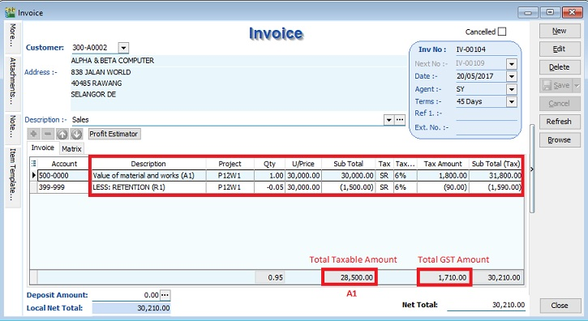

***2nd Interim - Tax Invoice***

   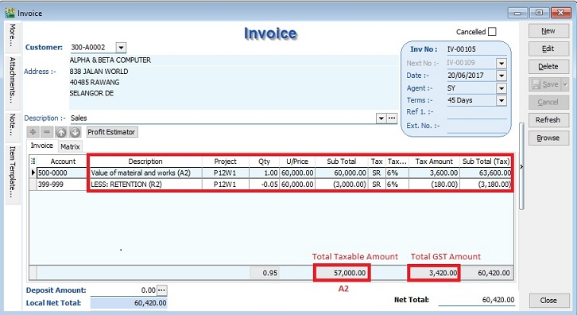

***3rd Interim - Tax Invoice***

   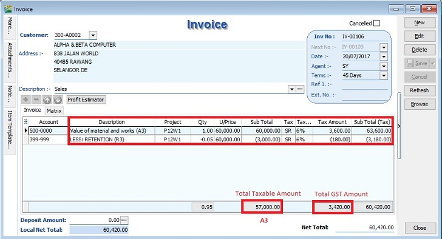

***4th Interim = Tax Invoice***

   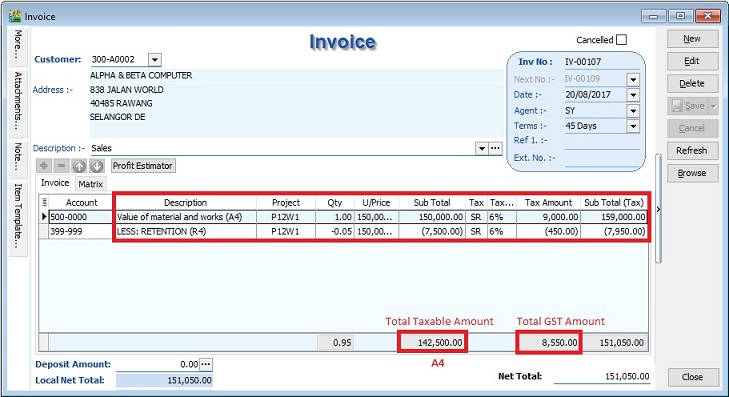

#### Retention Billing

| Progress Retention | Retention | GST Amount |
|---------------------|-----------|------------|
| R1                  | 1,500     | 90         |
| R2                  | 3,000     | 180        |
| R3                  | 3,000     | 180        |
| R4                  | 7,500     | 450        |
| Total               | 15,000    | 900        |

***Total Retention - Tax Invoice***

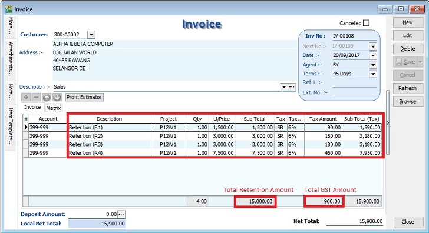

:::note NOTE:

GL Account : 399-999 - Retention (Create under the Current Asset)

:::

### Value of Material and Works Report by Project

1. To check the total value of material and works balance report. See the screenshot below.
2. You can see the total value of material and works adjusted with **final result: Rm300,000.**

   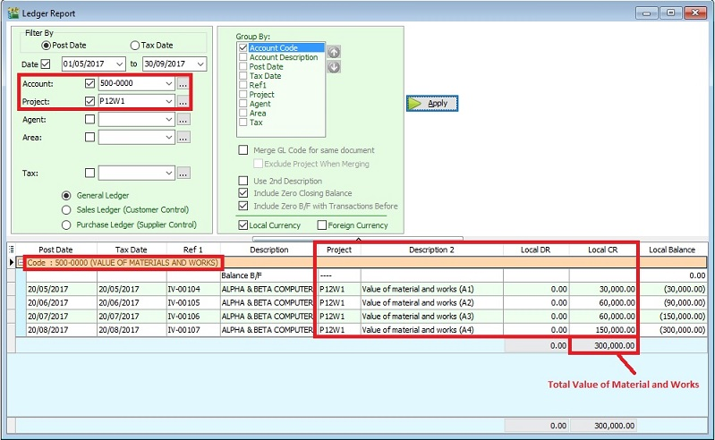

### Retention Report By Project

1. To check the retention balance report. See the screenshot below.
2. If the retention balance is zero, it means the full settlement of retention sum.

   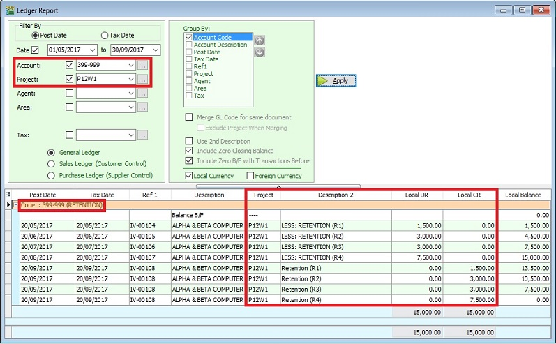

## GST Treatment: Partial Exemption

This guide will explains how Partial Exemption, Apportionment and Annual Adjustment are made in respect of residual input tax which is attributable to both taxable and exempt supplies in SQL Financial Accounting.

### Tax Code for Partial Exemption

Source from the **GUIDE ON ACCOUNTING SOFTWARE ENHANCEMENT TOWARDS GST COMPLIANCE** dated **01 Aug 2016.**

| Tax Code | Tax Rate | Description                                                                                                 |
|----------|----------|-------------------------------------------------------------------------------------------------------------|
| TX-ES    | 6%       | Purchase with GST incurred directly attributable to nonincidental exempt supplies. (**Note: Replace TX-N43**)   |
| TX-IES   | 6%       | Purchase with GST incurred directly attributable to incidental exempt supplies. (**Note: Replace TX-E43**)      |
| TX-RE    | 6%       | Purchase with GST incurred that is not directly attributable to taxable or exempt supplies. (Applicable for partially exempt trader/mixed supplier only) |
| IES      | 0%       | Incidental exempt supplies under GST legislations. (**Note: Replace ES43**)                                     |

### Partial Exemption Rules

**Flowchart:**

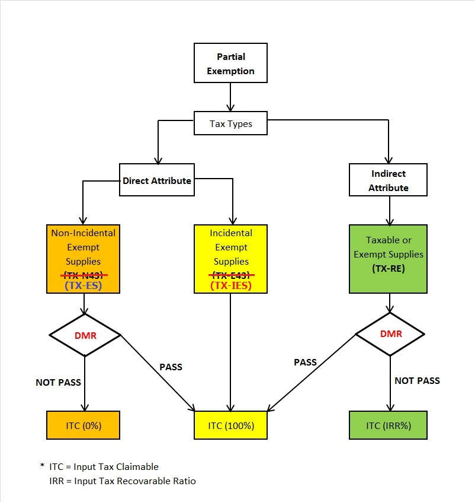

#### De Minimis Rule (DmR)

To satisfy the De Minimis Rule:

   1. Total Exempt Supply (ES) `<=` Average RM5,000.00 per month; **AND**
   2. DMR `<=` 5%

Formula:
DmR = [E / (T + E)] x 100%

| Supplies | Tax Code                                           | Description                                                                                                                                                                                                                                                                               |
|----------|----------------------------------------------------|-------------------------------------------------------------------------------------------------------------------------------------------------------------------------------------------------------------------------------------------------------------------------------------------|
| T        | (SR + ZRL + ZDA + ZRE + DS + RS + GS + OS-TXM + NTX) | The total value (exclusive of GST) of all taxable supplies which are the sum of all standard-rated supplies, zero-rated supplies (Local), zero-rated supplies (Export), deemed taxable supplies, supplies made outside Malaysia which would be taxable if made in Malaysia, relief supplies, and disregarded supplies made in the taxable period. |
| E        | (ES)                                               | The total value (exclusive of GST) of exempt supplies made in the taxable period which NOT include incidental exempt supplies.                                                                                                                      |

:::note NOTE :

   (i) IES is only for incidental supplies, therefore will not be part of the de minimis rule formula (DmR).
   (ii) This formula functions is only to test the percentage and value that qualify for de minimis rule.
   (iii) Accounting software users should apply DmR on their TX-ES transactions.

The application for de minimis rule as stated below:
   (i) Application of incidental exempt supplies to the de minimis rule.
   (ii) Applying the de minimis rule in a taxable period.
   (iii) Applying the de minimis rule in a tax year or longer period.

:::

#### Input Tax Recoverable Ratio (IRR)

Formula:

***IRR = (T-O1) / (T+E-O2)***

| Code | % / Tax Code | Description                                                                                                                                                                                                                                                                       |
|------|--------------|-----------------------------------------------------------------------------------------------------------------------------------------------------------------------------------------------------------------------------------------------------------------------------------|
| IRR  | %            | The recoverable percentage of residual input tax or known as Input Tax Recoverable Rate (IRR).                                                                                                                                                                                    |
| T    | (SR + ZRL + ZDA + ZRE + DS + RS + GS + OS-TXM + NTX) | The total value (exclusive of GST) of all taxable supplies which are the sum of all standard-rated supplies, zero-rated supplies (Local), zero-rated supplies (Export), deemed taxable supplies, supplies made outside Malaysia which would be taxable if made in Malaysia, relief supplies, and disregarded supplies made in the taxable period. |
| E    | (ES)         | The total value (exclusive of GST) of exempt supplies made in the taxable period.                                                                                                                                                                                                 |
| O1   | -            | The total value (exclusive of GST) of **all excluded taxable supplies.**                                                                                                                                                                                                              |
| O2   | -            | The total value (exclusive of GST) of **all excluded taxable supplies and all excluded exempt supplies.**                                                                                                                                                                             |

The supplies related to **O1** of the IRR formula are as follows:

| Tax Code | Description                                                                                                                                                             |
|----------|-------------------------------------------------------------------------------------------------------------------------------------------------------------------------|
| SR       | The value of any supply of capital assets used by the taxable person for the purposes of his business (e.g., an asset or part of an asset is disposed of as Transfer of Going Concern). |
| DS       | Supplies made by a recipient in accordance with Approved Trader Manufacturer Scheme (ATMS) where self-recipient accounting is made by recipient.                        |
| DS       | Supplies of imported services where reverse charge mechanism (RSA) is made by recipient.                                                                               |
| OS       | Supplies made outside Malaysia which would not be taxable if made in Malaysia.                                                                                          |

The supplies related to **O2** of the IRR formula are as follows:

| Tax Code | Description |
|--------------|-----------------|
| SR | The value of any supply of capital assets used by the taxable person for the purposes of his business (e.g., an asset or part of an asset is disposed of as Transfer of Going Concern). |
| DS | Supplies made by a recipient in accordance with Approved Trader Manufacturer Scheme (ATMS) where self-recipient accounting is made by recipient. |
| DS | Supplies of imported services where reverse charge mechanism (RSA) is made by recipient. |
| OS | Out of scope supply is a supply which is not within the ambit or boundary of GST, and therefore GST is not chargeable on such supply. |
| ES | Exempt supplies of land for general use (Land used for burial, playground or religious building), and disposal of capital asset which is subject to exempt supplies. |

:::note Note:
(i) IES is only for incidental exempt supplies, therefore will not be part of the Input Tax Recoverable Ratio (IRR) formula.
(ii) For other excluded transactions ("O1 & O2"), users need to analyse their transactions in ES, SR, DS & OS,
then make necessary adjustment before they can apply the correct ratio.
(iii) Accounting software users should apply IRR on their TX-RE transactions.
(iv) The above formula is based on the value of supplies made which is the standard method used to apportion the residual input tax.
If the person wishes to use other methods to apportion the residual input tax, he is required to get approval from customs.
For further details please refer to GST Guide on Partial Exemption
:::

#### Input Tax Claimable Logic to TX-RE, TX-IES (TX-E43) & TX-ES (TX-N43) (Based on DMR)

Below is the summary of the calculation logic based on DMR to determine the input tax claimable.

| Tax Code | Tax Rate | Fulfill DMR? | Input Tax Claimable (ITC) |
|----------|----------|--------------|---------------------------|
| TX-RE    | 6%       | Yes          | ITC × 100%                |
| TX-RE    | 6%       | No           | ITC × IRR                 |
| TX-IES   | 6%       | N/A          | ITC × 100%                |
| TX-ES    | 6%       | Yes          | ITC × 100%                |
| TX-ES    | 6%       | No           | ITC × 0%                  |

### How to exclude the IRR for the capital goods disposed off?

For example, Mixed Co. Sdn Bhd., whose current tax year ends on 31 December 2016, has in his taxable period of April 2015, made some mixed supplies and at the same time incurred residual input tax as follows.

|  |                                            | `RM)` |
|-----|-------------------------------------------------------|-------------|
| T   | Value of all taxable supplies, exclusive of tax       | 200,000.00  |
| E   | Value of all exempt supplies                          | 40,000.00   |
| O1 & O2 | Value of a capital goods disposal off (exclusive of tax) | 50,000.00   |
| O2  | Value of incidental exempt supplies                   | 20,000.00   |
|     | Residual Input Tax Incurred                           | 10,000.00   |

#### Steps

1. Go to GST | Maintain Tax...
2. Edit the **SR** tax code.
3. Click on the tax rate lookup. See the screenshot below.

    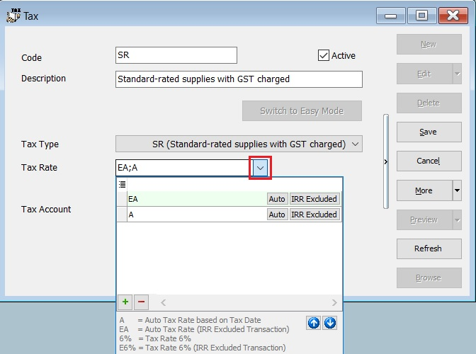

4. Click +' sign follow by **IRR Excluded** to insert additional tax rate 6% IRR excluded **(O)**.

   :::note **Note:**

   1. Tax Rate set as EA or E6%.
   2. E = Exclude from IRR formula.

   :::

5. Enter the disposal of asset in Customer Invoice.
6. Select tax code **SR**.
7. Select tax rate **E6%** to exclude from IRR calculation (It means **"O"** to the formula).

   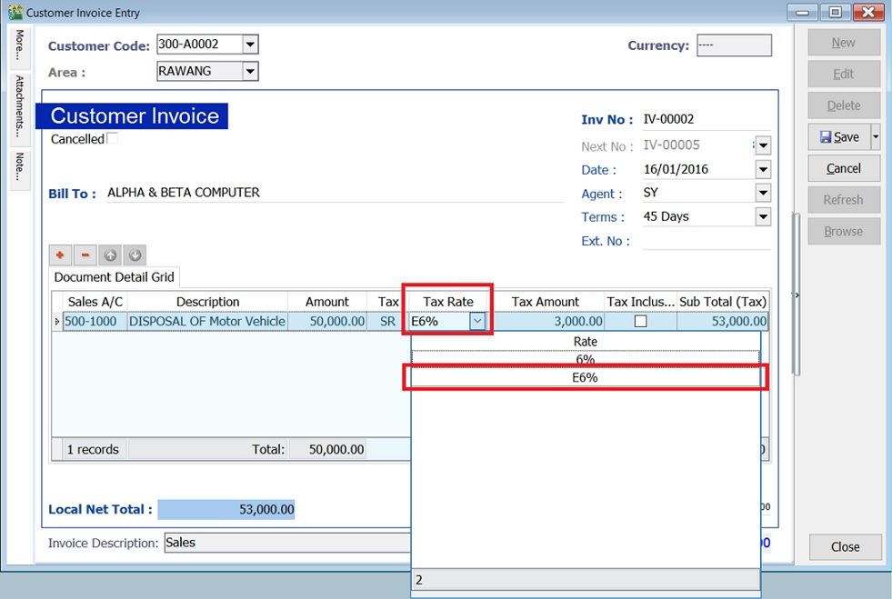

8. You will found the IRR calculated (**88.24%**) and the GST-Listing breakdown by tax code as shown in the screenshot below.

   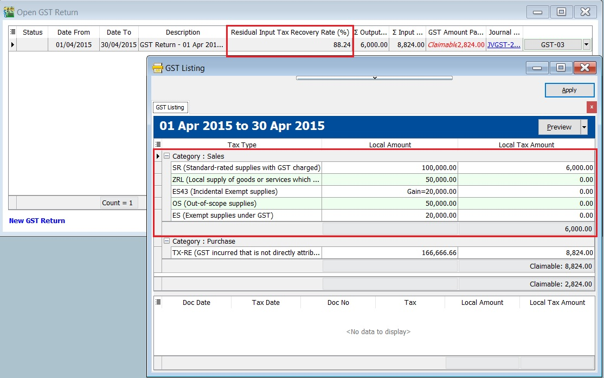

   **IRR calculation:**

   |  |                                            | Calculation                                 | RM |
   |------------|-------------------------------------------------------|-----------------------------------|------------|
   | t          | Value of all taxable supplies, exclusive of tax      | 100,000 (SR) + 50,000 (ZRL) + 50,000 (OS) | 200,000   |
   | e          | Value all of exempt supplies                          | 20,000 (ES) + 20,000 (IES)       | 40,000    |
   | o          | Value of a capital goods disposal off (exclusive of tax) | 50,000 (SR with tax rate E6%)   | 50,000    |
   | o          | Value of incidental exempt supplies                   | 20,000 (IES)                     | 20,000    |
   |            | Residual Input Tax Incurred                           | 166,666.66 x 6% (TX-RE)          | 10,000    |

9. Therefore, IRR = (200,000 -50,000) / (200,000 + 40,000) - (50,000 + 20,000) = 0.8824 (**88.24%**).
10. The amount of residual input tax can claim for the period is,

      Residual Input Tax Recovery % X Residual Input Tax = **88.24% x Rm10,000 (TX-RE) = Rm8,824.00**.

      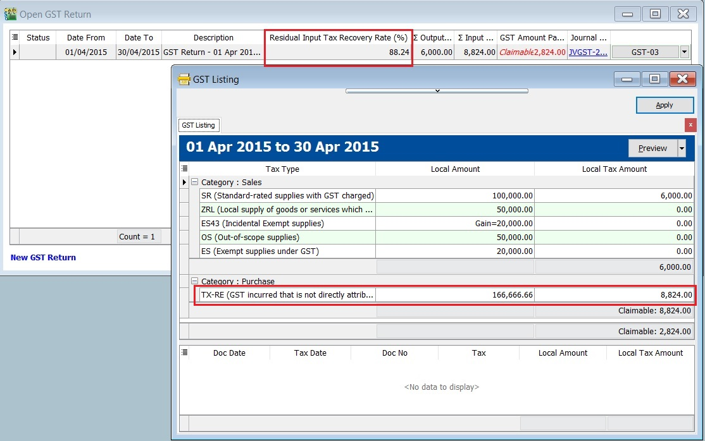

:::note **RMCD Reference:**

We get the similar example from Partial Exempt guide by Royal Malaysian Customs Department.
See the screenshot below.

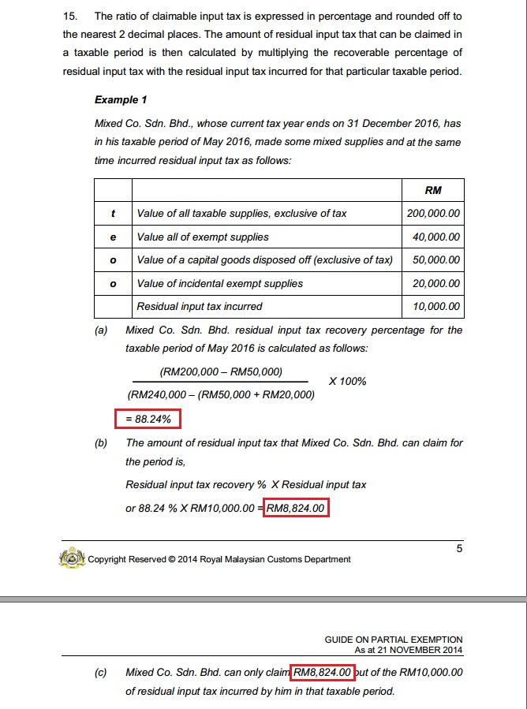

:::

### GST Listing - mixed Supply

***Monthly/Quarterly***

1. Select the **GST Process**.
2. Click **Apply**.
3. Click **Preview**.
4. Select the report name : **GST Detail 4 - Mixed Supplies**.
5. Press **Ok**.

**Page 1**: GST Listing 4 - Mixed Supplies

**Page 2**: GST Listing 4 - Mixed Supplies

## GST Treatment: Imported Services

GST on **Imported Services** (Sec 13) is accounted by way of the reverse charge mechanism.

**Reverse Charge Mechanism** (also known as Self Recipient Accounting-RSA)

A supplier who is not based in Malaysia and supplies services to a customer in Malaysia does not charge GST. However, the customer receiving the services is required to account for GST using the reverse charge mechanism.

The recipient must pay GST for the imported services received and simultaneously claim input tax in their GST return. The reverse charge mechanism is an accounting procedure where the recipient acts as both the supplier and the recipient of the services.

**Example:**

1. Royalty fee charged in Malaysia by a non-resident business situated outside Malaysia from Jan - Dec 2016 = USD 200,000
2. Date of invoice = 10 March 2016
3. Bank prevailing rate = Rm2.50 (Date: 10 March 2016)

Calculation for GST:

1. Consideration for the supply @Rm2.50 = Rm500,000.00 + GST 6%
2. GST to be accounted by recipient @6% GST = Rm30,000.00

RSA:
Account GST output = Rm30,000.00
Claim GST Input = Rm30,000.00

***Time of Supply***

1. When supply are paid for (Date of payment made) - no longer
2. Start from **01 Jan 2016**, which ever is the earlier:-

   1. Payment made; or
   2. Invoice date.

### Maintain Tax (Imported Services)

1. RSA tax code is preset in the SQL Financial Accounting.
2. It is use for the purpose of **Reverse Charge Mechanism or Recipient Self Accounting**.
3. RSA tax code setting. See the screenshot below.

   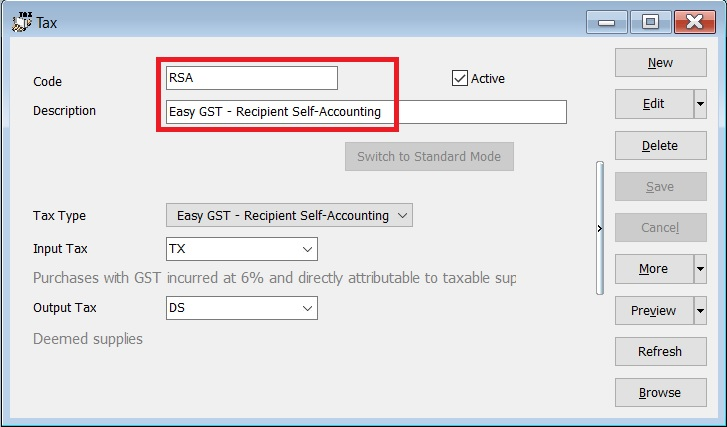

### Payment made before the invoice

1. Click on the **New PV** to create new payment voucher.

   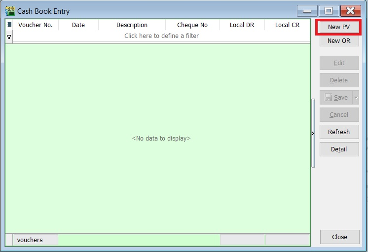

2. Enter the **payment date**, eg. 02/06/2016.
3. Select **RSA** in tax column.

   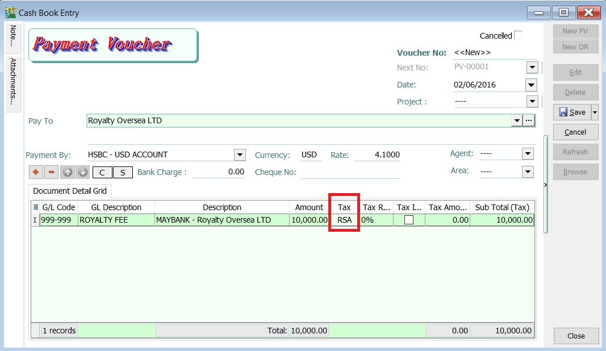

   :::note **NOTE:**

   Tax amount will be calculated after process the GST Returns.

   :::

4. After GST Returns processed, you can check the double entry posting from GL | Print Journal of Transactions Listing...

   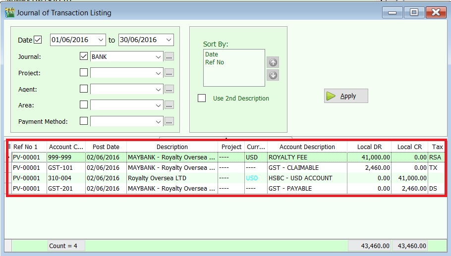

   **Double Entry - RSA:**

   | Account Code | Account Description | Tax Code | Local DR | Local CR | Taxable Period                     |
   |--------------|-------------------|----------|----------|----------|-----------------------------------|
   | GST-101      | GST - Claimable    | TX       | 2,460.00 | 0.00     | June 2016 **(follow payment date)**   |
   | GST-201      | GST - Payable      | DS       | 0.00     | 2,460.00 | June 2016 **(follow payment date)**   |

### Invoice First Payment Later

1. Click on the **New** to create new supplier invoice.
2. Enter the **invoice date**, eg. 02/06/2016.
3. Select **RSA** in tax column.

   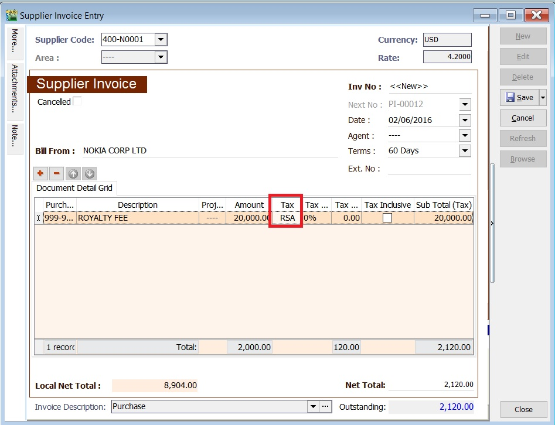

   :::note **NOTE:**

   Tax amount will be calculated after process the GST Returns.

   :::

4. After GST Returns processed, you can check the double entry posting from GL | Print Journal of Transactions Listing...

   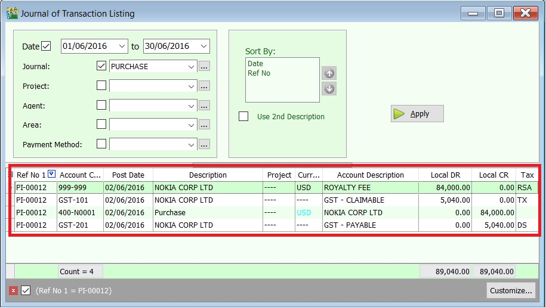

   **Double Entry - RSA:**

   | Account Code | Account Description | Tax Code | Local DR | Local CR | Taxable Period                     |
   |--------------|-------------------|----------|----------|----------|-----------------------------------|
   | GST-101      | GST - Claimable    | TX       | 5,040.00 | 0.00     | June 2016 (**follow invoice date**)   |
   | GST-201      | GST - Payable      | DS       | 0.00     | 5,040.00 | June 2016 (**follow invoice date**)   |

## GST: Set Tax Year & Longer Period Adjustment

To set the tax year and longer period adjustment (LPA).

### Set Tax Year

1. Highlight the final taxable period to be set as your **First Tax Year**, eg. final taxable period 01 Dec - 31 Dec 2016.

   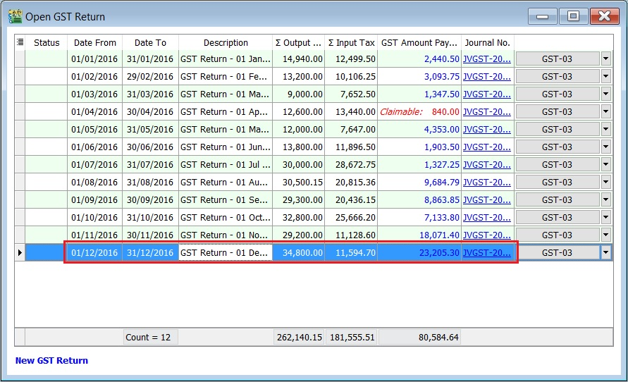

2. Double click on the GST Returns highlight in step 1.
3. System will prompt you a dialog box.
4. Tick on the **Tax Year** to set a tax year point. See the screenshot below.

   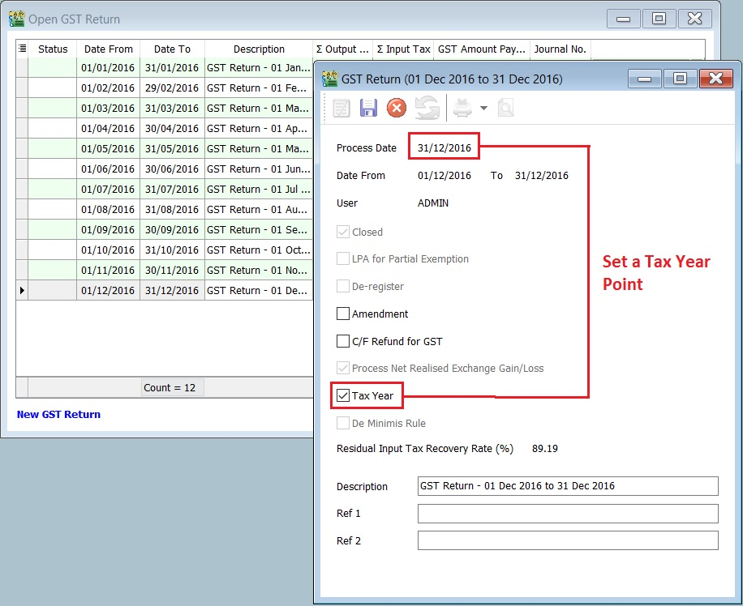

5. Click **Save**.

   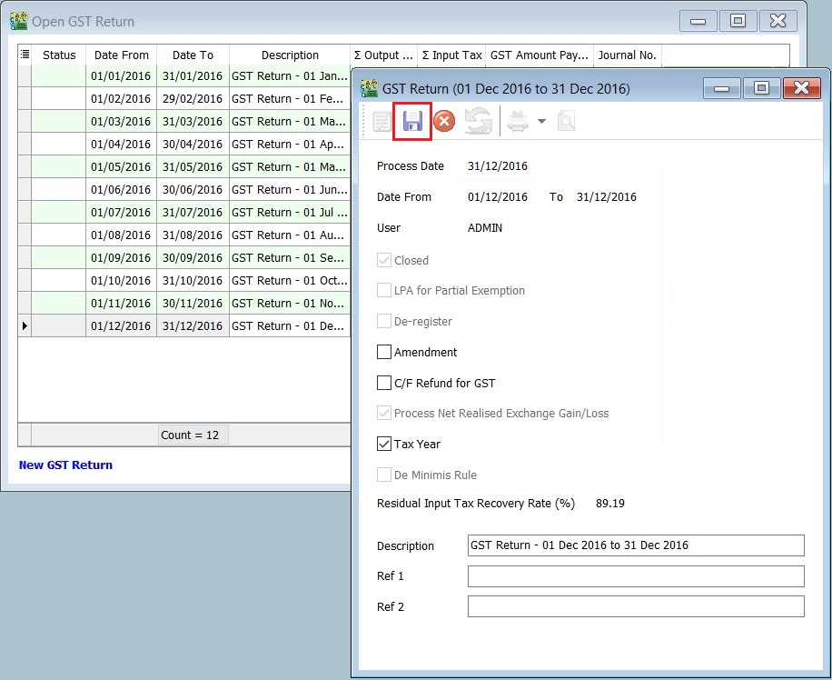

6. You can insert a column **Tax Year**, eg. Tax Year point set at 31 Dec 2016.

   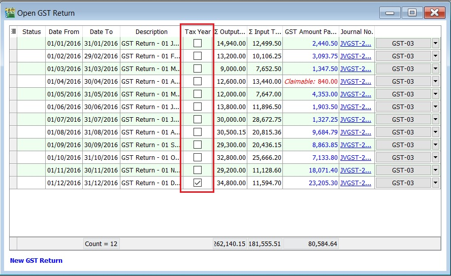

   :::note **Note:**

   You can direct set the tax year without delete/purge the GST Returns.

   :::

### Longer Period Adjustment

Declaration of annual adjustment amount:

- Regulation 43 – in a GST Return for the second taxable period next following the longer period.
For example,
Assumed the tax year set on 31 Dec 2016, LPA should be declared in:

   1) For **monthly taxable period** , the second taxable period is **Feb 2017** and the submission is before or on 31/3/2017
   2) For **quarterly taxable period**, the second taxable period is **Apr-Jun 2017** and the submission is before or on 31/7/2017

#### GST Returns (LPA)

1. Process the GST Return.For example, process the **Second Taxable Period** (01/02/2017 - 28/02/2017).
2. LPA will tick automatically.(**if you have set the tax year**)

   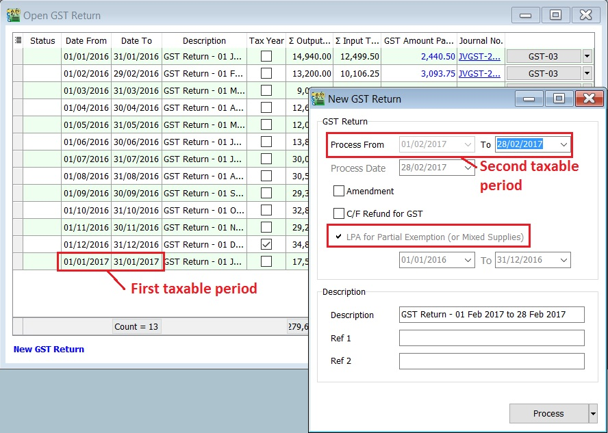

3. Suggested period to be adjusted for LPA.

   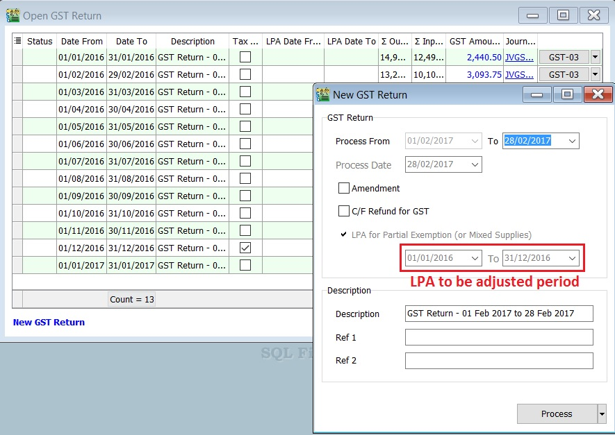

   :::note **Note:**

   User allow to overwrite the suggested period for Longer Period.

   :::

4. You can insert the **LPA Date From** and **LPA Date To** columns to check.

   

### GST Listing - Mixed Supplies (LPA)

***Longer Period Adjustment (LPA)***

1. Select the **Date From** and **Date To** (eg. the financial year is 01/01/2016 - 31/12/2016).
2. Click **Apply**.
3. Click **Preview**.
4. Select the report name : **GST Detail 4 - Mixed Supplies.**
5. Press **Ok**.

**Page 1 :** GST Listing 4 - Mixed Supplies

   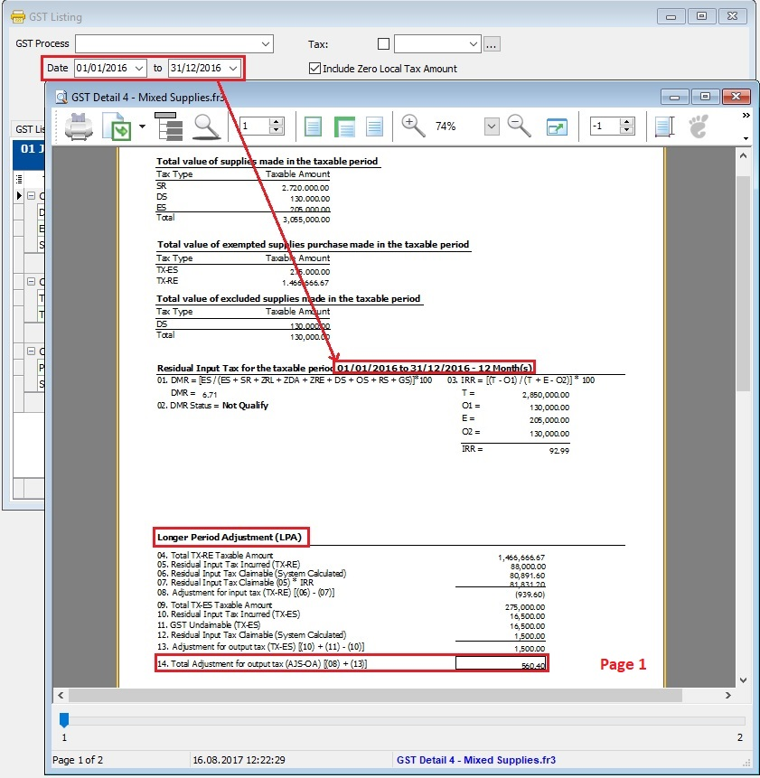

**Page 2:** GST Listing 4 - Mixed Supplies

   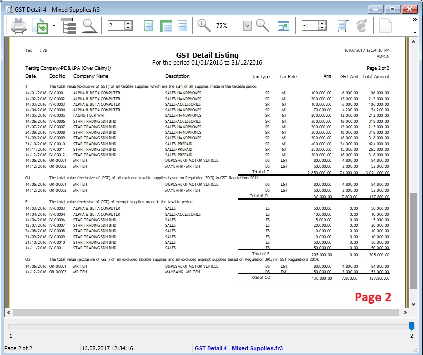

## Special-GST Treatment: Non-deductible Expenditure

How to enter and to retrieve the non-deductible expenditure?

This guide will teach you the way to key-in the data entry and help you to analyse the non-deductible expenditure related to GST. It is follow to the latest 2015 amendment in Income Tax Act 1967.

***GST Expenditure (Effective from YA 2015)***

1. para 39(1)(o): GST input tax paid or to be paid not allowed as deduction if:-
   1. Non-registered person with turnover exceed GST threshold of Rm500,000.
   2. Registered person fail to claim input tax credit his entitled to claim.
2. section 39(1)(p): Output tax absorbed by GST by registered person is not allowed as tax deduction.
3. GST block input tax & deductible expenses:-

| Block Tax                                | GST Input Tax | Tax Deductible?                                   |
|------------------------------------------|---------------|-------------------------------------------------|
| Passenger car (Cost and maintenance)     | Blocked       | Deductible (to claim capital allowance)        |
| Club subscription fee                     | Blocked       | **Non-deductible**                                 |
| Medical insurance/personal accident insurance | Blocked   | Deductible                                     |
| Family benefits                           | Blocked       | Depend (check with your auditors or tax consultant) |
| Entertainment expenses (Potential customer) | Blocked    | **Non-deductible**                                 |
| Entertainment expenses (Supplier)         | Blocked       | Allowed 50% deduction                           |

### How does it work?

1. Click New.
2. Follow the below SETTINGS to create.

   | Field Name   | Field Contents                                                                 |
   |--------------|-------------------------------------------------------------------------------|
   | Code         | ND-0 (Recommended code)                                                       |
   | Description  | Non-Deductible                                                                |
   | Tax Type     | (Non GST - Both Sales & Purchase)                                             |
   | Tax Rate     | 0% (please key-in)                                                            |
   | Tax Account  | GST-301 (This field is compulsory. Due to tax rate is 0%, therefore no posting) |
   | Tax Inclusive| Untick                                                                        |

3. Click Save. See below screenshot.

   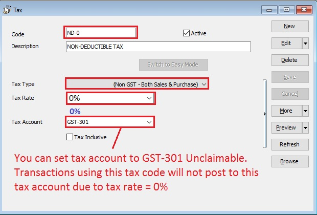

:::note **NOTE :**

Do not click the tax rate arrow key down if the tax account is not defined yet.

:::

#### Data Entry for Non-Deductible

***For Purchase Invoice***

1. Insert a new detail row and key-in the total input tax not going to claim.
2. Select the tax code "ND-0".
3. See below screenshot.

   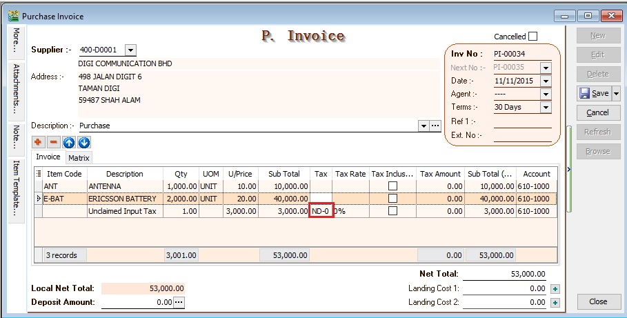

***For GL Cash Book***

1. Insert a new detail row and key-in the **total input tax not going to claim**.
2. Select the tax code "ND-0".
3. See below screenshot.

   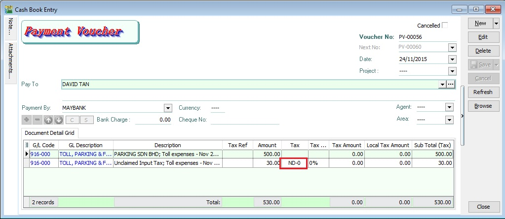

:::note **NOTE:**
Please ensure you understand the Non-Deductible expenditure from your auditors before you apply this guide.
:::

### How to analyse the total amount from Non-Deductable?\

1. Select the date range to APPLY.
2. Filter at the Tax grid column. See screenshot below.

   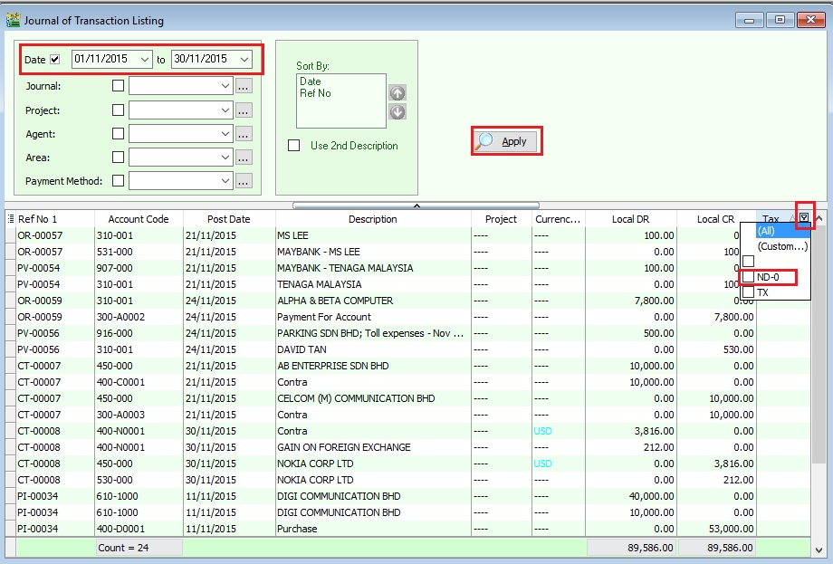

3. You can see the non-deductible transactions filtered by ND-0.

   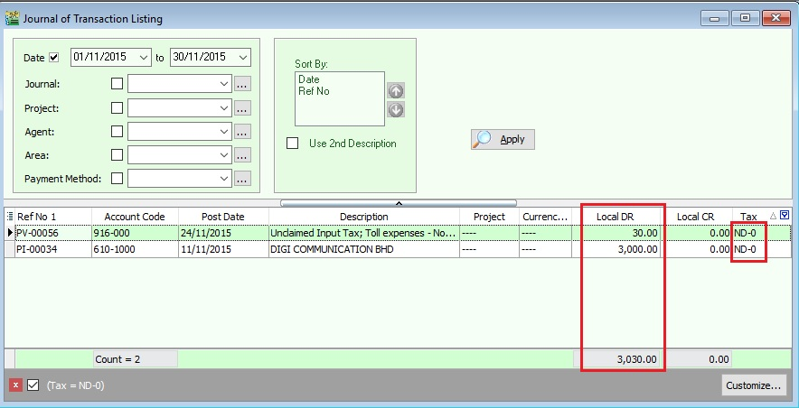

4. From this instance, the total non-deductible expenditure amount is **Rm3030.00**

:::note **NOTE:**

This non-deductible tax amount will not post to GAF.

:::

## GST-03 Item 12 (ES + IES) : How to compare the Total Value of Exempt Supplies between GST-03 and Ledger

How to compare the Total Value of Exempt Supplies between GST-03 and Ledger?

This guide will help you to check the data entry source posted for **Item 12 Total Value of Exempt Supplies in GST-03.**

1. **GST Tax Code**

   | Tax Code | Tax Description            | Tax Rate | Explanation and examples |
   |----------|----------------------------|----------|-------------------------|
   | IES      | Incidental Exempt Supplies | 0%       | Incidental exempt supplies under GST legislations (Note: Replace ES43). Incidental Exempt Financial Services Supplies (IEFS) include: 1.interest income from deposits placed with a financial institution in Malaysia, 2.realized foreign exchange gains or losses |
   | ES       | Exempt Supplies under GST  | 0%       | This refers to supplies which are EXEMPTED UNDER GST. These supply includes: 1.Selling of Residential Properties to consumer, 2.Selling of tickets for Public Transportation (Taxis, Stage Buses, Ferries), 3.Financial Institution’s interest charges to customers for loan. |

2. **GST-03**

   | Item No. | Description                 | Guidelines                          |
   |----------|----------------------------|-------------------------------------|
   | 12       | Total Value of Exempt Supplies | IES + ES (Taxable Amount)           |
   |          |                            | Note : Net Loss in Forex (ES43) = 0.00    |

### Example of Data Entry

1. IES - **Interest income from deposits placed with a financial institution in Malaysia**

   Screenshot below from **Journal Entry.**

      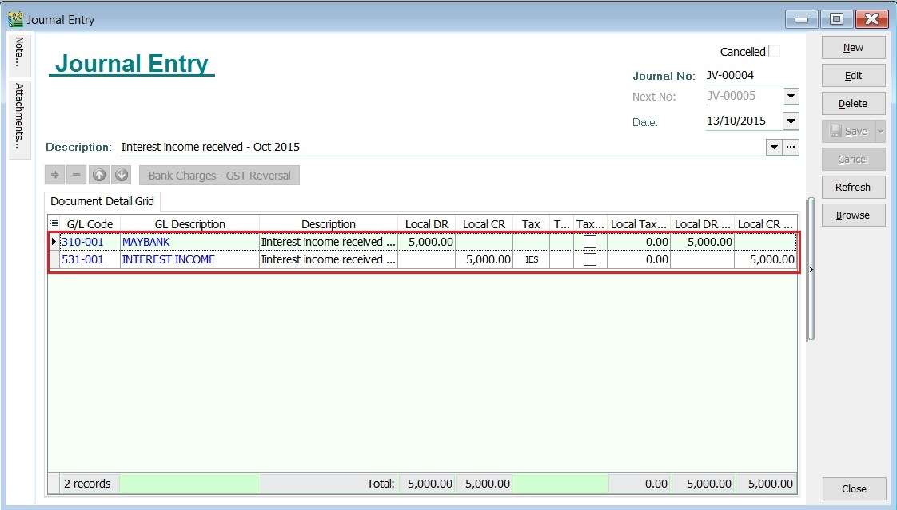

2. IES - **Realized foreign exchange gains or losses**

   1. **Realized Gain in Foreign Exchange**

      Screenshot below from **Customer Payment**.

         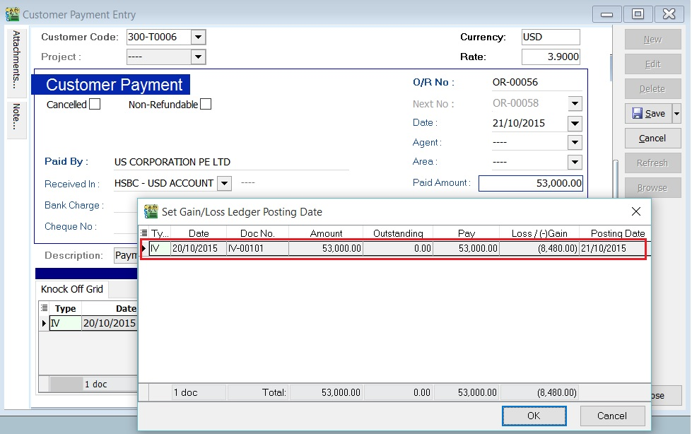

   2. **Realized Loss in Foreign Exchange**

      Screenshot below from **Customer Payment.**

         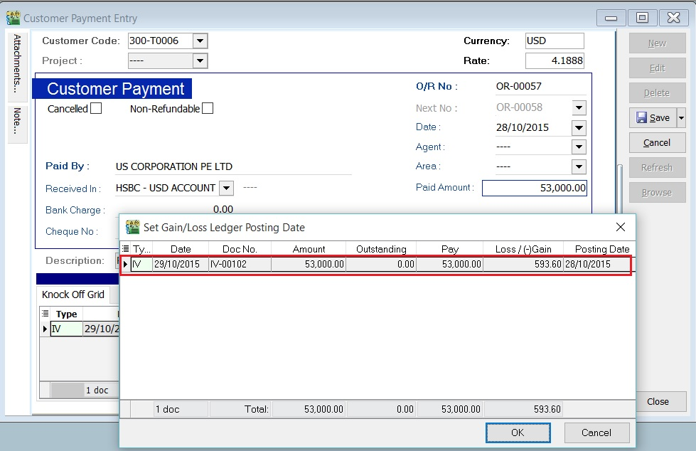

3. ES - **Financial Institution’s interest charges to customers for loan**

   Screenshot below from **Customer Invoice.**

      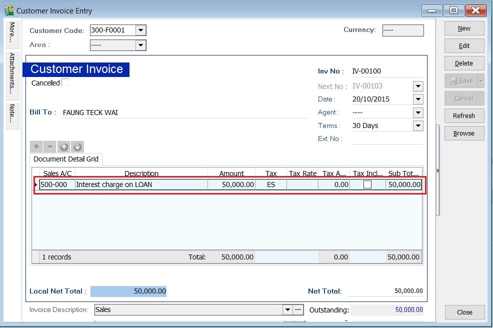

### GST - 03 Item 12 : Total Value of Exempted Supplies

1. For instances, the **GST-03 Item 12 = Rm62.886.40**

   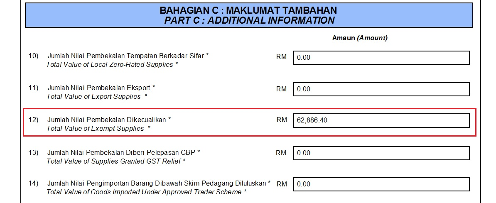

2. You can check the details by double click on the amount in **Item 12.**
3. Pop-up the item 12 detail.

   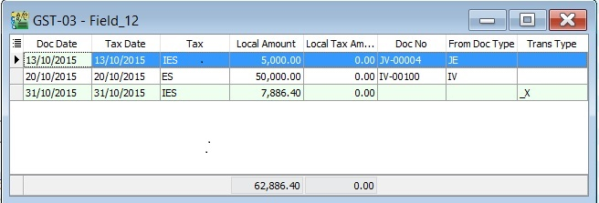

4. You can insert additional column, ie. **From Doc Type** and **Trans Type.**

    a. **From Doc Type** will help you to identify the documents where it posted;
    b. **Trans Type** will tell you the document posted from special case, eg. Realized Gain in Foreign Exchange.

    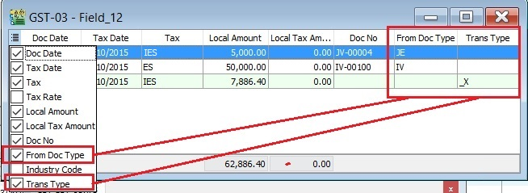

:::note **NOTE:**
Trans Type = _X, it means the posting entry related to **Realized Gain or Loss in Foreign Exchange.**
:::

### Cross Check Reports (CCR)

#### GST Listing (CCR)

1. Select the **date range** or **GST Process**.
2. You can select the tax parameter for **ES** and **IES**.
3. Apply the **GST Listing**.

   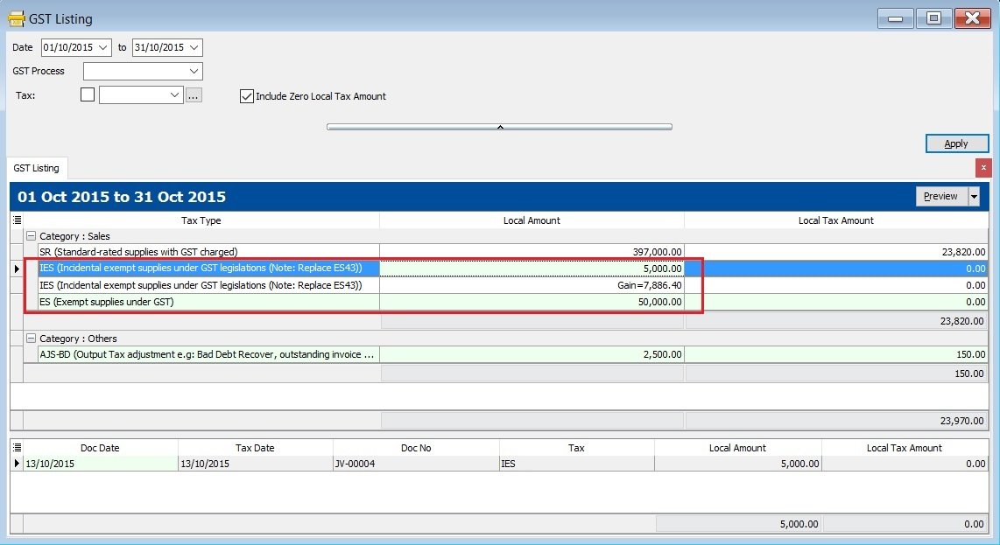

   | Tax Code | Local Amount | Explanation                                                                 |
   |----------|-------------|-----------------------------------------------------------------------------|
   | IES      | 5,000.00    | Local amount from Sales/Customer/Journal Entry/Cash Book (OR) documents related to tax code: **IES** |
   | IES      | 7,886.40    | Net realized forex gain calculated                                         |
   | ES       | 50,000.00   | Local amount from Sales/Customer/Journal Entry/Cash Book (OR) documents related to tax code: **ES** |
   | **Total**| **62,886.40**   | Total value shown in **GST-03 Item 12**                                        |

4. Click on each tax type, you able to view the details. See the example in the screenshot below.

***1. IES***

   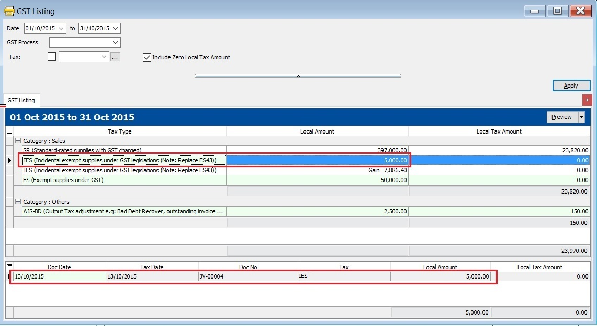

***2. IES (Net Realized Forex Gain ONLY)***

   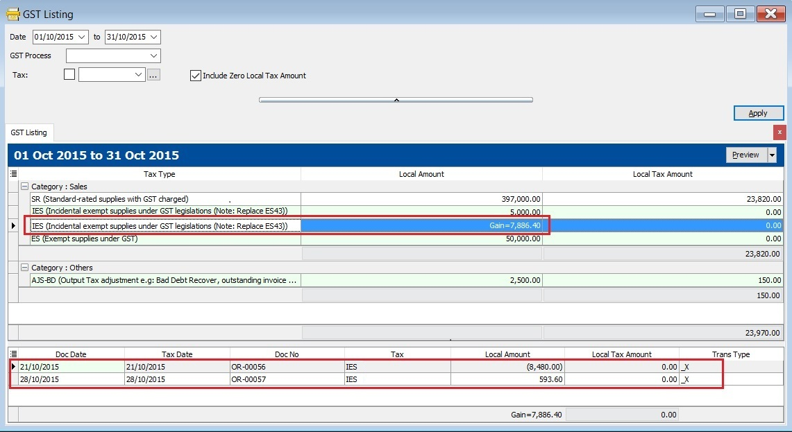

***3. ES***

   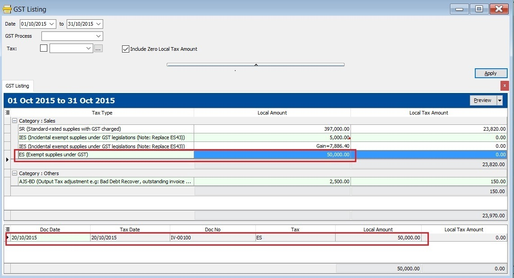

***GL Ledger***

1. In the General Ledger report, you have to insert the **Tax** grid column.
2. Filter the Tax Code **(ES and IES)**.

   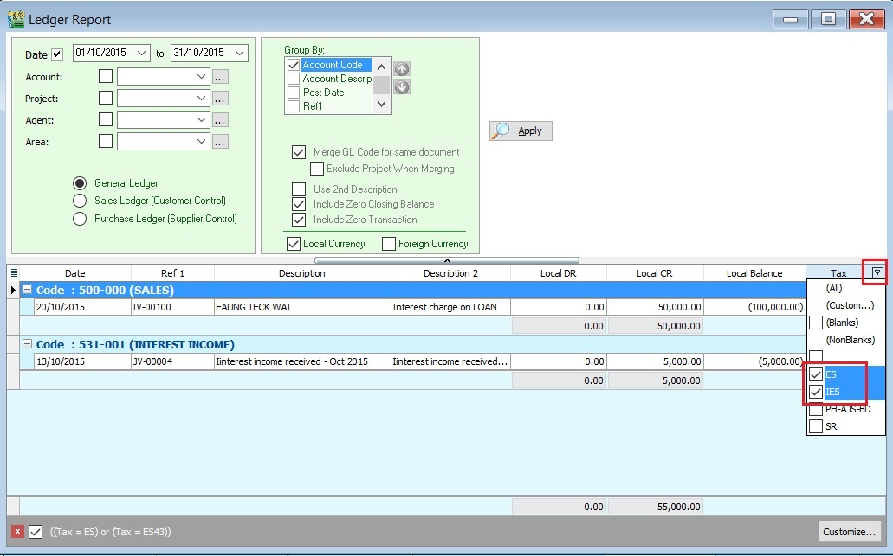

3. Transactions related to **ES**. See the screenshot below.

   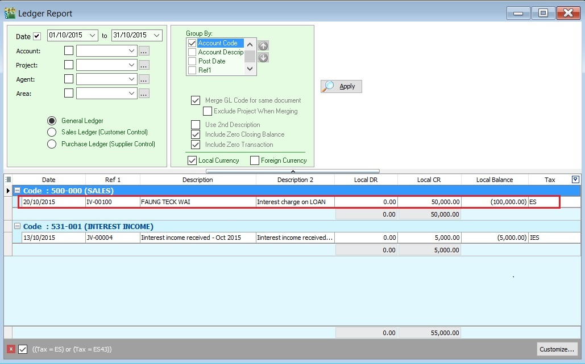

4. Transactions related to **IES**. See the screenshot below.

   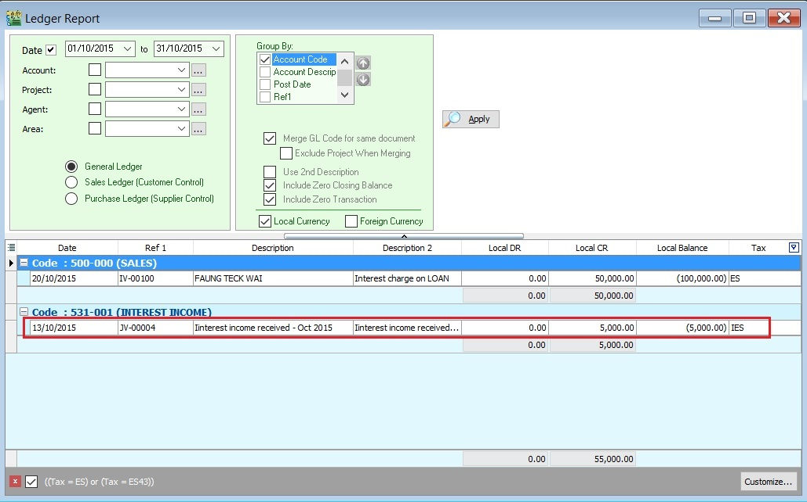

***Special Posting for Net Realized Gain Forex (IES)***

Below question and answer extract from **GUIDE ACCOUNTING SOFTWARE ENHANCEMENT TOWARDS GST COMPLIANCE.**

   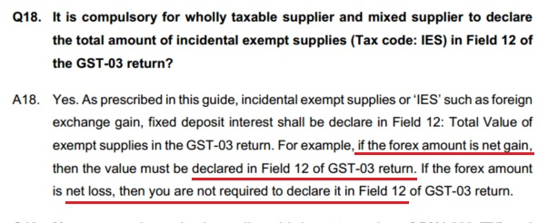

1. Check the Foreign Exchange Rate Gain or Loss Account setting at **Tools | Options...(General Ledger)**. For example,

   | Default Account                     | GL Account Code |
   |------------------------------------|----------------|
   | Foreign Exchange Rate Gain Account  | 530-000        |
   | Foreign Exchange Rate Loss Account  | 980-000        |

   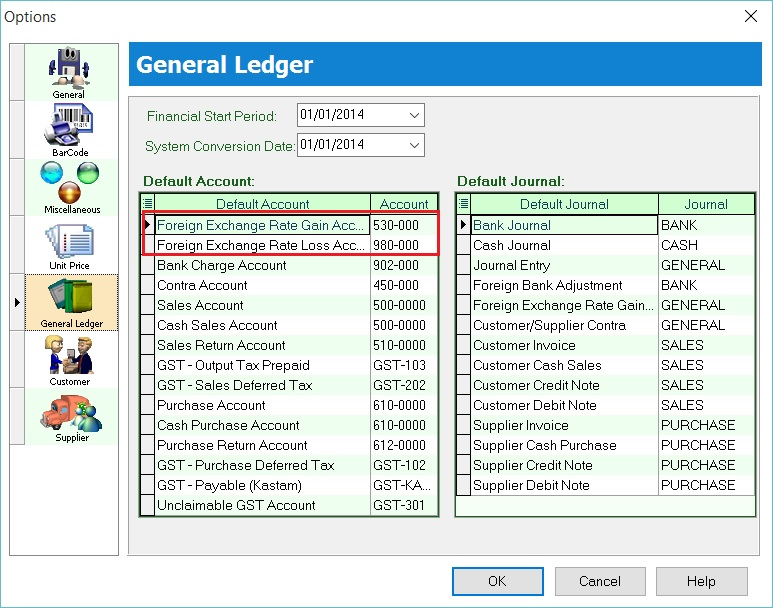

2. Select the **Foreign Exchange Rate Gain or Loss Account**, click **APPLY**

   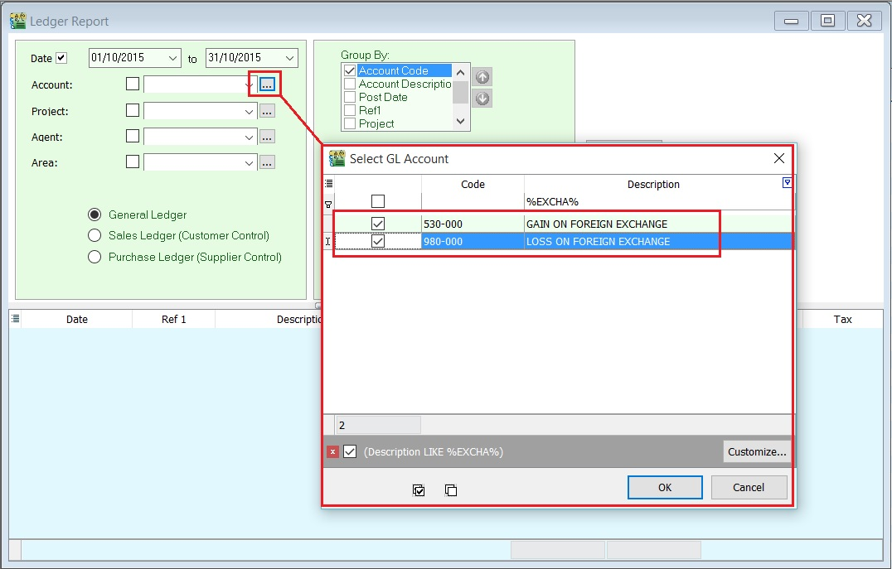

3. You can see the **Foreign Exchange Rate Gain or Loss** posting transactions in **GL Ledger**.

   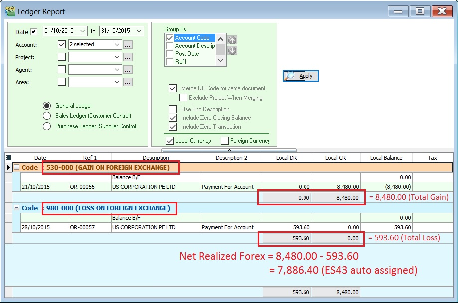

   | Account                     | Local DR | Local CR | Explanation                                         |
   |-----------------------------|----------|----------|-----------------------------------------------------|
   | Total Gain on Foreign Exchange | 0.00    | 8,480.00 |                                                     |
   | Total Loss on Foreign Exchange | 593.60  | 0.00    |                                                     |
   | Net Realized Forex           | 593.60  | 8,480.00 | 8,480.00 - 593.60 = 7,886.40 GAIN (IES)           |

:::note **NOTE:**
RMCD has confirmed that **Net Realised Gain in Forex ONLY** need to add into **GST-03 item 12 Total Value of Exempt Supplies.**
Tax code = **IES**

**Net Realised Loss in Forex** will be **NIL.**

### Summary : Comparison between GST-03, GST Listing and Ledger Report

Here is the result summarized:

| Description                 | GST-03   | GST Listing | Ledger Report |
|-----------------------------|----------|------------|---------------|
| IES                         |          | 5,000.00   | 5,000.00      |
| IES (Realized Gain Forex)   |          | 7,886.40   |Forex Gain = 8,480.00 |
|                             |          |        |Forex Loss = -593.60 |
|                             |          |  | **Net Forex Gain = 7,886.40** |
| ES                          |          | 50,000.00  | 50,000.00     |
| Total Item 12 (ES + IES)    | 62,886.40| 62,886.40  | 62,886.40     |
