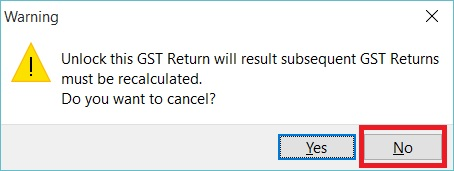
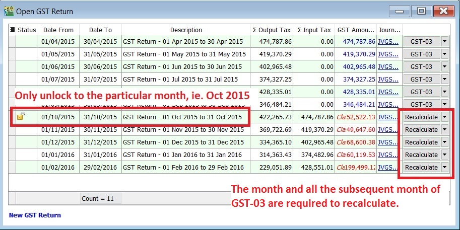
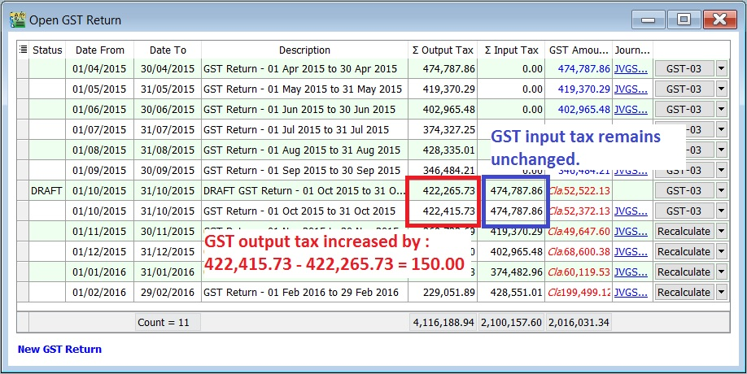

For those company who might asked and self report to RMCD for the GST-03 amendment. It could be because of applying wrong tax code or others reasons.
Therefore, this guide will explain the features to perform amendment on the particular GST-03 and re-submit via TAP website.

## Notification On GST 03 Return Amendment

In accordance with **Regulation 69 of the GST Regulation 2014**, with **effect from 23 August 2016**, rules on return amendments are follows:

  1. There is **no limit** on return amendments until due date of submission of return.
  2. Amendment are allowed once within 30 days **(for monthly taxable period)** or 90 days **(for quarterly taxable period)** after last day of submission of return. Subsequent amendment are subject to approval by GST Officer.
  3. Amendment after the period stated in PARA 2 above are subject to approval by GST Officer.
  4. Amendment can be made through TAP but are subject to approval by GST Officer.
  5. Return amendments which are not approved by GST Officer is considered invalid and previous return made before the amendment will be accepted.

## GST - 03 Amendment

### Amendment

1. Highlight and right click on the GST-03 that you are required to resubmit as **amendment**.

   

2. Select **Unlock**.

   

3. Click on **No** to unlock this GST Return.

   

   :::note Important:

   Read the message before take further actions.

   :::

4. Enter the ADMIN password.

   

   :::note NOTE:

   ADMIN password only

   :::

5. Status will added **Unlock** icon. It means users are allow to amend the documents for the month unlock, eg. the documents are able to amend in Oct 2015 only.

   

   :::note NOTE:

   1. The month and all the subsequent month of GST-03 will converted to "Recalculate" action. It is depends on the amendment which might trigger the bad debt relief result changed.
   2. All the subsequent month of GST-03 are not allow to amend the documents (eg. invoice, credit note, supplied invoice, etc), unless you have **Unlock** it.

   :::

6. For example, to correct the tax code from ZRL to SR for the invoice amount Rm2,500.00.

   1. Edit the invoice (eg. IV-00014 and date: 02 Oct 2015)

      

      :::note NOTE:

      **Unlock** GST-03 is allow you to edit the documents only.

      :::

   2. Change the tax code from **ZRL** to **SR**.
   3. It will resulting the **output tax increased by Rm150.00** (Rm2,500.00 X 6%).

      

7. Run **Recalculate** for the GST-03 (eg. Oct 2015)
8. System will prompt **Recalculate successfully**.

   

9. Press OK to proceed and a draft copy of GST-03 for Oct 2015 will create automatically. A previous GST-03 before perform any amendment to the taxable period will converted as **DRAFT** status.

   

10. You can see the comparison in between **the draft (from Recalculate)** and **the Final GST-03** for the amendment taxable period.

   

   | Status  | Taxable Period       | Total Output Tax | Total Input Tax |
   |---------|----------------------|------------------|-----------------|
   |         | 01 Oct - 31 Oct 2015 | 422,415.73       | 474,787.86      |
   | Draft   | 01 Oct - 31 Oct 2015 | 422,265.73       | 474,787.86      |
   |         | Increase/Decrease (-)| 150.00           | 0.00            |

### How to know the GST - 03 has performed amendment?

1. You can find a **cross marked (X)** on the amendment column in the GST-03. See the screenshot below.

   

2. At the GST Returns, insert a grid column **Amendment**. Usually, you will found **the ticked on the amendment column** for both DRAFT and final GST-03.

   

### How to unlock the subsequent GST - 03 for amendment?

1. Highlight on the subsequent GST-03, eg. for subsequent taxable period is 01 Nov - 30 Nov 2015.
2. Right and **unlock** it.

   
