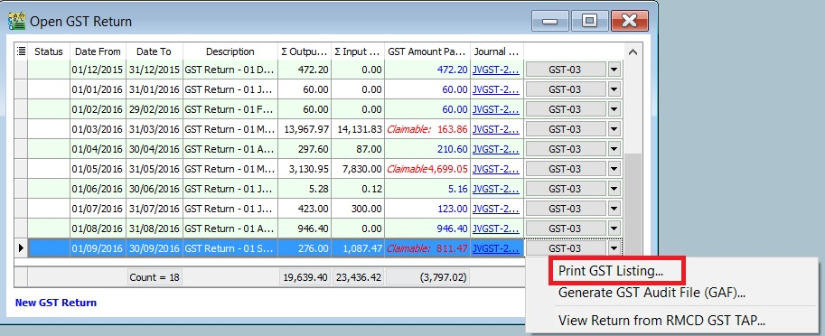
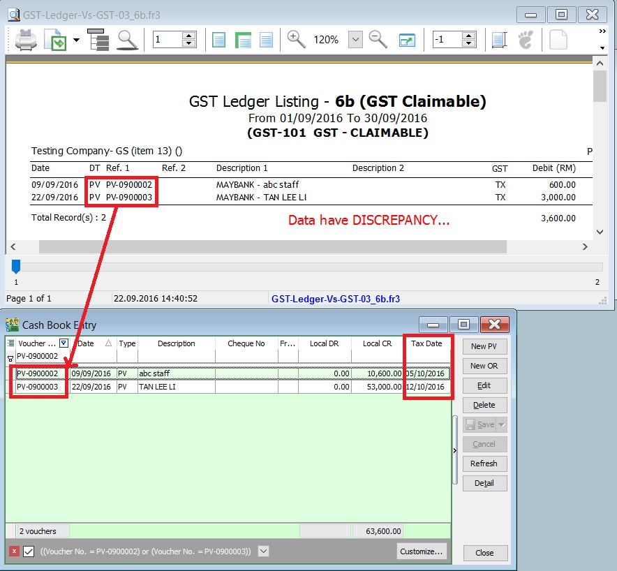

## How to Avoid Costly GST Errors?

This guide will help you to easily identify the common GST errors in GST Returns. To minimize GST amendment and incorrect GST Returns to RMCD.
You may wish to take note the follow errors commonly made by businesses:

1. Standard Rated Supply (5a) and Output Tax (5b)
2. Standard Rate and Flat Rate Acquisitions (6a), and Input Tax (6b)
3. Local Zero-Rated Supplies
4. Export Supplies
5. Exempt Supplies
6. Supplies Granted GST Relief
7. Goods Imported Under Approved Trader Scheme and GST Suspended
8. Capital Goods Acquired
9. Bad Debt Relief
10. Bad Debt Recovered
11. Output tax value breakdown into Major Industries Code (MSIC Code)
12. Other important info required in GAF
13. GL Ledger vs GST-03
14. Foreign currency exchange rate

### Standard Rate Supply (5a) and Output Tax (5b)

**Mapping of GST Tax Code:**

| GST-03 | Description                                                                          | Tax Code       |
|--------|--------------------------------------------------------------------------------------|----------------|
| 5a     | Total Value of Standard Rated Supply                                                 | **SR, DS**     |
| 5b     | Total Output Tax (Inclusive of Tax Value on Bad Debt Recovered & others adjustments) | **SR, DS, AJS**|

1. Sale or disposal of business assets
2. Goods given free as gift.
3. Inter-company transactions
4. Margin Scheme

### Standard Rate and Flat Rate Acquisitions (6a), and Input Tax (6b)

**Mapping of GST Tax Code:**

| GST-03 | Description                                                                     | Tax Code                                                                                                       |
|--------|---------------------------------------------------------------------------------|----------------------------------------------------------------------------------------------------------------|
| 6a     | Standard Rate and Flat Rate Acquisitions                                        | **TX, TX-CG, TX-ES** (DMR is fulfilled only), **TX-IES** (Total/Full amount), **TX-RE, IM**                    |
| 6b     | Total Input Tax (Inclusive of Tax Value on Bad Debt Relief & other Adjustments) | **TX, TX-CG, TX-ES** (DMR is fulfilled only), **TX-IES** (GST Claimable only based on IRR), **TX-RE, IM, AJP** |

Not all input tax claims are allowable. You can claim input tax on your purchases only if the below conditions are fulfilled.

1. Tax invoice / Simplified Tax Invoice / Custom K1 / Custom K9
   1. The buyer can use **simplified tax invoice** if the **total amount GST payable is RM30 or less**.
   2. if the **total amount of GST payable is more than RM30**, the buyer must request for a **tax invoice** with the name and address of the buyer.
   3. Tax invoice issued by approved person for Flat Rate Scheme.
   4. **K1** form for imported goods
   5. **K1** and **K9** for goods removed from bonded warehouse

2. Supplies made outside Malaysia which would be taxable supplies if **made in Malaysia**.
3. To be eligible for input tax claim relating to goods that are exported, a registered person (exporter) must ensure that:
   1. prescribed customs form for export (K2 / K8) must have an endorsement on Remarks column in **Sistem Maklumat Kastam (SMK)** – “A claim for input tax under the GST Act 2014 will be made”; and
   2. Customs Official Receipt.

4. **Disregarded supplies** (supplies within group, supplies made in warehouse, supplies between venture operator and venturers, and supplies between toll manufacturer and overseas principal).
5. Directly attributable to taxable supplies (ie. standard rated supplies and zero rated supplies).
6. Must not be disallowed expenses (or known as **Blocked Input Tax**).
   1. Passenger motor cars (**not more than 9 passengers** including driver and unladen weight does not exceed 3,000 kg) including hiring of car
   2. Repair and maintenance for motor cars
   3. Family benefits
   4. Club subscription fee
   5. Medical and personal accident insurance
   6. Medical expenses
   7. Entertainment expenses for potential customer or others than employees.

7. Must be taxable purchases (ie. purchases made from GST registered suppliers)

### Local Zero - Rated Supplies

**Mapping of GST Tax Code:**

| GST-03 | Description                              | Tax Code     |
|--------|------------------------------------------|--------------|
| 10     | Total Value of Local Zero-Rated Supplies | **ZRL, ZDA** |

This refer to the following types according to **GST (Zero Rate Supplies) Order 2014**:-

1. Local supply of goods and services (**ZRL**):

   1. Zero-rated supply of goods of any of the descriptions as in Appendix (Zero-rated Supply) Order 2014 based on tariff code in such as milled-rice, fresh fruit, and live animals (cattle, buffalo, goat, sheep and swine),
   2. Medicaments and medical gases in the National Essential Medicines List issued by the Ministry of Health and approved by the Minister and put up in measured doses or in forms of packaging for retail sale,
   3. The supply of treated water by a person who is licensed under the Water Services Industry Act 2006 [Act 655] to domestic consumers irrespective of minimum or non-usage,
   4. The supply of raw materials and components made to a person who belongs in a country other than Malaysia for the treatment and processing of goods by any taxable person under the Approved Toll Manufacturer Scheme, and etc.

2. Supply of goods from Malaysia to Designated Area, ie. Pulau Langkawi, Labuan, & Pulau Tioman (**ZDA**)

### Export Supplies

**Mapping of GST Tax Code:**

| GST-03 | Description                    | Tax Code |
|--------|--------------------------------|----------|
| 11     | Total Value of Export Supplies | **ZRE**  |

This refer to the Supply of goods or services **from Malaysia to Oversea** according to **GST (Zero Rate Supplies) Order 2014**.

1. Movement of goods is supported with **Customs K2** form which must stated the following:

   1. Supplier's name and address as the consignor.
   2. Recipient's name and address in overseas recipient as the consignee.
   3. Supply of services must attached with supporting documents such as invoice for an international services. Examples includes sales of air-tickets and international freight charges.

**How to check the transactions correctly entered?**

At the invoice entry, please ensure the following screenshot and steps are followed/entered correctly:-

1. **Customer name** and **address** must be a **foreigner company**.
2. **Country** to define the destination of goods deliver.
3. **Permit No** to record the **Custom K2** no for supporting document reference.
4. Tax code must be **ZRE**.

### Exempted Supplies

**Mapping of GST Tax Code:**

| GST-03 | Description                    | Tax Code    |
|--------|--------------------------------|-------------|
| 12     | Total Value of Exempt Supplies | **ES, IES** |

This refer to the following types according to **GST (Exempt Supplies) Order 2014:-**

1. **Services (ES):-**
   1. Private education
   2. Private health services
   3. Childcare services
   4. Domestic transportation of passengers for mass Public Transports (eg. by rail, ship, boat, ferry, express bus, stage bus, school bus, feeder bus, workers bus and taxi)
   5. Toll highway

2. **Financial Services (IES):-**
   1. Interest income from deposits placed with a financial institution in Malaysia
   2. Interest received from loans provided to employees (factoring receivables)
   3. [Realized foreign exchange gains](../../usage/gst/gst-item12.md)

3. **Goods (ES):-**
   1. Residential properties
   2. Land for agricultural use
   3. Land for general user (ie. burial ground, playground or religious building)

#### How to check the transactions correctly entered?

***A. GST Listing***

1. After GST Return processed, go to **Print GST Listing....**

   

2. Preview and select the report name **GST Detail 2**.
3. To ensure the **document detail descriptions** are clearly stated and map to the correct tax code.

   

***B. GST-03***

1. To quick do amendment before submit the GST-03 to RMCD. [Click this link](../../usage/gst/gst-amendment#gst---03-amendment) to learn more about the **GST amendment**.
2. Double click on the item 12 in GST-03.

   

3. Drill down the documents to open and correct it accordingly.
4. Lastly, you have to **Recalculate** the amended GST Return.

### Supplies Grant GST Relief

**Mapping of GST Tax Code:**

| GST-03 | Description                                | Tax Code |
|--------|--------------------------------------------|----------|
| 13     | Total Value of Supplies Granted GST Relief | **RS**   |

### Goods Imported Under Approved Trader Scheme and GST Suspended

**Mapping of GST Tax Code:**

| GST-03 | Description                                                | Tax Code          |
|--------|------------------------------------------------------------|-------------------|
| 14     | Total Value of Goods Imported Under Approved Trader Scheme | **IS**            |
| 15     | Total Value of GST Suspended under item 14                 | **IS** × Tax Rate |

### Capital Goods Acquired (Avoid Costly GST Error)

**Mapping of GST Tax Code:**

| GST-03 | Description                           | Tax Code                                                              |
|--------|---------------------------------------|-----------------------------------------------------------------------|
| 16     | Total Value of Capital Goods Acquired | **TX-CG, TX, IM** (Transaction GL Account related to **Fixed Asset**) |

### Bad Debt Relief

**Mapping of GST Tax Code:**

| GST-03 | Description                                  | Tax Code          |
|--------|----------------------------------------------|-------------------|
| 17     | Total Value of Bad Debt Relief Inclusive Tax | **AJP (AR only)** |

### Bad Debt Recovered

**Mapping of GST Tax Code:**

| GST-03 | Description                                     | Tax Code          |
|--------|-------------------------------------------------|-------------------|
| 18     | Total Value of Bad Debt Recovered Inclusive Tax | **AJS (AR only)** |

### Output tax value breakdown into Major Industries Code (MSIC Code)

1. This part usually require you to breakdown the total output tax reported in 5b according to your **main business**.
2. You have to map to [MSIC code](https://sites.google.com/site/sqlestream/sql-financial-accounting/9-good-and-service-tax-gst---malaysia/9-23-major-industries-code-msic).

#### **Where to set the MSIC Code?**

1. Select and edit your main business supplies GL Account, eg. my main business is selling hand-phones.
2. Select an appropriate **Industries Code**.
3. You can change the search pattern to **-A-**. See screenshot below. So you can type-in the keywords, eg. Phone.

   

### Other important info required in GAF

The GST Audit file is a way for taxpayers to submit information relevant to auditors in response to an audit request on information for auditing purposes. The information provided includes company identifications, names, supply & purchases, and general ledger transactions. There is also a footer record to ensure file integrity.

Record types are:-

| Record Type | Description | Where it update???                                                                                                                    |
|-------------|-------------|---------------------------------------------------------------------------------------------------------------------------------------|
| C           | Company     | Company Profile                                                                                                                       |
| P           | Purchase    | Supplier Invoice (PI), Supplier Debit Note (SD), Supplier Credit Note (SC), Cash Book (PV), and Journal (JE)                          |
| S           | Supply      | Customer Invoice (IV), Customer Debit Note (DN), Customer Credit Note (CN), Cash Book (OR), Gift/Deemed Supply (GI), and Journal (JE) |
| L           | Ledger      | From the GL Ledger reports                                                                                                            |
| F           | Footer      | GAF file integrity check                                                                                                              |

### GL Ledger VS GST - 03

1. **GST-Ledger-Vs-GST-03** is a very useful report to identify the unrealized human errors immediately. Possible errors may be due to documents had selected:-

   1. Wrong tax code or category
   2. Wrong account code
   3. Use Tax Date which is different from Document Date
   4. 5 Cents rounding had selected Tax Code.

2. It comprises of 2 reports:-

   | Report Name                | GL Acc                    | Explanation                                                             |
   |----------------------------|---------------------------|-------------------------------------------------------------------------|
   | 1. GST-Ledger-Vs-GST-03_5b | GST-201 (GST - Payable)   | To reconcile the GST Payable account between the GL Ledger and GST-03   |
   | 2. GST-Ledger-Vs-GST-03_6b | GST-101 (GST - Claimable) | To reconcile the GST Claimable account between the GL Ledger and GST-03 |

3. For example,

   Supplier invoice date (15 Sept 2016) received in Oct 2016 and GST-03 Sept 2016 has submitted. Input tax will be claim in Oct 2016 by set the tax date (31 Oct 2016). In GL Ledger, the input tax will be posted in Sept 2016. However, this input tax will be appear in GT-03 Oct 2016.
   With this **GST-Ledger-Vs-GST-03** report, you can very easy identify out the reasons. See the screenshot below.

      

### Foreign Currency Exchange Rate

1. Always update the currency exchange rate at Tools | [Maintain Currency](../../usage/tools/guide#maintain-currency).
2. Critical cost on output tax if bill in foreign currency to local customer:

| Currency | Status    | Exchange Rate | Amount   | Local Amount      | Output Tax |
|----------|-----------|---------------|----------|-------------------|------------|
| USD      | Outdated  | 3.8000        | 1,000.00 | 3,800.00          | 228.00     |
| USD      | Actual    | 4.3000        | 1,000.00 | 4,300.00          | 258.00     |
|          |           |               |          | **Under declared**| -30.00     |
