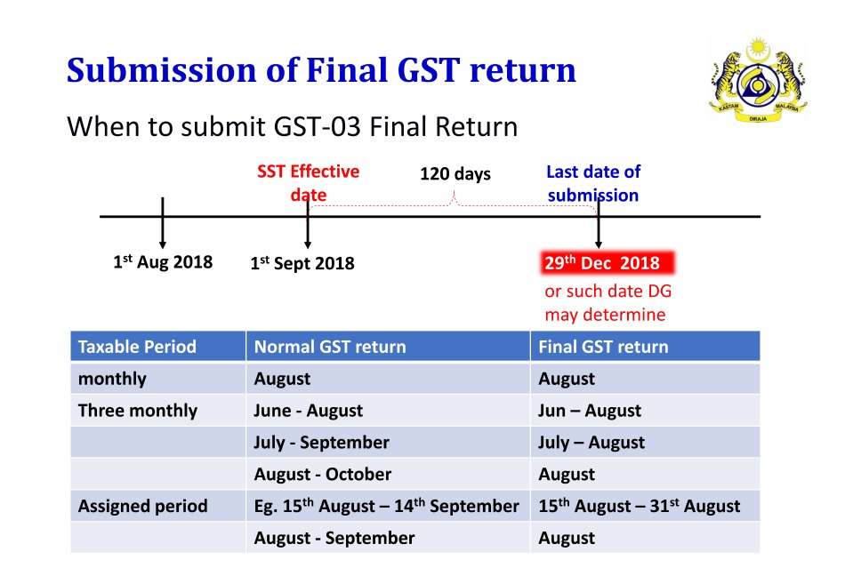
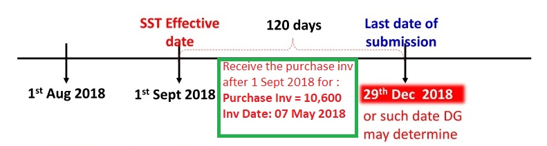
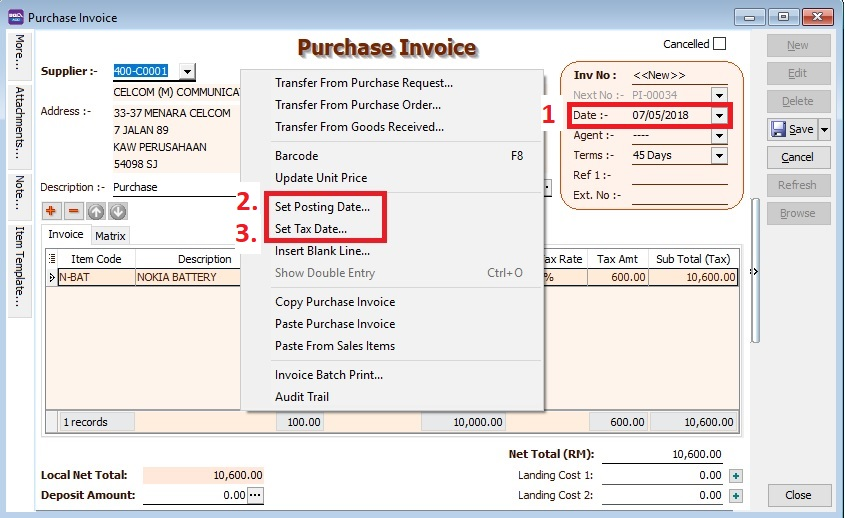
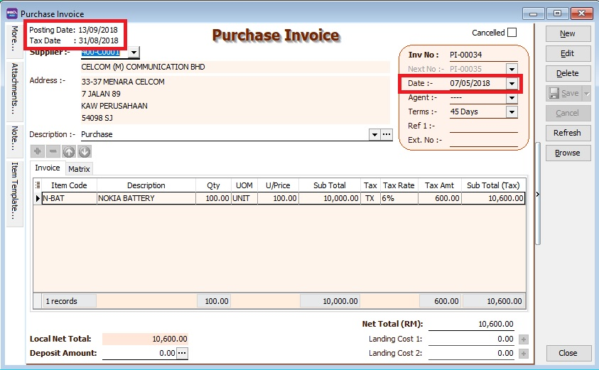
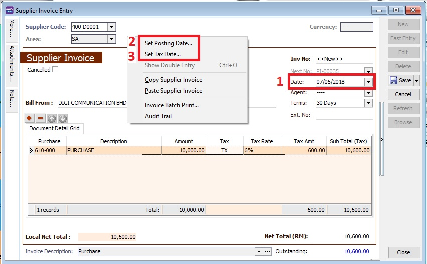
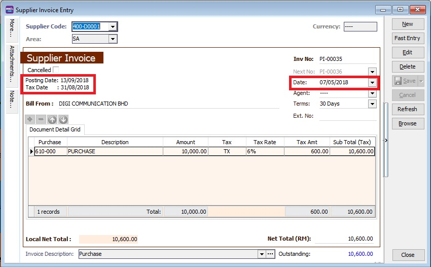
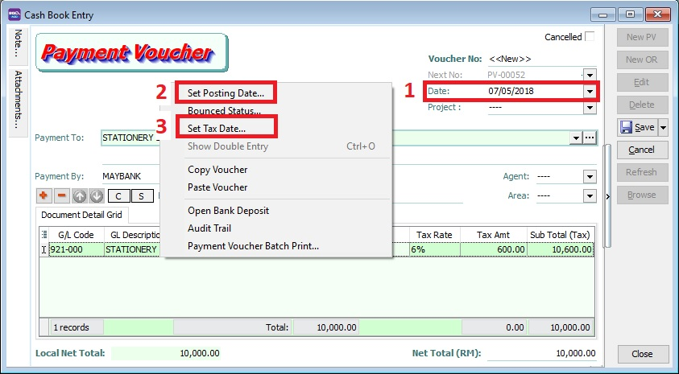
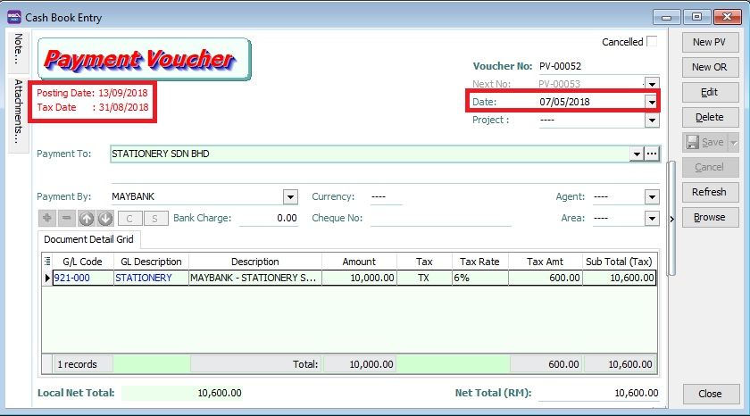

## Submission of Final GST Return

Pursuant to Section 6, **Goods and Service Tax (Repeal) Act 2018**, all GST Registrants are required to submit the GST-03 Return on the final taxable period **(ie. 31 Aug 2018)** and make full payment for the amount of tax payable in connection with the supply **for the last taxable period within 120 days (29 December 2018)** from 01 Sept 2018.

- Any input tax claimable from the purchase/supplier invoice received after 1 Sept 2018. It can be claim and must submit into the **Final GST Returns (31 Aug 2018)**.
- Input tax claim will be subjected to verification and audit.
- Refund will be made within 6 years.

### How to enter the input tax 6% claimable from Purchase / Supplier invoice after 1st September 2018?

For example, on **13 SEPT 2018**, my company has received a supplier tax invoice dated **07 MAY 2018** and amount inclusive GST is **RM10,600**.

#### Enter at Purchase Invoice

1. Set **Date**... to record the original invoice date (eg. **07 MAY 2018**).
2. Set **Posting Date**... to post this transaction into GL reporting as at **13 SEP 2018**.

   :::note Note:

   To enable to set Posting Date, the **Double Document Module** is required.

   :::

3. Set **Tax Date**... to declare this GST input tax into **Final GST Returns (31 AUG 2018)**.

   

#### Enter at Supplier Invoice

1. Set **Date**... to record the original invoice date (eg. **07 MAY 2018**).
2. Set **Posting Date**... to post this transaction into GL reporting as **13 SEP 2018**.

   :::note Note:

   To enable to set Posting Date, the **Double Document Module** is required.

   :::

3. Set **Tax Date**... to declare this GST input tax into **Final GST Returns (31 AUG 2018)**.

   

#### Enter at Cash Book (PV)

1. Set **Date**... to record the original invoice date (eg. **07 MAY 2018**).
2. Set **Posting Date**... to post this transaction into GL reporting as at **13 SEP 2018**.
3. Set **Tax Date**... to declare this GST input tax into **Final GST Returns (31 AUG 2018)**.

   

### Final GST Returns

Process GST Returns up to **31 AUG 2018**.

| Items | Value   |
|-------|---------|
| 6a    | 10,000  |
| 6b    | 600     |

   :::note NOTE:

   1. Final GST Returns until **31 AUG 2018**.
   2. Last date of submission for the **Final GST Returns is 29 DEC 2018**

   :::
