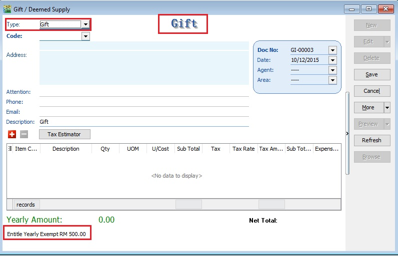
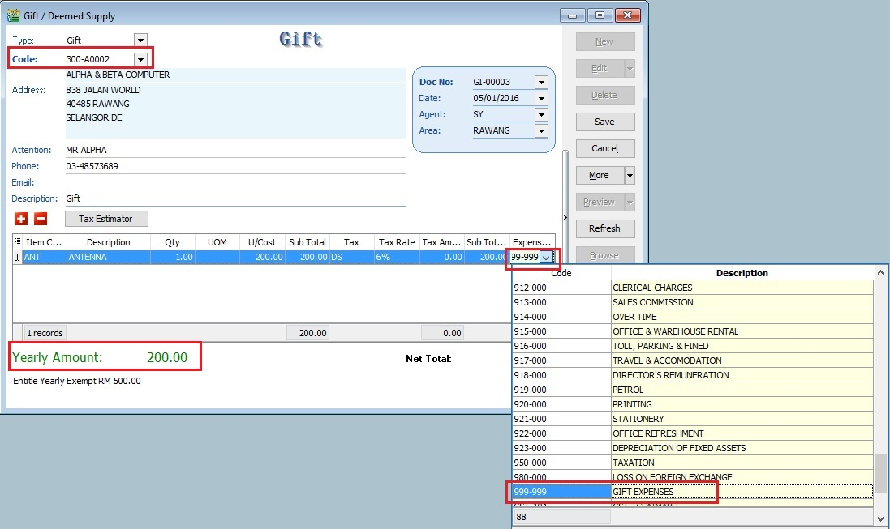
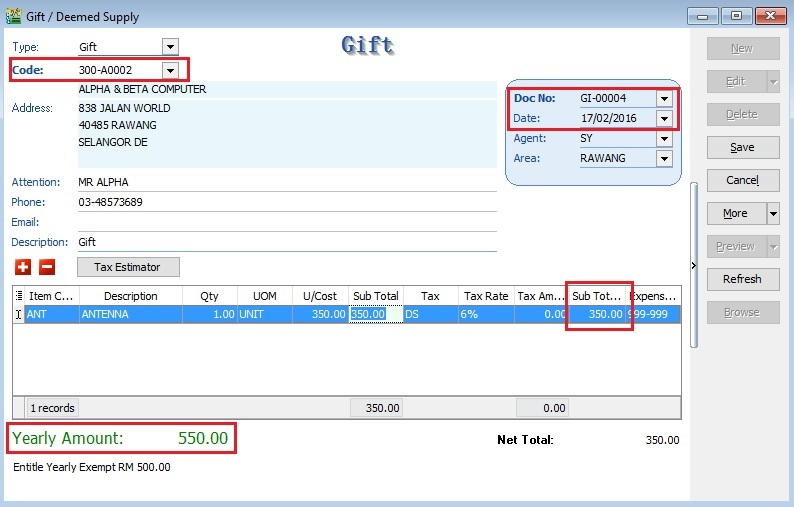
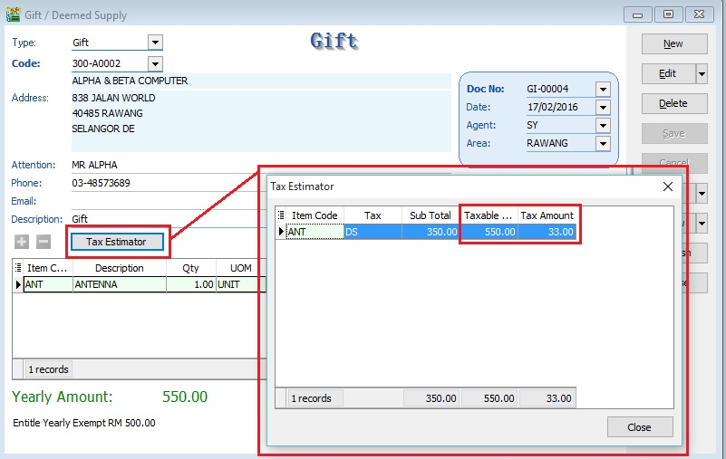
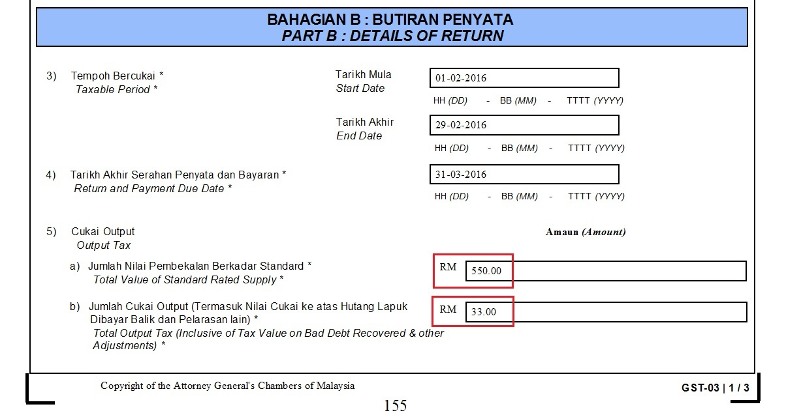
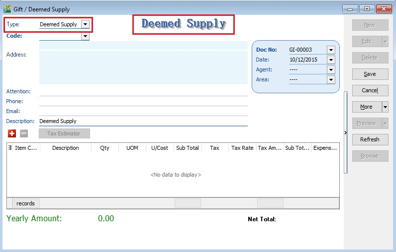

This guide will teach you to enter the gift and deemed supply in SQL Financial Accounting.

## Gift

### Gift Rules

Goods worth not more than RM500 given FREE to the same person in the same year. **The word ‘year’ in paragraph 5(2) (a) of the First Schedule of GSTA 2014 refers to ‘tax year ‘(financial year)**.

- not a supply
- not subject to GST
- input tax is claimable

> **What it means year as Tax Year (Financial Year)?**
> For example....
GST Effective Date: 01 Apr 2015
Financial Start Period: 01 July 2014
>
>
> First tax year will be: 01 Apr 2015 - 30 Jun 2016 (15 months) - Gift rule Rm500 per person per tax year
> Second tax year will be: 01 Jul 2016 - 30 Jun 2017 (12 months) - Gift rule Rm500 per person per tax year

**Example 1:**
Company XY Sdn Bhd purchased 15 hampers worth RM200/hamper to be given to each of his employees.

- every employee will get one hamper FOC.
- no need to account for output tax.
- input tax on 15 hampers = RM180.00 (6% x RM3,000.00) is claimable.

**Example 2:**
Company CX Sdn Bhd has purchased a watch worth RM400.00 and gave it to one of the director’s son.

- The gift is not subject to GST because its value is less than RM500.00 (gift rule).
- input tax incurred on the purchase is claimable.

**Example 3:**
A Company purchased a laptop worth RM1,500.00 and gave the laptop to a director’s son as a gift.

- GST on the laptop must be accounted for by the company as output tax.
- the value of the goods is more than RM500.00.

**Example 4:**
A company purchased a laptop worth RM1,500.00 three years ago. Currently the company has given the laptop to one of his business partners. For the purpose of accounting GST, the company has to use open market value of the goods now where the value of the goods is RM450.00, i.e. the value of the goods has depreciated.

- no need to account for output tax on the gift
- the value of the goods is less than RM500.00. (Gift rule applicable)

**Example 5:**
Company C rewarded RM5,000.00 to his best employee of the year.

- not subject to GST
- money is neither goods nor services

### Gift Document Entry

1. Click on New.
2. Select Type : Gift.

   

   :::note Note:

   You will see this note "Entitle Yearly Exempt RM500.00" at the bottom.

   :::

3. For Gift, you must select Code : Customer Code.
4. Select Item Code: Item Code.
5. Select a preferred Expenses GL Account. User has to create a GL Account in Maintain Account.

   For example,

   | Item Code | Description | Qty  | UOM  | U/Cost | Sub Total | Tax | Tax Rate | Tax Amount | SubTotal (Tax) | Expenses GL Account            |
   |-----------|-------------|------|------|--------|-----------|-----|----------|------------|----------------|--------------------------------|
   | ANT       | ANTENA      | 1.00 | UNIT | 350.00 | 350.00    | DS  | 6%       | 0.00       | 350.00         | 999-999 GST Gift/Deemed Supply |

   

6. **Yearly Amount** will immediately updated together with the current Gift document amount.

   > **Yearly Amount** = Cumulative gift amount in the same year + current gift document amount

7. Below screenshot is the 2nd gift document created for same company/person in the same year. **The word ‘year’ in paragraph 5(2) (a) of the First Schedule of GSTA 2014 refers to ‘tax year ‘(financial year)**.

   

8. System will auto calculate tax amount once exceed RM500.00

   | Gift Date  | Gift   | Cost   | Tax Amount | Calculation    |
   |------------|--------|--------|------------|----------------|
   | 05/01/2016 | ANTENA | 200.00 | 0.00       |                |
   | 17/02/2016 | ANTENA | 350.00 | 33.00      | RM550 × 6%     |

   :::note Note:

   The calculation of the gift is based on the Total value of the gift once exceed RM500.

   :::

9. Click on Tax Estimator. You can see the GST Amount to be process to the gift.

   

#### Process GST Return

During process of GST-03 Return, if the system detects there are deemed supplies (DS) under gift, it will add this GST Tax under DS as output Tax.

## Deemed Supply

1. Click on **New**.
2. Select **Type** : Deemed Supply.

   

3. For Deemed Supply, you can leave the **Code** `<<EMPTY>>`
4. Select **Item Code**: Item Code.
5. Select a preferred **Expenses GL Account**. User has to create a GL Account in Maintain Account.

   For example,

   | Item Code | Description | Qty  | UOM  | U/Cost | Sub Total | Tax | Tax Rate | Tax Amount | SubTotal (Tax) | Expenses GL Account            |
   |-----------|-------------|------|------|--------|-----------|-----|----------|------------|----------------|--------------------------------|
   | ANT       | ANTENA      | 1.00 | UNIT | 350.00 | 350.00    | DS  | 6%       | 21.00      | 371.00         | 999-999 GST Gift/Deemed Supply |

6. System will calculate tax amount instantly when you save the Deemed Supply, ie. Taxable Amount x 6%.
7. **Yearly Amount** always shown 0.00, because it is Deemed Supply.
