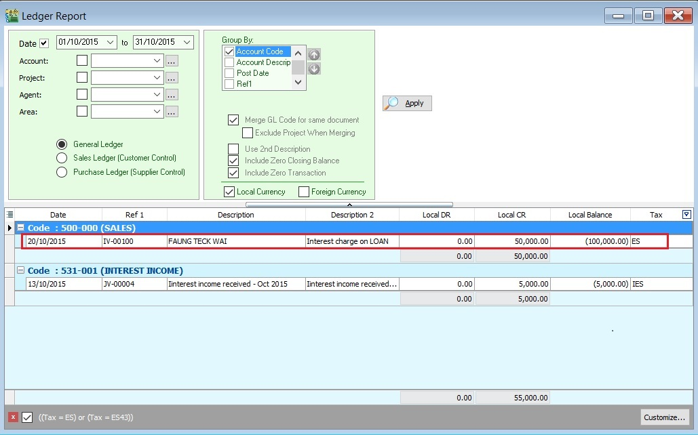
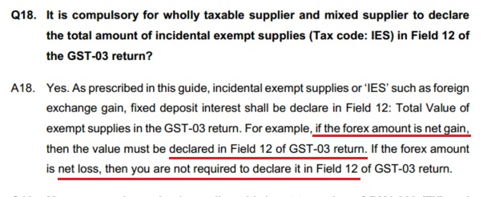
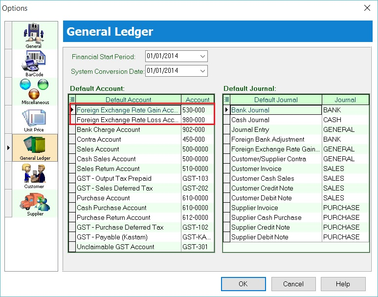

## How to compare the Total Value of Exempt Supplies between GST-03 and Ledger?

This guide will help you to check the data entry source posted for **Item 12 Total Value of Exempt Supplies in GST-03.**

1. **GST Tax Code**

   | Tax Code | Tax Description            | Tax Rate | Explanation and examples                                                                                                                                                                                                                                                      |
   |----------|----------------------------|----------|-------------------------------------------------------------------------------------------------------------------------------------------------------------------------------------------------------------------------------------------------------------------------------|
   | IES      | Incidental Exempt Supplies | 0%       | Incidental exempt supplies under GST legislations (Note: Replace ES43). Incidental Exempt Financial Services Supplies (IEFS) include: 1.interest income from deposits placed with a financial institution in Malaysia, 2.realized foreign exchange gains or losses            |
   | ES       | Exempt Supplies under GST  | 0%       | This refers to supplies which are EXEMPTED UNDER GST. These supply includes: 1.Selling of Residential Properties to consumer, 2.Selling of tickets for Public Transportation (Taxis, Stage Buses, Ferries), 3.Financial Institution’s interest charges to customers for loan. |

2. **GST-03**

   | Item No. | Description                    | Guidelines                             |
   |----------|--------------------------------|----------------------------------------|
   | 12       | Total Value of Exempt Supplies | IES + ES (Taxable Amount)              |
   |          |                                | Note : Net Loss in Forex (ES43) = 0.00 |

### Example of Data Entry

1. IES - **Interest income from deposits placed with a financial institution in Malaysia**

   Screenshot below from **Journal Entry.**

      

2. IES - **Realized foreign exchange gains or losses**

   1. **Realized Gain in Foreign Exchange**

      Screenshot below from **Customer Payment**.

         

   2. **Realized Loss in Foreign Exchange**

      Screenshot below from **Customer Payment.**

         

3. ES - **Financial Institution’s interest charges to customers for loan**

   Screenshot below from **Customer Invoice.**

      

### GST - 03 Item 12 : Total Value of Exempted Supplies

1. For instances, the **GST-03 Item 12 = Rm62.886.40**

   

2. You can check the details by double click on the amount in **Item 12.**
3. Pop-up the item 12 detail.

   

4. You can insert additional column, ie. **From Doc Type** and **Trans Type.**

    a. **From Doc Type** will help you to identify the documents where it posted;
    b. **Trans Type** will tell you the document posted from special case, eg. Realized Gain in Foreign Exchange.

    

:::note **NOTE:**
Trans Type = _X, it means the posting entry related to **Realized Gain or Loss in Foreign Exchange.**
:::

### Cross Check Reports (CCR)

#### GST Listing (CCR)

1. Select the **date range** or **GST Process**.
2. You can select the tax parameter for **ES** and **IES**.
3. Apply the **GST Listing**.

   

   | Tax Code | Local Amount  | Explanation                                                                                          |
   |----------|---------------|------------------------------------------------------------------------------------------------------|
   | IES      | 5,000.00      | Local amount from Sales/Customer/Journal Entry/Cash Book (OR) documents related to tax code: **IES** |
   | IES      | 7,886.40      | Net realized forex gain calculated                                                                   |
   | ES       | 50,000.00     | Local amount from Sales/Customer/Journal Entry/Cash Book (OR) documents related to tax code: **ES**  |
   | **Total**| **62,886.40** | Total value shown in **GST-03 Item 12**                                                              |

4. Click on each tax type, you able to view the details. See the example in the screenshot below.

***1. IES***

   

***2. IES (Net Realized Forex Gain ONLY)***

   

***3. ES***

   

***GL Ledger***

1. In the General Ledger report, you have to insert the **Tax** grid column.
2. Filter the Tax Code **(ES and IES)**.

   

3. Transactions related to **ES**. See the screenshot below.

   

4. Transactions related to **IES**. See the screenshot below.

   

***Special Posting for Net Realized Gain Forex (IES)***

Below question and answer extract from **GUIDE ACCOUNTING SOFTWARE ENHANCEMENT TOWARDS GST COMPLIANCE.**

   

1. Check the Foreign Exchange Rate Gain or Loss Account setting at **Tools | Options...(General Ledger)**. For example,

   | Default Account                     | GL Account Code |
   |------------------------------------ |-----------------|
   | Foreign Exchange Rate Gain Account  | 530-000         |
   | Foreign Exchange Rate Loss Account  | 980-000         |

   

2. Select the **Foreign Exchange Rate Gain or Loss Account**, click **APPLY**

   

3. You can see the **Foreign Exchange Rate Gain or Loss** posting transactions in **GL Ledger**.

   

   | Account                        | Local DR | Local CR | Explanation                                         |
   |--------------------------------|----------|----------|-----------------------------------------------------|
   | Total Gain on Foreign Exchange | 0.00     | 8,480.00 |                                                     |
   | Total Loss on Foreign Exchange | 593.60   | 0.00     |                                                     |
   | Net Realized Forex             | 593.60   | 8,480.00 | 8,480.00 - 593.60 = 7,886.40 GAIN (IES)             |

:::note **NOTE:**
RMCD has confirmed that **Net Realised Gain in Forex ONLY** need to add into **GST-03 item 12 Total Value of Exempt Supplies.**
Tax code = **IES**

**Net Realised Loss in Forex** will be **NIL.**

### Summary : Comparison between GST-03, GST Listing and Ledger Report

Here is the result summarized:

| Description                 | GST-03   | GST Listing | Ledger Report                 |
|-----------------------------|----------|------------ |-------------------------------|
| IES                         |          | 5,000.00    | 5,000.00                      |
| IES (Realized Gain Forex)   |          | 7,886.40    |Forex Gain = 8,480.00          |
|                             |          |             |Forex Loss = -593.60           |
|                             |          |             | **Net Forex Gain = 7,886.40** |
| ES                          |          | 50,000.00   | 50,000.00                     |
| Total Item 12 (ES + IES)    | 62,886.40| 62,886.40   | 62,886.40                     |
