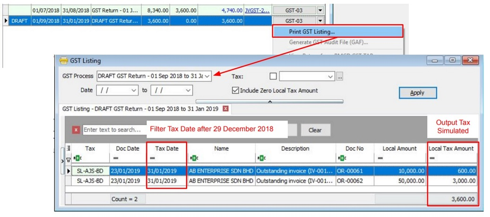
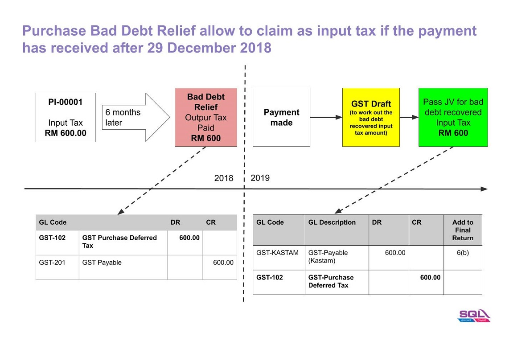

## GST Sales/Purchase Deferred Tax Journal Adjustment

1. Double entry adjustment for the balance of GST Sales / Purchase Deferred Tax (Bad Debt Relief) AFTER 29 December 2018.
2. Add the adjustment amount into Final GST Return (amendment).

   

### How to check the Sales / Purchase Bad Debt Recovered Amount after Final GST Returns?

1. Select a date **AFTER** the Final GST Return Date, eg. 28/02/2019.

   

2. Choose **Process As Draft**.

   

3. Click on **GST Return Draft** and **Print GST Listing**.
4. Filter the **Tax Date** (ie. greater than or equal to 30 December 2018).

   

   > **SL-AJS-BD** : Sales Bad Debt Recovered (Output Tax).
   > **PH-AJP-BD** : Purchase Bad Debt Recovered (Input Tax).

### Adjustment for GST Sales Deferred Tax (SL-AJS-BD)

1. Based on the **GST Listing (Draft)**, post the GST Bad Debt Recovered double entry using **Journal Entry**.

   | GL Code    | GL Description            | Local DR | Local CR | Add to Final GST-03  |
   |------------|---------------------------|----------|----------|----------------------|
   | GST-202    | GST - Sales Deferred Tax  | 3,600    |          |                      |
   | GST-KASTAM | GST - Payable (KASTAM)    |          | 3,600    | 5(b), 18             |

2. Amend the Final GST Return (Aug 2018) at TAP.
3. Add the amount into
    a. 5(b)
    b. 18

### Adjustment for GST Purchase Deferred Tax (PH-AJP-BD)

1. Based on the **GST Listing (Draft)**, post the GST Bad Debt Recovered double entry using **Journal Entry**.

   | GL Code     | GL Description              | Local DR | Local CR | Add to Final GST-03  |
   |-------------|-----------------------------|----------|----------|----------------------|
   | GST-KASTAM  | GST - Payable (KASTAM)      | 600      |          | 6(b)                 |
   | GST-102     | GST - Purchase Deferred Tax |          | 600      |                      |

2. Amend the Final GST Return (Aug 2018) at TAP.
3. Add the amount into
    a. 6(b)

### Payment to RMCD (Tax Journal Adjustment)

Made payment to RMCD, use **Cash Book Entry (PV)**.

| GL Code    | GL Description                        | Local DR | Local CR |
|------------|---------------------------------------|----------|----------|
| GST-KASTAM | GST - Payable (KASTAM) - Net Balance  | 3,000    |          |
| BANK       | Bank Name                             |          | 3,000    |
