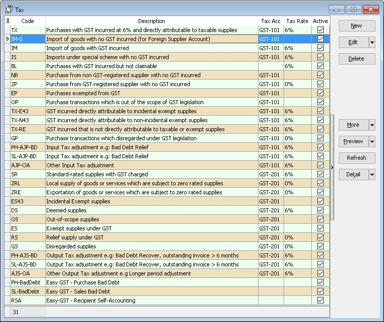
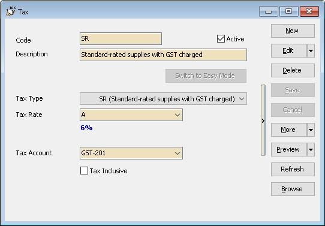
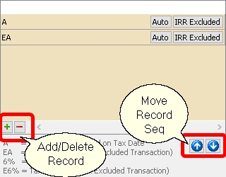
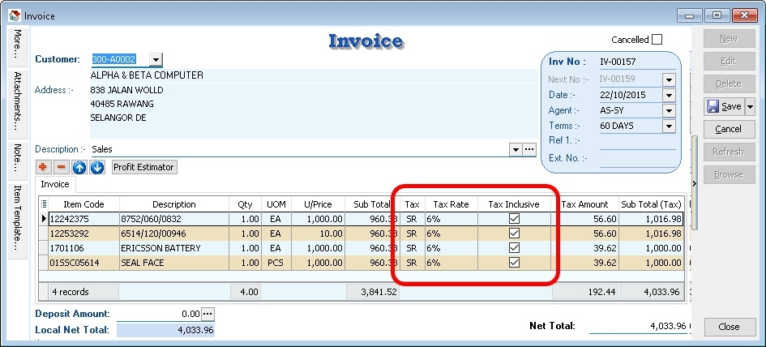

- This to Maintain all the available tax given by Government or user can self add or modified

## Create New Tax

- Screenshot below is the Maintain Tax entry form.

| **Field Name**   | **Explanation & Properties**                                                                                            |
|------------------|-------------------------------------------------------------------------------------------------------------------------|
| Code             | Enter the tax code to be shown in report.                                                                               |
| Active           | - Checked: Active & able to select from the Tax List in data entry.                                                     |
|                  | - UnChecked: InActive & unable to select from the Tax List in data entry.                                               |
| Description      | Enter the tax description.                                                                                              |
| Tax Type         | Select the Tax Type for the Tax Code to be created.                                                                     |
| Tax Rate         | User can self-determine the rate or set Auto:                                                                           |
|                  | - **A**: Auto Tax Rate. System will auto change to new rate if there is update in GST Rate (must update SQL Accounting).|
|                  | - **E**: Excluded from IRR calculation (useful for OS Tax Code & Mixed Supplies Industry).                              |
|                  | - **EA**: Combination of A & E.                                                                                         |
|                  | - **6%**: User-defined fixed rate (e.g., 6%).                                                                           |
|                  | - **E6%**: Fixed rate excluded from IRR calculation.                                                                    |
|                  | Default 1st row is the Default selection in data entry.                                                                 |
| Tax Account      | Select an appropriate GL Account from Maintain Account.                                                                 |
| Tax Inclusive    | - Checked: Default is Tax Inclusive.                                                                                    |
|                  | - UnChecked: Default is Tax Exclusive.                                                                                  |

## Use of Tax

- You can set the tax as default at the following
        1. GL | Maintain Account...
        2. Customer | Maintain Customer... | Tax
        3. Supplier | Maintain Supplier... | Tax
        4. Stock | Maintain Stock Item... | Output Tax/Input Tax
        5. Tools | Options | Customer | Default Output Tax
        6. Tools | Options | Supplier | Default Input Tax
- Therefore, item inserted will be automatically calculate the tax amount based on the subtotal. See below screenshot.

## Default System Tax Seq

Default System Tax Seq are as follow

***For Sales & Purchase***

1) Maintain Customer/Supplier
2) Maintain Item Code
3) Tools | Options | Customer/Supplier => For Version 836.761 & below
4) Maintain Tax with IsDefault is Tick => For Version 837.762 & above

***For AR & AP***

1) Maintain Customer/Supplier
2) Maintain Account
3) Tools | Options | Customer/Supplier => For Version 836.761 & below
4) Maintain Tax with IsDefault is Tick => For Version 837.762 & above

***For GL***

1) Maintain Account
