## GST Margin Scheme

How To Start the New Margin Scheme with Special Database?

GST is normally due on the full value of goods sold. The margin scheme allows a GST Margin Scheme registered person (GST MS registered person) who meets all the conditions to calculate and charge GST on the margin i.e. the difference between the price at which the goods were obtained and the selling price. If no margin is made (because the purchase price exceeds the selling price) then no GST is charged and payable.

For the purpose of GST, margin under this scheme means the difference between selling price and purchase price. If there is any value being added to the eligible goods such as cost for repairing, this cost is part of the margin other than profit. In other words, the value added must be included in the selling price and not the purchase price.

Therefore, we have designed a database structure specially for business which has margin scheme involvement.

### Modules Require

1. SQL Accounting Basic (GST compliance)
2. DIY field
3. DIY script
4. Project (use to record Car Plate number)

See below the overview of Margin Scheme process flow:

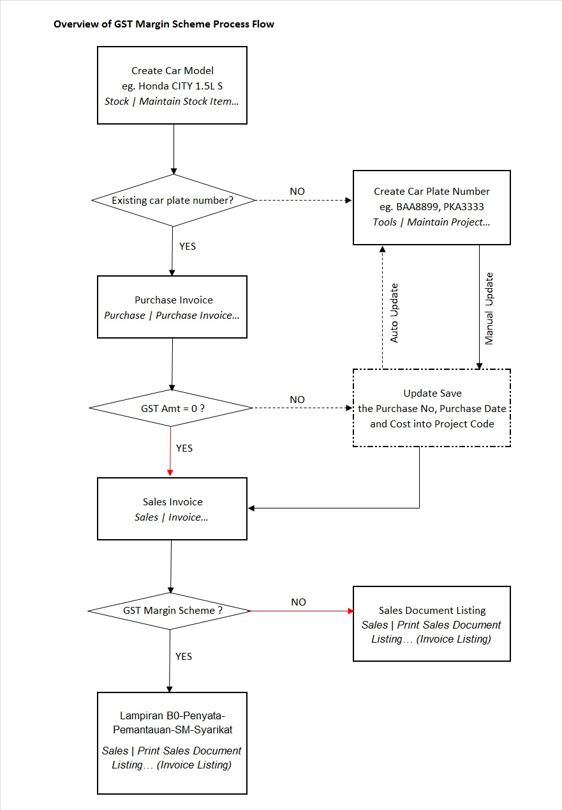

### Setup Margin Scheme Database

1. Get the NEW database structure for Margin Scheme (in backup format) from this link [NEW COMPANY (For Margin Scheme)](http://www.sql.com.my/document/NEW%20COMPANY%20(For%20Margin%20Scheme)%20-%20%5bGST-MS.09.11.2016%5d%20-%202016-11-10%20-%20sqlacc.zip)
2. Restore this backup.
3. Enter the user ID and password with “ADMIN” to login.

#### History New/Updates/Changes

***Last Customization Update : 27 Nov 2015***

- Move Cars Information to Maintain Project
- Auto Capture Initial Cost on Select Project

***Last Customization Update : 20 Feb 2016***

- Empty item code (eg. repairs) will not update the Project - Purchase Details.
- Run the **SQL Accounting Diagnosis - DB Patch** and apply the patch files can be download from [Patch-Margin Scheme-20160220.zip](http://www.sql.com.my/downloadfile/Fairy/Patch-MarginScheme-20160220.zip)

    1. Select the database file (eg.ACC-XXXXX.FDB).
    2. Drag the patch filename **Patch-MarginScheme1**.
    3. Click **Execute**.
    4. Repeat step 2 - 3 and apply with another patch filename **Patch-MarginScheme-02-20160220**.

***Last Customization Update : 08 Mar 2016***

- Tax amount not equal to zero. Will prompt message "Cost will be tax excluded for GST Margin purpose" after save the purchase invoice.
- Run the **SQL Accounting Diagnosis - DB Patch** and apply the patch files can be download from [Patch-MarginScheme-20160308.zip](http://www.sql.com.my/document/Patch-MarginScheme-20160308.zip)

    1. Select the database file (eg.ACC-XXXXX.FDB).
    2. Unzip the patch file downloaded.
    3. Drag the patch filename **DELETE_PHPI_OnAfterSave_08.03.2016**.
    4. Click **Execute**.
    5. Repeat step 2 - 4 and apply with another patch filename **UPDATE_PHPI_OnAfterSave_08.03.2016**.

***Last Customization Update : 08 Aug 2016***

- To remove the compulsory action to select project code other than **Default Project (----)**.
- Run the **SQL Accounting Diagnosis - DB Patch** and apply the patch files can be download from [This Link here](http://www.sql.com.my/document/Patch-MarginScheme-20160808.zip)

    1. Select the database file (eg.ACC-XXXXX.FDB).
    2. Unzip the patch file downloaded.
    3. Drag the patch filename **DELETE_SLIV_OnBeforerSave_2016.08.08**.
    4. Click **Execute**.

***Last Customization Update : 13 Sep 2016***

- Margin Scheme options added in Maintain Project. It is allowed to determine the car sold using GST margin scheme or GST standard calculation.
- Run the **SQL Accounting Diagnosis - DB Patch** and apply the patch files can be download from [This Link here](http://www.sql.com.my/document/Patch-MarginScheme-20160913.zip)

    1. Select the database file (eg.ACC-XXXXX.FDB).
    2. Unzip the patch file downloaded.
    3. Drag the patch filename **DELETE_SLIV_OnGridColValChg_2016.09.13**.
    4. Click **Execute**.
    5. Repeat step 2 - 4 and apply with another patch filename **INSERT_SLIV_OnGridColValChg_2016.09.13**.

- Add new field name **MS** in Maintain Project.

   1. Go to Tools | DIY | SQL Control Center...
   2. Browse to Business Objects | Miscellaneous | **Project** | Project Fields

      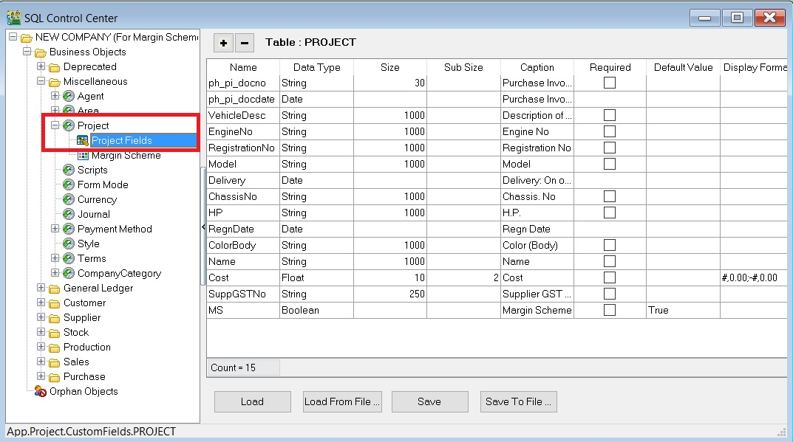

   3. Add new field name **MS** and the Data Type, Size, Sub Size, Caption, etc must follow the screenshot below. Click to Save button.

      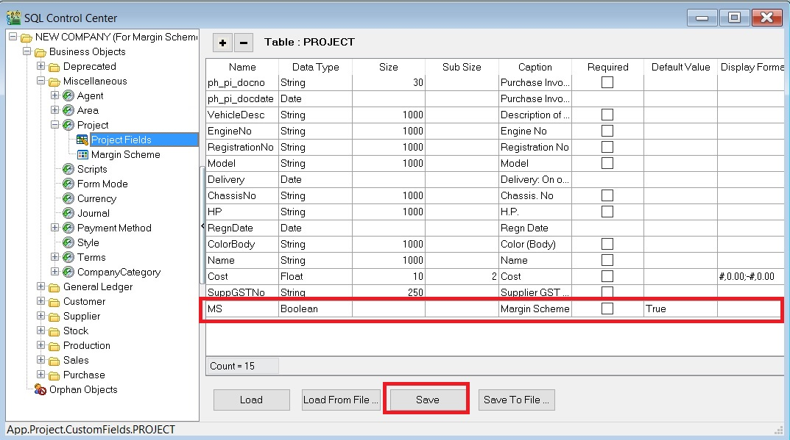

   4. Next, click on the existing **Margin Scheme** form. See the screenshot below.

      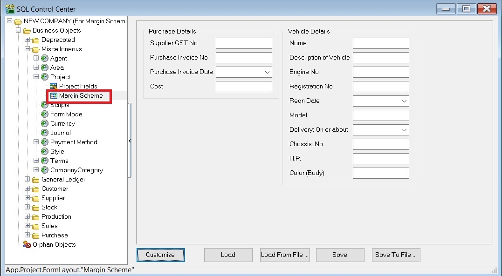

   5. Click on **Customize** button.

      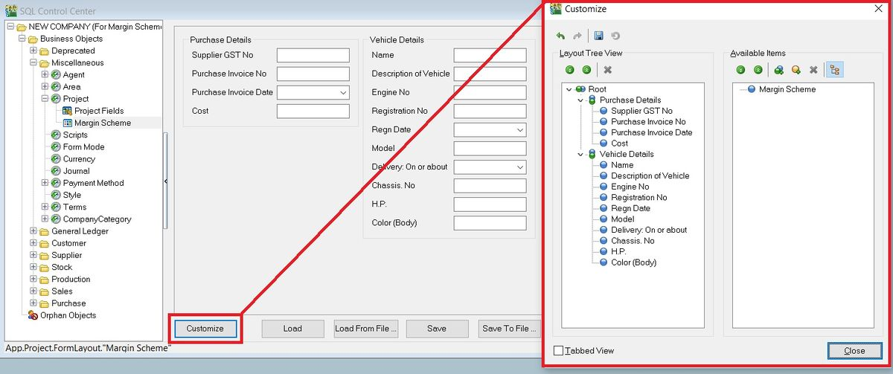

   6. Drag the **Margin Scheme** from Available Item list and drop under Purchase Details. See screenshot below.

      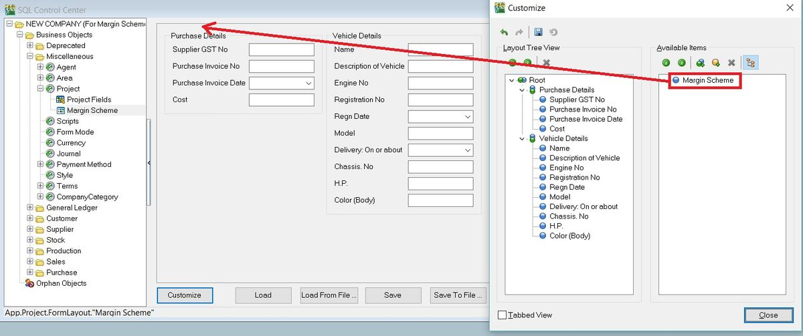

   7. Lastly, click to Save button.

      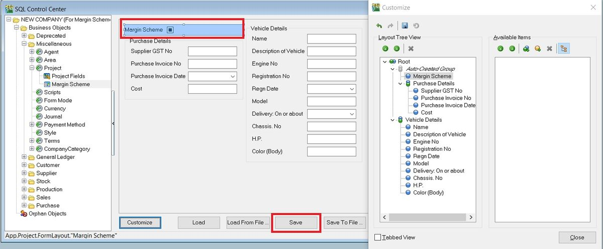

:::note NOTE:

Patch files are applicable to old margin scheme database.

:::

***Last Customization Update : 09 Nov 2016***

- Added **Stock Book Number** into Maintain Project. It will auto update project **Stock Book Number** key-in at purchase invoice **Ext. No**.
- **Fixed the bug update project from Purchase Invoice on the First line only**.
- Run the **SQL Accounting Diagnosis - DB Patch** and apply the patch files can be download from [This Link Here](http://www.sql.com.my/document/Patch-MarginScheme-20161109.zip)

    1. Select the database file (eg.ACC-XXXXX.FDB).
    2. Unzip the patch file downloaded.
    3. Drag the patch filename **DELETE_PHPI_OnAfterSave_2016.11.09**.
    4. Click **Execute**.
    5. Repeat step 2 - 4 and apply with another patch filename **INSERT_PHPI_OnAfterSave_2016.11.09**.

- Add new field name **StkBookNo** in Maintain Project.

     1. Go to Tools | DIY | SQL Control Center...
     2. Browse to Business Objects | Miscellaneous | **Project** | Project Fields

        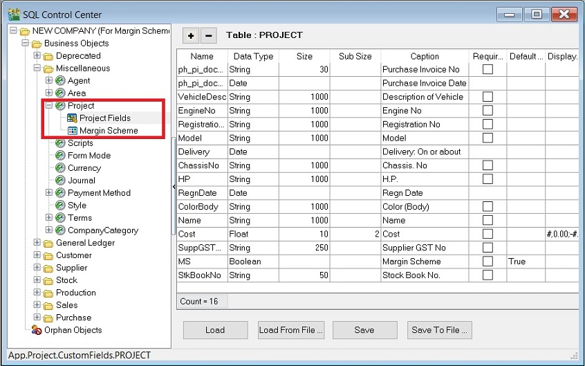

     3. Add new field name **StkBookNo** and the Data Type, Size, Sub Size, Caption, etc **must follow the screenshot below**. Click to Save button.

        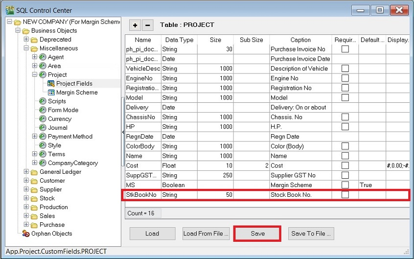

     4. Next, click on the existing **Margin Scheme** form. See the screenshot below.

        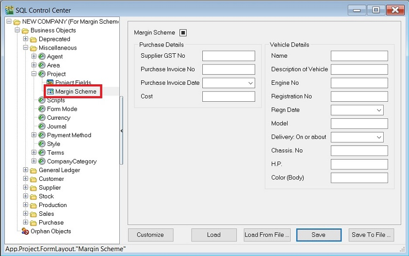

     5. Click on **Customize** button.

        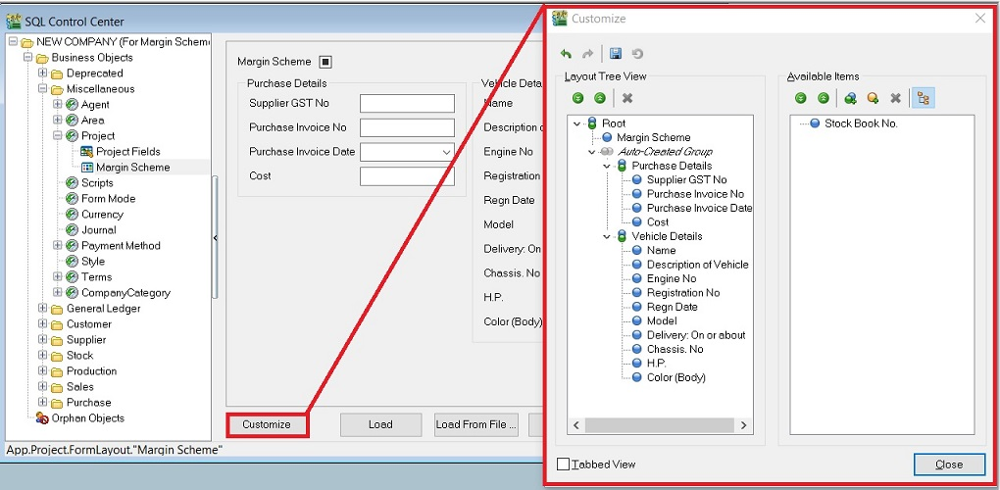

     6. Drag the **Stock Book No** from Available Item list and drop under Purchase Details. See screenshot below.

        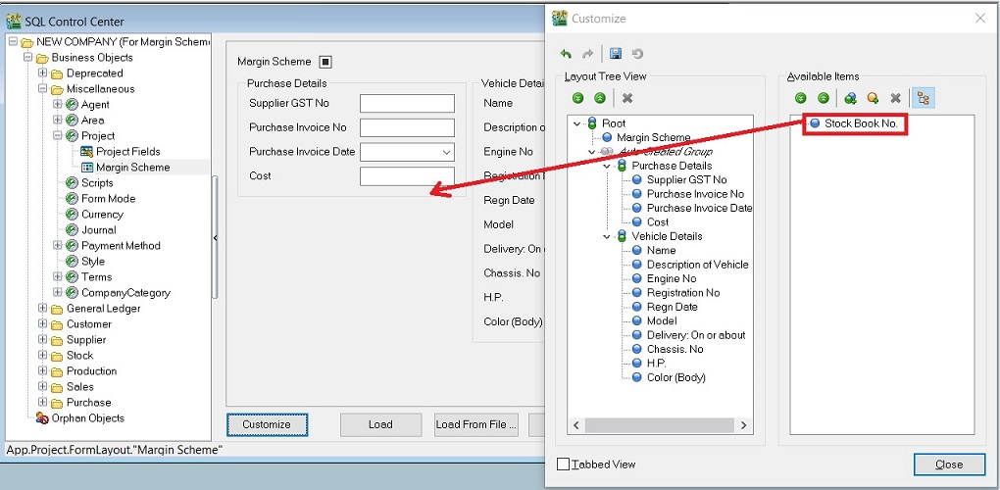

     7. Lastly, click to Save button.

        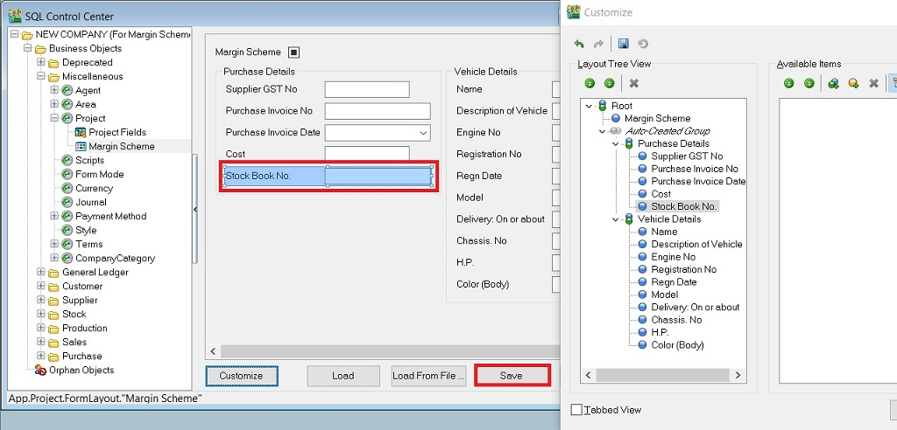

:::note NOTE:
Patch files are applicable to old margin scheme database.
:::

### Setup Master Data (SMD)

#### Maintain Customer (SMD)

1. Create new buyer name (eg. company name or person name).
2. Click on Tax tab to input the GST No (if applicable).

   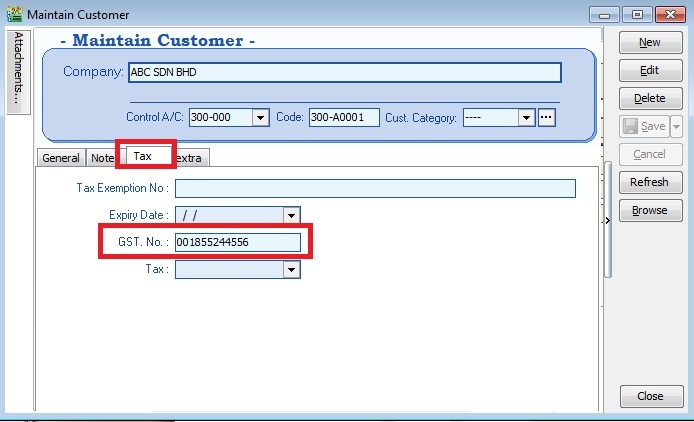

3. Click on extra tab. You can enter the road tax, inspection and insurance reminder date for reference.

   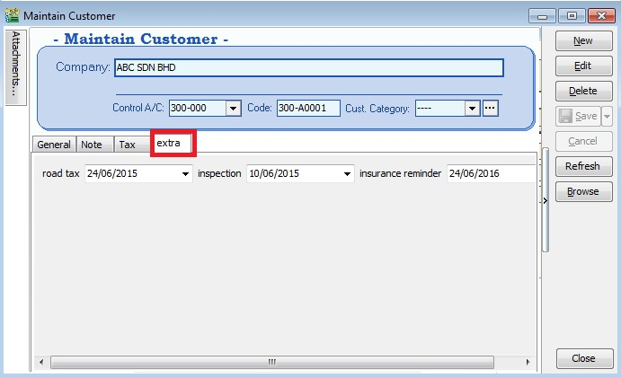

#### Maintain Supplier (SMD)

1. Create new seller name (eg. company name or person name).
2. Click on Tax tab to input the GST No (if applicable).

   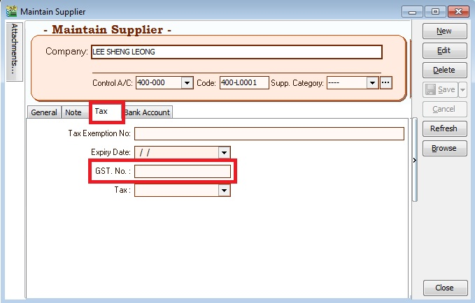

#### Maintain Stock Item (SMD)

1. Create the car model at Maintain Stock Item. For example, TOYOTA VIOS 1.5G(AT)
2. Click on Vehicle tab to define this item is a "Vehicle".

   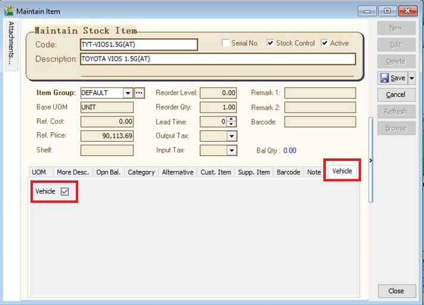

#### Maintain Project (SMD)

1. Create the second car plate number in Maintain Project.
2. Update the Vehicle detail.

   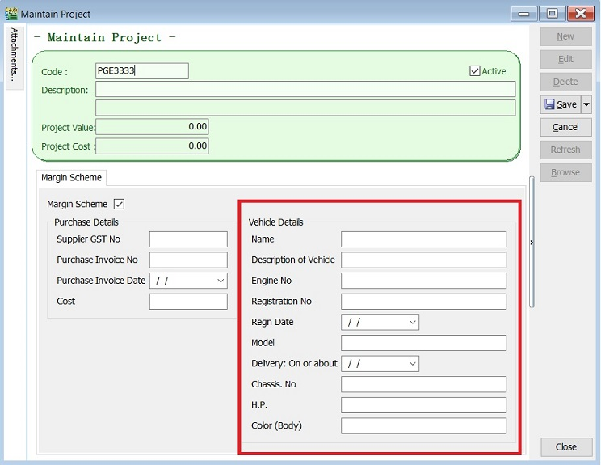

3. Tick on **Margin Scheme** if it is a second hand car plate number.

   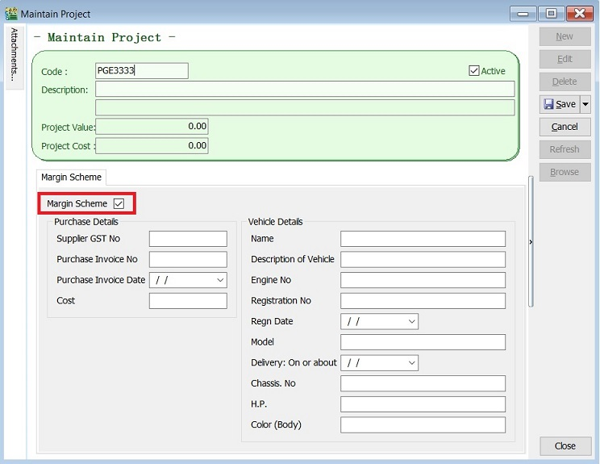

4. Leave BLANK to Purchase Invoice Date, Purchase Invoice No and Cost. It will auto update when you are select the project code and save at the Purchase Invoice.

   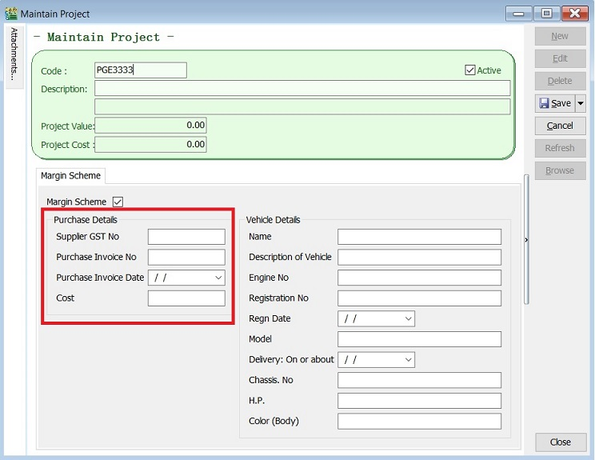

### Record Purchase of Second Hand Car Value

1. Enter the purchase value of second car at Purchase Invoice. (eg. RM30,000 )
2. You must select the correct car plate number from Project. (eg. PGE3333, AAA9999)
3. Supplier GST No, Purchase invoice number, date and cost will be updated automatically after you have save the purchase invoice.

   | Project: Purchase Detail | Update from                    |
   |--------------------------|--------------------------------|
   | Supplier GST No          | Maintain Supplier (GST No)     |
   | Purchase Invoice No      | Purchase Invoice (Doc No)      |
   | Purchase Invoice Date    | Purchase Invoice (Doc Date)    |
   | Cost                     | Purchase Invoice (Unit Price)  |
   | Stock Book No.           | Purchase Invoice (Ext No)      |

   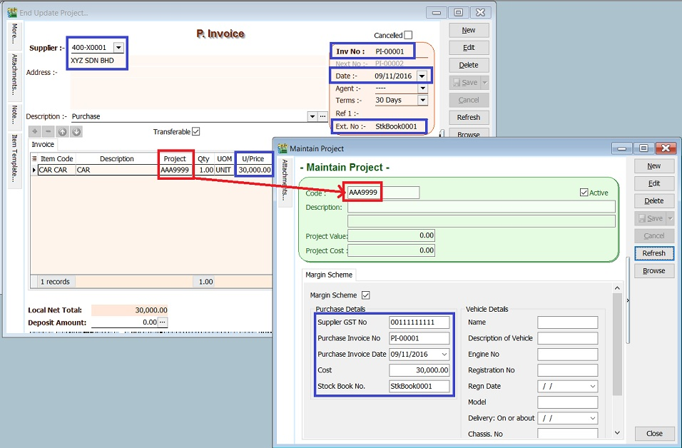

:::note NOTE :

1. This information is required to show in Lampiran 07 - Monthly Report for Relief for Secondhand Goods or Margin Scheme (MS).

2. Auto update to project purchase detail (Purchase No, Purchase Date and Cost) if tax amount is zero.

:::

### Record Sale of Second Hand Car Value

#### Margin Scheme Input

1. Enter the sale value of second car at Invoice. (eg.RM90,113.69)
2. You must select the correct car plate number from Project.(eg.PGE3333)
3. Initial Purchase Cost will auto upadate after select the project (car plate number).
4. Tax amount will be calculated based on Margin Scheme method.(See screenshot below)

   1. Sellng Price = 90,113.69
   2. Purchase Cost = 30,000.00
   3. Margin = 90,113.69 – 30,000.00 = 60,113.69
   4. Tax amount = 60,113.69 x 6/106 = 3,402.66

   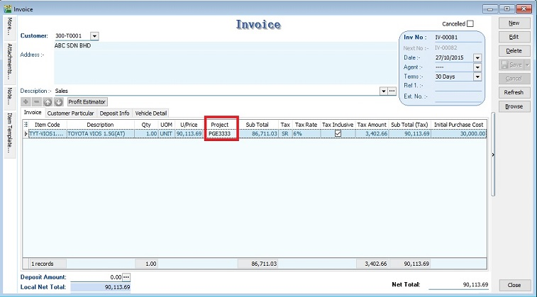

5. Invoice no, invoice date, selling price, margin, and margin tax amount will be shown in Lampiran 07 -Monthly Report for Relief for Secondhand Goods or Margin Scheme (MS)

#### Other Information

1. Customer Particular tab.

   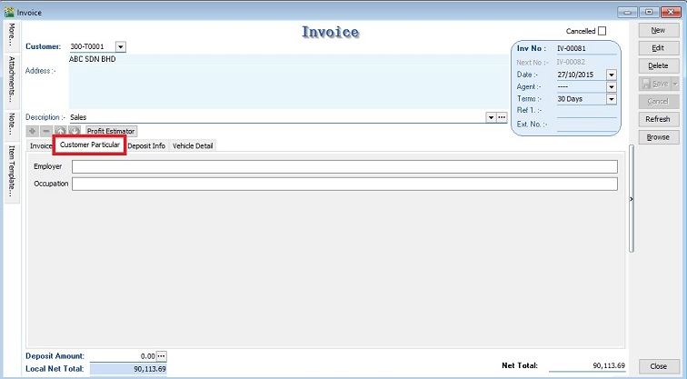

2. Deposit Info (For record purpose, no posting to account).

   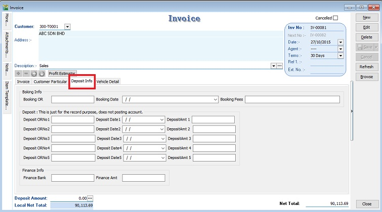

3. Vehichle Detail (Auto retrieve from Vehicle Detail in Maintain Project).

   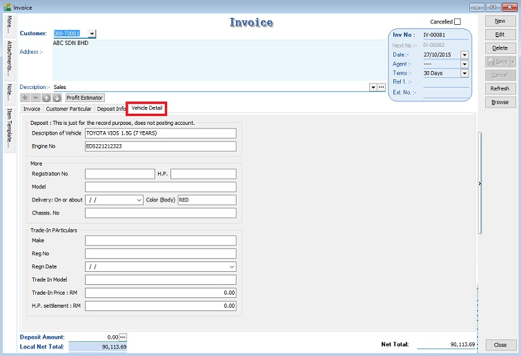

### Print for Lampiran 07 (Lampiran B0-Penyata-Pemantauan-SM-Syarikat)

For report printing [refer to this link.](../../usage/gst/gst-report.md#margin-scheme)
