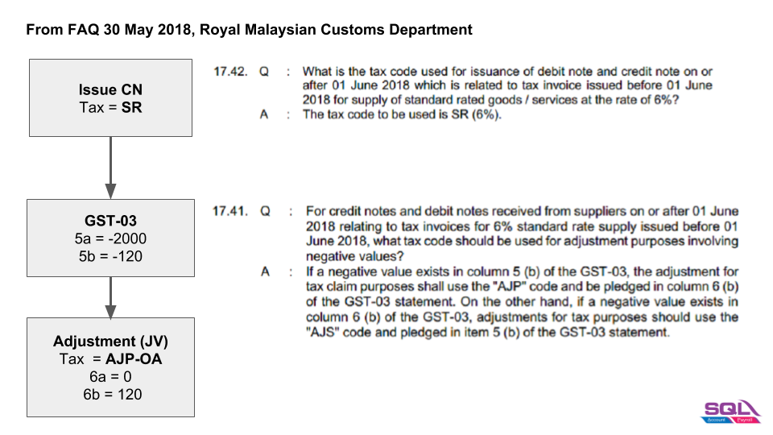
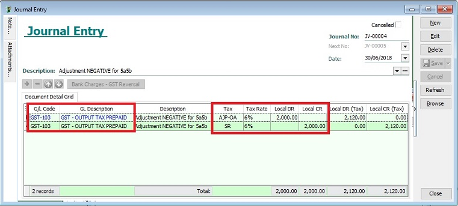

## Adjustment to negative value in GST-03

1. Negative value in 5a5b and 6a6b.
2. TAP system not accept negative value.

### Negative in 5a5b

1. **Output Tax (Negative)**

   | GST-03 | Value  |
   |--------|--------|
   | 5a     | -2,000 |
   | 5b     | -120   |

2. **Journal Adjustment:**

   | GL Code  | Tax      | Tax Rate | Local DR | Local CR | Local DR(Tax) | Local CR(Tax) | GST-03               |
   |----------|----------|----------|----------|----------|---------------|---------------|----------------------|
   | GST-103  |**AJP-OA**| 6%       | 2,000    |          | 2,120         |               | **6a = 0, 6b = 120** |
   | GST-103  | **SR**   | 6%       |          | 2,000    |               | 2,120         | **5a = 0, 5b = 0**   |

   

### Negative in 6a6b

1. **Input Tax (Negative)**

   | Items | Value  |
   |-------|--------|
   | 6a    | -1,000 |
   | 6b    | -60    |

2. **Journal Adjustment:**

   | GL Code  | Tax      | Tax Rate | Local DR | Local CR | Local DR(Tax) | Local CR(Tax) | GST-03              |
   |----------|----------|----------|----------|----------|---------------|---------------|---------------------|
   | GST-103  | **TX**   | **6%**   | 1,000    |          | 1,060         |               | **6a = 0, 6b = 0**  |
   | GST-103  |**AJS-OA**| **6%**   |          | 1,000    |               | 1,060         | **5a = 0, 5b = 60** |
