## Print GST Listing

To generate a summary and details of the GST transactions after process the GST Returns. It is easy to cross check against with GST-03.

### GST Listing

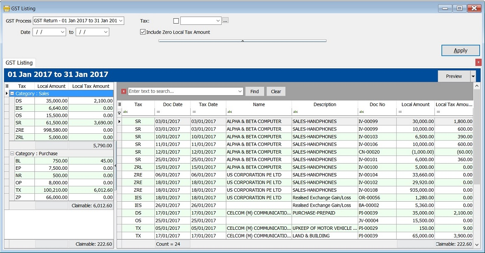

#### GST Listing - Parameter

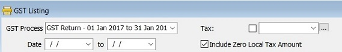

| Parameter                     | Type    | Explanation                                            |
|-------------------------------|---------|--------------------------------------------------------|
| GST Process                   | Lookup  | To select the GST Process period.                      |
| Date                          | Date    | To range the date to retrieve the data after apply it. |
| Tax                           | Lookup  | To select the tax code.                                |
| Include Zero Local Tax Amount | Boolean | To show the zero local tax amount.                     |

#### GST Listing - Summary

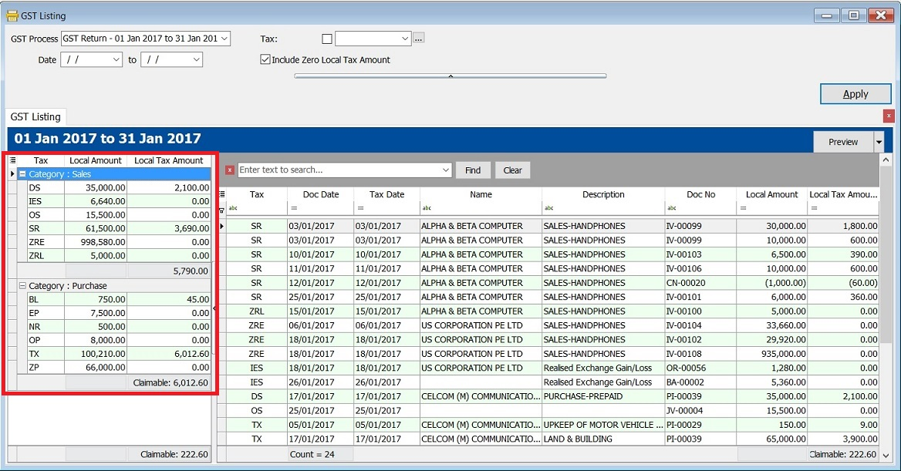

1. **Double click** on the tax code (eg. SR) in the Summary.
2. It will auto filter the GST transactions by tax code (SR) in the Details.

   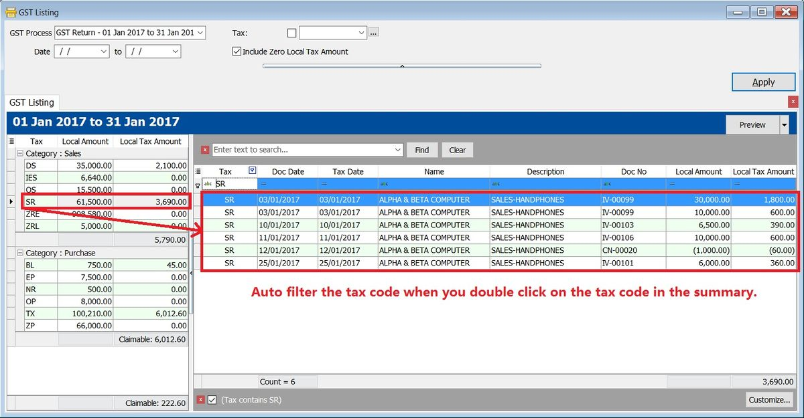

3. **Deselect** the tax code (SR), click on the X button. See the screenshot below.

   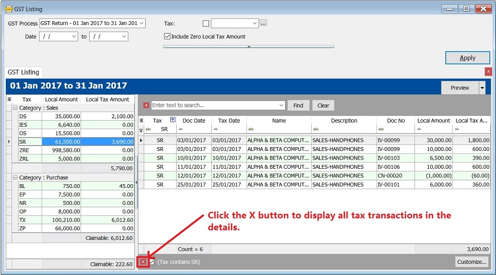

#### GST Listing - Detail

   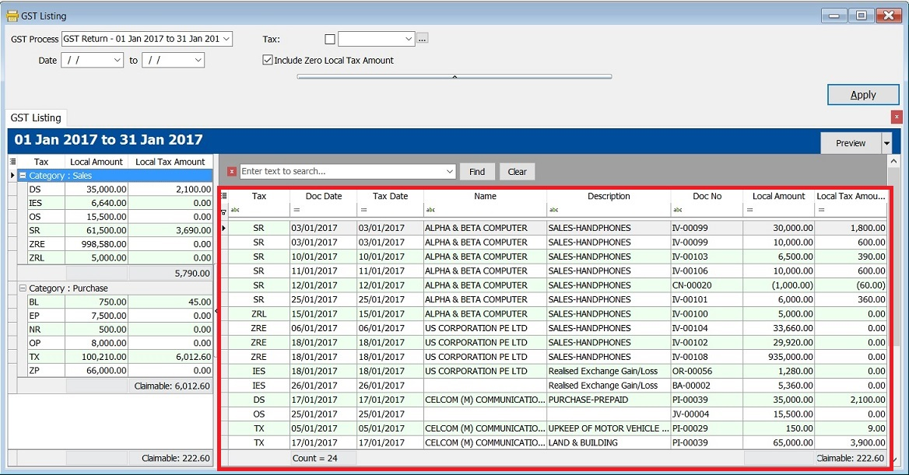

1. **Find Panel** is very useful to search in any columns by the keywords entered by you.

   

2. It helps to search the transactions contain the keywords, eg. **"UPKEEP"**, **"TX"** or **"ZP"**. You just need to enter the keywords directly with a space in between each keywords. See the screenshot below.

   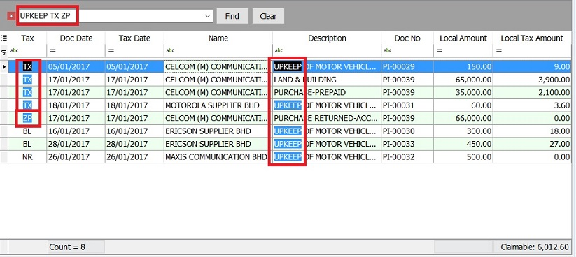

### Find Panel Helper

1. With this function, you can easily narrow down the search to identify the errors before the GST Returns submission.
2. Let say I wish to find the word **UPKEEP**.
3. Type the **UPKEEP** in the find panel.

   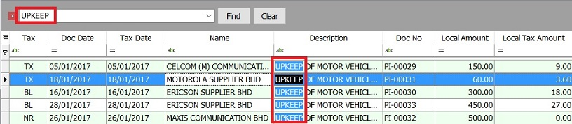

4. If you want to **exclude** the **BL** tax code, then you have to enter as **UPKEEP -BL** in the find panel.

   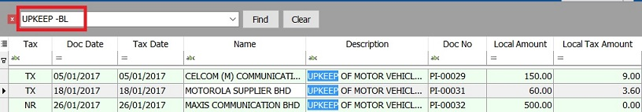

**Explanation of Extended Search Syntax :**

| Example Search Syntax | Filter Operator | Explanation                                                                                            |
|-----------------------|-----------------|--------------------------------------------------------------------------------------------------------|
| apple pineapple mango | OR              | Any transaction lines containing apple, pineapple, OR mango will be searched.                          |
| apple +pineapple      | AND             | Transaction lines with a combination of apple AND pineapple will be searched.                          |
| apple -mango          | EXCLUDE         | Transaction lines with the word apple but EXCLUDE mango. Result: apple and pineapple will be searched. |
| "pineapple apple"     | EXACT WORD      | Search for the exact words "pineapple apple".                                                          |

:::note NOTE:

Spacing is very important to make your search more accurate.

:::

### Reports

1. Click on **Preview**.
2. Select a report to preview or print or export.

   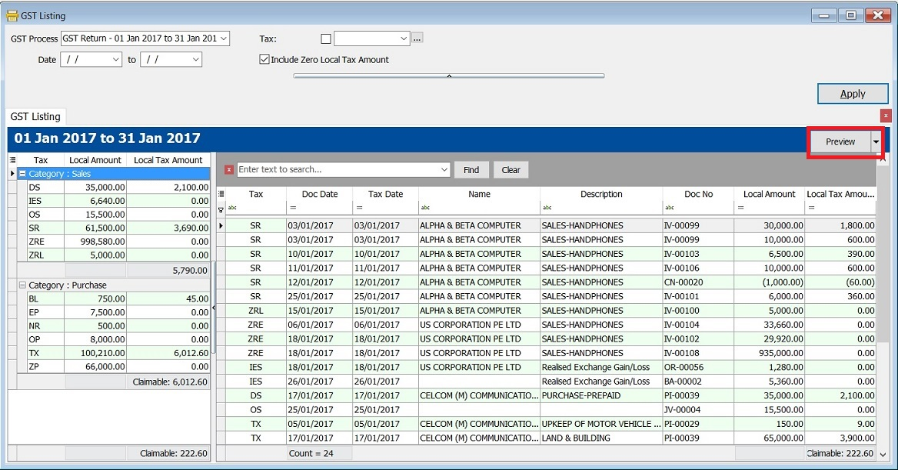

   | No. | Report Name                                                                  | Purpose                                                                                      |
   |-----|------------------------------------------------------------------------------|----------------------------------------------------------------------------------------------|
   | 01  | GST Detail 1                                                                 | To show the document description in GST Listing.                                             |
   | 02  | GST Detail 2                                                                 | To show the document item details description in GST Listing.                                |
   | 03  | GST Detail 3 - GST F5-(SG)                                                   | For Singapore GST, to show the GST-03 details in GST Listing.                                |
   | 04  | GST Detail 3 - GST-03                                                        | For Malaysia GST, to show the GST-03 details in GST Listing.                                 |
   | 05  | GST Detail 4 - Mixed Supplies                                                | Applicable to Mixed Supplies. To show the calculations for DmR and Longer Period Adjustment. |
   | 06  | GST Lampiran 2                                                               | GST detail listing for standard rated. It is upon request by RMCD.                           |
   | 07  | GST Lampiran 2-with ZR                                                       | Another GST detail listing for the standard rated and zero rated separately.                 |
   | 08  | GST Lampiran 4-Ringkasan Maklumat Permohanan Tuntutan Pelepasan Hutang Lapuk | Lampiran 4 as requested by Kastam Officer.                                                   |
   | 09  | GST Listing - Yearly GST Analysis                                            | To analyze the yearly tax amount and taxable amount.                                         |
   | 10  | GST Summary Sheet - MY                                                       | GST Summary Sheet format.                                                                    |
   | 11  | GST-Lampiran B-0 PT GST Bil 2B (ATS) (IS)                                    | A special GST detail listing for Approved Trader Scheme (Refer to GST-03 item 14 & 15).      |
   | 12  | GST-Penyata Eksport (ZRE)                                                    | A special GST detail listing for Zero Rated Export supply (Refer to GST-03 item 11).         |
   | 13  | GST-Penyata Pembekalan Dikecualikan (ES & IES)                               | A special GST detail listing for Exempted Supplies (Refer to GST-03 item 12).                |
   | 14  | GST-Penyata Pembekalan Tempatan Berkadar Sifar (ZRL)                         | A special GST detail listing for Zero Rated Local supply (Refer to GST-03 item 10).          |

   :::note NOTE:

   From Doc Types in GST Listing Detail are consists of:

   1. _A = Un-claimable Non-Incidental Exempt Supplies (TX-N43)
   2. _B = Un-claimable TX-RE
   3. _C = Annual Adjustment Non-Incidental Exempt Supplies (TX-N43)
   4. _D = Annual Adjustment TX-RE
   5. _X = Realized Gain Loss

   :::

### Pivot Table

1. Right click on any of the grid columns.
2. From the menu, select **Pivot Table**.

   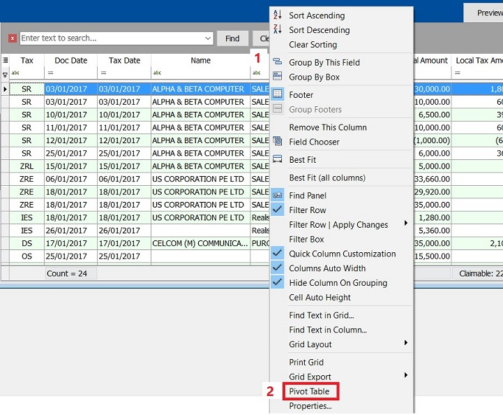

3. At Pivot Table, there are 3 sections as below:

   a. **Data Fields** – Data field will auto inserted when you launch the pivot table.

   b. **Row Fields** – To structure the grouping for Rows.

   c. **Column Fields** – To structure the grouping for Columns.

   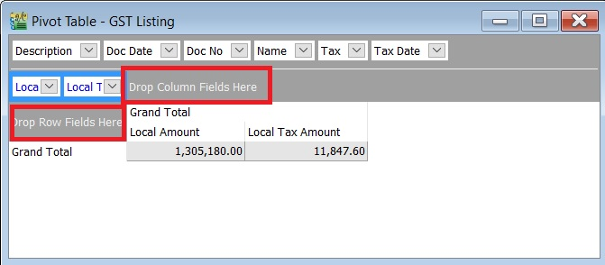

4. Use the grid columns to structure the pivot format. See the screenshot below.

   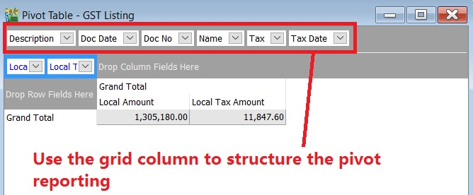

5. Drag the grid column into Row fields or Column fields.

   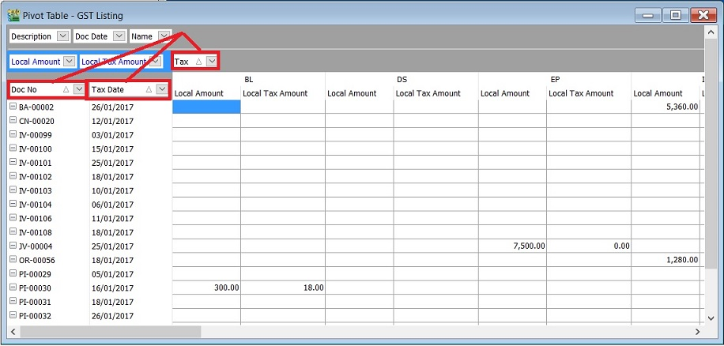

:::note Hint 1:

1. Right click on the **Row Field**
2. Select **Expand All**.
 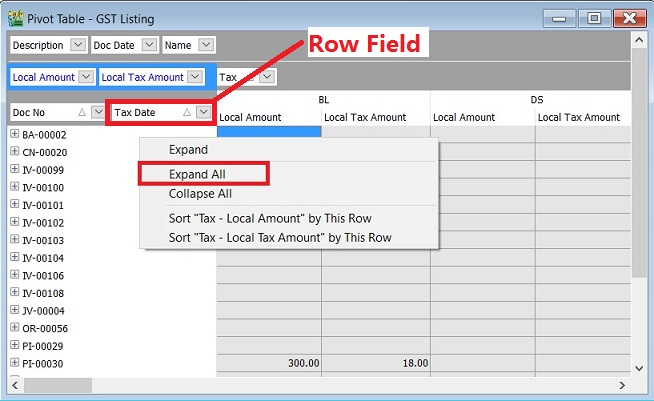

:::

:::note Hint 2:

1. Right click on the grey area.
2. A small menu pop out.

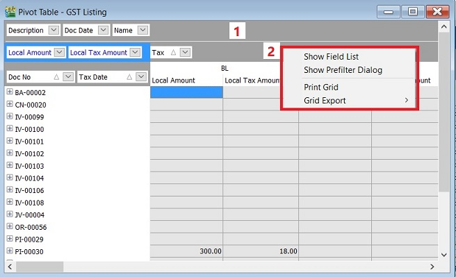

   1. **Show Field List** - Not really use to it.
   2. **Show Pre-filter Dialog** - Insert filter conditions.
   3. **Print Grid** - To print the grid.
   4. **Grid Export** - To export the grid data into EXCEL, TEXT, HTML and XML.

:::

## Print GST - 03

To generate the GST-03 data for submission via TAP.

### GST - 03

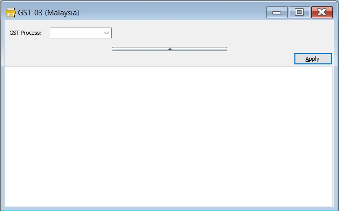

#### GST-03-Parameter

| Parameter   | Type   | Explanation                         |
|-------------|--------|-------------------------------------|
| GST Process | Lookup | To select the GST Process Period.   |

See example of the **GST Process Lookup** screenshot below.

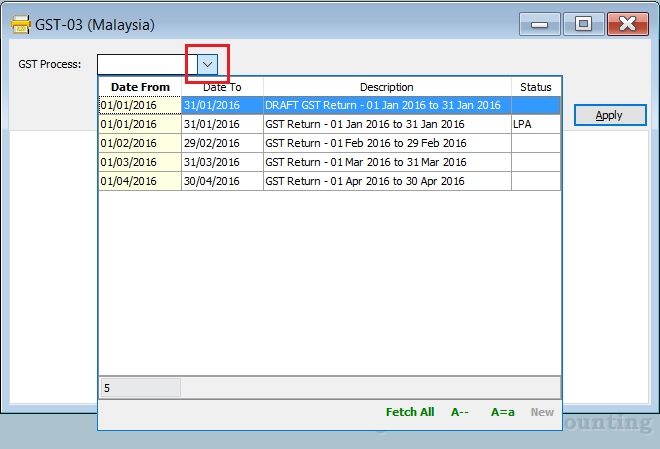

#### GST-03 Form

1. After select the GST Process parameter, click on APPLY.
2. See the below screenshot.

   

#### GST-03 TAP Upload File

1. At the GST-03 on the screen, click on the **PLAY** button.
2. Click on **GST03_TAP**. See the below screenshot.

   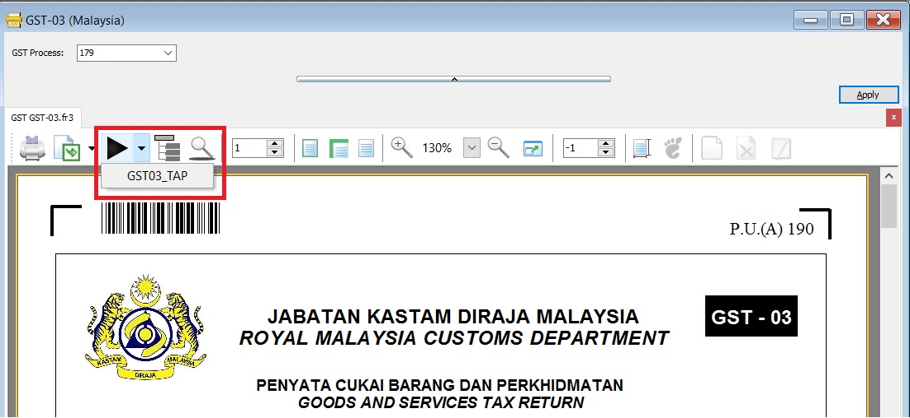

3. Select the destination directory to save the TAP-Upload text file, eg. GST Tap Return for Oct 2015 the filename: **GSTTapReturn-201510**.
4. Click on **SAVE**.
5. See the below screenshot.

   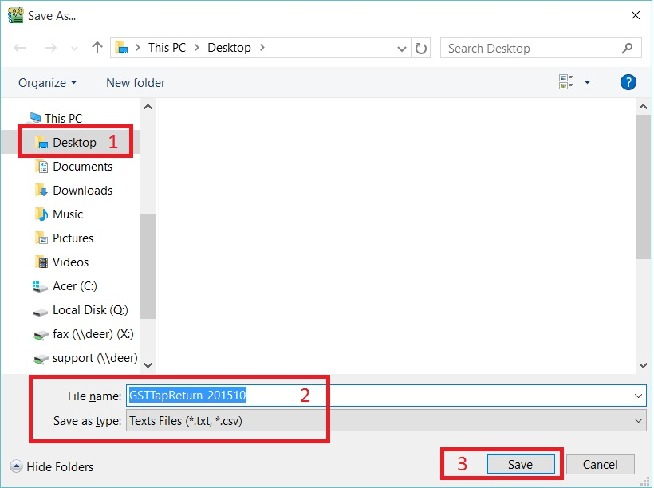

6. Prompt the below message. Press OK to proceed to upload the file via TAP website.

   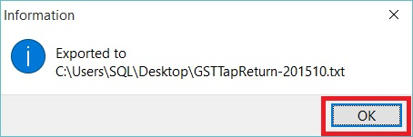

### GST - 03 Item Details

Original source from RMCD website:
[GST-03 Guidelines from RMCD website](https://mydlv.customs.gov.my/www/admin/files/JKDM/resources/assets/pdf/Panduan_Mengisi_Borang%20GST-03.pdf)

#### PART A : DETAILS OF REGISTERED PERSON

| Item No. | Description        | Guidelines                                   |
|----------|--------------------|----------------------------------------------|
| 01       | GST No.*           | GST No from File → Company Profile...        |
| 02       | Name of Business*  | Company Name from File → Company Profile...  |

#### PART B : DETAILS OF RETURN

| Item No. | Description                                                                                       | Guidelines                                                                 |
|----------|---------------------------------------------------------------------------------------------------|----------------------------------------------------------------------------|
| 03       | Taxable Period*                                                                                   | GST Returns – Process date range.                                          |
| 04       | Return and Payment Due Date*                                                                      | Follow the RMCD due date.                                                  |
| 05a      | Output Tax – Total Value of Standard Rated Supply*                                                | **SR + DS** (Taxable Amount)                                               |
| 05b      | Output Tax – Total Output Tax (Inclusive of Tax Value on Bad Debt Recovered & other Adjustments)* | **SR + DS + AJS** (Tax Amount)                                             |
| 06a      | Input Tax – Total Value of Standard Rate and Flat Rate Acquisitions*                              | **TX + IM + TX-E43 + TX-RE**                                               |
| 06b      | Input Tax – Total Input Tax (Inclusive of Tax Value on Bad Debt Relief & other Adjustments)*      | **TX + IM + TX-E43 + TX-RE + AJP** (Tax Amount)                            |
| 07       | GST Amount Payable (Item 5b – Item 6b)*                                                           | Output Tax Value > Input Tax Value                                         |
| 08       | GST Amount Claimable (Item 6b – Item 5b)*                                                         | Input Tax Value > Output Tax Value                                         |
| 09       | Do you choose to carry forward refund for GST?                                                    | Mark **X** on YES if you have ticked C/F Refund for GST.                   |

#### PART C : ADDITIONAL INFORMATION

| Item No. | Description                                                                | Guidelines                                                                                                                  |
|----------|----------------------------------------------------------------------------|-----------------------------------------------------------------------------------------------------------------------------|
| 10       | Total Value of Local Zero-Rated Supplies*                                  | **ZRL + NTX** (Taxable Amount)                                                                                              |
| 11       | Total Value of Export Supplies*                                            | **ZRE + ZDA** (Taxable Amount)                                                                                              |
| 12       | Total Value of Exempt Supplies*                                            | **IES + ES** (Taxable Amount)                                                                                               |
|          |                                                                            | Note: Net Loss in Forex (IES) = 0.00                                                                                        |
| 13       | Total Value of Supplies Granted GST Relief*                                | **RS** (Taxable Amount)                                                                                                     |
| 14       | Total Value of Goods Imported Under Approved Trader Scheme*                | **IS** (value excluding tax)                                                                                                |
| 15       | Total Value of GST Suspended under item 14*                                | **IS x 6%** (value of tax)                                                                                                  |
| 16       | Total Value of Capital Goods Acquired*                                     | **TX + TX-CG + IM** (value excluding tax)                                                                                   |
|          |                                                                            | Note: Regardless of purchase asset value. Purchase doc/Cash Book PV/ JV using "Fixed Asset" GL Account (exclude Block Tax). |
| 17       | Total Value of Bad Debt Relief Inclusive Tax*                              | **AJP** (value including tax) – Only Debtor (106 x AJP Input Tax / 6)                                                       |
| 18       | Total Value of Bad Debt Recovered Inclusive Tax*                           | **AJS** (value including tax) – Only Debtor (106 x AJS Input Tax / 6)                                                       |
| 19       | Breakdown Value of Output Tax in accordance with the Major Industries Code | Picks from GL Accounts that need MSIC Code: Sales Account, Cash Sales Account, Return Inwards, etc.                         |
|          |                                                                            | MSIC Code is a 5-digit code representing your business nature.                                                              |
|          |                                                                            | Used in Form GST-03 (Item 19).                                                                                              |
|          |                                                                            | The total GST amount of the respective MSIC Codes will be shown.                                                            |
|          |                                                                            | **Others** will be filled automatically if exceeding 5 MSIC codes.                                                          |
|          |                                                                            | Refer to list of [MSIC 2008](https://phl.hasil.gov.my/pdf/pdfam/NewBusinessCodes_MSIC2008_2.pdf).                           |

#### PART D : DECLARATION

| Item No. | Description                | Guidelines                                                      |
|----------|----------------------------|-----------------------------------------------------------------|
| 20       | Name of Authorized Person* | **User name** from **Tools -> Maintain User...**                |
| 21       | Identity Card No.*         | **IC** (New) from **Tools -> Maintain User... (Misc tab)**      |
| 22       | Passport No.*              | **Passport** from **Tools -> Maintain User... (Misc tab)**      |
| 23       | Nationality*               | **Nationality** from **Tools -> Maintain User... (Misc tab)**   |
| 24       | Date                       | Process Date                                                    |
| 25       | Signature                  | Sign on GST-03 print copy.                                      |

:::note Note:

Column with (*) is a mandatory field.

:::

## Generate GST Audit File (GAF)

To generate the GST Audit File (GAF) upon RMCD request.
Source from: [RMCD - GAF Guilde](https://mysst.customs.gov.my/assets/document/Specific%20Guides/Guide%20Customs%20Ruling%2002DIS2019_v4.pdf)

### GST Audit File (GAF)

GST Audit File (GAF) has break into 3 parts:

1. General Ledger
2. Sales
3. Purchase

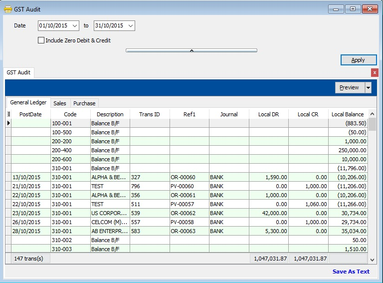

### How to Export the GAF File?

1. Select the date range.

   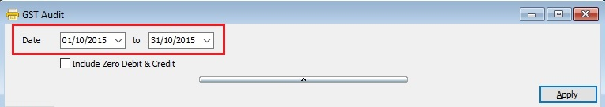

2. Click on **APPLY**.

   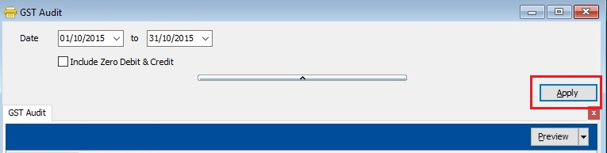

3. Click on **Save As Text**.

   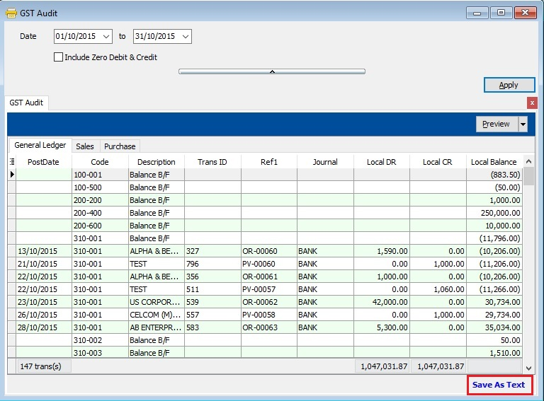

4. Select the destination directory to save the GAF file. See the below screenshot.

   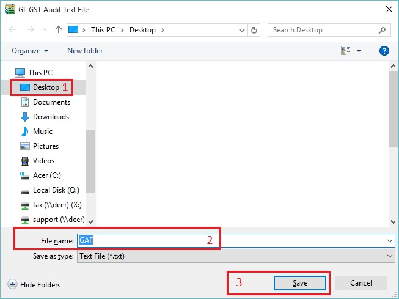

5. File generated successfully. Press OK to exit the below message.

   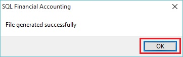

## Print Bad Debt Relief

### GST Listing (Bad Debt Relief)

Category Others will appeared in GST Listing if there is found bad debt relief (eg. AJS-BD, AJP-BD):

| Category | Description                                                                 | Local Amount | Local Tax Amount |
|----------|-----------------------------------------------------------------------------|--------------|------------------|
| AJS-BD   | Output Tax adjustment e.g: Bad Debt Recover, outstanding invoice > 6 months | 17,000.00    | 1,020.00         |
| AJP-BD   | Input Tax adjustment e.g: Bad Debt Relief                                   | 9,114.57     | 546.87           |

### GST - 03 (Bad Debt Relief)

1. At GST Return screen, you can direct preview the GST-03 by click on the GST-03 button (see the screenshot below).

   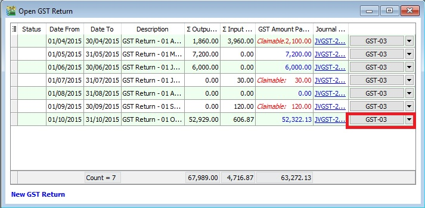

2. GST-03 result from the above sample data:

   | GST-03 # | Description                                                                         | Amount   |
   |----------|-------------------------------------------------------------------------------------|----------|
   | 5a       | Total Value of Standard Rated Supply                                                | 0.00     |
   | 5b       | Total Output Tax (Inclusive of Tax Value on Bad Debt Recovered & other Adjustments) | 1,020.00 |
   | 6a       | Total Value of Standard Rate and Flat Rate Acquisitions                             | 0.00     |
   | 6b       | Total Input Tax (Inclusive of Tax Value on Bad Debt Relief & other Adjustments)     | 546.87   |
   | 17       | Total Value of Bad Debt Relief Inclusive Tax                                        | 9,661.44 |
   | 18       | Total Value of Bad Debt Relief Recovered Inclusive Tax                              | 0.00     |

### Print GST Bad Debt Relief Report

1. This report is to help you to analyze the GST Bad Debt Relief happenings on each invoices.

   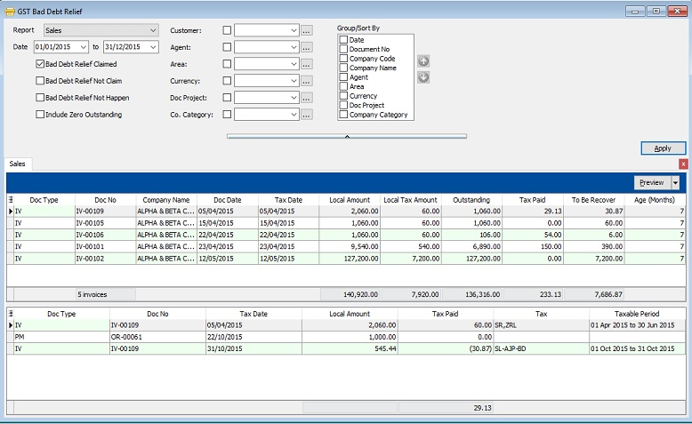

2. Let's say the IV-00109 has the following details:-

   | Seq | Description                 | Amount   | Tax | Tax Amount | Amount with Tax |
   |-----|-----------------------------|----------|-----|------------|-----------------|
   | 1   | Sales of coconut can drinks | 1,000.00 | SR  | 60.00      | 1,060.00        |
   | 2   | Sales of coconut            | 1,000.00 | ZRL | 0.00       | 1,000.00        |

3. From the below report, it tells you that the bad debt relief claimed and to be recover at **Rm30.87** for IV-00109. You can found at the detail that the bad debt relief claimed at **Taxable Period 01 Oct 2015 to 31 Oct 2015**.

   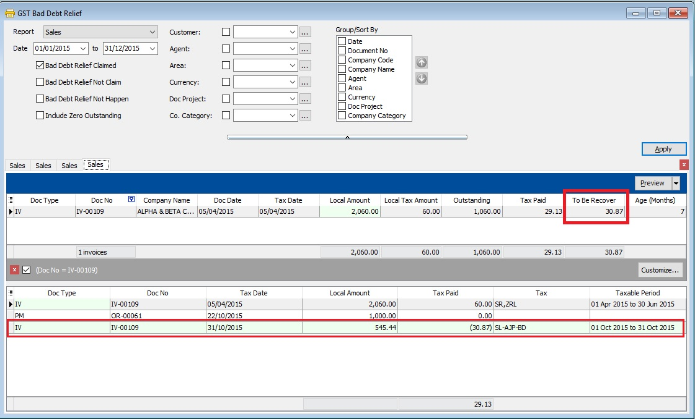

4. After the IV-00109 has been full settlement in month Nov 2015, you will found the full tax paid **Rm60.00** and to be recover will be shown as 0. You can found at the detail that the bad debt relief recovered at **Taxable Period 01 Nov 2015 to 30 Nov 2015**.

   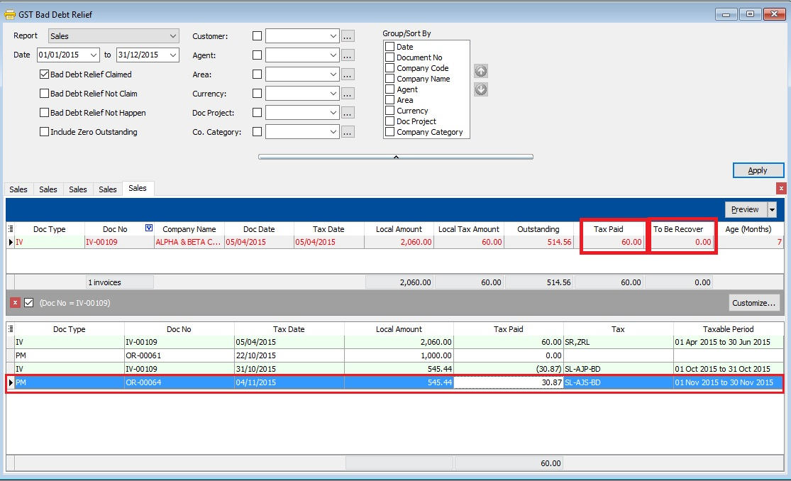

5. There are some option can choose to apply the GST Bad Debt Relief for further checking:

   #### Sales

   | Checkbox                    | Explanation                                                                                                |
   |-----------------------------|------------------------------------------------------------------------------------------------------------|
   | Bad Debt Relief Claimed     | GST bad debt relief that you HAVE TICKED to claim on outstanding invoices when process your GST returns.   |
   | Bad Debt Relief Not Claim   | GST bad debt relief that you DO NOT TICKED to claim on outstanding invoices when process your GST returns. |
   | Bad Debt Relief Not Happen  | Outstanding invoices the GST Amount not expired at 6 months GST bad debt relief.                           |
   | Include Zero Outstanding    | To include the outstanding invoices are zero.                                                              |

   #### Purchase

   | Checkbox                   | Explanation                                                                                                                 |
   |----------------------------|-----------------------------------------------------------------------------------------------------------------------------|
   | Bad Debt Relief Paid       | GST bad debt relief have paid on the outstanding supplier invoices when process your GST returns.                           |
   | Bad Debt Relief Not Pay    | GST bad debt relief not pay yet on the outstanding supplier invoices. It could be due to late receive the supplier invoice. |
   | Bad Debt Relief Not Happen | Outstanding invoices the GST Amount not expired at 6 months GST bad debt relief.                                            |
   | Include Zero Outstanding   | To include the outstanding invoices are zero.                                                                               |

6. Click Preview button. You can found the following report list.

   | #  | Report Name                                | Usage                                                                         |
   |----|--------------------------------------------|-------------------------------------------------------------------------------|
   | 1  | GST Bad Debt Relief - Sales                | GST Bad Debt Relief Listing with detail based on the checkbox ticked.         |
   | 2  | GST-BM Bad Debt Relief-Unclaimed Letter 1  | Bahasa Malaysia bad debt relief unclaimed letter format 1 to Director General |
   | 3  | GST-BM Bad Debt Relief-Unclaimed Letter 2  | Bahasa Malaysia bad debt relief unclaimed letter format 2 to Director General |
   | 4  | GST-EN Bad Debt Relief-Unclaimed Letter 1  | English version bad debt relief unclaimed letter format 1 to Director General |
   | 5  | GST-EN Bad Debt Relief-Unclaimed Letter 2  | English version bad debt relief unclaimed letter format 2 to Director General |

   :::note TIPS 1 : To print the **bad debt relief unclaimed letter**.

   1. Select the **Date Parameter** as **the GST effective date onwards**.
   2. Tick both **Bad Debt Relief Not Claim** and **Bad Debt Relief Not Happen** to apply follow by preview.

      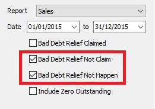

   3. This letter applicable to customer has maintained **GST No** in Maintain Customer only.

   :::

## Margin Scheme

### Print for Lampiran 07 (Lampiran B0-Penyata-Pemantauan-SM-Syarikat)

1. Select document to “Invoice Listing” and click APPLY.

   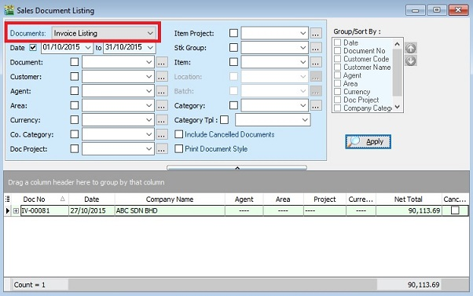

2. Click on preview or print. Select the report name “Lampiran B0-Penyata-Pemantauan-SM-Syarikat”.

   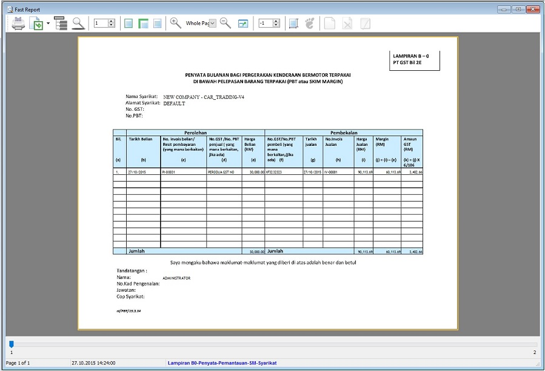

## GST Treatment - Partial Exemption

### GST Listing - Mixed Supply

***Monthly/Quarterly***

1. Select the **GST Process**.
2. Click **Apply**.
3. Click **Preview**.
4. Select the report name : **GST Detail 4 - Mixed Supplies**.
5. Press **Ok**.

**Page 1**: GST Listing 4 - Mixed Supplies

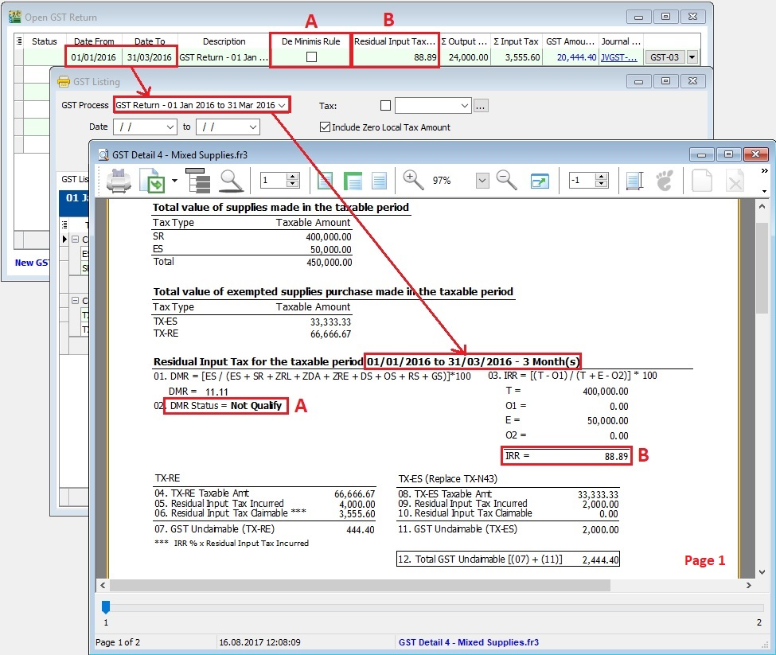

**Page 2**: GST Listing 4 - Mixed Supplies

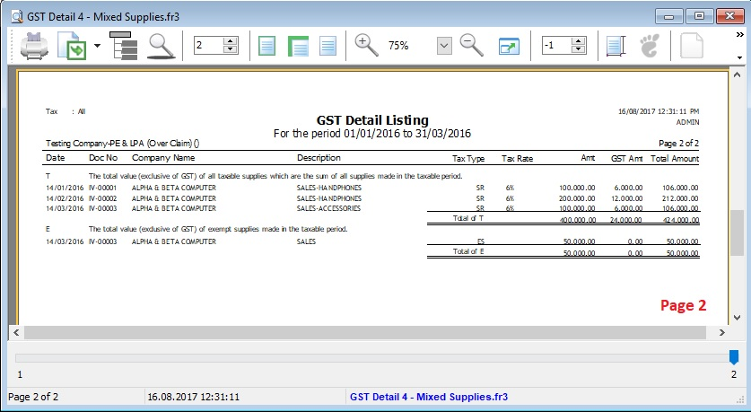

## Longer Period Adjustment (LPA)

### GST Listing - Mixed Supplies

***Longer Period Adjustment (LPA)***

1. Select the **Date From** and **Date To** (eg. the financial year is 01/01/2016 - 31/12/2016).
2. Click **Apply**.
3. Click **Preview**.
4. Select the report name : **GST Detail 4 - Mixed Supplies.**
5. Press **Ok**.

**Page 1 :** GST Listing 4 - Mixed Supplies

   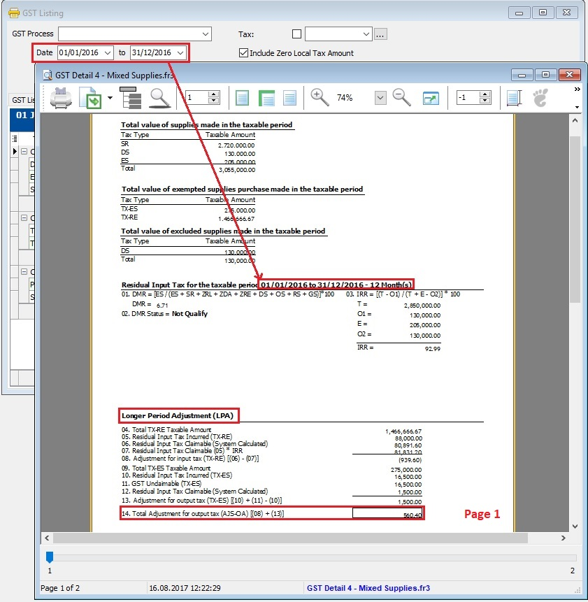

**Page 2:** GST Listing 4 - Mixed Supplies

   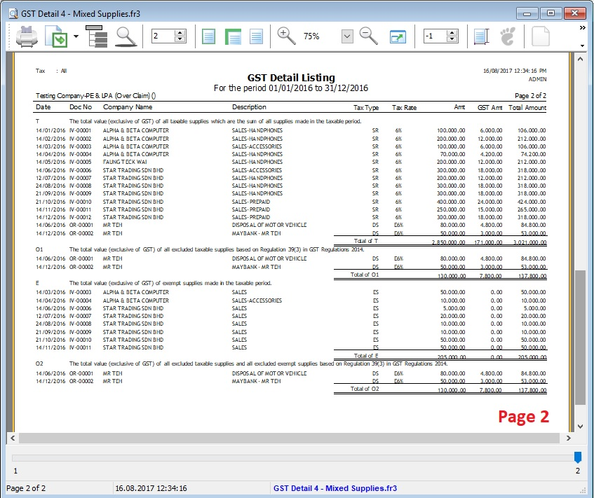
