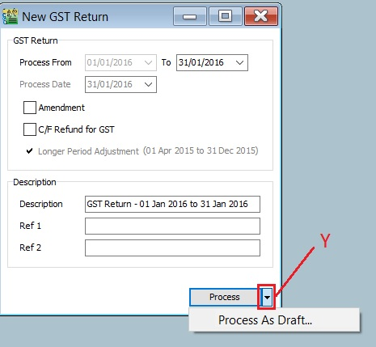
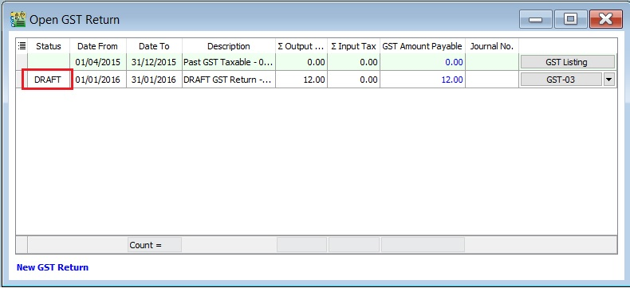
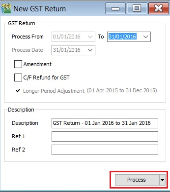
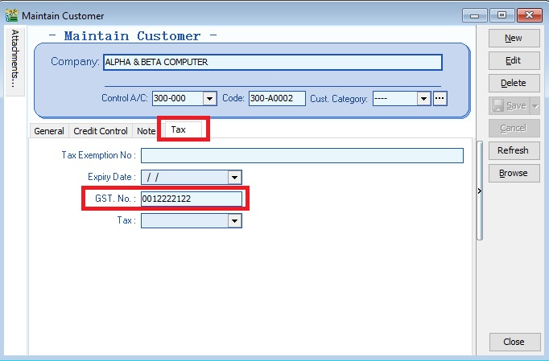

## GST Return

To process and close the GST Returns period. You can generate the GST-03 and GAF.

### New GST Return

| **Field Name**                 | **Field Type** | **Explanation**                                                                                             |
|--------------------------------|----------------|-------------------------------------------------------------------------------------------------------------|
| Process From to                | Date           | GST Taxable Period, e.g., either monthly or quarterly.                                                      |
| Process Date                   | Date           | Date to process the GST Return.                                                                             |
| Amendment                      | Boolean        | Ticked. In GST-03, the "Amendment" checkbox will be marked X.                                               |
| C/F Refund for GST             | Boolean        | Ticked. In GST-03, Item 9 "Do you choose to carry forward refund for GST?" will be marked X in Yes checkbox.|
| Longer Period Adjustment (LPA) | Boolean        | Auto ticked according to the first tax year adjustment.                                                     |
| Description                    | String         | GST Return - Process From Date to Date (by default).                                                        |
| Ref 1                          | String         | Key-in any reference no.                                                                                    |
| Ref 2                          | String         | Key-in any reference no.                                                                                    |

### Draft GST Return

You can draft the GST-03 before the final GST-03 submission by processing it as a draft.

1. Click the dropdown arrow nect to the Process button (Y).
2. Refer to the screenshot below.

   

3. DRAFT Status showed for the GST Returns period.

   

:::note

You can still amend documents while the GST return is in **DRAFT** status. Multiple drafts can be created before FINAL process the GST Returns for the period.

:::

### Final GST Return

1. Click the Process button.
2. Refer to the screenshot below.

   

3. The finalized GST Return will no longer display "DRAFT" in the status column.

   

:::note

You cannot amend the documents anymore where the FINAL GST return has generated.

:::

### Open GST Return

1. See the screenshot below:

   

2. You can insert more available fields.

   

   | **Field Name**                          | **Field Type** | **Explanation**                                                                                                                                                                     |
   |-----------------------------------------|----------------|-------------------------------------------------------------------------------------------------------------------------------------------------------------------------------------|
   | Status                                  | String         | To show the GST Return status, i.e., DRAFT, DE-REGISTER.                                                                                                                            |
   | Process Date                            | Date           | To show process date.                                                                                                                                                               |
   | Date From                               | Date           | To show date from.                                                                                                                                                                  |
   | Date To                                 | Date           | To show date to.                                                                                                                                                                    |
   | Description                             | String         | To show the description entered.                                                                                                                                                    |
   | Ref 1                                   | String         | To show the ref 1 entered.                                                                                                                                                          |
   | Ref 2                                   | String         | To show the ref 2 entered.                                                                                                                                                          |
   | User                                    | String         | To display the User process the GST Return.                                                                                                                                         |
   | Closed                                  | Boolean        | Always ticked to close.                                                                                                                                                             |
   | LPA for Partial Exemption               | Boolean        | Longer period adjustment (LPA) for partial exemption (Mixed Supplies).                                                                                                              |
   | De-register                             | Boolean        | Ticked if the taxable period has de-register date.                                                                                                                                  |
   | Amendment                               | Boolean        | To show the GST Return has ticked this option.                                                                                                                                      |
   |                                         |                | Refer to :[GST GUIDE ON AMENDMENT RETURN (GST-03)](https://sites.google.com/site/sqlestream/sql-financial-accounting/9-good-and-service-tax-gst---malaysia/9-22-gst-03-item-detail) |
   | C/F Refund for GST                      | Boolean        | To show the GST Return has ticked this option.                                                                                                                                      |
   | Process Net Realized Exchange Gain/Loss | Boolean        | No longer use because system auto handles this option.                                                                                                                              |
   | Tax Year                                | Boolean        | Tax Year point.                                                                                                                                                                     |
   | De Minimis Rule                         | Boolean        | - Ticked = Pass                                                                                                                                                                     |
   |                                         |                | - Un-ticked = Not Pass                                                                                                                                                              |
   | Residual Input Tax Recovery Rate (%)    | Float          | To display the IRR %.                                                                                                                                                               |
   | LPA Date From                           | Date           | LPA date from.                                                                                                                                                                      |
   | LPA Date To                             | Float          | LPA date to.                                                                                                                                                                        |
   | ∑ Output Tax                            | Float          | To show the total output tax value.                                                                                                                                                 |
   | ∑ Input Tax                             | Float          | To show the total input tax value.                                                                                                                                                  |
   | GST Amount Payable                      | Float          | Net GST Payable or Claimable.                                                                                                                                                       |
   | Journal No.                             | String         | Auto post the JVGST-XXXXX to reconcile the GST Payable and GST Claimable accounts.                                                                                                  |
   |                                         | Button         | Options button: GST-03, Print GST Listing, Generate GST Audit File (GAF).                                                                                                           |

   :::note Tips:

   You can click New GST Return in Open GST Return screen. See below the screenshot.

   

   :::

## AR & AP Bad Debt Relief

A taxable person may claim bad debt relief subject to the requirements and conditions set forth under sec.58 of the GSTA 2014 and the person has not received any payment or part of the payment in respect of the taxable supply from the debtor after the sixth month from the date of supply.

The bad debt relief may be claimed if - (amended on 28 Oct 2015 from DG Decision)
(a) requirements under s.58 GSTA and Part X of GST Regulations 2014 are fulfilled; and
(b) the supply is made by a GST registered person to another GST registered person

The bad debt relief shall be claimed immediately in the taxable period after the expiry of the sixth month from the date of supply. If the bad debt relief is not claimed by the supplier in the immediate taxable period immediately after the expiry of the sixth month, then the taxable person has to notify the Director General (DG) within 30 days after the expiry of the sixth month on his intention to claim at a later date.

A GST registered person who has made the input tax claim but fails to pay his supplier within six months from the date of supply shall account for output tax immediately after the expiry of the sixth month (s.38(9) GSTA).

The word ‘month’ in sec.58 refers to calendar month or complete month –
Example: Invoice issued at 15 th January 2017. For monthly taxable period, the sixth month expires at the end of June and the bad debt relief shall be claimed in July taxable period.

See below the overview of GST Bad Debt Relief system flow:

### Check List Related to Bad Debt Relief

#### Maintain Tax (Bad Debt Relief)

Below tax code will be AUTO used for Bad Debt Relief matter when process GST Return:

| Tax Code   | Description                                                                 | Tax Acc Entry                | Explanation                            |
|------------|-----------------------------------------------------------------------------|------------------------------|----------------------------------------|
| SL-AJP-BD  | Input Tax adjustment e.g: Bad Debt Relief                                   | DR GST-Claimable             | For customer bad debt relief claim     |
|            |                                                                             | CR GST-Sales Deferred Tax    |                                        |
| SL-AJS-BD  | Output Tax adjustment e.g: Bad Debt Recover, outstanding invoice > 6 months | DR Sales Deferred Tax        | For customer bad debt relief recovered |
|            |                                                                             | CR GST-Payable               |                                        |
| PH-AJP-BD  | Input Tax adjustment e.g: Bad Debt Relief                                   | DR GST-Claimable             | For supplier bad debt relief recovered |
|            |                                                                             | CR GST-Purchase Deferred Tax |                                        |
| PH-AJS-BD  | Output Tax adjustment e.g: Bad Debt Recover, outstanding invoice > 6 months | DR GST-Purchase Deferred Tax | For supplier bad debt relief payable   |
|            |                                                                             | CR GST-Payable               |                                        |

#### Maintain Customer

1. There is one condition to determine the bad debt relief can be claimed if -

    1. **requirements under s.58 GSTA and Part X of GST Regulations 2014 are fulfilled**; and
    2. **the supply is made by a GST registered person to another GST registered person**

2. Therefore, you need to update the GST No for your customer who is GST registered person. See the screenshot below.
3. Under the Tax tab in Maintain Customer,

   

### Process GST Returns

1. Process GST Return. For example, process from 01/10/2015 to 31/10/2015.
2. Bad Debt Relief screen will be prompted (see the screenshot below) if the system found there are outstanding Tax Invoices has expired at 6 months.
3. Sales documents from the company has empty GST No will be un-ticked. You can tick the documents if you think this company is a GST Registered person.

   

   :::note TIPS:

   

   To avoid to tick the documents manually for GST Registered company, please go to update the GST no at Maintain Customer.

   :::

4. Press OK if get a "confirm" message prompted (see the screenshot below), it means there are some company do not have GST No.
5. If you have confirmed that the company is Non-GST Registered person then you can press YES to proceed.
6. Otherwise press NO, you have to update the GST No at Maintain Customer to confirm the company is a GST Registered person before process the GST Return.

   

### Print GST Bad Debt Relief

For report printing [refer to this link.](../../usage/gst/gst-report.md#print-bad-debt-relief)
