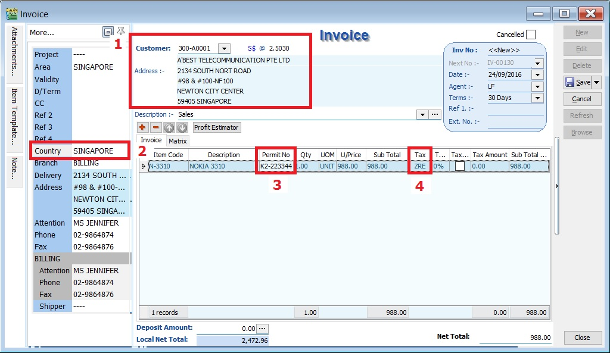
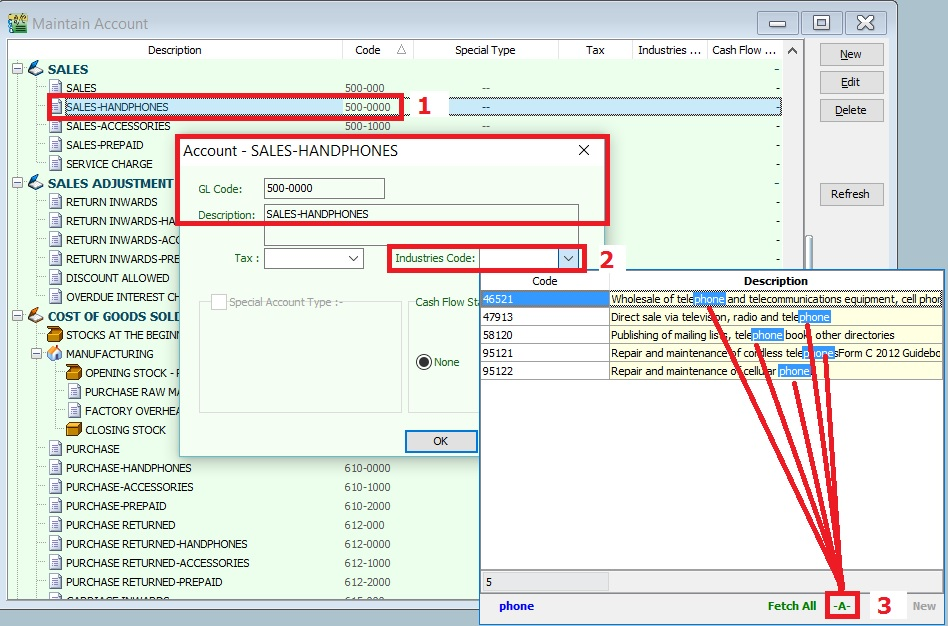

## GST Return

To process and close the GST Returns period. You can generate the GST-03 and GAF.

### New GST Return

| **Field Name**                 | **Field Type** | **Explanation**                                                                                             |
|--------------------------------|----------------|-------------------------------------------------------------------------------------------------------------|
| Process From to                | Date           | GST Taxable Period, e.g., either monthly or quarterly.                                                      |
| Process Date                   | Date           | Date to process the GST Return.                                                                             |
| Amendment                      | Boolean        | Ticked. In GST-03, the "Amendment" checkbox will be marked X.                                               |
| C/F Refund for GST             | Boolean        | Ticked. In GST-03, Item 9 "Do you choose to carry forward refund for GST?" will be marked X in Yes checkbox.|
| Longer Period Adjustment (LPA) | Boolean        | Auto ticked according to the first tax year adjustment.                                                     |
| Description                    | String         | GST Return - Process From Date to Date (by default).                                                        |
| Ref 1                          | String         | Key-in any reference no.                                                                                    |
| Ref 2                          | String         | Key-in any reference no.                                                                                    |

### Draft GST Return

You can draft the GST-03 before the final GST-03 submission by processing it as a draft.

1. Click the dropdown arrow nect to the Process button (Y).
2. Refer to the screenshot below.

   

3. DRAFT Status showed for the GST Returns period.

   

:::note

You can still amend documents while the GST return is in **DRAFT** status. Multiple drafts can be created before FINAL process the GST Returns for the period.

:::

### Final GST Return

1. Click the Process button.
2. Refer to the screenshot below.

   

3. The finalized GST Return will no longer display "DRAFT" in the status column.

   

:::note

You cannot amend the documents anymore where the FINAL GST return has generated.

:::

### Open GST Return

1. See the screenshot below:

   

2. You can insert more available fields.

   

   | **Field Name**                          | **Field Type** | **Explanation**                                                                                                                                                                     |
   |-----------------------------------------|----------------|-------------------------------------------------------------------------------------------------------------------------------------------------------------------------------------|
   | Status                                  | String         | To show the GST Return status, i.e., DRAFT, DE-REGISTER.                                                                                                                            |
   | Process Date                            | Date           | To show process date.                                                                                                                                                               |
   | Date From                               | Date           | To show date from.                                                                                                                                                                  |
   | Date To                                 | Date           | To show date to.                                                                                                                                                                    |
   | Description                             | String         | To show the description entered.                                                                                                                                                    |
   | Ref 1                                   | String         | To show the ref 1 entered.                                                                                                                                                          |
   | Ref 2                                   | String         | To show the ref 2 entered.                                                                                                                                                          |
   | User                                    | String         | To display the User process the GST Return.                                                                                                                                         |
   | Closed                                  | Boolean        | Always ticked to close.                                                                                                                                                             |
   | LPA for Partial Exemption               | Boolean        | Longer period adjustment (LPA) for partial exemption (Mixed Supplies).                                                                                                              |
   | De-register                             | Boolean        | Ticked if the taxable period has de-register date.                                                                                                                                  |
   | Amendment                               | Boolean        | To show the GST Return has ticked this option.                                                                                                                                      |
   |                                         |                | Refer to :[GST GUIDE ON AMENDMENT RETURN (GST-03)](https://sites.google.com/site/sqlestream/sql-financial-accounting/9-good-and-service-tax-gst---malaysia/9-22-gst-03-item-detail) |
   | C/F Refund for GST                      | Boolean        | To show the GST Return has ticked this option.                                                                                                                                      |
   | Process Net Realized Exchange Gain/Loss | Boolean        | No longer use because system auto handles this option.                                                                                                                              |
   | Tax Year                                | Boolean        | Tax Year point.                                                                                                                                                                     |
   | De Minimis Rule                         | Boolean        | - Ticked = Pass                                                                                                                                                                     |
   |                                         |                | - Un-ticked = Not Pass                                                                                                                                                              |
   | Residual Input Tax Recovery Rate (%)    | Float          | To display the IRR %.                                                                                                                                                               |
   | LPA Date From                           | Date           | LPA date from.                                                                                                                                                                      |
   | LPA Date To                             | Float          | LPA date to.                                                                                                                                                                        |
   | ∑ Output Tax                            | Float          | To show the total output tax value.                                                                                                                                                 |
   | ∑ Input Tax                             | Float          | To show the total input tax value.                                                                                                                                                  |
   | GST Amount Payable                      | Float          | Net GST Payable or Claimable.                                                                                                                                                       |
   | Journal No.                             | String         | Auto post the JVGST-XXXXX to reconcile the GST Payable and GST Claimable accounts.                                                                                                  |
   |                                         | Button         | Options button: GST-03, Print GST Listing, Generate GST Audit File (GAF).                                                                                                           |

   :::note Tips:

   You can click New GST Return in Open GST Return screen. See below the screenshot.

   

   :::

## Submission of Final GST Return

Pursuant to Section 6, **Goods and Service Tax (Repeal) Act 2018**, all GST Registrants are required to submit the GST-03 Return on the final taxable period **(ie. 31 Aug 2018)** and make full payment for the amount of tax payable in connection with the supply **for the last taxable period within 120 days (29 December 2018)** from 01 Sept 2018.

- Any input tax claimable from the purchase/supplier invoice received after 1 Sept 2018. It can be claim and must submit into the **Final GST Returns (31 Aug 2018)**.
- Input tax claim will be subjected to verification and audit.
- Refund will be made within 6 years.

### How to enter the input tax 6% claimable from Purchase / Supplier invoice after 1st September 2018?

For example, on **13 SEPT 2018**, my company has received a supplier tax invoice dated **07 MAY 2018** and amount inclusive GST is **RM10,600**.

#### Enter at Purchase Invoice

1. Set **Date**... to record the original invoice date (eg. **07 MAY 2018**).
2. Set **Posting Date**... to post this transaction into GL reporting as at **13 SEP 2018**.

   :::note Note:

   To enable to set Posting Date, the **Double Document Module** is required.

   :::

3. Set **Tax Date**... to declare this GST input tax into **Final GST Returns (31 AUG 2018)**.

   

#### Enter at Supplier Invoice

1. Set **Date**... to record the original invoice date (eg. **07 MAY 2018**).
2. Set **Posting Date**... to post this transaction into GL reporting as **13 SEP 2018**.

   :::note Note:

   To enable to set Posting Date, the **Double Document Module** is required.

   :::

3. Set **Tax Date**... to declare this GST input tax into **Final GST Returns (31 AUG 2018)**.

   

#### Enter at Cash Book (PV)

1. Set **Date**... to record the original invoice date (eg. **07 MAY 2018**).
2. Set **Posting Date**... to post this transaction into GL reporting as at **13 SEP 2018**.
3. Set **Tax Date**... to declare this GST input tax into **Final GST Returns (31 AUG 2018)**.

   

### Final GST Returns

Process GST Returns up to **31 AUG 2018**.

| Items | Value   |
|-------|---------|
| 6a    | 10,000  |
| 6b    | 600     |

   :::note NOTE:

   1. Final GST Returns until **31 AUG 2018**.
   2. Last date of submission for the **Final GST Returns is 29 DEC 2018**

   :::

## Transitional from GST to SST

### Bad Debt Relief / Recovered

1. GST registered person is eligible to claim the bad debt relief even if it spans on or after 1 September 2018.
2. Bad Debt Relief is allowed to be claimed within 120 days from the SST effective date (eg. 1 September 2018).
3. Bad Debt Recovery made on or after 1 September 2018 must to be paid as output tax to RMCD within 120 days from the SST effective date by amending the Final GST Return.

### Final GST Return Processor

1. System will AUTO define the last taxable period **(A)**, eg...

   | Process From | Process To |
   |--------------|------------|
   | 01/07/2018   | 31/08/2018 |

2. Set the Process Date **(B)** as the date submit the Final GST return before 29 December 2018 (within 120 days from the SST effective date).

   1. For example,

      

   2. Double entry for **Cases 1**.

      

   3. Double entry for **Cases 2**.

      

## AR & AP Bad Debt Relief

A taxable person may claim bad debt relief subject to the requirements and conditions set forth under sec.58 of the GSTA 2014 and the person has not received any payment or part of the payment in respect of the taxable supply from the debtor after the sixth month from the date of supply.

The bad debt relief may be claimed if - (amended on 28 Oct 2015 from DG Decision)
(a) requirements under s.58 GSTA and Part X of GST Regulations 2014 are fulfilled; and
(b) the supply is made by a GST registered person to another GST registered person

The bad debt relief shall be claimed immediately in the taxable period after the expiry of the sixth month from the date of supply. If the bad debt relief is not claimed by the supplier in the immediate taxable period immediately after the expiry of the sixth month, then the taxable person has to notify the Director General (DG) within 30 days after the expiry of the sixth month on his intention to claim at a later date.

A GST registered person who has made the input tax claim but fails to pay his supplier within six months from the date of supply shall account for output tax immediately after the expiry of the sixth month (s.38(9) GSTA).

The word ‘month’ in sec.58 refers to calendar month or complete month –
Example: Invoice issued at 15 th January 2017. For monthly taxable period, the sixth month expires at the end of June and the bad debt relief shall be claimed in July taxable period.

See below the overview of GST Bad Debt Relief system flow:

### Check List Related to Bad Debt Relief

#### Maintain Tax (Bad Debt Relief)

Below tax code will be AUTO used for Bad Debt Relief matter when process GST Return:

| Tax Code   | Description                                                                 | Tax Acc Entry                | Explanation                            |
|------------|-----------------------------------------------------------------------------|------------------------------|----------------------------------------|
| SL-AJP-BD  | Input Tax adjustment e.g: Bad Debt Relief                                   | DR GST-Claimable             | For customer bad debt relief claim     |
|            |                                                                             | CR GST-Sales Deferred Tax    |                                        |
| SL-AJS-BD  | Output Tax adjustment e.g: Bad Debt Recover, outstanding invoice > 6 months | DR Sales Deferred Tax        | For customer bad debt relief recovered |
|            |                                                                             | CR GST-Payable               |                                        |
| PH-AJP-BD  | Input Tax adjustment e.g: Bad Debt Relief                                   | DR GST-Claimable             | For supplier bad debt relief recovered |
|            |                                                                             | CR GST-Purchase Deferred Tax |                                        |
| PH-AJS-BD  | Output Tax adjustment e.g: Bad Debt Recover, outstanding invoice > 6 months | DR GST-Purchase Deferred Tax | For supplier bad debt relief payable   |
|            |                                                                             | CR GST-Payable               |                                        |

#### Maintain Customer

1. There is one condition to determine the bad debt relief can be claimed if -

    1. **requirements under s.58 GSTA and Part X of GST Regulations 2014 are fulfilled**; and
    2. **the supply is made by a GST registered person to another GST registered person**

2. Therefore, you need to update the GST No for your customer who is GST registered person. See the screenshot below.
3. Under the Tax tab in Maintain Customer,

   

### Process GST Returns

1. Process GST Return. For example, process from 01/10/2015 to 31/10/2015.
2. Bad Debt Relief screen will be prompted (see the screenshot below) if the system found there are outstanding Tax Invoices has expired at 6 months.
3. Sales documents from the company has empty GST No will be un-ticked. You can tick the documents if you think this company is a GST Registered person.

   

   :::note TIPS:

   

   To avoid to tick the documents manually for GST Registered company, please go to update the GST no at Maintain Customer.

   :::

4. Press OK if get a "confirm" message prompted (see the screenshot below), it means there are some company do not have GST No.
5. If you have confirmed that the company is Non-GST Registered person then you can press YES to proceed.
6. Otherwise press NO, you have to update the GST No at Maintain Customer to confirm the company is a GST Registered person before process the GST Return.

   

### Print GST Bad Debt Relief

For report printing [refer to this link.](../../usage/gst/gst-report.md#print-bad-debt-relief)

## Common Error in GST Return

**How to avoid costly GST errors?**

This guide will help you to easily identify the common GST errors in GST Returns. To minimize GST amendment and incorrect GST Returns to RMCD.
You may wish to take note the follow errors commonly made by businesses:

1. [Standard Rated Supply (5a) and Output Tax (5b)](../../usage/gst/gst-return.md#standard-rate-supply-5a-and-output-tax-5b)
2. [Standard Rate and Flat Rate Acquisitions (6a), and Input Tax (6b)](../../usage/gst/gst-return.md#standard-rate-and-flat-rate-acquisitions-6a-and-input-tax-6b)
3. [Local Zero-Rated Supplies](../../usage/gst/gst-return.md#local-zero---rated-supplies)
4. [Export Supplies](../../usage/gst/gst-return.md#export-supplies)
5. [Exempt Supplies](../../usage/gst/gst-return.md#exempted-supplies)
6. [Supplies Granted GST Relief](../../usage/gst/gst-return.md#supplies-grant-gst-relief)
7. [Goods Imported Under Approved Trader Scheme and GST Suspended](../../usage/gst/gst-return.md#goods-imported-under-approved-trader-scheme-and-gst-suspended)
8. [Capital Goods Acquired](../../usage/gst/gst-return.md#capital-goods-acquired-avoid-costly-gst-error)
9. [Bad Debt Relief](../../usage/gst/gst-return.md#bad-debt-relief)
10. [Bad Debt Recovered](../../usage/gst/gst-return.md#bad-debt-recovered)
11. [Output tax value breakdown into Major Industries Code (MSIC Code)](../../usage/gst/gst-return.md#output-tax-value-breakdown-into-major-industries-code-msic-code)
12. [Other important info required in GAF](../../usage/gst/gst-return.md#other-important-info-required-in-gaf)
13. [GL Ledger vs GST-03](../../usage/gst/gst-return.md#gl-ledger-vs-gst---03)
14. [Foreign currency exchange rate](../../usage/gst/gst-return.md#foreign-currency-exchange-rate)

### Standard Rate Supply (5a) and Output Tax (5b)

**Mapping of GST Tax Code:**

| GST-03 | Description                                                                          | Tax Code       |
|--------|--------------------------------------------------------------------------------------|----------------|
| 5a     | Total Value of Standard Rated Supply                                                 | **SR, DS**     |
| 5b     | Total Output Tax (Inclusive of Tax Value on Bad Debt Recovered & others adjustments) | **SR, DS, AJS**|

1. Sale or disposal of business assets
2. Goods given free as gift.
3. Inter-company transactions
4. Margin Scheme

### Standard Rate and Flat Rate Acquisitions (6a), and Input Tax (6b)

**Mapping of GST Tax Code:**

| GST-03 | Description                                                                     | Tax Code                                                                                                       |
|--------|---------------------------------------------------------------------------------|----------------------------------------------------------------------------------------------------------------|
| 6a     | Standard Rate and Flat Rate Acquisitions                                        | **TX, TX-CG, TX-ES** (DMR is fulfilled only), **TX-IES** (Total/Full amount), **TX-RE, IM**                    |
| 6b     | Total Input Tax (Inclusive of Tax Value on Bad Debt Relief & other Adjustments) | **TX, TX-CG, TX-ES** (DMR is fulfilled only), **TX-IES** (GST Claimable only based on IRR), **TX-RE, IM, AJP** |

Not all input tax claims are allowable. You can claim input tax on your purchases only if the below conditions are fulfilled.

1. Tax invoice / Simplified Tax Invoice / Custom K1 / Custom K9
   1. The buyer can use **simplified tax invoice** if the **total amount GST payable is RM30 or less**.
   2. if the **total amount of GST payable is more than RM30**, the buyer must request for a **tax invoice** with the name and address of the buyer.
   3. Tax invoice issued by approved person for Flat Rate Scheme.
   4. **K1** form for imported goods
   5. **K1** and **K9** for goods removed from bonded warehouse

2. Supplies made outside Malaysia which would be taxable supplies if **made in Malaysia**.
3. To be eligible for input tax claim relating to goods that are exported, a registered person (exporter) must ensure that:
   1. prescribed customs form for export (K2 / K8) must have an endorsement on Remarks column in **Sistem Maklumat Kastam (SMK)** – “A claim for input tax under the GST Act 2014 will be made”; and
   2. Customs Official Receipt.

4. **Disregarded supplies** (supplies within group, supplies made in warehouse, supplies between venture operator and venturers, and supplies between toll manufacturer and overseas principal).
5. Directly attributable to taxable supplies (ie. standard rated supplies and zero rated supplies).
6. Must not be disallowed expenses (or known as **Blocked Input Tax**).
   1. Passenger motor cars (**not more than 9 passengers** including driver and unladen weight does not exceed 3,000 kg) including hiring of car
   2. Repair and maintenance for motor cars
   3. Family benefits
   4. Club subscription fee
   5. Medical and personal accident insurance
   6. Medical expenses
   7. Entertainment expenses for potential customer or others than employees.

7. Must be taxable purchases (ie. purchases made from GST registered suppliers)

### Local Zero - Rated Supplies

**Mapping of GST Tax Code:**

| GST-03 | Description                              | Tax Code     |
|--------|------------------------------------------|--------------|
| 10     | Total Value of Local Zero-Rated Supplies | **ZRL, ZDA** |

This refer to the following types according to **GST (Zero Rate Supplies) Order 2014**:-

1. Local supply of goods and services (**ZRL**):

   1. Zero-rated supply of goods of any of the descriptions as in Appendix (Zero-rated Supply) Order 2014 based on tariff code in such as milled-rice, fresh fruit, and live animals (cattle, buffalo, goat, sheep and swine),
   2. Medicaments and medical gases in the National Essential Medicines List issued by the Ministry of Health and approved by the Minister and put up in measured doses or in forms of packaging for retail sale,
   3. The supply of treated water by a person who is licensed under the Water Services Industry Act 2006 [Act 655] to domestic consumers irrespective of minimum or non-usage,
   4. The supply of raw materials and components made to a person who belongs in a country other than Malaysia for the treatment and processing of goods by any taxable person under the Approved Toll Manufacturer Scheme, and etc.

2. Supply of goods from Malaysia to Designated Area, ie. Pulau Langkawi, Labuan, & Pulau Tioman (**ZDA**)

### Export Supplies

**Mapping of GST Tax Code:**

| GST-03 | Description                    | Tax Code |
|--------|--------------------------------|----------|
| 11     | Total Value of Export Supplies | **ZRE**  |

This refer to the Supply of goods or services **from Malaysia to Oversea** according to **GST (Zero Rate Supplies) Order 2014**.

1. Movement of goods is supported with **Customs K2** form which must stated the following:

   1. Supplier's name and address as the consignor.
   2. Recipient's name and address in overseas recipient as the consignee.
   3. Supply of services must attached with supporting documents such as invoice for an international services. Examples includes sales of air-tickets and international freight charges.

**How to check the transactions correctly entered?**

At the invoice entry, please ensure the following screenshot and steps are followed/entered correctly:-

1. **Customer name** and **address** must be a **foreigner company**.
2. **Country** to define the destination of goods deliver.
3. **Permit No** to record the **Custom K2** no for supporting document reference.
4. Tax code must be **ZRE**.

### Exempted Supplies

**Mapping of GST Tax Code:**

| GST-03 | Description                    | Tax Code    |
|--------|--------------------------------|-------------|
| 12     | Total Value of Exempt Supplies | **ES, IES** |

This refer to the following types according to **GST (Exempt Supplies) Order 2014:-**

1. **Services (ES):-**
   1. Private education
   2. Private health services
   3. Childcare services
   4. Domestic transportation of passengers for mass Public Transports (eg. by rail, ship, boat, ferry, express bus, stage bus, school bus, feeder bus, workers bus and taxi)
   5. Toll highway

2. **Financial Services (IES):-**
   1. Interest income from deposits placed with a financial institution in Malaysia
   2. Interest received from loans provided to employees (factoring receivables)
   3. [Realized foreign exchange gains](gst-treatment.md#gst-03-item-12-es--ies)

3. **Goods (ES):-**
   1. Residential properties
   2. Land for agricultural use
   3. Land for general user (ie. burial ground, playground or religious building)

#### How to check the transactions correctly entered?

***A. GST Listing***

1. After GST Return processed, go to **Print GST Listing....**

   

2. Preview and select the report name **GST Detail 2**.
3. To ensure the **document detail descriptions** are clearly stated and map to the correct tax code.

   

***B. GST-03***

1. To quick do amendment before submit the GST-03 to RMCD. [Click this link](../../usage/gst/gst-amendment#gst---03-amendment) to learn more about the **GST amendment**.
2. Double click on the item 12 in GST-03.

   

3. Drill down the documents to open and correct it accordingly.
4. Lastly, you have to **Recalculate** the amended GST Return.

### Supplies Grant GST Relief

**Mapping of GST Tax Code:**

| GST-03 | Description                                | Tax Code |
|--------|--------------------------------------------|----------|
| 13     | Total Value of Supplies Granted GST Relief | **RS**   |

### Goods Imported Under Approved Trader Scheme and GST Suspended

**Mapping of GST Tax Code:**

| GST-03 | Description                                                | Tax Code          |
|--------|------------------------------------------------------------|-------------------|
| 14     | Total Value of Goods Imported Under Approved Trader Scheme | **IS**            |
| 15     | Total Value of GST Suspended under item 14                 | **IS** × Tax Rate |

### Capital Goods Acquired (Avoid Costly GST Error)

**Mapping of GST Tax Code:**

| GST-03 | Description                           | Tax Code                                                              |
|--------|---------------------------------------|-----------------------------------------------------------------------|
| 16     | Total Value of Capital Goods Acquired | **TX-CG, TX, IM** (Transaction GL Account related to **Fixed Asset**) |

### Bad Debt Relief

**Mapping of GST Tax Code:**

| GST-03 | Description                                  | Tax Code          |
|--------|----------------------------------------------|-------------------|
| 17     | Total Value of Bad Debt Relief Inclusive Tax | **AJP (AR only)** |

### Bad Debt Recovered

**Mapping of GST Tax Code:**

| GST-03 | Description                                     | Tax Code          |
|--------|-------------------------------------------------|-------------------|
| 18     | Total Value of Bad Debt Recovered Inclusive Tax | **AJS (AR only)** |

### Output tax value breakdown into Major Industries Code (MSIC Code)

1. This part usually require you to breakdown the total output tax reported in 5b according to your **main business**.
2. You have to map to [MSIC code](https://sites.google.com/site/sqlestream/sql-financial-accounting/9-good-and-service-tax-gst---malaysia/9-23-major-industries-code-msic).

#### **Where to set the MSIC Code?**

1. Select and edit your main business supplies GL Account, eg. my main business is selling hand-phones.
2. Select an appropriate **Industries Code**.
3. You can change the search pattern to **-A-**. See screenshot below. So you can type-in the keywords, eg. Phone.

   

### Other important info required in GAF

The GST Audit file is a way for taxpayers to submit information relevant to auditors in response to an audit request on information for auditing purposes. The information provided includes company identifications, names, supply & purchases, and general ledger transactions. There is also a footer record to ensure file integrity.

Record types are:-

| Record Type | Description | Where it update???                                                                                                                    |
|-------------|-------------|---------------------------------------------------------------------------------------------------------------------------------------|
| C           | Company     | Company Profile                                                                                                                       |
| P           | Purchase    | Supplier Invoice (PI), Supplier Debit Note (SD), Supplier Credit Note (SC), Cash Book (PV), and Journal (JE)                          |
| S           | Supply      | Customer Invoice (IV), Customer Debit Note (DN), Customer Credit Note (CN), Cash Book (OR), Gift/Deemed Supply (GI), and Journal (JE) |
| L           | Ledger      | From the GL Ledger reports                                                                                                            |
| F           | Footer      | GAF file integrity check                                                                                                              |

### GL Ledger VS GST - 03

1. **GST-Ledger-Vs-GST-03** is a very useful report to identify the unrealized human errors immediately. Possible errors may be due to documents had selected:-

   1. Wrong tax code or category
   2. Wrong account code
   3. Use Tax Date which is different from Document Date
   4. 5 Cents rounding had selected Tax Code.

2. It comprises of 2 reports:-

   | Report Name                | GL Acc                    | Explanation                                                             |
   |----------------------------|---------------------------|-------------------------------------------------------------------------|
   | 1. GST-Ledger-Vs-GST-03_5b | GST-201 (GST - Payable)   | To reconcile the GST Payable account between the GL Ledger and GST-03   |
   | 2. GST-Ledger-Vs-GST-03_6b | GST-101 (GST - Claimable) | To reconcile the GST Claimable account between the GL Ledger and GST-03 |

3. For example,

   Supplier invoice date (15 Sept 2016) received in Oct 2016 and GST-03 Sept 2016 has submitted. Input tax will be claim in Oct 2016 by set the tax date (31 Oct 2016). In GL Ledger, the input tax will be posted in Sept 2016. However, this input tax will be appear in GT-03 Oct 2016.
   With this **GST-Ledger-Vs-GST-03** report, you can very easy identify out the reasons. See the screenshot below.

      

### Foreign Currency Exchange Rate

1. Always update the currency exchange rate at Tools | [Maintain Currency](../../usage/tools/guide#maintain-currency).
2. Critical cost on output tax if bill in foreign currency to local customer:

| Currency | Status    | Exchange Rate | Amount   | Local Amount      | Output Tax |
|----------|-----------|---------------|----------|-------------------|------------|
| USD      | Outdated  | 3.8000        | 1,000.00 | 3,800.00          | 228.00     |
| USD      | Actual    | 4.3000        | 1,000.00 | 4,300.00          | 258.00     |
|          |           |               |          | **Under declared**| -30.00     |
