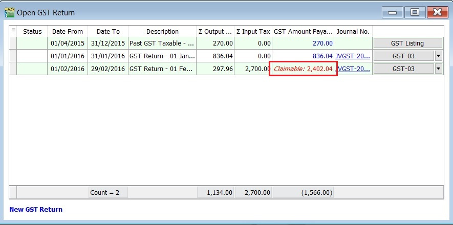
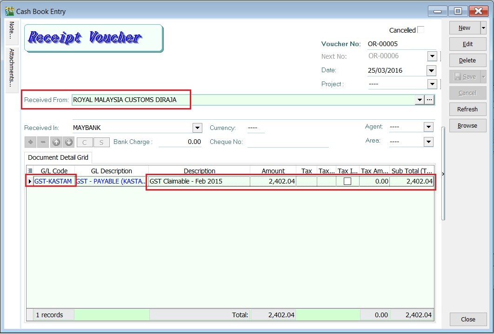
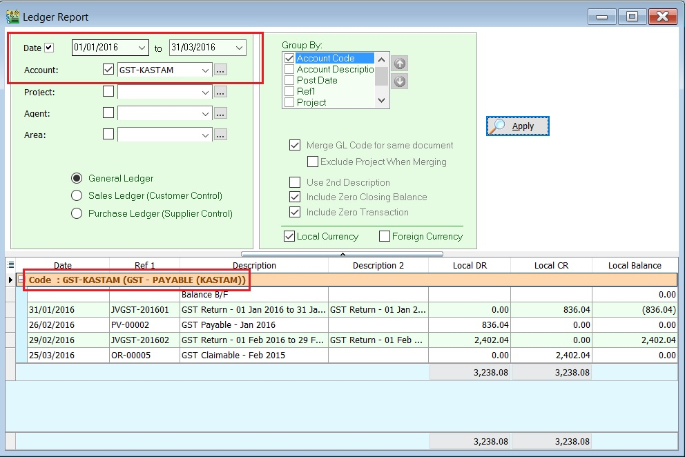

1. Net GST Payable is the total GST amount to be paid to RMCD.
2. Net GST Claimable is the total GST amount to be claimed or refund from RMCD.

## Payment to RMCD

1. Click on the **New** followed by selecting **Payment Voucher**.
2. Enter the **ROYAL MALAYSIA CUSTOMS DIRAJA' into** Pay To field.
3. At the detail, select GL Code: **GST-KASTAM**.
4. Enter the description to describe the GST Payable for the period, eg. **GST Payable - Jan 2016**.
5. Based on the GST Returns, enter the GST amount payable **(Rm836.04)** into the **Amount** column.

   

6. Save it. See the screenshot below.

   

## Refund From RMCD

1. Click on the **New** follow by select **Official Receipt**.
2. Enter the **ROYAL MALAYSIA CUSTOMS DIRAJA' into** Received From field.
3. At the detail, select GL Code: **GST-KASTAM**.
4. Enter the description to describe the GST Claimable for the period, eg. **GST Claimable - Feb 2016**.
5. Based on the GST Returns, enter the GST amount claimable **(Rm2,402.04)** into the **Amount** column.

   

6. Save it. See the screenshot below.

   

## GST - Kastam Account Inquiry

1. Select the date range.
2. Select the GL Account code : **GST-KASTAM**.
3. Click **Apply**.
4. RMCD outstanding transactions will be display as below.

   
