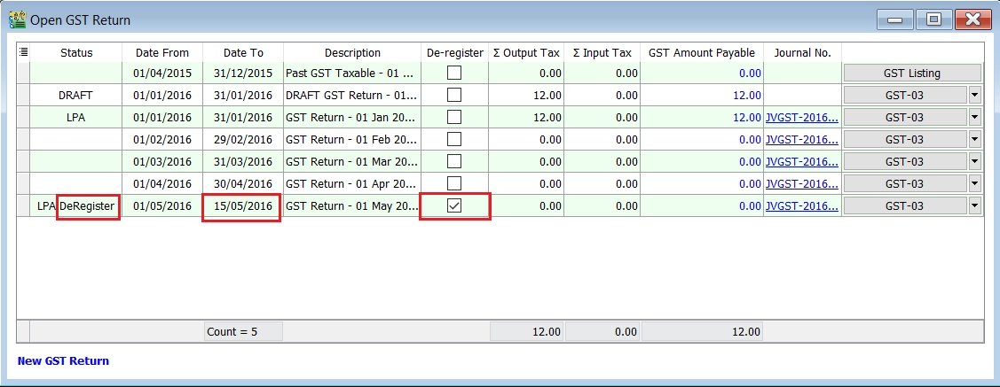
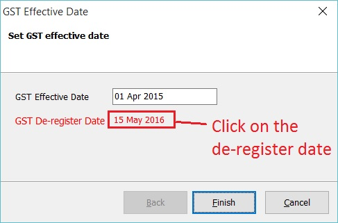
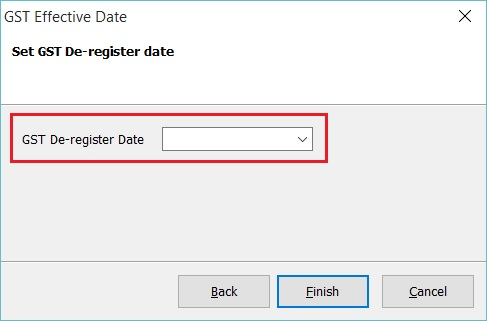
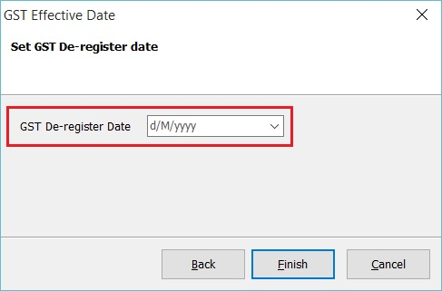

## GST Count Down Timer

This is a countdown timer for the submission of the GST Return. It is generally displayed 7 days before the GST Return due date.

**Example GST Count Down Timer:**

### Formula

Visible := (Return Due - Today Date - 1) < 7

### Example

Frequently : Monthly

Next Submission : Nov 2016

Count Down begin shown : 24 Dec 2016

Today date : 27 Dec 2016

Count Down Shown : 3 Days+++

## GST Effective Date

### Register

Enable to set the GST start date (register) and end date (de-register).

1. Below the screenshot is the Start GST wizard, you are required to set the GST Effective Date.

   

2. You can check the GST Effective Date under the menu GST | GST Effective Date...

   

   | Field Name                     | Field Type | Explanation                           |
   |--------------------------------|------------|---------------------------------------|
   | GST Effective Date             | Date       | GST start date.                       |
   | I want to de-register from GST | Boolean    | To set de-register date from GST.     |

### De-register

1. At the GST effective date screen, tick on I want to de-register from GST.

   

2. Next', type-in the de-register date. Let's assume ABC Sdn Bhd ceased to be a registered person on 15 May 2016.

   

3. Click Finish to confirm the de-register date.
4. GST De-register Date : 15 May 2016 will displayed below the GST effective date. See the screenshot below.

   

5. Click **Finish** to exit.

:::note Tips:

You can found the De-Register markings in the GST Returns. See the screenshot below.

:::

### Cancel De-Register

1. At the GST effective date screen, click on the **De-Register Date**.

   

2. Leave the De-Register date **blank** or become **d/M/yyyy**. See the screenshot below.

   
   

3. Click **Finish** to confirm remove the de-register date.
