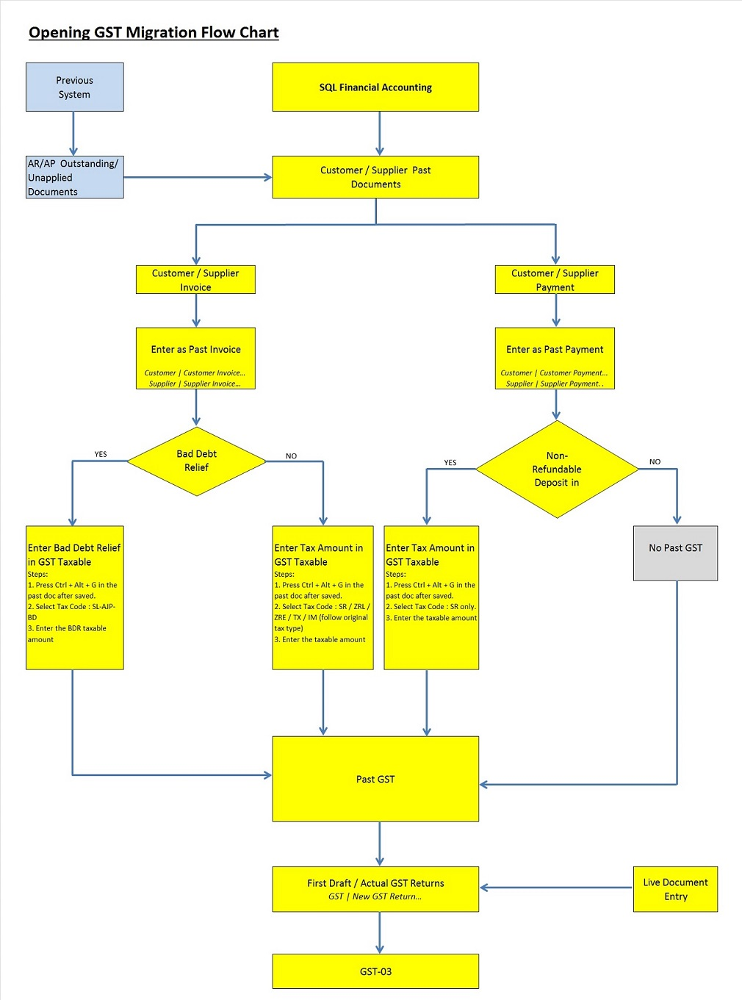
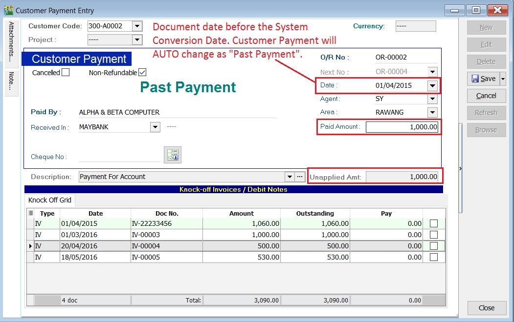
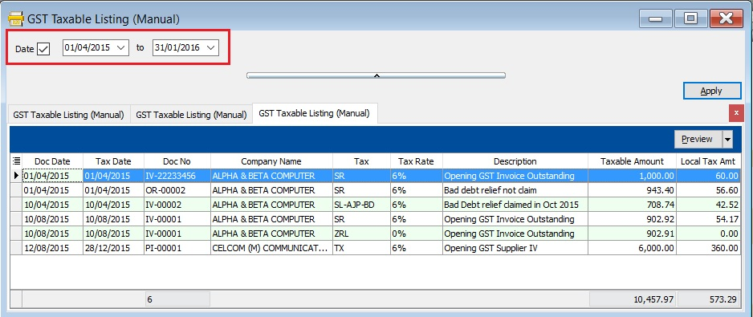
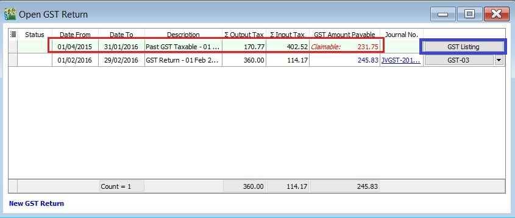
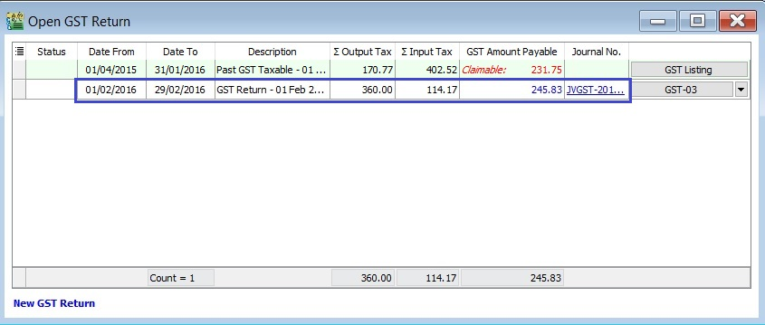
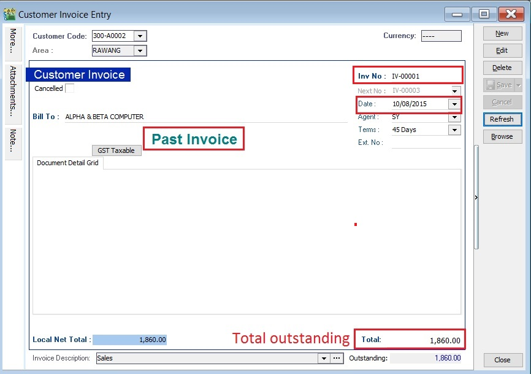
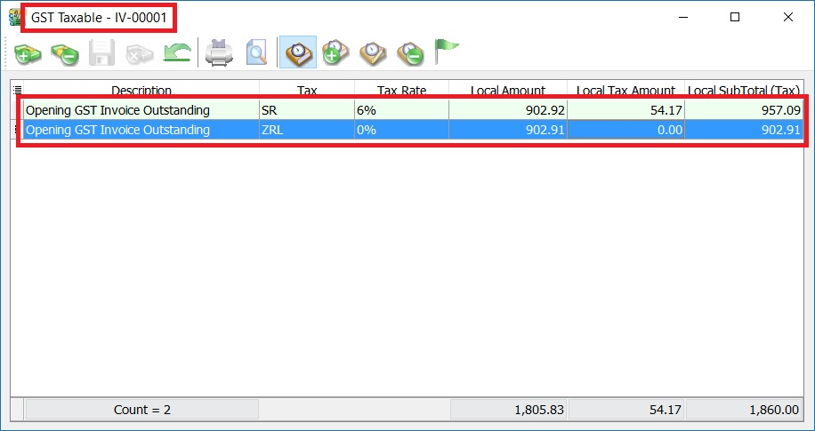
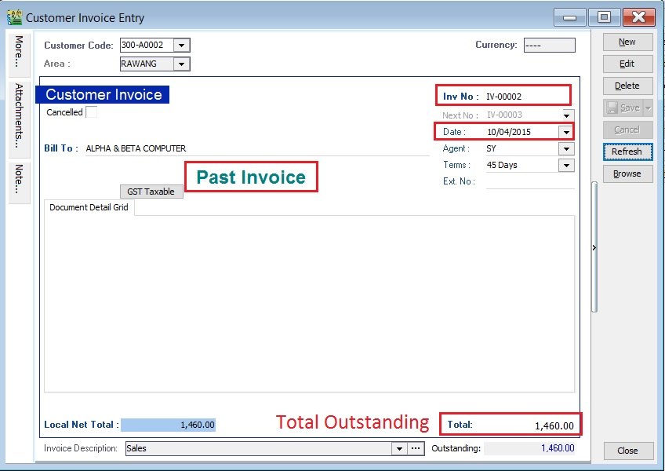

## Migration System Features

### GST Past Documents Opening Balance for Customer and Supplier

This guide will teach you the way to handle the past outstanding documents for Customer and Supplier from previous accounting system. We are ensure that the data migration part go smooth with GST matters happened in previous system likes bad debt relief and non-refundable deposit.

**Overview of the GST Past Documents for Customer and Supplier:**

### How to enter GST Past Documents?

#### Financial Start Period and System Conversion Date

1. Let's say the company GST reporting period is **Monthly**. Under the Tools | Options... set the following:-
   **Financial Start Period** : 01 Jan 2016
   **System Conversion Date** : 01 Feb 2016 (Cut-off Date for Opening Entry)

   :::note NOTE:

   It is not recommended to set the System Conversion Date fall within the quarterly GST reporting period.
   Let's say the company GST reporting period is Quarterly.

                         GST effective date : 01 April 2015

   You should set the System Conversion Date: 01 April 2016 or next quarter start date (ie. 01 July 2016).
   :::

2. See below screenshot:

   

#### GST Effective Date (Bad Debt Relief)

1. Let's assume the company is GST registered at 01 April 2015.
2. See below screenshot:

   

   :::note Important:

   It is very important to set the GST Effective Date where the GST commerce date started.
   Bad debt relief will based on the GST Effective date.

   For example,  **GST effective date set on 1 April 2015** and **system conversion date is 1 Jan 2016**.
   Pass document dated in 15 July 2015 **(it is after the GST effective date)**.
   Therefore, the Bad Debt Relief will be process in GST Returns-Jan 2016 automatically.

   :::

#### Enter the Past Documents (AR & AP)

1. Create new customer/supplier invoice.
2. Enter the **Invoice No**.
3. Enter the **Original Invoice Date**. Date before the system conversion date, the document will converted to "Past Invoice" automatically.
4. Enter the **Outstanding Invoice Balance** into Total.
5. Save it.
6. See screenshots below.

   **Screenshot 1: Past Invoice:**

   

   **Screenshot 2: Past Payment:**

   

7. Take note to the below table.

   | Action                                                               | Where to Enter?                                                                 |
   |----------------------------------------------------------------------|---------------------------------------------------------------------------------|
   | To enter the Customer Past Tax Invoice                               | a. Go to Customer / Customer Invoice...                                         |
   |                                                                      | b. Refer the above step 1.                                                      |
   | To enter the Supplier Past Tax Invoice                               | a. Go to Supplier / Supplier Invoice...                                         |
   |                                                                      | b. Refer the above step 1.                                                      |
   | To enter the Customer Past Non-Refundable Deposit (for SR, ZRL, ZRE) | a. Customer / Customer Payment...                                               |
   |                                                                      | b. Refer the above step 1.                                                      |
   |                                                                      | c. Tick the Non-Refundable checkbox (for SR only).                              |
   |                                                                      | d. Un-tick the Non-Refundable checkbox (for ZRL & ZRE).                         |

#### Enter the GST Taxable for Past Documents (AR & AP)

1. Open the past tax invoice document.
2. **Press CTRL + ALT + G**.... You able to assign the tax code (SR / ZRL / ZRE / TX / IM...etc), the taxable amount (eg. Rm 1,000.00) and the tax amount (eg. Rm 60.00) for past document.

   :::note Note:

   Document must be saved before **press CTRL + ALT + G**.

   :::

3. Save it.
4. See screenshot below.

   **Screenshot 3: GST Taxable:**

   

5. Take note to the below table.

   | Action                                                          | Where to Enter?                                                                                                                   |
   |-----------------------------------------------------------------|-----------------------------------------------------------------------------------------------------------------------------------|
   | To enter GST Taxable for the Customer Past Tax Invoice          | a. Go to Customer / Customer Invoice...                                                                                           |
   |                                                                 | b. Refer the above step 1.                                                                                                        |
   |                                                                 | c. Tax code commonly apply to this matter is SR / ZRL / ZRE / SL_AJP-BD (for bad debt relief claimed as input tax in old system). |
   | To enter GST Taxable for the Supplier Past Tax Invoice          | a. Go to Supplier / Supplier Invoice...                                                                                           |
   |                                                                 | b. Refer the above step 1.                                                                                                        |
   |                                                                 | c. Tax code commonly apply to this matter is TX / IM / PH_AJS-BD (for bad debt relief paid as output tax in old system).          |
   |To enter GST Taxable for the Customer Past Non-Refundable Deposit| a. Go to Customer / Customer Payment...                                                                                           |
   |                                                                 | b. Refer the above step 1.                                                                                                        |
   |                                                                 | c. Tax code commonly apply to this matter is SR.                                                                                  |

#### Past Documents GST Taxable Listing

1. Select the date range to apply.

   > *date from* (GST effective date) and *date to* (before the system conversion date).

2. See screenshot below.

   Screenshot 4: GST Taxable Listing:

   

### GST Returns

1. Select the date range. See screenshot below.

   1. Monthly (eg. 01/02/2016 - 29/02/2016)

      

   2. Quarterly (eg. 01/02/2016 - 30/04/2016)
   
      

2. Click to **Process**.

3. **Past GST transactions** will generated automatically after click **Process**. See below screenshot.

   

   :::note Tips:

   To check the past GST listing, click on **GST Listing** button.

   :::

4. Current GST Returns will be processed at the same times. See below screenshot.

   

### Special Cases

#### Case 1: Claim bad debt relief based on the outstanding in SQL Accounting

1. Old System
    1. invoice
       Invoice No: **IV-00001**
       Invoice Date: **10 Aug 2015**
       Invoice Doc Amount: **2,060.00**
       Invoice Details:

       | Tax     | Local Amount | Local Tax Amount | SubTotal |
       |---------|--------------|------------------|----------|
       | SR      | 1,000.00     | 60.00            | 1,060.00 |
       | ZRL     | 1,000.00     | 0.00             | 1,000.00 |
       |**Total**|              |                  | 2,060.00 |

    2. Payment
        OR Date: **20 Aug 2015**
        Knock-Off Amount: **200.00**

    3. Invoice Outstanding: **1,860.00**

2. SQL Account
   1. Past Invoice:
       Past Invoice No: **IV-00001**
       Past Invoice Date: **10 Aug 2015**
       Past Invoice Total: **1,860.00**

      :::note NOTE:

      User should key-in the total outstanding in the Past Invoice, eg. 2,060.00 - 200.00 = **1,860.00**.

      :::

      See example of **past invoice** in below screenshot.

      

   2. Past GST Taxable Detail:

      | Tax | Taxable Amount | Local Tax Amount | SubTotal |
      |-----|----------------|------------------|----------|
      | SR  | 902.92         | 54.17            | 957.09   |

      OR

      | Tax   | Taxable Amount | Local Tax Amount    | SubTotal   |
      |-------|----------------|---------------------|------------|
      | SR    | 902.92         | 54.17               | 957.09     |
      | ZRL   | 902.91         | 0.00                | 902.91     |
      |       |                |**Total Outstanding**|**1,860.00**|

      See example of **past GST taxable** in below screenshot.

      

#### Case 2: Bad debt relief claimed and partial recover in Old System; partial or fully recover in SQL Account

1. Old System
    1. Invoice:

       Invoice No: **IV-00002**
       Invoice Date: **10 April 2015**
       Invoice Doc Amount: **2,060.00**
       Invoice Details:

       | Tax   | Local Amount | Local Tax Amount | SubTotal   |
       |-------|--------------|------------------|------------|
       | SR    | 1,000.00     | 60.00            | 1,060.00   |
       | ZRL   | 1,000.00     | 0.00             | 1,000.00   |
       |       |              |**Total**         |**2,060.00**|

    2. Payment #1:

       OR Date: **20 April 2015**
       Knock-Off Amount: **200.00**
       Bad Debt Relief detail from outstanding invoice:

       | Tax    | Local Amount | Local Tax Amount |
       |--------|--------------|------------------|
       | AJP-BD | 902.92       | 54.17            |

    3. Payment #2:

       OR Date: **01 Nov 2015**
       Knock-Off Amount: **400.00**
       Bad Debt Recover details:

       | Tax    | Local Amount | Local Tax Amount |
       |--------|--------------|------------------|
       | AJS-BD | 194.18       | 11.65            |

    4. Invoice Outstanding: 1,460.00

2. SQL Account
    1. Past Invoice:

        Past Invoice No: **IV-00002**
        Past Invoice Date: **10 April 2015**
        Past Invoice Total: **1,460.00**

       :::note Note:

       User should key-in the total outstanding in the Past Invoice, eg. 2,060.00 - 200.00 - 400.00= **1,460.00.**

       :::

       See example of **past invoice** in below screenshot.

       

    2. Past GST Taxable Detail:

       | Tax       | Taxable Amount | Local Tax Amount | SubTotal |
       |-----------|----------------|------------------|----------|
       | SL-AJP-BD | 708.74         | 42.52            | 751.26   |

      :::note NOTE:

      User no need to key-in the payment #1 and payment #2 in SQL Account.
      Outstanding Taxable amount = 902.92 (Payment #1) - 194.18 (Payment #2) = **708.74**
      Bad debt relief not recover = 54.17 (Payment #1) - 11.65 (Payment #2) = **42.52**
      **Any current payment knock-off to the above invoice will automatically treat as bad debt recover in next taxable period**.

      :::

      See example of **past GST taxable** in below screenshot.

      
