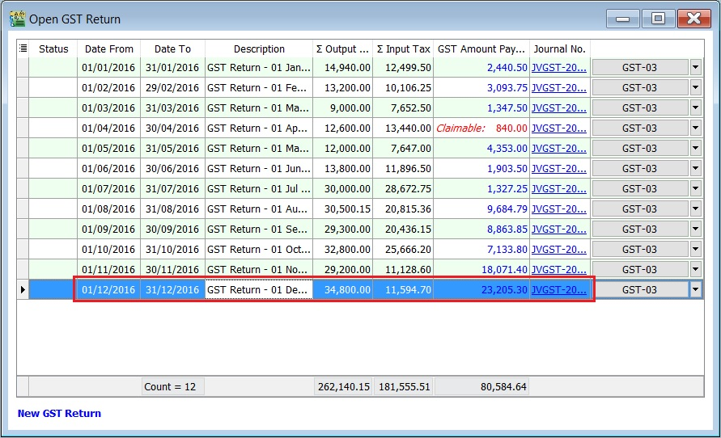

To set the tax year and longer period adjustment (LPA).

## Set Tax Year

1. Highlight the final taxable period to be set as your **First Tax Year**, eg. final taxable period 01 Dec - 31 Dec 2016.

   

2. Double click on the GST Returns highlight in step 1.
3. System will prompt you a dialog box.
4. Tick on the **Tax Year** to set a tax year point. See the screenshot below.

   

5. Click **Save**.

   

6. You can insert a column **Tax Year**, eg. Tax Year point set at 31 Dec 2016.

   

   :::note **Note:**

   You can direct set the tax year without delete/purge the GST Returns.

   :::

## Longer Period Adjustment (LPA)

Declaration of annual adjustment amount:

- Regulation 43 – in a GST Return for the second taxable period next following the longer period.
For example,
Assumed the tax year set on 31 Dec 2016, LPA should be declared in:

   1) For **monthly taxable period** , the second taxable period is **Feb 2017** and the submission is before or on 31/3/2017
   2) For **quarterly taxable period**, the second taxable period is **Apr-Jun 2017** and the submission is before or on 31/7/2017

### GST Returns

1. Process the GST Return.For example, process the **Second Taxable Period** (01/02/2017 - 28/02/2017).
2. LPA will tick automatically.(**if you have set the tax year**)

   

3. Suggested period to be adjusted for LPA.

   

   :::note **Note:**

   User allow to overwrite the suggested period for Longer Period.

   :::

4. You can insert the **LPA Date From** and **LPA Date To** columns to check.

   

### GST Listing - Mixed Supplies

For report printing [refer to this link.](../../usage/gst/gst-report.md#longer-period-adjustment-lpa)
