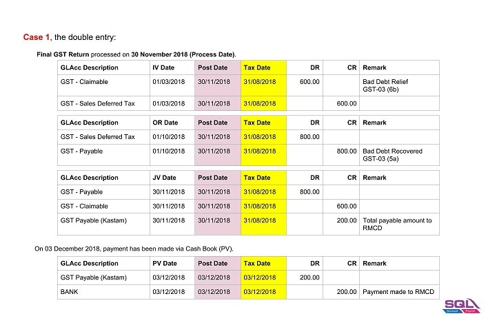
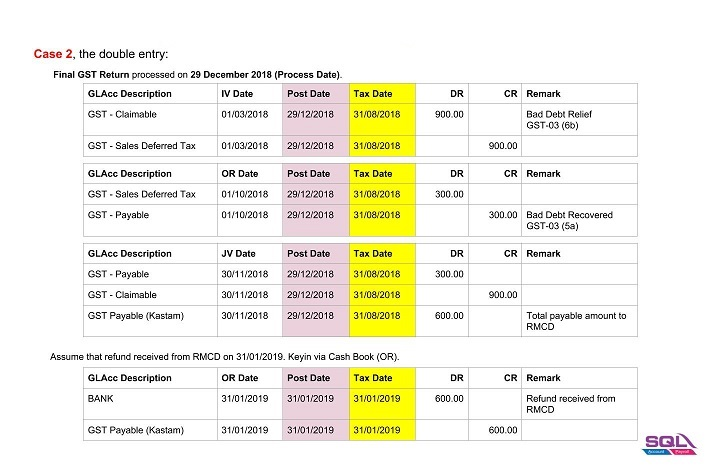

## Bad Debt Relief / Recovered

1. GST registered person is eligible to claim the bad debt relief even if it spans on or after 1 September 2018.
2. Bad Debt Relief is allowed to be claimed within 120 days from the SST effective date (eg. 1 September 2018).
3. Bad Debt Recovery made on or after 1 September 2018 must to be paid as output tax to RMCD within 120 days from the SST effective date by amending the Final GST Return.

### Final GST Return Processor

1. System will AUTO define the last taxable period **(A)**, eg...

   | Process From | Process To |
   |--------------|------------|
   | 01/07/2018   | 31/08/2018 |

2. Set the Process Date **(B)** as the date submit the Final GST return before 29 December 2018 (within 120 days from the SST effective date).

   1. For example,

      

   2. Double entry for **Cases 1**.

      

   3. Double entry for **Cases 2**.

      
