## Import Goods (IM)

IM - "Import of goods with GST incurred". It means there is an input tax claimable. Tax rate is 6%.

Purchase of goods from oversea supplier, the supplier invoice received will not incurred GST. However, the GST will be taken place when the goods are discharged out from the port to forwarder warehouse or direct to the buyer. Custom will incurred the GST on the total value stated in K1 form.

### GST Importation of Goods (IM)

#### Tax Code for Importion of Goods

You can found the following tax code available in SQL Financial Accounting.

| **Tax Code** | **Description**                                                    | **Tax Rate %** |
|--------------|--------------------------------------------------------------------|----------------|
| IM-0         | Import of goods with no GST incurred (for Foreign Supplier Account)| 0%             |
| IM           | Import of goods with GST incurred                                  | 6%             |

#### Oversea Supplier Invoice

1. Create the oversea supplier invoice at Purchase Invoice.
2. Select the tax code “IM-0”. Tax amount = 0.00

   

### Received Forwarder Notification from K1 /Invoice

Let's say in the K1 form details:-

| Description              | Amount (MYR) | Calculation                  |
|--------------------------|--------------|------------------------------|
| Goods Value (A)          | 1,155.00     | USD300 × 3.8500              |
| Custom Duty (B) (5%)     | 57.75        | RM1,155 × 5%                 |
| Total Taxable Amount (C) | 1,212.75     | A + B                        |
| **GST - IM**             | **72.77**    | **C × 6% = RM1,212.75 × 6%** |

Usually, the forwarder will invoice to the principal company for the following details:-

| Description                        | Net (MYR) | GST   | Gross (MYR) |
|------------------------------------|-----------|-------|-------------|
| Est. Duties (Import &/ Excise Duty)| 57.75     |       |             |
| Est. GST Import (RM1,212.75 × 6%)  | 72.77     |       |             |
| **Est Duties + GST Import**        | **130.25**|       | **130.52**  |
| Duty Processing Fee                | 100.00    | 6.00  | 106.00      |
| **Total Payable**                  |           |       | **236.52**  |

:::note NOTE :

GST Import can be calculated in different way. It might based on total weight (ie. weight x container) or total meter square (ie,meter square x container).
For example,
GST Import = 30,000m2 x 10 containers x 6% = RM18,000.00

:::

### Forwarder Invoice Entry (Purchase Invoice)

1. Select the forwarder supplier code in Purchase Invoice.
2. Insert the following fields:-

    - **Tax Amount**
    - **Local Tax Amount**
    - **Import Purchase Amt (GST Import input)**
    - Import Curr Code (for display only)
    - Import Curr Rate (for display only)

   

3. Click on the side button in the Import Purchase Amt column. See screenshot below.

   

4. You have to input the info according to 2.3. Received Forwarder Notification from K1 /Invoice example.

   | Field Name         | Input Value | Explanation                                            |
   |--------------------|-------------|--------------------------------------------------------|
   | Currency Code      | USD         | Currency of the goods purchased                        |
   | Currency Rate      | 3.85        | Follow K1 exchange rate                                |
   | Purchase Amount    | 300.00      | Goods foreign value as stated in K1                    |
   | Custom Local Amount| 1,212.50    | Follow K1 total taxable amount                         |
   |                    |             | = Purchase Amount + Custom Duty + Excise Duty (if any) |
   | Tax                | IM 6%       | Import GST at 6%                                       |
   | Tax Amount         | 72.77       | = 1,212.75 × 6%                                        |
   | Permit No          | K1-3232323  | Key-in the K1 number                                   |

   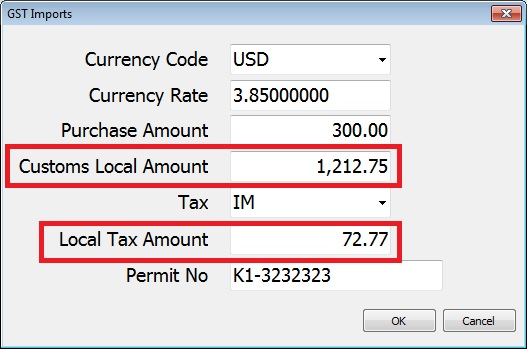

5. After press OK to exit the GST Import screen, the purchase invoice item description will be updated as “Purchase Value USD 300.00@3.8500 = RM 1,155.00, Permit No: K1-32323232” from the GST Import entered.

6. Below is the sample of Forwarder invoice entry.

    

In summary:

| Line # | Description                        | Sub Total | Tax  | Tax Amount | Sub Total (Tax) |
|--------|------------------------------------|-----------|------|------------|-----------------|
| 1      | Est. Duties (Import &/ Excise Duty)| 57.75     | IM-0 | 0.00       | 57.75           |
| 2      | Est. GST Import (RM1,212.75 × 6%)  | 0.00      | IM   | 72.77      | 72.77           |
| 3      | Duty Processing Fee                | 100.00    | TX   | 6.00       | 106.00          |
|        | **Total Payable**                  |           |      |            | **236.52**      |

### Other Supporting Documents Related to Import

All imported goods, both dutiable or not, must be declared in the prescribed forms and be submitted to the customs station at the place of import. The prescribed forms are the following:

1. Customs Form no. 1 (**K1**): Declaration of goods imported
    - Import for dutiable and non-dutiable goods.
2. Customs Form no. 2 (**K2**): Declaration of goods to be exported
    - Export for dutiable and non-dutiable goods.
3. Customs Form no. 3 (**K3**): Application/ Permit to transport goods within the Federation/Malaysia
    - Import & Export of dutiable and non-dutiable goods within Malysia
4. Customs Form no. 8 (**K8**): Application/ Permit to tranship/remove goods
    - Declaration of duty not paid goods
        1. By rail - Pasir Gudang declared K8 to rail the containers from Pasir Gudang to Port Klang without paying the duty. Port Klang declared K1 to clear the containers by paying duty. (Dutiable cargo)
        2. Transhipment - From one port tranship from another port. K8 can move container from westport to northport and vice versa without paying duty.

5. Customs Form no. 9 (K9): Requisition/ Permit to remove dutiable goods from customs control
    - Clear dutiable cargo slowly out from bonded warehouse. K8 declares for the container truck into bonded warehouse and K9 clears the cargo partial by partial out from the warehouse probably due to high duty charges.

Supporting documents for the declaration forms are as follows:

1. Delivery order
2. Packing list
3. Original invoice
4. Bill of lading
5. Certificate of origin
6. Import licenses which may be required by a proper officer of customs

## Apporved Trader Scheme

**Approved Trader Scheme (ATS)** is a special schemes are introduced to relieve GST payment on importation of goods.

Section 71 under ATS,

1. ATS participants are allowed to suspend GST on the importation of goods.
2. Goods imported is used in the course or furtherance of business.
3. The amount of GST suspended needs to be declared in the GST return (for the taxable period to which the suspension relates).

Persons eligible for ATS

1. Companies located within Free Industries Zone (FIZ)
2. Licensed Manufacturing Warehouse (LMW)
3. International Procurement Centre (IPC)
4. Regional Distribution Centre (RDC)
5. Toll manufacturers under ATMS
6. Jewellery manufacturers under AJS
7. Companies with turnover above RM25 million and at least 80% of their supplies made are zero-rated; or
8. Any other person approved by the Minister.

### ATS

#### Tax Code for ATS

| Tax Code | Description                                                                                                                                                                                                                                                                                                                                                            | Tax Rate % |
|----------|------------------------------------------------------------------------------------------------------------------------------------------------------------------------------------------------------------------------------------------------------------------------------------------------------------------------------------------------------------------------|------------|
| IS       | Imports under special scheme with no GST incurred. This refers to goods imported under the Approved Trader Scheme (ATS) and Approved Toll Manufacturer Scheme (ATMS), where GST is suspended when the trader imports the non-dutiable goods into Malaysia. These two schemes are designed to ease the cash flow of ATS and ATMS traders, who have significant imports. | 0%         |

#### Purchase Invoice For ATS

1. Create the oversea supplier invoice at Purchase Invoice.
2. You are required to key-in the Import Declaration No. (eg. K1 or K9) into Permit No column. This import declaration no will be appear in GAF file.
3. Select the tax code = IS. Tax amount = 0.00
4. Taxable Amount (local value) should entered as:

   > **GST Value** = Customs Value (CIF) + any customs duty paid + any excise duty paid

   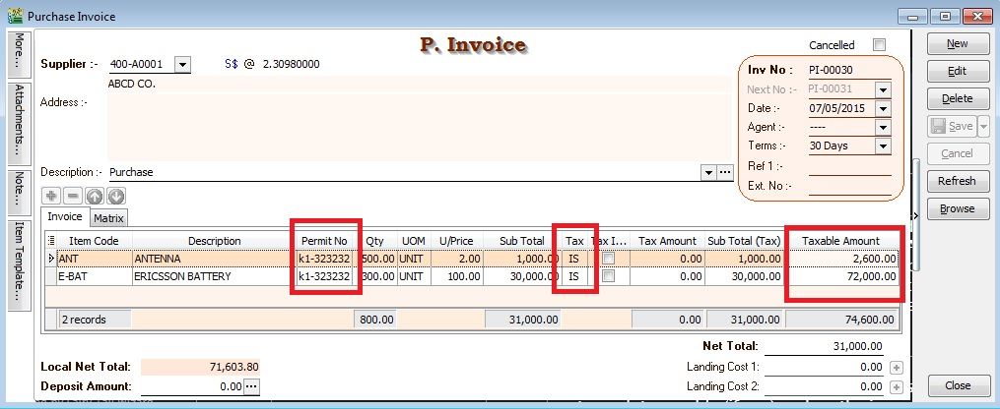

#### GST Return Process

1. Process the month GST Return.
2. GST03 item no 14 will be fill-up with the Taxable Amount from the purchase invoice item with tax code “IS”.
3. GST03 Item no 15 = Taxable Amount (local value) x 6%
4. For example, below screenshot:-

   > **GST03 Item no 15** = 74,600.00 x 6% = 4,476.00

   

## Non-Refundable Deposit

How to enter the non-refundable deposit accounted to **Standard Rated** (SR) and **Zero Rated**(ZRL & ZRE) to reflect in GST-03 submission?

This guide will help you out. All non-refundable deposit amount are inclusive tax.

| Type of supplies       | Tax Rate | GST-03                                                                 |
|------------------------|----------|------------------------------------------------------------------------|
| Standard Rated (SR)    | 6%       | 1. Total Value of Standard Rated Supply (5a)                           |
|                        |          | 2. Total Output Tax (5b)                                               |
| Zero Rated (ZRL & ZRE) | 0%       | 1. Total Value of Local Zero Rated Supplies                            |
|                        |          | 2. Total Value of Export Supplies                                      |

### Customer Payment

#### Non-Refundable (SR)

1. Create **New Customer Payment**.
2. Enter the **Paid Amount**, eg. Rm10,000.00
3. **Tick Non-Refundable** for **GST not equal to 0%**.
4. See the screenshot below.

   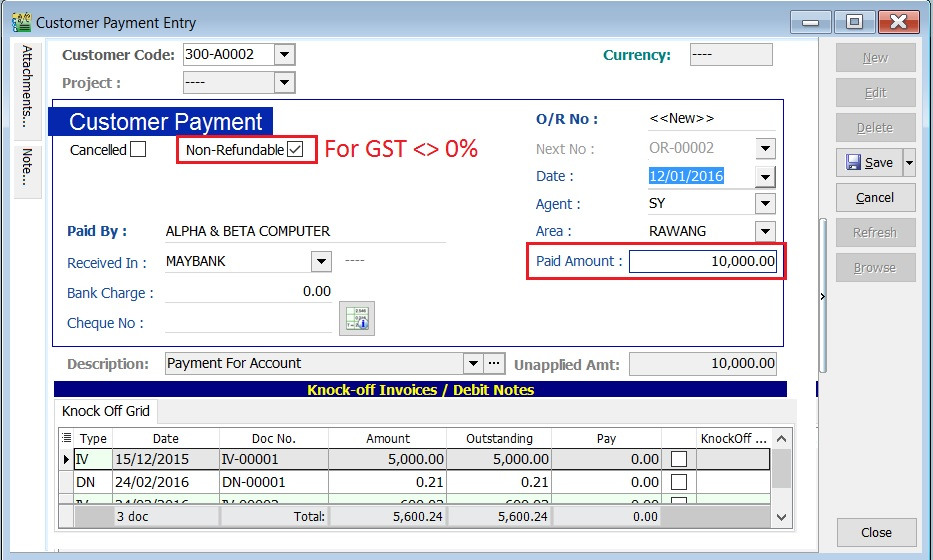

5. Process GST Returns (GST | New GST Returns...).
6. Print the GST-03.

   **GST-03 results:-**

   | GST-03 Item | Description                                                                        | Local Amount |
   |-------------|------------------------------------------------------------------------------------|--------------|
   | 5a          |Total Value of Standard Rated Supply                                                | **9,433.96** |
   | 5b          |Total Output Tax (Inclusive of Tax Value on Bad Debt Recovered & other Adjustments) | **566.04**   |

7. See the GST-03 screenshot below.

   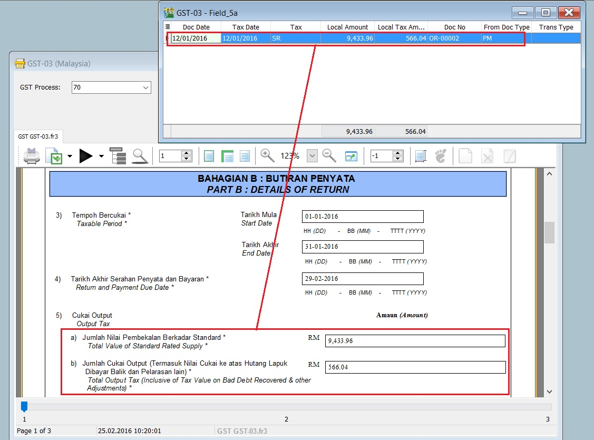

#### Non-Refundable (ZR)

1. Create **New Customer Payment**.
2. Enter the **Paid Amount**, eg. Rm25,000.00 (USD6,000.00)
3. Ensure the **Non-Refundable checkbox** is **Untick** for **GST equal to 0%**, eg. ZRL and ZRE.
4. Press **CTRL + ALT + G**.
5. Enter the tax transactions. See the **GST Taxable** detail in the screenshot below.

   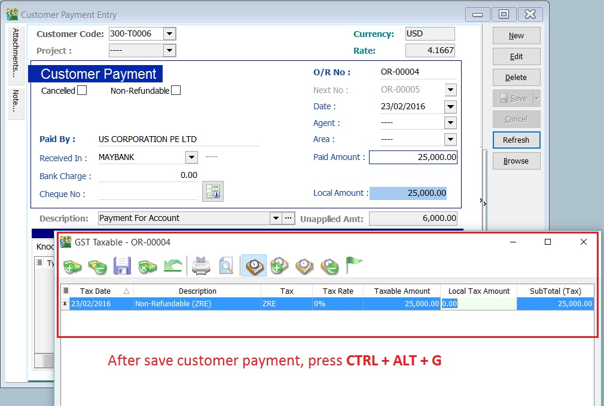

6. Process GST Returns (GST | New GST Returns...).
7. Print the GST-03.

   **GST-03 results:-**

   | GST-03 Item | Description                          | Local Amount |
   |-------------|--------------------------------------|--------------|
   | 11          | Total Value of Export Supplies (ZRE) | 25,000.00    |

8. See the GST-03 screenshot below.

   

## GST-03 item 16 Capital Goods Acquired for Purchase of machinery from Oversea

### Case 1 : Purchase of Machinery (Fixed Asset) From Overseas

Let's say the oversea supplier has sent the bill amount USD15,000 (USD15,000 x 4.2 = Rm63,000 will recorded in the Account Book).
Understand that Custom will use GST valuation to compute the GST amt and stated in K1 form. Assume that GST Valuation after custom duty = Rm75,000 and GST amt Rm75,000 x 6% = Rm4,500.

**Question:**
Which amount should I reported in GST-03 item 16 Capital Goods Acquired? Rm63,000 or Rm75,000?

**Answer from RMCD:**
GST-03 item 16 Capital Goods Acquired = Rm75,000.

### How to handle this in SQL Accounting?

1. Oversea supplier bill enter at purchase/supplier invoice as usual.

   | Account          | Local DR  | Local CR  |
   |------------------|-----------|-----------|
   | Machinery        | 63,000.00 |           |
   | Oversea supplier |           | 63,000.00 |

2. When it comes to the forwarder bill after declaring the import goods, you must follow our GST Import Goods guideline. Refer to this link [1](../../usage/gst/gst-treatment.md#import-goods-im).

3. You just have to select Fixed Asset Account at the item line updated from the GST Imports screen. (**Don't worry, Rm75,000 fixed asset will not post into your account book**). See the screenshot attached.

   

   :::note NOTE:

   For GST-03 purpose, this is to report into item 16 Capital Goods Acquired for the import of machinery value as stated in the K1 form. Your account book still recorded as Rm63,000 in step 1.

   :::

## Free Industrial Zone(FIZ) and Licensed Manufacturing Warehouse(LMW)

This guide will teach you the way to key-in the data entry related to GST treatment on FIZ and LMW.
Under GST system, a person operating in a FIZ or having LMW status is treated as any person carrying out a business in Malaysia where normal rules of GST apply. This means that acquisition of goods locally or imported by the person operating in a FIZ or having LMW status is subject to GST. However, the person operating in a FIZ or having LMW status is eligible to apply for Approved Trader Scheme (ATS) to allow the Director General to suspend the payment of GST on imported goods at the time of importation. For further details, please refer to the guide on Approved Trader Scheme (ATS) and [SQL Accounting on ATS](http://www.sql.com.my/document/sqlacc_docs/PDF/GST36-Input_Entry_for_ATS.pdf)

Subject to GST:

1. Based on **transaction value**. GST = transaction value x (SR or ZR) %:

    1. FIZ Local sell to FIZ Local → SR
    2. FIZ local sell to LMW Local → SR
    3. FIZ/LMW Local sell to Oversea → ZR

2. Based on **the value of imported goods**. GST = (Custom Value + Import Duty) x SR %:

    1. FIZ/LMW local sell to non-FIZ/LMW → SR

   For example (**FIZ/LMW local sell to non-FIZ/LMW**),

   | Item | Item Description | Qty     | Unit Price (RM) | Value (RM) | Import Duty (RM) |
   |------|------------------|---------|-----------------|------------|------------------|
   | 1    | Shirts           | 300 pcs | 25.00           | 7,500.00   | **1,500.00**     |
   | 2    | Paints           | 100 pcs | 30.00           | 3,000.00   | **600.00**       |
   |      |                  |         |    **Total**    | 10,500.00  | **2,100.00**     |

   ***Assuming 20% import duty (RM10,500 x 20% = 2,100.00)***

   GST on value + Import Duty are subject to GST (SR) = (10,500.00 + 2,100.00) x 6% = **756.00**

   Therefore, the Tax Invoice will be presented as per below:

   | Item | Item Description     | Qty     | Unit Price (RM) | Value (RM) |
   |------|----------------------|---------|-----------------|------------|
   | 1    | Shirt                | 300 pcs | 25.00           | 7,500.00   |
   | 2    | Paints               | 100 pcs | 30.00           | 3,000.00   |
   |      | GST (SR-6%)          |         |                 | 756.00     |
   |      | Total Amount Payable |         |                 | 11,256.00  |

### How to enter the Tax Invoice if there is a FIZ/LMW transaction to another party?

According to the example mentioned in above.

1. Insert and select the stock items sold with empty tax code. Because the stock items are under FIZ/LMW control.

   | Item Code | Description | Qty     | Unit Price | Subtotal | Tax Code | Tax Amount | SubTotal (Tax) |
   |-----------|-------------|---------|------------|----------|----------|------------|----------------|
   | SHIRT     | SHIRTS      | 300 pcs | 25.00      | 7,500.00 |   BLANK  | 0.00       | 7,500.00       |
   | PAINTS    | PAINTS      | 100 pcs | 30.00      | 3,000.00 |   BLANK  | 0.00       | 3,000.00       |

2. Inser new row and enter the GST on total supply value (Rm7500 + Rm3000 = Rm10,500) direct into Taxable Amount column (C1)

   | Description              | Taxable Amount | Tax Code | Tax Amount | SubTotal(Tax) |
   |--------------------------|----------------|----------|------------|---------------|
   | GST on value Rm10,500.00 | 10,500.00      | SR       | 630.00     | 630.00        |

   

   :::note NOTE :

   A1 : Key-in "GST on value" into description.

   B1 : Must select tax code.

   C1 : Key-in the Total Supply Value into Taxable Amount.

   :::

3. Insert new row and enter the GST on total Import Duty (Rm1,500 + Rm600.00 = Rm2,100) direct into Taxable Amount column (C2)

   | Description              | Taxable Amount | Tax Code | Tax Amount | SubTotal(Tax) |
   |--------------------------|----------------|----------|------------|---------------|
   | GST on Import Duty 20%   | 2,100.00       | SR       | 126.00     | 126.00        |

   

   :::note NOTE :

   A2 : Key-in "GST on Import Duty" into description.

   B2 : Must select tax code.

   C2 : Key-in the Total Import Duty value into Taxable Amount.

   :::

### GST Return (FIZ and LMW)

1. Process GST Return for the month
2. Click on print GST-03

   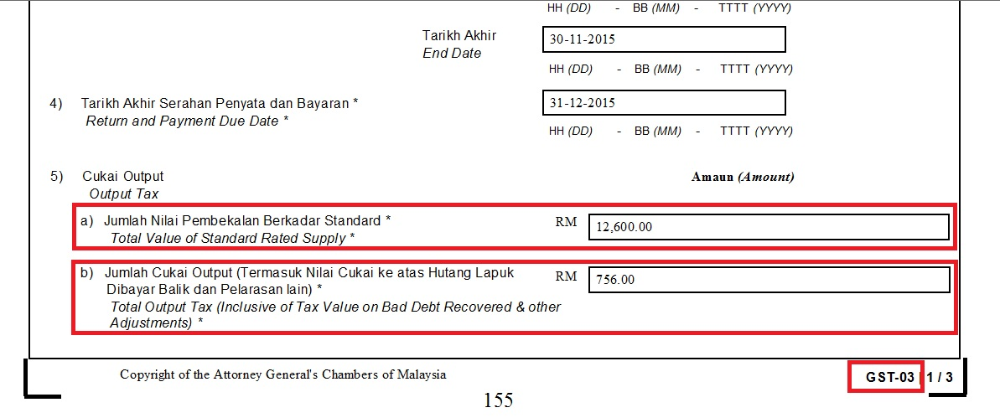

:::note RESULTS :

5a Total value of supplies = 12,600.00

5b total output tax = 756.00
:::

## Construction Business

This guide will teach you the way to enter the tax invoice to the Developer from Main Contractor.
Time to account for GST is at the either of the following:-

   1. when payment is received;
   2. when tax invoice is issued;
   3. if no tax invoice has been issued within 21 days after the certificate of work done is issued.

We have to look into and show the following items in order to calculate the GST amount in the Tax Invoice:

   1. Certified value - Progress claim value certified by Architect.
   2. Retention Amount - the amount of progress payment which is not paid until the conditions specified in the contract for the payment of such amounts have been met or until defects have been rectified.
   3. Progress payment

For example, the Progress Payment:-

| 1st interim certificate          | Amount (RM) | Calculation              |
|----------------------------------|-------------|--------------------------|
| Value of material and works (A1) | 30,000.00   |                          |
| Less: Retention Sum (B1)         | (1,500.00)  | RM30,000 × 5%            |
| **Amount Paid (excl GST)**       |**28,500.00**| A1 - B1                  |
| **GST Amount**                   |**1,710.00** | RM28,500 × 6% (SR)       |

| 2nd interim certificate           | Amount (RM) | Calculation             |
|-----------------------------------|-------------|-------------------------|
| Value of material and works (A2)  | 90,000.00   |                         |
| Less: Retention Sum (B2)          | (4,500.00)  | RM90,000 × 5%           |
| Less: 1st Interim Certificate (C2)| (28,500.00) |                         |
| **Amount Paid (excl GST)**        |**57,000.00**| A2 - B2 - C2            |
| **GST Amount**                    |**3,420.00** | RM57,000 × 6% (SR)      |

| 3rd interim certificate           | Amount (RM) | Calculation             |
|-----------------------------------|-------------|-------------------------|
| Value of material and works (A3)  | 150,000.00  |                         |
| Less: Retention Sum (B3)          | (7,500.00)  | RM150,000 × 5%          |
| Less: 1st Interim Certificate (C3)| (28,500.00) |                         |
| Less: 2nd Interim Certificate (D3)| (57,000.00) |                         |
| **Amount Paid (excl GST)**        |**57,000.00**| A3 - B3 - C3 - D3       |
| **GST Amount**                    |**3,420.00** | RM57,000 × 6% (SR)      |

| 4th Interim Certificate             | Amount (RM)  | Calculation                  |
|-------------------------------------|--------------|------------------------------|
| Value of material and works (A4)    | 300,000.00   |                              |
| Less: Retention Sum (B4)            | (15,000.00)  | RM300,000 × 5%               |
| Less: 1st Interim Certificate (C4)  | (28,500.00)  |                              |
| Less: 2nd Interim Certificate (D4)  | (57,000.00)  |                              |
| Less: 3rd Interim Certificate (E4)  | (57,000.00)  |                              |
| **Amount Paid (excl. GST)**         |**142,500.00**| A4 – B4 – C4 – D4 – E4       |
| **GST Amount (6%)**                 | **8,550.00** | RM142,500 × 6% (SR)          |

Lastly, the **sum of retention** will be invoiced after the full inspection of work done.

| Retention Sum                  | Amount (RM) | Calculation         |
|--------------------------------|-------------|---------------------|
| 1st Interim Certificate (R1)   | 1,500.00    |                     |
| 2nd Interim Certificate (R2)   | 3,000.00    | RM4,500 – 1,500     |
| 3rd Interim Certificate (R3)   | 3,000.00    | RM7,500 – 4,500     |
| 4th Interim Certificate (R4)   | 7,500.00    | RM15,000 – 7,500    |
| **Total**                      |**15,000.00**|                     |
| **GST Amount (6%)**            | **900.00**  | RM15,000 × 6% (SR)  |

### Tax Invoice Entry

1. Click New.
2. Enter the detail as per below example screenshot.

#### Progress Billing

| Progress Billing | Value of Work Certified | Amount                          | Retention                  | Amount After Retention | GST Amount |
|------------------|-------------------------|---------------------------------|----------------------------|------------------------|------------|
| A1               | 30,000                  | 30,000 – 0 = 30,000             | 30,000 × 5% = 1,500        | 28,500                 | 1,710      |
| A2               | 90,000                  | 90,000 – 30,000 = 60,000        | 60,000 × 5% = 3,000        | 57,000                 | 3,420      |
| A3               | 150,000                 | 150,000 – 90,000 = 60,000       | 60,000 × 5% = 3,000        | 57,000                 | 3,420      |
| A4               | 300,000                 | 300,000 – 150,000 = 150,000     | 150,000 × 5% = 7,500       | 142,500                | 8,550      |
| **Total**        |                         |**Total Value of Work** = 300,000|**Total Retention** = 15,000| 285,000                | 17,100     |

***1st Interim - Tax Invoice***

   

***2nd Interim - Tax Invoice***

   

***3rd Interim - Tax Invoice***

   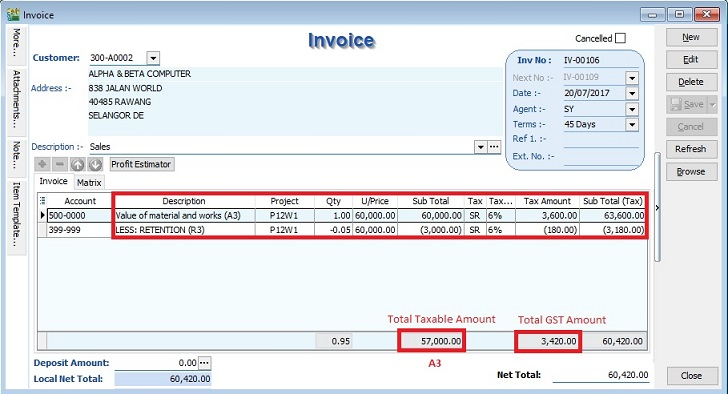

***4th Interim = Tax Invoice***

   

#### Retention Billing

| Progress Retention  | Retention | GST Amount |
|---------------------|-----------|------------|
| R1                  | 1,500     | 90         |
| R2                  | 3,000     | 180        |
| R3                  | 3,000     | 180        |
| R4                  | 7,500     | 450        |
| Total               | 15,000    | 900        |

***Total Retention - Tax Invoice***

:::note NOTE:

GL Account : 399-999 - Retention (Create under the Current Asset)

:::

### Value of Material and Works Report by Project

1. To check the total value of material and works balance report. See the screenshot below.
2. You can see the total value of material and works adjusted with **final result: Rm300,000.**

   

### Retention Report By Project

1. To check the retention balance report. See the screenshot below.
2. If the retention balance is zero, it means the full settlement of retention sum.

   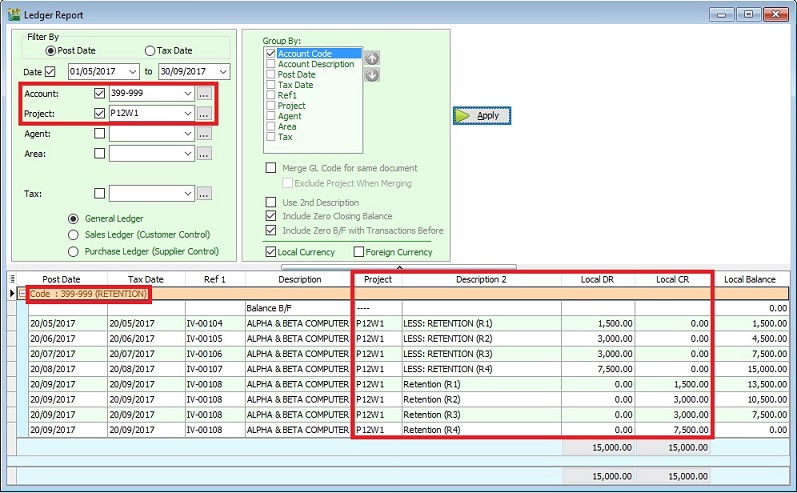

## Partial Exemption

This guide will explains how Partial Exemption, Apportionment and Annual Adjustment are made in respect of residual input tax which is attributable to both taxable and exempt supplies in SQL Financial Accounting.

### Tax Code for Partial Exemption

Source from the **GUIDE ON ACCOUNTING SOFTWARE ENHANCEMENT TOWARDS GST COMPLIANCE** dated **01 Aug 2016.**

| Tax Code | Tax Rate | Description                                                                                                                                             |
|----------|----------|---------------------------------------------------------------------------------------------------------------------------------------------------------|
| TX-ES    | 6%       | Purchase with GST incurred directly attributable to nonincidental exempt supplies. (**Note: Replace TX-N43**)                                           |
| TX-IES   | 6%       | Purchase with GST incurred directly attributable to incidental exempt supplies. (**Note: Replace TX-E43**)                                              |
| TX-RE    | 6%       | Purchase with GST incurred that is not directly attributable to taxable or exempt supplies. (Applicable for partially exempt trader/mixed supplier only)|
| IES      | 0%       | Incidental exempt supplies under GST legislations. (**Note: Replace ES43**)                                                                             |

### Partial Exemption Rules

**Flowchart:**

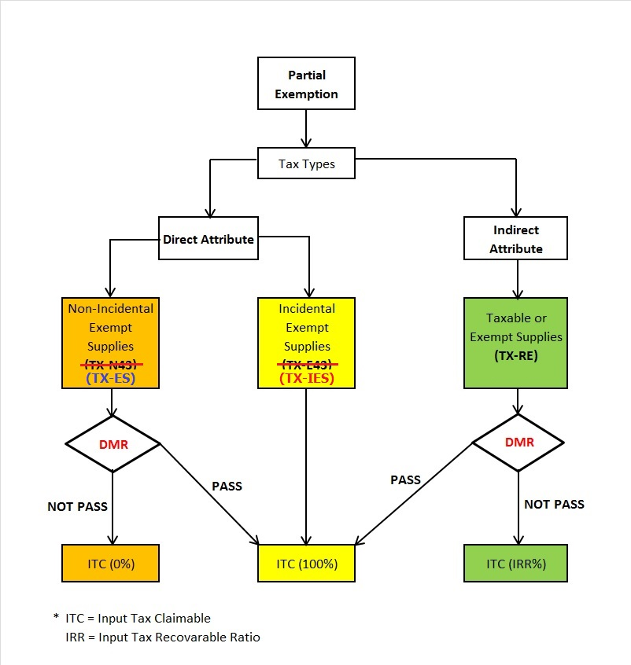

#### De Minimis Rule (DmR)

To satisfy the De Minimis Rule:

   1. Total Exempt Supply (ES) `<=` Average RM5,000.00 per month; **AND**
   2. DMR `<=` 5%

Formula:
DmR = [E / (T + E)] x 100%

| Supplies | Tax Code                                           | Description                                                                                                                                                                                                                                                                                                                                       |
|----------|----------------------------------------------------|---------------------------------------------------------------------------------------------------------------------------------------------------------------------------------------------------------------------------------------------------------------------------------------------------------------------------------------------------|
| T        |(SR + ZRL + ZDA + ZRE + DS + RS + GS + OS-TXM + NTX)| The total value (exclusive of GST) of all taxable supplies which are the sum of all standard-rated supplies, zero-rated supplies (Local), zero-rated supplies (Export), deemed taxable supplies, supplies made outside Malaysia which would be taxable if made in Malaysia, relief supplies, and disregarded supplies made in the taxable period. |
| E        | (ES)                                               | The total value (exclusive of GST) of exempt supplies made in the taxable period which NOT include incidental exempt supplies.                                                                                                                                                                                                                    |

:::note NOTE :

   (i) IES is only for incidental supplies, therefore will not be part of the de minimis rule formula (DmR).
   (ii) This formula functions is only to test the percentage and value that qualify for de minimis rule.
   (iii) Accounting software users should apply DmR on their TX-ES transactions.

The application for de minimis rule as stated below:
   (i) Application of incidental exempt supplies to the de minimis rule.
   (ii) Applying the de minimis rule in a taxable period.
   (iii) Applying the de minimis rule in a tax year or longer period.

:::

#### Input Tax Recoverable Ratio (IRR)

Formula:

***IRR = (T-O1) / (T+E-O2)***

| Code | % / Tax Code                                       | Description                                                                                                                                                                                                                                                                                                                                       |
|------|----------------------------------------------------|---------------------------------------------------------------------------------------------------------------------------------------------------------------------------------------------------------------------------------------------------------------------------------------------------------------------------------------------------|
| IRR  | %                                                  | The recoverable percentage of residual input tax or known as Input Tax Recoverable Rate (IRR).                                                                                                                                                                                                                                                    |
| T    |(SR + ZRL + ZDA + ZRE + DS + RS + GS + OS-TXM + NTX)| The total value (exclusive of GST) of all taxable supplies which are the sum of all standard-rated supplies, zero-rated supplies (Local), zero-rated supplies (Export), deemed taxable supplies, supplies made outside Malaysia which would be taxable if made in Malaysia, relief supplies, and disregarded supplies made in the taxable period. |
| E    | (ES)                                               | The total value (exclusive of GST) of exempt supplies made in the taxable period.                                                                                                                                                                                                                                                                 |
| O1   | -                                                  | The total value (exclusive of GST) of **all excluded taxable supplies.**                                                                                                                                                                                                                                                                          |
| O2   | -                                                  | The total value (exclusive of GST) of **all excluded taxable supplies and all excluded exempt supplies.**                                                                                                                                                                                                                                         |

The supplies related to **O1** of the IRR formula are as follows:

| Tax Code | Description                                                                                                                                                                             |
|----------|-----------------------------------------------------------------------------------------------------------------------------------------------------------------------------------------|
| SR       | The value of any supply of capital assets used by the taxable person for the purposes of his business (e.g., an asset or part of an asset is disposed of as Transfer of Going Concern). |
| DS       | Supplies made by a recipient in accordance with Approved Trader Manufacturer Scheme (ATMS) where self-recipient accounting is made by recipient.                                        |
| DS       | Supplies of imported services where reverse charge mechanism (RSA) is made by recipient.                                                                                                |
| OS       | Supplies made outside Malaysia which would not be taxable if made in Malaysia.                                                                                                          |

The supplies related to **O2** of the IRR formula are as follows:

| Tax Code | Description                                                                                                                                                                             |
|----------|-----------------------------------------------------------------------------------------------------------------------------------------------------------------------------------------|
| SR       | The value of any supply of capital assets used by the taxable person for the purposes of his business (e.g., an asset or part of an asset is disposed of as Transfer of Going Concern). |
| DS       | Supplies made by a recipient in accordance with Approved Trader Manufacturer Scheme (ATMS) where self-recipient accounting is made by recipient.                                        |
| DS       |  Supplies of imported services where reverse charge mechanism (RSA) is made by recipient.                                                                                               |
| OS       | Out of scope supply is a supply which is not within the ambit or boundary of GST, and therefore GST is not chargeable on such supply.                                                   |
| ES       | Exempt supplies of land for general use (Land used for burial, playground or religious building), and disposal of capital asset which is subject to exempt supplies.                    |

:::note Note:
(i) IES is only for incidental exempt supplies, therefore will not be part of the Input Tax Recoverable Ratio (IRR) formula.
(ii) For other excluded transactions ("O1 & O2"), users need to analyse their transactions in ES, SR, DS & OS,
then make necessary adjustment before they can apply the correct ratio.
(iii) Accounting software users should apply IRR on their TX-RE transactions.
(iv) The above formula is based on the value of supplies made which is the standard method used to apportion the residual input tax.
If the person wishes to use other methods to apportion the residual input tax, he is required to get approval from customs.
For further details please refer to GST Guide on Partial Exemption
:::

#### Input Tax Claimable Logic to TX-RE, TX-IES (TX-E43) & TX-ES (TX-N43) (Based on DMR)

Below is the summary of the calculation logic based on DMR to determine the input tax claimable.

| Tax Code | Tax Rate | Fulfill DMR? | Input Tax Claimable (ITC) |
|----------|----------|--------------|---------------------------|
| TX-RE    | 6%       | Yes          | ITC × 100%                |
| TX-RE    | 6%       | No           | ITC × IRR                 |
| TX-IES   | 6%       | N/A          | ITC × 100%                |
| TX-ES    | 6%       | Yes          | ITC × 100%                |
| TX-ES    | 6%       | No           | ITC × 0%                  |

### How to exclude the IRR for the capital goods disposed off?

For example, Mixed Co. Sdn Bhd., whose current tax year ends on 31 December 2016, has in his taxable period of April 2015, made some mixed supplies and at the same time incurred residual input tax as follows.

|Code     | Description                                              | `(RM)`      |
|---------|----------------------------------------------------------|-------------|
| T       | Value of all taxable supplies, exclusive of tax          | 200,000.00  |
| E       | Value of all exempt supplies                             | 40,000.00   |
| O1 & O2 | Value of a capital goods disposal off (exclusive of tax) | 50,000.00   |
| O2      | Value of incidental exempt supplies                      | 20,000.00   |
|         | Residual Input Tax Incurred                              | 10,000.00   |

#### Steps

1. Go to GST | Maintain Tax...
2. Edit the **SR** tax code.
3. Click on the tax rate lookup. See the screenshot below.

    

4. Click +' sign follow by **IRR Excluded** to insert additional tax rate 6% IRR excluded **(O)**.

   :::note **Note:**

   1. Tax Rate set as EA or E6%.
   2. E = Exclude from IRR formula.

   :::

5. Enter the disposal of asset in Customer Invoice.
6. Select tax code **SR**.
7. Select tax rate **E6%** to exclude from IRR calculation (It means **"O"** to the formula).

   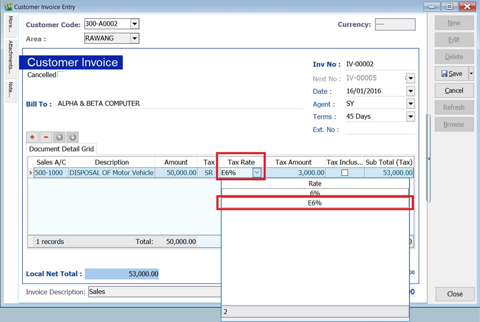

8. You will found the IRR calculated (**88.24%**) and the GST-Listing breakdown by tax code as shown in the screenshot below.

   

   **IRR calculation:**

   |   |                                                          | Calculation                                 | RM      |
   |---|----------------------------------------------------------|---------------------------------------------|---------|
   | t | Value of all taxable supplies, exclusive of tax          | 100,000 (SR) + 50,000 (ZRL) + 50,000 (OS)   | 200,000 |
   | e | Value all of exempt supplies                             | 20,000 (ES) + 20,000 (IES)                  | 40,000  |
   | o | Value of a capital goods disposal off (exclusive of tax) | 50,000 (SR with tax rate E6%)               | 50,000  |
   | o | Value of incidental exempt supplies                      | 20,000 (IES)                                | 20,000  |
   |   | Residual Input Tax Incurred                              | 166,666.66 x 6% (TX-RE)                     | 10,000  |

9. Therefore, IRR = (200,000 -50,000) / (200,000 + 40,000) - (50,000 + 20,000) = 0.8824 (**88.24%**).
10. The amount of residual input tax can claim for the period is,

      Residual Input Tax Recovery % X Residual Input Tax = **88.24% x Rm10,000 (TX-RE) = Rm8,824.00**.

      

:::note **RMCD Reference:**

We get the similar example from Partial Exempt guide by Royal Malaysian Customs Department.
See the screenshot below.

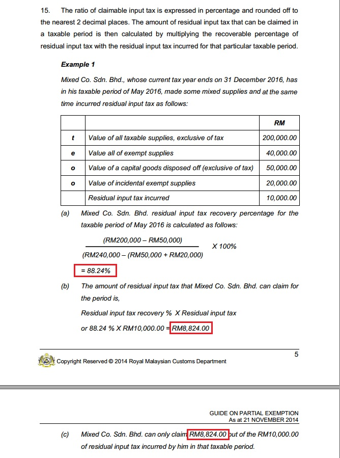

:::

### GST Listing - Mixed Supply

For report printing [refer to this link.](../../usage/gst/gst-report.md#gst-treatment---partial-exemption)

## Imported Services

GST on **Imported Services** (Sec 13) is accounted by way of the reverse charge mechanism.

**Reverse Charge Mechanism** (also known as Self Recipient Accounting-RSA)

A supplier who is not based in Malaysia and supplies services to a customer in Malaysia does not charge GST. However, the customer receiving the services is required to account for GST using the reverse charge mechanism.

The recipient must pay GST for the imported services received and simultaneously claim input tax in their GST return. The reverse charge mechanism is an accounting procedure where the recipient acts as both the supplier and the recipient of the services.

**Example:**

1. Royalty fee charged in Malaysia by a non-resident business situated outside Malaysia from Jan - Dec 2016 = USD 200,000
2. Date of invoice = 10 March 2016
3. Bank prevailing rate = Rm2.50 (Date: 10 March 2016)

Calculation for GST:

1. Consideration for the supply @Rm2.50 = Rm500,000.00 + GST 6%
2. GST to be accounted by recipient @6% GST = Rm30,000.00

RSA:
Account GST output = Rm30,000.00
Claim GST Input = Rm30,000.00

***Time of Supply***

1. When supply are paid for (Date of payment made) - no longer
2. Start from **01 Jan 2016**, which ever is the earlier:-

   1. Payment made; or
   2. Invoice date.

### Maintain Tax (Imported Services)

1. RSA tax code is preset in the SQL Financial Accounting.
2. It is use for the purpose of **Reverse Charge Mechanism or Recipient Self Accounting**.
3. RSA tax code setting. See the screenshot below.

   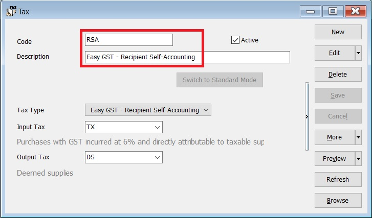

### Payment made before the invoice

1. Click on the **New PV** to create new payment voucher.

   

2. Enter the **payment date**, eg. 02/06/2016.
3. Select **RSA** in tax column.

   

   :::note **NOTE:**

   Tax amount will be calculated after process the GST Returns.

   :::

4. After GST Returns processed, you can check the double entry posting from GL | Print Journal of Transactions Listing...

   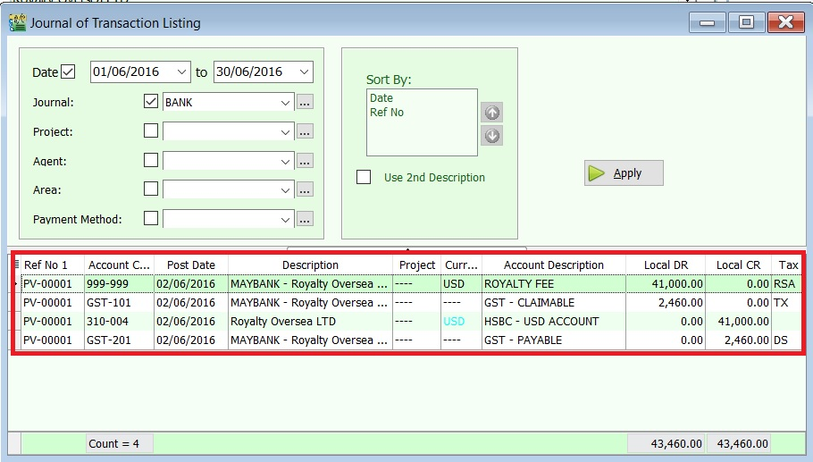

   **Double Entry - RSA:**

   | Account Code | Account Description | Tax Code | Local DR | Local CR | Taxable Period                      |
   |--------------|---------------------|----------|----------|----------|-------------------------------------|
   | GST-101      | GST - Claimable     | TX       | 2,460.00 | 0.00     | June 2016 **(follow payment date)** |
   | GST-201      | GST - Payable       | DS       | 0.00     | 2,460.00 | June 2016 **(follow payment date)** |

### Invoice First Payment Later

1. Click on the **New** to create new supplier invoice.
2. Enter the **invoice date**, eg. 02/06/2016.
3. Select **RSA** in tax column.

   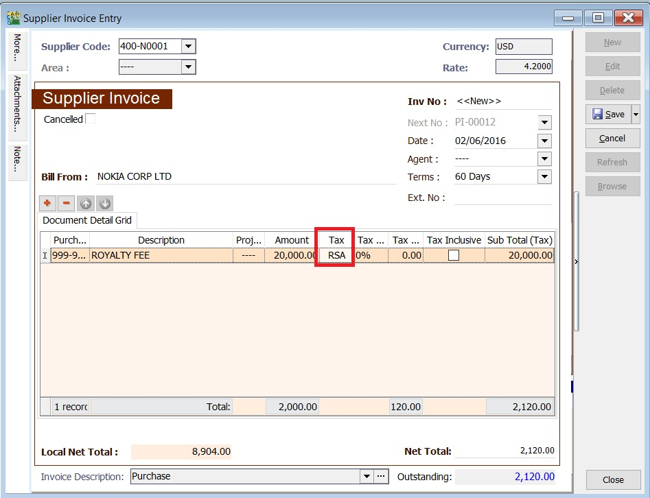

   :::note **NOTE:**

   Tax amount will be calculated after process the GST Returns.

   :::

4. After GST Returns processed, you can check the double entry posting from GL | Print Journal of Transactions Listing...

   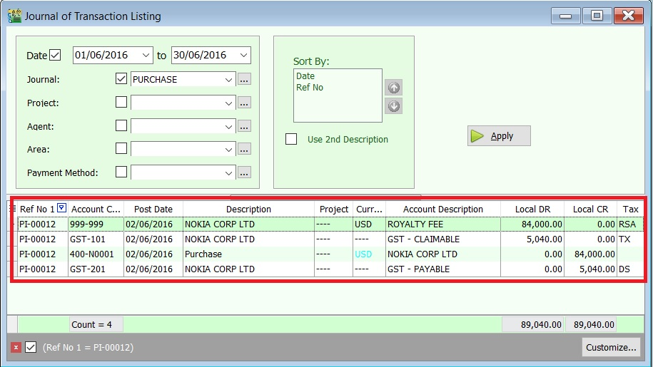

   **Double Entry - RSA:**

   | Account Code | Account Description | Tax Code | Local DR | Local CR | Taxable Period                      |
   |--------------|---------------------|----------|----------|----------|-------------------------------------|
   | GST-101      | GST - Claimable     | TX       | 5,040.00 | 0.00     | June 2016 (**follow invoice date**) |
   | GST-201      | GST - Payable       | DS       | 0.00     | 5,040.00 | June 2016 (**follow invoice date**) |

## Set Tax Year

1. Highlight the final taxable period to be set as your **First Tax Year**, eg. final taxable period 01 Dec - 31 Dec 2016.

   

2. Double click on the GST Returns highlight in step 1.
3. System will prompt you a dialog box.
4. Tick on the **Tax Year** to set a tax year point. See the screenshot below.

   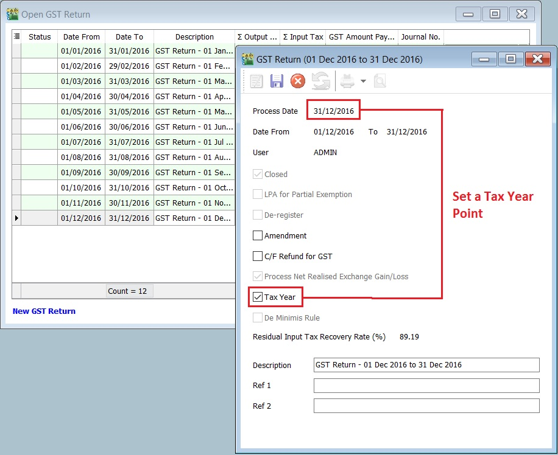

5. Click **Save**.

   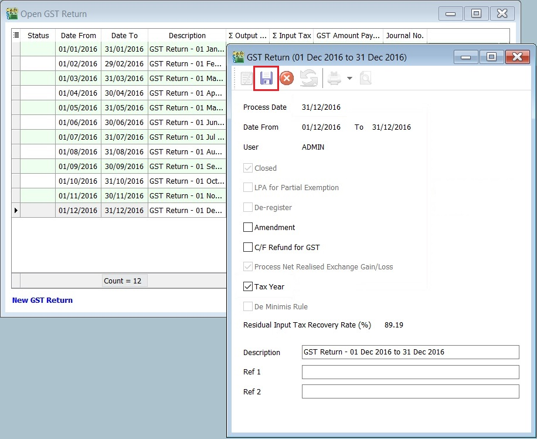

6. You can insert a column **Tax Year**, eg. Tax Year point set at 31 Dec 2016.

   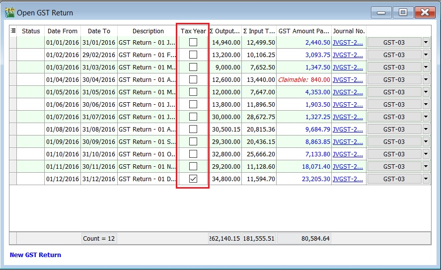

   :::note **Note:**

   You can direct set the tax year without delete/purge the GST Returns.

   :::

## Longer Period Adjustment (LPA)

Declaration of annual adjustment amount:

- Regulation 43 – in a GST Return for the second taxable period next following the longer period.
For example,
Assumed the tax year set on 31 Dec 2016, LPA should be declared in:

   1) For **monthly taxable period** , the second taxable period is **Feb 2017** and the submission is before or on 31/3/2017
   2) For **quarterly taxable period**, the second taxable period is **Apr-Jun 2017** and the submission is before or on 31/7/2017

### GST Returns

1. Process the GST Return.For example, process the **Second Taxable Period** (01/02/2017 - 28/02/2017).
2. LPA will tick automatically.(**if you have set the tax year**)

   

3. Suggested period to be adjusted for LPA.

   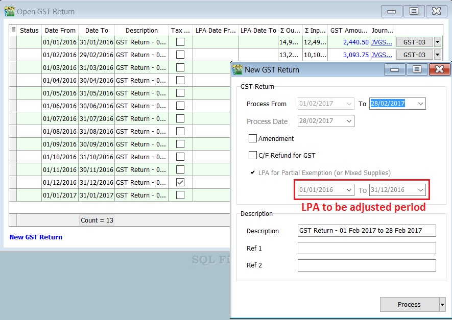

   :::note **Note:**

   User allow to overwrite the suggested period for Longer Period.

   :::

4. You can insert the **LPA Date From** and **LPA Date To** columns to check.

   

### GST Listing - Mixed Supplies

For report printing [refer to this link.](../../usage/gst/gst-report.md#longer-period-adjustment-lpa)

## Special-GST Treatment: Non-deductible Expenditure

How to enter and to retrieve the non-deductible expenditure?

This guide will teach you the way to key-in the data entry and help you to analyse the non-deductible expenditure related to GST. It is follow to the latest 2015 amendment in Income Tax Act 1967.

***GST Expenditure (Effective from YA 2015)***

1. para 39(1)(o): GST input tax paid or to be paid not allowed as deduction if:-
   1. Non-registered person with turnover exceed GST threshold of Rm500,000.
   2. Registered person fail to claim input tax credit his entitled to claim.
2. section 39(1)(p): Output tax absorbed by GST by registered person is not allowed as tax deduction.
3. GST block input tax & deductible expenses:-

| Block Tax                                     | Input Tax | Tax Deductible?                                    |
|-----------------------------------------------|-----------|----------------------------------------------------|
| Passenger car (Cost and maintenance)          | Blocked   | Deductible (to claim capital allowance)            |
| Club subscription fee                         | Blocked   | **Non-deductible**                                 |
| Medical insurance/personal accident insurance | Blocked   | Deductible                                         |
| Family benefits                               | Blocked   | Depend (check with your auditors or tax consultant)|
| Entertainment expenses (Potential customer)   | Blocked   | **Non-deductible**                                 |
| Entertainment expenses (Supplier)             | Blocked   | Allowed 50% deduction                              |

### How does it work?

1. Click New.
2. Follow the below SETTINGS to create.

   | Field Name   | Field Contents                                                                  |
   |--------------|---------------------------------------------------------------------------------|
   | Code         | ND-0 (Recommended code)                                                         |
   | Description  | Non-Deductible                                                                  |
   | Tax Type     | (Non GST - Both Sales & Purchase)                                               |
   | Tax Rate     | 0% (please key-in)                                                              |
   | Tax Account  | GST-301 (This field is compulsory. Due to tax rate is 0%, therefore no posting) |
   | Tax Inclusive| Untick                                                                          |

3. Click Save. See below screenshot.

   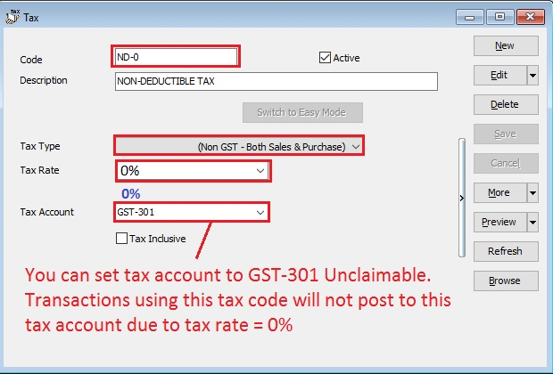

:::note **NOTE :**

Do not click the tax rate arrow key down if the tax account is not defined yet.

:::

#### Data Entry for Non-Deductible

***For Purchase Invoice***

1. Insert a new detail row and key-in the total input tax not going to claim.
2. Select the tax code "ND-0".
3. See below screenshot.

   

***For GL Cash Book***

1. Insert a new detail row and key-in the **total input tax not going to claim**.
2. Select the tax code "ND-0".
3. See below screenshot.

   

:::note **NOTE:**
Please ensure you understand the Non-Deductible expenditure from your auditors before you apply this guide.
:::

### How to analyse the total amount from Non-Deductable?

1. Select the date range to APPLY.
2. Filter at the Tax grid column. See screenshot below.

   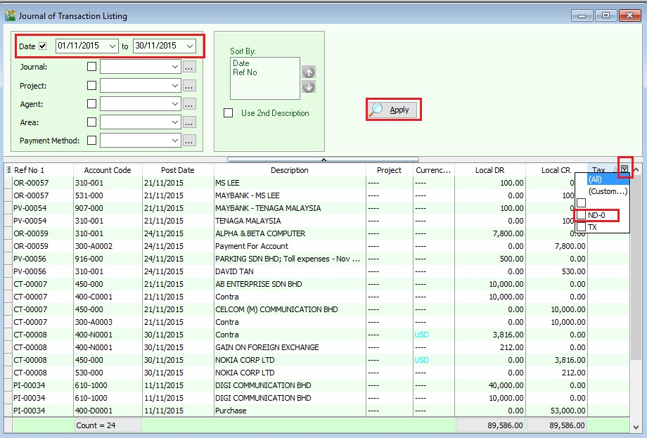

3. You can see the non-deductible transactions filtered by ND-0.

   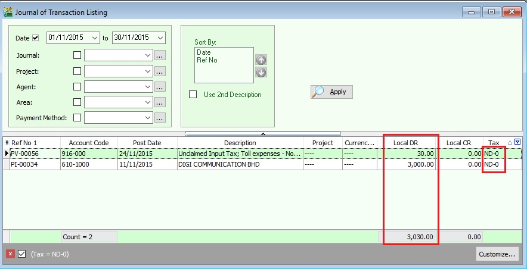

4. From this instance, the total non-deductible expenditure amount is **Rm3030.00**

:::note **NOTE:**

This non-deductible tax amount will not post to GAF.

:::

## GST-03 Item 12 (ES + IES)

### How to compare the Total Value of Exempt Supplies between GST-03 and Ledger?

This guide will help you to check the data entry source posted for **Item 12 Total Value of Exempt Supplies in GST-03.**

1. **GST Tax Code**

   | Tax Code | Tax Description            | Tax Rate | Explanation and examples                                                                                                                                                                                                                                                      |
   |----------|----------------------------|----------|-------------------------------------------------------------------------------------------------------------------------------------------------------------------------------------------------------------------------------------------------------------------------------|
   | IES      | Incidental Exempt Supplies | 0%       | Incidental exempt supplies under GST legislations (Note: Replace ES43). Incidental Exempt Financial Services Supplies (IEFS) include: 1.interest income from deposits placed with a financial institution in Malaysia, 2.realized foreign exchange gains or losses            |
   | ES       | Exempt Supplies under GST  | 0%       | This refers to supplies which are EXEMPTED UNDER GST. These supply includes: 1.Selling of Residential Properties to consumer, 2.Selling of tickets for Public Transportation (Taxis, Stage Buses, Ferries), 3.Financial Institution's interest charges to customers for loan. |

2. **GST-03**

   | Item No. | Description                    | Guidelines                             |
   |----------|--------------------------------|----------------------------------------|
   | 12       | Total Value of Exempt Supplies | IES + ES (Taxable Amount)              |
   |          |                                | Note : Net Loss in Forex (ES43) = 0.00 |

### Example of Data Entry

1. IES - **Interest income from deposits placed with a financial institution in Malaysia**

   Screenshot below from **Journal Entry.**

      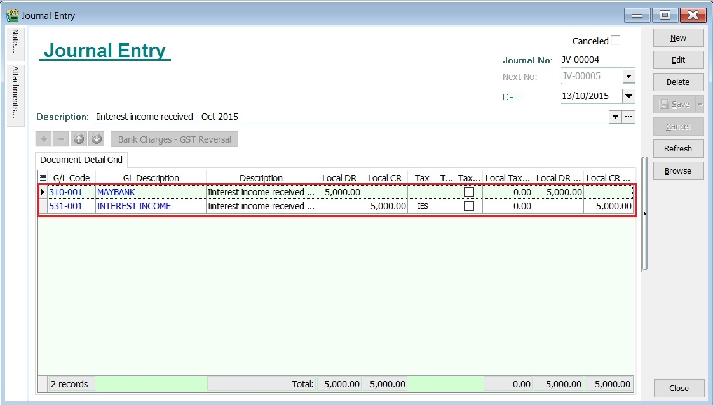

2. IES - **Realized foreign exchange gains or losses**

   1. **Realized Gain in Foreign Exchange**

      Screenshot below from **Customer Payment**.

         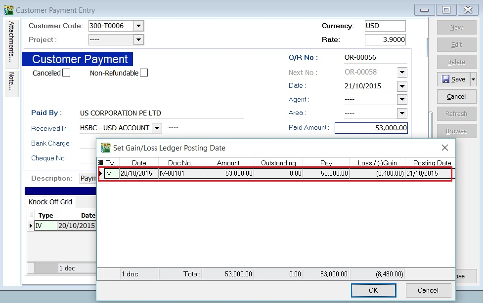

   2. **Realized Loss in Foreign Exchange**

      Screenshot below from **Customer Payment.**

         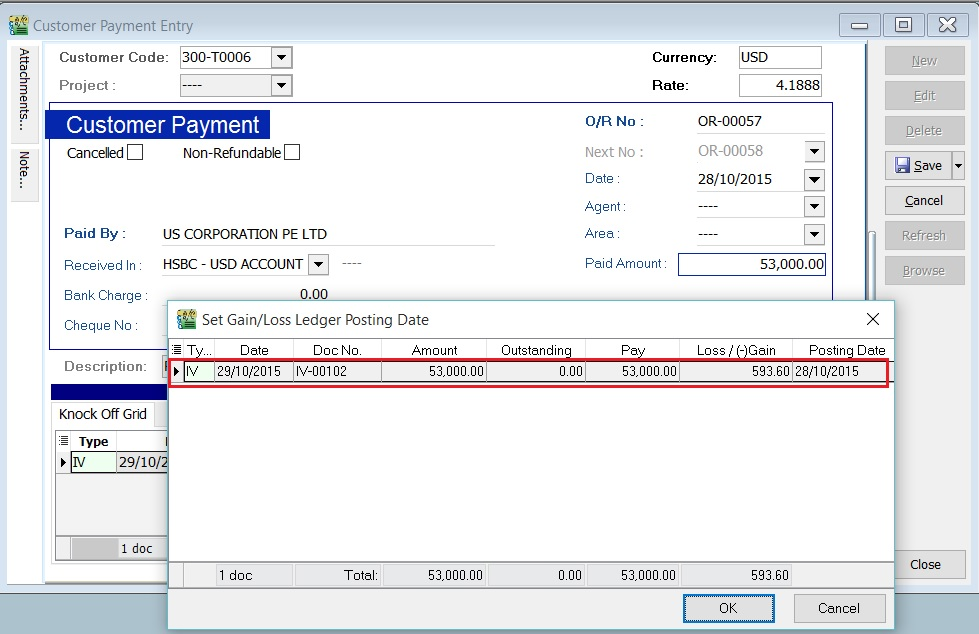

3. ES - **Financial Institution's interest charges to customers for loan**

   Screenshot below from **Customer Invoice.**

      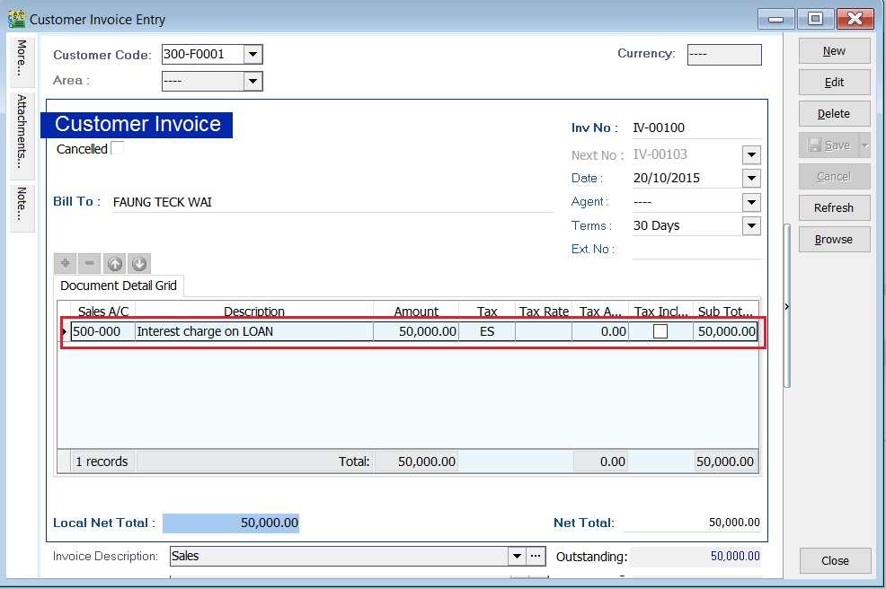

### GST - 03 Item 12 : Total Value of Exempted Supplies

1. For instances, the **GST-03 Item 12 = Rm62.886.40**

   

2. You can check the details by double click on the amount in **Item 12.**
3. Pop-up the item 12 detail.

   

4. You can insert additional column, ie. **From Doc Type** and **Trans Type.**

    a. **From Doc Type** will help you to identify the documents where it posted;
    b. **Trans Type** will tell you the document posted from special case, eg. Realized Gain in Foreign Exchange.

    

:::note **NOTE:**
Trans Type = _X, it means the posting entry related to **Realized Gain or Loss in Foreign Exchange.**
:::

### Cross Check Reports (CCR)

#### GST Listing (CCR)

1. Select the **date range** or **GST Process**.
2. You can select the tax parameter for **ES** and **IES**.
3. Apply the **GST Listing**.

   

   | Tax Code | Local Amount  | Explanation                                                                                          |
   |----------|---------------|------------------------------------------------------------------------------------------------------|
   | IES      | 5,000.00      | Local amount from Sales/Customer/Journal Entry/Cash Book (OR) documents related to tax code: **IES** |
   | IES      | 7,886.40      | Net realized forex gain calculated                                                                   |
   | ES       | 50,000.00     | Local amount from Sales/Customer/Journal Entry/Cash Book (OR) documents related to tax code: **ES**  |
   | **Total**| **62,886.40** | Total value shown in **GST-03 Item 12**                                                              |

4. Click on each tax type, you able to view the details. See the example in the screenshot below.

***1. IES***

   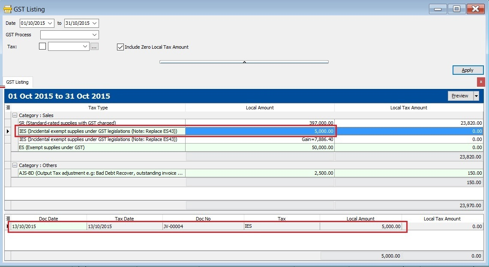

***2. IES (Net Realized Forex Gain ONLY)***

   

***3. ES***

   

***GL Ledger***

1. In the General Ledger report, you have to insert the **Tax** grid column.
2. Filter the Tax Code **(ES and IES)**.

   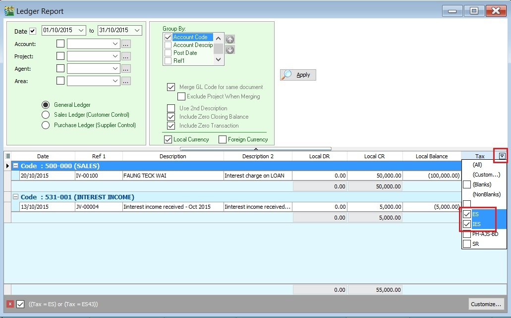

3. Transactions related to **ES**. See the screenshot below.

   

4. Transactions related to **IES**. See the screenshot below.

   

***Special Posting for Net Realized Gain Forex (IES)***

Below question and answer extract from **GUIDE ACCOUNTING SOFTWARE ENHANCEMENT TOWARDS GST COMPLIANCE.**

   

1. Check the Foreign Exchange Rate Gain or Loss Account setting at **Tools | Options...(General Ledger)**. For example,

   | Default Account                     | GL Account Code |
   |------------------------------------ |-----------------|
   | Foreign Exchange Rate Gain Account  | 530-000         |
   | Foreign Exchange Rate Loss Account  | 980-000         |

   

2. Select the **Foreign Exchange Rate Gain or Loss Account**, click **APPLY**

   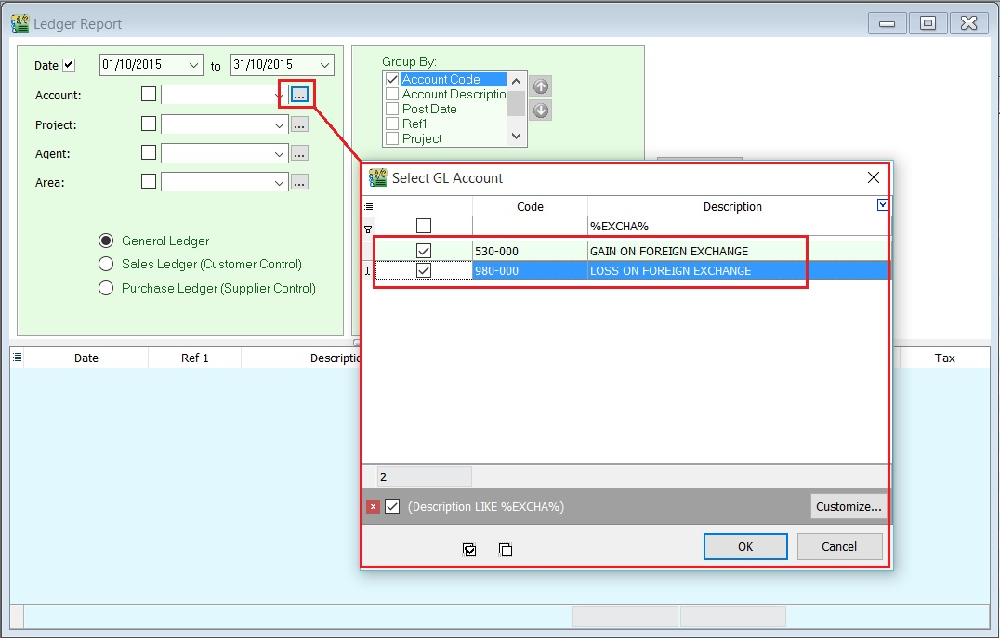

3. You can see the **Foreign Exchange Rate Gain or Loss** posting transactions in **GL Ledger**.

   

   | Account                        | Local DR | Local CR | Explanation                                         |
   |--------------------------------|----------|----------|-----------------------------------------------------|
   | Total Gain on Foreign Exchange | 0.00     | 8,480.00 |                                                     |
   | Total Loss on Foreign Exchange | 593.60   | 0.00     |                                                     |
   | Net Realized Forex             | 593.60   | 8,480.00 | 8,480.00 - 593.60 = 7,886.40 GAIN (IES)             |

:::note **NOTE:**
RMCD has confirmed that **Net Realised Gain in Forex ONLY** need to add into **GST-03 item 12 Total Value of Exempt Supplies.**
Tax code = **IES**

**Net Realised Loss in Forex** will be **NIL.**
:::

### Summary : Comparison between GST-03, GST Listing and Ledger Report

Here is the result summarized:

| Description                 | GST-03   | GST Listing | Ledger Report                 |
|-----------------------------|----------|------------ |-------------------------------|
| IES                         |          | 5,000.00    | 5,000.00                      |
| IES (Realized Gain Forex)   |          | 7,886.40    |Forex Gain = 8,480.00          |
|                             |          |             |Forex Loss = -593.60           |
|                             |          |             | **Net Forex Gain = 7,886.40** |
| ES                          |          | 50,000.00   | 50,000.00                     |
| Total Item 12 (ES + IES)    | 62,886.40| 62,886.40   | 62,886.40                     |