## Account Inquiry

Perform a quick inquiry into the ledger transactions for the General Ledger, Sales Ledger (Customer), and Purchase Ledger (Supplier).

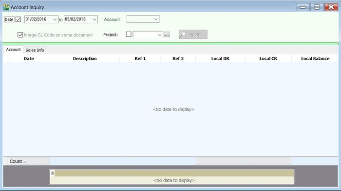

### General Ledger

1. Select the **Date** range.
2. Select a **GL Account** code.
3. Click **Apply**.

    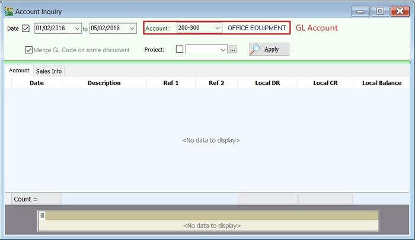

### Sales Ledger (Customer)

1. Select the **Date** range.
2. Select a **Customer** account code.
3. Click **Apply**.

    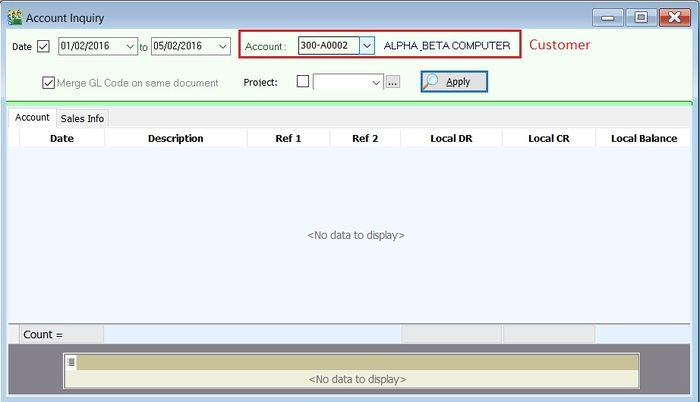

### Purchase Ledger (Supplier)

1. Select the **Date** range.
2. Select a **Supplier** account code.
3. Click **Apply**.

    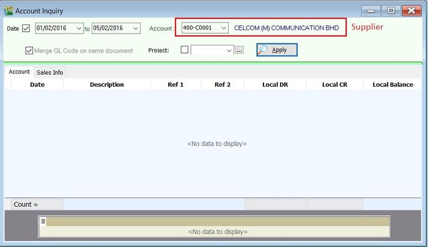

### Access Control in Account Inquiry

Go to **Tools > Maintain User**.

1. You can set the access control for General, Sales, and Purchase Ledgers.
2. Check or uncheck the **Execute** permission to control access:

    | Access Control | Explanation |
    | -------------- | ----------- |
    | Account Inquiry - Inquire G/L Account | Allows you to inquire about G/L Accounts. |
    | Account Inquiry - Inquire Customer Account | Allows you to inquire about Customer Accounts (Sales Ledger). |
    | Account Inquiry - Inquire Supplier Account | Allows you to inquire about Supplier Accounts (Purchase Ledger). |
    | Account Inquiry | Allows you to use the Account Inquiry feature. |

    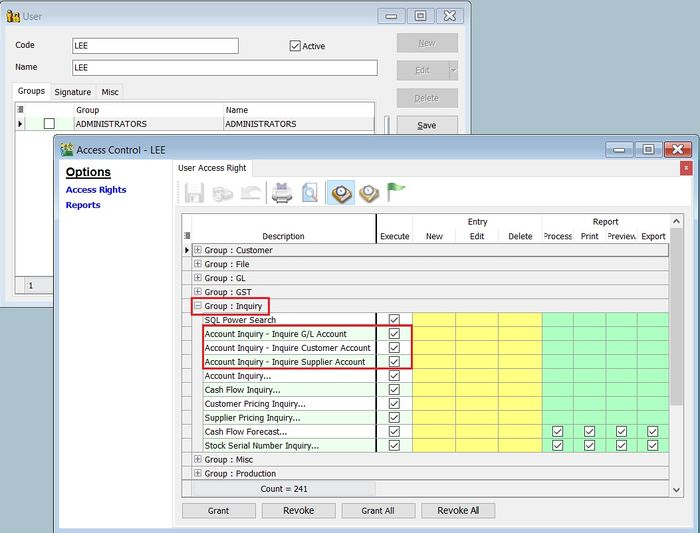

## Cash Flow Inquiry

Perform a quick inquiry into the Cash Flow for all **Bank** and **Cash** account types.

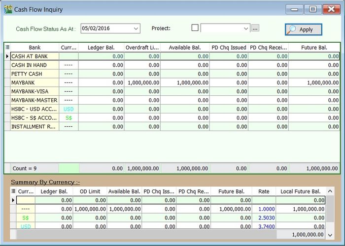

## Cash Flow Forecast

1. This feature forecasts cash flow based on the likelihood of converting assets to cash from **Trade Debtors (Customers)** and **Trade Creditors (Suppliers)**.
2. The criteria for defining the cash flow forecast are:

    1. Customer Due Documents
    2. PD Cheque Received
    3. Supplier Due Documents
    4. PD Cheques Issued

:::info

1. The **Balance b/d** represents the total of all Payment Methods as of the day before the selected **From Date**.
2. The example above shows data as of 05 Feb 2016 in the GL Ledger.

:::

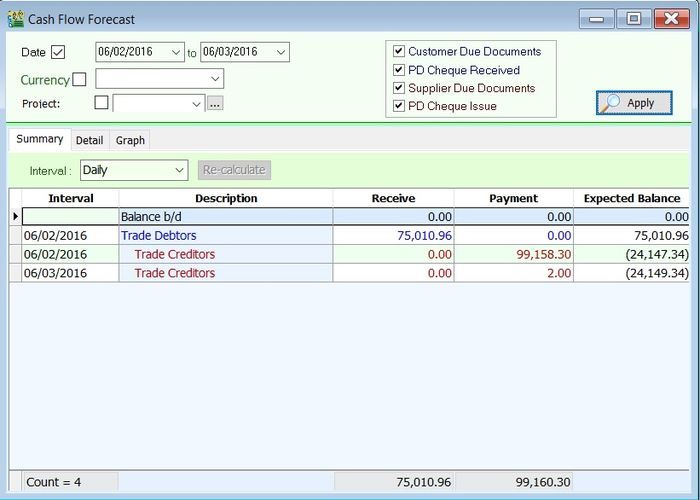

### Summary

1. You can select different **intervals** to analyze the cash flow forecast.
2. Interval selections include:

    1. Daily
    2. Weekly
    3. Monthly
    4. Quarterly
    5. Half-Yearly
    6. Yearly

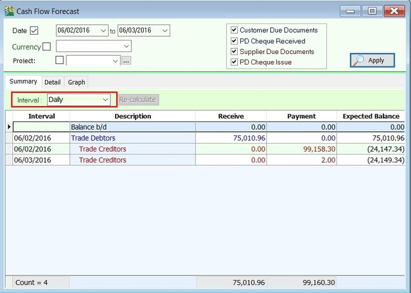

### Detail

1. Highlight the **interval**.

    

2. To check the details for the interval, click **Detail**.

    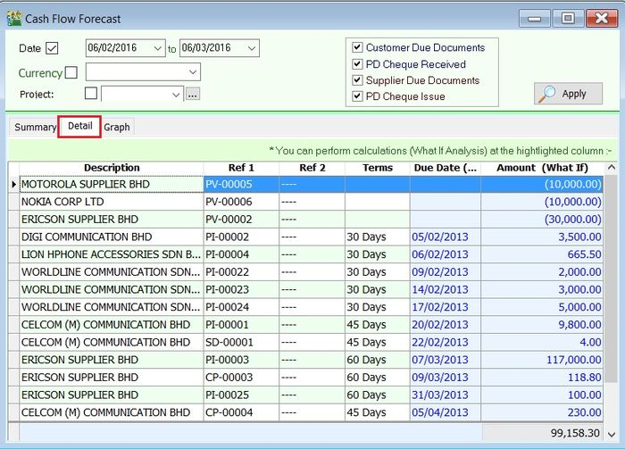

### Graph

1. Highlight the **interval**.

    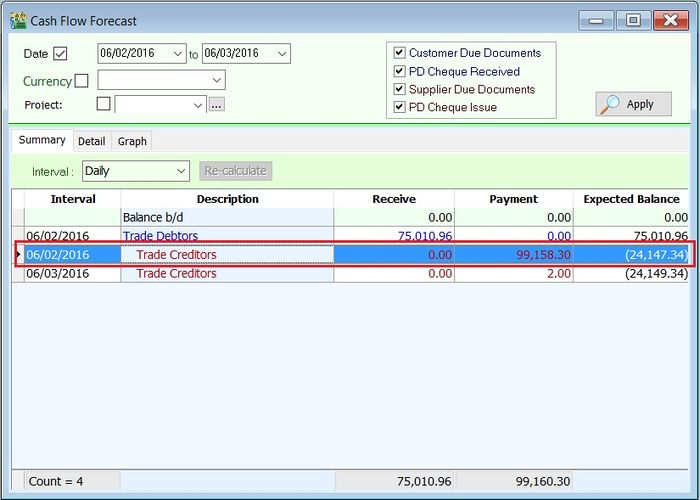

2. To view the graph for the interval, click **Graph**.

    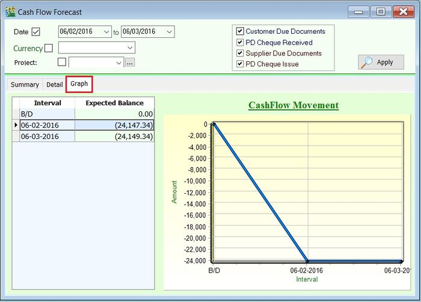

## Customer Pricing Inquiry

Inquire about item pricing for a customer.

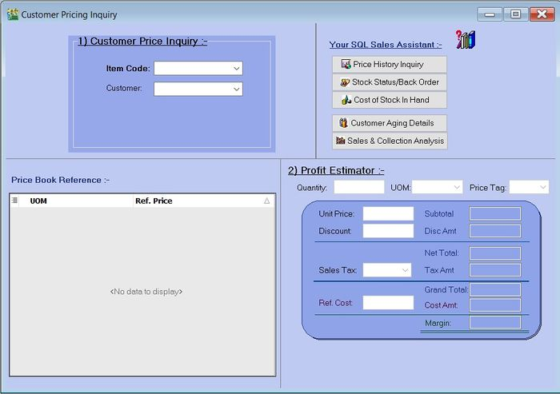

### Customer Price Inquiry

1. Select the **Item Code** to check the price.

    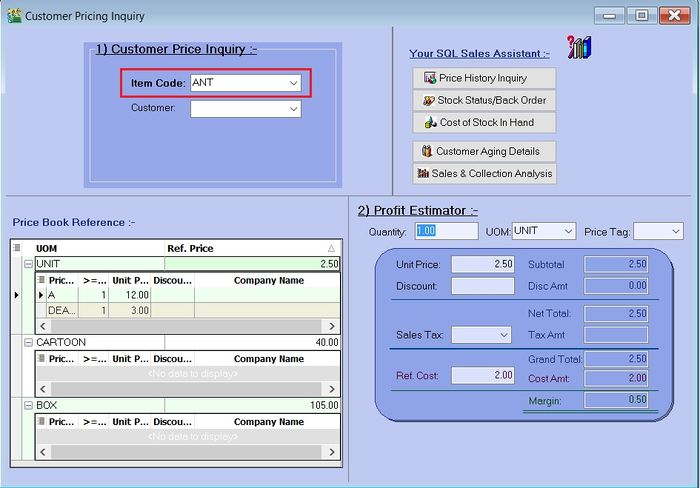

2. Select the **Customer** to check the price.

    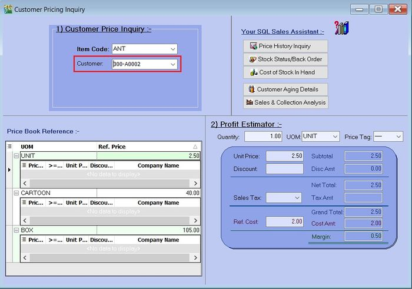

### Customer Profit Estimator

Enter values (e.g., **Quantity**, **UOM**, **Price Tag**, **Unit Price**, **Discount**, **Sales Tax (GST)**, and **Ref. Cost**) to calculate the estimated profit based on the item's cost.

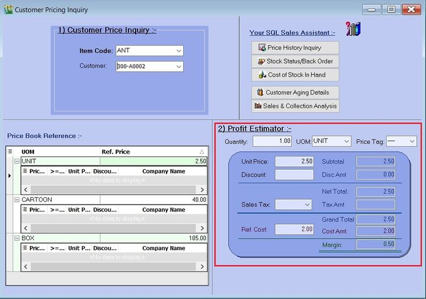

### Customer Price Book Reference

Check the **Reference Price** for different UOMs as set in **Maintain Stock Item**.

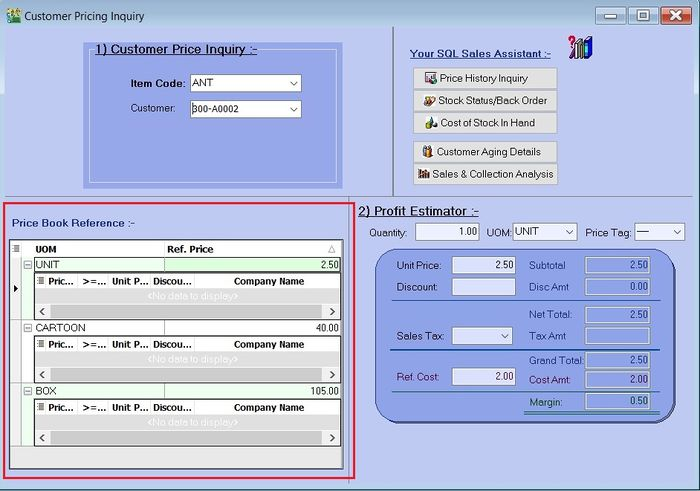

### Your SQL Sales Assistant

Quick access to:

1. **Price History Inquiry** - **Sales > Print Sales Price History**
2. **Stock Status/Back Order** - **Sales > Print Outstanding Sales Document Listing** (Outstanding Sales Order)
3. **Cost of Stock in Hand** - **Stock > Print Stock Month End Balance**
4. **Customer Aging Details** - **Customer > Print Customer Aging Report**
5. **Sales & Collection Analysis** - **Customer > Print Customer Sales & Collection Analysis**

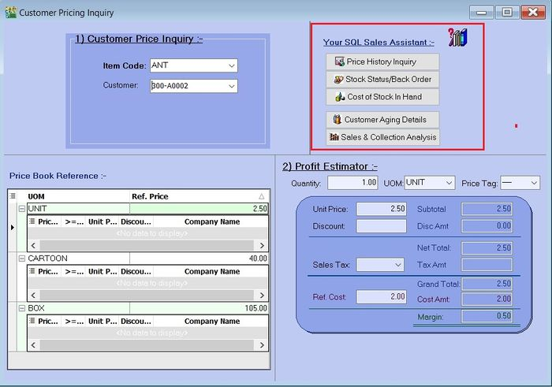

## Supplier Pricing Inquiry

Inquire about item pricing for a supplier.

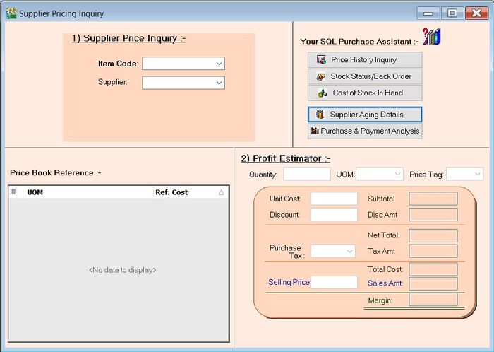

### Supplier Price Inquiry

1. Select the **Item Code** to check the purchase price.

    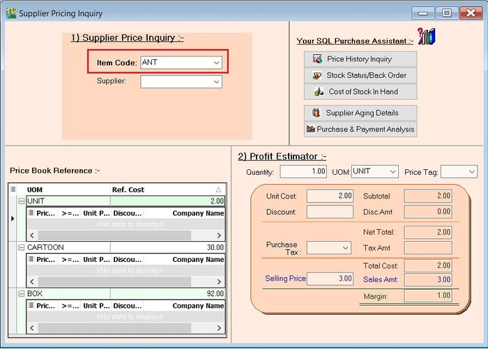

2. Select the **Supplier** to check the purchase price.

    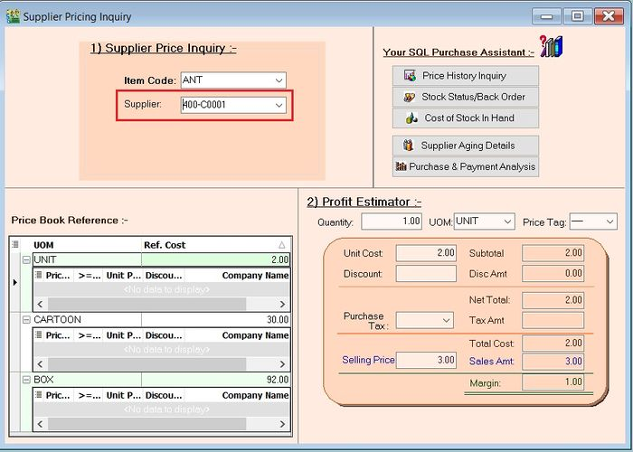

### Supplier Profit Estimator

Enter values (e.g., **Quantity**, **UOM**, **Price Tag**, **Unit Price**, **Discount**, **Sales Tax (GST)**, and **Ref. Cost**) to calculate the estimated profit based on the item's reference cost.

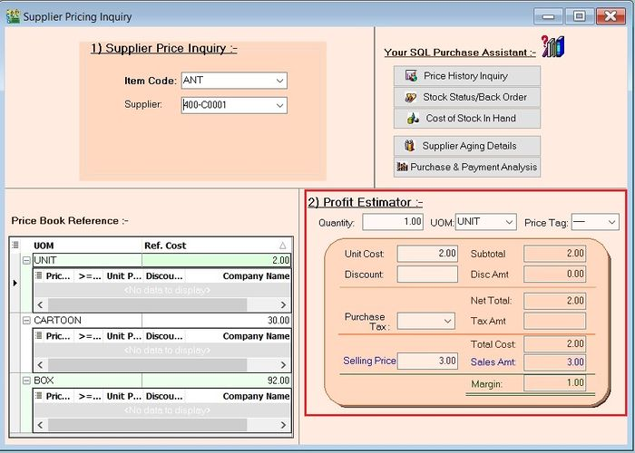

### Supplier Price Book Reference

Check the **Reference Cost** for different UOMs as set in **Maintain Stock Item**.

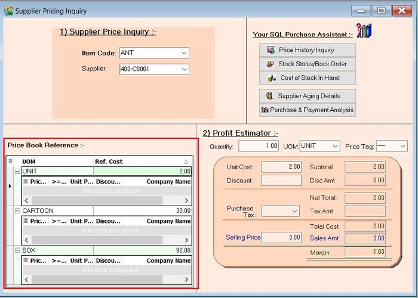

### Your SQL Purchase Assistant

Quick access to:

1. **Price History Inquiry** - **Purchase > Print Purchase Price History**
2. **Stock Status/Back Order** - **Purchase > Print Outstanding Purchase Document Listing** (Outstanding Purchase Order)
3. **Cost of Stock in Hand** - **Stock > Print Stock Month End Balance**
4. **Supplier Aging Details** - **Supplier > Print Supplier Aging Report**
5. **Purchase & Collection Analysis** - **Supplier > Print Supplier Purchase & Payment Analysis**

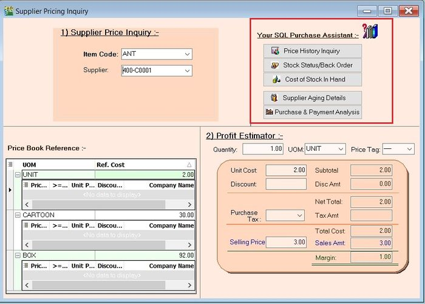

## SQL Power Search

Go to **Inquiry > SQL Power Search**.

A powerful keyword search tool for the company database.

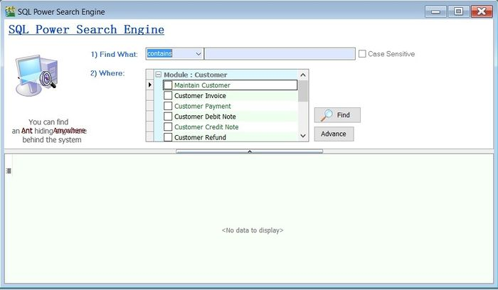

### Find What

**Modify** the search conditions.

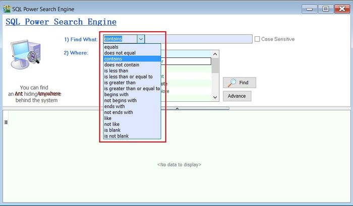

### Where

1. Select the modules to search.

    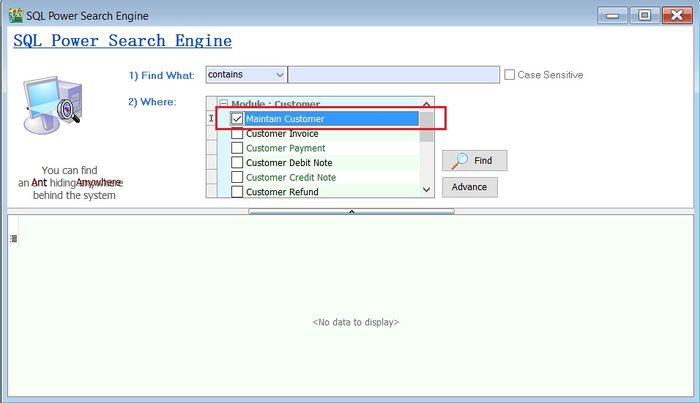

2. Click **Advance** to expand more areas in the search.

    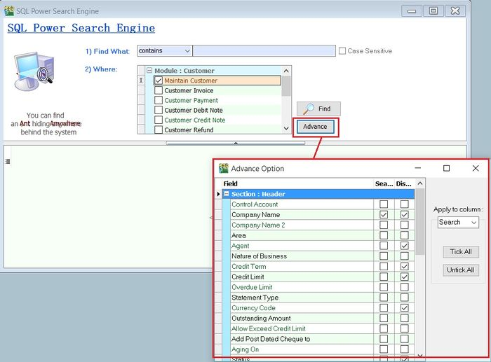

3. Click **Find**.

    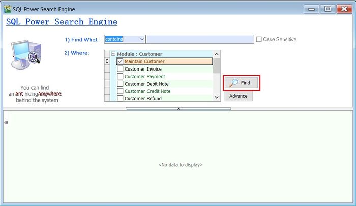

### Search Example

1. Let's try searching for the word **Apple** in an invoice. See the screenshot below.

    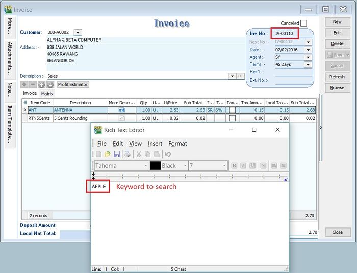

2. In the **SQL Power Search Engine**, check **Invoice** in the **Where** section.

    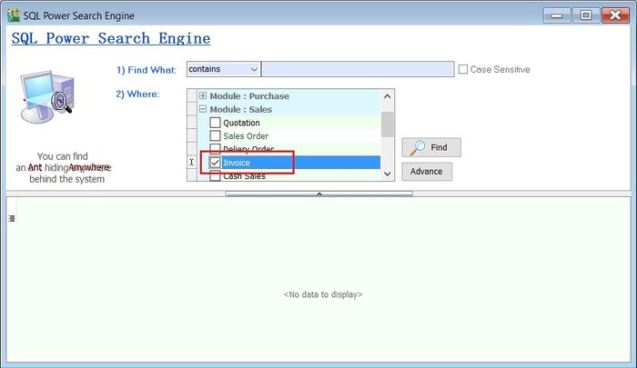

3. To ensure the search covers **More Description**, click **Advance**. See the screenshot below.

    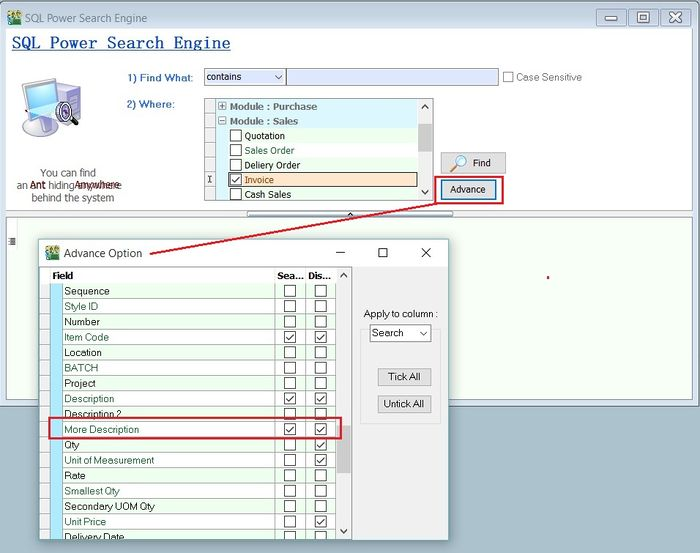

4. Type the keyword **Apple** in **Find What**.

    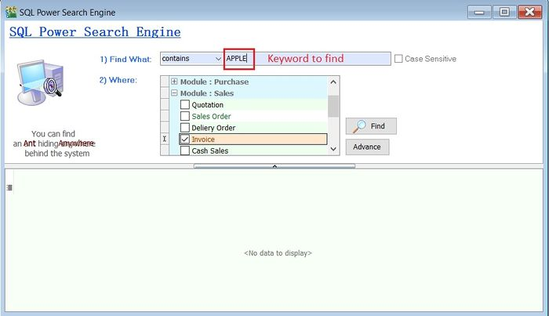

5. Click the **Find** button.

6. The search results will appear below.

    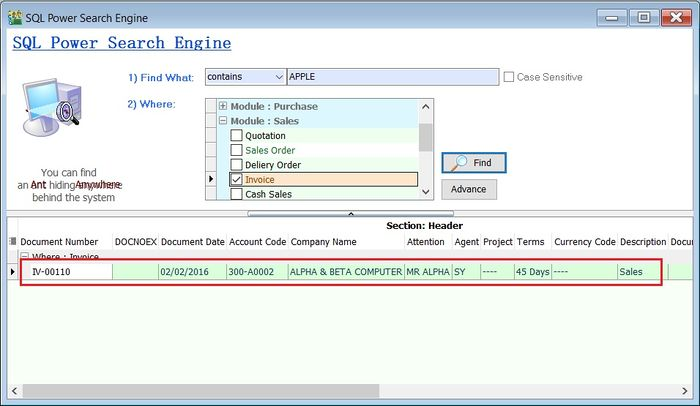
