## Account Inquiry

Quick inquiry the ledger transactions for General Ledger, Sales Ledger (Customer) and Purchase Ledger (Supplier).

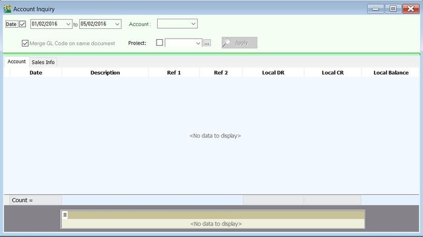

### General Ledger

1. Select the date ranged.

2. Select a GL account code.

3. Click on **Apply**.

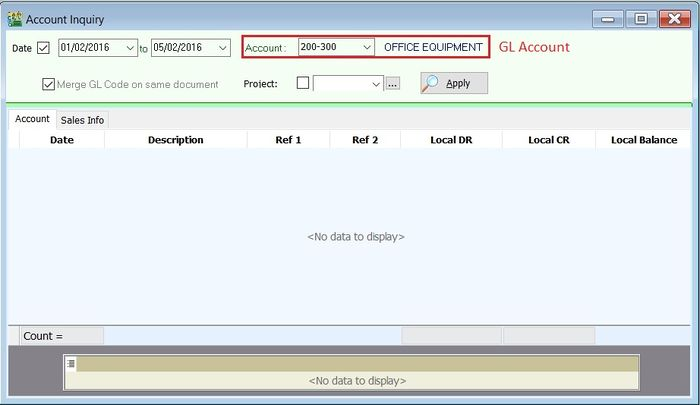

### Sales Ledger (Customer)

1. Select the date ranged.

2. Select a Customer account code.

3. Click on **Apply**.

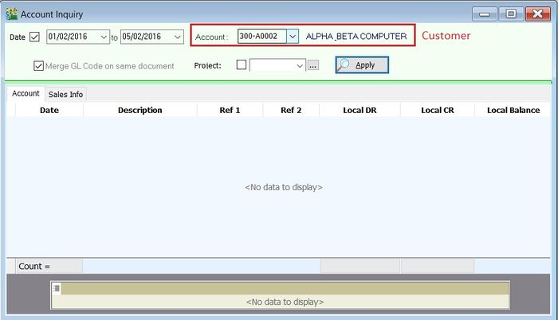

### Purchase Ledger (Supplier)

1. Select the date ranged.

2. Select a Supplier account code.

3. Click on **Apply**.

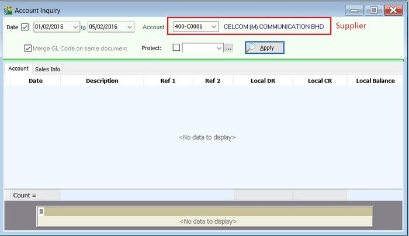

### Access Control in Account Inquiry

Go to **[Tools | Maintain User...]**

1. You can set the access control to the access to General, Sales and Purchase Ledger.

2. Tick or untick Execute to:

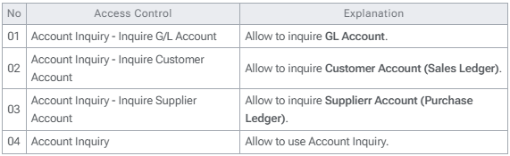

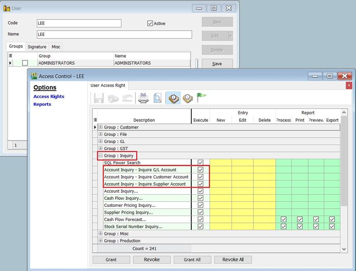

## Cash Flow Inquiry

Quick inquiry the Cash Flow for all the **bank** and **cash** account type.

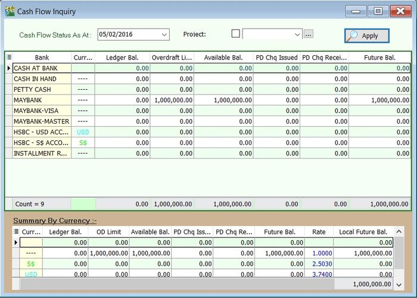

## Cash Flow Forecast

1. It is a cash flow forecast based on the possibility to resolve into cash from **Trader Debtors (Customers)** and **Trade Creditors (Suppliers)**.

2. Criteria to define for cash flow forecast are:-

    1. Customer Due Documents
    2. PD Cheque Received
    3. Supplier Due Documents
    4. PD Cheques Issue

:::info 
    1. The Balance b/d is Total of all Payment Method as at From Date Selected -1.
    2. Example above is as as 05 Feb 2016 in GL Ledger
:::

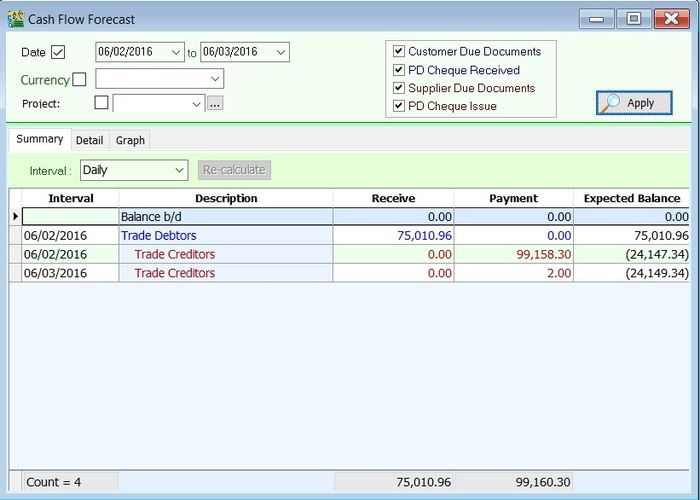

### Summary

1. You can select different **interval** to analyse the cash flow forecast.

2. Interval selections are:

    1. Daily
    2. Weekly
    3. Monthly
    4. Quarterly
    5. Half-Yearly
    6. Yearly

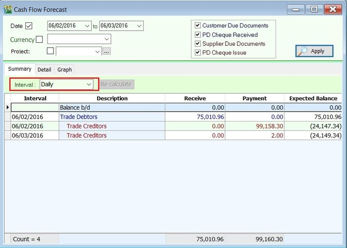

### Detail

1. Highlight the **interval**.

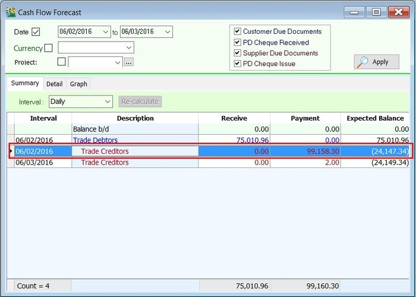

2. To check the details for the interval. Click on **Detail**.

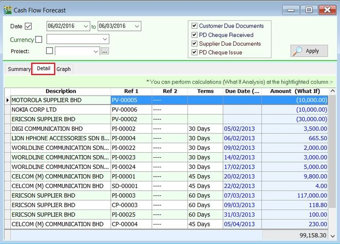

### Graph

1. Highlight the **interval**.

2. To view the graph for the interval. Click on **Graph**.

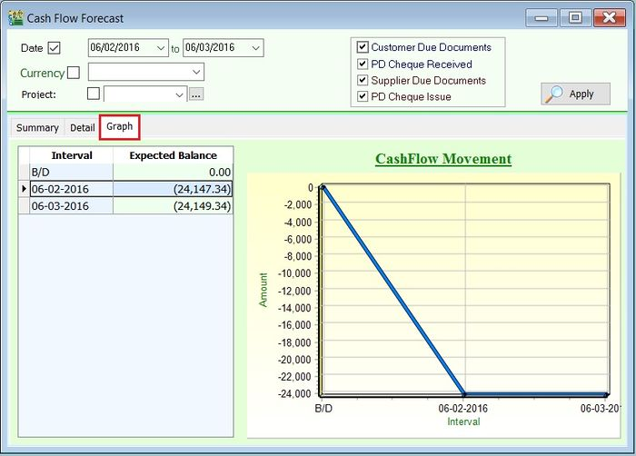

## Customer Pricing Inquiry

To inquire the item pricing for a customer.

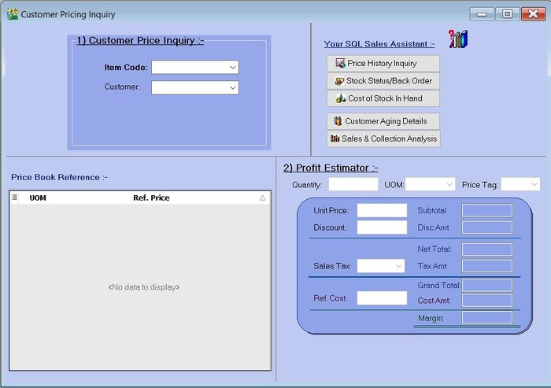

### Customer Price Inquiry
1. Select the **item code** to inquire the price.

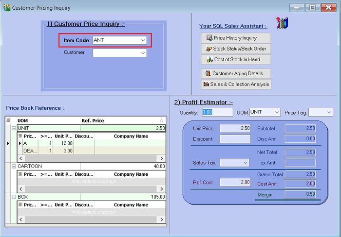

2. Select the **customer** to inquire the price.

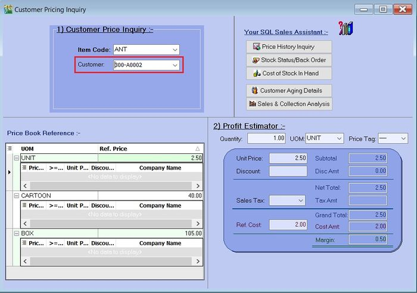

### Profit Estimator
You can enter the values (eg. quantity, UOM, Price Tag, unit price, discount, sales tax (GST) and ref.cost) to calculate the profit according to the cost of the item selected.

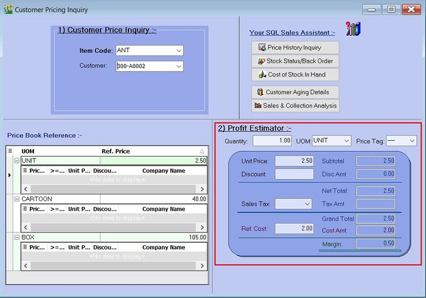

### Price Book Reference
To check the **reference price** in different UOM from **Maintain Stock Item**.

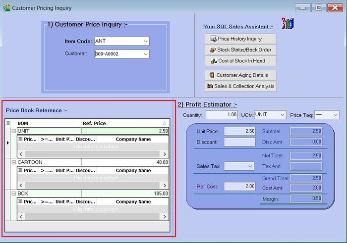

### Your SQL Sales Assistant
Quick access to:-
    1. **Price History Inquiry** - Sales | Print Sales Price History...
    2. **Stock Status/Back Order** - Sales | Print Outstanding Sales Document Listing...(Outstanding Sales Order)
    3. **Cost of Stock in Hand** - Stock | Print Stock Month End Balance...
    4. **Customer Aging Details** - Customer | Print Customer Aging Report...
    5. **Sales & Collection Analysis** - Customer | Print Customer Sales & Collection Analysis...

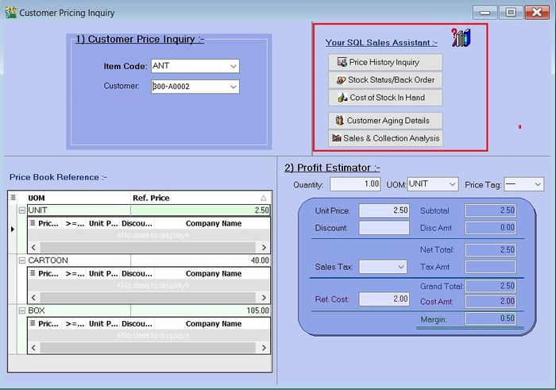

## Supplier Pricing Inquiry

To inquire the item pricing for a supplier.

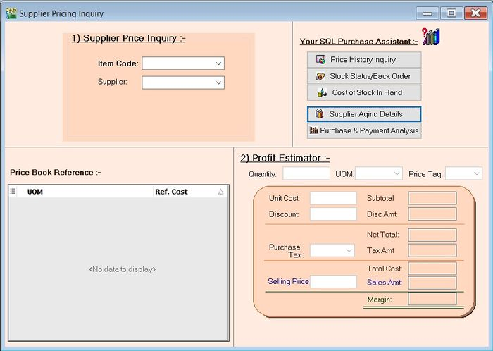

### Supplier Price Inquiry

1. Select the **item code** to inquire the purchase price.

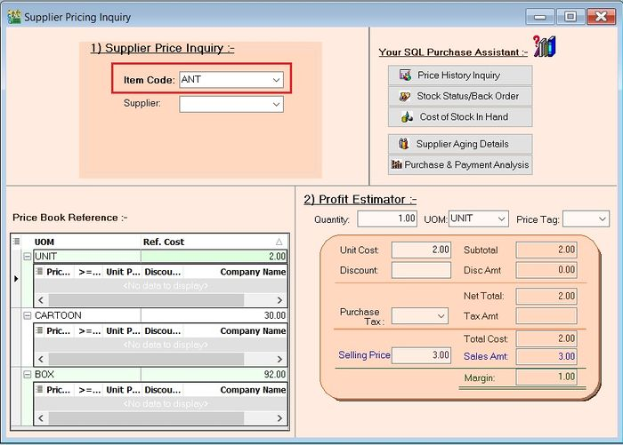

2. Select the **supplier** to inquire the purchase price.

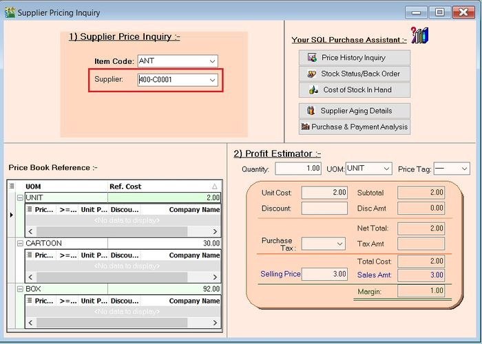

### Profit Estimator

You can enter the values (eg. quantity, UOM, Price Tag, unit price, discount, sales tax (GST) and ref.cost) to calculate the profit according to the reference cost of the item selected.

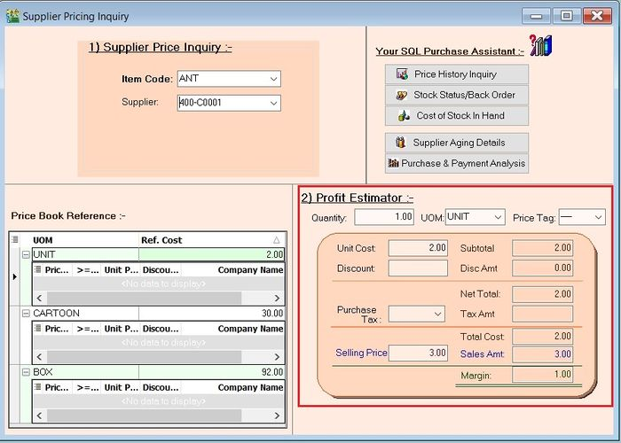

### Price Book Reference

To check the **reference cost** in different UOM from **Maintain Stock Item**.

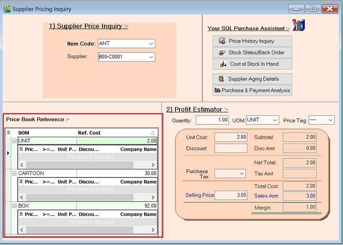

### Your SQL Purchase Assistant

Quick access to:-
    1. **Price History Inquiry** - Purchase | Print Purchase Price History...
    2. **Stock Status/Back Order** - Purchase | Print Outstanding Purchase Document Listing...(Outstanding Purchase Order)
    3. **Cost of Stock in Hand** - Stock | Print Stock Month End Balance...
    4. **Supplier Aging Details** - Supplier | Print Supplier Aging Report...
    5. **Purchase & Collection Analysis** - Supplier | Print Supplier Purchase & Payment Analysis...

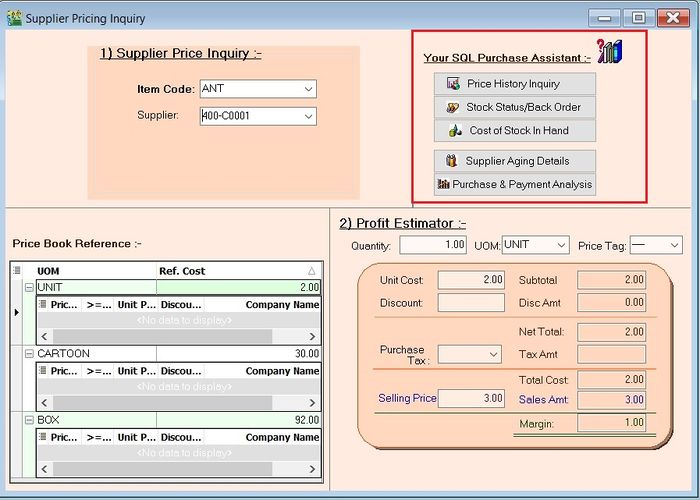

## SQL Power Search

A powerful search with keywords in the company database.

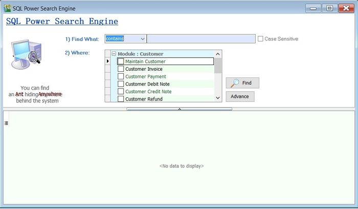

### Find What

**Change** the search conditions.

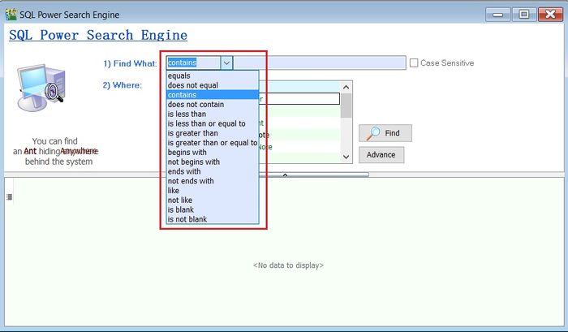

### Where

1. Tick the modules to search.

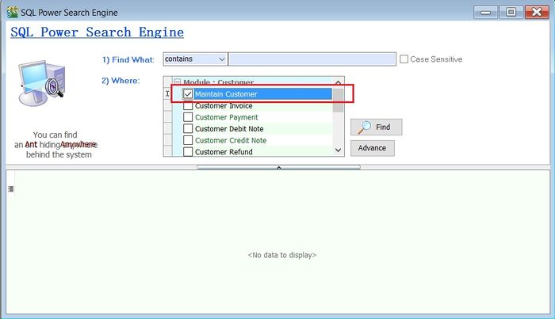

2. Click on **Advance** to expand more areas in search.

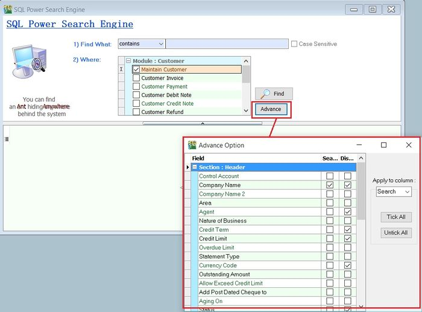

3. Click on **Find**.

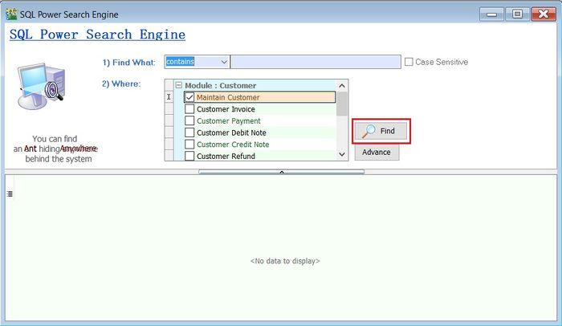

### Example

1. Let's try to search the words of **Apple** in the invoice. See the screenshot below.

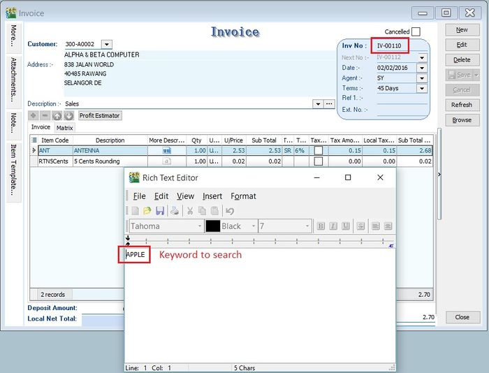

2. At SQL Power Search Engine, tick on **Invoice** in **Where** section.

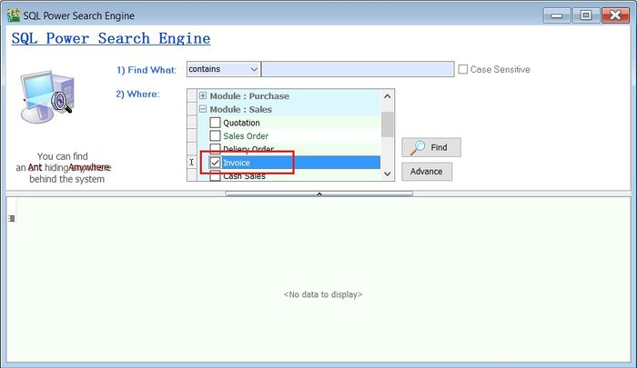

3. To ensure the search area cover the **More Description**. Click on **Advance**. See the screenshot below.

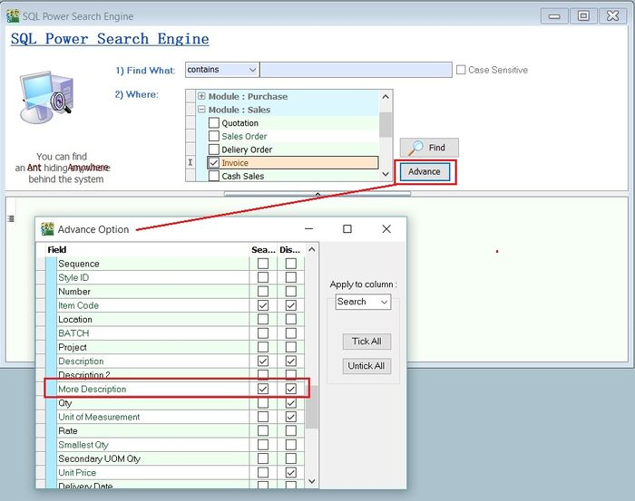

4. Type the keyword **Apple** in **Find What**.

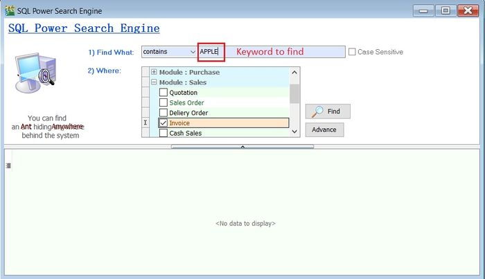

5. Click on **Find** button.

6. You can see the search result appear below.

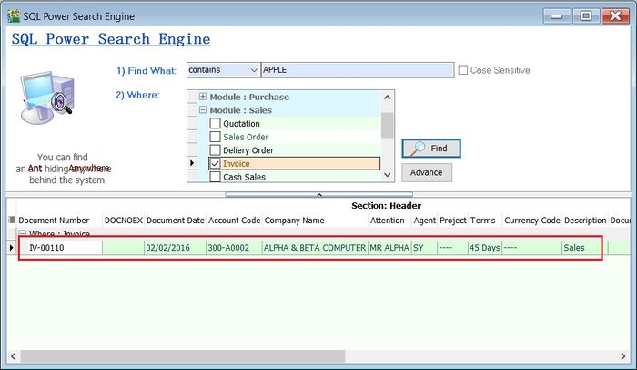