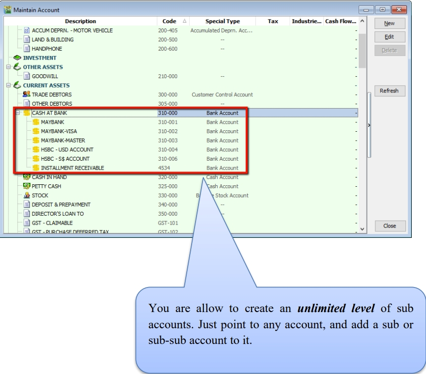

## General Ledger (Maintain Chart of Account)

:::info
Watch the tutorial video here: [YouTube](https://www.youtube.com/watch?v=hsdpDJImya4&feature=youtu.be)
:::

1. Create a New Account

    1. Select **GL** → **Maintain Account** → Select category (e.g. Fixed Assets) → **New**

2. Enter the **GL Code** and **Description** (alphanumeric characters are acceptable).

3. Check the **Special Account Type** if applicable,

    For example, if the account belongs to the Accumulated Depreciation Account (Fixed Assets).

4. Click **OK**. Your new account is now created.

    

    

5. Creating a Sub Account

    1. Point to the parent account (e.g. Cash at Bank)

    2. Follow the same steps as in **1. Create a New Account**

    

    You can create an unlimited number of sub-accounts. Point to any account and add a sub- or sub-sub-account.

## Maintain Customer

:::info
Watch the tutorial video here: [YouTube](https://www.youtube.com/watch?v=qn0xmeHUZkk&feature=youtu.be)
:::

There are four main tabs under Maintain Customer. Let's create a new customer and examine each tab individually.

### Create New Customer

1. **Customer** → **Maintain Customer** → **New**

2. **Enter the customer’s name and other relevant information**.

### General (Maintenance)

1. You can categorize your customers into different groups (e.g., category, agents, area).
   To create a new agent or area, follow the steps below:

    

2. You can also add multiple billing and delivery addresses (unlimited).

3. There are different options for viewing customer aging and customer statements.

    :::note
    1. **Customer Statement**

        - Brought Forward: Summary Statement
        - Open Item: Detail Statement

    2. **Customer Aging** - Invoice Date: based on IV Date - Due Date: Based on after due date (terms)
    :::

    

    

### Advance Credit Control (Additional Module)

You can set the credit limit and overdue limit amounts, and block certain transaction entries for specific customers. This applies to the following documents: Quotation (QT), Sales Order (SO), Delivery Order (DO), Invoice (IV), Cash Sales (CS), and Debit Note (DN).

We can also configure actions when the credit limit or overdue limit is exceeded:

1. Unblock – No restrictions apply.

2. Block – The transaction is blocked for all users.

3. Override – Authorized users can enter their credentials to override the block.

4. Suspended – The account is blocked with a suspension message.

### Tax

If the customer provides a certificate exemption number, complete parts A and B as shown below.

## Maintain Supplier

**Maintain Supplier** functions similarly to Maintain Customer; please refer to the [Maintain Customer](#maintain-customer) section.

Additional features: GIRO (beta version).

Refer to the [GIRO module PDF](http://www.sql.com.my/document/sqlacc_docs/PDF/13-05-GIRO_SupplierPayment.pdf) for more information.

## Maintain Stock Group

This allows users to set default account postings for specific groups of items.

:::info
Watch tutorial video here: [Stock Maintain Stock Item](https://www.youtube.com/watch?v=o4Z3oyhdeq0&feature=youtu.be)
:::

1. **Stock** → **Maintain Stock Group** → **New**

    

2. Enter the **code** and **description**. You can also assign a **costing method**, such as FIFO, Weighted Average, or Fixed Cost.

3. Assign the appropriate accounts for sales, cash sales, sales returns, purchases, cash purchases, and purchase returns.

    :::note
    You can create different stock groups for different costing methods to apply to various item codes.
    :::

## Maintain Stock Item

This allows users to maintain items or services provided by the business.

:::info
Watch tutorial video here: [Stock Maintain Stock Item](https://www.youtube.com/watch?v=o4Z3oyhdeq0&feature=youtu.be)
:::

1. **Stock** → **Maintain Stock Item** → **New**

    

2. Enter the **code** and **description**.

3. Assign the item to a **group** (refer to 2.4 Maintain Stock Group to create a new group)

4. Set the **Base UOM** as the default or smallest unit of measurement. **Ref Cost** and **Ref Price** serve as the default purchase and sales prices.

5. **Reorder Level, Reorder Qty, and Lead Time** are grouped together. These settings allow you to pre-configure details so that a report is generated as a reminder when stock quantity drops to the reorder level.

    :::note
    **Reorder Level** = When the stock balance drops to a specific level, the system prompts you to reorder stock.

    **Reorder Qty** = The quantity to reorder when printing the reorder advice report.

    **Lead Time** = The number of days required for the stock item to arrive.

    **Output Tax** = The default output tax code for an item (define only if different from the system default in **Tools** → **Option** → **Customer**)

    **Input Tax** = The default input tax code for an item (define only if different from the system default in **Tools** → **Option** → **Supplier**)

    **If tax codes are pre-set in both Customer and Stock Item, the system prioritizes the Maintain Customer tax code over the Stock Item tax code.**
    :::

6. You can set a **Min Price** to prevent sales personnel from selling below the minimum price.

7. **Multiple UOM is useful for various packaging options, as illustrated in the scenario below:**

    **Scenario A:**

    Suppose you sell blue pens in different packaging. You can sell them by pcs, box, or carton. You can pre-configure them as follows:

    

    As shown above, there are different Units of Measurement (UOM) and corresponding rates.

    :::note
    Base Rate = PCS = 1

    Box = 10 PCS

    Carton = 24 PCS
    :::
