## Overview Workflow

Sales coordinator usually will input the Sales Order (SO) based on the customer PO received. The stock products will be updated into the system as ordered qty. If the stock is purchased from a supplier, then the purchaser has to transfer from SO to PO.

Unless the stock is manufactured, then you have to proceed to the Job Order process. How much of the materials/components required to meet the products ordered by the customer? This question was raised by the Material Planning department. Therefore, the Job Order takes place as the order to be input after the Sales Order. It will plan the materials/components required based on the qty ordered from Sales Order.

When products produce out, you have to transfer the Job Order to the Stock Assembly to commit the stock on hand.

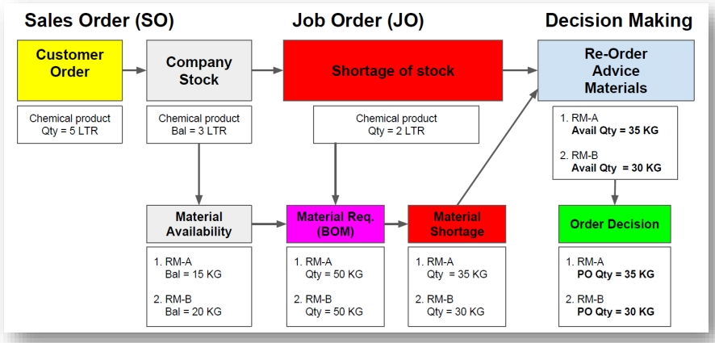

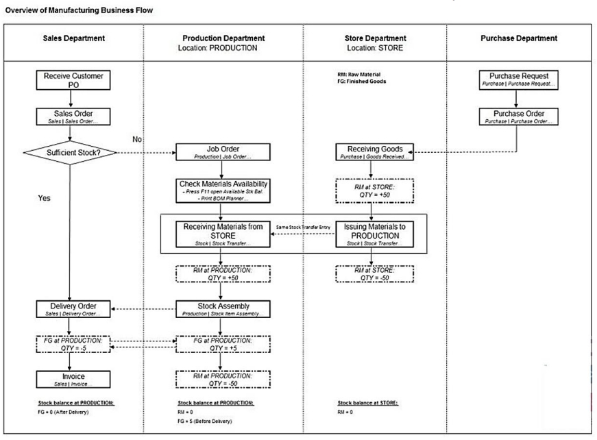

## Job Order

### Introduction

Sales coordinator usually will input the Sales Order (SO) based on the customer PO received. The stock products will be updated into the system as ordered qty.

How much of the materials/components required to meet the products ordered by the customer? This question was raised by the Material Planning department. Therefore, the Job Order takes place as the order to be input after the Sales Order. It will plan the materials/components required based on the qty ordered from Sales Order. When products produce out, basically you have to transfer the Job Order to the Stock Assembly to commit the stock on hand.

IMPORTANT: It is required for the Job Order module. For more information about price, please refer to our sales personnel.

:::important

It is required the SO -> PO and Job Order module. For more information about price, please refer to our sales personal.

:::

## Sales Order

    1. Create Sales Order (SO)
        
       Go to **Sales | Sales Order**

       Create and save the customer PO into Sales Order.

       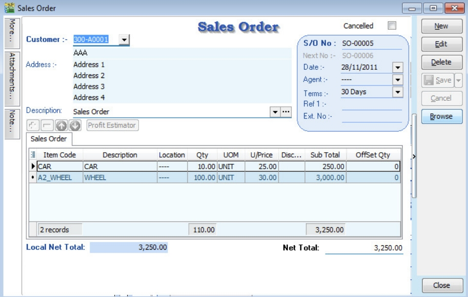

    2. SO Check the Available Stock Balance
       
       You can press F11 (Available Stock Balance) on the item code highlighted.

       Below is **CAR** stock available balance.

       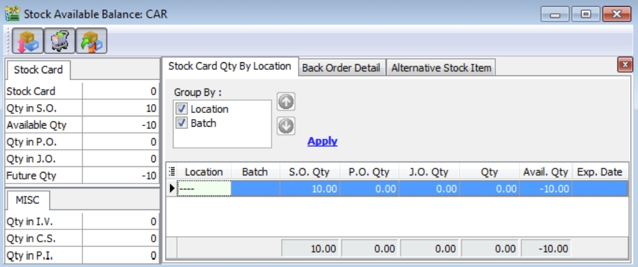

       :::note
       
       **Results for CAR Item:**

       SO Qty = -100.00

       PO Qty = 0.00

       JO Qty = 0.00

       Qty (On Hand) = 0.00

       Available Qty = -100.00
       
       :::

       Below is **WHEEL** stock available balance.

       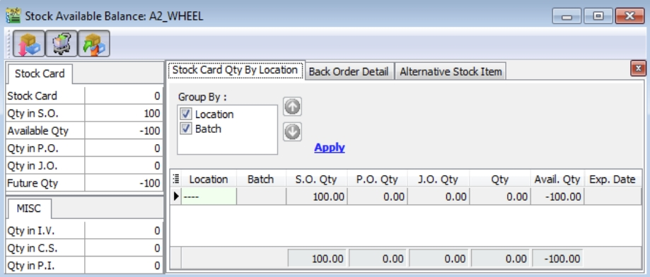

## Purchase Order (Transfer From So)

    1. Create New Purchase Order (PO)
       
       Go to Purchase | Purchase Order

       i.  Click on the NEW button to start with a new PO

       ii. Select the Supplier

       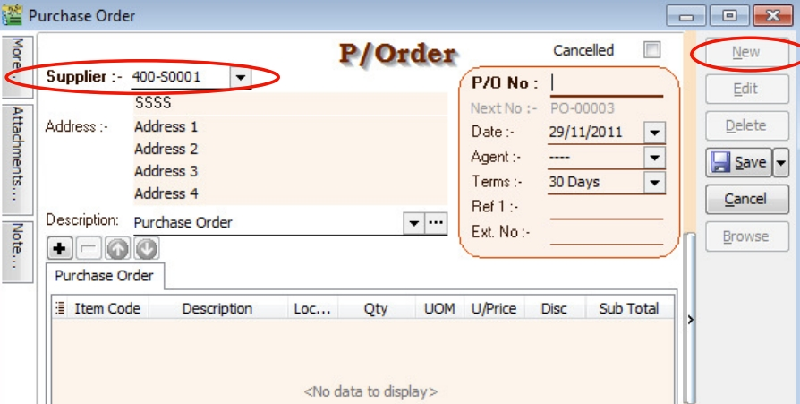

    2. PO Transfer From SO

       i.  Right click on P/Oder (Title)

       ii. Click on Transfer From Sales Order in the menu

       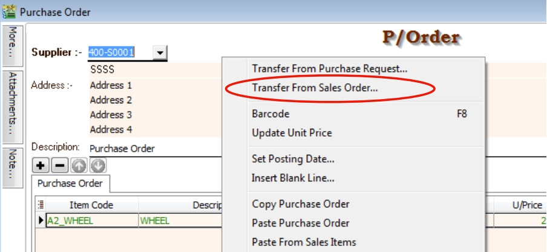

    3. Document Transfer (SO -> PO)

       i.   Pick the Item from the SO list

       ii.  Input X/F Qty to transfer over PO

       iii. Click OK to proceed

            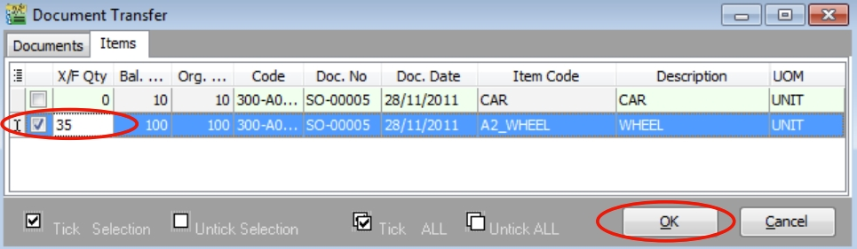

       iv.  Save the PO Document

            Click on the SAVE button

            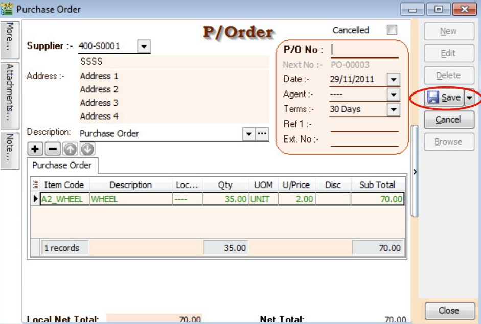

       v.   PO Check the Available Stock Balance
            
            You can press F11 (Available Stock Balance) on the item code highlighted.

            Below is WHEEL stock available balance

            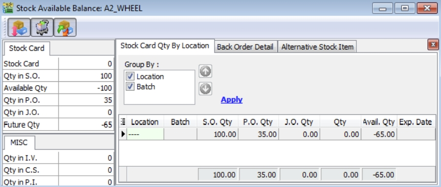

    :::note

    **Results for CAR Item:**

    SO Qty = -100.00

    PO Qty = -35.00

    JO Qty = 0.00

    Qty (On Hand) = 0.00

    Available Qty = -65.00
    
    :::

## Create New Job Order

CLICK on the NEW button and SELECT the Customer

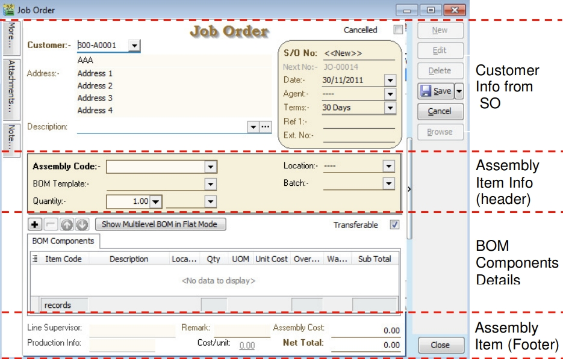

:::info

> **Customer Info from SO**

Basically, the customer and others information copy from SO.

> **Assembly Item Info (Header & Footer)**

Assembly item transferred from SO. It will determine the BOM Components required and the assembly unit cost.

> **BOM Components Details**

Total components quantity requirement to meet the total output.

:::

## Document Transfer (SO --> JO)

1. Create New Job Order (JO)

   Go to **Production | Job Order...**

   i. Click on the NEW button to start with a new JO

   ii. Select the Customer

   

2. JO Transfer From SO
   
   i.   Right click on Job Order (Title)

   ii.  Click on Transfer From Sales Order in the menu

   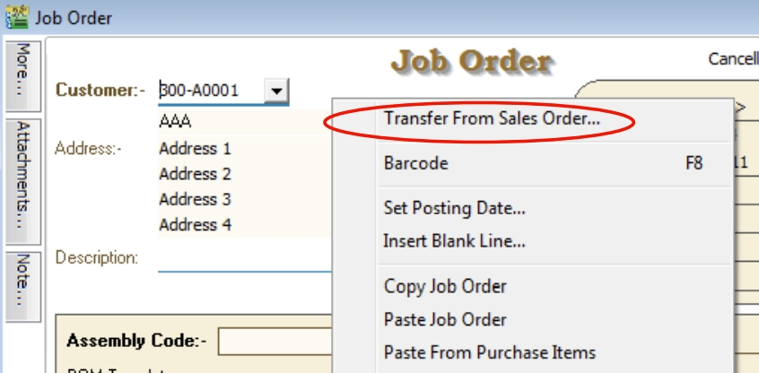

3. Document Transfer (SO --> JO)

   i.   Pick the Item from the SO list

   ii.  Input X/F Qty to transfer over JO

   iii. Click OK to proceed

   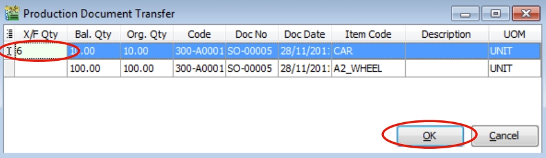

4. Show Multilevel BOM in Flat Mode

This function enables it to drill down to the flatten level of the multilevel BOM structure. For example, the CAR multilevel BOM structure.

|**Level 0** | **Level 1** | **Level 2** | **Level 3** |
|---|---|---|---|
|Car | Frame | Front Frame | Orange |
|Car | Frame | Front Frame | Screw |
|Car | Frame | Back Frame | Red Light |
|Car | Frame | Back Frame | Screw |
|Car | Wheel | Rim | 
|Car | Wheel | Tyres | 
|Car | Engine | Engine Block | Filter |
|Car | Engine | Engine Block | Screw |
|Car | Engine | Piston | Tube |
|Car | Engine | Piston | Cover |
|Car | Labour | 

Before FLAT MODE, BOM components show at **LEVEL 1**.

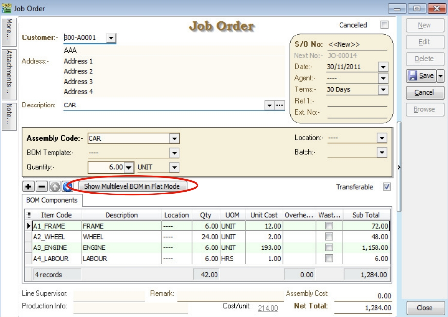

Click on Show Multilevel BOM in Flat Mode button.

It will prompt the below message.

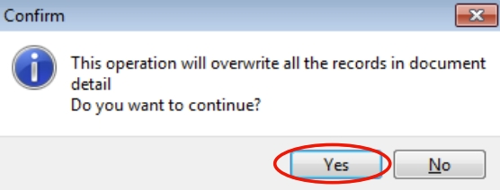

Press NO to keep the BOM components at **LEVEL 1**.

Press YES to continue flatten the multilevel BOM to **LEVEL 3**.

After FLAT MODE, BOM components show at **LEVEL 3**.

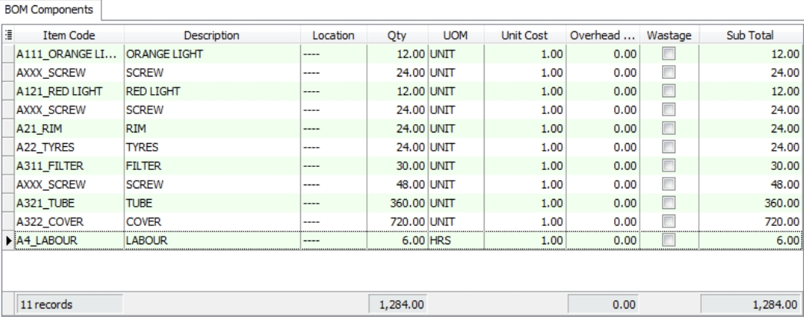

5. Save the JO Document

Click on the SAVE button

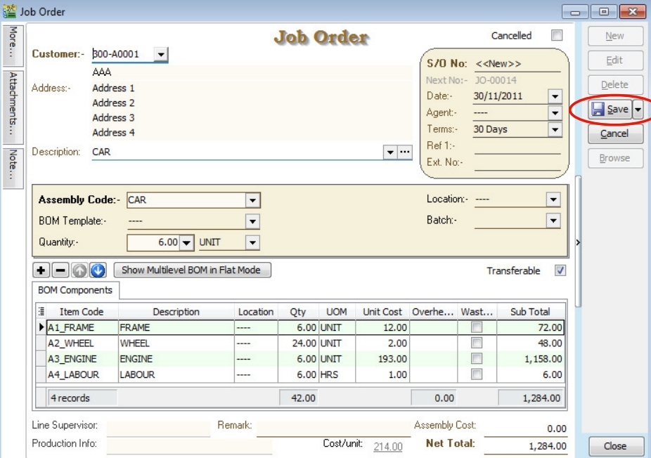

6. JO Check the Available Stock Balance

You can press F11 (Available Stock Balance) on the item code highlighted.

Below is component “FRAME” stock available balance.

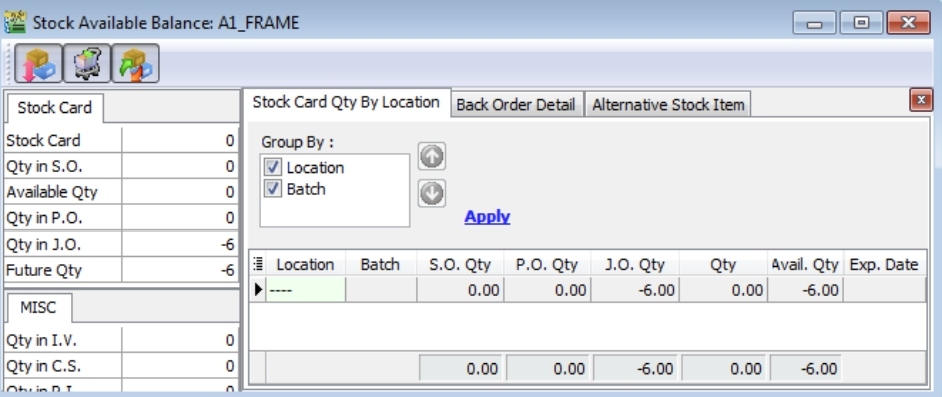

:::note

**Result for component "FRAME" Item:**

SO Qty = 0.00

PO Qty = 0.00

JO Qty = -6.00

Qty (On Hand) = 0.00

Available Qty = -6.00

:::

Below is component “WHEEL” stock available balance.

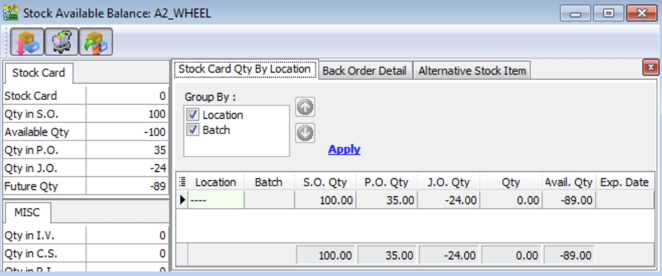

:::note

**Result for component "WHEEL" Item:**

SO Qty = -100.00

PO Qty = +35.00

JO Qty = -24.00

Qty (On Hand) = 0.00

Available Qty = -89.00

:::

Below is component “WHEEL” stock available balance.

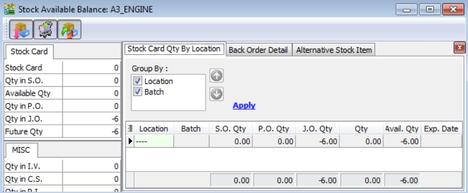

:::note

**Result for component "ENGINE" Item:**

SO Qty = 0.00

PO Qty = 0.00

JO Qty = -6.00

Qty (On Hand) = 0.00

Available Qty = -6.00

:::

## Offset Qty

### Offset Qty In Sales Order

What is the purpose of the OFFSET Qty in Sales Order? You will see a new column named “OffSet Qty”. It allows you to input a value to increase/reduce the original QTY to be transferred to Purchase Order and Job Order.

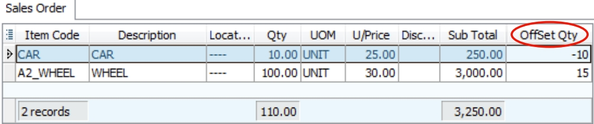

1. Positive Offset Qty

REDUCE the Transferable QTY to PO and JO.

For example,

|**SO Original Qty**|**Offset Qty**|**Transferable to PO/JO**|
|---|---|---|
|100.00 | 0.00 (default) | 100.00 |
|100.00 | +15.00 | 85.00 |

2. Negative Offset Qty

INCREASE the Transferable QTY to PO and JO.

For example,

|**SO Original Qty**|**Offset Qty**|**Transferable to PO/JO**|
|---|---|---|
|100.00 | 0.00 (default) | 100.00 |
|100.00 | -15.00 | 115.00 |

## Split to X Process

1. With this field, users are able to assign a number of processes/machines in one Job Order/Stock Item Assembly to produce the same End Products using the same range of BOM components.

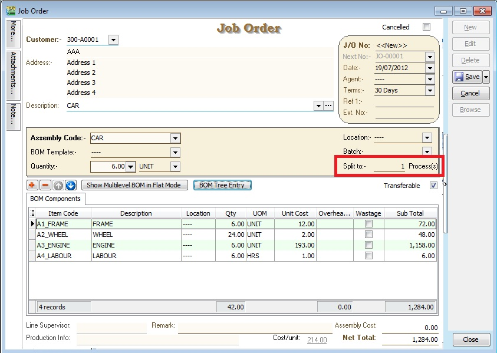

2. For example, To make a cup of MILO KAO KAO, it needs - MILO Powder x 5 spoons - Sugar x 0.5 spoon - Water x 100ml

In order to make 100 cups of milo from one Job Order created, we need 10 persons to make it more efficient. Therefore, we have to input "Split to 10 process(s)", it means 10 persons processing. Job Order will be break the BOM components into 10 processes like below:

|**No of process(s)** | **1** | **2** | **3** | **4** | **5** | **6** | **7** | **8** | **9** | **10** | **TOTAL** |
|---|---|---|---|---|---|---|---|---|---|---|---|
|MILO POWDER | 50 | 50 | 50 | 50 | 50 | 50 | 50 | 50 | 50 | 50 | 500 spoons |
|Sugar | 5 | 5 | 5 | 5 | 5 | 5 | 5 | 5 | 5 | 5 | 50 spoons |
|Water | 1000 | 1000 | 1000 | 1000 | 1000 | 1000 | 1000 | 1000 | 1000 | 1000 | 10000 ml |

NOTE: Preview and select the standard report name "Job Order 2 with Multiplier - 30 Columns (without cost)".

## BOM Tree Entry

1. Some manufacturing companies need to modify and overwrite the standard BOM structure during the entry stage. This button helps to add/remove the components to overwrite the BOM structure.

2. Click the "BOM Tree Entry" button.

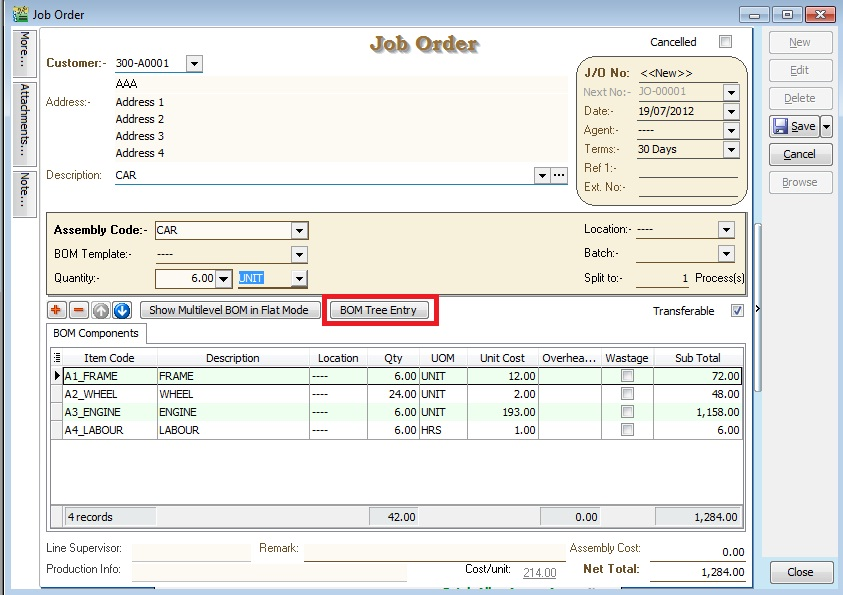

3. You can drill down all the BOM structures.

4. Tick the components in the tree you wish to insert into the Job Order/Stock Assembly/Disassembly.

5. Press OK to confirm.

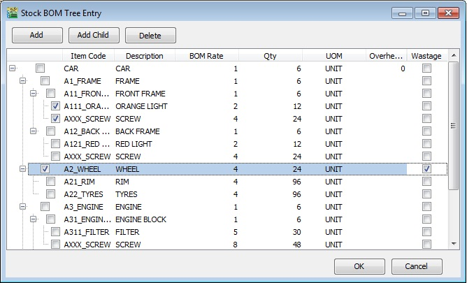

|**Button**|**Function**|
|---|---|
|Add | To add new components at LEVEL 1 ONLY |
|Add Child | To add new child components start from LEVEL 2 onwards |
|Delete | To remove the components at all LEVEL 1, 2, 3, 4, ... |
