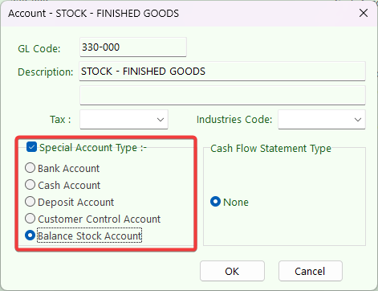
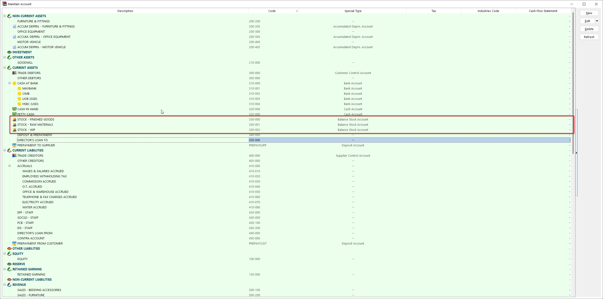
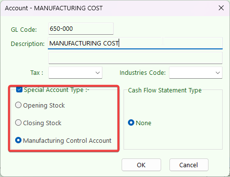
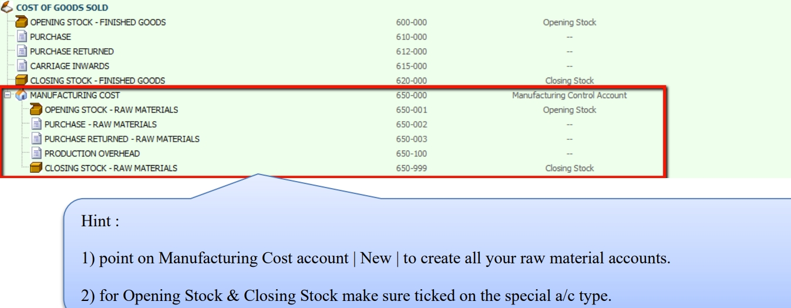
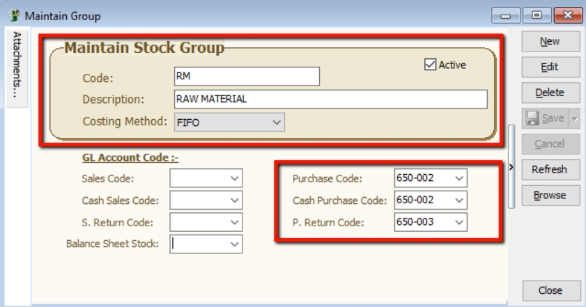
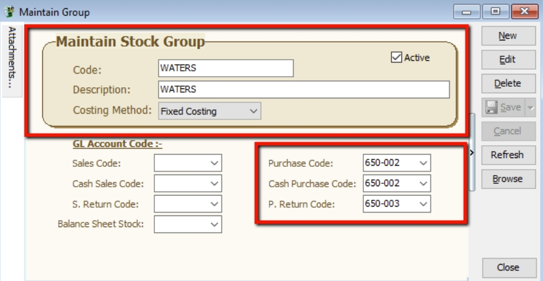
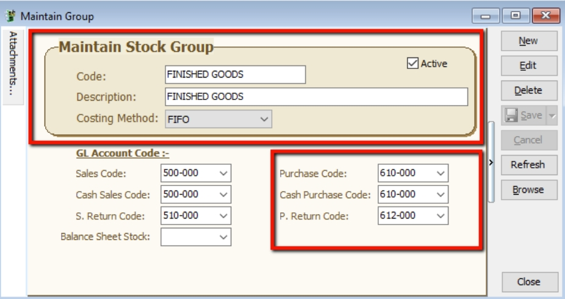
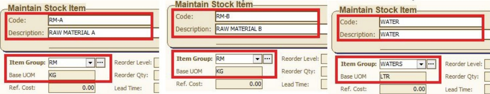
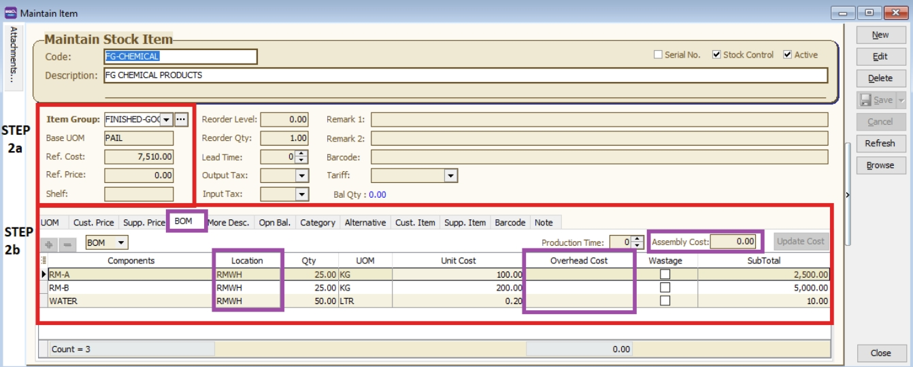
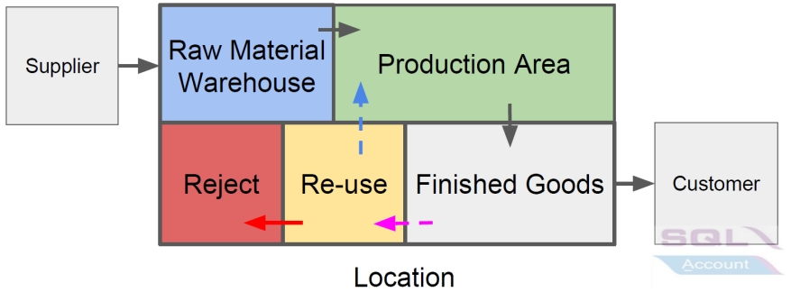

:::info
    Watch tutorial video here: [Youtube](https://youtu.be/q97_s92bmZQ)
:::

## Chart of Account

1. GL > Maintain Account

2. Create finished good, raw material, WIP's closing stock account in your balance sheet current asset account as below

    

    

3. Create Manufacturing Account under Cost of Goods Sold (Profit & Loss)

    i. Highlight on Cost of Goods Sold and click on NEW Button, Insert GL Code, Description and make sure to tick on a special Account type Manufacturing Control Account.

    

    ii. Highlight on Cost of Goods Sold and click on NEW Button, Insert GL Code, Description and make sure to tick on a special Account type Manufacturing Control Account.
    
    

## Stock Group

Stock -> Maintain Stock Group

Used to differentiate the types of stocks and the costing method used for the stock, e.g. raw materials, finished goods, etc.

To produce a chemical products, the costing calculation based on stock group:-

    1. Raw Materials

        Assign your Raw Material Purchase code, Cash Purchase code, Purchase Return code.

        - Costing Method : FIFO

        
    
    2. Water

        Assigned your Raw Material Purchase code, Cash Purchase code, Purchase Return code.

        - Costing Method : Fixed Costing

        

    3. Finished Goods
        
        Assigned your Finished Goods Purchase code, Cash Purchase code, Purchase Return code.
        
        - Costing Method : FIFO

        

## Stock Item

Stock -> Maintain Stock Item

Setup the stock item master data for all types of stock. Eg. raw materials, end products, trading products, etc.

    1. Create all your raw materials items and assigned stock group respectively.

        

    2. Create your finished goods item and assign raw materials.

        i. assigned stock group, enter based UOM, ref cost and ref price.

        ii. go to the BOM tab, choose this product as a BOM item, and assign all the raw materials, quantity needed.

        Location is the Raw Materials kept and deducted from which warehouse.
        
        Overhead Cost is a fixed additional cost to the material cost incurred during each material process.
        
        Assembly Cost is a fixed cost incurred to the entire process for final products.

        

## Location (Warehouse)

Stock > Maintain Location

Define the warehouse code to identify the stock movement between the locations.

1. Receive raw materials from purchase and keep at the Raw Materials Warehouse.

2. Production uses the materials to produce the final products. Raw materials must be deducted from the Raw Materials Warehouse.

3. Final products will be kept at the Finished Goods Warehouse.

4. Work in progress stock kept in WIP Warehouse.

