## Introduction

Stock Item Assembly is an entry form to record the actual components (materials) usage to convert/produce the final product based on the actual output. Unit cost will be used to revalue the stock balance.

Actual components (materials) used will be deducted out from the stock balance. However, the final products will replenish the stock balance. You can always check the stock movement from the stock card report.

## Stock Item Assembly (Transfer From JO)

1. Create New Stock Item Assembly (AS)

    Go to **Production | Stock Item Assembly…**

    Click on the NEW button to start with a new AS.

    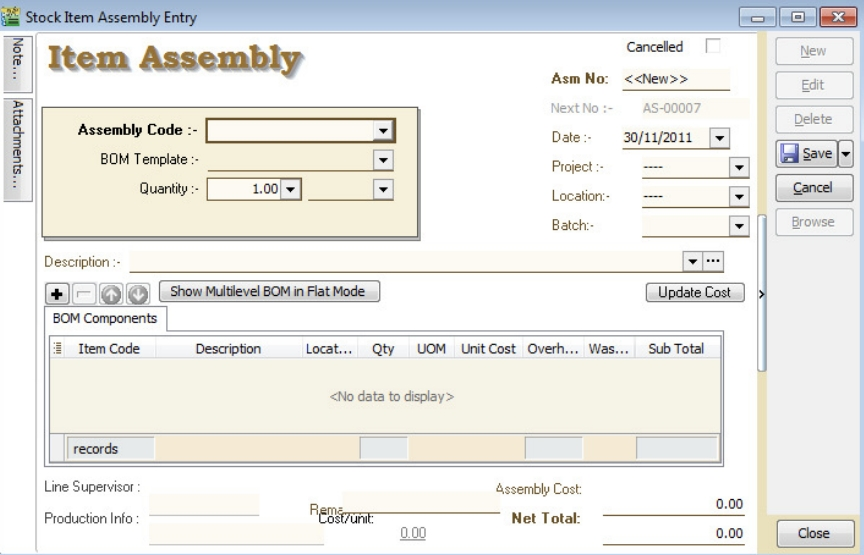

2. AS Transfer From JO

   1. Right click on Item Assembly (Title).

   2. Click on Transfer From Job Order in the menu.

   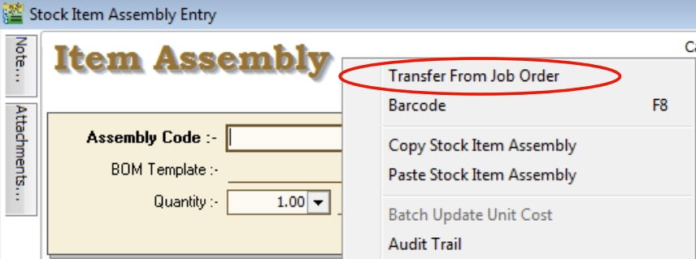

3. Document Transfer (JO → AS)

   1. Pick the Item from the JO list.

   2. Input X/F Qty to transfer over AS.

   3. Click OK to proceed.

   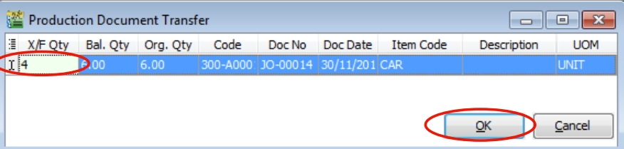

4. Save the AS Document

   Click on SAVE button.

   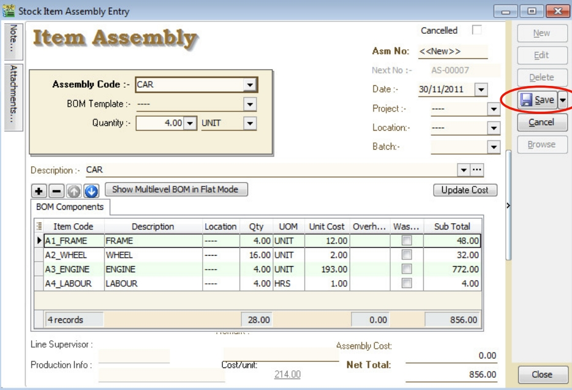

5. AS Check the Available Stock Balance

   You can press F11 (Available Stock Balance) on the item code highlighted.

   Below is **component “FRAME”** stock available balance.

   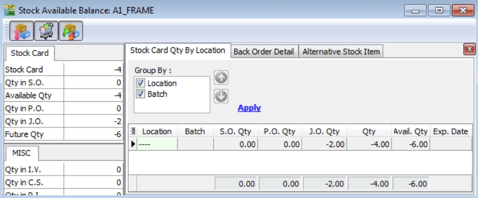

   :::note
   
   **Result for component "FRAME" item:**

   SO Qty = 0.00

   PO Qty = 0.00

   JO Qty = -2.00

   Qty (On Hand) = -4.00

   Available Qty = -6.00
   
   :::

   Below is **component “WHEEL”** stock available balance.

   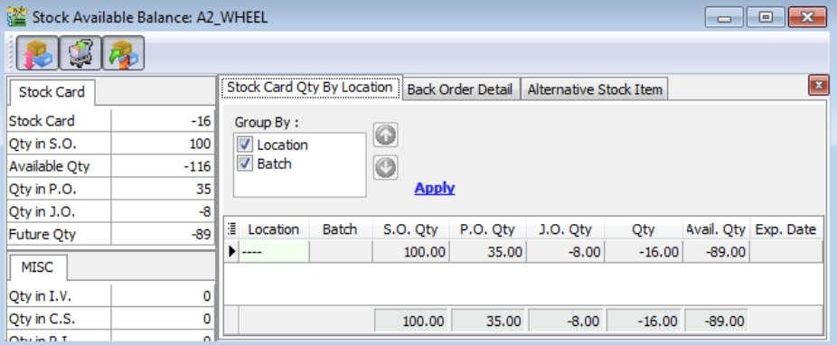

   :::note
   
   **Result for component "WHEEL" item:**

   SO Qty = -100.00

   PO Qty = +35.00

   JO Qty = -8.00

   Qty (On Hand) = -16.00

   Available Qty = -89.00
   
   :::

   Below is **component “ENGINE”** stock available balance.

   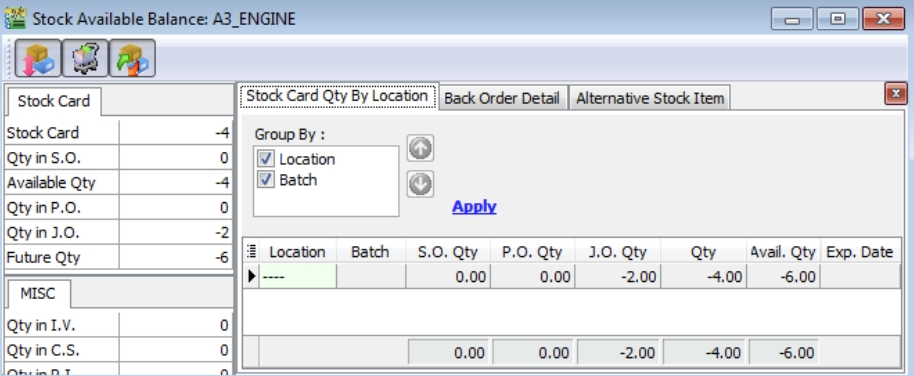

   :::note
   
   **Result for component "ENGINE" item:**

   SO Qty = 0.00

   PO Qty = 0.00

   JO Qty = -2.00

   Qty (On Hand) = -4.00

   Available Qty = -6.00
   
   :::

## Batch Update Unit Cost

Allow users to run Update Unit Cost for ALL or Stock Item Assembly selected.

1. At Stock Item Assembly browse, RIGHT click on the area between the detail and close button.

2. You will see the small menu. See screenshot below.

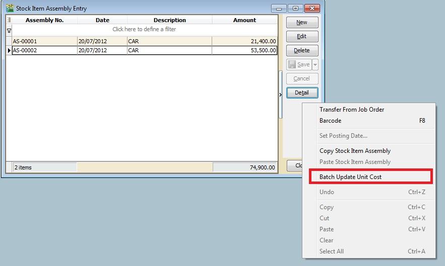

3. Click on Batch Update Unit Cost. You will see the screenshot below.

4. You can highlight more than one Stock Assembly document. RIGHT click and "Tick Selection".

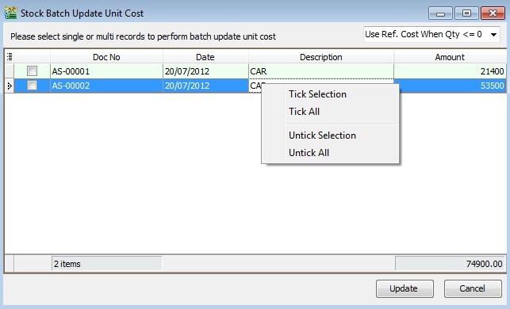

5. After that, press the UPDATE button to start.

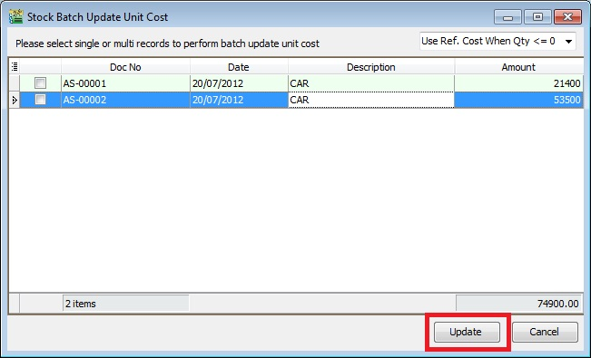

6. Once completed, it will prompt the below message. Press OK to exit.

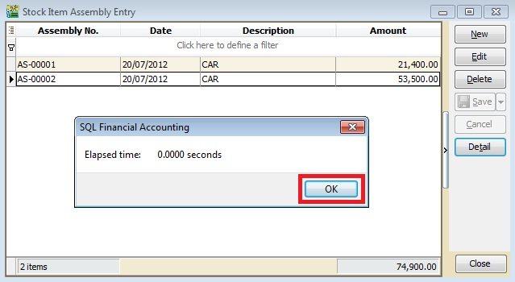
