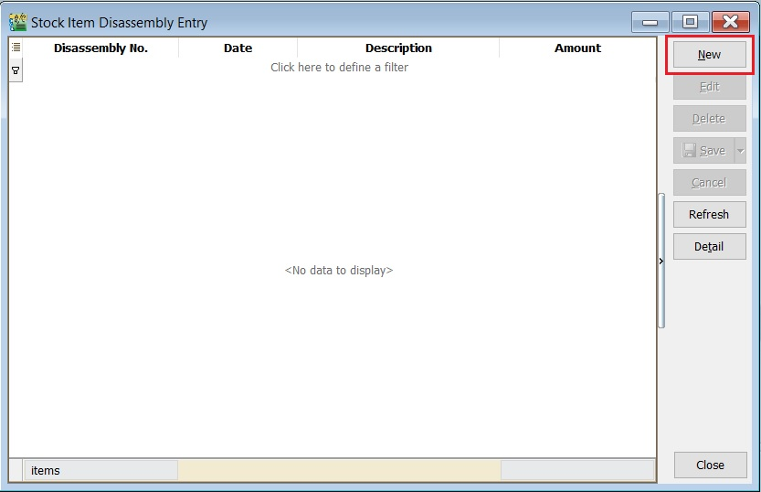
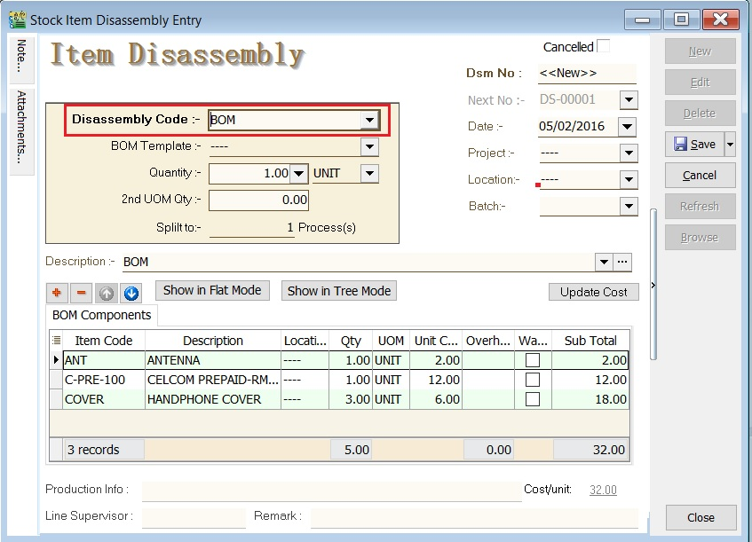
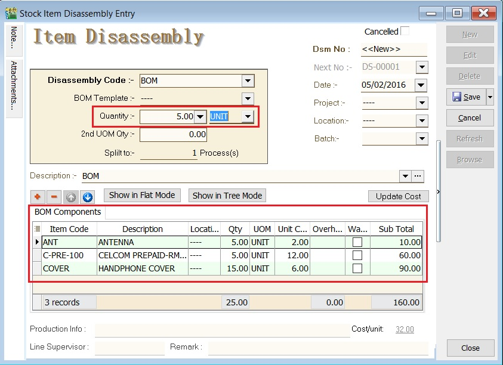
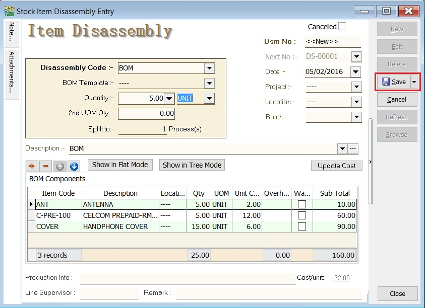

## Introduction

Stock Item Disassembly is an entry form to record the actual components (materials) to be received after convert or disassemble from the final product.

Components (materials) will be added into the stock balance. However, the final products will be deducted out from the stock balance. You can always check the stock movement from the stock card report.

## Stock Item Disassembly (DS) Entry

1. CLICK on the **NEW** button.

2. Select the **Disassembly Code** to disassembly.

3. Enter the **quantity**. BOM components quantity based on the BOM master in **Maintain Stock Item**.

4. CLICK on the **SAVE** button.

### Stock Balance Result After Disassembly

Stock balance results:

| | Item Code | Qty | DS | **After DS Qty** |
|---|---|---|---|---|
|End Products | BOM | 5.00 | -5.00 | **0.00** |
|Component | ANT | 0.00 | +5.00 | **5.00** |
|Component | C-PRE-100 | 0.00 | +5.00 | **5.00** |
|Component | COVER | 0.00 | +15.00 | **15.00** |
