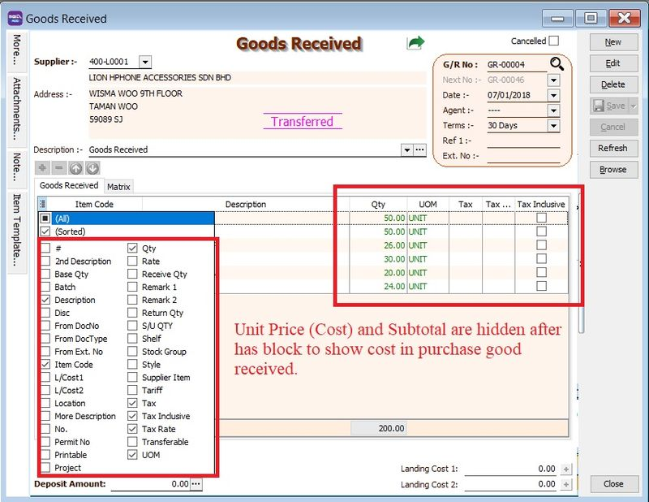
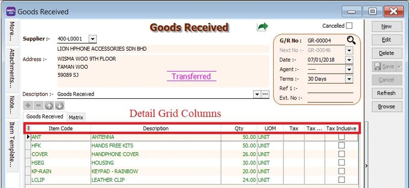
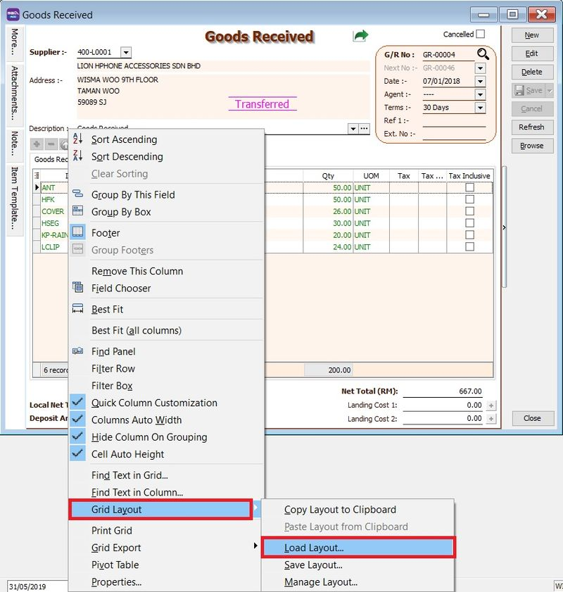
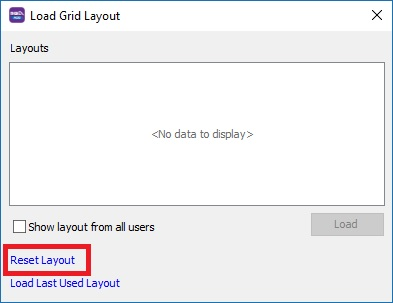

## 1. Why are the Unit Price and Subtotal missing in the Goods Received Note/Invoice even after granting "Show Cost" rights?

**Issue:**

1. User Access Control has been granted for **Show Cost in Purchase Goods Received**.
2. However, the Purchase Goods Received Note still does not display the **Unit Price**, **Tax Amount**, or **Subtotal**.

**Solution:**

1. Hover your mouse over any column header in the detail grid.

    

2. **Right-click > Grid Layout > Load Layout**.

    

3. In the **Load Grid Layout** window, click **Reset Layout**.

    

4. The detail grid layout will be reset to reflect the user's current access rights.

    
