## Purchase Request

Purchase Request is an internal document used within a company between departments to request for purchase or a product

For example, you want to purchase more office supplies. You have to submit a purchase request to the purchasing department.

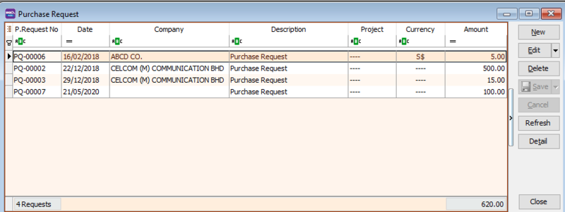

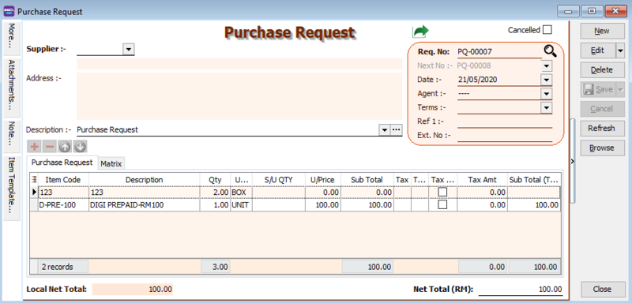

### Data Entry

**1. Purchase | Purchase Request | New**

**2. Select Supplier Code**

**3. Insert Item Code and details** (e.g. Qty, Unit Cost)

**4. Write a description to explain your purchase request**

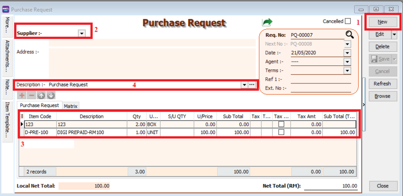

**5. Click the Save button once you are done. Below is the example of the entry created.**

## Purchase Order

Purchase Order is a document that is issued by the purchasing department when placing an order with their supplier.

A purchase order document contains the details (quantity, unit price) of the items that want to be purchased.

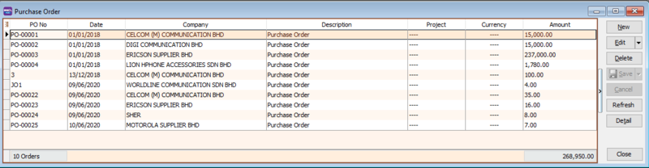

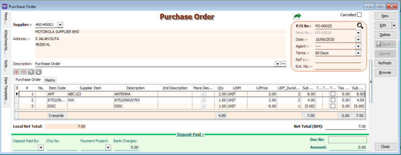

### Data Entry

1. **Purchase | Purchase Order | New**

2. **Select Supplier Code**

3. **Insert Item**

   3a. **Insert Item Code and details** (e.g. Qty, Unit Cost)

      :::note

      You can navigate the search column by using the “TAB” button on your keyboard. It will apply to all drop down tables.

      :::

   3b. **Click on the show/hide/move column icon to customize your column layout**.

   3c. If you want to key in for a discount amount, you may tick the discount field by following step 3b and update the discount field. You can key in multiple levels of discount as shown by the picture attached.

4. **Write a description to explain your purchase order**

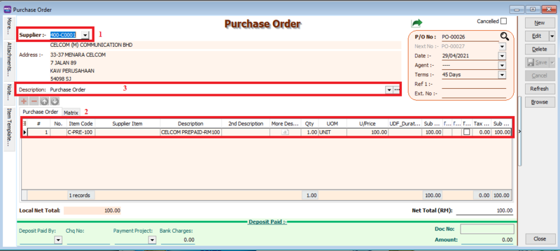

5. **Click the Save button once you are done. Below is the example of the entry created:**

### More : Project

There are 2 types of project you need to be take note:

1.Document Project

2.Detail Project

For **document project**, you need to point to **MORE** section **(on the left side bar)**.

For **detail project**, you have to insert the **project** column out from Field Chooser.

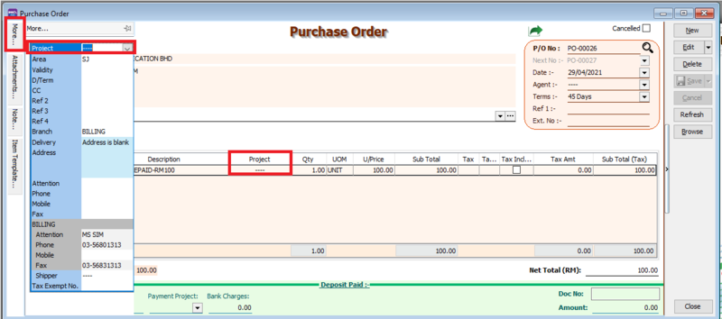

### Attachment

You can use this feature to attach external PDF, excel, word documents and image files.

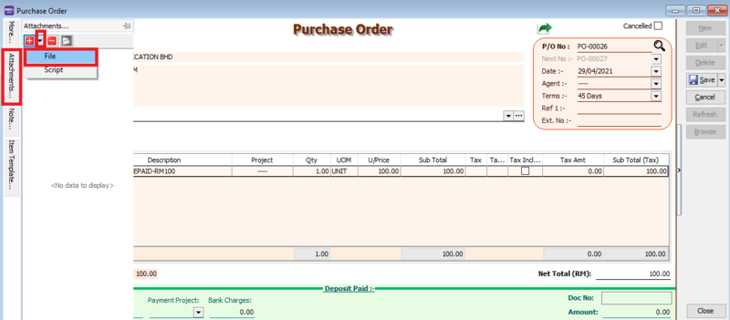

1. Go to the left of the screen and click "Attachment"

2. Click the small black arrow at the link icon

3. Select ‘Attach files to Local Drive’, and choose the file from your computer that you want to attach

### Note

1. Click on the Note section (on the LEFT side bar).

2. RIGHT click it, you will see the Rich Text Editor pop-up.

3. You can start key-in the note. See the example screenshot below.

4. Click on the X button to save and exit the Rich Text Editor.

5. You will get prompted the ‘Save changes?’ message. Click YES to save it.

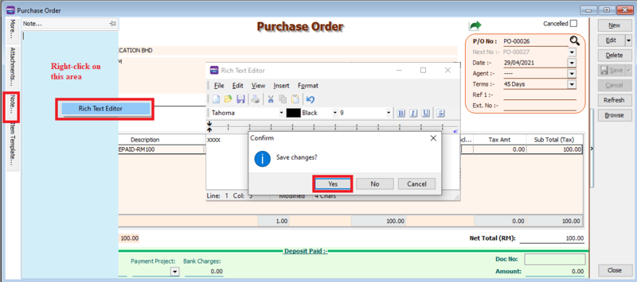

### How to preview report

To preview the report, you may click on the preview button and select the format you wish to print.

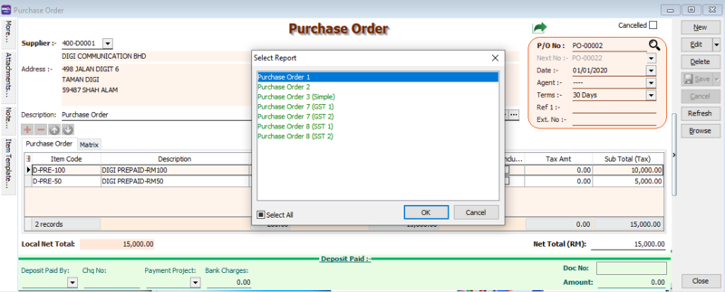

### How to send report via Whatsapp

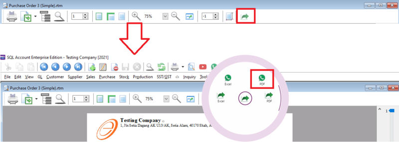

A QR code will appear on the screen. Scan the QR code with your Whatsapp's Whatsapp Web function.

## Goods Receive

Goods Received is a document that is issued after receiving the delivery as proof of the order receipt.

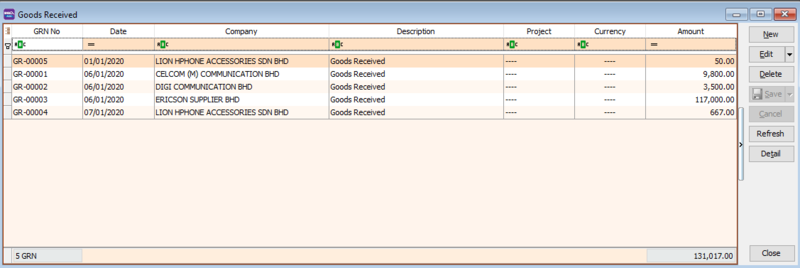

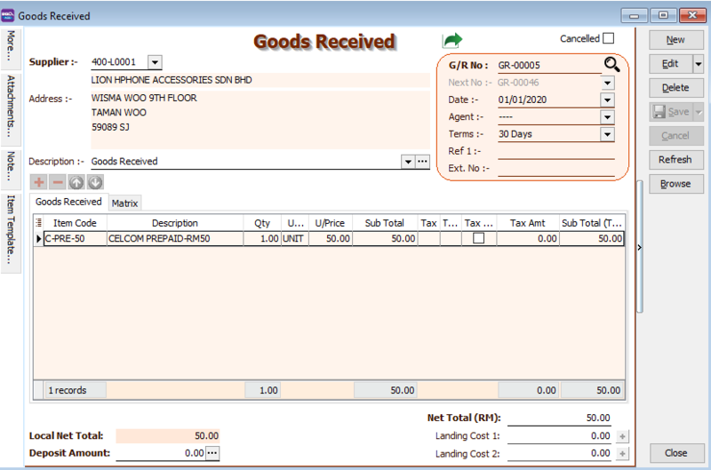

### Data Entry

1. **Purchase | Goods Receive | New**

2. **Select Supplier Code**

3. **Insert Item Code and details (e.g. Qty, Unit Cost)**

4. **Write a description to explain your goods receive**

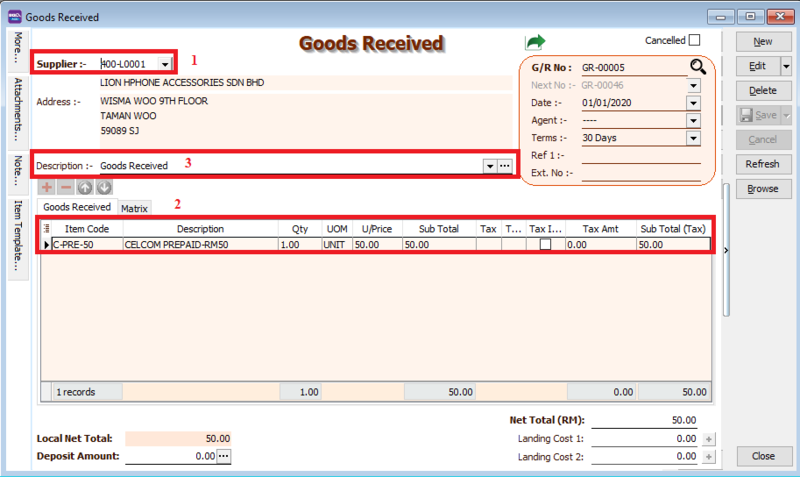

5. **Click the Save button once you are done. Below is the example of the entry created:**

### Transfer From PO

1. **Purchase | Goods Receive | New**

2. **Select Supplier Code**

3. **Right Click on G/R Note title**, select **Transfer from Purchase Order**, tick the document that you wish to transfer

4. **Save** the Goods Received Note

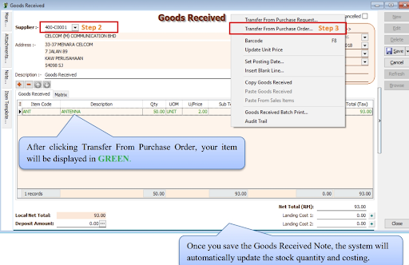

### Notes - Landing Cost

Landing Cost is to handle the cost to the warehouse that is not billed by the same supplier. In other words, it is an additional cost to increase your stock cost. This cost is depending on the company whether they want to add in or not. For Instant, I buy the product from Supplier A, but ship by Transport company B, this transport charges you may enter at landing cost to increase your product cost.

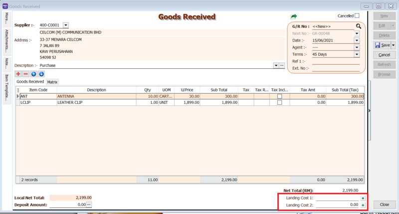

How to set Landing Cost?

Follow the below image:

1. **Landing Cost 1** = Key your Landing Cost to this column.(This cost will not take into the account.)
2. **Landing Cost 2** = If you have a different calculation than Landing Cost 1, you may enter your value to this column.
3. Click on + Button to select the cost allocated.

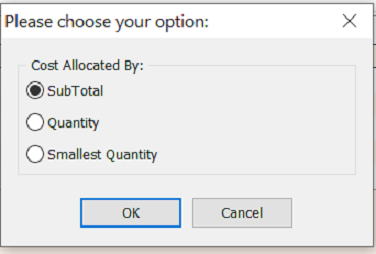

**Formula for Cost Allocated By SubTotal**

- Formula : Item Subtotal / Document Subtotal * Landing Cost1

:::note

   Item 1 = A/B * C

   Landing Cost1 (D) = 50.00 / 1949.00 * 200 = 5.13

   Item 2

   Landing Cost (D) = 1899.00 / 1949.00 * 200 = 194.87

:::

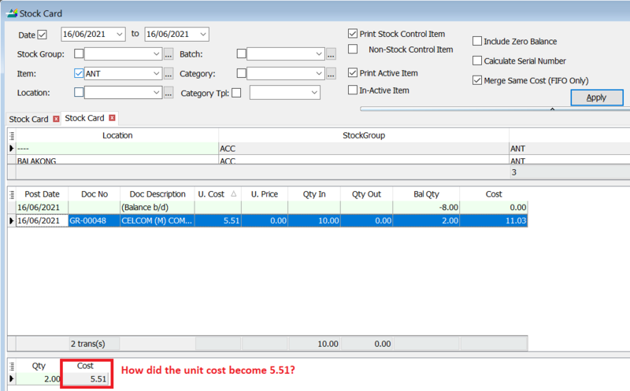

:::note

   How to get unit cost = 5.51?

   Formula : Product Unit Cost + Item Landing Cost1 / Item Qty

   Formula : 5 + (5.13 / 10) = 5.51

:::

**Formula for Cost Allocated By Qty**

- Formula : Item Qty / Document Qty * Landing Cost1

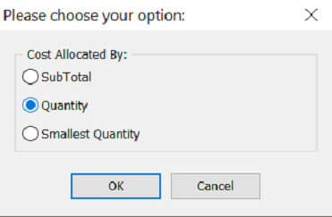

:::note

   Item 1 : 10 / 11 * 200 = 181.81

   Item 2 : 1 / 11 * 200 = 18.18

:::

**Stock Card Report Outcome:**

:::note

   *Item ANT : unit cost will be 23.18, how to get 23.18 ?
   
   Unit Cost + (Landing Cost1 / Qty) = 5 + (181.82 / 10) = 23.18

   *Item LCLIP : Unit Cost will be 1917.18

   Unit Cost + (Landing Cost1 / Qty) = 1899 + (18.18 / 1) = 1917.18

:::

**Formula for Cost Allocated By Smallest Qty**

- Formula : Item Qty * Rate/ Sum(Qty * Rate) * Landing Cost1

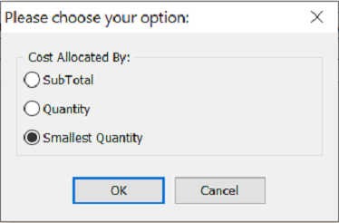

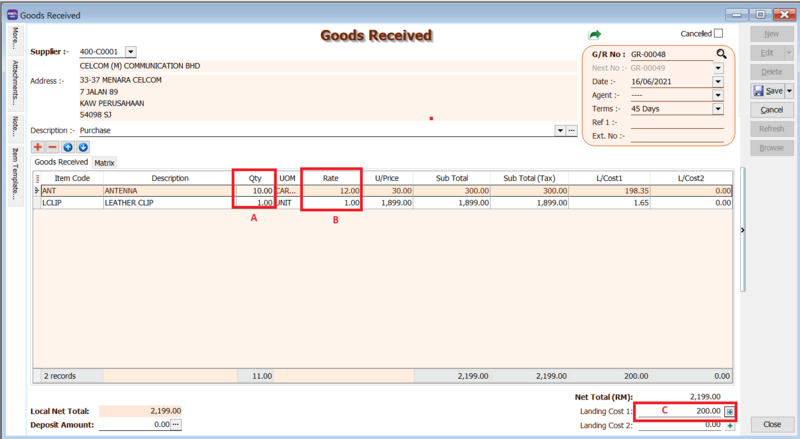

:::note

   Item 1 : 10 * 12 = 120 / 121 = 198.35

   Item 2 : 1 * 1 = 1 / 121 = 1.65

:::

**Stock Card Report Outcome**

:::note

   Item 1 : Unit cost for ANT = [Unit Price + (Item Landing Cost1 / Item Qty)] / ItemRate = [30 + (198.35 / 10)] / 12 = 4.15

   Item 2 : Unit cost for LCLIP = [Unit Price + (Item Landing Cost1 / Item Qty)] / ItemRate = 1899 + 1.65 = 1900.65

:::

That seed will grow to be a peach tree. You may wish for an apple or an orange, but you will get a peach.

## Purchase Invoice

You can key in the purchase invoice after your purchase order has been approved and after you have received your goods.

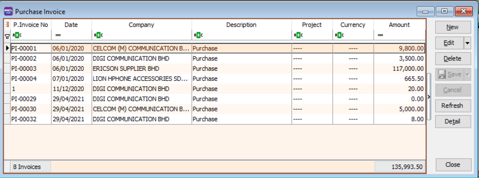

### Data Entry

1. **Purchase | Purchase Invoice | New**

2. **Select Supplier Code**

3. **Insert Item**

   3a. **Insert Item Code and details** (e.g. Qty, Unit Cost)

   :::note

      You can navigate the search column by using the "TAB" button on your keyboard. It will apply to all drop down tables.

   :::

   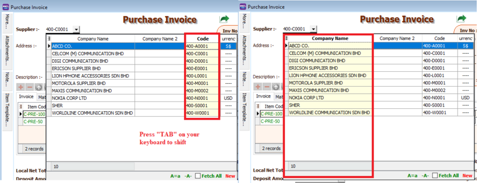

4. **Write a description to explain your purchase invoice**

5. **Click the Save button once you are done.  Below is the example of the entry created:**

**Double Entry will be:-**

| Account            | DR (RM) | CR (RM) |
|--------------------|---------|---------|
| Purchase Account   | 500.00  |         |
| Supplier Account   |         | 500.00  |

### Transfer From DO

1. **Purchase | Purchase Invoice | New**

## Cash Purchase

## Extra Goods Receive

## Purchase Debit Note

## Purchase Returned

## Purchase Cancelled Note

