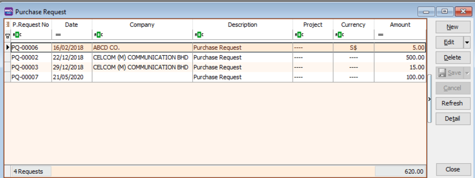
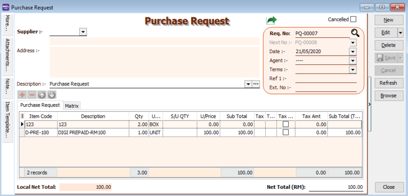
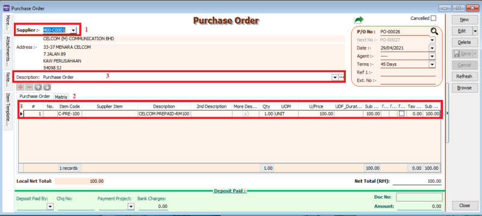
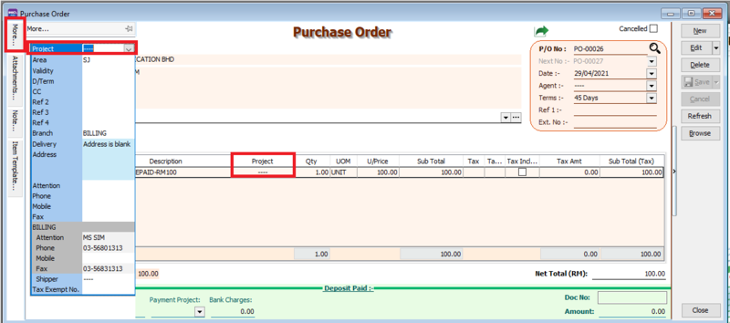
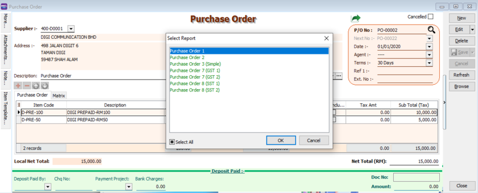
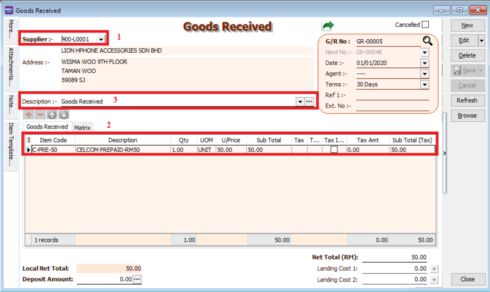

## Purchase Request

Purchase Request is an internal document used within a company between departments to request for purchase or a product

For example, you want to purchase more office supplies. You have to submit a purchase request to the purchasing department.

### Data Entry

**1. Purchase | Purchase Request | New**

**2. Select Supplier Code**

**3. Insert Item Code and details** (e.g. Qty, Unit Cost)

**4. Write a description to explain your purchase request**

**5. Click the Save button once you are done. Below is the example of the entry created.**

## Purchase Order

Purchase Order is a document that is issued by the purchasing department when placing an order with their supplier.

A purchase order document contains the details (quantity, unit price) of the items that want to be purchased.

### Data Entry

1. **Purchase | Purchase Order | New**

2. **Select Supplier Code**

3. **Insert Item**

   3a. **Insert Item Code and details** (e.g. Qty, Unit Cost)

      :::note

      You can navigate the search column by using the “TAB” button on your keyboard. It will apply to all drop down tables.

      :::

   3b. **Click on the show/hide/move column icon to customize your column layout**.

   3c. If you want to key in for a discount amount, you may tick the discount field by following step 3b and update the discount field. You can key in multiple levels of discount as shown by the picture attached.

4. **Write a description to explain your purchase order**

5. **Click the Save button once you are done. Below is the example of the entry created:**

### More : Project

There are 2 types of project you need to be take note:

1.Document Project

2.Detail Project

For **document project**, you need to point to **MORE** section **(on the left side bar)**.

For **detail project**, you have to insert the **project** column out from Field Chooser.

### Attachment

You can use this feature to attach external PDF, excel, word documents and image files.

1. Go to the left of the screen and click "Attachment"

2. Click the small black arrow at the link icon

3. Select ‘Attach files to Local Drive’, and choose the file from your computer that you want to attach

### Note

1. Click on the Note section (on the LEFT side bar).

2. RIGHT click it, you will see the Rich Text Editor pop-up.

3. You can start key-in the note. See the example screenshot below.

4. Click on the X button to save and exit the Rich Text Editor.

5. You will get prompted the ‘Save changes?’ message. Click YES to save it.

### How to preview report

To preview the report, you may click on the preview button and select the format you wish to print.

### How to send report via Whatsapp

A QR code will appear on the screen. Scan the QR code with your Whatsapp's Whatsapp Web function.

## Goods Receive

Goods Received is a document that is issued after receiving the delivery as proof of the order receipt.

### Data Entry

1. **Purchase | Goods Receive | New**

2. **Select Supplier Code**

3. **Insert Item Code and details (e.g. Qty, Unit Cost)**

4. **Write a description to explain your goods receive**

5. **Click the Save button once you are done. Below is the example of the entry created:**

### Transfer From PO

1. **Purchase | Goods Receive | New**

2. **Select Supplier Code**

3. **Right Click on G/R Note title**, select **Transfer from Purchase Order**, tick the document that you wish to transfer

4. **Save** the Goods Received Note

## Purchase Invoice

## Cash Purchase

## Extra Goods Receive

## Purchase Debit Note

## Purchase Returned

## Purchase Cancelled Note

