## Purchase Workflow

Example of the purchase process workflow aligned with the SQL Account flow:

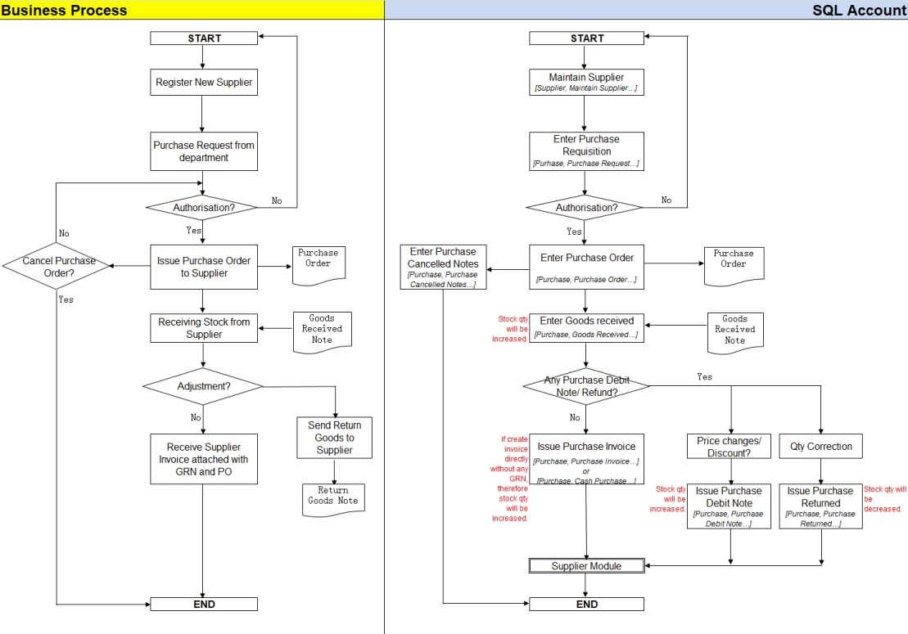

## Purchase Request

A Purchase Request is an internal document used within a company to request products or services between departments.

For example, if you need to purchase office supplies, you must submit a Purchase Request to the purchasing department.

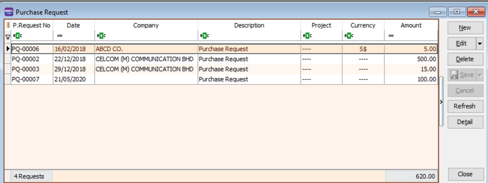

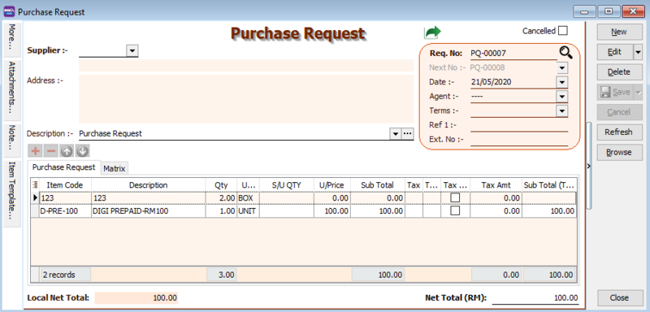

1. Go to **Purchase > Purchase Request > New**.

2. Select the **Supplier Code**.

3. Insert the **Item Code** and details (e.g., **Qty**, **Unit Cost**).

4. Enter a description to explain the **Purchase Request**.

   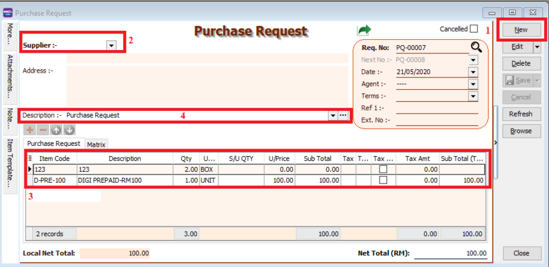

5. Click **Save** once you are done. Below is an example of the created entry:

   

## Purchase Order

A Purchase Order is a document issued by the purchasing department when placing an order with a supplier.

It contains details such as quantity and unit price for the items being purchased.

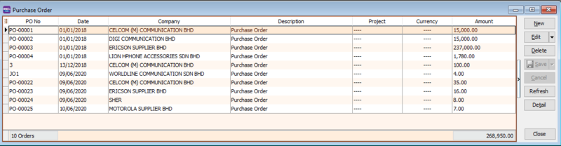

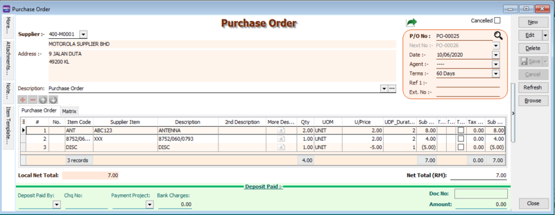

1. Go to **Purchase > Purchase Order > New**.

2. Select the **Supplier Code**.

3. Insert the items:

   1. Enter the **Item Code** and details (e.g., **Qty**, **Unit Cost**).

      :::info
      You can navigate the search columns using the **TAB** key on your keyboard. This applies to all dropdown tables.
      :::

   2. Click the **Show/Hide/Move Column** icon to customize your column layout.

   3. To enter a discount amount, enable the **Discount** field using the method in step 3b. You can enter multiple levels of discounts as shown in the image below.

4. Enter a description for your **Purchase Order**.

   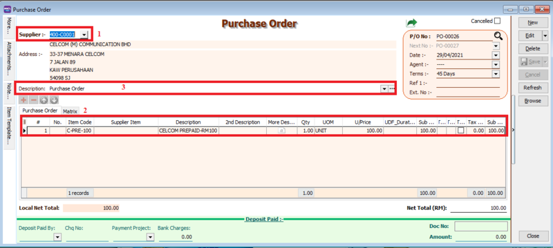

5. Click **Save** once you are done. Below is an example of the created entry:

   

### Project

There are two types of projects to note:

1. **Document Project**: To set a project for the entire document, go to the **MORE** section on the **left sidebar**.

2. **Detail Project**: To set a project for individual items, add the **Project** column using the **Field Chooser**.

   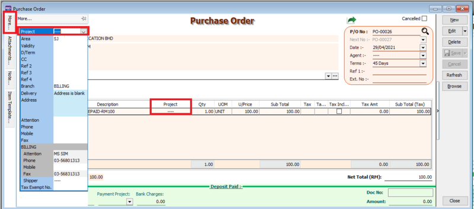

### Attachment

Use this feature to attach external PDF, Excel, Word documents, or image files.

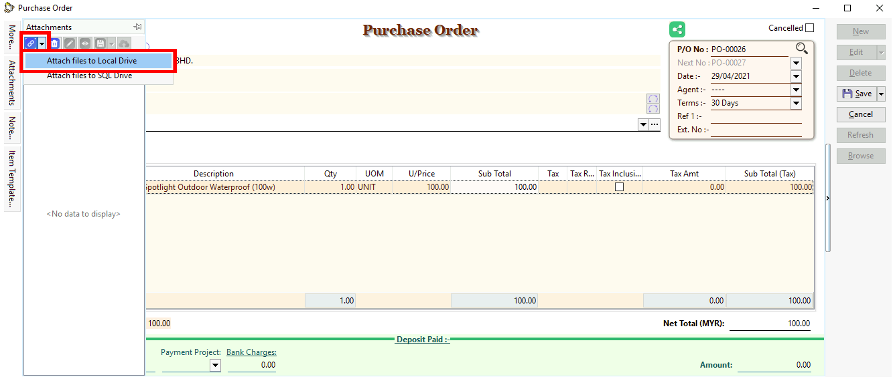

1. Click **Attachment** on the left sidebar.

2. Click the small black arrow next to the **Link** icon.

3. Select **Attach files to Local Drive** and choose the file from your computer.

### Note

1. Click the **Note** section on the **left sidebar**.

2. **Right-click** inside the section to open the **Rich Text Editor**.

3. Enter your notes as needed. See the example below.

4. Click the **X** button to save and exit the editor.

5. A **Save changes?** prompt will appear. Click **Yes** to save.

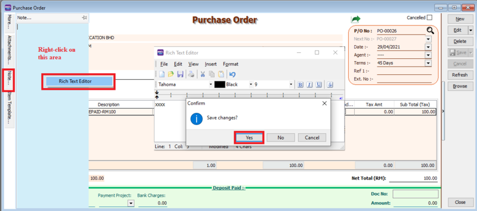

### How to Preview a Report

To preview a report, click the **Preview** button and select your desired format.

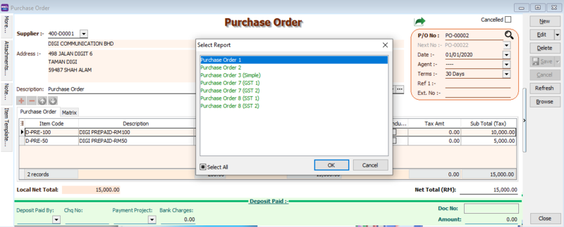

### How to Send a Report via WhatsApp

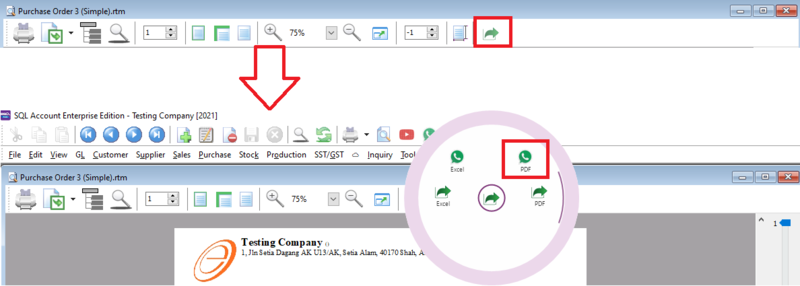

A QR code will appear on the screen. Scan it using the **WhatsApp Web** function in your WhatsApp mobile app.

## Goods Received

A Goods Received Note (GRN) is issued after receiving a delivery as proof of receipt.

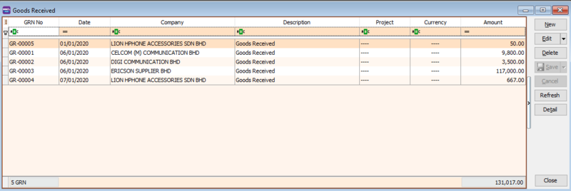

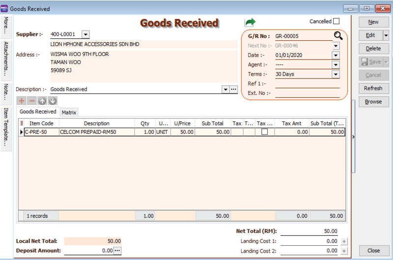

1. Go to **Purchase > Goods Received > New**.

2. Select the **Supplier Code**.

3. Enter the **Item Code** and details (e.g., **Qty**, **Unit Cost**).

4. Enter a description for the **Goods Received** note.

   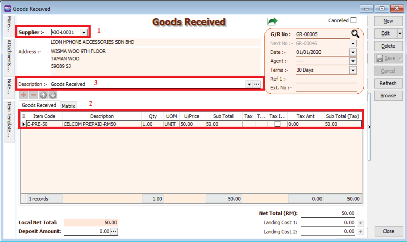

5. Click **Save** once you are done. Below is an example of the created entry:

### Transfer from PO to GRN

1. Go to **Purchase > Goods Received > New**.

2. Select the **Supplier Code**.

3. **Right-click on the G/R Note title** and select **Transfer from Purchase Order**. Select the documents you wish to transfer.

4. **Save** the Goods Received Note.

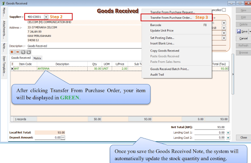

### Notes - Landing Cost

:::info
This is an additional module.
:::

**Landing Cost** handles costs associated with getting goods to the warehouse that are not billed by the same supplier (e.g., freight, insurance, or handling fees). These costs are added to your stock cost. For example, if you buy a product from Supplier A but it is shipped by Transport Company B, you enter the transport charges as a landing cost to increase your product's cost.

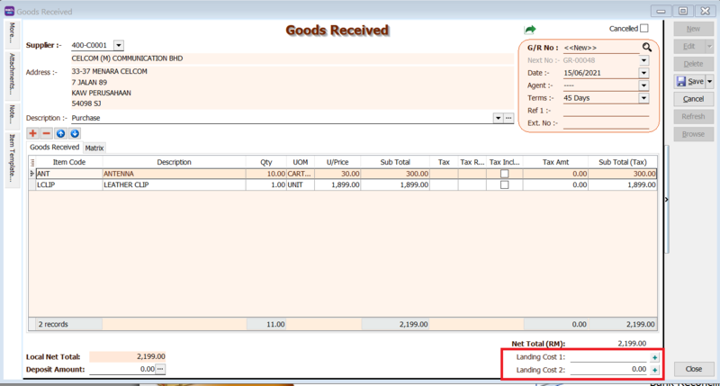

#### How to set up Landing Cost

Follow the steps shown in the image below:

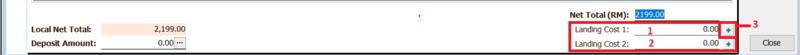

1. **Landing Cost 1**: Enter your landing cost in this column. (This value is for reference and may not be included in all calculations).
2. **Landing Cost 2**: If you have a different calculation than Landing Cost 1, enter the value here.
3. Click the **+** button to select the cost allocation method.

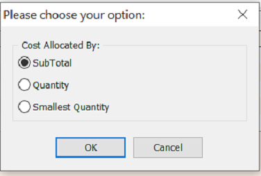

##### Formula for Cost Allocated By Subtotal

- **Formula**: `(Item Subtotal / Document Subtotal) * Landing Cost 1`

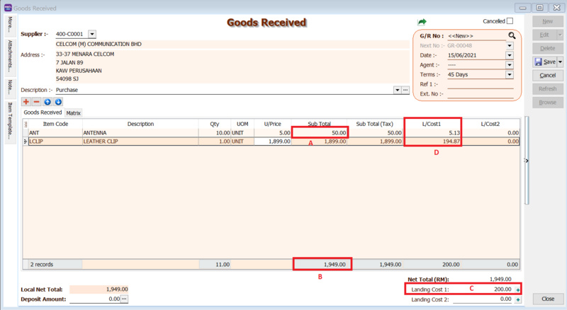

:::info
**Example:**

- **Formula**: `(Item Subtotal / Document Subtotal) * Landing Cost 1`
- **Item 1**: `(50.00 / 1949.00) * 200 = 5.13`
- **Item 2**: `(1899.00 / 1949.00) * 200 = 194.87`

:::

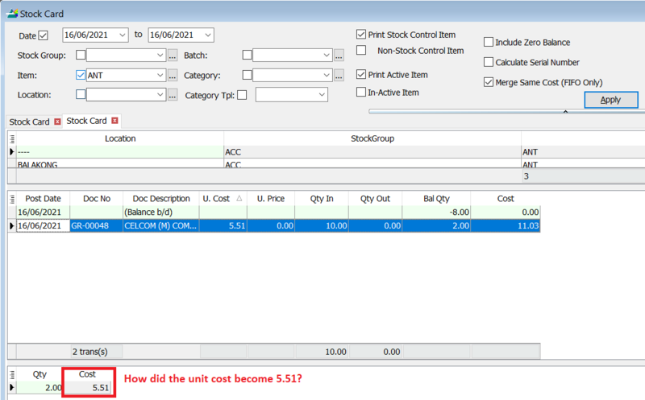

:::info
**How to calculate Unit Cost (e.g., 5.51):**

- **Formula**: `Product Unit Cost + (Item Landing Cost 1 / Item Qty)`
- **Calculation**: `5 + (5.13 / 10) = 5.51`

:::

##### Formula for Cost Allocated By Qty

- **Formula**: `(Item Qty / Document Qty) * Landing Cost 1`

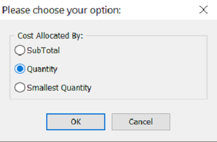

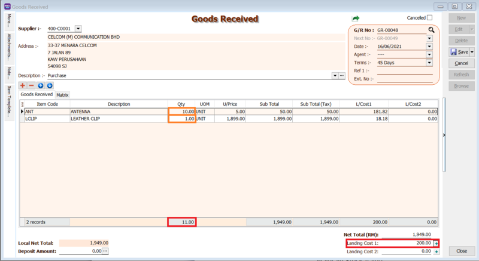

:::info
**Example:**

- **Item 1**: `(10 / 11) * 200 = 181.81`
- **Item 2**: `(1 / 11) * 200 = 18.18`

:::

**Stock Card Report Outcome:**

:::info

- **Item ANT**: Unit cost will be **23.18**.
  - `Unit Cost + (Landing Cost 1 / Qty) = 5 + (181.82 / 10) = 23.18`
- **Item LCLIP**: Unit cost will be **1917.18**.
  - `Unit Cost + (Landing Cost 1 / Qty) = 1899 + (18.18 / 1) = 1917.18`

:::

##### Formula for Cost Allocated By Smallest Qty

- **Formula**: `(Item Qty * Rate) / Sum(Qty * Rate) * Landing Cost 1`

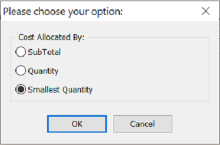

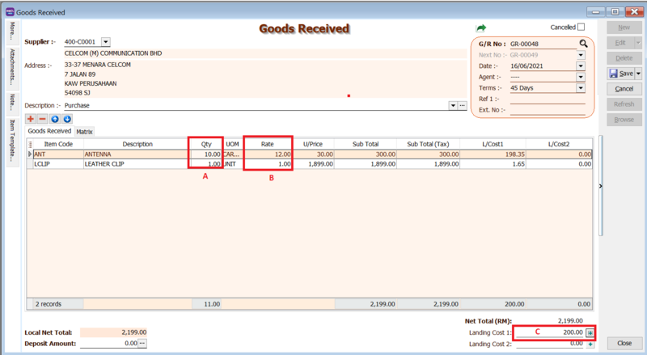

:::info
**Example:**

- **Item 1**: `(10 * 12) / 121 * 200 = 198.35`
- **Item 2**: `(1 * 1) / 121 * 200 = 1.65`

:::

**Stock Card Report Outcome:**

:::info

- **Item 1 (ANT)**: Unit cost = `[Unit Price + (Item Landing Cost 1 / Item Qty)] / Item Rate`
  - `[30 + (198.35 / 10)] / 12 = 4.15`
- **Item 2 (LCLIP)**: Unit cost = `Unit Price + (Item Landing Cost 1 / Item Qty)`
  - `1899 + 1.65 = 1900.65`

:::

## Purchase Invoice

You can enter a Purchase Invoice after your Purchase Order has been approved and the goods have been received.

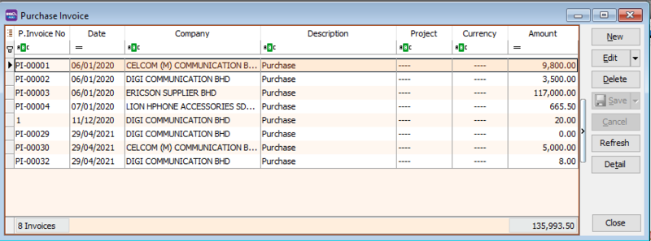

1. Go to **Purchase > Purchase Invoice > New**.

   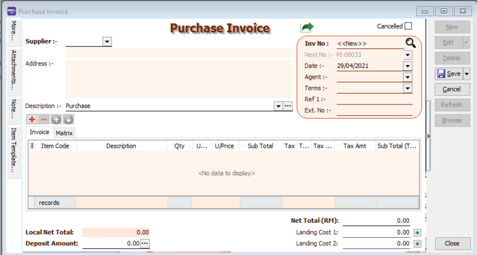

2. Select the **Supplier Code**.

3. Insert the items:

   1. Enter the **Item Code** and details (e.g., **Qty**, **Unit Cost**).

   :::info
   You can navigate the search columns using the **TAB** key on your keyboard. This applies to all dropdown tables.
   :::

   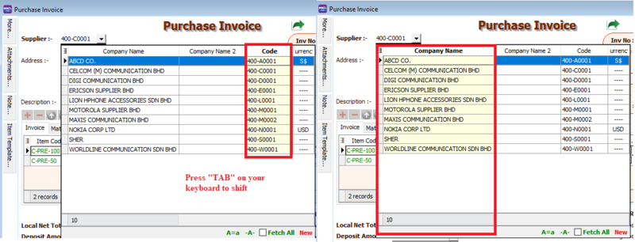

4. Enter a description for the **Purchase Invoice**.

5. Click **Save** once you are done. Below is an example of the created entry:

**Double Entry:**

| Account            | DR (RM) | CR (RM) |
|--------------------|---------|---------|
| Purchase Account   | 500.00  |         |
| Supplier Account   |         | 500.00  |

### Transfer from GRN

1. Go to **Purchase > Purchase Invoice > New**.

2. Select the **Supplier Code**.

3. **Right-click on the Purchase Invoice title** and select **Transfer from Goods Received**. Select the documents you wish to transfer.

4. **Save** the Purchase Invoice.

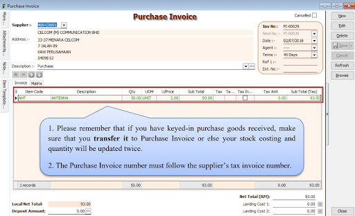

## Cash Purchase

Cash Purchases are used for transactions that are paid for immediately with cash, with no outstanding balance.

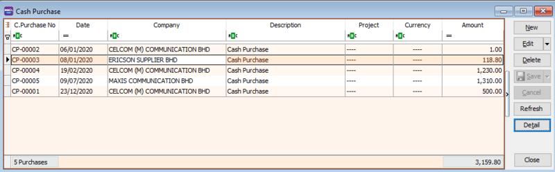

1. Go to **Purchase > Cash Purchase > New**.

   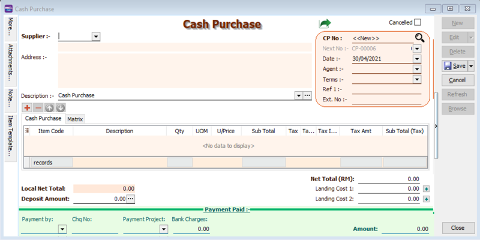

2. Select the **Supplier Code**.

3. Insert the items:

   1. Enter the **Item Code** and details (e.g., **Qty**, **Unit Cost**).

   :::info
   You can navigate the search columns using the **TAB** key on your keyboard. This applies to all dropdown tables.
   :::

   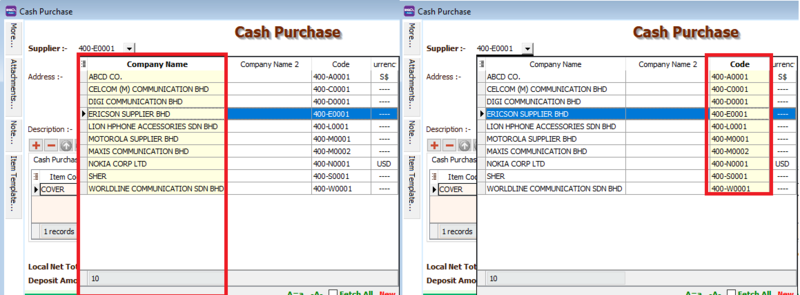

4. Enter a description for the **Cash Purchase**.

5. Click **Save** once you are done.

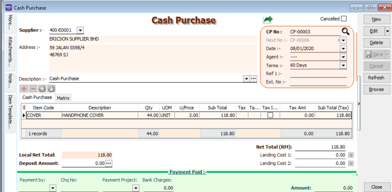

### Transfer From

You can transfer existing Purchase Orders, Goods Received Notes, or Purchase Requests to a Cash Purchase.

**Right-click on the Cash Purchase title** to select the source document.

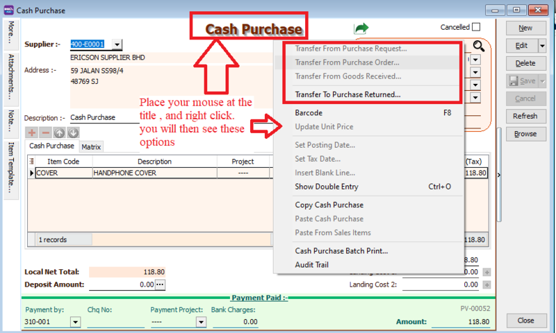

### Payment Details

For Cash Purchases, you can select the payment method and enter the payment amount.

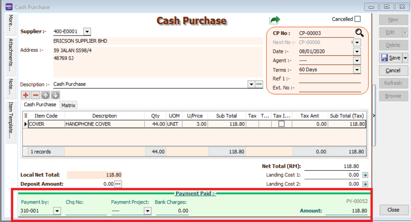

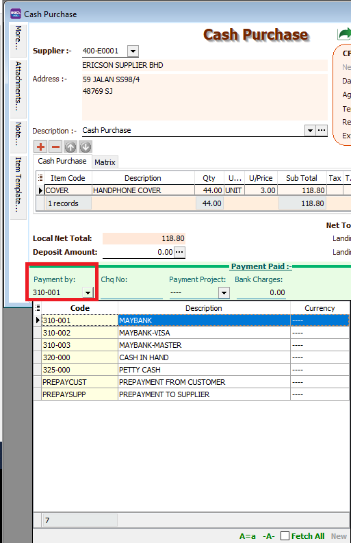

You can also enter the **Cheque No.** and **Bank Charges** if applicable.

Once you **Save** the Cash Purchase, the system automatically creates a Supplier Payment document.

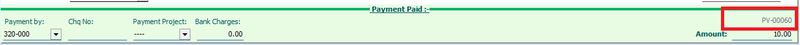

## Extra Goods Received

Extra Goods Received is typically used when invoices are issued before the goods are received.

:::note
This requires the **Invoice > DO** module.
:::

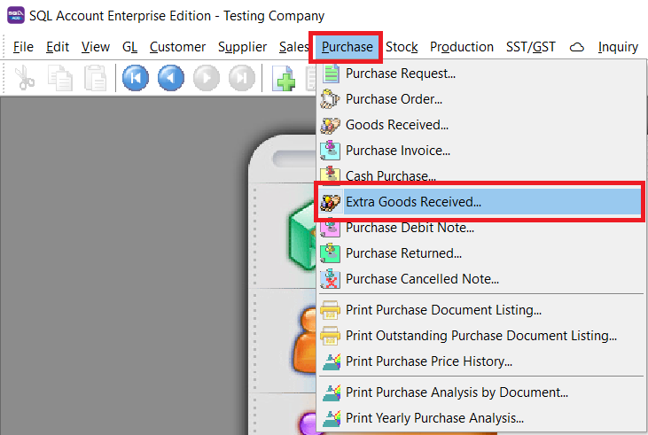

1. Go to **Purchase > Extra Goods Received > New**.

2. Select the **Supplier Code**.

3. Enter the **Item Code** and details (e.g., **Qty**, **Unit Cost**).

4. Enter a description for the **Extra Goods Received** note.

   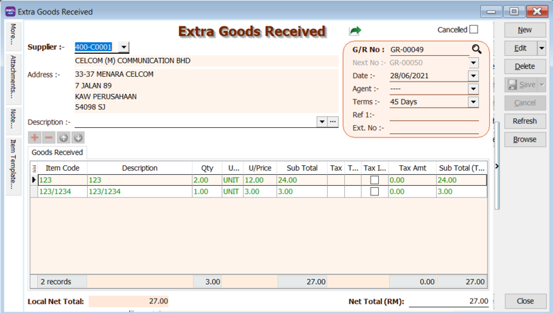

5. Click **Save** once you are done.

### Transfer from PI to EGR

You can transfer from an existing Purchase Invoice or Cash Purchase.

**Right-click on the Extra Goods Received title** to select the source document.

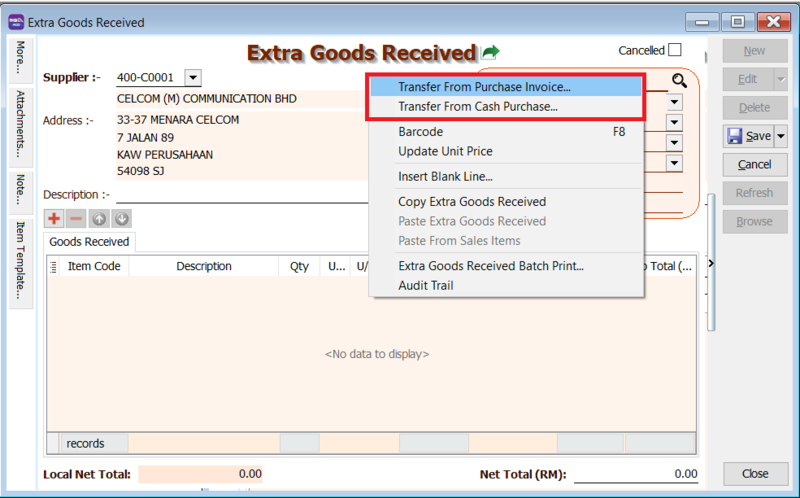

## Purchase Debit Note

A Purchase Debit Note is used to increase an expense amount or the amount owed to a supplier.

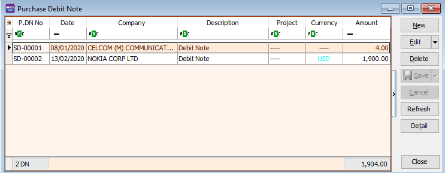

1. Go to **Purchase > Purchase Debit Note > New**.

2. Select the **Supplier Code**.

3. Enter the **Item Code** and details (e.g., **Qty**, **Unit Cost**).

4. Enter a description for the **Purchase Debit Note**.

   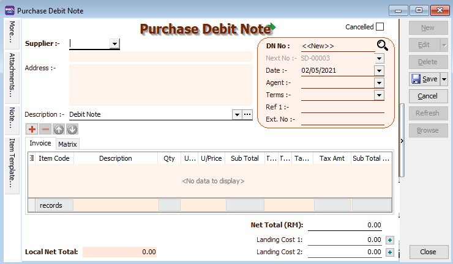

5. Click **Save** once you are done. Below is an example of the created entry:

   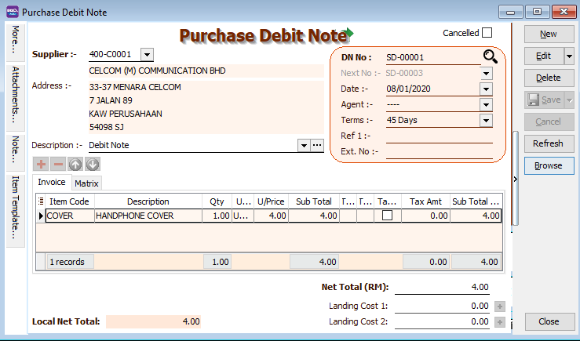

### Transfer from PI

Instead of entering a new document, you can transfer from an existing Purchase Request, Purchase Order, or Goods Received document.

**Right-click on the Purchase Debit Note title** to select the source document.

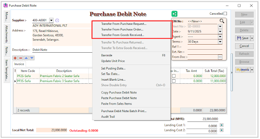

## Purchase Return

A Purchase Return document is created when you return purchased goods to a supplier.

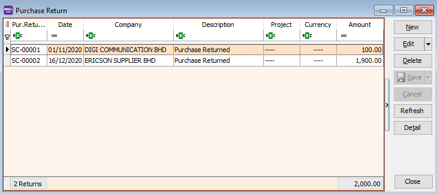

1. Go to **Purchase > Purchase Return > New**.

2. Select the **Supplier Code**.

3. Enter the **Item Code** and details (e.g., **Qty**, **Unit Cost**).

4. Enter a description for the **Purchase Return**.

   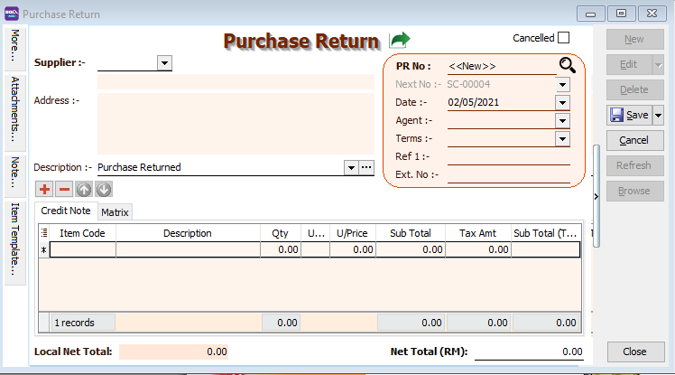

5. Click **Save** once you are done. Below is an example of the created entry:

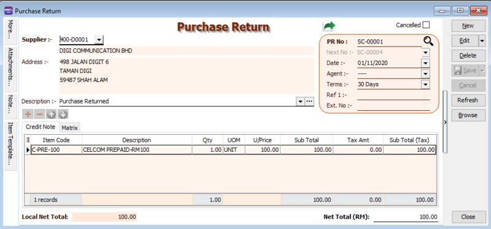

### Transfer from PI to PRN

Instead of entering a new document, you can transfer from an existing Purchase Invoice or Cash Purchase document.

**Right-click on the Purchase Return title** to select the source document.

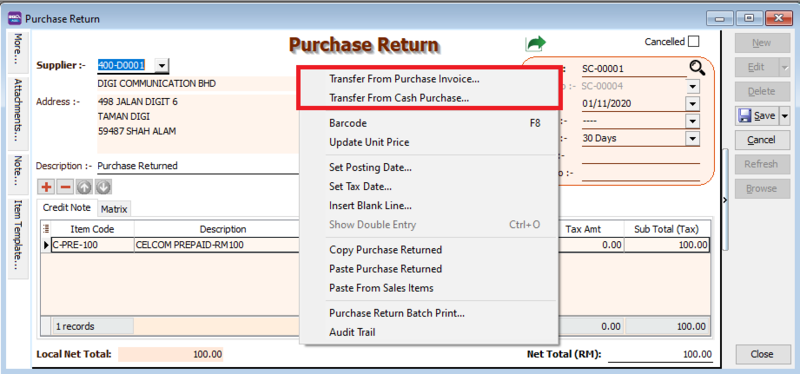

## Purchase Cancelled Note

A Purchase Cancelled Note is used to remove any outstanding Purchase Orders.

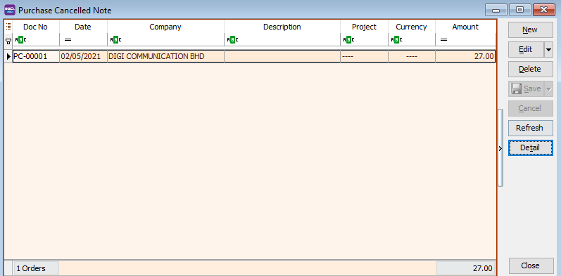

1. Go to **Purchase > Purchase Cancelled Note > New**.

2. Select the **Supplier Code**.

3. Enter the **Item Code** and details (e.g., **Qty**, **Unit Cost**).

### Transfer from PO to PCN

Instead of entering a new document, you can transfer from an existing Purchase Order.

**Right-click on the Purchase Cancelled Note title** to select the source document.

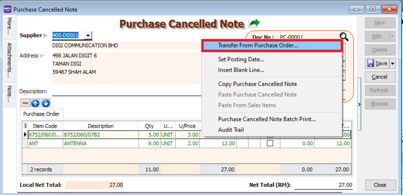
