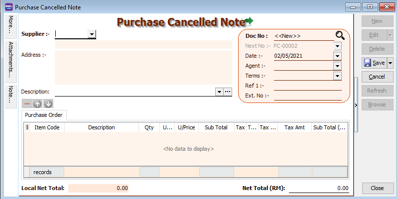

## Purchase Work Flow

Example of sales process work flow aligned with SQL Account flow:

## Purchase Request

Purchase Request is an internal document used within a company between departments to request a purchase or product.

For example, you want to purchase more office supplies. You must submit a Purchase Request to the purchasing department.

1. **Purchase | Purchase Request | New**

2. **Select Supplier Code**

3. **Insert Item Code and details** (e.g., Qty, Unit Cost)

4. **Write a description to explain your Purchase Request**

   

5. **Click the Save button once you are done. Below is the example of the entry created.**

   

## Purchase Order

Purchase Order is a document that is issued by the purchasing department when placing an order with their supplier.

A purchase order document contains the details (quantity, unit price) of the items that want to be purchased.

1. **Purchase | Purchase Order | New**

2. **Select Supplier Code**

3. **Insert Item**

   1. **Insert Item Code and details** (e.g. Qty, Unit Cost)

      :::info

      You can navigate the search column by using the “TAB” button on your keyboard. It will apply to all drop down tables.

      :::

   2. **Click on the show/hide/move column icon to customize your column layout**.

   3. If you want to key in the discount amount, you may tick the discount field by following step 3b and update the discount field. You can key in multiple levels of discount as shown by the picture attached.

4. **Write a description to explain your purchase order**

   

5. **Click the Save button once you are done. Below is the example of the entry created:**

   

### More : Project

There are 2 types of project you need to be take note:

1.Document Project

2.Detail Project

For **document project**, you need to point to **MORE** section **(on the left sidebar)**.

For **detail project**, you have to add the **project** column from the Field Chooser.

### Attachment

You can use this feature to attach external PDF, excel, word documents and image files.

1. Go to the left of the screen and click "Attachment"

2. Click the small black arrow at the link icon

3. Select ‘Attach files to Local Drive’ and choose the file from your computer to attach

### Note

1. Click on the Note section (on the LEFT side bar).

2. RIGHT click it, you will see the Rich Text Editor pop-up.

3. You can start typing the note. See the example screenshot below.

4. Click on the X button to save and exit the Rich Text Editor.

5. You will get prompted the ‘Save changes?’ message. Click YES to save it.

### How to preview report

To preview the report, you may click on the preview button and select the format you wish to print.

### How to send report via Whatsapp

A QR code will appear on the screen. Scan the QR code with your Whatsapp's Whatsapp Web function.

## Goods Received

Goods Received is a document issued after receiving a delivery as proof of the order receipt.

1. **Purchase | Goods Receive | New**

2. **Select Supplier Code**

3. **Insert Item Code and details (e.g. Qty, Unit Cost)**

4. **Write a description to explain your Goods Receive**

   

5. **Click the Save button once you are done. Below is the example of the entry created:**

### Transfer From PO To DO

1. **Purchase | Goods Receive | New**

2. **Select Supplier Code**

3. **Right Click on G/R Note title**, select **Transfer from Purchase Order**, tick the document that you wish to transfer

4. **Save** the Goods Received Note

### Notes - Landing Cost

:::info
This is an additional module.
:::

Landing Cost is to handle the cost to the warehouse that is not billed by the same supplier. In other words, it is an additional cost to increase your stock cost. This cost depends on the company and whether they want to add in or not. For instance, if you buy a product from Supplier A but it is shipped by Transport company B, you must enter the transport charges as a landing cost to increase your product cost.

How to set Landing Cost?

Follow the below image:

1. **Landing Cost 1** = Key your Landing Cost to this column.(This cost will not take into the account.)
2. **Landing Cost 2** = If you have a different calculation than Landing Cost 1, you may enter your value to this column.
3. Click on + Button to select the cost allocated.

***Formula for Cost Allocated By SubTotal***

- Formula : Item Subtotal / Document Subtotal * Landing Cost1

:::info

   Item 1 = A/B * C

   Landing Cost1 (D) = 50.00 / 1949.00 * 200 = 5.13

   Item 2

   Landing Cost (D) = 1899.00 / 1949.00 * 200 = 194.87

:::

:::info

   How to get unit cost = 5.51?

   Formula : Product Unit Cost + Item Landing Cost1 / Item Qty

   Formula : 5 + (5.13 / 10) = 5.51

:::

***Formula for Cost Allocated By Qty***

- Formula : Item Qty / Document Qty * Landing Cost1

:::info

   Item 1 : 10 / 11 * 200 = 181.81

   Item 2 : 1 / 11 * 200 = 18.18

:::

***Stock Card Report Outcome:***

:::info

   *Item ANT : unit cost will be 23.18, how to get 23.18 ?

   Unit Cost + (Landing Cost1 / Qty) = 5 + (181.82 / 10) = 23.18

   *Item LCLIP : Unit Cost will be 1917.18

   Unit Cost + (Landing Cost1 / Qty) = 1899 + (18.18 / 1) = 1917.18

:::

***Formula for Cost Allocated By Smallest Qty***

- Formula : Item Qty *Rate/ Sum(Qty* Rate) * Landing Cost1

:::info

   Item 1 : 10 * 12 = 120 / 121 = 198.35

   Item 2 : 1 * 1 = 1 / 121 = 1.65

:::

***Stock Card Report Outcome***

:::info

   Item 1 : Unit cost for ANT = [Unit Price + (Item Landing Cost1 / Item Qty)] / ItemRate = [30 + (198.35 / 10)] / 12 = 4.15

   Item 2 : Unit cost for LCLIP = [Unit Price + (Item Landing Cost1 / Item Qty)] / ItemRate = 1899 + 1.65 = 1900.65

:::

That seed will grow to be a peach tree. You may wish for an apple or an orange, but you will get a peach.

## Purchase Invoice

You can key in the Purchase Invoice after your Purchase Order has been approved and the goods have been received.

1. **Purchase | Purchase Invoice | New**

   

2. **Select Supplier Code**

3. **Insert Item**

   1. **Insert Item Code and details** (e.g. Qty, Unit Cost)

   :::info

      You can navigate the search column by using the "TAB" button on your keyboard. It will apply to all drop down tables.

   :::

   

4. **Write a description to explain your Purchase Invoice**

5. **Click the Save button once you are done.  Below is the example of the entry created:**

***Double Entry will be:-***

| Account            | DR (RM) | CR (RM) |
|--------------------|---------|---------|
| Purchase Account   | 500.00  |         |
| Supplier Account   |         | 500.00  |

### Transfer From DO

1. **Purchase | Purchase Invoice | New**

2. **Select Supplier Code**

3. **Right Click on Purchase Invoice title**, select Transfer from Goods Received, tick the document that you wish to transfer

4. **Save** the Purchase Invoice

## Cash Purchase

You can key in Cash Purchase after your Purchase Order has been approved and the goods have been received.

Cash purchases are used for purchases that are paid for with cash and have no outstanding payment.

1. **Purchase | Cash Purchase | New**

   

2. **Select Supplier Code**

3. **Insert Item**

   1. **Insert Item Code and details** (e.g. Qty, Unit Cost)

   :::info

      You can navigate the search column by using the "TAB" button on your keyboard. It will apply to all drop down tables.

   :::

   

4. Write a description to explain your Cash Purchase

5. Click the **Save** button once you are done.

### Transfer From

You can transfer your existing Purchase Order, Goods Receive Note, or Purchase Request to your Cash Sales.

All you have to do is RIGHT-CLICK at the "Cash Purchase" title

### Payment Paid

For cash purchases, you can select the payment method. and key in the payment amount.

You can also key in the Cheque No. and Bank Charges if there are any .

Once you have **SAVED** your "Cash Purchase", The system will have created a Supplier payment document for you.

## Extra Goods Received

Extra Goods Received is usually used by businesses where Invoices are issued before Goods Received.

You would need an Invoice -> DO module in order to issue Extra Goods Received Note.

1. **Purchase | Extra Goods Receive | New**

2. **Select Supplier Code**

3. **Insert Item Code and details** (e.g. Qty, Unit Cost)

4. **Write a description to explain your Extra Goods Receive**

   

5. **Click the Save button once you are done.**

### Transfer From PI To EGR

You can transfer your existing Purchase invoice or Cash Purchase.

All you have to do is RIGHT-CLICK at the "Extra Goods Received" title.

## Purchase Debit Note

Purchase Debit Note is used to increase your expense amount.

Or to increase the amount of credit that you owe your supplier.

1. **Purchase | Purchase Debit Note | New**

2. **Select Supplier Code**

3. **Insert Item Code and details** (e.g. Qty, Unit Cost)

4. **Write a description to explain your Purchase Debit Note**

   

5. **Click the Save button once you are done. Below is the example of the entry created:**

   

### Transfer From PI

Instead of keying in a new document, you can transfer it from an existing Purchase Request or Purchase Order or Goods Received document.

All you have to do is RIGHT-CLICK at the "Purchase Debit Note" title.

## Purchase Returned

Purchase Return document is created when you return purchased goods to the supplier.

1. **Purchase | Purchase Returned | New**

2. **Select Supplier Code**

3. **Insert Item Code and details** (e.g. Qty, Unit Cost)

4. **Write a description to explain your Purchase Return**

   

5. **Click the Save button once you are done. Below is the example of the entry created:**

### Transfer From PI To PDN

Instead of keying in a new document, you can transfer it from an existing Purchase Invoice or Cash Purchase document.

All you have to do is RIGHT-CLICK at the "Purchase Return" title.

## Purchase Cancelled Note

You can key in the Purchase Cancelled Note to remove any outstanding Purchase Orders.

1. **Purchase | Purchase Cancelled Note | New**

2. **Select Supplier Code**

3. **Insert Item Code and details** (e.g. Qty, Unit Cost)

4. **Write a description to explain your Purchase Cancelled Note**

   

5. **Click the Save button once you are done.**

### Transfer From PO To PCN

Instead of keying in a new document, you can transfer it from an existing Purchase Invoice or Cash Purchase document.

All you have to do is RIGHT-CLICK at the "Purchase Cancelled Note" title.

