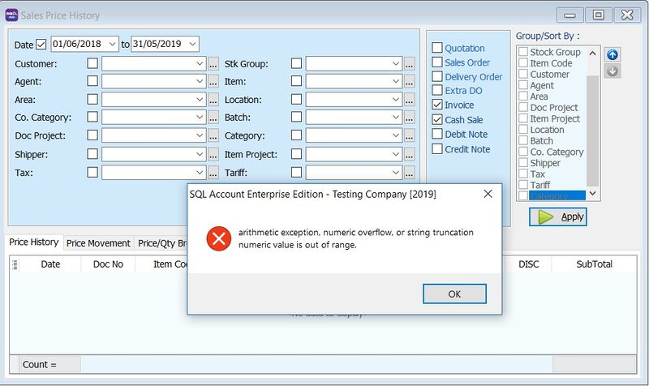

## How to set up Cash Drawer Kick Out?

### Setup

1. Go to **Tools** → **Options** → **Barcode**.

    - **Option 1: Direct Kick Out** → The cash drawer connects directly to your PC.

        

        :::tip
        Select the correct **Port No** and click the **Kick Out** button to test if the cash drawer opens. If the port number does not appear in the list, you can enter it manually.
        :::

    - **Option 2: Printer Kick Out** → The cash drawer connects directly to the printer.

        

        :::tip
        Select your printer and click the **Kick Out** button to test if the cash drawer opens.
        :::

        :::info
        If you encounter issues with RJ11 or RJ14 cash drawers, consider switching to a COM port (USB cash drawer required).
        :::

**If you encounter issues with direct kick out, please check the following before contacting support:**

1. Check the Windows OS version.
2. Check the SQL Account version.
3. Try previewing and printing to see if the output prints correctly.
4. Run a Windows "Test Print" on the receipt printer.
5. Go to **Tools** → **Options** → **Kick Out** to see if it responds.
6. Check the receipt printer model.
7. Check which receipt printer driver is installed.
8. Check the cash drawer model. RJ11 is not supported; use a USB/COM cash drawer connected directly to the PC.

## Why does an error message appear when applying Sales Price History?

### Issue

**Error message:** `arithmetic exception, numeric overflow or string truncation numeric value is out of range`

This typically occurs if:

1. The **Multi-Currency** module is not installed.

2. The currency values are large (e.g., Indonesian Rupiah).

### Solution

1. Go to **Tools** → **Options...**

2. Click on **Miscellaneous**.

3. Change the **Currency Rate** display format to **#,0.0000** (4 decimal places).

