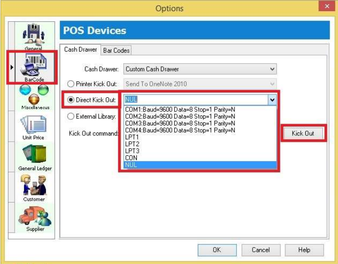
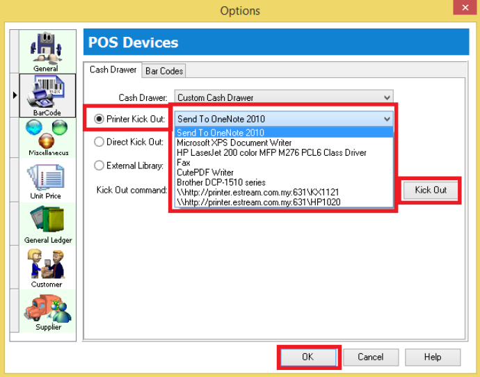
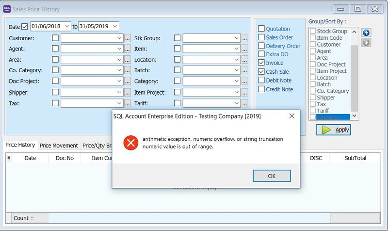
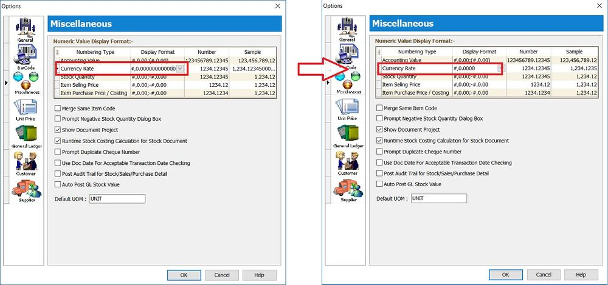

## How to set Cash Drawer Kick Out?

### Setup

1. Tools > Options > Click on Barcode

    - **Option 1 :** Direct Kick Out -> The cash drawer connects directly to your PC.

        

        :::tip[tip]
        Select the correct *Port No* and click the **Kick Out** button to test whether the *Cash Drawer* opens. If the port number doesn't appear in the list, you may type it manually.
        :::

    - **Option 2**: Printer Kick Out -> The Cash Drawer direct connect to Printer

        

        :::tip[tip]
        Select your Printer and click the **Kick Out** button to test whether the *Cash Drawer* opens.
        :::

        :::info[note]
        There are the problem if you are using cash drawer RJ 11, RJ 14, may switch to a COM port (USB cash drawer required).
        :::

**If you met the problem on direct kick out, please answer the questions below before calling support :**

1. Check Windows OS
2. Check SQL Account version
3. Try previewing and printing to see if the output prints correctly.
4. Run Windows 'Test Print' on the receipt printer.
5. Try Tools > Options > Kick Out to see if it responds.
6. Check the receipt printer Model.
7. Check which receipt printer driver is installed.
8. Check the cash drawer model. RJ11 is not supported; use a USB/COM cash drawer connected directly to the PC.

## Why prompt error message when apply the Sales Price History?

### Issue

**Error message:** `arithmetic exception, numeric overflow or string truncation numeric value is out of range`

1. Don't have **multi currency module.**

2. Don't have big currency value like Indonesia.

### Solution

1. Go to **Tools | Options...**

2. Click on **Miscellaneous.**

3. Change the **Currency Rate** display format to **#,0.0000** (4 decimals places).

