## Sales Work Flow

Example of sales process work flow aligned with SQL Account flow:

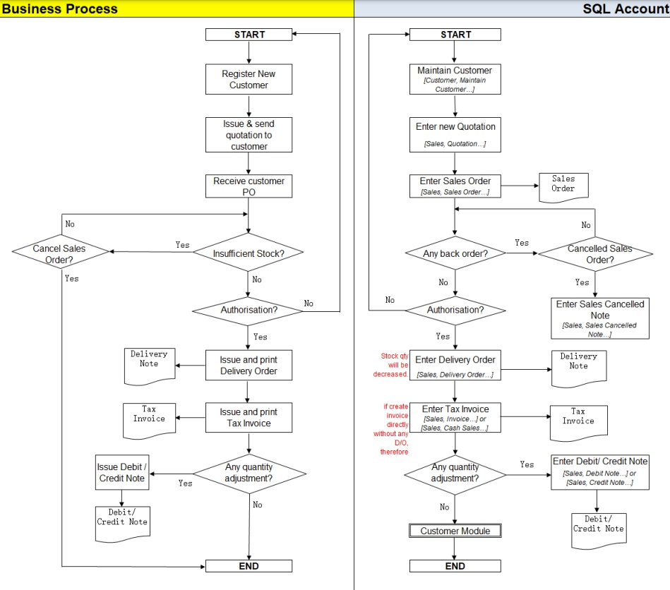

## Sales Quotation

:::info
Watch the tutorial video here:  [Sales Quotation](https://www.youtube.com/watch?v=2hKhtpaQfP4)
:::

1. **Sales** | **Quotation** | **New**

2. Select **Customer Code**

3. Insert the requested item by the customer and estimate profit & loss using the **Profit Estimator**

   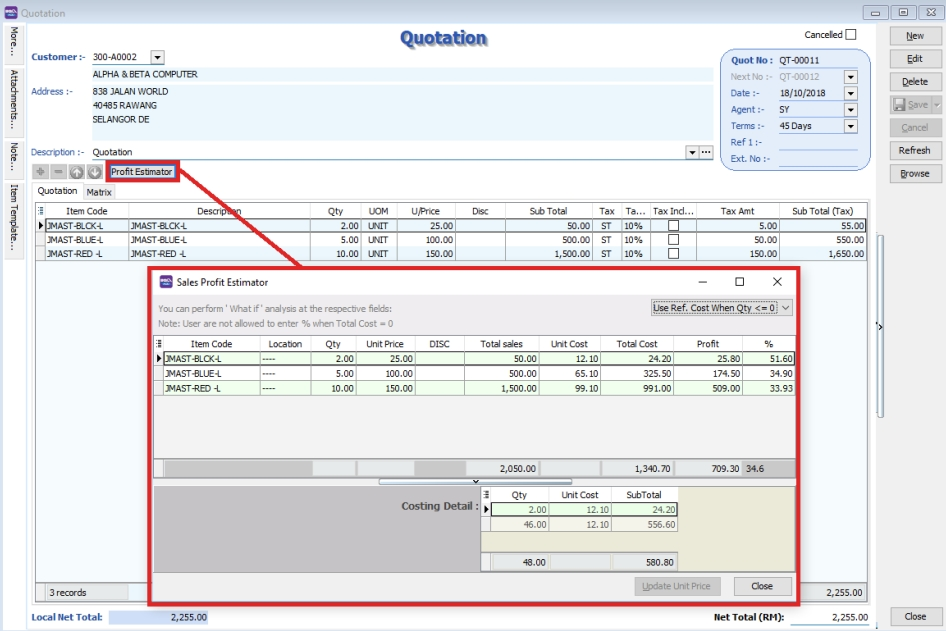

4. After everything is keyed in correctly, save the **Sales Quotation**

5. **Preview** the report and you can **print** or **export** it into PDF/ Email/ RTF(Microsoft Word)/Excel or others.

   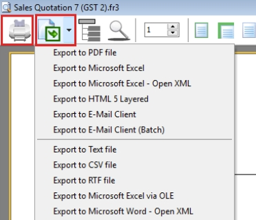

### Project

There are 2 types of project you need to be take note.

1. Document Project. For document project, you need to point to **MORE** section (on the **left side bar**).

2. Detail Project. For detail project, you have to **insert the project column out from Field Chooser**.

   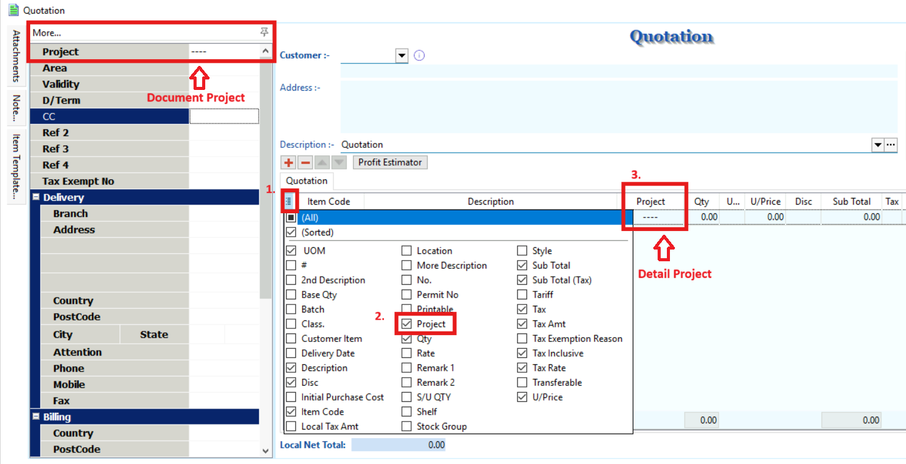

### Attachment

You can use this feature to attach external PDF, excel, word documents and image files.

1. Go to the left of the screen and click "**Attachment**"

2. Click the first icon

3. Then choose the file from your computer that you want to attach

   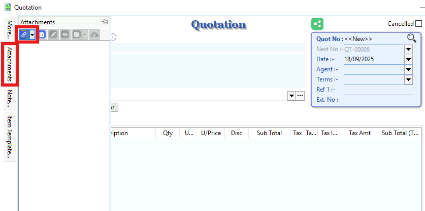

### Note

1. Click on the Note section (on the **LEFT side bar**).

2. **RIGHT click** it, you will see the Rich Text Editor pop-up.

3. You can start key-in the note. See the example screenshot below.

4. Click on **X** button (top right corner) to save and exit the Rich Text Editor.

5. You will get prompted the Save changes? message. Click YES to save it.

   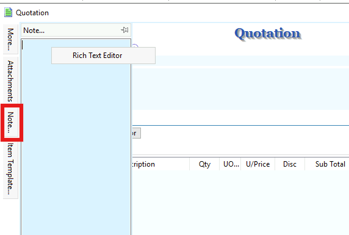

## Sales Order

:::info
Watch tutorial video here: [Sales Invoicing Sales Order](https://www.youtube.com/watch?v=klEAjmFT0og&feature=youtu.be)
:::

1. **Sales** | **Sales Order** | **New**

2. Select **Customer Code**

3. **Right Click on Sales Order title**, select **Transfer from Quotation**. You can either transfer the whole quotation or only part of the quotation document (*Partial Delivery Module requested)

   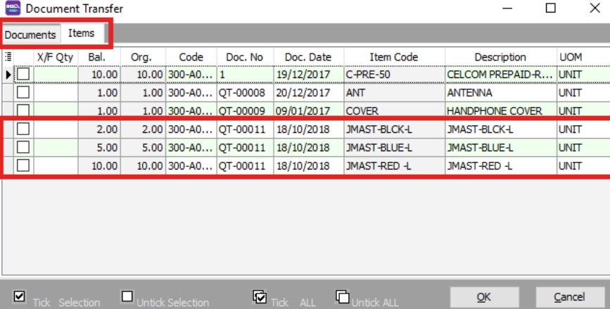

4. Save the **Sales Order**.

   :::note
   For additional reports showing outstanding sales orders, you can access **Sales | Print Outstanding Sales Document Listing**, and select **Sales Order** to view. This also applies to other sales documents.
   :::

## Delivery Order

1. **Sales** | **Delivery Order** | **New**

2. Select **Customer Code**

3. **Right Click on D/Order title**, select **Transfer from Sales Order**.

4. Save the **Delivery Order**.

   :::note
   Once the delivery order is saved, the stock will be deducted.
   :::

## Invoice

### Create New Invoice

:::info
Watch tutorial video here: [Sales Invoicing Sales Invoice](https://www.youtube.com/watch?v=hQ6bX5pOKRQ&feature=youtu.be)
:::

1. **Sales** | **Invoice** | **New**

2. Select **Customer Code**

3. **Right Click on Invoice** title, select **Transfer from Delivery Order**.

4. **Save** the Invoice.

### Show Double Entry

   :::info
   Watch tutorial video here: [Ctrl + O](https://www.youtube.com/watch?v=FAKSzjEezjo&t=9s)
   :::

**There are 2 methods to show the double entry for a transaction:**

1. After saving the invoice, press the keyboard shortcut key "Ctrl + O" to display the double entry result.

   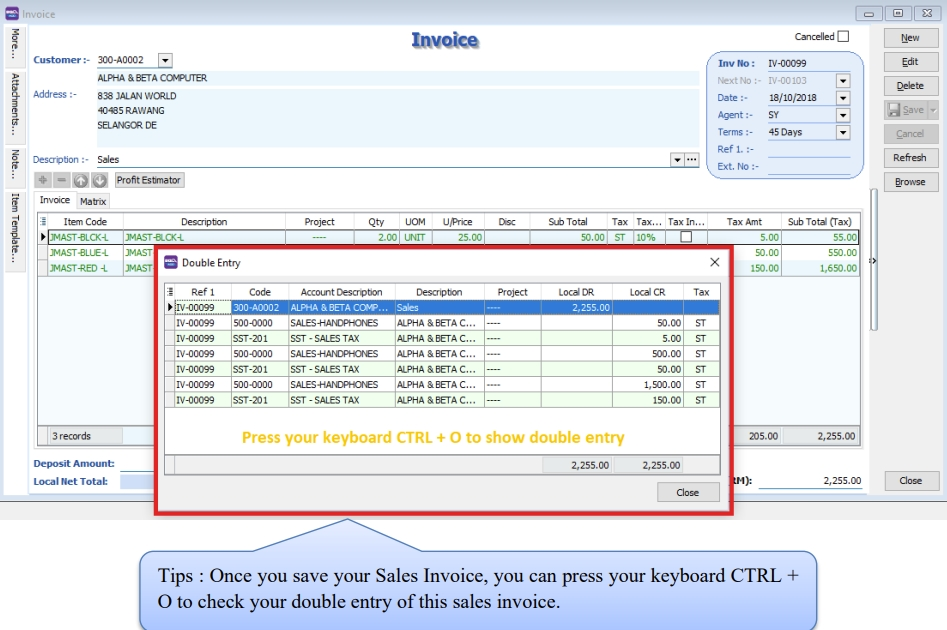

2. After you save the invoice, you may right click on the wording of Invoice then select “Show Double Entry”.

   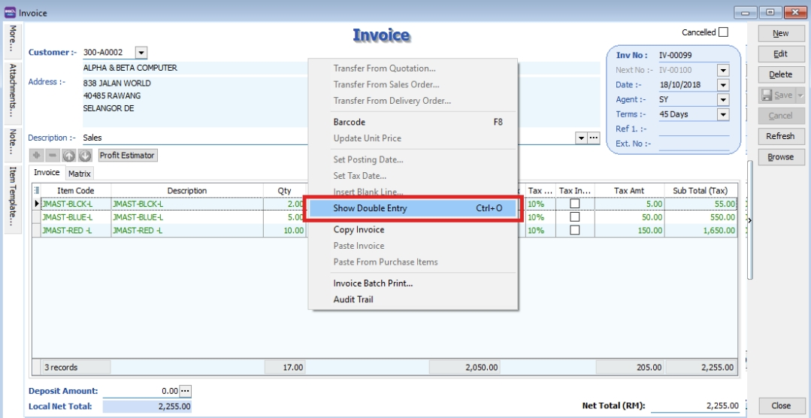

## Cash Sales

1. **Sales** | **Cash Sales** | **New**

2. Select **Customer Code**

3. Insert item and **Save** the **Cash Sales**.

4. When saving, the system will prompt a **Payment/ Change** dialog box

   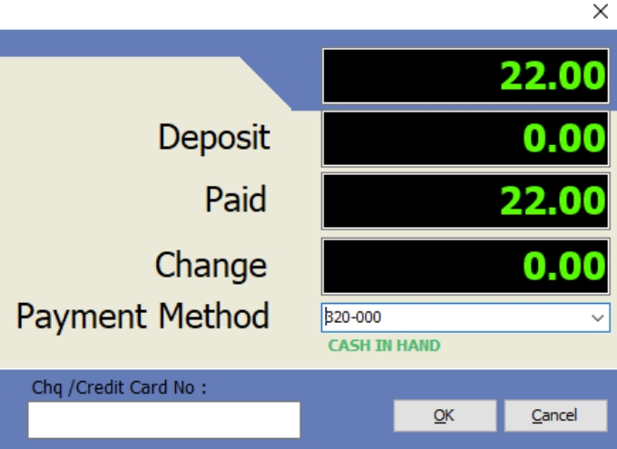

   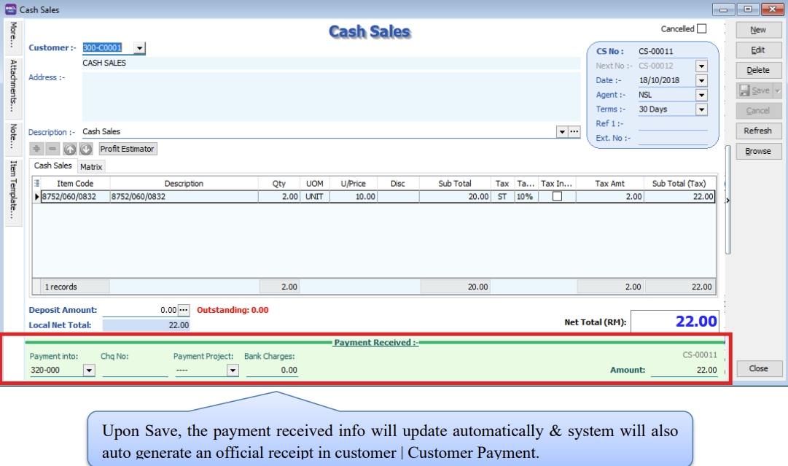

## Credit Note

:::info
Watch tutorial video here: [Sales Invoicing Sales Credit Note](https://www.youtube.com/watch?v=2LrsegwiWJM&feature=youtu.be)
:::

1. **Sales** | **Credit Note** | **New**

2. Select **Customer Code**

3. **Right Click on Credit Note title**, select **Transfer from Sales Invoice/ Cash Sales**, enter the returned quantity in X/F column.

4. **Save** the Credit Note.

   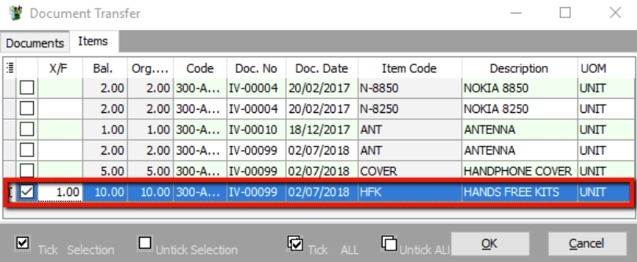

## Sales Cancelled Note

The Sales Cancelled Note is used to cancel any outstanding Sales Order.

1. **Sales** | **Sales Cancelled Note** | **New**.

2. **Right Click on the Cancelled Note title**, select **Transfer from Sales Order**; (in Sales Cancelled Note, items can only be inserted by transferring from Sales Order)

   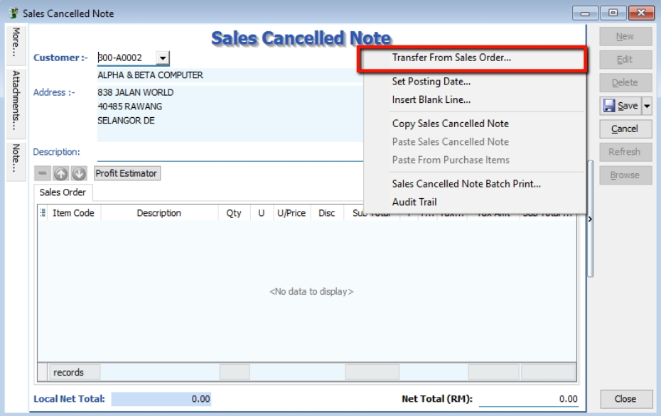

3. You can choose to transfer the sales order either by the whole document or partially.

   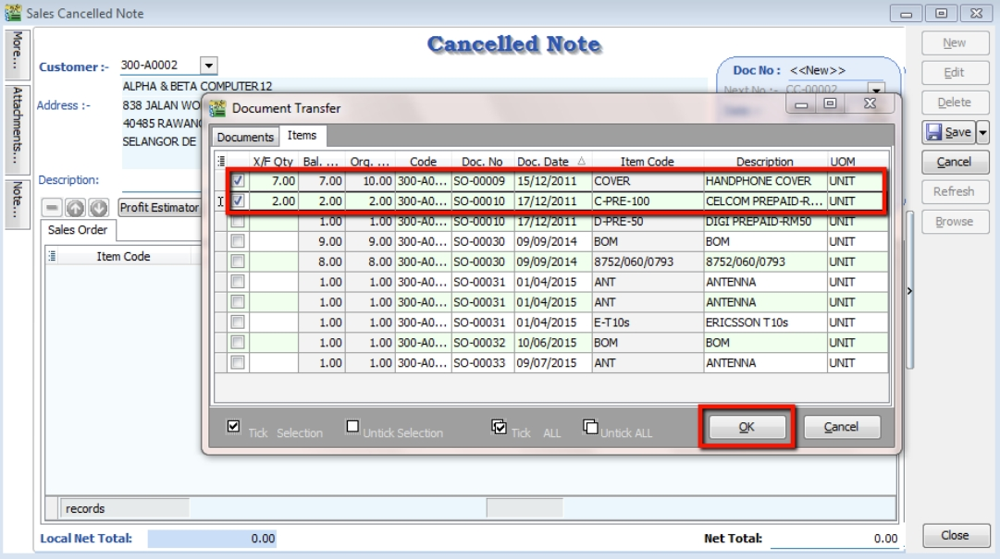

4. **Save** the Cancelled Note.
