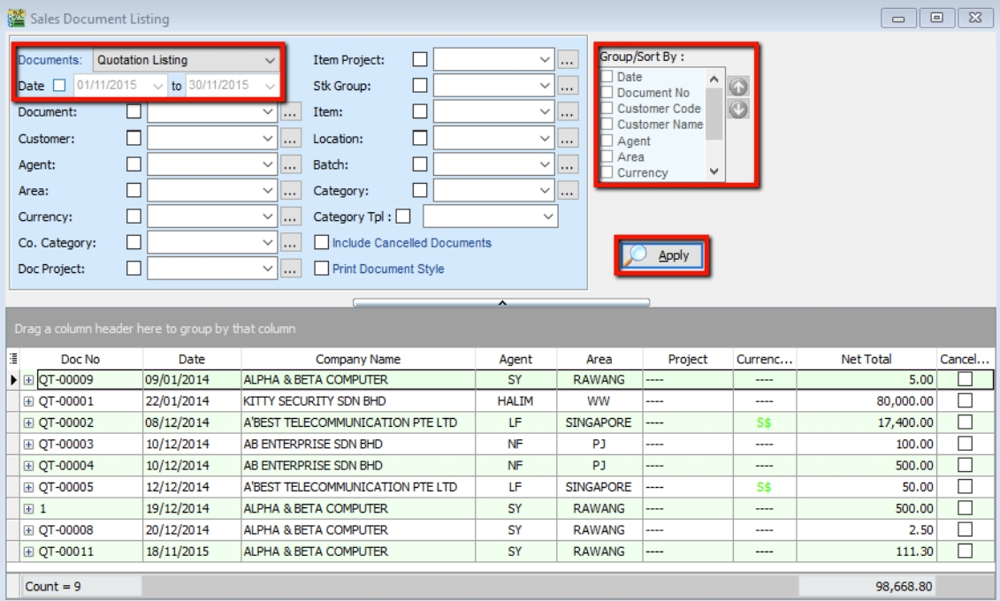
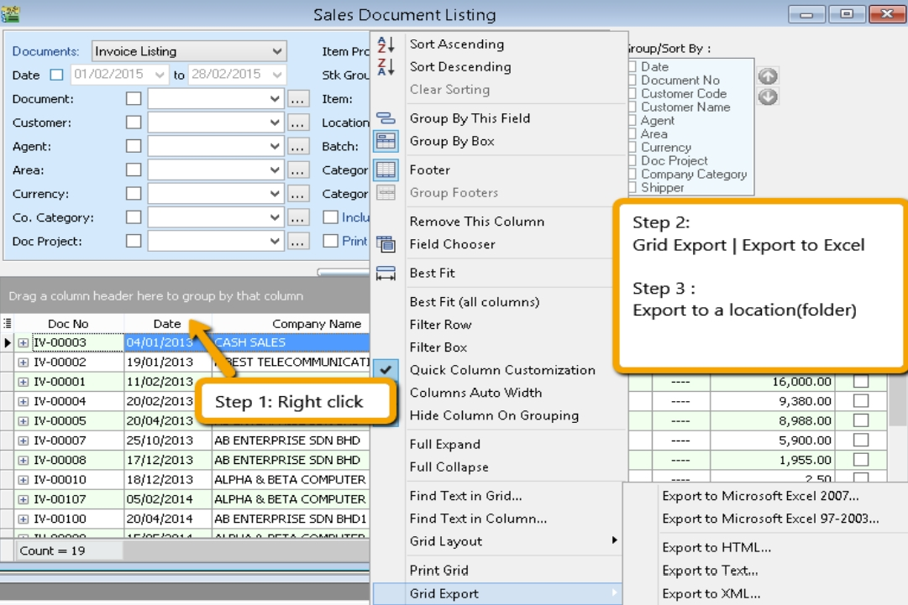
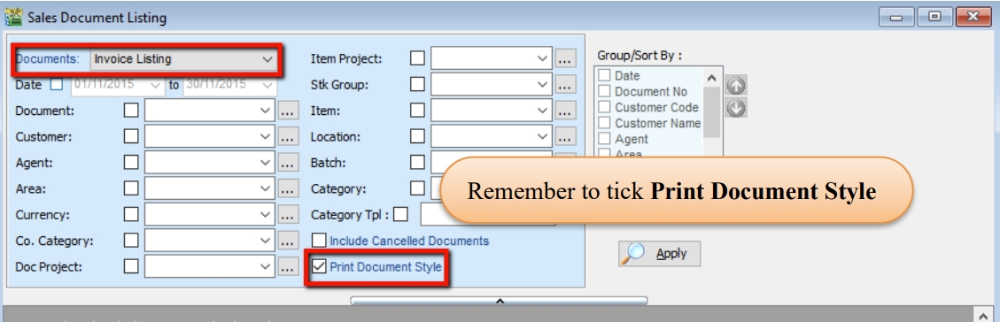
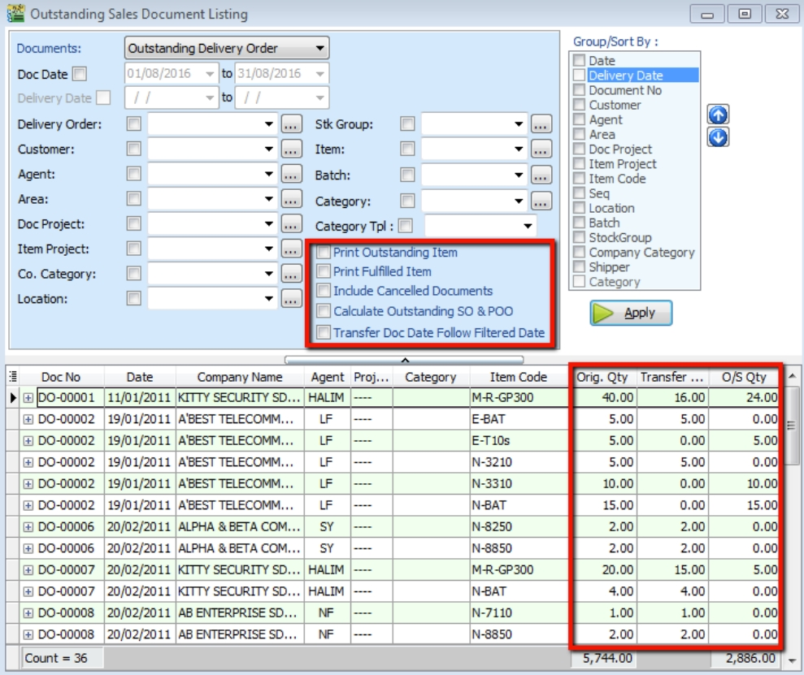
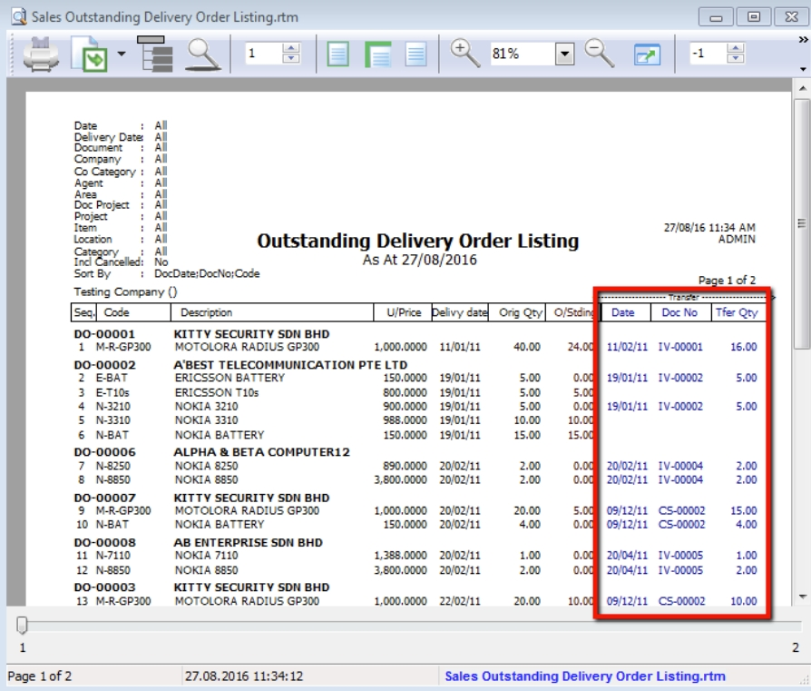

## Print Sales Document Listing

   1. Go to **Sales > Print Sales Document Listing**, and filter the document type you want, for example: **Sales Quotation, Sales Order, Delivery Order, Invoice Listing.**

   2. Filter by **date**. If left unchecked, all periods will be shown

   3. Filter area by pipelines (It’s optional)

   4. The system can group results and provide a summary for each different group (group/sort by)

   5. Click **Apply** to generate. If you change any settings in Steps 3 or 4, click Apply again.

      

### Export report into Excel

   1. **Right click any title bar**

   2. **Click Grid Export > Export to Excel**.

      

### Batch Printing Invoices

   If you want to print an entire month's invoices in batch (page‑by‑page format),

   1. **Sales** > **Print Sales Document Listing**.

   2. Check **“Print Document Style”**

   :::info

   Watch tutorial video here: [Sales Invoicing Batch Print Invoices](https://www.youtube.com/watch?v=MbNMVn0mBiw&feature=youtu.be)

   :::

   

## Print Outstanding Sales Document Listing

This report can help you check the transfer document’s information such as the number of outstanding items for the particular document and which invoices the DO have been transferred to.

1. Sales > Print Outstanding Sales Document Listing.

2. Filter the information that you want and click **Apply**.

3. Criteria

   1. **Print Outstanding Item** – to check items that have not yet been transferred.

   2. **Print Fulfilled Item** – to check documents that have been fully transferred and to which document they were transferred.

   3. **Include cancelled documents** – tick to show cancelled documents in the report.

   4. **Outstanding SO & PO** – to check the number of outstanding items from sales orders and purchase orders.

   5. **Transfer Doc Date Follow Filtered Date** – tick this if you want the transfer document date to follow the filtered date (e.g., if a Sales Order is transferred to an Invoice, both will follow the filtered date).

4. Click **Apply**

   

5. To see where this document has been transferred, **preview** the report.

   
