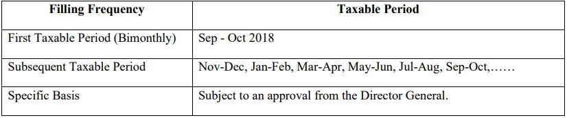
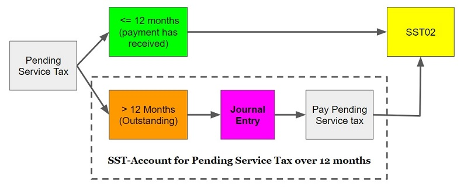
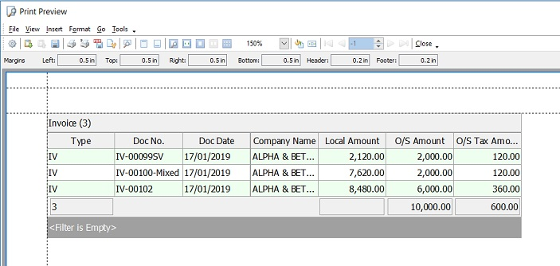
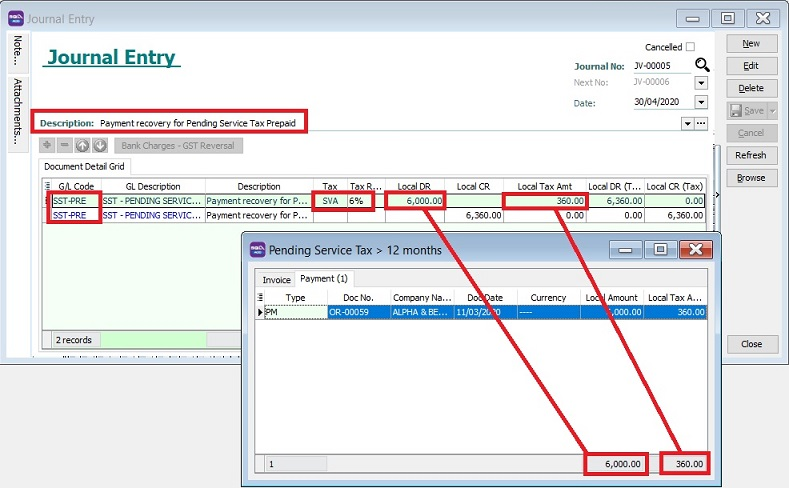
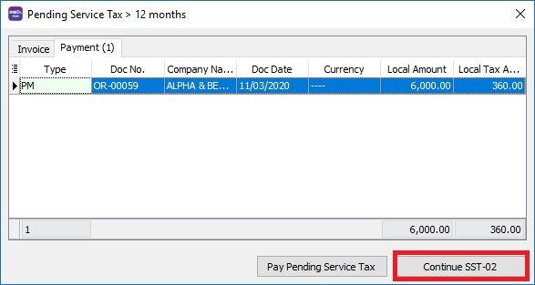

## Invoices

Issuance of Invoice:

- Mandatory for registered manufacturer who **sell taxable goods** or **provides any taxable servies**.

- Hard copy or electronically.

- Containing prescribed particulars.

- Bahasa Melayu or English.

   **Prescribed particulars** are:

   1. The invoice **serial number**

   2. The **date** of the invoice

   3. The **name**, **address** and **identification number** of the registered manufacturer (Sales Tax / Service Tax Number)

   4. The **name** and **address** of the person to whom the taxable goods is sold or the taxable service is provided

   5. **Description** and **quantity** of the goods or service provided

   6. Any **discount** offered

   7. For each description, distinguish the **type** of goods / service, quantity and **amount** payable excluding tax

   8. The **total amount** payable excluding tax, the rate of tax and the **total tax** chargeable shown as a separate amount or total amount payable inclusive of total of tax chargeable

   9. Any amount expressed in a *currency other than ringgit* shall also be expressed **in ringgit** at the selling rate of exchange prevailing in Malaysia at the time of sale.

## Credit Note & Debit Note usage

### Sales Tax

A credit note is allowed to issue by registered manufacturer under the situation where the goods are **returned** by the purchaser due to :

- Wrong quantity, poor or defective quality or uncontracted goods, provided that the goods have not been subsequently sold or disposed of by the purchaser.

- Discount given in respect of goods sold and which are freely available to all who are willing to conduct business.

A debit note is allowed to issue by registered manufacturer under the situation where there is an **additional** of sales tax to be paid for any **price adjustment**.

Both credit note and debit note shall contains the following particulars:

- The word “credit note” or “debit note” in a prominent place.

- The serial number and date of issue.

- The name, address and Sales Tax identification number of the supplier.

- The name and address of the customer.

- The **reason** for issuance.

- Description which identifies the description of goods, the quantity and amount for which CN or DN is given.

- The total amount excluding tax.

- The rate and amount of tax.

- The number and date of the original invoice.

If changes related to amount of tax payable:

- Adjustment in the return for the taxable period in which the credit note or debit note is issued.

- Adjustment in the return for the last taxable for person who has ceased to be a taxable person.

If deduction for taxable period exceeds the amount of sales tax payable, the balance is to be carried forward to the next taxable period. Refund is not allowed on balance carried forward if taxable person has ceased to carry on business.

### Service Tax

   Both credit note and debit note are allowed to issue by registered person. It shall contain the prescribed particular and make an adjustment in their SST-02 return.

## Accounting Basis and Taxable Period Information

### Accounting Basis Information

**Sales Tax** is based on accrual basis and it is required to be accounted at the time when the goods are sold, disposed of or first used.

**Service Tax** is based on payment basis and it is required to be accounted at the time when the payment has received. On the day following period of twelve months when any whole or part of the payment is not received from the date of the invoice for the taxable service provided.

### Taxable Period Information

Regular interval period where a taxable person accounts and remits Sales Tax / Service Tax to Government. Default taxable period for the registered manufacturer to be **bimonthly (2 months)** period.

Registered manufacturer may apply for taxable period other than the default taxable period.

In summary,

## Posting

### Sales Tax (Accrual Basis)

   

### Service Tax (Payment Basis)

   In SST 2.0, the service tax is due and payable when payment is received for any taxable service.

      

   1. Issue sales invoice with service tax 6%, date 31/10/2018, Amount RM 1,000.00 & Tax Amount RM 60.00.

      

   2. Process SST Return for the period 01/09/2018 to 31/10/2018. Total Tax Payable is RM 0 because no payment was received for the invoices issued.

      

   3. Payment is received on 05/11/2018, knocked-off on IV-00111.

      

   4. Process the second cycle of taxable period. The tax payable will be recorded as payment is received.

      

   5. SQL Account will auto Credit to SST- Deferred Tax account during invoice issue but no payment. Once payment is received, a Debit will be auto reversed at SST-Deferred Tax Account.

      

   6. The taxable amount of RM 1,000.00 and the tax amount of RM 60.00 will also be recorded in SST-02 Part B2, item 11c.

      

## SST-Account for Pending Service Tax over 12 months

Service Tax required to be accounted if on the day following period of 12 month when any whole or part of the payment is not received from the date of the invoice for the taxable service provided.

### Journal Entry Adjustment

#### [Invoice] Pending Service Tax To Be Paid

1. For first time, create the following GL Account.

   

   | GL Acc  | Description                          | Account Type    |
   |---------|--------------------------------------|-----------------|
   | SST-PRE | SST - PENDING SERVICE TAX PREPAID    | CURRENT ASSETS  |

2. Process SST Return, system will prompt the **Pending Service Tax > 12 months** if have found the outstanding service invoices has over 12 months.

3. Follow the Service Tax rules, click Pay Pending Service Tax button.

   

4. Right click on the grid column, select Print Grid.

   

5. Print out the list of outstanding service invoices for record purpose.

   

6. Post the journal entry and follow the double entry below to account the service tax pending over 12 months to be paid.

   

   | GL Code | GL Description                     | Tax | Local DR  | Local CR | Tax Amount | Local DR (Tax) | Local CR (Tax) |
   |---------|------------------------------------|-----|-----------|----------|------------|----------------|----------------|
   | SST-PRE | SST - PENDING SERVICE TAX PREPAID  |     | 10,600.00 |          |            | 10,600.00      |                |
   | SST-PRE | SST - PENDING SERVICE TAX PREPAID  | SVA |           | 10,000.00| 600.00     |                | 10,600.00      |

   :::note

   For partial payment, should refer to **Outstanding Amount** instead of Local Amount.

   Active the tax code : SVA
   1. Go to **SST/GST | Maintain Tax**.
   2. Look for tax code: **SVA** or **SV**.
   3. Edit and tick **Active**.
   4. Save it.

   :::

7. Next, go to New SST Return. Click Process.
8. At this time, click **Continue SST-02**.

#### [Payment] Recovery from Payment for Pending Service Tax Prepaid

1. Under the **payment tab**, system will list out the prepayment service invoice which has been paid when process SST return.
2. If you have follow the Service Tax rules, click Pay Pending Service Tax button.

   

3. Right click on the grid column, select Print Grid.
4. Print out the list of the prepayment service invoice which has been paid for record purpose.
5. Post the journal entry and follow the double entry below to recover the service has been paid.

   

   | GL Code | GL Description                    | Tax | Local DR | Local CR | Tax Amount | Local DR (Tax) | Local CR (Tax) |
   |---------|-----------------------------------|-----|----------|----------|------------|----------------|----------------|
   | SST-PRE | SST - PENDING SERVICE TAX PREPAID | SVA | 6,000.00 |          | 360.00     | 6,360.00       |                |
   | SST-PRE | SST - PENDING SERVICE TAX PREPAID |     |          | 6,360.00 |            |                | 6,360.00       |

6. Next, go to New SST Return. Click Process.
7. At this time, click Continue SST-02.

   
