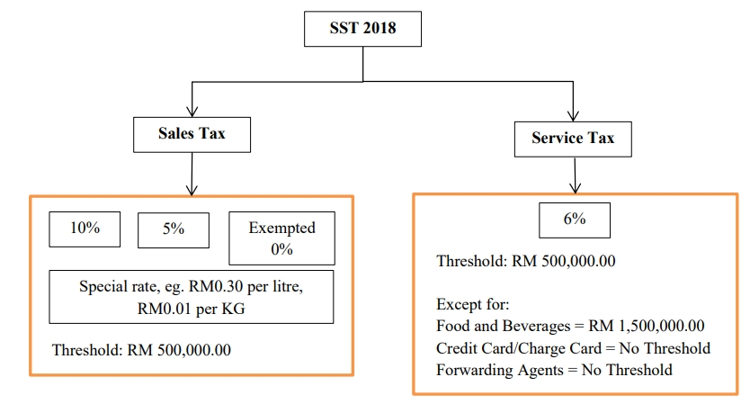

## SST Introduction

Introduced in September 2018, SST replaced the former 6% Goods and Services Tax (GST) system. SST consists of two parts: Sales Tax and Service Tax. Sales Tax is a single-stage tax applied to all taxable goods manufactured in or imported into Malaysia, while Service Tax is a single-stage tax imposed on taxable services provided in Malaysia by a registered business. Certain designated areas in Malaysia such as Langkawi Island, Tioman Island, and the Federal Territory of Labuan, are exempt from Service Tax.

### Sales and Service Tax 2018 Model and Scope

Sales and Service Tax model are structured as below:

