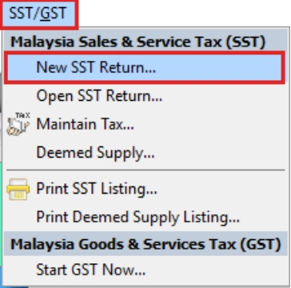
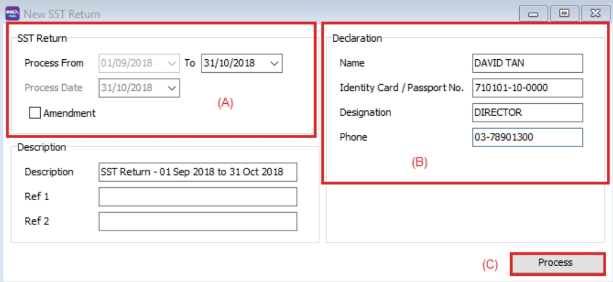
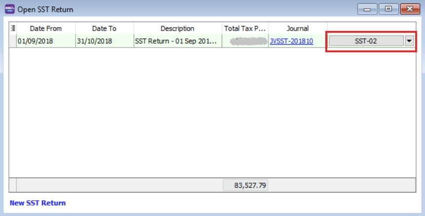
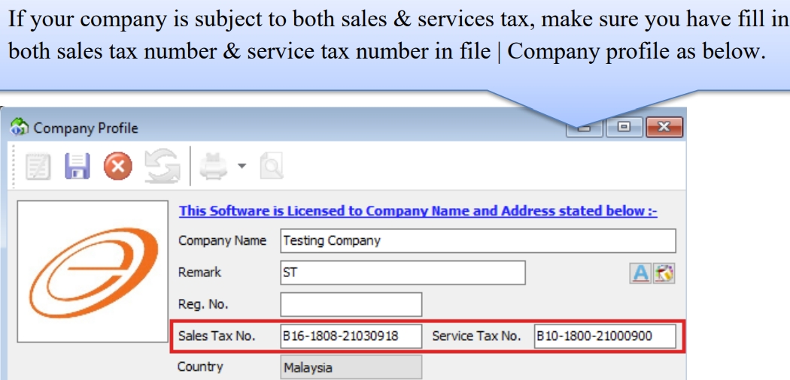
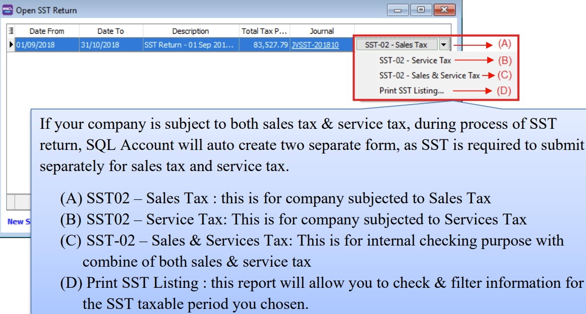
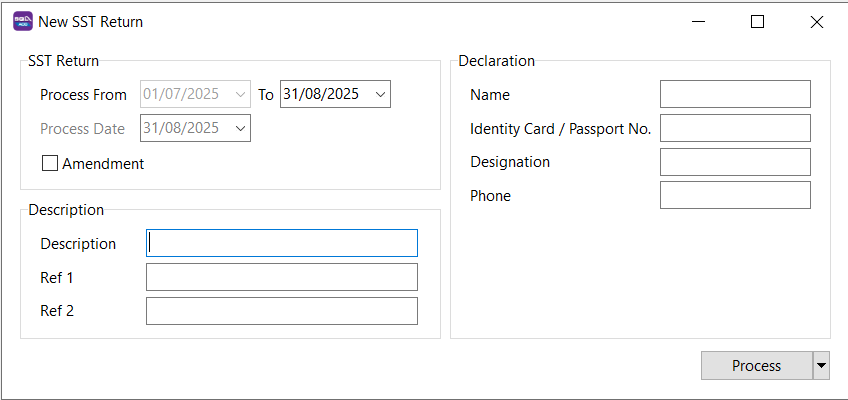
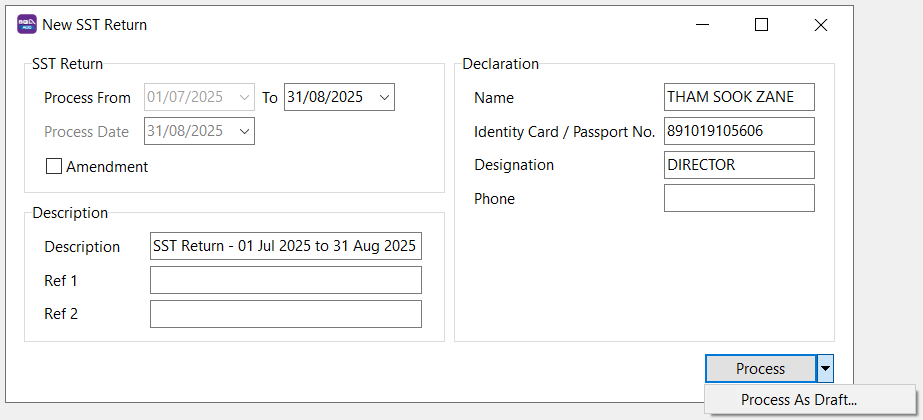
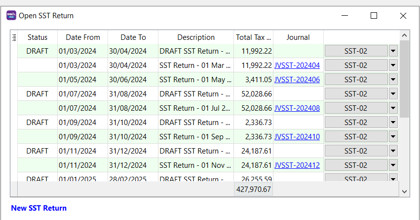
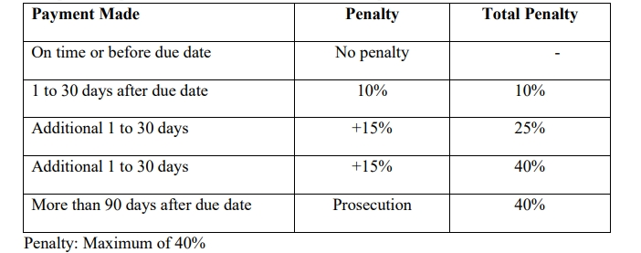

## Open SST Return

### Example of SST-02

:::info

Follow the steps to process SST-02 in SQL Account : [Youtube](https://youtu.be/laLjRJWh2j8)

:::

1. Process SST Return from SST | New SST Return

   

2. Enter your taxable period

3. Key in declaration, which will appear in Part F of the SST-02 form. This declaration only needs to be entered once, as it will automatically appear in subsequent returns.

4. Click Process

   

5. Click SST-02

   

   

   

:::info

Understand SST02 27 Column : [Video](https://www.facebook.com/SQLEstream/videos/2216806511940307/)

:::

## New SST Return

To process and close the SST returns period, you can generate the SST-02.

| Field Name          | Field Type | Explanation                                                                                                      |
|---------------------|------------|------------------------------------------------------------------------------------------------------------------|
| Process From to     | Date       | SST Taxable Period, e.g., every 2 months.                                                                        |
| Process Date        | Date       | Date to process the SST Return.                                                                                  |
| Amendment           | Boolean    | Ticked. In SST-02, the "Amendment" checkbox will be marked X.                                                    |
| C/F Refund for SST  | Boolean    | Ticked. In SST-02, the Item 9 "Do you choose to carry forward refund for SST?" will be marked X in Yes checkbox. |
| Description         | String     | SST Return - Process From Date to Date (by default).                                                             |
| Ref 1               | String     | Key-in any reference no.                                                                                         |
| Ref 2               | String     | Key-in any reference no.                                                                                         |

## Draft SST Return

You can draft the SST-02 before final submission by processing it as draft.

1. Click on the arrow key down at the Process button.
2. See below screenshot.

   

3. **DRAFT** Status showed for the SST Returns period.

   

:::note

You still can amend the documents where the DRAFT SST return has generated. You may create multiple drafts before finalizing the SST return for the period.

:::

## Final SST Return

1. Click on the Process button.
2. See below screenshot.

   

3. Final SST Return will no longer display **DRAFT** in the status column.

   

:::note

Once the SST return is finalized, you cannot amend the documents.

:::

## Miscellaneous

### Remission

The Minister may remit the whole or any part of sale tax due and payable.

Director General may remit the whole or any part of:

- Surcharge
- Penalty
- Fee
- Other money payable under the Act

### Refund of overpaid tax

Individual that is eligible to claim if:

- Any person who has **overpaid** or erroneously paid of sales tax, penalty, surcharge, fee
- Any person who has **paid** sales tax and then **exemption** or remission of sales tax is granted by Minister.

Claim to be made in form JKDM No. 2 within one year from the date of over payment or erroneously payment; or entitlement of refund.

### Drawback

Director General may allow a drawback of the full amount of sales tax paid by a person for taxable goods that are subsequently exported. This does **not apply to Petroleum**.

Conditions:

- Goods must be exported within six months from Sales Tax paid on import or date of invoice issued.

- Application made within three months from the date of export in JKDM Form no. 2

- Other conditions with regards to documentation and declaration.

Submission to sales tax office at applicants’ place of business.

Illustration:

### Penalty for late payment of tax

Late payment penalty on the amount of sales tax not paid as shown in the table below.

### Other penalty for offences

Evasion of sales tax:

- 1st offence - either or both

  - Fine

    - Minimum 10x Sales Tax Amount

    - Maximum 20x Sales Tax Amount

  - Imprisonment not exceeding 5 years

- 2nd offence - either or both

  - Fine

    - Minimum 20x Sales Tax Amount

    - Maximum 40x Sales Tax Amount

  - Imprisonment not exceeding 7 years

## Furnishing Sales Tax / Service Tax (SST-02) Return & Payment of Tax

Registered manufacturer / person has to declare SST return every 2 months according to the taxable period.

- Service Tax return has to be submitted **not later than the last day** of the following month after the taxable period ended.

- Service Tax return has to be submitted regardless of whether there is any tax **to be paid or not**.

- Service Tax return has to be submitted **electronically or by cheque, bank draft** and posted to SST Processing Centre.

Payment for tax due and payable declared in SST-02. Failure to submit return is an offence.
