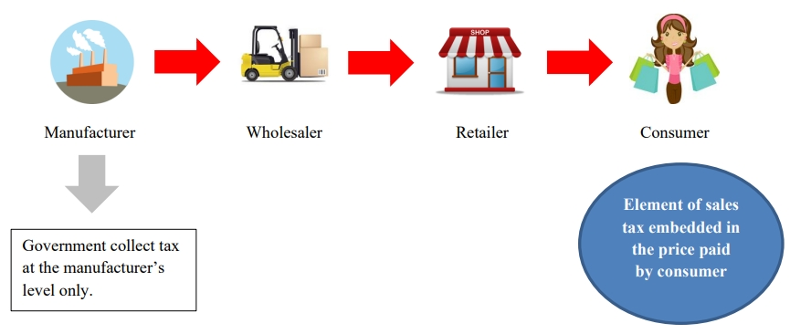
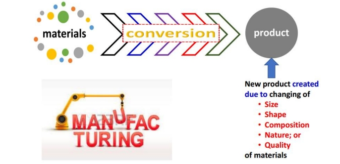
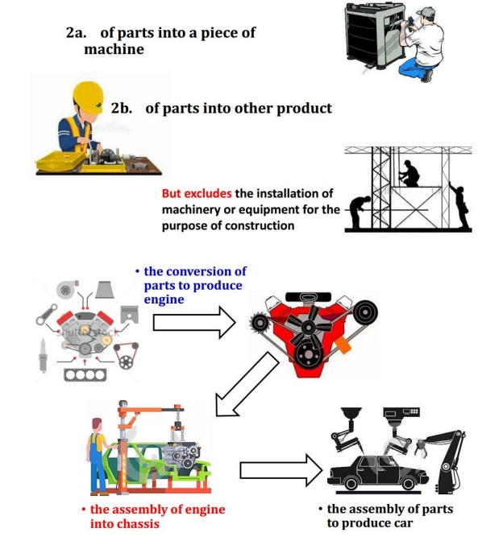
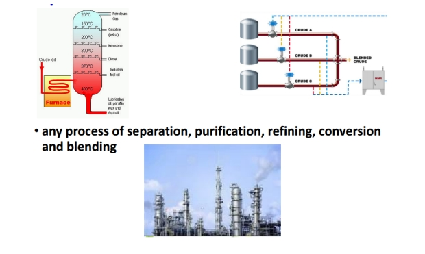
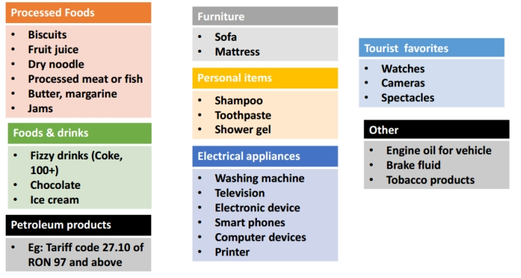
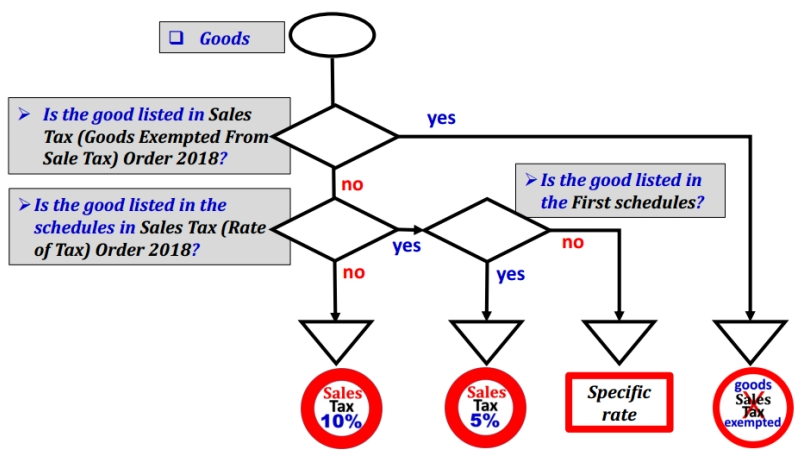
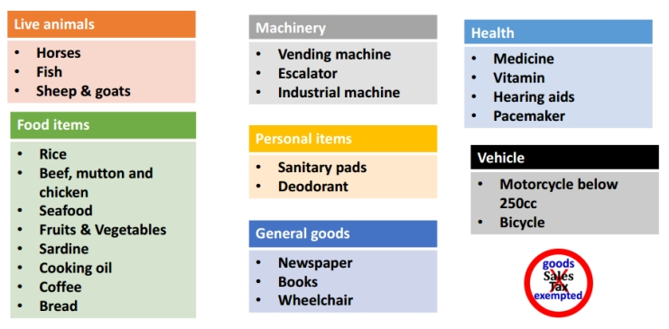
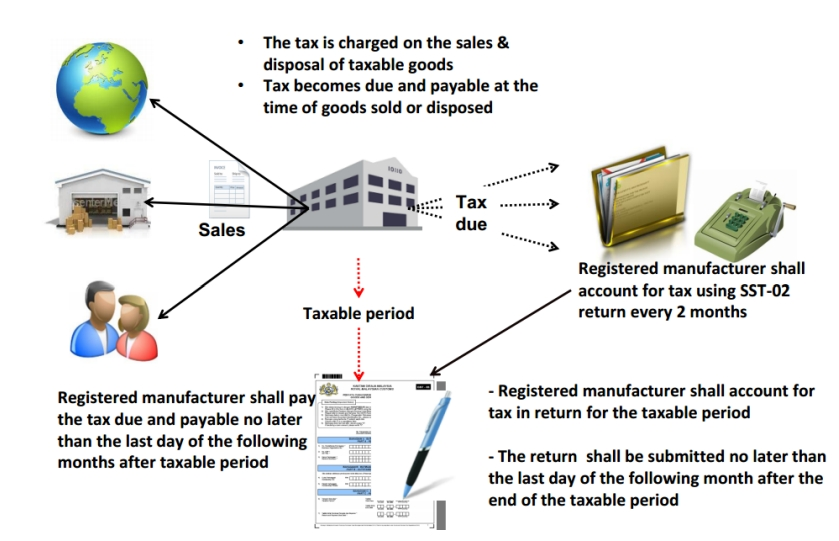
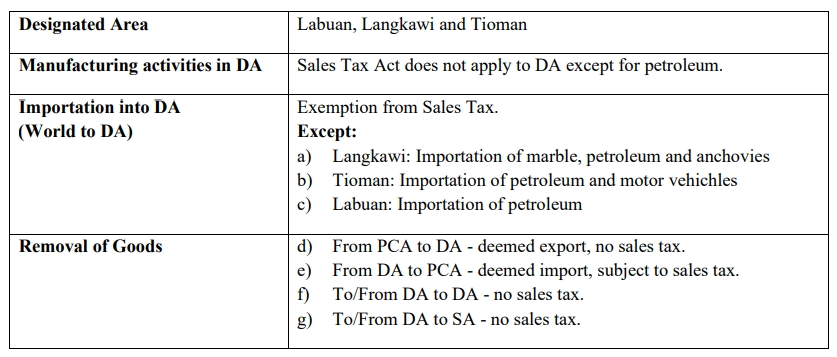
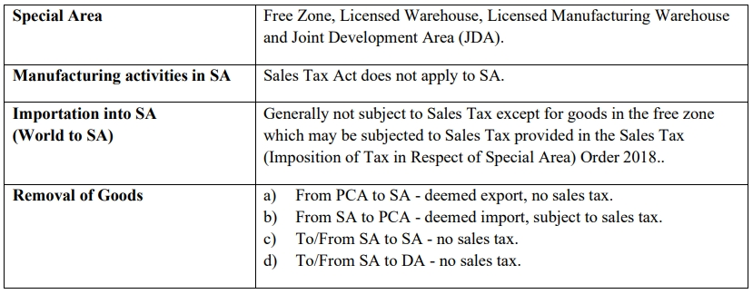

## Overview

## Meaning of Manufacture

Manufacture defines as **a conversion of materials** by manual or mechanical means into a new product by changing the following:

1. Size

2. Shape

3. Composition

4. Nature

5. Quality

of such materials and includes the assembly of parts into a piece of machinery or other products.

However, manufacture does **not include** the **installation of machinery** or **equipment** for the purpose of **construction**.

In relation to **Petroleum**, any process of:-

1. Separation

2. Purification

3. Conversion

4. Refining

5. Blending

For goods other than **Petroleum**

1. By conversion

   

2. The assembly

   

3. For petroleum

   

## Sales Tax Registration

### Liability To Register

Manufactures of taxable goods are required to register when the **sales value of taxable goods** exceeds RM 500,000 over a 12 months period.

Manufacturers who carry out **sub-contract** work on taxable goods where the **value** of work performed exceeds RM500,000 for 12 months period.

Taxable goods belong to:

- Registered manufacturer;

- Non-registered manufacturer

- Manufacturer in special area (FIZ and LMW)

:::note
Registered Person will known as Registered Manufacturers.
:::

### Voluntary Registration

Conditions are:

- Sales value of taxable goods **below** threshold (ie. < RM 500,000).
- Person who are **exempted** from registration

### Determination of Turnover

Manufacturers should calculate the sales value of taxable goods for a period of 12 months using the following methods:

1. **Historical Method**

   The total value of taxable goods in that month and the 11 months immediately **preceding** the month;

2. **Future Method**

   The total value of taxable goods in that month and the 11 months immediately **succeeding** the month.

### Exemption from Registration

1. Manufacturer of non taxable goods. (Not eligible for voluntary registration).

2. Manufacturer below threshold (ie. < RM 500,000).

3. Sub-contractor manufacturer below threshold.

4. Manufacturing activities that have been exempted from registration. E.g :

     - Tailoring

     - Installation incorporation of goods into building

### Transitional Registration

   Manufacturer liable for registration must register before September 1, 2018. The registration commencement date is September 1, 2018.

   1. **Automatic Registration**

      - Manufacturers who are GST Registered Persons which have been identified and fulfilled the required criteria will be registered automatically as Registered Manufacturer under Sales Tax.

      - Registered Manufacturer need to charge tax beginning 1 September 2018.

   2. **Person Not Registered Automatically**

      - GST registered person who fulfilled the required criteria to be registered but were not registered by 1 September 2018 need to apply for registration within 30 days from the commencement date.

## Taxable vs Exempted Goods

### Taxable Goods

Taxable goods refer to goods of a class or kind **not exempted** from sales tax. In another words, goods which are not listed in **Sales Tax (Goods Exempted From Sales Tax) Order 2018.**

Example of taxable goods include:

It is chargeable with a tax rate of

- 10% - standard sales tax rate

- 5% - reduced sales tax rate

  - First Schedule in the Sales Tax (Rate of Tax) Order 2018

- Specific rate - for petroleum product (eg. RM0.30 per litre)

  - Second Schedule in the Sales Tax (Rate of Tax) Order 2018

How to determine the rate of sales tax for goods?

### Exempted Goods

   **Exempted goods** refer to goods of a class or kind that are exempted from sales tax, as listed in the **Sales Tax (Goods Exempted From Sales Tax) Order 2018**.

   Example of exempted goods are:

   

## Value of Taxable Goods

Refer to **Sales Tax (Rules of Valuation) Regulation 2018**, value of taxable goods that:

- Sold by taxable person

- Manufactured and used by the manufacturer for other purpose than as materials in manufacturing

- Disposed of by manufacturer.

For goods belongs to another manufacturer is known as **sub-contract** work.

- Sale value of the goods = Amount of the work performed and charged by **sub-contractor**.

The sale value of the goods shall be determined on the basis of the **transactions value of the goods** as the primary basis of valuation.

Transaction value of the goods:

- The **actual price** the goods are sold, without any conditions or restrictions imposed to purchaser.

- Purchaser is not required to give parts of proceed on subsequent sale to the manufacturer.

- Purchaser and manufacturer are not related or if related the relationship did not influence the price.

## Responsibility of Registered Manufacturer

   

## Exemption and Facilities

### Goods Exempted from Sales Tax

**Goods** refer to Sales Tax (Goods Exempted From Sales Tax) Order 2018.

- E.g. live animals, unprocessed food, vegetables, medicines, machinery, chemicals, etc.

### Person Exempted from Sales Tax

Person refer to Sales Tax (Person Exempted From Sales Tax) Order 2018.

- **Schedule A**: Class of person, e.g. Ruler of States, Federal or State Government Department, Local Authority, Inland Clearance Depot, Duty Free Shop.

- **Schedule B**: Manufacturer of specific non-taxable goods, e.g. any manufacturer of

    1. Controlled goods under Control of Supplies Act 1961

    2. Pharmaceuticals products

    3. Solely manufacture milk products

    4. Solely manufacture of exempted goods for export to import/purchase raw materials, components and packaging materials.

- **Schedule C**: Registered Manufacturer, exemption of tax on the acquisition of raw materials, components, packaging to be used in manufacturing of taxable goods (previously known as CJ5, CJ5A, CJ5B).

### Field Exempted from Sales Tax

   Manufacturing activities exempted from registration regardless of turnover.

- E.g. tailor, jeweller, optician, engraving, vanishing table top, etc.

## Special Rules for Specific Area

### Treatment in Designated Area for Sales (DA)

:::note
SA = Special Area, e.g. Free Zone (FZ), Licensed Warehouse, Licensed Manufacturing Warehouse (LMW) and Joint Development Area (JDA).

PCA = Principal Customs Area
:::

### Treatment in Special Area for Sales (SA)

