## Overview

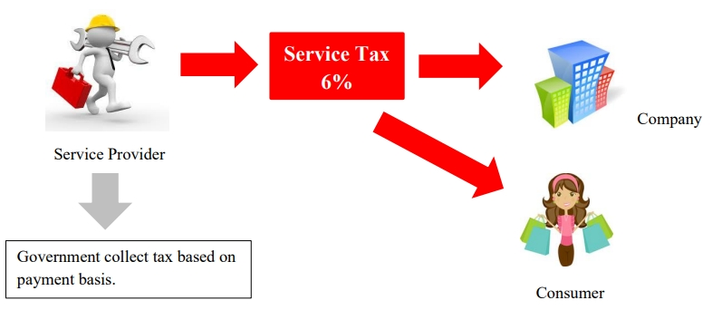

## Taxable Service

Value of taxable service provided by a service provider for a period of 12 months that **exceed** a threshold of RM 500,000 is liable to be registered. Except the following taxable service group:

- Food and Beverages (exceed RM 1,500,000)

- Credit card / charge card (**no threshold**)

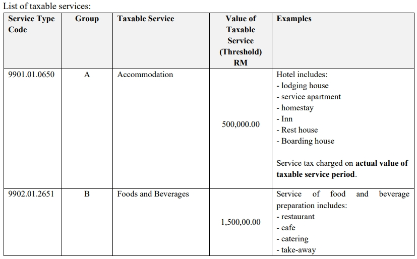

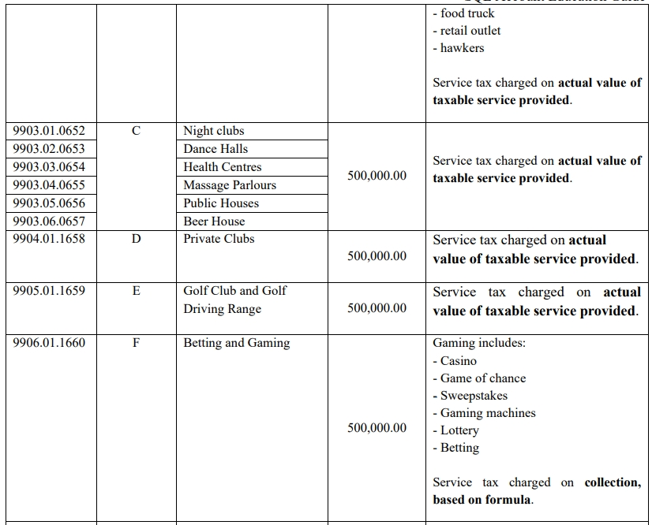

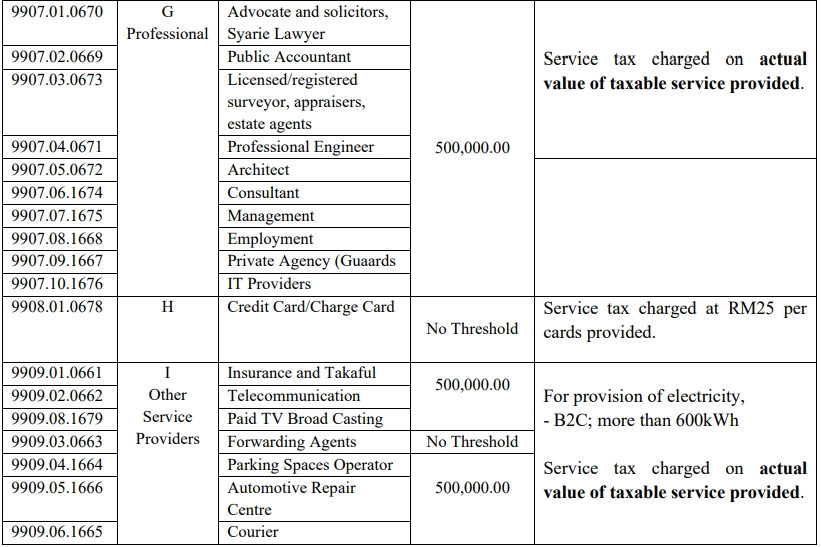

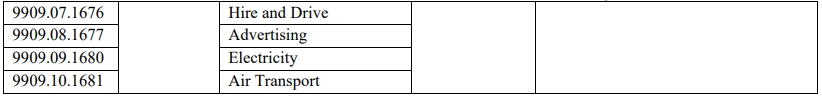

## Rate of Services

All taxable services are **fixed** charged at a rate of **6%**, except the provision of **credit card/charge card** services are charged at a specific rate of tax of **RM25** is imposed upon issuance of principal or supplementary card and every subsequent year or part thereof.

## Service Tax Registration

### Types of Registration list

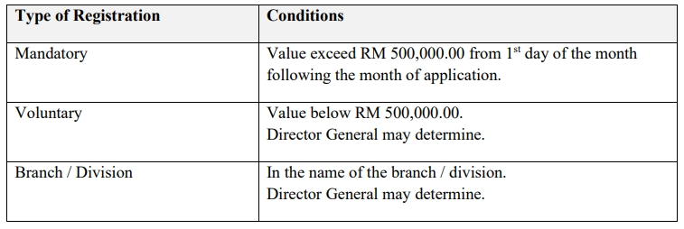

### Determination of Taxable Turnover

Service provider should calculate the value of taxable services provided for a period of 12 months using the following method:

1. **Historical Method**

    The total value of taxable supplies in that month and the 11 months immediately **preceding** the month.

2. **Future Method**

    The total value of taxable supplies in that month and the 11 months immediately **succeeding** the month.

### Transitional Registration (Service)

   Any person liable to register must do so before September 1, 2018. The registration commencement date is 1 September 2018.

   1. **Automatic Registration**

      - Service provider who is a GST Registrant which have been identified and fulfilled the required criteria will be registered automatically as a registered person.

   2. **Person Not Registered Automatically**

      - Service provider who is a GST Registered person that fulfilled the required criteria to be registered but was not registered by 1 September 2018 need to apply for registration within 30 days from the commencement date.

## Contra System Facility

Registered person is allowed to deduct service tax in his return for any cancellation and termination of services or any other reasons such as reducing premiums or discounts.

## Digital Service Tax

New service tax effectively came into operation on **1 January 2020**.

### Characteristics

- Delivered or subscribed over the **internet or other electronic network**
- Delivered through **information technology medium** (human eye cannot see and touch)
- Minimal or no human **intervention** (eg. automation, click to subscribe and consume)

### Scope on Digital Service

- Software, application & video games
- Music, e-book and film
- Advertisement and online platform
- Search engine and social network (facebook)
- Database and hosting (eg. website hosting, online data, file sharing, cloud storage)
- Internet based telecommunication (eg. VOIP)
- Online training
- Subscription to online newspapers
- payment process services (paypal)

### Taxable Person

1. **Foreign Service Provider (FSP)**

    - any person who is **outside Malaysia providing** any digital service to a consumer directly
    - any person who is **outside Malaysia operating an online platform** for buying and selling goods
    - providing services (whether or not such person provides any digital services) who makes transactions for provision of digital services **on behalf of any person**

2. **Threshold exceeds RM500,000 (historical or future 12 months)**

   - **Accounting Basis**

      - Default is **Payment basis** (same to service tax)
      - Accrual Basis (billing) must apply to DG upon registration

   - **Exchange Rate**

      - Can use any exchange rate to calculate tax payable

   - **Taxable Period**

      - Three months (quarterly)

### Returns Form

- Digital Service Return [DST-02](https://drive.google.com/file/d/1n2rrcnGrYms9RWki20Rg9vukzzRNtHll/view)

### Exemption

- No exemption announced

### Claim Refund

- Digital service tax overpaid allowed to claim refund.
- Need fill-in [JKDM-2](https://mysst.customs.gov.my/assets/document/SST%20Form/JKDM%20No.%202.pdf)

## SST-Imported Service (SST-02A)

### Imported Service Tax (IMSV)

Purchase service from oversea by any companies in Malaysia and it is subject to **imported service tax 6%**.

- For **Service Tax registered ONLY**, declare together with other service tax in SST-02
- For **non-SST registered**, declare imported service in **SST-02A**
- For **Sales Tax registered ONLY**, declare imported service in **SST-02A**
- Enter at **Cash Book Entry (PV)** or at **Supplier/Purchase Invoice**. See the illustration below.
- Use Tax code : **IMSV**

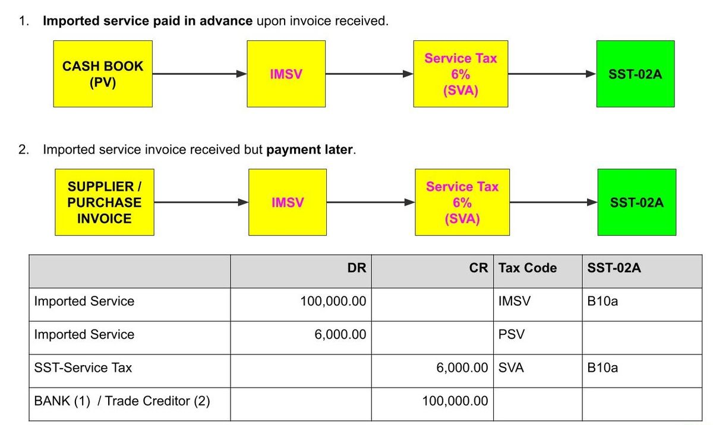

### Imported Service Tax Exempted (IMSVE)

Any company in Malaysia who acquires taxable services of Group G item (a), (b), (c), (d), (e), (f), (g), (h) and (i) from any company within the same group of companies outside Malaysia. It is **Exempted**.

- Need to declare in SST-02
- Enter at **Cash Book Entry (PV)** or at **Supplier/Purchase Invoice**. See the illustration below.
- Use Tax code : **IMSVE**

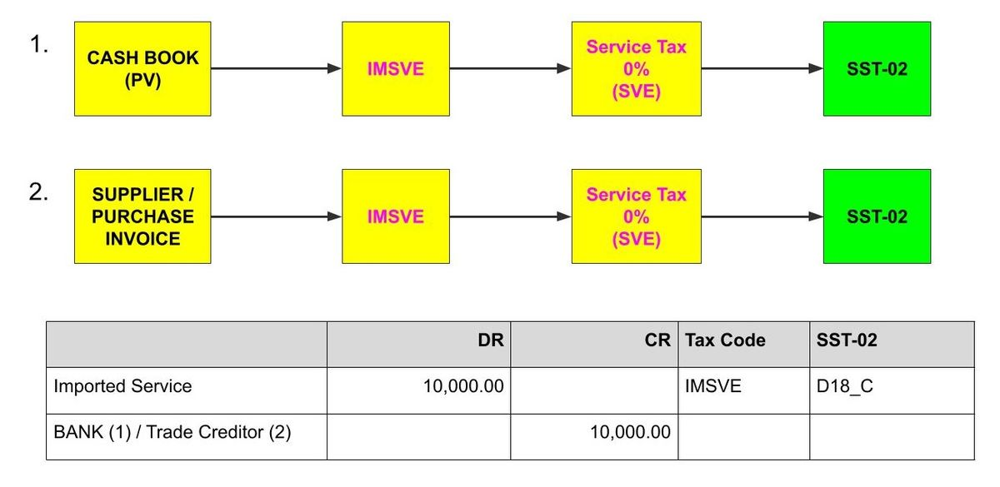

### How to get print SST-02A

1. Go to **File | Company Profile**...
2. Make sure the **Service Tax No** field is **BLANK**.

   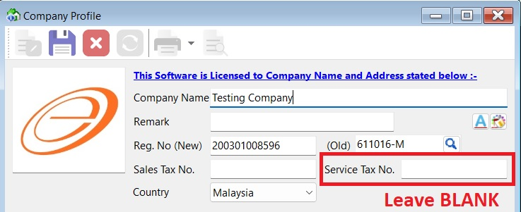

   :::note Note:

   For **Service Tax Registered company**, it is declare together with other service tax in SST-02

   :::

3. Save it.
4. Logout and login again.
5. Go to menu : **SST/GST | Print SST-02A**...

   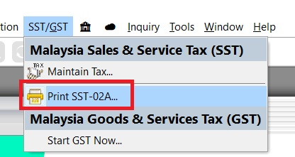

## Special rules for specific areas

### Treatment in Designated Area for Service (DA)

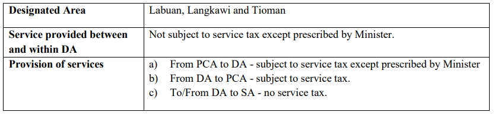

:::note
SA = Special Area, e.g. Free Zone (FZ), Licensed Warehouse, Licensed Manufacturing Warehouse (LMW) and Joint Development Area (JDA).

PCA = Principal Customs Area
:::

### Treatment in Special Area for Service (SA)

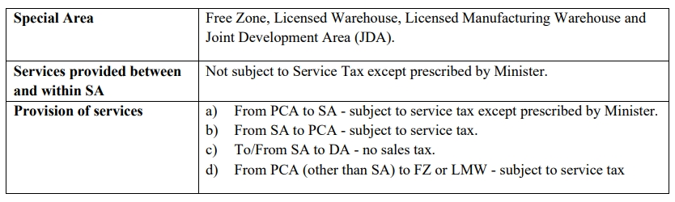
