## Tax Code and SST-02 Mapping

The images below show SST tax code structures and mapping to SST-02:

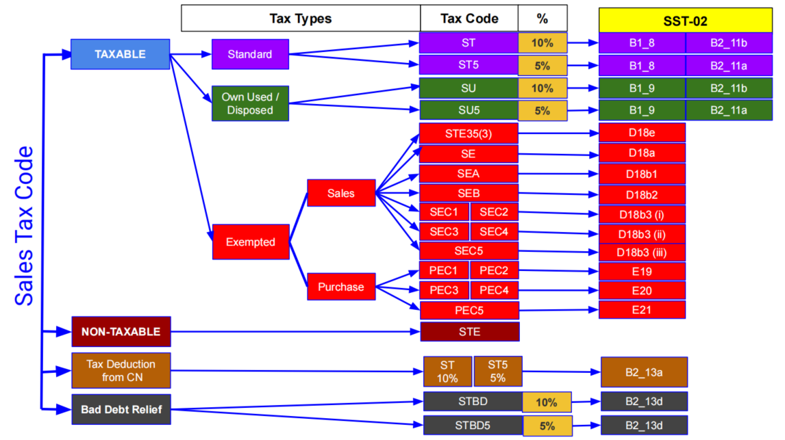

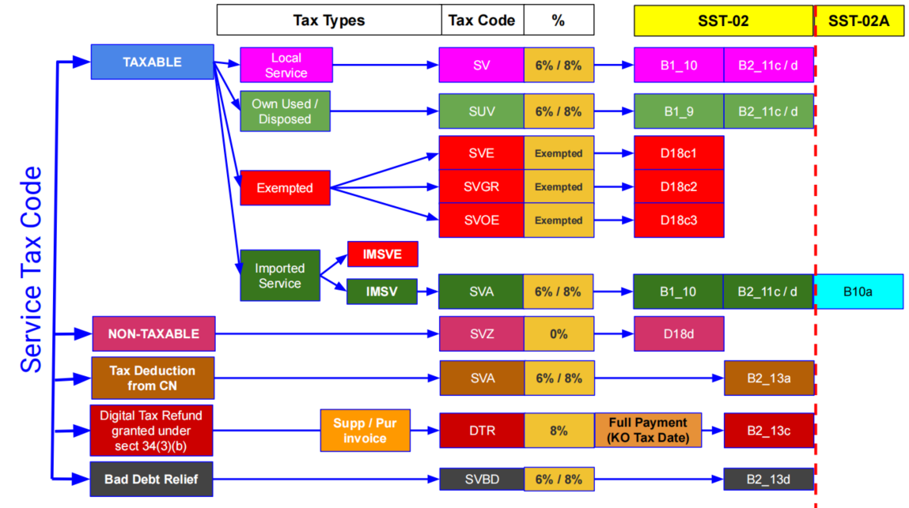

**Part A:**

   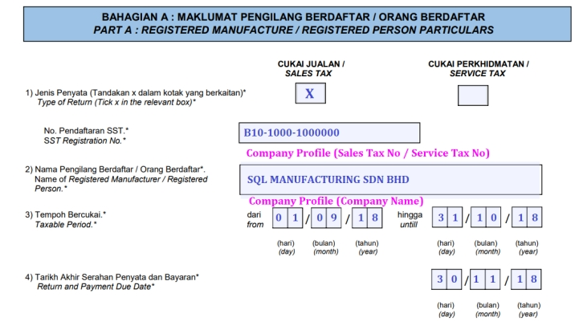

**Part B1:**

   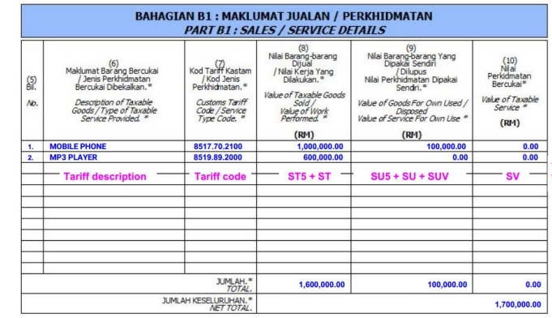

**Part B2:**

   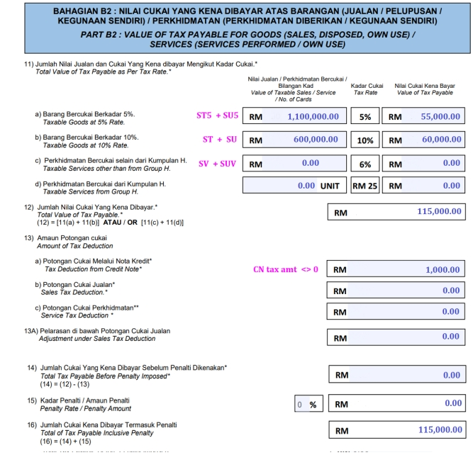

**Part C:**

   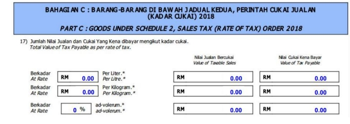

**Part D:**

   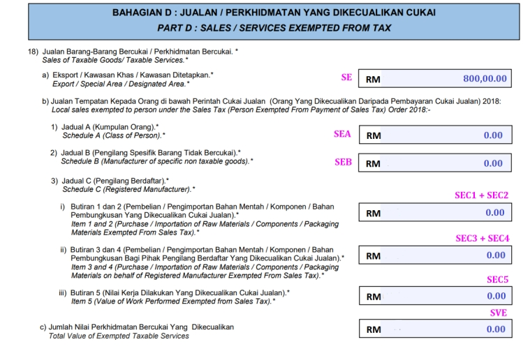

**Part E:**

   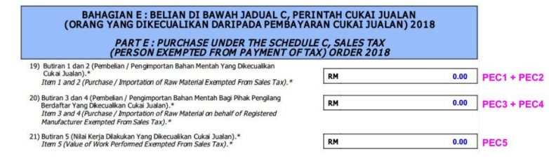

**Part F:**

   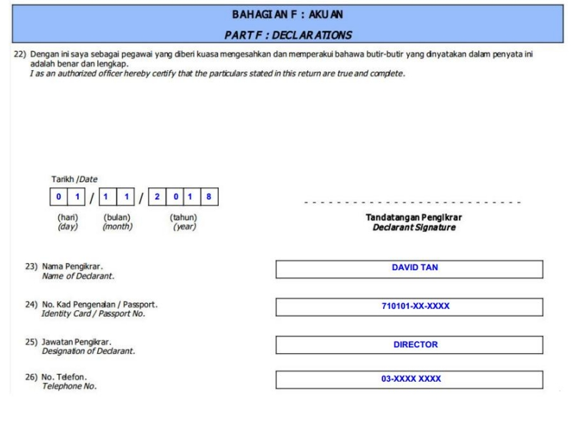

**Part G:**

   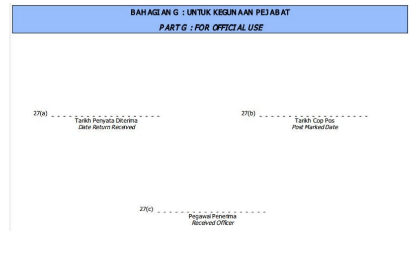

## Sales Tax Code

1) **Standard**

   | No | Tax Code | Description                                                               | Tax Rate | SST-02       |
   |----|----------|---------------------------------------------------------------------------|----------|--------------|
   | 01 | ST       | Sales Tax 10% charged to the taxable goods based on accrual/billing basis | 10%      | B1_8, B2_11B |
   | 02 | ST5      | Sales Tax 5% charged to the taxable goods based on accrual/billing basis  | 5%       | B1_8, B2_11A |

2) **Deemed Supply (Own Used/Disposed)**

   | No | Tax Code | Description                                                                              | Tax Rate | SST-02       |
   |----|----------|------------------------------------------------------------------------------------------|----------|--------------|
   | 01 | SU       | Goods Own Used/Disposed deemed taxable and charged at 10% based on accrual/billing basis | 10%      | B1_9, B2_11B |
   | 02 | SU5      | Goods Own Used/Disposed deemed taxable and charged at 5% based on accrual/billing basis  | 5%       | B1_9, B2_11A |

3) **Sales - Exempted**

   | No | Tax Code | Description                                                                                                                                                                                               | Tax Rate | SST-02       |
   |----|----------|-----------------------------------------------------------------------------------------------------------------------------------------------------------------------------------------------------------|----------|--------------|
   | 01 | STE      | Sales Tax Exempted on goods as prescribed in the Sales Tax (Goods Exempted From Tax) Order 2018                                                                                                           |          |              |
   | 02 | SE       | Sales Tax Exempted to Export, Special Area (SA), e.g. Free Zone, LMW and Designated Area (DA), e.g. Langkawi, Tioman, Labuan                                                                              |          | D18_A        |
   | 03 | SEA      | Sales Tax Exempted-Sch A (Class of Person), e.g. Government, Local Authority Dept. Detail refer to Schedule A in Sales Tax (Person Exempted From Payment Of Tax) Order 2018                               |          | D18_B1       |
   | 04 | SEB      | Sales Tax Exempted-Sch B (Manufacturer of specific non-taxable goods), e.g. control products, medical. Detail refer to Schedule B in Sales Tax (Person Exempted From Payment Of Tax) Order 2018           |          | D18_B2       |
   | 05 | SEC1     | Sales Tax Exempted-Sch C (Item 1) on raw materials, components and packaging materials **excluding PETROLEUM** imported/purchased from a reg. manufacturer/licensed warehouse by any reg. manufacturer    |          | D18_B3 (i)   |
   | 06 | SEC2     | Sales Tax Exempted-Sch C (Item 2) on raw materials, components and packaging materials imported/purchased from a reg. manufacturer/licensed warehouse by any reg. manufacturer of **PETROLEUM** products  |          | D18_B3 (i)   |
   | 07 | SEC3     | Sales Tax Exempted-Sch C (Item 3) on raw materials, components and packaging materials **excluding PETROLEUM** imported/purchased from a reg. manufacturer by any agent on behalf of a reg. manufacturer  |          | D18_B3 (ii)  |
   | 08 | SEC4     | Sales Tax Exempted-Sch C (Item 4) on raw materials, components and packaging materials imported/purchased from a reg. manufacturer by any agent on behalf of a reg. manufacturer of **PETROLEUM** products|          | D18_B3 (ii)  |
   | 09 | SEC5     | Sales Tax Exempted-Sch C (Item 5) on semi-finished taxable goods or finished taxable goods which are subsequently returned by a subcontractor to a reg. manufacturer after completion of subcontract work |          | D18_B3 (iii) |

4) **Purchase - Exempted**

   | No | Tax Code | Description                                                                                                                                                                                                  | Tax Rate | SST-02 |
   |----|----------|--------------------------------------------------------------------------------------------------------------------------------------------------------------------------------------------------------------|----------|--------|
   | 01 | PEC1     | Purchase Tax Exempted-Sch C (Item 1) on raw materials, components and packaging materials **excluding PETROLEUM** imported/purchased from a reg. manufacturer/licensed warehouse by any reg. manufacturer    |          | E19    |
   | 02 | PEC2     | Purchase Tax Exempted-Sch C (Item 2) on raw materials, components and packaging materials imported/purchased from a reg. manufacturer/licensed warehouse by any reg. manufacturer of **PETROLEUM** products  |          | E19    |
   | 03 | PEC3     | Purchase Tax Exempted-Sch C (Item 3) on raw materials, components and packaging materials **excluding PETROLEUM** imported/purchased from a reg. manufacturer by any agent on behalf of a reg. manufacturer  |          | E20    |
   | 04 | PEC4     | Purchase Tax Exempted-Sch C (Item 4) on raw materials, components and packaging materials imported/purchased from a reg. manufacturer by any agent on behalf of a reg. manufacturer of **PETROLEUM** products|          | E20    |
   | 05 | PEC5     | Purchase Tax Exempted-Sch C (Item 5) on semi-finished taxable goods or finished taxable goods which are subsequently returned by a subcontractor to a reg. manufacturer after completion of subcontract work |          | E21    |

## Service Tax Code

1) **Standard**

   | No | Tax Code | Description                                                                                                                    | Tax Rate | SST-02        |
   |----|----------|--------------------------------------------------------------------------------------------------------------------------------|----------|---------------|
   | 01 | SV       | Service Tax 6% charged to the taxable services based on payment basis                                                          | 6%       | B1_10, B2_11C |
   | 02 | SVA      | Service Tax 6% charged to the taxable service based on accrual/billing basis. It is used in IMSV tax code to report in SST-02A | 6%       | B1_10, B2_11C |

2) **Deemed Supply (Own Used/Disposed)**

   | No | Tax Code | Description                                             | Tax Rate | SST-02       |
   |----|----------|---------------------------------------------------------|----------|--------------|
   | 01 | SUV      | Service Own Used charged at 6% on accrual/billing basis | 6%       | B1_9, B2_11C |

3) **Service Exempted**

   Applicable to **same service provider** under:

      1) Group G to Group G (all except Employment and Guards protection service provider).
      2) Group I to Group I (ie. advertising service provider).

   | No | Tax Code | Description                                                                                                                                                                              | Tax Rate | SST-02 |
   |----|----------|------------------------------------------------------------------------------------------------------------------------------------------------------------------------------------------|----------|--------|
   | 01 | SVE      | Service Tax Exempted between same service providers in Group G (excluding item j and k) or in Group I item 8 only. Refer to Service Tax (Person Exempted From Payment of Tax) Order 2018 |          | D18C   |

4) **Imported Service**

   1) For non-Service Tax Registered must declare using **SST-02A**.
   2) For Service Tax Registered must declare using **SS-02**.

   | No | Tax Code | Description                                                                                                                                                                                             | Input Tax | Output Tax | SST-02       | SST-02A (for imported service) |
   |----|----------|---------------------------------------------------------------------------------------------------------------------------------------------------------------------------------------------------------|-----------|------------|--------------|--------------------------------|
   | 01 | IMSV     | Imported Service Tax, any company in Malaysia who acquire the taxable service from company outside Malaysia. Non-SST & Sales Tax reg. must report in SST-02A. Service tax reg. remains report in SST-02 | PSV (6%)  | SVA (6%)   | B1_10 B2_11C | B10a                           |
   | 02 | IMSVE    | Imported Service Tax Exempted between same service providers in Group G (excluding item j and k) or in Group I item 8 only. Refer to Service Tax (Person Exempted From Payment of Tax) Order 2018       | PSVE      | SVE        | D18C         |                                |

## Tariff Code

- Tariff classification is a complex yet extremely important aspect of cross-border trading.
- Goods imported from or to Malaysia are classified by the Harmonized Tariff Schedule (HTS) or commonly referred to as HS Codes.
- The codes, created by World Customs Organization (WCO), categorize up to 5,000 commodity
- HS Codes are made of 6-digit numbers that are recognized internationally, though different countries can extend the numbers by two or four digits to define commodities at a more detailed level.
- [Click this link here](https://ezhs.customs.gov.my/) to search the tariff code list from Kastam system.

### Quick Setup for Tariff Code

1. Create the tariff code applicable to your product at [Maintain Tariff](../../usage/first-time-setup#maintain-tariff).

   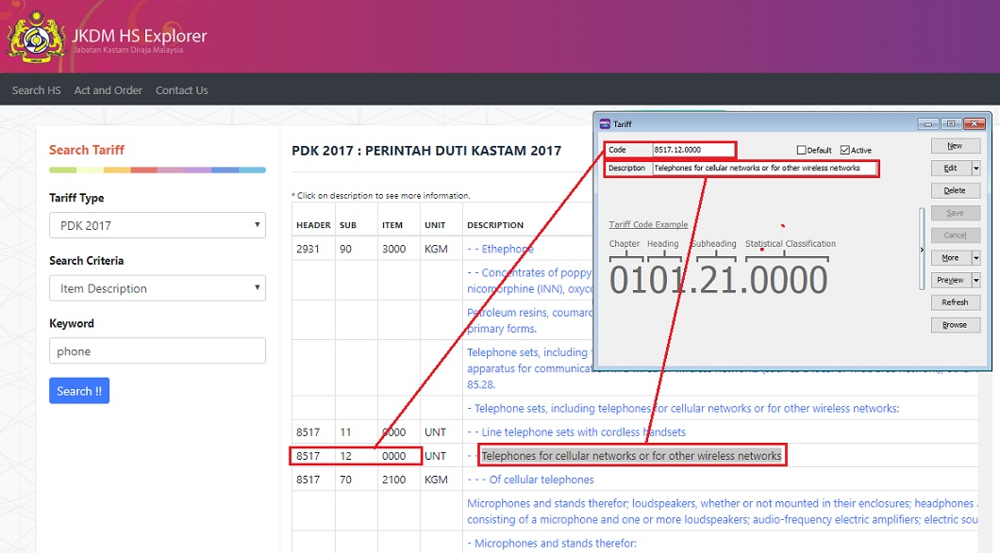

2. Pick a tariff code for an items at [Maintain Stock Item](../../usage/master-data#maintain-stock-item).

   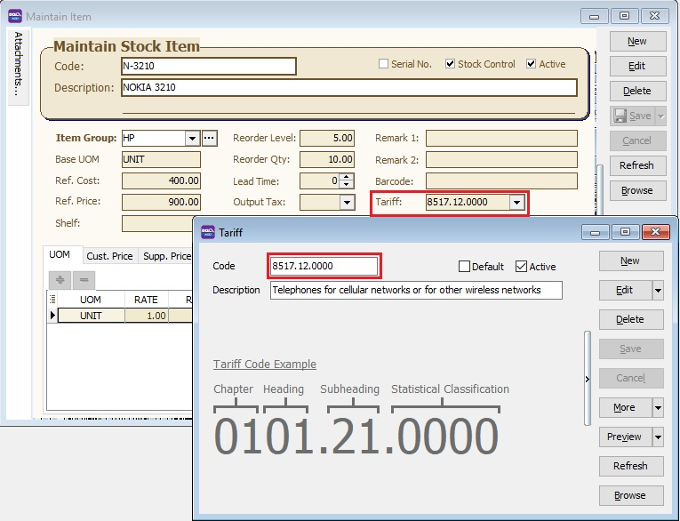

3. For exemption certificate case (under Schedule A, B, C), a tariff and tax code (SEA, SEB, SEC1, SEC2, SEC3, SEC4, SEC5) should set in [Maintain Customer](../../usage/customer/guide#maintain-customer) and [Maintain Supplier](../../usage/master-data#maintain-supplier) (Tariff code setting under Tax Tab).

   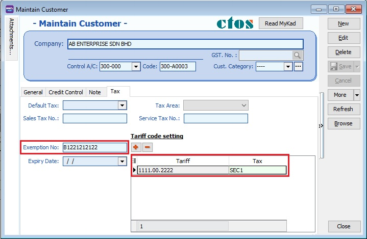
