## Tax Code and SST-02 Mapping

The images below show SST tax code structures and mapping to SST-02:

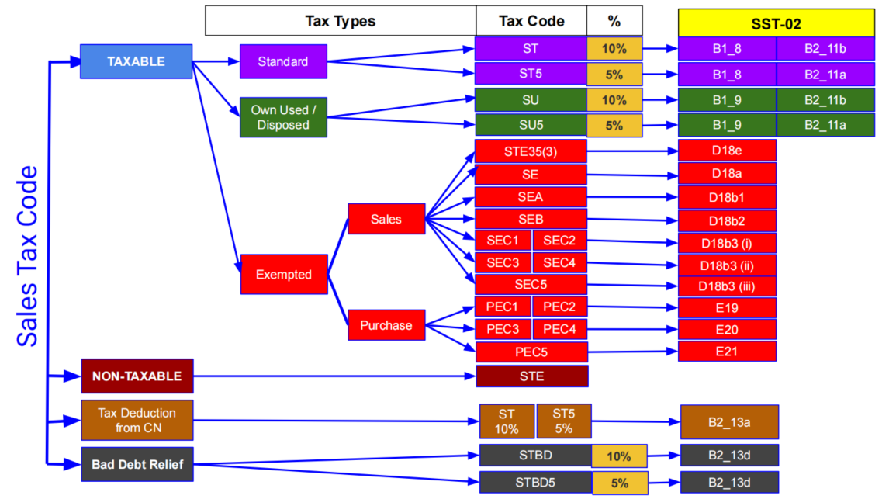

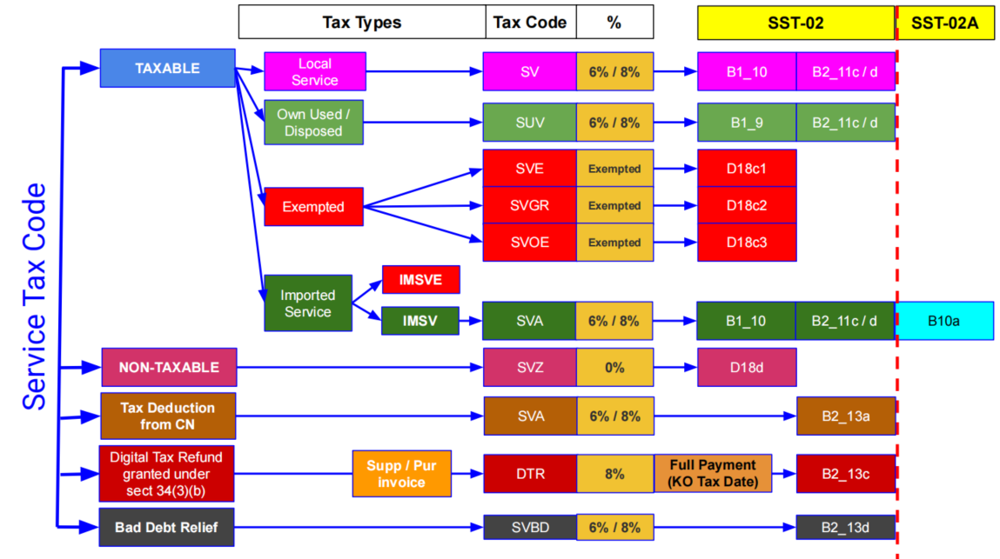

**Part A:**

   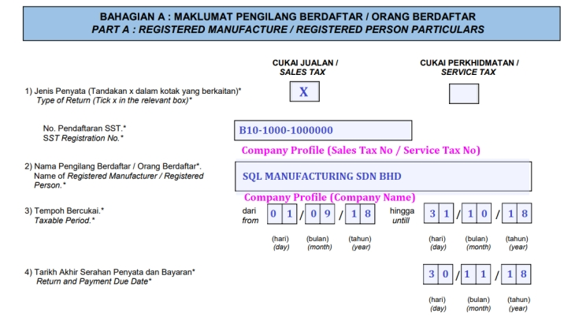

**Part B1:**

   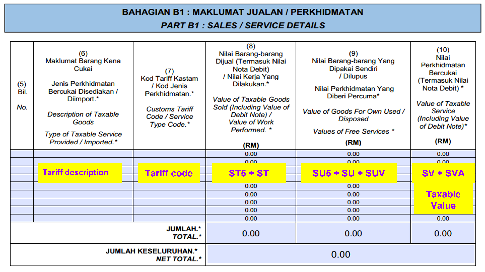

**Part B2:**

   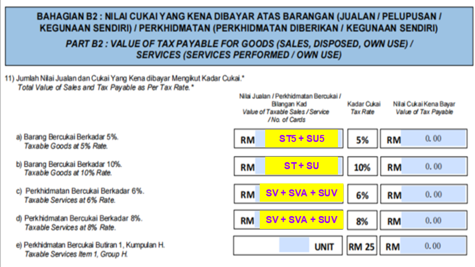

   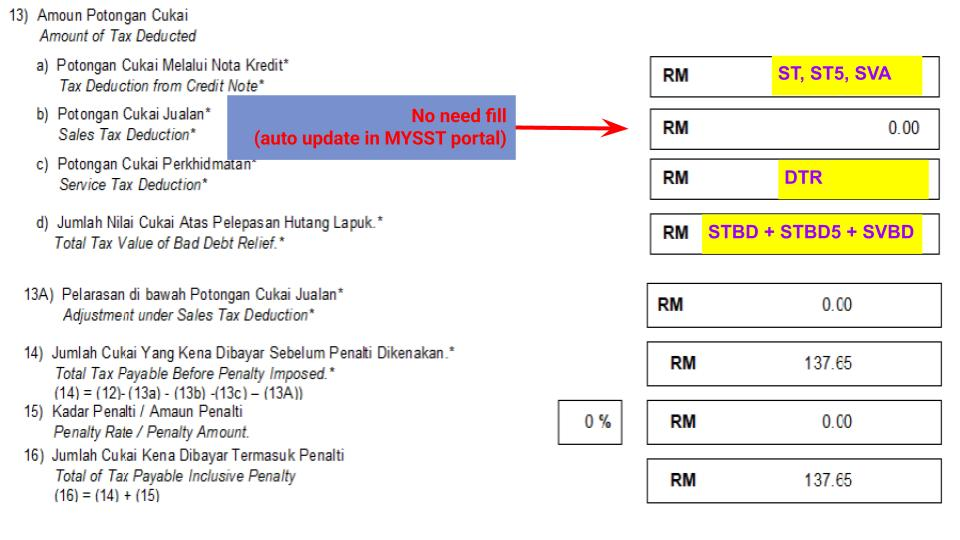

**Part C:**

   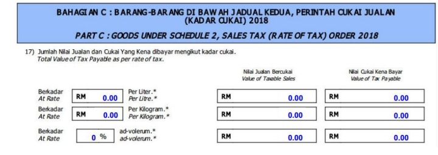

**Part D:**

   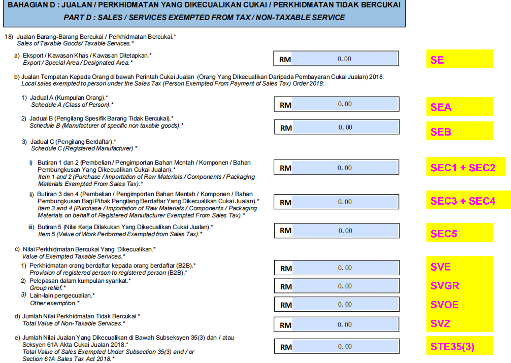

**Part E:**

   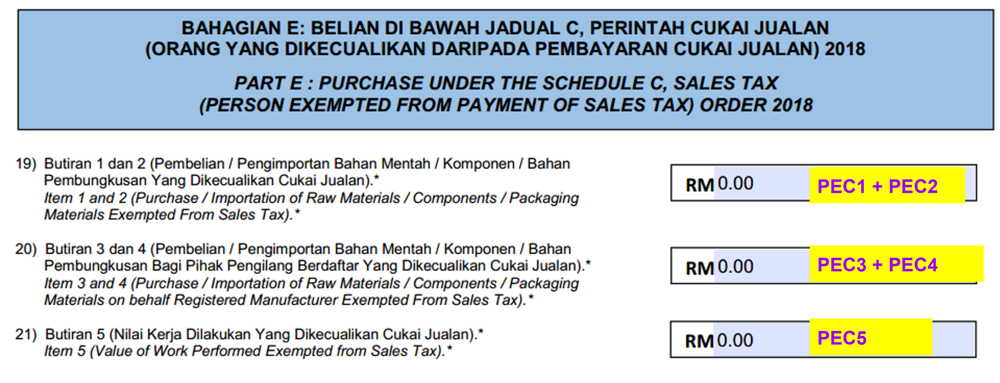

**Part F:**

   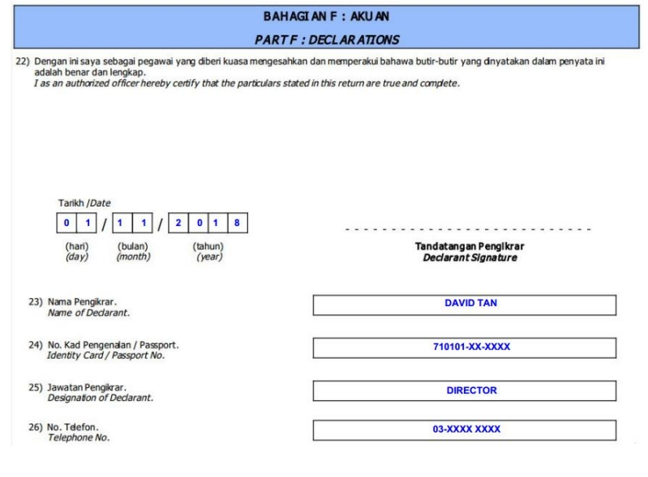

**Part G:**

   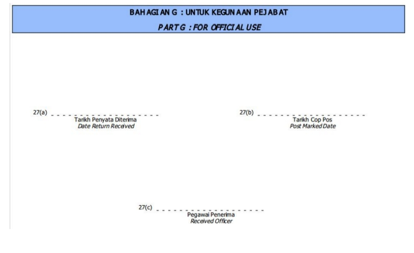

## Sales Tax Code

1) **Standard**

   | No | Tax Code | Description                                                               | Application                                                          | Tax Rate | SST-02       |
   |----|----------|---------------------------------------------------------------------------|----------------------------------------------------------------------|----------|--------------|
   | 01 | ST       | Sales Tax 10% charged to the taxable goods based on accrual/billing basis | Manufacture/processed products sold to local company at tax rate 10% | 10%      | B1_8, B2_11B |
   | 02 | ST5      | Sales Tax 5% charged to the taxable goods based on accrual/billing basis  | Manufacture/processed products sold to local company at tax rate 5%  | 5%       | B1_8, B2_11A |

2) **Deemed Supply (Own Used/Disposed)**

   | No | Tax Code | Description                                                                              | Application                                                          | Tax Rate | SST-02       |
   |----|----------|------------------------------------------------------------------------------------------|-------------|----------|--------------|
   | 01 | SU       | Goods Own Used/Disposed deemed taxable and charged at 10% based on accrual/billing basis | Products produced and self use it are deemed taxable at tax rate 10% | 10%      | B1_9, B2_11B |
   | 02 | SU5      | Goods Own Used/Disposed deemed taxable and charged at 5% based on accrual/billing basis  | Products produced and self use it are deemed taxable at tax rate 5%  | 5%       | B1_9, B2_11A |

3) **Sales - Exempted**

   | No | Tax Code | Description       | Application | Tax Rate | SST-02       |
   |----|----------|-------------------|-------------|----------|--------------|
   | 01 | STE      | Sales Tax Exempted on goods as prescribed in the Sales Tax (Goods Exempted From Tax) Order 2018                                                           | Specific manufacture products which are exempted from tax, eg. rice flour                                                | Exempted         |              |
   | 02 | SE       | Sales Tax Exempted to Export, Special Area (SA)       | Manufacture/processed products export to oversea or special area at tax rate exempted, eg. Free Zone, LMW and Area (DA), eg. Langkawi, Tioman, Labuan                   | Exempted         | D18_A        |
   | 03 | SEA      | Sales Tax Exempted-Sch A          | Class of Person, eg. Government, Local Authority Dept, etc. Detail refer to Schedule A in Sales Tax (Person Exempted From Payment Of Tax) Order 2018                     | Exempted           | D18_B1       |
   | 04 | SEB      | Sales Tax Exempted-Sch B  | Manufacturer of specific non-taxable goods. e.g. control products, medical. Detail refer to Schedule B in Sales Tax (Person Exempted From Payment Of Tax) Order 2018             | Exempted           | D18_B2       |
   | 05 | SEC1     | Sales Tax Exempted-Sch C (Item 1) | Raw materials, components and packaging materials **excluding PETROLEUM** imported/purchased from a reg. manufacturer/licensed warehouse by any reg. manufacturer          | Exempted           | D18_B3 (i)   |
   | 06 | SEC2     | Sales Tax Exempted-Sch C (Item 2) | Raw materials, components and packaging materials imported/purchased from a reg. manufacturer/licensed warehouse by any reg. manufacturer of **PETROLEUM** products      | Exempted           | D18_B3 (i)   |
   | 07 | SEC3     | Sales Tax Exempted-Sch C (Item 3) | Raw materials, components and packaging materials **excluding PETROLEUM** imported/purchased from a reg. manufacturer by any agent on behalf of a reg. manufacturer  | Exempted           | D18_B3 (ii)  |
   | 08 | SEC4     | Sales Tax Exempted-Sch C (Item 4) | Raw materials, components and packaging materials imported/purchased from a reg. manufacturer by any agent on behalf of a reg. manufacturer of **PETROLEUM** products      | Exempted           | D18_B3 (ii)  |
   | 09 | SEC5     | Sales Tax Exempted-Sch C (Item 5) | Semi-finished taxable goods or finished taxable goods which are subsequently returned by a subcontractor to a reg. manufacturer after completion of subcontract work | Exempted           | D18_B3 (iii) |
   | 10 | STE35(3) | Total value of Sales Exempted Under Subsection 35(3) and / or Section 61A Sales Tax Act 2018 | Products produced can  be exempted and approved by Minister under Subsection 35(s) and / or Section 61A Sales Tax Act 2016 | Exempted           | D18E |

4) **Bad Debt Relief**

   | No | Tax Code | Description       | Application | Tax Rate | SST-02      |
   |----|----------|-------------------|-------------|----------|-------------|
   | 01 | STBD     | Sales Tax Bad Debt Relief at tax rate 10%. Claimable within 6 years from the taxable service date, subject to DG approval | A registered sales tax company can request a tax refund for the paid sales tax from customs if unable to recover the arrears from the customer. | 10% | B2_13d |
   | 02 | STBD5    | Sales Tax Bad Debt Relief at tax rate 5%. Claimable within 6 years from the taxable service date, subject to DG approval  | A registered sales tax company can request a tax refund for the paid sales tax from customs if unable to recover the arrears from the customer. | 5%  | B2_13d |

## Service Tax Code

1) **Standard**

   | No | Tax Code | Description       | Application | Tax Rate | SST-02      |
   |----|----------|-------------------|-------------|----------|-------------|
   | 01 | SV       | Service Tax 6% / 8% charged to the taxable services based on payment basis                                                          | Service transaction charged at 6% / 8% follow the nature of business. Accounting as payment basis          | 6% / 8%       | B1_10, B2_11C |
   | 02 | SVA      | Service Tax 6% / 8% charged to the taxable service based on accrual/billing basis. It is used in IMSV tax code to report in SST-02A | Service transaction charged at 6% / 8% follow the nature of business. Accounting as Accrual/Billing basis  | 6% / 8%       | B1_10, B2_11C |

2) **Deemed Supply (Own Used/Disposed)**

   | No | Tax Code | Description                                             | Tax Rate | SST-02       |
   |----|----------|---------------------------------------------------------|----------|--------------|
   | 01 | SUV      | Service Own Used charged at 6% on accrual/billing basis | 6%       | B1_9, B2_11C |

3) **Service Exempted**

   Applicable to **same service provider** under:

      1) Group G to Group G (all except Employment and Guards protection service provider).
      2) Group I to Group I (ie. advertising service provider).

   | No | Tax Code | Description       | Application | Tax Rate | SST-02      |
   |----|----------|-------------------|-------------|----------|-------------|
   | 01 | SVE      | Service Tax Exempted between same service providers in Group G (excluding item j and k) or in Group I item 8 only. Refer to Service Tax (Person Exempted From Payment of Tax) Order 2018 | B2B Exemption | Exempted | D18C1 |
   | 02 | SVGR     | Service Tax Exempted related to Intra Group Relief | Group Relief    | Exempted  |  D18C2 |
   | 03 | SVOE     | Service Tax Exempted - Others                      | Other exemptions besides B2B exemption and Group Relief  (eg. Non-reviewable contracts are granted exempted for 1 year) | Exempted  | D18C3 |

4) **Imported Service**

   1) For non-Service Tax Registered must declare using **SST-02A**.
   2) For Service Tax Registered must declare using **SS-02**.

   | No | Tax Code | Description                                                                                                                                                                                             | Input Tax | Output Tax | SST-02       | SST-02A (for imported service) |
   |----|----------|---------------------------------------------------------------------------------------------------------------------------------------------------------------------------------------------------------|-----------|------------|--------------|--------------------------------|
   | 01 | IMSV     | Imported Service Tax, any company in Malaysia who acquire the taxable service from company outside Malaysia. Non-SST & Sales Tax reg. must report in SST-02A. Service tax reg. remains report in SST-02 | PSV (6%)  | SVA (6%)   | B1_10 B2_11C | B10a                           |
   | 02 | IMSVE    | Imported Service Tax Exempted between same service providers in Group G (excluding item j and k) or in Group I item 8 only. Refer to Service Tax (Person Exempted From Payment of Tax) Order 2018       | PSVE      | SVE        | D18C         |                                |

5) **Non-Taxable**

   | No | Tax Code | Description       | Application | Tax Rate | SST-02      |
   |----|----------|-------------------|-------------|----------|-------------|
   | 01 | SVZ      | Non-taxable services refer to transactions not subject to service tax | eg. healthcare facility given to citizen, residential buildings, related public amenities, etc | Not Subject to Service Tax | D18D |

6) **Bad Debt Relief**

   | No | Tax Code | Description       | Application | Tax Rate | SST-02      |
   |----|----------|-------------------|-------------|----------|-------------|
   | 01 | SVBD     | Service Tax Bad Debt Relief at tax rate 6%. Claimable within 6 years from the taxable service date, subject to DG approval | A registered service tax company can request a tax refund for the paid service tax from customs if unable to recover the arrears from the customer. | 6% / 8% | B2_13D |

## Purchase Tax Code

1) **Need Declare In SST-02**

   | No | Tax Code | Description       | Application | Tax Rate | SST-02      |
   |----|----------|-------------------|-------------|----------|-------------|
   | 01 | PEC1     | Purchase Tax Exempted-Sch C (Item 1) | Raw materials, components and packaging materials **excluding PETROLEUM** imported/purchased from a reg. manufacturer/licensed warehouse by any reg. manufacturer                | Exempted          | E19    |
   | 02 | PEC2     | Purchase Tax Exempted-Sch C (Item 2) | Raw materials, components and packaging materials imported/purchased from a reg. manufacturer/licensed warehouse by any reg. manufacturer of **PETROLEUM** products  | Exempted          | E19    |
   | 03 | PEC3     | Purchase Tax Exempted-Sch C (Item 3) | Raw materials, components and packaging materials **excluding PETROLEUM** imported/purchased from a reg. manufacturer by any agent on behalf of a reg. manufacturer           | Exempted          | E20    |
   | 04 | PEC4     | Purchase Tax Exempted-Sch C (Item 4) | Raw materials, components and packaging materials imported/purchased from a reg. manufacturer by any agent on behalf of a reg. manufacturer of **PETROLEUM** products  | Exempted          | E20    |
   | 05 | PEC5     | Purchase Tax Exempted-Sch C (Item 5) | Semi-finished taxable goods or finished taxable goods which are subsequently returned by a subcontractor to a reg. manufacturer after completion of subcontract work          | Exempted          | E21    |
   | 06 | DTR      | Digital Tax refund granted under section 34(3)(b) Service Tax Act 2018 by the offetting method based on the actual amount paid | Local service registered person who has paid imported digital service tax to a Foreign Service Provider (FSP). It is allow to claim a refund granted under section 34(3)(b) Service Tax Act 2018. | 8% | B2_13C |

2) **No Need Declare In SST-02**

   | No | Tax Code | Description       | Application | Tax Rate | SST-02      |
   |----|----------|-------------------|-------------|----------|-------------|
   | 01 | PST      | Purchase Sales Tax 10%        | Apply for purchase transactions involve Sales Tax rate at 10%. No claimable from Kastam.      | 10%       |
   | 02 | PST5     | Purchase Sales Tax 5%         | Apply for purchase transactions involve Sales Tax rate at 5%. No claimable from Kastam.       | 5%        |
   | 03 | PSV      | Purchase Service Tax 6%,8%    | Apply for service transactions involve Service Tax rate at 6% / 8%. No claimable from Kastam. | 6% / 8%   |
   | 04 | PSVE     | Purchase Service Tax Exempted | Apply for service transactions which is under same service providers between Group G (excluding item j and k) or Group I (item 8 only) or in Group J.  | Exempted  |

## Tariff Code

- Tariff classification is a complex yet extremely important aspect of cross-border trading.
- Goods imported from or to Malaysia are classified by the Harmonized Tariff Schedule (HTS) or commonly referred to as HS Codes.
- The codes, created by World Customs Organization (WCO), categorize up to 5,000 commodity
- HS Codes are made of 6-digit numbers that are recognized internationally, though different countries can extend the numbers by two or four digits to define commodities at a more detailed level.
- [Click this link here](https://ezhs.customs.gov.my/) to search the tariff code list from Kastam system.

### Quick Setup for Tariff Code

1. Create the tariff code applicable to your product at [Maintain Tariff](../../usage/first-time-setup#maintain-tariff).

   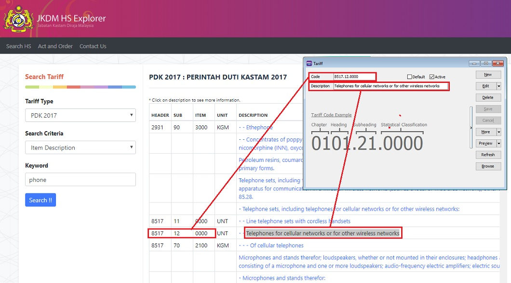

2. Pick a tariff code for an items at [Maintain Stock Item](../../usage/master-data#maintain-stock-item).

   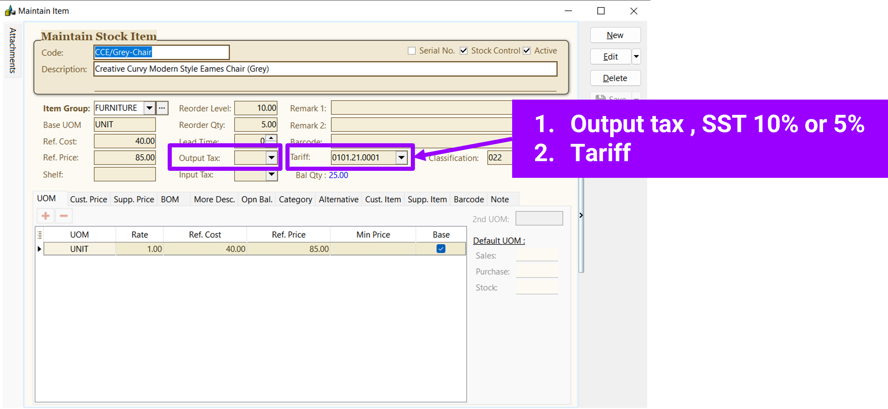

3. For exemption certificate case (under Schedule A, B, C), a tariff and tax code (SEA, SEB, SEC1, SEC2, SEC3, SEC4, SEC5) should set in [Maintain Customer](../../usage/customer/guide#maintain-customer) and [Maintain Supplier](../../usage/master-data#maintain-supplier) (Tariff code setting under Tax Tab).

   **Maintain Customer**
   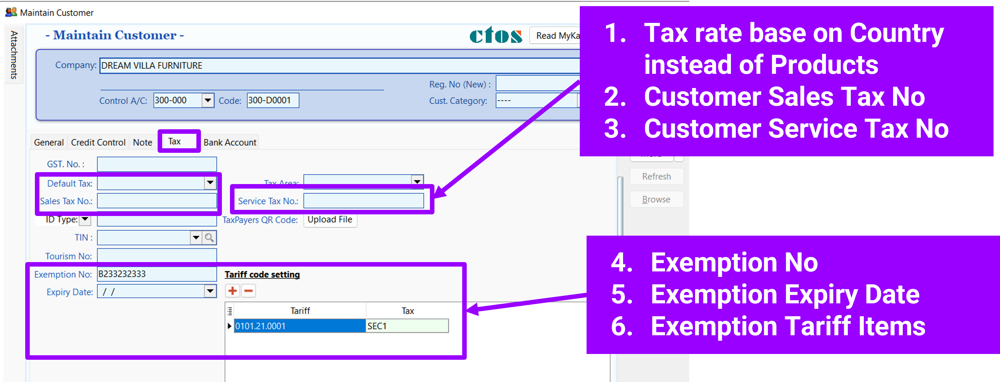

   **Maintain Supplier**
   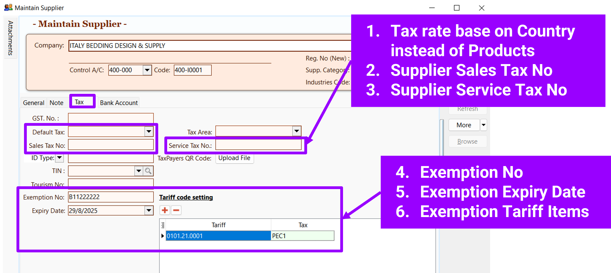
