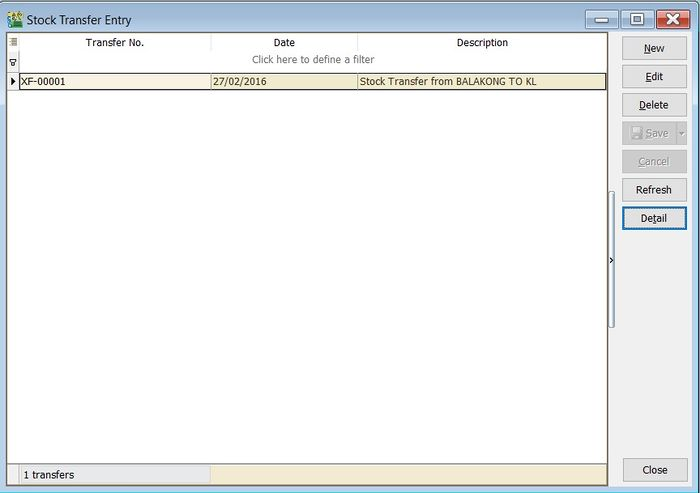
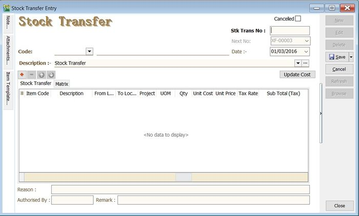
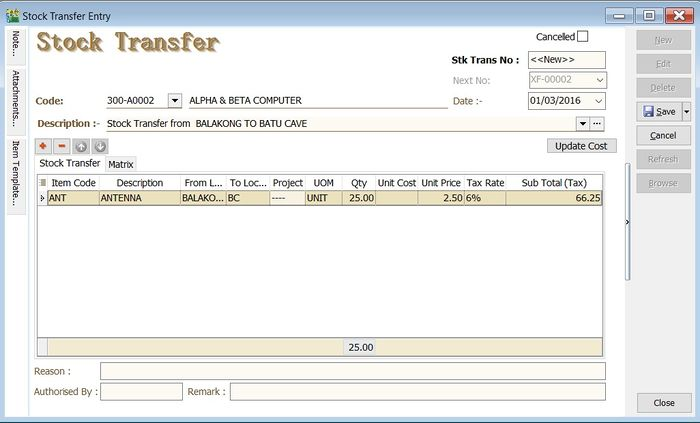
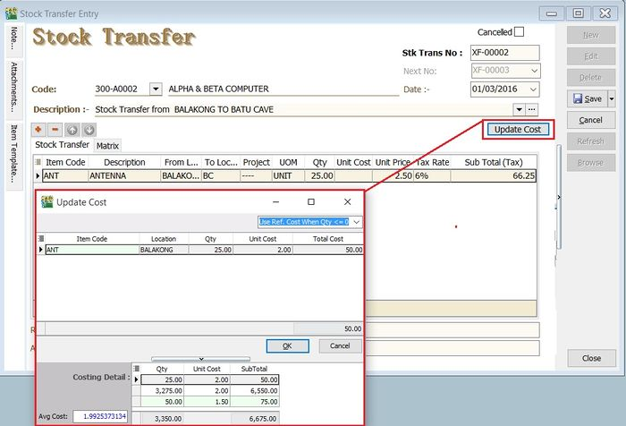

## Stock Received

Allows user to increase stock quantity without purchasing. It is normally used when you have assembled or manufactured finished goods. Just key-in the item code, quantity IN and cost that you want.

1. **Stock** > **Stock Received** > **New**.

   

## Stock Issue

Allows user to **decrease stock quantity without selling**. It is normally used when you consume raw material during assembly or when manufacturing finished goods or even sometimes for internal usage. Just key-in the item code, quantity OUT and cost and you may also click on the Update Cost, then the system will auto-detect the actual costing base on your document date.

1. **Stock** > **Stock Issue** > **New**.

   

## Stock Transfer 
**Stock Transfer** is an entry to handle the stock movement from one location to another location, **eg. location A to B**. Commonly use for:
- Consignment stock;
- Van sales location represent van;
- Inter branch transfer;
- Goods in transit;

1. Click on **New**.

2. Enter the **Description** to describe the stock transfer entry, eg. "Stock Transfer from BALAKONG TO BATU CAVE".
3. Add the items to be transfer.
4. You may enter the **reason, remark and authorised by** for future reference.

5. Click on **Save** to commit the stock movement between the locations.
6. For some circumstances, it is required to select the customer code and enter the unit price, tax code, tax amount and subtotal for consignment sales.

### Update Cost
1. You update the unit cost by click on **Update Cost** button.
2. System will based on the update cost method to retrieve the unit cost for each items. There are:

<table class="table-small">
  <thead>
    <tr>
      <th>No.</th>
      <th>Update Cost Method</th>
      <th>Explanation</th>
    </tr>
  </thead>
  <tbody>
    <tr>
      <td>1</td>
      <td>Use Ref.Cost When Qty &lt;= 0 (by default)</td>
      <td>If qty balance below 0, unit cost will update with Reference Cost from Maintain Stock Item.</td>
    </tr>
    <tr>
      <td>2</td>
      <td>Use Strict Costing</td>
      <td>Unit cost calculated from the Costing Method set in Maintain Stock Group.</td>
    </tr>
    <tr>
      <td>3</td>
      <td>Use Serial Number Costing</td>
      <td>Unit cost will be based on the serial number.</td>
    </tr>
  </tbody>
</table>

## Stock Adjustment / Stock Take

:::success[INFO]
Check out our new [Stock Take App](https://www.sql.com.my/sqlstocktake/)
:::

Allows user to key-in quantity in and quantity out from the system, just like a combination of stock received and stock issue. Normally used for stock take purposes. **(Stock > Stock Adjustment > New)**

:::info
Watch tutorial video here: [Youtube](https://www.youtube.com/watch?v=uEbCRAftQ4A&feature=youtu.be)
:::

1. Click on **Stock**

2. Choose **Print Stock Physical Worksheet**

3. **Filter** by date, stock group or others **information** that you want to do for the stock take, please **make sure that you choose the correct location and batch if you have these two modules**.

   

4. lick on Preview & choose your report format.

   

5. **Print out the “Stock Take Sheet”** for stock keeper.

   The stock keeper should manually **fill in the actual quantity into the “physical qty” column**.

   

6. After complete updating the stock take report by your stock-keeper, do your stock adjustment in system from **Stock** > **Stock Adjustment** > **and drag out Book Qty and Physical Qty**.

   

   

7. Click on the first item in **Stock Physical Worksheet**, press on **Ctrl + A** on the keyboard to select all items.

   **Then Drag & Drop into Stock Adjustment**.

   

8. Based on the stock keeper’s Stock Take Report, **fill in the actual physical quantity** in your warehouse into the Stock Adjustment **Physical Qty column**, the system will calculate the variance based on the Book Qty and apply a correction to the Qty column.

   :::note

   **Book Qty** = Quantity that is recorded in system.

   **Physical Qty** = Actual Quantity at your warehouse.

   **Qty** = Variance between Physical and Book Quantity, system will auto-adjust then update accordingly. (Physical Qty – Book Qty)

   :::
